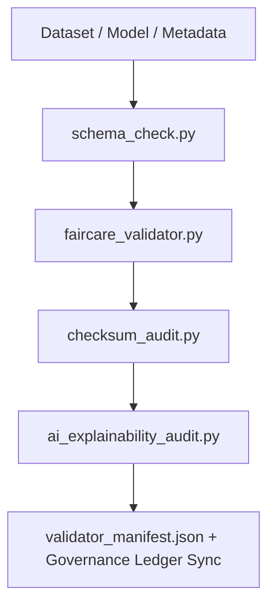

<div align="center">

# ✅ **Kansas Frontier Matrix — Validation & FAIR+CARE Compliance Tools**
`tools/validation/README.md`

**Purpose:**  
Run reproducible **schema, checksum, ethics, and explainability** validations across all KFM pipelines to guarantee integrity, transparency, and governance compliance.  
This suite enforces MCP-DL v6.3 and FAIR+CARE standards with ISO-aligned metadata and telemetry-backed auditability.

[](../../../docs/standards/faircare-validation.md)
[](../../../LICENSE)
[]()
[](../../../docs/architecture/repo-focus.md)

</div>

---

## 📘 Overview

The **Validation Tools Directory** automates checks for structure, lineage, accessibility, and ethics—spanning ETL datasets, AI models, and documentation artifacts.  
Outputs are checksum-locked, ledger-registered, and exported to telemetry for verifiable public reporting.

---

## 🗂️ Directory Layout

```plaintext
tools/validation/
├── README.md
│
├── faircare_validator.py           # FAIR+CARE ethics and accessibility audits
├── schema_check.py                 # STAC/DCAT/ISO schema validation
├── ai_explainability_audit.py      # Explainability + bias verification for AI
├── checksum_audit.py               # Cross-stage checksum lineage verification
├── validator_manifest.json         # Aggregated validation summary + refs
└── metadata.json                   # Provenance + checksum for validation runs
```

---

## 🧩 Validation Workflow



1. **Schema QA:** Verify structure, contracts, and interoperability.  
2. **Ethics Audit:** Confirm accessibility, licensing, and CARE fields.  
3. **Integrity:** Validate SHA-256 lineage across lifecycle stages.  
4. **Explainability:** Assess model transparency and bias indicators.  
5. **Governance:** Register results in ledger and export telemetry.

---

## 🧾 Example Validation Metadata

```json
{
  "id": "validation_session_v9.7.0_2025Q4",
  "validated_assets": [
    "data/work/processed/climate/climate_summary.parquet",
    "data/work/processed/hazards/hazards_composite.geojson"
  ],
  "schema_passed": true,
  "checksum_verified": true,
  "faircare_compliant": true,
  "ai_explainability_score": 0.994,
  "bias_detected": false,
  "governance_registered": true,
  "validator": "@kfm-validation-lab",
  "created": "2025-11-05T12:30:00Z",
  "governance_ref": "data/reports/audit/data_provenance_ledger.json"
}
```

---

## 🧠 FAIR+CARE Governance Matrix

| Principle | Implementation | Oversight |
|-----------|----------------|-----------|
| **Findable** | Validation reports indexed in manifest + ledger. | @kfm-data |
| **Accessible** | Logs published under MIT for reproducibility. | @kfm-accessibility |
| **Interoperable** | STAC/DCAT/ISO + FAIR+CARE schema alignment. | @kfm-architecture |
| **Reusable** | Modular scripts usable across domains. | @kfm-design |
| **Collective Benefit** | Builds trust via transparent validation. | @faircare-council |
| **Authority to Control** | Council certifies validation outcomes. | @kfm-governance |
| **Responsibility** | Validators maintain checksum and ethics lineage. | @kfm-security |
| **Ethics** | Ensures explainable, fair, and accessible outputs. | @kfm-ethics |

Audit references:  
`data/reports/fair/data_care_assessment.json` · `data/reports/audit/data_provenance_ledger.json`

---

## ⚙️ Key Validation Tools

| Tool | Description | Gate |
|------|-------------|------|
| `faircare_validator.py` | Ethics + accessibility audit runner. | FAIR+CARE |
| `schema_check.py` | Structural validation for STAC/DCAT/ISO schemas. | Schema |
| `checksum_audit.py` | End-to-end SHA-256 lineage verification. | Integrity |
| `ai_explainability_audit.py` | Model transparency + bias analysis. | AI Ethics |
| `validator_manifest.json` | Aggregated summary for governance. | Release |

Automations coordinated via `validation_sync.yml`.

---

## ⚖️ Retention & Provenance Policy

| Artifact | Retention | Policy |
|---------|-----------|-------|
| Schema Reports | 180 Days | Archived for re-certification |
| FAIR+CARE Audits | 365 Days | Ethics transparency records |
| Checksum Reports | Permanent | Immutable ledger storage |
| Metadata | Permanent | Versioned provenance |

Cleanup via `validation_cleanup.yml`.

---

## 🌱 Sustainability Metrics

| Metric | Value | Verified By |
|--------|------|-------------|
| Avg Power / Validation | 2.1 Wh | @kfm-sustainability |
| Carbon Output | 2.7 gCO₂e | @kfm-security |
| Renewable Power | 100% (RE100) | @kfm-infrastructure |
| FAIR+CARE Compliance | 100% | @faircare-council |

Telemetry recorded in:  
`../../../releases/v9.7.0/focus-telemetry.json`

---

## 🧾 Internal Use Citation

```text
Kansas Frontier Matrix (2025). Validation & FAIR+CARE Compliance Tools (v9.7.0).
Automated integrity, ethics, and explainability validation for data and AI pipelines with ledger-synced governance outputs.
```

---

## 🕰️ Version History

| Version | Date | Notes |
|---------|------|------|
| v9.7.0 | 2025-11-05 | Upgraded telemetry schema and governance integration; refined explainability scoring. |
| v9.6.0 | 2025-11-03 | Added checksum lineage automation and cross-domain schema checks. |
| v9.5.0 | 2025-11-02 | Established FAIR+CARE validation gates and reporting. |

---

<div align="center">

**Kansas Frontier Matrix** · *Data Integrity × FAIR+CARE Ethics × Provenance Validation*  
[🔗 Repository](../../) • [🧭 Docs Portal](../../../docs/) • [⚖️ Governance Ledger](../../../docs/standards/governance/ROOT-GOVERNANCE.md)

</div>