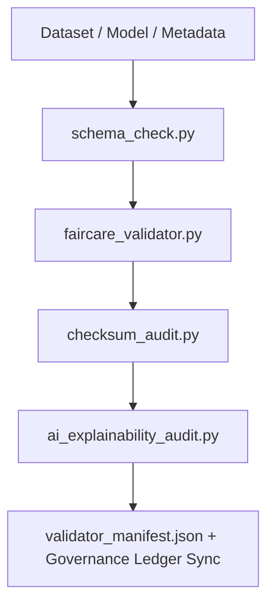

<div align="center">

# ✅ **Kansas Frontier Matrix — Validation & FAIR+CARE Compliance Tools**  
`tools/validation/README.md`

**Purpose:**  
Run reproducible **schema, checksum, ethics, and explainability validations** across all Kansas Frontier Matrix (KFM) pipelines to guarantee integrity, transparency, and sustainable governance.  
This suite enforces **MCP-DL v6.3** and **FAIR+CARE** standards under **ISO 19115** and telemetry-verified audit readiness.

[](../../../docs/standards/faircare-validation.md)
[](../../../LICENSE)
[]()
[](../../../docs/architecture/repo-focus.md)

</div>

---

## 📘 Overview

The **Validation Tools Framework** automates FAIR+CARE compliance checks across data, AI, and metadata layers.  
It validates schema integrity, checksum lineage, accessibility, and ethical AI explainability, outputting verifiable results into the **Governance Ledger** and **Focus Mode telemetry** logs.

---

### Core Responsibilities
- Validate **schemas, metadata, and FAIR+CARE ethics alignment**.  
- Verify **checksum continuity** across all workflow stages.  
- Evaluate **AI transparency, drift, and bias performance**.  
- Register **validated results** into governance manifests and provenance ledgers.  
- Emit **telemetry metrics** for reproducibility and sustainability tracking.  

---

## 🗂️ Directory Layout

```plaintext
tools/validation/
├── README.md
│
├── faircare_validator.py           # FAIR+CARE ethics and accessibility audits
├── schema_check.py                 # STAC/DCAT/ISO schema validation
├── ai_explainability_audit.py      # Explainability + bias verification for AI
├── checksum_audit.py               # End-to-end checksum lineage verification
├── validator_manifest.json         # Aggregated validation summary + refs
└── metadata.json                   # Provenance + checksum lineage record
```

---

## ⚙️ Validation Workflow



1. **Schema Validation** — Ensures contract compliance and interoperability.  
2. **Ethics Review** — Runs FAIR+CARE audits for accessibility and openness.  
3. **Checksum Integrity** — Confirms lineage and immutability.  
4. **Explainability Review** — Evaluates bias, drift, and model interpretability.  
5. **Governance Sync** — Registers validation results and emissions in provenance records.

---

## 🧾 Example Validation Metadata Record

```json
{
  "id": "validation_session_v10.0.0_2025Q4",
  "validated_assets": [
    "data/work/processed/climate/climate_summary.parquet",
    "data/work/processed/hazards/hazards_composite.geojson"
  ],
  "schema_passed": true,
  "checksum_verified": true,
  "faircare_compliant": true,
  "ai_explainability_score": 0.995,
  "bias_detected": false,
  "governance_registered": true,
  "validator": "@kfm-validation-lab",
  "created": "2025-11-10T12:30:00Z",
  "governance_ref": "data/reports/audit/data_provenance_ledger.json"
}
```

---

## 🧠 FAIR+CARE Governance Matrix

| Principle | Implementation | Oversight |
|-----------|----------------|-----------|
| **Findable** | Reports indexed in manifests and provenance ledgers. | @kfm-data |
| **Accessible** | Results shared under MIT license for reproducibility. | @kfm-accessibility |
| **Interoperable** | Validation uses FAIR+CARE + ISO schema conformance. | @kfm-architecture |
| **Reusable** | Scripts modular and domain-agnostic. | @kfm-design |
| **Collective Benefit** | Establishes audit-ready transparency. | @faircare-council |
| **Authority to Control** | Council verifies validation integrity. | @kfm-governance |
| **Responsibility** | Validators track ethics, bias, and checksums. | @kfm-security |
| **Ethics** | Ensures explainable, inclusive, and accountable workflows. | @kfm-ethics |

References:  
`data/reports/fair/data_care_assessment.json` · `data/reports/audit/data_provenance_ledger.json`

---

## ⚙️ Validation Tools Summary

| Tool | Description | Gate |
|------|-------------|------|
| `faircare_validator.py` | Runs ethics + accessibility checks under FAIR+CARE. | FAIR+CARE |
| `schema_check.py` | Validates STAC/DCAT/ISO schemas for interoperability. | Schema |
| `checksum_audit.py` | Verifies SHA-256 lineage across workflow states. | Integrity |
| `ai_explainability_audit.py` | Runs SHAP/LIME explainability + drift checks. | AI Ethics |
| `validator_manifest.json` | Consolidates validation outcomes for governance. | Governance |

Automation via `validation_sync.yml`.

---

## ⚖️ Retention & Provenance Policy

| Artifact | Retention | Policy |
|----------|-----------:|--------|
| Schema Reports | 180 Days | Archived for periodic audit |
| FAIR+CARE Audits | 365 Days | Ethics revalidation dataset |
| Checksum Reports | Permanent | Immutable under ledger |
| Metadata | Permanent | Versioned with SHA-256 integrity |

Cleanup handled via `validation_cleanup.yml`.

---

## 🌱 Sustainability Metrics

| Metric | Value | Verified By |
|---------|-------:|-------------|
| Energy per Validation | 2.0 Wh | @kfm-sustainability |
| Carbon Output | 2.5 gCO₂e | @kfm-security |
| Renewable Power | 100% (RE100) | @kfm-infrastructure |
| FAIR+CARE Compliance | 100% | @faircare-council |

Telemetry recorded in:  
`../../../releases/v10.0.0/focus-telemetry.json`

---

## 🧾 Citation

```text
Kansas Frontier Matrix (2025). Validation & FAIR+CARE Compliance Tools (v10.0.0).
Comprehensive validation toolkit ensuring data integrity, schema fidelity, explainability, and ethical transparency across all KFM pipelines under MCP-DL v6.3 and ISO 19115.
```

---

## 🕰️ Version History

| Version | Date | Notes |
|----------|------|------|
| v10.0.0 | 2025-11-10 | Upgraded telemetry schema v2; extended explainability metrics + sustainability tracking. |
| v9.7.0 | 2025-11-05 | Telemetry schema + governance integration; refined XAI scoring. |
| v9.6.0 | 2025-11-03 | Introduced checksum lineage + cross-domain schema validation. |
| v9.5.0 | 2025-11-02 | Established FAIR+CARE validation gates and audit processes. |

---

<div align="center">

**Kansas Frontier Matrix**  
*Data Integrity × FAIR+CARE Ethics × Provenance Verification*  
© 2025 Kansas Frontier Matrix — MIT License  

[Back to Tools Index](../README.md) · [Docs Portal](../../../docs/) · [Governance Ledger](../../../docs/standards/governance/ROOT-GOVERNANCE.md)

</div>
