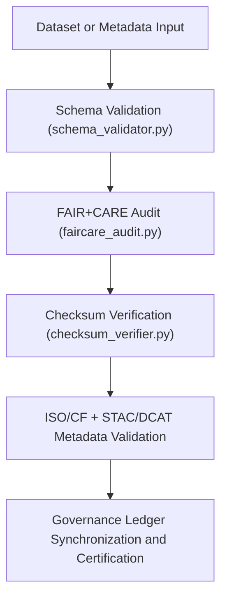

<div align="center">

# ✅ Kansas Frontier Matrix — **Validation Tools**
`tools/validation/README.md`

**Purpose:**  
FAIR+CARE-certified suite of **schema validation, checksum verification, and ethics audit tools** for maintaining data integrity, reproducibility, and governance compliance within the Kansas Frontier Matrix (KFM).  
These tools ensure that every dataset, model output, and workflow meets FAIR+CARE ethical and technical standards before publication or archival.

[](../../../docs/standards/faircare-validation.md)
[](../../../LICENSE)
[](../../../docs/architecture/repo-focus.md)

</div>

---

## 📚 Overview

The `tools/validation/` directory contains utilities that perform **automated validation across KFM’s FAIR+CARE-governed data ecosystem**, including schema auditing, ethics evaluation, and checksum verification.  
These tools are designed for cross-domain validation, supporting datasets, AI pipelines, and governance artifacts alike.

### Core Responsibilities
- Validate data schema compliance across all project domains.  
- Perform FAIR+CARE ethical audits and accessibility checks.  
- Verify file integrity via checksum comparison and manifest registry.  
- Generate audit-ready validation reports for governance synchronization.  

---

## 🗂️ Directory Layout

```plaintext
tools/validation/
├── README.md                              # This file — documentation for Validation Tools
│
├── schema_validator.py                    # Checks schema compliance for datasets and metadata
├── faircare_audit.py                      # Runs FAIR+CARE governance validation on datasets and workflows
├── iso_cf_checker.py                      # Validates compliance with ISO and CF metadata standards
├── checksum_verifier.py                   # Performs SHA-256 checksum validation
├── stac_dcat_validator.py                 # Ensures metadata compatibility with STAC and DCAT 3.0
└── metadata.json                          # Provenance and governance linkage record
```

---

## ⚙️ Validation Workflow



### Workflow Description
1. **Schema Validation:** Confirms datasets adhere to the latest KFM data contract.  
2. **Ethics Audit:** Evaluates FAIR+CARE principles for openness, accessibility, and collective benefit.  
3. **Checksum Verification:** Recomputes and compares SHA-256 hashes for data integrity.  
4. **Metadata Validation:** Ensures global compliance with CF, ISO 19115, and STAC/DCAT schemas.  
5. **Governance Registration:** Certifies validation outcomes in immutable provenance ledgers.  

---

## 🧩 Example Validation Metadata Record

```json
{
  "id": "validation_tools_v9.5.0_2025Q4",
  "tools_executed": [
    "schema_validator.py",
    "faircare_audit.py",
    "checksum_verifier.py"
  ],
  "datasets_validated": 438,
  "checksum_verified": true,
  "schema_compliance": 99.7,
  "fairstatus": "certified",
  "governance_registered": true,
  "telemetry_ref": "releases/v9.5.0/focus-telemetry.json",
  "governance_ref": "reports/audit/ai_validation_ledger.json",
  "created": "2025-11-02T23:59:00Z",
  "validator": "@kfm-validation"
}
```

---

## 🧠 FAIR+CARE Governance Matrix

| Principle | Implementation |
|------------|----------------|
| **Findable** | Validation results indexed with checksum and governance IDs. |
| **Accessible** | Reports and logs stored in open formats for transparency. |
| **Interoperable** | Supports FAIR, CARE, STAC, DCAT, ISO 19115, and CF standards. |
| **Reusable** | Validation artifacts archived for long-term reproducibility. |
| **Collective Benefit** | Promotes data integrity and ethical governance. |
| **Authority to Control** | FAIR+CARE Council reviews validation results before publication. |
| **Responsibility** | Validators document schema, checksum, and ethics outcomes. |
| **Ethics** | Ensures adherence to equitable data stewardship principles. |

Governance outputs recorded in:  
`reports/audit/ai_validation_ledger.json` • `reports/fair/validation_tools_summary.json`

---

## ⚙️ Validation Tools Summary

| Tool | Description | FAIR+CARE Function |
|------|--------------|--------------------|
| `schema_validator.py` | Checks dataset and metadata compliance with KFM data contract. | Schema QA |
| `faircare_audit.py` | Evaluates FAIR+CARE ethics, accessibility, and governance adherence. | Ethics Validation |
| `iso_cf_checker.py` | Validates compliance with ISO/CF metadata standards. | Standards Conformance |
| `checksum_verifier.py` | Computes and verifies cryptographic hashes for reproducibility. | Integrity Validation |
| `stac_dcat_validator.py` | Ensures interoperability with global metadata frameworks. | Metadata Governance |

Automation handled by `validation_tools_sync.yml`.

---

## 🧾 Retention Policy

| File Type | Retention Duration | Policy |
|------------|--------------------|--------|
| Validation Logs | 90 days | Archived after governance registration. |
| FAIR+CARE Reports | 365 days | Retained for ethics and audit review. |
| Checksum Records | Permanent | Stored for lineage and reproducibility. |
| Metadata | Permanent | Maintained for governance linkage and re-audits. |

Cleanup automated via `validation_tools_cleanup.yml`.

---

## 🧾 Internal Use Citation

```text
Kansas Frontier Matrix (2025). Validation Tools (v9.5.0).
FAIR+CARE-certified suite for schema validation, checksum verification, and ethics auditing.
Ensures transparent, reproducible, and ethical governance under MCP-DL v6.3 compliance.
```

---

## 🧾 Version Notes

| Version | Date | Notes |
|----------|------|--------|
| v9.5.0 | 2025-11-02 | Added STAC/DCAT metadata validator and checksum automation registry. |
| v9.3.2 | 2025-10-28 | Enhanced FAIR+CARE audit reporting and ISO/CF schema validation. |
| v9.3.0 | 2025-10-26 | Established Validation Tools workspace for FAIR+CARE compliance automation. |

---

<div align="center">

**Kansas Frontier Matrix** · *Quality Assurance × FAIR+CARE Ethics × Provenance Certification*  
[🔗 Repository](https://github.com/bartytime4life/Kansas-Frontier-Matrix) • [🧭 Docs Portal](../../../docs/) • [⚖️ Governance Ledger](../../../docs/standards/governance/)

</div>

