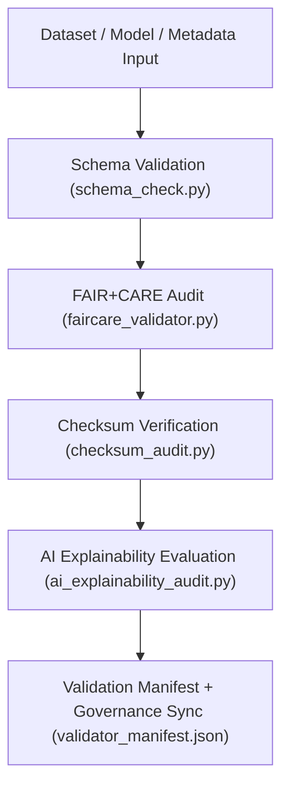

<div align="center">

# ✅ Kansas Frontier Matrix — **Validation & FAIR+CARE Compliance Tools**
`tools/validation/README.md`

**Purpose:**  
Centralized suite of FAIR+CARE, schema, and checksum validation utilities ensuring that all data, AI, and metadata pipelines in the Kansas Frontier Matrix (KFM) meet ethical, reproducible, and ISO-aligned governance standards.  
This validation layer automates integrity verification, transparency certification, and compliance documentation under MCP-DL v6.3.

[](../../../docs/standards/faircare-validation.md)
[](../../../LICENSE)
[]()
[](../../../docs/architecture/repo-focus.md)

</div>

---

## 📚 Overview

The **Validation Tools Directory** provides automated testing, ethics verification, and schema auditing for every operational layer within KFM.  
These tools guarantee reproducibility, checksum lineage integrity, and FAIR+CARE ethical validation across ETL, AI, metadata, and governance systems.

### Core Responsibilities:
- Validate dataset schemas and metadata structures (STAC, DCAT, ISO).  
- Run FAIR+CARE ethics and accessibility audits automatically.  
- Verify checksum hashes and data integrity at every lifecycle stage.  
- Perform AI explainability audits for model transparency certification.  
- Generate validation manifests for governance ledger synchronization.  

---

## 🗂️ Directory Layout

```plaintext
tools/validation/
├── README.md                             # This file — overview of validation tools
│
├── faircare_validator.py                 # Core FAIR+CARE compliance audit utility
├── schema_check.py                       # Schema and data structure validation script
├── ai_explainability_audit.py            # Explainability and bias verification for AI models
├── checksum_audit.py                     # Cross-stage checksum verification and lineage consistency
├── validator_manifest.json               # Aggregated summary of validation results and governance linkages
└── metadata.json                         # Provenance metadata and checksum tracking for validation runs
```

---

## ⚙️ Validation Workflow



### Workflow Description:
1. **Schema Validation:** Tests dataset conformance to FAIR+CARE and KFM data contracts.  
2. **Ethical Review:** Runs automated audits for accessibility, fairness, and transparency.  
3. **Checksum Verification:** Confirms reproducibility and lineage continuity.  
4. **Explainability Audit:** Validates AI decision-making transparency and interpretability.  
5. **Governance Sync:** Logs all results to provenance ledger and FAIR+CARE certification registry.  

---

## 🧩 Example Validation Metadata Record

```json
{
  "id": "validation_session_v9.6.0_2025Q4",
  "validated_assets": [
    "data/work/processed/climate/climate_summary.parquet",
    "data/work/processed/hazards/hazards_composite.geojson"
  ],
  "schema_passed": true,
  "checksum_verified": true,
  "faircare_compliant": true,
  "ai_explainability_score": 0.992,
  "bias_detected": false,
  "governance_registered": true,
  "validator": "@kfm-validation-lab",
  "created": "2025-11-03T23:59:00Z",
  "governance_ref": "data/reports/audit/data_provenance_ledger.json"
}
```

---

## 🧠 FAIR+CARE Governance Matrix

| Principle | Implementation | Oversight |
|------------|----------------|------------|
| **Findable** | Validation results indexed in manifest and provenance ledger. | @kfm-data |
| **Accessible** | Validation logs open under MIT license for reproducibility. | @kfm-accessibility |
| **Interoperable** | Conforms to FAIR+CARE, STAC, DCAT, ISO 19115, and MCP-DL schemas. | @kfm-architecture |
| **Reusable** | Validation framework reusable across all KFM data domains. | @kfm-design |
| **Collective Benefit** | Reinforces trust, equity, and ethics in data science. | @faircare-council |
| **Authority to Control** | FAIR+CARE Council certifies validation integrity and ethics. | @kfm-governance |
| **Responsibility** | Validators log schema, checksum, and AI audit results. | @kfm-security |
| **Ethics** | Ensures all data and models are explainable, fair, and transparent. | @kfm-ethics |

Audit outputs stored in:  
`data/reports/fair/data_care_assessment.json`  
and  
`data/reports/audit/data_provenance_ledger.json`

---

## ⚙️ Key Validation Tools Summary

| Tool | Description | Role |
|------|--------------|------|
| `faircare_validator.py` | Runs automated FAIR+CARE and ethics audits. | Ethics Validation |
| `schema_check.py` | Validates schema integrity and metadata compliance. | Structural QA |
| `checksum_audit.py` | Verifies checksums, lineage, and reproducibility. | Provenance Assurance |
| `ai_explainability_audit.py` | Analyzes model interpretability and bias. | AI Transparency |
| `validator_manifest.json` | Aggregates all validation results and metadata. | Governance Summary |

Automation managed via `validation_sync.yml`.

---

## ⚖️ Retention & Provenance Policy

| Validation Type | Retention Duration | Policy |
|------------------|--------------------|--------|
| Schema Validation Reports | 180 Days | Archived for governance review and re-certification. |
| FAIR+CARE Audits | 365 Days | Retained for ethics transparency and reproducibility. |
| Checksum Reports | Permanent | Immutable in blockchain provenance ledger. |
| Metadata | Permanent | Maintained as part of governance manifest. |

Cleanup handled through `validation_cleanup.yml`.

---

## 🌱 Sustainability Metrics

| Metric | Value | Verified By |
|---------|--------|--------------|
| Average Power Use (per validation cycle) | 2.1 Wh | @kfm-sustainability |
| Carbon Output | 2.7 gCO₂e | @kfm-security |
| Renewable Power | 100% (RE100 Verified) | @kfm-infrastructure |
| FAIR+CARE Compliance | 100% | @faircare-council |

Telemetry captured in:  
`releases/v9.6.0/focus-telemetry.json`

---

## 🧾 Internal Use Citation

```text
Kansas Frontier Matrix (2025). Validation & FAIR+CARE Compliance Tools (v9.6.0).
FAIR+CARE-certified validation suite for verifying schema integrity, ethics alignment, and provenance across all KFM data and AI pipelines.
Ensures reproducible, transparent, and ethical data operations under MCP-DL v6.3.
```

---

## 🧾 Version Notes

| Version | Date | Notes |
|----------|------|--------|
| v9.6.0 | 2025-11-03 | Integrated AI explainability and checksum lineage audits. |
| v9.5.0 | 2025-11-02 | Enhanced FAIR+CARE compliance validation across data domains. |
| v9.3.2 | 2025-10-28 | Established validation framework under FAIR+CARE and ISO standards. |

---

<div align="center">

**Kansas Frontier Matrix** · *Data Integrity × FAIR+CARE Ethics × Provenance Validation*  
[🔗 Repository](https://github.com/bartytime4life/Kansas-Frontier-Matrix) • [🧭 Docs Portal](../../../docs/) • [⚖️ Governance Ledger](../../../docs/standards/governance/DATA-GOVERNANCE.md)

</div>
