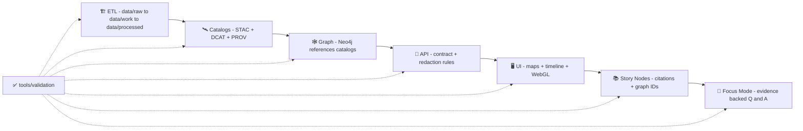

# 🧪 Validation Toolkit


> ✅ **If it ships, it validates.**  
> This folder defines the **quality gates** for Kansas Frontier Matrix (KFM) data, catalogs, graphs, APIs, models, simulations, databases, Story Nodes, and UI outputs.

---

## 📌 What this folder is for

`tools/validation/` exists to make the KFM ecosystem **provably reliable**:

- 🧾 **Traceability**: every asset is traceable to inputs + pipeline version + policy decisions + provenance.
- 🧪 **Scientific rigor**: verification & validation (V&V), uncertainty thinking, reproducibility.
- 🌎 **Geospatial correctness**: CRS, extent, topology, raster/vector integrity, cartographic discipline.
- 🧠 **Model accountability**: regression/ML evaluation, drift detection, calibration, model cards.
- 🕸️ **Graph integrity**: Neo4j constraints, ontology stability, cross-layer references.
- 🛡️ **Security posture**: defensive scanning and safe-by-default checks (no offensive tooling).
- ⚖️ **Governance**: licensing, provenance, FAIR/CARE-aligned publishing, sovereignty & sensitivity controls.

---

## 🧱 Non‑negotiables we enforce (KFM v13 contracts)

These are *pipeline invariants* — they’re validated as **hard gates**:

- 🔁 **Canonical pipeline order:** **ETL → Catalogs (STAC/DCAT/PROV) → Graph → API → UI → Story Nodes → Focus Mode**
- 📦 **Boundary artifacts required to “publish”:** processed data + catalog records + provenance bundle + validation evidence
- 🧩 **Evidence artifacts are first-class datasets:** AI/analysis outputs must be stored, cataloged, and traced like any dataset
- 🧷 **Cross-layer linkage must be real:** catalogs ↔ graph ↔ story nodes must reference the same stable IDs (no drift)
- 🧭 **No silent policy downgrade:** classification/sensitivity cannot be reduced unless an approved de‑identification/redaction step is documented and proven
- 🔒 **UI never bypasses governance:** the UI must only expose governed data via the API layer (no direct “side loads”)

---

## 🧭 Where validation fits in the KFM v13 pipeline



---

## 🧭 Table of contents

- [⚡ Quickstart](#-quickstart)
- [✅ CI gate matrix](#-ci-gate-matrix)
- [🧱 Validation layers](#-validation-layers)
- [🗂️ Directory map](#-directory-map)
- [📦 Repo-wide contracts validated](#-repo-wide-contracts-validated)
- [🛰️ Catalog QA: STAC + DCAT + PROV](#-catalog-qa-stac--dcat--prov)
- [🕸️ Graph validation](#️-graph-validation)
- [🌍 Geospatial validation](#-geospatial-validation)
- [📈 Statistics and ML validation](#-statistics-and-ml-validation)
- [🧮 Modeling and simulation V&V](#-modeling-and-simulation-vv)
- [🗃️ Data engineering and database validation](#-data-engineering-and-database-validation)
- [🖥️ Web UI and 3D visualization validation](#-web-ui-and-3d-visualization-validation)
- [📚 Story Nodes and Focus Mode gates](#-story-nodes-and-focus-mode-gates)
- [🔐 Security validation](#-security-validation)
- [⚖️ Governance, FAIR+CARE, and sovereignty checks](#️-governance-faircare-and-sovereignty-checks)
- [🧩 Adding a new validator](#-adding-a-new-validator)
- [📦 Artifacts and reporting](#-artifacts-and-reporting)
- [🗺️ Reference library used by this folder](#-reference-library-used-by-this-folder)

---

## ⚡ Quickstart

Run validations from the **repo root**.

### Option A: Make targets

```bash
make validate
make validate-docs
make validate-catalog     # STAC + DCAT + PROV
make validate-graph
make validate-api
make validate-geo
make validate-stats
make validate-ml
make validate-sim
make validate-db
make validate-web
make validate-story
make validate-security
make validate-governance
```

### Option B: Python module entrypoint

```bash
python -m tools.validation all
python -m tools.validation catalog ./data
python -m tools.validation geo     ./data/processed
python -m tools.validation story   ./docs/story
```

### Option C: CI lanes only

```bash
# run only checks that are mandatory for merge
python -m tools.validation ci
```

> 🧠 **Design rule:** every validator must run locally *and* in CI with identical semantics.  
> 🧾 **Evidence rule:** every validator must emit artifacts (see [Artifacts and reporting](#-artifacts-and-reporting)).

---

## ✅ CI gate matrix

> 🧩 Recommended defaults — tuned for “fail fast” on PRs and “deep verification” on releases.

| Lane 🧰 | PR (required) ✅ | Main (required) ✅ | Release (required) ✅ | Evidence output 📦 |
|---|---:|---:|---:|---|
| `docs/` 📝 | ✅ | ✅ | ✅ | Markdown lint + front-matter + link map |
| `policy/` 🧩 | ✅ | ✅ | ✅ | Conftest/OPA decision report |
| `catalog/` 🛰️ | ✅ | ✅ | ✅ | Schema validation + cross-link report |
| `graph/` 🕸️ | ✅ (fixture) | ✅ (fixture) | ✅ (full/expanded) | Constraint & ontology test results |
| `api/` 🧩 | ✅ | ✅ | ✅ | Contract tests + schema diffs |
| `geo/` 🌍 | ✅ | ✅ | ✅ | CRS/topology/raster reports |
| `stats/` 📈 | ✅ (sanity) | ✅ | ✅ | drift/regression diagnostics |
| `ml/` 🤖 | ✅ (baseline) | ✅ | ✅ | eval + calibration + model card gate |
| `sim/` 🧮 | ✅ (smoke) | ✅ | ✅ | invariants + convergence + UQ |
| `db/` 🗃️ | ✅ | ✅ | ✅ | constraints + explain guard |
| `web/` 🖥️ | ✅ | ✅ | ✅ | Lighthouse + visual diffs + WebGL smoke |
| `security/` 🔐 | ✅ | ✅ | ✅ | secrets + deps + SBOM gate (release) |
| `governance/` ⚖️ | ⚠️ triggers | ⚠️ triggers | ✅ | license + provenance + sensitivity review |

⚠️ **Governance note:** Some changes *must* trigger manual review (see [Governance triggers](#️-governance-faircare-and-sovereignty-checks)).

---

## 🧱 Validation layers

KFM validation is deliberately **layered** so failures are fast, actionable, and auditable:

1. 📝 **Markdown protocol** (docs + Story Nodes)  
   Front-matter, required sections, citations, link integrity.
2. 🧹 **Lint & Type**  
   Formatting, static analysis, typing, doc lint.
3. 📐 **Schema**  
   JSON Schema for STAC/DCAT/PROV + Story Node schemas + UI config schemas.
4. 🧩 **Policy as code**  
   OPA/Conftest rules (what we *allow* to ship).
5. 🛰️ **Catalog integrity**  
   STAC relationships, links, collections, paging, provenance chains, DCAT distributions.
6. 🕸️ **Graph integrity**  
   Neo4j constraints, ontology stability, catalog references (no payload duplication).
7. 🧩 **API contract**  
   OpenAPI/GraphQL contracts, backward compatibility, redaction rules.
8. 🌍 **Geospatial integrity**  
   CRS, extents, topology, raster metadata, no silent reprojection.
9. 📈 **Stats & Drift**  
   sanity checks, distributions, regression diagnostics, anomaly detection.
10. 🤖 **ML evaluation**  
   baselines, cross-validation, calibration, fairness flags, reproducibility.
11. 🧮 **Modeling & simulation V&V**  
   numerical checks, conservation checks, convergence, UQ.
12. 🗃️ **DB & performance**  
   constraints, migrations, query plans, scalability smoke tests.
13. 🖥️ **UI & viz**  
   accessibility, responsive behavior, WebGL stability, visual regression.
14. 🔐 **Security**  
   dependency scanning, secrets, SBOM, config hardening checks.
15. ⚖️ **Governance**  
   licenses, provenance, sovereignty, publish readiness, review triggers.

---

## 🗂️ Directory map

> 🧩 Recommended layout. Keep conceptual lanes even if filenames differ.

```text
🧰 tools/validation/
├─ 📄 README.md                         👈 you are here
├─ 🧾 manifest.yml                      🧾 single source of truth for validators
├─ 🏃 runners/
│  ├─ 🏁 run_all.py                     🏁 orchestrator (local + CI)
│  ├─ 🛣️ run_lane.py                    🛣️ run one lane by name
│  └─ 📦 report.py                      📦 unify outputs into artifacts
├─ 📝 docs/
│  ├─ 🧾 frontmatter_check.py           🧾 YAML front-matter + required sections
│  ├─ 🔗 link_check.py                  🔗 internal links + citation refs
│  └─ 🧪 fixtures/
├─ 🧩 policy/
│  ├─ 🧩 stac_provenance.rego           🧩 required fields, provenance rules
│  ├─ ⚙️ faircare.rego                  ⚙️ sovereignty + sensitive-layer governance
│  └─ 📘 conftest.md                    📘 how to run policy gates
├─ 🛰️ catalog/
│  ├─ 🛰️ stac_validate.py               🛰️ STAC JSON schema + lint
│  ├─ 🧾 dcat_validate.py               🧾 DCAT schema + distribution checks
│  ├─ 🧬 prov_validate.py               🧬 PROV bundle validation + lineage checks
│  └─ 🔗 crosslink_check.py             🔗 STAC↔DCAT↔PROV↔Graph link integrity
├─ 🕸️ graph/
│  ├─ 🧷 constraints_check.py           🧷 required labels/properties/uniqueness
│  ├─ 🧠 ontology_regression.py         🧠 “do not break” ontology tests
│  └─ 🧪 fixtures/                      🧪 minimal sample graph
├─ 🧩 api/
│  ├─ 📜 openapi_diff.py                📜 contract drift guard
│  ├─ 🧪 contract_tests.py              🧪 endpoint behavior vs fixtures
│  └─ 🔒 redaction_rules_check.py       🔒 governance enforcement tests
├─ 🌍 geo/
│  ├─ 🧭 check_crs.py                   🧭 CRS & axis sanity checks
│  ├─ 📦 check_bbox.py                  📦 bbox/extent correctness
│  ├─ 🧱 check_geometries.py            🧱 topology/validity checks
│  ├─ 🗺️ check_rasters.py               🗺️ raster metadata + nodata + tiling
│  └─ 🛰️ rs_checks.py                   🛰️ remote sensing QA (cloud masks, bands, scaling)
├─ 📈 stats/
│  ├─ 📈 drift_checks.py                📈 distribution + drift
│  ├─ 📉 regression_diagnostics.py      📉 residuals, leverage, outliers
│  └─ 📊 eda_report.R                   📊 optional R-based visual EDA report
├─ 🤖 ml/
│  ├─ 🧠 eval_baselines.py              🧠 metrics + baselines
│  ├─ 🎯 calibration.py                 🎯 calibration + uncertainty
│  └─ 🪪 model_card_check.py            🪪 model card completeness gate
├─ 🧮 sim/
│  ├─ 🧮 invariants.py                  🧮 conservation / invariants
│  ├─ 📐 convergence.py                 📐 grid/time-step convergence
│  └─ 🌫️ uq.py                          🌫️ uncertainty quantification helpers
├─ 🗃️ db/
│  ├─ 🗃️ constraints.sql                🗃️ constraints & invariants
│  ├─ 🌎 postgis_checks.sql             🌎 geometry validity & SRID checks
│  └─ ⚡ explain_guard.py               ⚡ query plan smoke tests
├─ 🖥️ web/
│  ├─ 💡 lighthouse_ci/                 💡 performance + accessibility
│  ├─ 🖼️ visual_regression/             🖼️ map + legend snapshots
│  ├─ 🎮 webgl_smoke/                   🎮 context + capability checks
│  └─ 🖼️ media_format_check.py          🖼️ PNG/JPEG/GIF format & metadata checks
├─ 📚 story/
│  ├─ 🧾 story_schema_check.py          🧾 Story Node schema + front-matter
│  ├─ 🔗 citation_gate.py               🔗 every claim references evidence
│  └─ 🧷 graph_ref_check.py             🧷 references to stable graph IDs
├─ 🧠 focus/
│  ├─ 🧪 focus_mode_gate.py             🧪 evidence-only response constraints
│  └─ 🏷️ labeling_check.py              🏷️ fact vs interpretation labeling
├─ 🔐 security/
│  ├─ 🔎 secrets_scan.yml               🔎 secrets policy
│  ├─ 📦 sbom_check.py                  📦 SBOM presence & diffs
│  └─ 🧷 dependency_audit.py            🧷 dependency health checks
├─ ⚖️ governance/
│  ├─ 📜 license_check.py               📜 license presence + compatibility
│  ├─ 🧾 provenance_completeness.py     🧾 provenance required for publish
│  └─ 🏁 review_triggers.py             🏁 flags manual governance review
└─ 📦 artifacts/
   └─ 📌 .gitkeep                        📦 CI writes reports here
```

---

## 📦 Repo-wide contracts validated

These validations intentionally “reach outside” this folder because the contracts are repo-wide.

<details>
<summary><strong>📁 Expected data lifecycle layout (validated)</strong></summary>

```text
data/
├─ raw/<domain>/                # source materials (immutable inputs)
├─ work/<domain>/               # intermediates (re-buildable)
├─ processed/<domain>/          # publishable outputs (versioned)
├─ stac/                        # STAC catalogs (collections + items)
├─ catalog/dcat/                # DCAT discovery layer
└─ prov/                        # PROV bundles (how outputs were produced)
docs/
└─ data/<domain>/               # domain runbooks + source documentation
```

</details>

✅ **Domain expansion rule:** new domains must be isolated by folder and published through STAC/DCAT/PROV, not via ad‑hoc metadata.

---

## 🛰️ Catalog QA: STAC + DCAT + PROV

KFM treats catalogs as **product surfaces**: if catalogs drift, the UI and narratives drift.

### ✅ Required alignment (hard gate)

Every **new dataset or evidence artifact** must include:

- 🛰️ **STAC** Collection + Item(s) (even for many “non-spatial” datasets, for consistency)
- 🧾 **DCAT** Dataset entry (title, description, license, keywords, distribution links)
- 🧬 **PROV** activity bundle (inputs → steps → outputs, agents, parameters, run IDs)

### 🔗 Cross-layer linkage expectations (hard gate)

- **STAC Items → Data**: items must link to real assets in `data/processed/**` (or stable storage) and carry attribution + license.
- **DCAT → Distribution**: DCAT must link to the STAC record and/or direct downloads.
- **PROV end-to-end**: lineage must cover raw → work → processed, including run/config identifiers.
- **Graph references catalogs**: Neo4j stores IDs/refs (STAC IDs, DOIs), not bulky payloads.

### 🧾 Example “required fields” pattern (STAC-ish)

```json
{
  "stac_version": "1.0.0",
  "stac_extensions": [
    "https://stac-extensions.github.io/projection/v2.0.0/schema.json"
  ],
  "properties": {
    "kfm:mdp_version": "v13.x.y",
    "proj:epsg": 4326,
    "kfm:classification": "public",
    "kfm:sensitivity": "open"
  },
  "providers": [
    { "name": "Kansas Frontier Matrix", "roles": ["processor"] }
  ],
  "license": "CC-BY 4.0",
  "links": [
    {
      "rel": "derived_from",
      "href": "stac://raw/source_asset_01",
      "type": "application/json",
      "title": "Provenance chain"
    }
  ]
}
```

### 🧬 Versioning expectations (validated)

- Dataset revisions link back via PROV/DCAT (e.g., `prov:wasRevisionOf`)
- Graph schema stays backward compatible unless migrated (with explicit scripts)
- API breaking changes require versioned endpoints/contracts
- Repo releases follow semantic versioning (major breaks, minor additive changes)

---

## 🕸️ Graph validation

KFM’s graph is the **relationship layer** — it should not become a shadow data lake.

### ✅ What we validate

- required labels/types exist (ontology “do not break” rules)
- uniqueness constraints (stable IDs are stable)
- relationship validity (no impossible edges, no orphan nodes)
- catalog references exist (graph nodes reference STAC/DCAT/DOIs, not payload blobs)
- regression tests on fixtures to catch unintended ontology changes early

> 🧠 Bonus (optional lane): graph analytics reproducibility checks (e.g., clustering outputs are versioned and re-runnable).

---

## 🌍 Geospatial validation

Geospatial validation is split into **format**, **geometry**, and **meaning**.

### ✅ Format and metadata

- Raster:
  - CRS defined and consistent
  - nodata present and sane
  - tiling and overviews for web delivery when required
- Vector:
  - valid geometries (no self-intersections, no NaNs)
  - SRID set and consistent
  - attribute schemas stable

### ✅ Spatial integrity

- bbox matches geometry/raster extent
- no accidental axis flips
- reprojection performed deliberately (and recorded in PROV)
- tolerances documented (meters vs degrees)

### ✅ Remote sensing QA (Earth Engine & friends)

- band naming + scaling factors + QA bits are explicit
- cloud/shadow masks are applied or explicitly documented as absent
- temporal compositing rules are declared and reproducible
- spatial resolution and resampling strategy are recorded

### ✅ Cartographic integrity (maps are validated assets 🎨)

- legends are complete (every layer class has a key)
- ramps are consistent across releases
- accessibility constraints (contrast + colorblind safety) are checked via UI snapshot tests

---

## 📈 Statistics and ML validation

### Statistical sanity checks 📊

- distribution checks (range, missingness, spikes)
- drift detection between releases
- outlier audit trails (why a point is extreme)

### Regression diagnostics 📉

- residual behavior checks (assumptions + anomalies)
- leverage & influence
- multicollinearity flags
- train/test leakage detectors

### Bayesian checks 🎲

- posterior predictive checks
- calibration diagnostics
- uncertainty reporting requirements (when UI shows “confidence”)

### Deep learning checks 🤖

- learning curve artifacts
- overfitting detection gates
- reproducibility checks (seeds, deterministic ops when feasible)

---

## 🧮 Modeling and simulation V&V

We follow a NASA-grade mindset 🚀:

- ✅ **Code verification**: “did we implement the equations right?”
- ✅ **Solution verification**: “did we solve the equations accurately?”
- ✅ **Validation**: “does the model match reality for the intended use?”
- 🌫️ **Uncertainty quantification**: “how wrong might we be, and why?”

Suggested checks:

- invariants and conservation laws
- mesh/time-step convergence
- sensitivity analysis
- benchmark problems (analytic/empirical references)
- uncertainty reporting (what uncertainty is, how computed, how propagated)

---

## 🗃️ Data engineering and database validation

### PostgreSQL and PostGIS 🐘🌎

- constraints are enforced (NOT NULL, FK, CHECK)
- geometry validity enforced in DB (SRID + validity checks)
- migration safety checks (no destructive changes without flags)
- query plan smoke tests (EXPLAIN guardrails)

### Scalability and performance ⚡

- benchmark queries (representative workloads)
- plan regressions (EXPLAIN guardrails)
- concurrency-aware smoke tests (avoid nondeterministic flakes)

### Data Spaces mindset 🧩

When data is federated, validation must travel with it:

- interoperability checks (contracts, schemas, semantics)
- trust checks (provenance, policy compliance)
- governance checks (usage controls, licensing posture)

---

## 🖥️ Web UI and 3D visualization validation

### Responsive and accessibility 📱♿

- responsive breakpoints don’t break map usability
- keyboard navigation works
- ARIA labels exist for core controls
- map legends are readable and consistent

### WebGL stability 🎮

- context creation smoke tests
- capability detection
- crash regression tests on shader changes
- performance budgets for critical scenes

### Visual regression testing 🖼️

Mandatory for map-heavy products:

- layer snapshots pinned per release
- legend snapshots pinned per release
- tolerance-based image diffs
- “semantic diffs” for vector symbology when possible

### Media format correctness 🖼️

- snapshots use appropriate formats (lossless where required)
- metadata sanity (dimensions, color profiles where relevant)
- no accidental recompression that changes meaning

---

## 📚 Story Nodes and Focus Mode gates

Story Nodes turn narrative into **governed, machine-ingestible research**.

### ✅ Story Node requirements (hard gate)

- 📌 **Provenance for every claim**: every factual statement references evidence (KFM catalogs or cataloged external sources)
- 🧷 **Graph entity references**: key entities are linked to stable graph identifiers
- 🧠 **Fact vs interpretation separation**: narrative distinguishes direct evidence from inference/analysis

### 🧠 Focus Mode rules (hard gate)

Focus Mode is an interactive reading experience that must preserve trust:

- answers must be evidence-backed and cite sources
- AI assistance must be opt-in, labeled, and constrained (no unsourced claims)
- sensitivity and sovereignty controls are respected end-to-end
- no direct UI bypass of the API governance layer

---

## 🔐 Security validation

Defensive checks only ✅

- secrets scanning (keys, tokens, credentials)
- dependency audits (known vulnerable versions)
- SBOM required for release artifacts
- config sanity checks (CORS, CSP, headers)
- repository hygiene checks (unsafe CI patterns, risky runner configs)

> 🛡️ **Important:** we do not ship offensive security tooling in this folder.  
> Security references are used for **defensive hardening and awareness**.

---

## ⚖️ Governance, FAIR+CARE, and sovereignty checks

These checks exist because KFM is **not** just a codebase—it’s a public-facing research tool.

### ✅ Automated governance checks

- license presence + compatibility
- provenance chain completeness
- “sensitive layer” publishing rules
- FAIR/CARE posture (especially for culturally sensitive content)
- AI governance checks (model cards, dataset cards, limitations, disclosures)

### 🧯 Governance review triggers (manual)

Some changes require a human review beyond CI:

- introducing sensitive or sovereignty-governed datasets/layers
- new AI-driven narrative features that could be perceived as factual
- new external data sources (license/provenance scrutiny)
- new public-facing endpoints/exports that could expose sensitive info
- classification/sensitivity changes (reclassification must be justified and documented)

### 🧊 Redaction and generalization (must be end-to-end)

If data is sensitive, controls must apply at every layer:

- processed data is redacted/generalized
- STAC/DCAT metadata reflects the redaction
- API enforces access rules and labeling
- UI adds safeguards (no accidental leakage via interactions)

---

## 🧩 Adding a new validator

A validator is considered “KFM-grade” when it has:

- ✅ deterministic behavior
- ✅ clear input contract (what it consumes)
- ✅ explicit output artifacts (what evidence it produces)
- ✅ an exit code contract (pass/fail/warn)
- ✅ a CI lane mapping (where it runs)
- ✅ a fixture (minimum reproducible test case)

### Checklist ✅

- [ ] Add your validator under the appropriate lane folder  
- [ ] Register it in `tools/validation/manifest.yml`  
- [ ] Ensure it writes artifacts under `tools/validation/artifacts/<lane>/<validator-name>/`  
- [ ] Provide at least one fixture in `fixtures/`  
- [ ] Add it to CI lane runner  
- [ ] Document it in this README (one paragraph + example run)

### Example manifest entry (illustrative)

```yaml
validators:
  - name: "catalog.crosslink_check"
    lane: "catalog"
    entrypoint: "tools.validation.catalog.crosslink_check:main"
    inputs:
      - "data/stac/**"
      - "data/catalog/dcat/**"
      - "data/prov/**"
    outputs:
      - "tools/validation/artifacts/catalog/crosslink_check/**"
    severity: "error"
    ci:
      - "pr"
      - "release"
```

---

## 📦 Artifacts and reporting

All validators should emit:

- `report.json` (machine-readable)
- `report.md` (human-readable summary)
- `junit.xml` (CI-friendly)
- optional: plots, snapshots, diffs, notebook exports
- optional: `manifest.json` with checksums for evidence bundles

Recommended folder pattern:

```text
tools/validation/artifacts/
└─ <lane>/
   └─ <check>/
      ├─ report.json
      ├─ report.md
      ├─ junit.xml
      └─ extras/
```

> 📌 Tip: prefer **artifacts over caches** for anything you need to audit later.

---

## 🗺️ Reference library used by this folder

This validation suite is intentionally grounded in KFM’s internal reference library 📚  
These files inform *how we define correctness* across science, geospatial, UI, security, and governance.

### Core KFM protocols & architecture

- `MARKDOWN_GUIDE_v13.md.gdoc` 🧭 *(canonical pipeline + contracts + CI gates)*
- `Comprehensive Markdown Guide_ Syntax, Extensions, and Best Practices.docx` 📝 *(front-matter + DoD patterns)*
- `Kansas Frontier Matrix (KFM) – Comprehensive Technical Documentation.pdf` 🏗️ *(system design + governance + roadmap)*

> 🧾 Standards referenced by validation (expected paths):
> - `docs/standards/KFM_STAC_PROFILE.md`
> - `docs/standards/KFM_DCAT_PROFILE.md`
> - `docs/standards/KFM_PROV_PROFILE.md`

### Modeling, simulation, and math 🧮

- `Scientific Modeling and Simulation_ A Comprehensive NASA-Grade Guide.pdf` 🚀
- `Generalized Topology Optimization for Structural Design.pdf` 🧱
- `Spectral Geometry of Graphs.pdf` 🧠

### Statistics, experiment design, and ML 📈

- `Understanding Statistics & Experimental Design.pdf` 🧪
- `regression-analysis-with-python.pdf` 📉
- `Regression analysis using Python - slides-linear-regression.pdf` 🎓
- `think-bayes-bayesian-statistics-in-python.pdf` 🎲
- `graphical-data-analysis-with-r.pdf` 📊
- `Deep.Learning.for.Coders.with.fastai.and.PyTorchpdf` 🤖 *(reference; availability may vary)*

### Geospatial, cartography, remote sensing, and 3D GIS 🌎

- `python-geospatial-analysis-cookbook.pdf` 🌎
- `making-maps-a-visual-guide-to-map-design-for-gis.pdf` 🎨
- `Mobile Mapping_ Space, Cartography and the Digital - 9789048535217.pdf` 📱
- `Cloud-Based Remote Sensing with Google Earth Engine-Fundamentals and Applications.pdf` 🛰️
- `Archaeological 3D GIS_26_01_12_17_53_09.pdf` 🏺

### Data management and databases 🗃️

- `PostgreSQL Notes for Professionals - PostgreSQLNotesForProfessionals.pdf` 🐘
- `Database Performance at Scale.pdf` ⚡
- `Scalable Data Management for Future Hardware.pdf` 🧱⚡
- `Data Spaces.pdf` 🧩

### Web, visualization, and media formats 🖥️

- `responsive-web-design-with-html5-and-css3.pdf` 📱
- `webgl-programming-guide-interactive-3d-graphics-programming-with-webgl.pdf` 🎮
- `compressed-image-file-formats-jpeg-png-gif-xbm-bmp.pdf` 🖼️

### Concurrency, distributed systems, and software practice 🧵

- `concurrent-real-time-and-distributed-programming-in-java-threads-rtsj-and-rmi.pdf` 🧵
- `A programming Books.pdf` 🧰 *(multi-book compendium)*
- `B-C programming Books.pdf` 🧰 *(multi-book compendium)*
- `D-E programming Books.pdf` 🧰 *(multi-book compendium)*
- `F-H programming Books.pdf` 🧰 *(multi-book compendium)*
- `I-L programming Books.pdf` 🧰 *(multi-book compendium)*
- `M-N programming Books.pdf` 🧰 *(multi-book compendium)*
- `O-R programming Books.pdf` 🧰 *(multi-book compendium)*
- `S-T programming Books.pdf` 🧰 *(multi-book compendium)*
- `U-X programming Books.pdf` 🧰 *(multi-book compendium)*

### Governance, law, and human-centered constraints ⚖️

- `Introduction to Digital Humanism.pdf` 🤝
- `On the path to AI Law’s prophecies and the conceptual foundations of the machine learning age.pdf` ⚖️
- `Principles of Biological Autonomy - book_9780262381833.pdf` 🧬

### Security references 🔐

- `ethical-hacking-and-countermeasures-secure-network-infrastructures.pdf` 🛡️
- `Gray Hat Python - Python Programming for Hackers and Reverse Engineers (2009).pdf` ⚠️ *(defensive awareness only)*

---

<div align="center">

**KFM Validation Toolkit** · 🧪 Evidence-driven · 🛰️ Catalog-first · 🕸️ Graph-consistent · 🌎 Geo-correct · 🔐 Defensive · ⚖️ Governed

</div>
