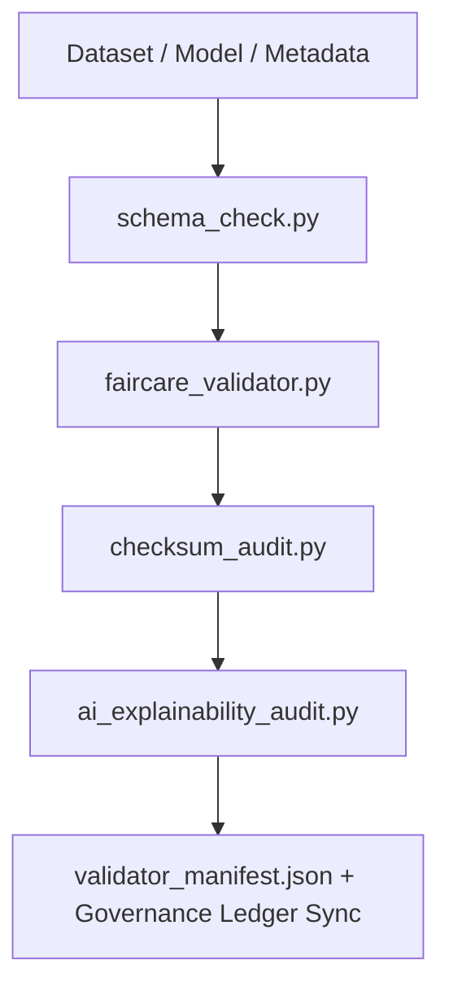

<div align="center">

# ✅ **Kansas Frontier Matrix — Validation & FAIR+CARE Compliance Tools**  
`tools/validation/README.md`

**Purpose:**  
Run reproducible **schema, checksum, ethics, accessibility, and explainability validations** across all Kansas Frontier Matrix (KFM) pipelines to guarantee integrity, transparency, and sustainable governance.  
This suite enforces **MCP-DL v6.3** and **FAIR+CARE** standards under **ISO 19115 / DCAT 3.0**, with telemetry-verified audit readiness.

[](../../../docs/standards/faircare.md)
[](../../../LICENSE)
[]()
[](../../../docs/README.md)

</div>

---

## 📘 Overview

The **Validation Tools Framework** automates FAIR+CARE compliance checks across data, AI, and metadata layers.  
It validates schema integrity, checksum lineage, accessibility, and ethical AI explainability, emitting verifiable results into the **Governance Ledger** and **Focus Mode telemetry**.

**v10.2.2 Enhancements**
- JSON-LD evidence bundles for all validation outputs.  
- Stronger checksum lineage audits across multi-stage workflows.  
- Expanded AI transparency scoring (global + subgroup metrics).  
- Integrated energy/CO₂e accounting for validation runs.

---

## 🗂️ Directory Layout

```plaintext
tools/validation/
├── README.md
│
├── faircare_validator.py           # FAIR+CARE ethics + accessibility audits
├── schema_check.py                 # STAC/DCAT/ISO schema validation
├── ai_explainability_audit.py      # Explainability + bias/drift checks for AI
├── checksum_audit.py               # End-to-end checksum lineage verification
├── validator_manifest.json         # Aggregated validation summary + references
└── metadata.json                   # Provenance + checksum lineage (JSON-LD)
```

---

## ⚙️ Validation Workflow



1. **Schema Validation** — Contract and interoperability checks.  
2. **Ethics Review** — FAIR+CARE audits for licensing, consent, and a11y.  
3. **Checksum Integrity** — Lineage verification across raw → processed → release.  
4. **Explainability Review** — Bias, drift, and interpretability scoring.  
5. **Governance Sync** — Registers results and emissions in provenance records.

---

## 🧾 Example Validation Metadata Record

```json
{
  "@context": "https://schema.org/",
  "@type": "Dataset",
  "id": "validation_session_v10.2.2_2025Q4",
  "validated_assets": [
    "data/processed/climate/climate_summary.parquet",
    "data/processed/hazards/hazards_composite.geojson"
  ],
  "schema_passed": true,
  "checksum_verified": true,
  "faircare_compliant": true,
  "ai_explainability_score": 0.995,
  "bias_detected": false,
  "energy_wh": 2.0,
  "co2_g": 2.4,
  "governance_registered": true,
  "validator": "@kfm-validation-lab",
  "created": "2025-11-12T12:30:00Z",
  "governance_ref": "docs/reports/audit/data_provenance_ledger.json"
}
```

---

## 🧠 FAIR+CARE Governance Matrix

| Principle | Implementation | Oversight |
|-----------|----------------|-----------|
| **Findable** | Reports indexed in manifests & ledgers (JSON-LD). | @kfm-data |
| **Accessible** | Outputs MIT-licensed; machine & human-readable. | @kfm-accessibility |
| **Interoperable** | Conforms to FAIR+CARE + ISO 19115 + DCAT 3.0. | @kfm-architecture |
| **Reusable** | Modular scripts, pinned env, reproducible runs. | @kfm-design |
| **Collective Benefit** | Audit-ready transparency for public trust. | @faircare-council |
| **Authority to Control** | Council validates validation integrity. | @kfm-governance |
| **Responsibility** | Teams maintain explainability, bias, checksum logs. | @kfm-security |
| **Ethics** | Ensures inclusive, explainable, accountable workflows. | @kfm-ethics |

**References:**  
`docs/reports/fair/data_care_assessment.json` · `docs/reports/audit/data_provenance_ledger.json`

---

## ⚙️ Validation Tools Summary

| Tool | Description | Gate |
|------|-------------|------|
| `faircare_validator.py` | Ethics + accessibility checks (FAIR+CARE). | FAIR+CARE |
| `schema_check.py` | STAC/DCAT/ISO schema validation. | Schema |
| `checksum_audit.py` | SHA-256 lineage verification. | Integrity |
| `ai_explainability_audit.py` | SHAP/LIME explainability + drift checks. | AI Ethics |
| `validator_manifest.json` | Consolidated outcomes for governance. | Governance |

Automation via **`validation_sync.yml`**.

---

## ⚖️ Retention & Provenance Policy

| Artifact | Retention | Policy |
|----------|-----------:|-------|
| Schema Reports | 180 days | Periodic audit |
| FAIR+CARE Audits | 365 days | Ethics revalidation dataset |
| Checksum Reports | Permanent | Immutable under ledger |
| Metadata | Permanent | Versioned with SHA-256 integrity |

Cleanup through **`validation_cleanup.yml`**.

---

## 🌱 Sustainability Metrics

| Metric | Target | Verified By |
|--------|-------:|-------------|
| Energy per Validation | ≤ 2.0 Wh | `telemetry_report.yml` |
| Carbon Output | ≤ 2.5 gCO₂e | `telemetry_report.yml` |
| Renewable Power | 100% (RE100) | Infra audit |
| FAIR+CARE Compliance | 100% | `faircare_validator.py` |

Telemetry aggregated in:  
`../../../releases/v10.2.0/focus-telemetry.json`

---

## 🧾 Citation

```text
Kansas Frontier Matrix (2025). Validation & FAIR+CARE Compliance Tools (v10.2.2).
Validation toolkit ensuring data integrity, schema fidelity, accessibility, explainability, and ethical transparency across KFM pipelines under MCP-DL v6.3 and ISO 19115/DCAT 3.0.
```

---

## 🕰️ Version History

| Version | Date | Notes |
|---------|------|------|
| v10.2.2 | 2025-11-12 | JSON-LD evidence bundles, stronger checksum lineage, expanded AI transparency scoring, energy/CO₂e logging. |
| v10.0.0 | 2025-11-10 | Telemetry schema v2; explainability metrics + sustainability tracking. |
| v9.7.0 | 2025-11-05 | Governance integration; refined XAI scoring. |
| v9.6.0 | 2025-11-03 | Checksum lineage + cross-domain schema validation. |
| v9.5.0 | 2025-11-02 | Established FAIR+CARE validation gates and audit processes. |

---

<div align="center">

**Kansas Frontier Matrix**  
*Data Integrity × FAIR+CARE Ethics × Provenance Verification*  
© 2025 Kansas Frontier Matrix — MIT License  

[Back to Tools Index](../README.md) · [Docs Portal](../../../docs/) · [Governance Charter](../../../docs/standards/governance/ROOT-GOVERNANCE.md)

</div>