<div align="center">

# ✅ **Kansas Frontier Matrix — Validation & FAIR+CARE Compliance Tools**  
`tools/validation/README.md`

**The authoritative validation suite for structural correctness, governance safety, ethics, sovereignty, explainability,
and sustainability compliance across the Kansas Frontier Matrix.**

[]() ·
[]() ·
[]() ·
[]() ·
[]()

</div>

---

## 📘 1. Overview

The **Validation & FAIR+CARE Compliance Suite** enforces the **governed correctness** of:

- Data (raw → work → processed → published)  
- STAC Collections & Items  
- DCAT 3.0 datasets and distributions  
- JSON-LD metadata (Story Nodes, Telemetry, Governance)  
- Pipeline outputs (ETL, AI, inference)  
- Explainability + bias/demographic fairness metrics  
- Lineage, integrity, and checksum chains  
- CARE, sovereignty, and ethical rules  
- Energy, carbon, and sustainability telemetry  

This is the **single source of truth** for validation behavior across:

- Tools Platform (`tools/**`)  
- CI/CD workflows (`.github/workflows/*`)  
- Data pipeline DAGs (`src/pipelines/*`)  
- Governance sync engines  
- Focus Mode v3 explainability and safety screens  

---

## 🗂️ 2. Directory Layout (Emoji Style A)

```text
tools/
└── ✅ validation/
    ├── 📄 README.md                   # This file
    │
    ├── ⚖️ faircare_validator.py       # CARE, sovereignty, A11y, licensing, ethics
    ├── 📐 schema_check.py             # STAC, DCAT, JSON-LD, contracts, telemetry shapes
    ├── 🧠 ai_explainability_audit.py  # SHAP/LIME attribution, drift, fairness metrics
    ├── 🔐 checksum_audit.py           # SHA-256 lineage, tamper detection & registry
    │
    ├── 🧾 validator_manifest.json     # Aggregated results + signatures + telemetry linkage
    └── 📑 metadata.json               # JSON-LD validation profile configuration
```

This layout is **KFM-MDP v11.2.2-compliant**, CI-safe, and mobile-safe.

---

## 🧩 3. Tools Platform Context in KFM v11

The validation suite sits in the core **governance pipeline**:

```text
CI / Operator
   ↓
💻 tools/cli
   ↓
✅ tools/validation
   ↓
🏛 tools/governance
   ↓
📡 tools/telemetry
   ↓
🤖 tools/ai (for AI/Focus Mode pipelines)
   ↓
📦 Release Artifacts
(STAC/DCAT · Ledgers · Telemetry · SBOM · Contracts)
```

Validation is **not optional**:

- No dataset or model is promoted unless validation passes.  
- All validation executions are logged and tied to a release or run ID.  

---

## ⚙️ 4. Validation Workflow (Mermaid · Box-Safe)

```mermaid
flowchart TD
  A["Dataset / Model / Metadata"]
    --> B["Schema Check\n(STAC · DCAT · JSON-LD · Contracts)"]
  B --> C["FAIR+CARE Validator\n(Sovereignty · A11y · Ethics)"]
  C --> D["Checksum Audit\n(SHA-256 Integrity Chains)"]
  D --> E["Explainability & Bias Audit\n(SHAP/LIME · Drift)"]
  E --> F["validator_manifest.json\nTelemetry · Governance Sync"]
```



Each stage contributes:

- **B**: Structural soundness and required fields  
- **C**: Ethical & legal constraints, including CARE & sovereignty  
- **D**: Cryptographic integrity and tamper detection  
- **E**: AI safety, fairness, and interpretability guarantees  

---

## 🧬 5. Stage Specifications

### 5.1 Schema Validation (`schema_check.py`)

Validates:

- STAC 1.x (with KFM profiles and extensions)  
- DCAT 3.0 JSON-LD dataset and distribution descriptors  
- Story Node v3 schema (`story-node.schema.json`)  
- Telemetry v4 schemas for system, tools, and domain pipelines  
- Data Contracts (PDC v11, from `data_contract_ref`)  

Outputs:

- Detailed JSON results:
  - `schema_passed` (bool)  
  - `errors` and `warnings` arrays  
  - `validated_entities` list  

### 5.2 FAIR+CARE Validator (`faircare_validator.py`)

Checks:

- CARE label presence and propagation  
- Sovereignty conflicts & Indigenous data protection requirements  
- Licensing and re-use conditions (public vs restricted)  
- Accessibility metadata (A11y hints, alt text, subtitles for content)  

It directly references:

- `ethics_ref`  
- `sovereignty_policy`  
- Relevant heritage and sovereignty rules from `docs/standards/heritage/**`.  

### 5.3 Checksum Audit (`checksum_audit.py`)

Responsibilities:

- Compute SHA-256 for datasets & key files  
- Compare against manifest entries (`data/checksums/manifest.json`)  
- Log:
  - `checksum_verified`  
  - `manifest_status` (up-to-date, missing, mismatch)  
- Register integrity status in `data/reports/audit/archive_integrity_log.json`  

### 5.4 AI Explainability Audit (`ai_explainability_audit.py`)

Responsibilities:

- Verify presence and freshness of explainability artifacts:
  - SHAP values  
  - LIME explanations  
  - Attention maps / saliency information  

- Evaluate:
  - Bias/fairness metrics  
  - Drift detection results  
  - Alignment with AI safety and usage constraints  

If a model fails explainability or bias checks, it is marked as:

- `certification_status: "blocked"` until remediation.

---

## 📄 6. Example Validation Session Record

```json
{
  "id": "validation_session_v11.0.1",
  "schema_passed": true,
  "checksum_verified": true,
  "faircare_compliant": true,
  "ai_explainability_score": 0.998,
  "bias_index": 0.017,
  "energy_wh": 2.4,
  "carbon_gco2e": 2.8,
  "validated_entities": [
    "data/processed/hydrology/streamflow.parquet"
  ],
  "signing_hash": "sha256:5a8b883f9...",
  "governance_registered": true,
  "timestamp": "2025-11-24T15:22:00Z",
  "validator": "@kfm-validation-core"
}
```

These records are bundled in `validator_manifest.json` and referenced in release telemetry.

---

## 🧠 7. FAIR+CARE Governance Matrix

| Principle              | Enforcement via Validation Suite                                 | Oversight            |
|------------------------|------------------------------------------------------------------|----------------------|
| **F1 – Findable**      | Stable IDs + JSON-LD; checks ensure proper dataset & ledger refs | `@kfm-data`          |
| **A1 – Accessible**    | Valid A11y metadata and open formats verified                    | `@kfm-accessibility` |
| **I1 – Interoperable** | STAC/DCAT/JSON-LD/ISO metadata validated                         | `@kfm-architecture`  |
| **R1 – Reusable**      | Contract-compliant fields; license & provenance checks           | `@kfm-design`        |
| **Collective Benefit** | FAIR+CARE checks on sensitive impacts and community risks        | `@faircare-council`  |
| **Authority to Control** | Sovereignty rules enforced; blocking on violations             | `@kfm-governance`    |
| **Responsibility**     | Telemetry of ethics & sustainability metrics is mandatory        | `@kfm-security`      |
| **Ethics**             | AI bias & drift audits; sensitive content policies enforced      | `@kfm-ethics`        |

---

## 🧰 8. Validation Tool Summary

| Tool                      | Description                                                     |
|---------------------------|-----------------------------------------------------------------|
| `schema_check.py`         | Structural & semantic correctness for all key schemas          |
| `faircare_validator.py`   | CARE, sovereignty, licensing, ethics, A11y checks               |
| `checksum_audit.py`       | SHA-256 integrity + tamper detection                           |
| `ai_explainability_audit.py` | Explainability coverage + bias & drift auditing            |
| `validator_manifest.json` | Roll-up of validation results + telemetry + signing hashes     |
| `metadata.json`           | JSON-LD profile of validation rules & ontological mappings     |

---

## 📦 9. Retention & Provenance Policy

| Artifact                  | Retention       | Notes                                      |
|---------------------------|----------------:|--------------------------------------------|
| Schema Validation Reports | ≥ 180 days      | Rotated and archived via CI cleanup        |
| FAIR+CARE Logs            | ≥ 365 days      | Used for audits & re-certifications        |
| Checksum Manifests        | Permanent       | Required for legal/scientific traceability |
| Signed Manifests          | Permanent       | Persistent attestations                     |
| Telemetry Snapshots       | ≥ 90 days (raw) | Summaries persisted in governance reports  |

Rotation is automated by `validation_cleanup.yml` and telemetry compaction tasks.

---

## 🌱 10. Sustainability Metrics (v11 Targets)

| Metric          | Target      |
|-----------------|-------------|
| Energy/run      | ≤ 2.5 Wh    |
| Carbon/run      | ≤ 3.0 gCO₂e |
| Renewable share | 100%        |
| FAIR+CARE pass% | 100%        |

Validation runs emit sustainability telemetry in:

```text
../../../releases/v11.2.2/focus-telemetry.json
docs/reports/telemetry/tools-validation-*.json
```

---

## 🕰 11. Version History

| Version | Date       | Summary                                                                                                                   |
|--------:|-----------:|---------------------------------------------------------------------------------------------------------------------------|
| v11.2.2 | 2025-11-27 | Upgraded to KFM-MDP v11.2.2; applied emoji directory layout; clarified FAIR+CARE, AI audit, and sustainability integration. |
| v11.0.1 | 2025-11-24 | Cross-toolchain upgrade; v11 telemetry; sovereignty gates; stable box-safe fences and diagrams.                           |
| v11.0.0 | 2025-11-19 | First v11 rewrite of validation suite; integrated with contracts, STAC/DCAT, and governance-led pipelines.                |
| v10.x   | 2023–2025  | Earlier validation pipeline generations; pre-v11 governance and telemetry semantics.                                      |

---

<div align="center">

© 2025 Kansas Frontier Matrix — MIT License  
✅ Validation & FAIR+CARE Tools · MCP-DL v6.3 · KFM-MDP v11.2.2 · Diamond⁹ Ω / Crown∞Ω  

[⬅️ Back to Tools Index](../README.md) · [🧱 Tools Architecture](../ARCHITECTURE.md) · [🛡 Governance Charter](../../../docs/standards/governance/ROOT-GOVERNANCE.md)

</div>