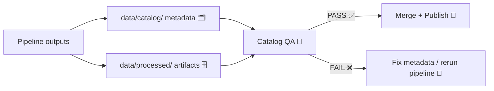

# 🧪📚 Catalog QA — Dataset Validation & Trust Gate

> **KFM principle:** *If it’s in the catalog, it’s trustworthy enough to ship.*  
> This tool is the **quality gate** that makes that statement true. ✅

---

## ✨ What this tool does

**`tools/validation/catalog_qa/`** validates dataset **metadata + integrity + basic content sanity** before anything becomes “official” inside KFM’s catalog.

It supports the KFM workflow where pipelines:
1) fetch + transform source data,  
2) write standardized artifacts to `data/processed/`,  
3) update metadata + provenance in `data/catalog/`, then  
4) run **Catalog QA** — and **CI blocks merging** if QA fails. 🚦  
(Design source: KFM technical docs describe Catalog QA scanning catalog JSON, checking required fields, file references, and basic checks like geometry validity and value ranges, and being enforced in CI.) [oai_citation:0‡Kansas Frontier Matrix (KFM) – Comprehensive Technical Documentation.pdf](file-service://file-AkqwUuYPp5zePf7pv5SMxi) [oai_citation:1‡Kansas Frontier Matrix (KFM) – Comprehensive Technical Documentation.pdf](file-service://file-AkqwUuYPp5zePf7pv5SMxi)

---

## 🎯 Goals

- **Provenance-first** 🔎: anything surfaced in UI/Focus Mode must be traceable to cataloged sources and provable processing (standards like **STAC / DCAT / PROV-O**). [oai_citation:2‡Kansas Frontier Matrix (KFM) – Comprehensive Technical Documentation.pdf](file-service://file-AkqwUuYPp5zePf7pv5SMxi)
- **Metadata-first** 🗂️: `data/catalog/` is the source of truth for what exists and how it’s used. QA defends that boundary.  [oai_citation:3‡Kansas Frontier Matrix (KFM) – Comprehensive Technical Documentation.pdf](file-service://file-AkqwUuYPp5zePf7pv5SMxi)
- **Deterministic, automatable checks** 🤖: “works on my machine” doesn’t count. CI must reproduce the same verdict.
- **Extensible rule packs** 🧩: GIS today, remote sensing tomorrow, graph + ML + 3D next.
- **Human-centered + accountable** 🧠: validation is explainable, and failures come with fixes (aligned with KFM’s digital humanism posture).  [oai_citation:4‡Kansas Frontier Matrix (KFM) – Comprehensive Technical Documentation.pdf](file-service://file-AkqwUuYPp5zePf7pv5SMxi)

---

## 🧠 Where it fits in the KFM architecture

KFM is designed as a clean, layered system (domain/service/integration/infrastructure). Catalog QA should follow that same separation so rules remain testable and swappable.  [oai_citation:5‡Kansas Frontier Matrix (KFM) – Comprehensive Technical Documentation.pdf](file-service://file-AkqwUuYPp5zePf7pv5SMxi)



---

## 🧰 Quickstart

> These commands are the **intended interface** for `catalog_qa` (keep CLI stable; internals can evolve).

### ✅ Validate everything (full catalog sweep)
```bash
# from repo root
python -m tools.validation.catalog_qa scan data/catalog
```

### 🎯 Validate one dataset entry
```bash
python -m tools.validation.catalog_qa validate data/catalog/<dataset_id>.json
```

### 🧾 PR-friendly output (diff mode)
```bash
python -m tools.validation.catalog_qa scan data/catalog --changed-only --report out/qa/
```

### 🔥 Strict mode (CI gate)
```bash
python -m tools.validation.catalog_qa scan data/catalog --fail-on-warn
```

---

## 📥 Inputs

### 1) Catalog entries (metadata)
- Expected location: `data/catalog/**/*.json`
- The tool should be able to scan:
  - a folder (`scan`),
  - a single JSON (`validate`),
  - or a list of files from CI (`--changed-only`).

### 2) Artifacts referenced by metadata
Common KFM artifact types include:
- **GeoParquet / Parquet**, **GeoJSON**, **COG GeoTIFF**, tilesets, time series JSON, etc. (KFM pipelines standardize outputs and write size/checksum/stats back to catalog.) [oai_citation:6‡Kansas Frontier Matrix (KFM) – Comprehensive Technical Documentation.pdf](file-service://file-AkqwUuYPp5zePf7pv5SMxi)

---

## 📤 Outputs

Catalog QA should produce machine + human readable reports:

- `out/qa/summary.json` ✅/❌ counts, score, duration
- `out/qa/report.json` rule-by-rule results (stable schema)
- `out/qa/report.md` nicely readable, PR-comment friendly
- `out/qa/artifacts_manifest.json` resolved file list, checksums, sizes

> Tip 💡: keep outputs deterministic (sorted file lists, stable formatting) so diffs are meaningful.

---

## ✅ Validation layers (what we check)

Catalog QA is intentionally layered so failures are fast + obvious.

### 1) 🧾 Schema & required fields (metadata correctness)
**Purpose:** Stop incomplete or malformed catalog entries before they spread.

Examples:
- required keys present (id/title/description/license/spatial/temporal/etc.)
- JSON schema valid
- enums valid (license list, asset types, etc.)
- provenance pointers exist (sources, pipeline steps, version)

> KFM explicitly calls out required fields like license + spatial extent and CI blocking merges when invalid. [oai_citation:7‡Kansas Frontier Matrix (KFM) – Comprehensive Technical Documentation.pdf](file-service://file-AkqwUuYPp5zePf7pv5SMxi)

---

### 2) 🔗 Reference integrity (no broken pointers)
**Purpose:** “Catalog says it exists” must mean “it exists.”

Checks:
- referenced files exist in repo/DVC/local cache
- checksums match (if provided)
- file sizes match tolerances (optional)
- no orphaned artifacts (optional: reverse index)

---

### 3) 🗺️ Geospatial sanity (vector + raster)
**Purpose:** Prevent silent GIS corruption (invalid geometries, wrong CRS, broken extents).

Vector checks:
- geometry validity (self-intersections, empty geometries)
- CRS defined + consistent with project expectations
- bbox matches actual data bounds (within tolerance)
- attribute schema sanity (required columns, types)

Raster checks:
- CRS present
- nodata defined (if applicable)
- reasonable statistics (min/max/histogram sanity)
- COG validation rules (overview structure / tiling expectations)

> KFM docs explicitly mention spatial validation like “no invalid geometries” and “correct CRS.” [oai_citation:8‡Kansas Frontier Matrix (KFM) – Comprehensive Technical Documentation.pdf](file-service://file-AkqwUuYPp5zePf7pv5SMxi)

---

### 4) 📊 Statistical & range checks (data plausibility)
**Purpose:** Catch nonsense early (e.g., negative rainfall, impossible dates, extreme spikes).

Checks:
- missingness thresholds
- numeric ranges + unit expectations
- categorical cardinality sanity
- outlier detection (basic z-score / IQR, configurable)
- optional regression sanity checks for derived datasets

📚 Informed by:
- *Understanding Statistics & Experimental Design* (sound checks + assumptions)  
- *Graphical Data Analysis with R* (EDA patterns)  
- *Regression analysis with Python* (performance + scaling awareness)  
- *Think Bayes* (Bayesian reasoning patterns for uncertainty)

---

### 5) 🧠 ML / model artifact QA (optional rule pack)
**Purpose:** prevent data leakage, mismatched schema, or unusable model bundles.

Checks:
- training/validation split provenance present
- feature schema hash matches
- model card metadata present (who/what/when/limits)
- evaluation metrics included + reproducible

📚 Informed by:
- *Understanding Machine Learning*  
- *Deep Learning for Coders (fastai/PyTorch)* (bias + leakage awareness)

---

### 6) 🗄️ Database & performance readiness (optional rule pack)
**Purpose:** ensure catalog entries are loadable into Postgres/PostGIS and won’t melt the API.

Checks:
- naming conventions safe for SQL
- index recommendations based on geometry + query patterns
- sample `EXPLAIN` thresholds (if DB is available in CI)
- large table partition hints for time-series

📚 Informed by:
- *PostgreSQL Notes for Professionals*  
- *Database Performance at Scale*  [oai_citation:9‡Database Performance at Scale.pdf](file-service://file-36z8qyiVJRtrSs6QG7Epen)  
- *Scalable Data Management for Future Hardware* (streaming + adaptive query insights)

---

### 7) 🔐 Security & “unsafe content” checks (optional rule pack)
**Purpose:** keep catalogs safe to render and safe to run.

Checks:
- no secrets in JSON (keys, tokens)
- no HTML/script injection in descriptions (XSS hygiene)
- file type allow-list (avoid dangerous binaries)
- dependency scanning hooks (if applicable)

📚 Informed by:
- *Ethical Hacking and Countermeasures*  
- *Gray Hat Python*  
- web app threat examples surfaced in the programming library 📦

---

## 🧩 Rule packs (recommended layout)

Catalog QA should ship with rule packs you can toggle:

- `core` ✅ (always on): schema, required fields, integrity
- `geospatial` 🗺️: CRS/geometry/raster checks
- `remote_sensing` 🛰️: COG/band/QA-mask sanity; Earth Engine friendliness
- `statistics` 📊: outliers/missingness/range checks
- `database` 🗄️: loadability + perf hints
- `security` 🔐: secret scanning + injection hygiene
- `ml` 🤖: model bundle checks
- `3d` 🧱: mesh/point cloud/voxel sanity (archaeology + structure)
- `ui` 🎨: map-style + rendering readiness (WebGL/responsive)

---

## 🏅 Quality gates (Bronze / Silver / Gold)

Because not all datasets are equal, use levels:

| Level | Intended use | Minimum expectations |
|------:|--------------|----------------------|
| 🥉 Bronze | internal exploration / drafts | schema ✅, license ✅, file refs ✅ |
| 🥈 Silver | published layers | + geospatial sanity ✅, ranges ✅, provenance ✅ |
| 🥇 Gold | “reference-grade” | + reproducibility artifacts ✅, stronger stats ✅, perf checks ✅ |

> CI default should enforce **Silver** for anything added to `data/catalog/` unless explicitly flagged as draft.

---

## 🧱 Proposed folder structure (this tool)

```text
tools/
  validation/
    catalog_qa/
      README.md  👈 you are here
      src/
        catalog_qa/
          __init__.py
          cli.py
          pipeline.py
          models.py          # Domain objects: CatalogEntry, QAResult, Report
          schemas/           # JSON Schema / STAC-ish schemas
          rules/
            core/
            geospatial/
            statistics/
            database/
            security/
            ml/
          reporters/
            json_reporter.py
            markdown_reporter.py
      tests/
        fixtures/
        test_core_rules.py
        test_geospatial_rules.py
```

---

## 🧑‍💻 Adding a new validation rule (developer workflow)

### Rule contract (suggested)
A rule is a function/class with:
- `id` (stable string like `CAT.GEO.001`)
- `severity` (`ERROR|WARN|INFO`)
- `applies_to(entry)` predicate
- `run(entry, resolver) -> RuleResult`

### Checklist ✅
- [ ] Add rule to a pack folder
- [ ] Add fixture(s) representing pass + fail cases
- [ ] Ensure deterministic output
- [ ] Include “how to fix” guidance in failures 🩹

---

## 🧯 Troubleshooting

- **“File not found”** → The catalog entry points to a missing artifact. Re-run the pipeline or fix `assets[].href`.
- **“CRS missing”** → Re-export/reproject the dataset; ensure CRS is embedded.
- **“Bounds mismatch”** → Your metadata bbox is stale; re-compute bounds from artifact and update catalog.
- **“Values out of range”** → Confirm units + conversions; update metadata `units` or fix transform step.
- **CI fails but local passes** → your local cache may hide missing artifacts; run with `--no-cache`.

---

## 📚 Project reference shelf (all PDFs used as design inputs)

<details>
<summary>🗂️ Click to expand the full project library list</summary>

### Core KFM design + validation intent
- **Kansas Frontier Matrix (KFM) – Comprehensive Technical Documentation**  [oai_citation:10‡Kansas Frontier Matrix (KFM) – Comprehensive Technical Documentation.pdf](file-service://file-AkqwUuYPp5zePf7pv5SMxi)  
- **Flexible Software Design (systems for changing requirements)**  [oai_citation:11‡F-H programming Books.pdf](file-service://file-QofzooQDG9grJwh9nFN9SY)  

### Data + database + performance
- **PostgreSQL Notes for Professionals**  
- **Database Performance at Scale**  [oai_citation:12‡Database Performance at Scale.pdf](file-service://file-36z8qyiVJRtrSs6QG7Epen)  
- **Scalable Data Management for Future Hardware**  
- **Data Spaces**  

### Geospatial + mapping + cartography + mobile
- **python-geospatial-analysis-cookbook**  
- **making-maps-a-visual-guide-to-map-design-for-gis**  
- **Mobile Mapping: Space, Cartography and the Digital**  
- **Cloud-Based Remote Sensing with Google Earth Engine**  
- **Archaeological 3D GIS**  [oai_citation:13‡Archaeological 3D GIS_26_01_12_17_53_09.pdf](file-service://file-6DRx5ELzDPBso9Y5Qcbqm2)  

### Modeling, simulation, optimization, graphs
- **Scientific Modeling and Simulation: A Comprehensive NASA-Grade Guide**  
- **Generalized Topology Optimization for Structural Design**  
- **Spectral Geometry of Graphs**  

### Statistics + ML evaluation foundations
- **Understanding Statistics & Experimental Design**  
- **graphical-data-analysis-with-r**  
- **regression-analysis-with-python**  
- **Regression analysis using Python (slides)**  
- **think-bayes-bayesian-statistics-in-python**  
- **Deep Learning for Coders with fastai and PyTorch**  

### Web/UI engineering
- **responsive-web-design-with-html5-and-css3**  
- **webgl-programming-guide-interactive-3d-graphics-programming-with-webgl**  

### Security mindset
- **ethical-hacking-and-countermeasures-secure-network-infrastructures**  
- **Gray Hat Python**  

### Media formats
- **compressed-image-file-formats-jpeg-png-gif-xbm-bmp**  

### Governance + ethics
- **Introduction to Digital Humanism**  
- **On the path to AI Law’s prophecies and the conceptual foundations of the machine learning age**  
- **Principles of Biological Autonomy**  

### “Programming Books” mega-volumes (multi-book references 📦)
- **A programming Books.pdf**
- **B-C programming Books.pdf**
- **D-E programming Books.pdf**
- **F-H programming Books.pdf**
- **I-L programming Books.pdf**
- **M-N programming Books.pdf**
- **O-R programming Books.pdf**
- **S-T programming Books.pdf**
- **U-X programming Books.pdf**

### Extra embedded references (linked via the project file index)
- SciPy Lecture Notes (Edition 2022.1)  [oai_citation:14‡D-E programming Books.pdf](file-service://file-6Lmmw9aqHnfP2mo9cSrNeg)  
- Implementing Programming Languages  [oai_citation:15‡S-T programming Books.pdf](file-service://file-NT32tqqzGW9RvfcNZmMH1K)  
- Objective-C Notes for Professionals  [oai_citation:16‡O-R programming Books.pdf](file-service://file-M6zCNBGmJbot7A2aaUUy9M)  
- MATLAB Notes for Professionals  [oai_citation:17‡I-L programming Books.pdf](file-service://file-T9sYu87k1GPNNKMLddx41a)  
- Bash Notes for Professionals + Linear Algebra for ML  [oai_citation:18‡M-N programming Books.pdf](file-service://file-EYCp5md89QY2cy5PCYS18e)  
- Understanding Machine Learning  [oai_citation:19‡B-C programming Books.pdf](file-service://file-7V9zHZSJakZZrJAw9ASCMJ)  
- (Extra file index entry)  [oai_citation:20‡U-X programming Books.pdf](file-service://file-3hYtSGHtHmb6wyTtavym6M)  

</details>

---

## 🧾 Design grounding (why these requirements exist)

<details>
<summary>🔍 Click to expand (internal grounding notes)</summary>

- KFM pipelines update catalog entries with checksums/stats and then run validation; QA failures block merging.  [oai_citation:21‡Kansas Frontier Matrix (KFM) – Comprehensive Technical Documentation.pdf](file-service://file-AkqwUuYPp5zePf7pv5SMxi)
- The Catalog QA tool scans catalog JSON for required fields (license, spatial extent), checks broken references, and performs basic data checks (geometry validity, value ranges).  [oai_citation:22‡Kansas Frontier Matrix (KFM) – Comprehensive Technical Documentation.pdf](file-service://file-AkqwUuYPp5zePf7pv5SMxi)
- KFM adopts provenance-first + contract-first discipline, relying on open standards like STAC/DCAT/PROV-O.  [oai_citation:23‡Kansas Frontier Matrix (KFM) – Comprehensive Technical Documentation.pdf](file-service://file-AkqwUuYPp5zePf7pv5SMxi)
- Clean architecture layering is a first-class design constraint (domain/service/integration/infrastructure).  [oai_citation:24‡Kansas Frontier Matrix (KFM) – Comprehensive Technical Documentation.pdf](file-service://file-AkqwUuYPp5zePf7pv5SMxi)

</details>

---

## ✅ Definition of Done (for this tool)

- [ ] Runs locally and in CI with the same outcome 🧪
- [ ] Produces stable JSON + Markdown reports 🧾
- [ ] Blocks merges when required fields / integrity checks fail 🚫
- [ ] Easy to add new rule packs without breaking existing ones 🧩
- [ ] Treats metadata + provenance as first-class artifacts 🔎

---
