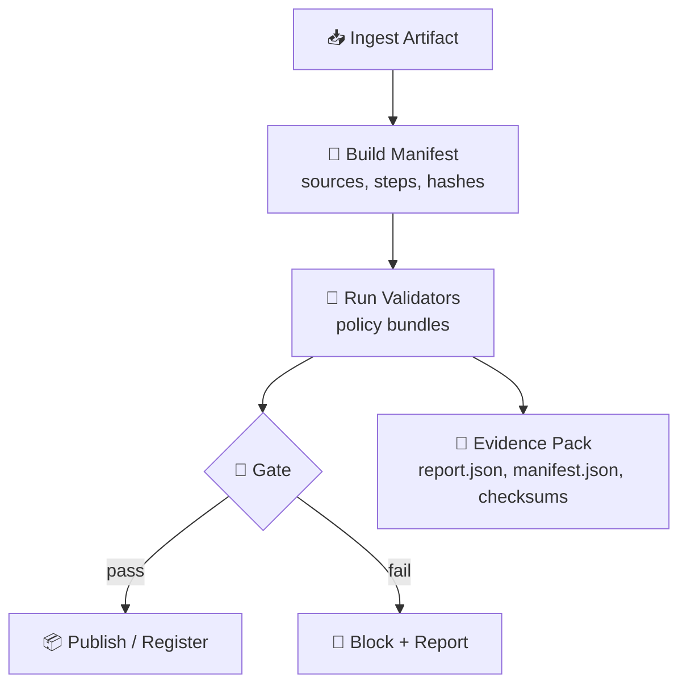

# 🛡️ KFM Policy & Validation Toolkit
[](./)
[](./)
[](./)
[](./)
[](./)

> **Folder:** `tools/validation/policy/`  
> **Goal:** make every KFM dataset, layer, model, simulation, and AI-assisted output **traceable, testable, and reviewable** — with **evidence** attached ✅

---

## 🌾 Why this exists (KFM context)
Kansas Frontier Matrix (KFM) is a **provenance-first** geospatial knowledge hub: every dataset and every AI-backed claim must be traceable to its sources and processing steps. This folder is the **“trust layer”** that enforces that promise.

**In practice, this toolkit:**
- ✅ validates incoming data (schema, CRS, metadata, integrity, licensing)
- ✅ validates analytical outputs (statistical assumptions, model metrics, uncertainty)
- ✅ validates visualization and map publishing (cartographic QA, 3D/web readiness)
- ✅ validates operational properties (security, performance, reproducibility)
- ✅ produces **audit artifacts** (reports, manifests, checksums, evidence packs)

---

## 🧭 What lives here
> This is meant to be **policy-as-code** + **validators** + **evidence outputs**.

```text
tools/validation/policy/
├─ README.md                      # 👈 you are here
├─ policies/                      # 📜 human-readable rules (YAML/JSON)
│  ├─ provenance/                 # 🔎 sources, transforms, citations, lineage
│  ├─ geospatial/                 # 🗺️ CRS, topology, bounds, geometry validity
│  ├─ statistics/                 # 📈 assumptions, experimental design, tests
│  ├─ ml/                         # 🤖 training metadata, eval metrics, drift
│  ├─ simulation/                 # 🧪 verification/validation, calibration
│  ├─ security/                   # 🔐 secrets, dependencies, threat model gates
│  ├─ performance/                # ⚡ budgets, query plans, load thresholds
│  ├─ ui/                         # 🧩 accessibility, responsiveness, rendering
│  └─ legal-ethics/               # ⚖️ licensing, privacy, human-in-loop rules
├─ schemas/                       # 🧱 JSON Schema / GeoJSON schema / metadata schema
├─ validators/                    # 🧰 runnable code (Python/R/JS/Bash hooks)
├─ examples/                      # 📦 sample manifests, reports, policy bundles
└─ reports/                       # 🧾 generated validation artifacts (gitignored)
```

---

## 🧩 Core concepts (simple + strict)
**Artifact** 📦  
Anything we ingest or publish: GeoJSON, GeoTIFF, CSV, DB table, 3D mesh, ML model, simulation run, web tiles, etc.

**Policy** 📜  
A named set of requirements (MUST/SHOULD/MAY) scoped to an artifact type + lifecycle stage.

**Validator** 🧪  
Executable logic that checks a policy rule and outputs findings + evidence.

**Evidence Pack** 🧾  
A bundle of machine-readable files that explains *what happened*:
- inputs + hashes
- transforms + parameters
- checks run + results
- environment + versions
- links to sources/licensing

**Quality Gate** 🚦  
A decision point (local/CI/release). If a gate fails, the artifact **does not ship**.

---

## 🔄 Validation flow (pipeline mental model)



---

## 🚦 Quality gates (what gets blocked)
We use **severity** to decide whether a gate blocks publishing.

| Severity | Meaning | Typical action |
|---|---|---|
| `INFO` 🟦 | informational | log only |
| `WARN` 🟨 | needs attention soon | allowed locally; may block in CI depending on bundle |
| `ERROR` 🟥 | violates policy | blocks publish in CI |
| `BLOCKER` ⛔ | critical trust breach | blocks publish everywhere |

---

## 📜 Policy families
Below are the policy families this folder enforces. Each family should have:
- **rule IDs** (stable)
- **clear scope** (what artifacts it applies to)
- **evidence requirements** (what must be produced)
- **tests** (to prevent “policy drift”)

<details>
<summary><strong>🔎 Provenance & Metadata</strong></summary>

**MUST**
- include a source list (URLs, archives, sensors, fieldwork, etc.)
- include processing steps (transform chain) with parameters
- include stable identifiers for datasets/layers (no “meaningful IDs” that change)
- include license/usage constraints
- produce hashes/checksums for inputs + outputs

**SHOULD**
- include “why” notes (intent) for major transforms
- include spatial/temporal coverage summary
- include uncertainty notes when applicable

</details>

<details>
<summary><strong>🗺️ Geospatial correctness</strong></summary>

**MUST**
- CRS declared and valid (no “unknown CRS” in published layers)
- geometry validity (self-intersections, ring orientation, etc.)
- bounds sanity checks (Kansas vs global!)
- unit correctness (meters/feet, degrees vs projected)

**SHOULD**
- topology checks for networks & administrative boundaries
- resolution / scale checks (raster pixel size or vector tolerance)
- consistent attribute typing (no silent coercion)

</details>

<details>
<summary><strong>📈 Statistics & Experimental Design</strong></summary>

**MUST**
- declare sampling method (or explicitly mark as convenience sample)
- document hypothesis tests and α/thresholds when used
- avoid leakage between train/test/time splits
- report effect sizes where relevant (not just p-values)

**SHOULD**
- include exploratory diagnostics (residuals, outliers, assumptions)
- include power considerations (when claims depend on significance)

</details>

<details>
<summary><strong>🤖 Machine Learning governance</strong></summary>

**MUST**
- record model card metadata (data sources, features, objective, constraints)
- report evaluation metrics (and baseline comparison)
- include calibration/uncertainty where applicable
- store train/val/test split logic (and seeds if deterministic)

**SHOULD**
- bias checks for protected/proxy features (context dependent)
- drift monitoring hooks for models used in production

</details>

<details>
<summary><strong>🧪 Simulation & scientific modeling V&amp;V</strong></summary>

**MUST**
- separate **verification** (code correctness) from **validation** (real-world fidelity)
- record parameters, boundary conditions, and solver versions
- provide reproducibility details (env lockfiles, seeds, deterministic options)
- include sensitivity checks for key parameters

**SHOULD**
- include calibration traces vs observations when available
- document known limitations and intended use domain

</details>

<details>
<summary><strong>🔐 Security & Privacy</strong></summary>

**MUST**
- secrets scanning (no keys/tokens in repo)
- dependency vulnerability scanning for tooling runtimes
- input validation for user-provided data uploads
- privacy classification for datasets (public/sensitive/restricted)

**SHOULD**
- threat model notes for “public endpoints”
- rate limiting + abuse monitoring policies for APIs

</details>

<details>
<summary><strong>⚡ Performance & scalability</strong></summary>

**MUST**
- query budgets for critical endpoints (time/rows scanned)
- index coverage checks for hot paths
- batch vs real-time workload separation when needed
- “worst-case” dataset size tests for core pipelines

**SHOULD**
- explain performance tradeoffs (cost vs latency)
- publish performance baselines and regression alerts

</details>

<details>
<summary><strong>🧩 UI / Web / Rendering readiness</strong></summary>

**MUST**
- accessibility baseline (keyboard nav, contrast, text scaling)
- responsive layout sanity checks (mobile + desktop)
- WebGL layer rendering constraints documented for 3D content

**SHOULD**
- map readability checks (labels, symbology consistency)
- “slow device” performance budget for map layers

</details>

<details>
<summary><strong>⚖️ Legal & Ethics (digital humanism)</strong></summary>

**MUST**
- clear user-facing attribution + citations for published content
- license compatibility checks for derived layers
- ensure AI outputs are advisory, evidence-backed, and reviewable

**SHOULD**
- document foreseeable misuse risks (high-level)
- provide “human override” pathways for contested outputs

</details>

---

## 🏷️ Policy IDs & naming conventions
Stable identifiers are non-negotiable for long-lived systems. Use this pattern:

**`KFM.<DOMAIN>.<SUBDOMAIN>.<NNN>`**

Examples:
- `KFM.PROV.SOURCES.001`
- `KFM.GEO.CRS.010`
- `KFM.ML.EVAL.020`
- `KFM.SEC.SECRETS.001`

---

## 🧾 Policy rule format (example)
Example YAML rule (illustrative):

```yaml
id: KFM.PROV.SOURCES.001
title: "Published artifacts must declare sources and processing steps"
scope:
  artifact_types: ["vector", "raster", "table", "model", "simulation", "3d"]
lifecycle_stage: ["publish", "release"]
severity: ERROR

checks:
  - type: required_field
    path: "metadata.sources"
  - type: required_field
    path: "metadata.processing_steps"
  - type: required_field
    path: "metadata.license"
  - type: checksum_required
    targets: ["inputs", "outputs"]

evidence:
  - type: manifest
    path: "reports/manifest.json"
  - type: checksums
    path: "reports/checksums.txt"
  - type: validation_report
    path: "reports/report.json"
```

---

## 🧾 Validation report format (example)
We prefer **machine-readable first**, then optional HTML.

```json
{
  "run_id": "2026-01-14T00:00:00Z__abc123",
  "artifact": {
    "type": "raster",
    "path": "data/rasters/ndvi_2025_06.tif",
    "sha256": "..."
  },
  "bundle": "publish-default",
  "results": [
    {
      "policy_id": "KFM.GEO.CRS.010",
      "severity": "ERROR",
      "status": "FAIL",
      "message": "Missing CRS metadata",
      "evidence": ["reports/manifest.json"]
    }
  ],
  "summary": {
    "pass": 12,
    "warn": 3,
    "fail": 1,
    "blocker": 0
  },
  "environment": {
    "python": "3.x",
    "os": "linux",
    "tool_versions": {
      "gdal": "x.y",
      "proj": "x.y"
    }
  }
}
```

---

## 🧰 How to run (local + CI)
> ⚠️ Commands below are the intended interface. Implementations may live in `validators/` (Python/R/JS/Bash).

### Local developer loop 🧑‍💻
- ✅ validate a single artifact:
  - `kfm validate artifact path/to/file --bundle publish-default`
- ✅ validate a folder:
  - `kfm validate folder data/ --bundle ingest-default`
- ✅ validate a pipeline run:
  - `kfm validate run runs/2026-01-14/ --bundle release-strict`

### CI enforcement 🤖
- Run on PR:
  - metadata + schema + security + unit tests
- Run on release:
  - full provenance + performance budgets + reproducibility checks
- Artifacts exported:
  - `reports/report.json`
  - `reports/manifest.json`
  - `reports/checksums.txt`

---

## ➕ Adding a new policy (workflow)
1. **Pick a domain** 📦  
   `policies/<domain>/...`

2. **Write the rule** ✍️  
   Make it:
   - scoped (artifact types + stage)
   - testable (clear pass/fail)
   - evidence-producing

3. **Implement validator** 🧪  
   Put code in `validators/` (Python preferred, but R/JS/Bash allowed).

4. **Add examples** 🧩  
   Include a minimal passing artifact + a failing artifact.

5. **Add CI wiring** 🚦  
   Ensure the rule runs in the correct bundle.

---

## 🧠 “Using all project files” — Knowledge base map
This policy layer is intentionally interdisciplinary. The project library informs both **what we validate** and **how we validate it**.

| Project file 📄 | Policy area(s) it strengthens 🔧 | How it shows up here ✅ |
|---|---|---|
| `Kansas Frontier Matrix (KFM) – Comprehensive Technical Documentation.pdf` | provenance-first, clean architecture, auditability | rule taxonomy, evidence pack requirements, trust gates |
| `Scientific Modeling and Simulation_ A Comprehensive NASA-Grade Guide.pdf` | simulation verification/validation | V&V policies, reproducibility + sensitivity checks |
| `Understanding Statistics & Experimental Design.pdf` | experimental design & inference quality | sampling metadata, hypothesis test discipline, effect sizes |
| `regression-analysis-with-python.pdf` + `Regression analysis using Python - slides-linear-regression.pdf` | regression diagnostics, leakage prevention | model QA checks, residual diagnostics hooks |
| `graphical-data-analysis-with-r.pdf` | EDA discipline and visualization sanity | diagnostic plots requirements, outlier reporting |
| `think-bayes-bayesian-statistics-in-python.pdf` | uncertainty + Bayesian reasoning | uncertainty reporting patterns, posterior checks (where used) |
| `Deep Learning for Coders with fastai and PyTorch - ...` | model training & reproducibility | model card expectations, training metadata norms |
| `Scalable Data Management for Future Hardware.pdf` | scalability thinking | batch/stream separation, storage-aware constraints |
| `Database Performance at Scale.pdf` | performance budgets and DB tuning | query budget gates, regression detection |
| `PostgreSQL Notes for Professionals - PostgreSQLNotesForProfessionals.pdf` | database correctness | schema linting, migration safety checks |
| `concurrent-real-time-and-distributed-programming-in-java-threads-rtsj-and-rmi.pdf` | streaming/sensor correctness | timestamp ordering, backpressure expectations |
| `Cloud-Based Remote Sensing with Google Earth Engine-Fundamentals and Applications.pdf` | remote sensing ingestion | raster QA checks, band metadata, projection sanity |
| `python-geospatial-analysis-cookbook.pdf` | geospatial processing | pipeline validators, CRS + geometry tooling patterns |
| `making-maps-a-visual-guide-to-map-design-for-gis.pdf` | cartographic quality | map readability & publishing checks |
| `Mobile Mapping_ Space, Cartography and the Digital - ...pdf` | mobile mapping UX | responsive/field UX validation, narrative integrity |
| `webgl-programming-guide-interactive-3d-graphics-programming-with-webgl.pdf` | web-based 3D rendering | 3D asset constraints, web performance budgets |
| `Archaeological 3D GIS_26_01_12_17_53_09.pdf` | 3D GIS correctness | 3D geometry + metadata checks for cultural datasets |
| `compressed-image-file-formats-jpeg-png-gif-xbm-bmp.pdf` | image integrity | raster format validation, compression expectations |
| `Spectral Geometry of Graphs.pdf` | graph analytics rigor | graph metric validation hooks, invariants checks |
| `Generalized Topology Optimization for Structural Design.pdf` | optimization modeling | constraint/solver metadata expectations |
| `Introduction to Digital Humanism.pdf` | ethics + human-centered design | “AI is advisory” gates, transparency requirements |
| `On the path to AI Law’s prophecies and the conceptual foundations of the machine learning age.pdf` | governance + legal risk | risk classification, compliance metadata stubs |
| `ethical-hacking-and-countermeasures-secure-network-infrastructures.pdf` | defensive security | scanning requirements, threat model expectations |
| `Gray Hat Python - ...pdf` | secure tooling awareness | hardening guidelines, safe testing boundaries |
| `responsive-web-design-with-html5-and-css3.pdf` | UI correctness | accessibility + responsive policy bundle |
| `Data Spaces.pdf` | interoperability | metadata harmonization + exchange contracts |
| Programming collections: `A programming Books.pdf`, `B-C programming Books.pdf`, `D-E ...`, `F-H ...`, `I-L ...`, `M-N ...`, `O-R ...`, `S-T ...`, `U-X ...` | multi-language coverage | consistent policy interfaces + cross-language tooling |

---

## 📚 Glossary (quick)
- **Provenance**: where data came from + how it changed 🔎
- **Lineage**: the transform chain over time 🧬
- **Attestation**: a signed/recorded statement that checks were run ✍️
- **Policy bundle**: a curated ruleset for a stage (ingest/publish/release) 📦
- **Drift**: model behavior changes due to data shift over time 🌊

---

## ✅ Definition of Done for “trusted publish”
A publishable artifact must include:
- [ ] stable ID
- [ ] declared license + attribution
- [ ] declared CRS (if spatial)
- [ ] schema / type checks pass
- [ ] provenance manifest produced
- [ ] checksums produced
- [ ] validation report produced
- [ ] no `ERROR` or `BLOCKER` findings in the target bundle

---

## 🧭 Next steps (recommended)
- Add policy bundles:
  - `ingest-default`
  - `publish-default`
  - `release-strict`
- Implement a minimal CLI runner:
  - `kfm validate ...`
- Add “policy unit tests” (rules must be testable or they don’t ship)

---

> ⭐ Keep KFM honest: if an artifact cannot explain itself, it doesn’t belong in the atlas.

