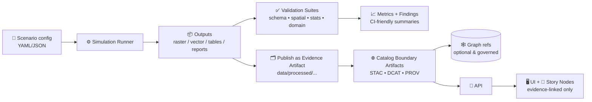

# 🧪 Simulation Validation Harness (`tools/validation/sim`)


> **Goal:** run *credible* simulations (hydrology, land-use, economics, archaeology, etc.), validate them rigorously, and publish the outputs as **first-class evidence artifacts** in KFM (with provenance + catalogs) ✅

---

## 🌾 Why this exists

KFM’s north star is **“searchable, mappable, auditable, and modelable”** knowledge. Simulation is how we go from *observations* to *scenarios* — but only if we can prove:
- where inputs came from 🧾
- how outputs were produced ⚙️
- how well they match reality (or at least expectations) 📏
- how uncertain they are 🎲
- how they evolve over time (versioning) 🏷️

This directory is the “**VVUQ**” corner (Verification, Validation, Uncertainty Quantification) of the project.

---

## ✅ Non‑negotiables (KFM-aligned)

- **Evidence-first:** sim outputs are treated like any other dataset (published before being interpreted) 🧩  
- **Contract-first:** schemas + API contracts are first-class and versioned (breaking changes require explicit bumps) 🔒  
- **Deterministic pipelines:** config-driven + idempotent transforms (same inputs → same outputs) ♻️  
- **Provenance-first:** every artifact is traceable to sources + processing steps (no black boxes) 🔍  
- **Cataloged outputs:** STAC/DCAT/PROV are produced for outputs (not optional) 🗃️  
- **Governed exposure:** anything shown in UI goes through API gates (classification + redaction rules) 🛡️  

> If a simulation can’t be explained, reproduced, and cited, it doesn’t ship.

---

## 🗺️ Where this fits in the KFM pipeline



---

## 🚀 Quickstart (developer workflow)

> This is written as an **interface contract** for the module. If your repo already has a CLI entrypoint, map these commands to it.

```bash
# 1) From repo root: create an environment (example)
python -m venv .venv
source .venv/bin/activate
pip install -r requirements.txt

# 2) Run an example scenario
python -m tools.validation.sim.cli run \
  --scenario tools/validation/sim/examples/scenario_demo.yaml \
  --out mcp/runs/demo_run

# 3) Validate outputs
python -m tools.validation.sim.cli validate \
  --run mcp/runs/demo_run \
  --suite tools/validation/sim/suites/core.yaml

# 4) Publish outputs into KFM’s governed data/catalog pipeline
python -m tools.validation.sim.cli publish \
  --run mcp/runs/demo_run \
  --domain hydrology \
  --dataset-slug demo_drought_sim_v0
```

---

## 🧩 Core concepts

### 1) Scenario 🧾
A declarative config (YAML/JSON) that defines:
- model to use
- region of interest (geometry / bbox)
- time range
- parameters + interventions
- input datasets (by stable IDs + versions)
- random seeds (if stochastic)

### 2) Model ⚙️
A versioned implementation that can be executed deterministically given:
`(scenario, inputs, seed, environment) → outputs`

### 3) Run 🧪
A single execution instance that **must** produce a machine-readable manifest.

### 4) Evidence artifact 📦
A produced dataset/output that is:
- stored under `data/processed/...` (or staging equivalent)
- cataloged in **STAC/DCAT**
- traced end-to-end in **PROV**
- optionally referenced in the knowledge graph (with provenance links)

---

## 🗂️ Suggested directory layout

> Keep this folder small, modular, and swappable (clean architecture mindset 🧱).

```text
tools/validation/sim/
├── 📄 README.md
├── 🐍 cli.py                      # `run | validate | report | publish`
├── 📁 engine/                     # common runtime (seeding, IO, scheduling)
├── 📁 models/                     # model implementations (or adapters)
├── 📁 scenarios/                  # curated scenarios (versioned)
├── 📁 suites/                     # validation suite definitions (YAML)
├── 📁 validators/                 # spatial/statistical/domain validators
├── 📁 metrics/                    # metric computation + aggregations
├── 📁 reports/                    # report templates (HTML/MD) + builders
└── 📁 examples/                   # minimal runnable demos
```

---

## 🧾 Run output contract (required)

A run is a folder with **reproducibility boundary artifacts**.

```text
mcp/runs/<run_id>/
├── 📄 run.manifest.json          # inputs, parameters, seeds, versions, hashes
├── 📄 metrics.json               # machine-readable metrics summary
├── 📄 validation.report.json     # validator outputs + pass/fail gates
├── 📄 logs.txt                   # structured logs preferred
├── 📁 outputs/                   # files produced by the model
│   ├── 🗺️ result.tif             # (example raster)
│   ├── 🧭 features.geoparquet     # (example vector)
│   └── 📊 timeseries.parquet      # (example table)
└── 📁 catalogs/                  # if publishing from the run directory
    ├── 🌐 stac_item.json
    ├── 🌐 dcat_dataset.json
    └── 🌐 prov_bundle.jsonld
```

### Minimal manifest fields (recommendation)

```json
{
  "run_id": "sim-2026-01-14T000000Z-acde123",
  "model": { "id": "hydrology.swat", "version": "0.1.0" },
  "scenario": { "id": "demo_drought", "version": "0.1.0" },
  "inputs": [
    { "dataset_id": "noaa.precip_monthly", "version": "2.0.0", "uri": "data/processed/noaa/precip_v2.parquet", "sha256": "..." }
  ],
  "parameters": { "irrigation_restriction_pct": 25 },
  "random_seed": 12345,
  "time": { "start": "1980-01-01", "end": "2020-12-31" },
  "region": { "crs": "EPSG:4326", "bbox": [-102.0, 36.9, -94.6, 40.0] },
  "code": { "git_sha": "abcdef123456", "dirty": false },
  "environment": { "python": "3.x", "platform": "linux", "deps_lock": "requirements.txt" },
  "outputs": [
    { "path": "outputs/result.tif", "type": "raster", "role": "prediction", "stac_asset_key": "prediction_raster" }
  ]
}
```

---

## ✅ Validation pyramid (what “validated” means here)

Think of validation as stacked gates — you don’t do fancy stats on broken geometry.

### Gate 0 — Smoke / execution
- run completes
- outputs exist
- runtime within budget

### Gate 1 — Schema & integrity
- file formats readable
- CRS present + correct
- geometries valid (no self-intersections, etc.)
- nodata/NaN rules respected
- units + ranges plausible

### Gate 2 — Spatial correctness (GIS validation)
- overlays and joins behave as expected
- topology constraints hold (if relevant)
- raster alignment / resolution / extent checks
- spatial “diff” against baseline (where applicable)

### Gate 3 — Statistical validation
- regression diagnostics: residual bias, error metrics, calibration
- time-series checks: drift, autocorrelation surprises, seasonality mismatch
- classification checks: confusion matrix, PR curves (if applicable)
- uncertainty checks: coverage of prediction intervals (if UQ provided)

### Gate 4 — Domain rules (model-specific)
Examples:
- hydrology: water balance constraints, mass conservation checks
- agriculture: crop yield bounds and plausible response curves
- economics: budget constraints, stability checks, sanity of elasticities
- archaeology: viewshed/visibility constraints, terrain-consistent outputs

### Gate 5 — Reproducibility & provenance
- manifest complete
- inputs hashed + versioned
- outputs cataloged (STAC/DCAT)
- lineage recorded (PROV)

---

## 🎲 Uncertainty & Sensitivity (UQ)

If the model is stochastic or parameter-sensitive, we treat UQ as **first-class**:

- Monte Carlo ensembles (multiple seeds) 🎯  
- Bootstrapping & resampling for metrics 📦  
- Sensitivity analysis (e.g., OAT, factorial, LHS) 🧪  
- Bayesian calibration (when warranted) 🧠  

**Rule:** every uncertainty artifact must still be **cataloged and traced**, not dumped in notebooks.

---

## 🌐 Cataloging & provenance (STAC • DCAT • PROV)

Simulation outputs are “evidence artifacts” and must be published like any other dataset:

- **Stored** in `data/processed/<domain>/...`  
- **Cataloged** in STAC/DCAT (discovery + spatial/temporal indexing)  
- **Traced** in PROV (inputs → activity → outputs)  
- **Optionally referenced** in graph with explicit provenance pointers  

### Versioning expectations 🏷️
- dataset updates produce new versions linked via `prov:wasRevisionOf`
- graph/ontology changes are migrated intentionally (no silent breakage)
- API changes are versioned (OpenAPI is the contract)
- repo releases follow semantic versioning (major/minor/patch)

---

## 🗄️ Storage & performance notes

Simulation outputs can be *large*. Design like it’s going to scale:

- Prefer cloud-optimized / query-friendly formats:
  - **COG** for rasters 🗺️
  - **GeoParquet** for vectors 🧭
  - **Parquet** for tabular/time-series 📊
  - **Zarr** where chunked arrays make sense 🧊
- If storing in Postgres/PostGIS:
  - use spatial indexes (GiST/SP-GiST)
  - partition big tables by time or region
  - precompute aggregates for UI browsing (don’t DDOS yourself)

> Validation should include *performance budgets* (e.g., “this scenario must run under X minutes on CI hardware”).

---

## 🔐 Governance & security (defense-minded)

Simulation pipelines touch:
- external datasets
- lots of file IO
- databases
- user-authored scenario configs

So we assume adversarial inputs are possible:
- validate & sanitize scenario files ✅
- avoid dynamic code execution in scenario configs ❌
- parameterize all database queries ✅
- restrict published artifacts through API governance ✅
- treat “predictions” as potentially sensitive; label them clearly 🏷️

---

## 🖼️ Visualization integration

This tool is not the UI — but it should produce UI-friendly artifacts:
- map-ready layers (tiled where needed)
- cartography-aware symbology hints (optional)
- 3D-ready outputs (when relevant) for WebGL/3D GIS workflows
- mobile-friendly summaries (small, legible, responsive)

---

## 🧱 Extending this module (the “happy path”)

### Add a new simulation model
1. Create a `models/<model_id>/` folder (or adapter to external engine)
2. Implement the model interface (run + metadata)
3. Add at least:
   - one example scenario
   - one validation suite
   - one baseline/golden dataset comparison (if feasible)
4. Ensure publishing emits STAC/DCAT/PROV

### Add a new validator
1. Add `validators/<name>.py`
2. Define inputs/outputs clearly
3. Add unit tests + at least one failure case fixture
4. Make it composable in suite YAML

### Add a new suite
1. Create `suites/<suite_name>.yaml`
2. Keep suites layered (schema → spatial → stats → domain)
3. Add CI gate semantics: required vs warning-only

---

## 📚 Project library mapping (using *all* project files)

<details>
<summary>📖 Click to expand (this repo’s PDFs inform both the scientific and systems design)</summary>

### Simulation credibility & VVUQ
- **Scientific Modeling and Simulation_ A Comprehensive NASA-Grade Guide.pdf** → verification/validation/UQ mindset, run discipline
- **Understanding Statistics & Experimental Design.pdf** → DOE planning for simulation campaigns
- **think-bayes-bayesian-statistics-in-python.pdf** → Bayesian calibration + uncertainty reasoning
- **graphical-data-analysis-with-r.pdf** → EDA patterns for output inspection

### Evaluation, regression & ML validation
- **regression-analysis-with-python.pdf** → regression diagnostics + evaluation workflows
- **Regression analysis using Python - slides-linear-regression.pdf** → quick metric/diagnostic patterns
- **I-L programming Books.pdf** → supervised learning validation patterns (for surrogate models)
- **F-H programming Books.pdf** → ML foundations + validation/regularization concepts (for ML components)
- **Understanding Machine Learning (internal reference)** → generalization, bias/variance, learning theory
- **Data Mining - Concepts and Applications (internal reference)** → anomaly detection/pattern mining for outputs

### Geospatial modeling & cartographic quality
- **python-geospatial-analysis-cookbook.pdf** → geospatial transforms, raster/vector ops
- **making-maps-a-visual-guide-to-map-design-for-gis.pdf** → map communication & design quality
- **Cloud-Based Remote Sensing with Google Earth Engine-Fundamentals and Applications.pdf** → remote sensing inputs + validation sources
- **Archaeological 3D GIS_26_01_12_17_53_09.pdf** → 3D GIS domain workflows + evidence handling
- **Mobile Mapping_ Space, Cartography and the Digital - 9789048535217.pdf** → mobile UX implications for map-based evidence
- **webgl-programming-guide-interactive-3d-graphics-programming-with-webgl.pdf** → 3D visualization pipeline
- **responsive-web-design-with-html5-and-css3.pdf** → responsive dashboards for results

### Data management, provenance, and scale
- **PostgreSQL Notes for Professionals - PostgreSQLNotesForProfessionals.pdf** → DB fundamentals
- **Database Performance at Scale.pdf** → indexing, performance budgets, query tuning
- **Scalable Data Management for Future Hardware.pdf** → future-proof performance + heterogeneous execution concepts
- **Data Spaces.pdf** → interoperability + trust/security as cross-cutting concerns

### Domain extensions & systems modeling
- **Principles of Biological Autonomy - book_9780262381833.pdf** → complex systems / agent-based inspiration
- **Spectral Geometry of Graphs.pdf** → network/graph modeling ideas for infrastructure & flows
- **Generalized Topology Optimization for Structural Design.pdf** → structural simulation patterns
- **concurrent-real-time-and-distributed-programming-in-java-threads-rtsj-and-rmi.pdf** → distributed/real-time orchestration ideas

### Governance, ethics, and transparency
- **Introduction to Digital Humanism.pdf** → transparency/accountability expectations around automated systems
- **On the path to AI Law’s prophecies and the conceptual foundations of the machine learning age.pdf** → governance framing around ML artifacts

### Security & defensive posture
- **ethical-hacking-and-countermeasures-secure-network-infrastructures.pdf** → hardening mindset
- **Gray Hat Python - Python Programming for Hackers and Reverse Engineers (2009).pdf** → “know the attacker” for safer tooling
- **compressed-image-file-formats-jpeg-png-gif-xbm-bmp.pdf** → choose safe + correct media formats for outputs

### Language/tooling breadth (engineering references)
- **A programming Books.pdf**
- **B-C programming Books.pdf**
- **D-E programming Books.pdf**
- **F-H programming Books.pdf**
- **I-L programming Books.pdf**
- **M-N programming Books.pdf**
- **O-R programming Books.pdf**
- **S-T programming Books.pdf**
- **U-X programming Books.pdf**
  - Used as a general toolbox reference for implementations (Python, Bash automation, MATLAB interoperability, mobile/iOS considerations, etc.)

### KFM-specific north star & repo standards
- **Kansas Frontier Matrix (KFM) – Comprehensive Technical Documentation.pdf** → mission, provenance-first, “modelable & auditable”
- **MARKDOWN_GUIDE_v13.md.gdoc (Master Guide)** → canonical pipeline ordering + STAC/DCAT/PROV requirements + versioning rules
- **Scientific Method _ Research _ Master Coder Protocol Documentation.pdf** → reproducible research documentation discipline

</details>

---

## 🧾 What “done” looks like (Definition of Done)

A simulation contribution is “done” when:
- ✅ scenario(s) exist and are runnable
- ✅ validation suite(s) exist and pass on CI
- ✅ manifest is complete (hashes, versions, parameters, seeds)
- ✅ outputs are stored in the right place
- ✅ STAC/DCAT/PROV exist and validate against project profiles
- ✅ exposure path is governed (API, labeling, classification if needed)
- ✅ docs are updated (this README + domain runbook if applicable)

---

## 🤝 Contributing

- Keep PRs small and auditable.
- Prefer adding **one scenario + one suite** per PR.
- Never ship uncited outputs into narratives.
- If you need a new schema/contract, treat it as a first-class artifact and version it.

---

## 🧭 Related docs (repo paths)

- `docs/MASTER_GUIDE_v13.md` (canonical pipeline + contracts)
- `docs/standards/KFM_STAC_PROFILE.md`
- `docs/standards/KFM_DCAT_PROFILE.md`
- `docs/standards/KFM_PROV_PROFILE.md`
- `docs/governance/ETHICS.md`
- `docs/governance/SOVEREIGNTY.md`

> If any of these paths differ in your current repo layout, update this section to match the canonical home.
