# 🛰️ STAC Validation (KFM)


> ✅ **Treat metadata like code:** STAC must “compile” (schema + semantics + governance) *before* anything is considered publishable, indexable, or UI-ready.

---

## 🧭 Contents

- [📘 Overview](#-overview)
- [🗂️ Directory Layout](#️-directory-layout)
- [🚀 Quick Start](#-quick-start)
- [✅ What We Validate](#-what-we-validate)
- [⚙️ Configuration](#️-configuration)
- [🧾 Reports & Exit Codes](#-reports--exit-codes)
- [🤖 CI Integration](#-ci-integration)
- [🧰 Common Fixes](#-common-fixes)
- [🧩 Extending the Validator](#-extending-the-validator)
- [🛡️ Governance & Safety](#️-governance--safety)
- [🧪 Definition of Done](#-definition-of-done)
- [📚 References](#-references)

---

## 📘 Overview

KFM uses **STAC (SpatioTemporal Asset Catalog)** as the *canonical* index for geospatial assets (rasters, vectors, tiles, derived layers, etc.). In the v13 pipeline, **STAC Items + Collections are “boundary artifacts”**: they are required **before** downstream systems (graph, API, UI, Story Nodes, Focus Mode) may consume or expose a dataset.

This folder contains (or is the home for) the **STAC validation toolchain** that:

- 🔎 validates **STAC Collections** and **STAC Items** under the canonical catalog roots
- 🧱 enforces the **KFM STAC profile** (project-specific required fields on top of base STAC)
- 🔗 checks **link & asset integrity** so catalogs never point to missing/unstable artifacts
- 🛡️ enforces **license + sensitivity + redaction** invariants so we never “publish less restricted than the inputs”

### 🌐 Where STAC fits in the pipeline

```mermaid
flowchart LR
  subgraph Data
    A["Raw Sources"] --> B["ETL + Normalization"]
    B --> C["STAC Items + Collections"]
    C --> D["DCAT Dataset Views"]
    C --> E["PROV Lineage Bundles"]
  end

  C --> G["Neo4j Graph (references back to catalogs)"]
  G --> H["API Layer (contracts + redaction)"]
  H --> I["Map UI — React · MapLibre · (optional) Cesium"]
  I --> J["Story Nodes (governed narratives)"]
  J --> K["Focus Mode (provenance-linked context bundle)"]
```



---

## 🗂️ Directory Layout

### 📦 Canonical data roots (v13)

```text
📦 repo-root/
├─ 📂 data/
│  ├─ 📂 raw/                   # source drops
│  ├─ 📂 work/                  # intermediate artifacts
│  ├─ 📂 processed/             # ✅ final publishable assets (what STAC points to)
│  ├─ 📂 stac/
│  │  ├─ 📂 collections/        # ✅ STAC Collection JSON
│  │  └─ 📂 items/              # ✅ STAC Item JSON
│  ├─ 📂 catalog/
│  │  └─ 📂 dcat/               # DCAT JSON-LD discovery layer
│  └─ 📂 prov/                  # PROV bundles (lineage)
└─ 📂 tools/
   └─ 📂 validation/
      ├─ 📄 README.md           # Catalog QA gate overview (if present)
      └─ 📂 stac/
         ├─ 📄 README.md        # 👈 you are here
         └─ 🧪 (validator implementation lives here)
```

### 🧠 Related “standards as code” docs

These should exist in `docs/standards/` (and are treated like contracts):

- `docs/standards/KFM_STAC_PROFILE.md`
- `docs/standards/KFM_DCAT_PROFILE.md`
- `docs/standards/KFM_PROV_PROFILE.md`

---

## 🚀 Quick Start

> The exact entrypoint may vary depending on how the repo wires tooling. The commands below define the **intended interface** for this folder.

### 1) Validate everything (fast mode)

```bash
python -m tools.validation.stac \
  --root data/stac \
  --mode fast
```

### 2) Validate everything (deep mode)

Deep mode is where we do the “NASA-grade” checks: geometry validity, CRS sanity, asset-level checks, and governance consistency.

```bash
python -m tools.validation.stac \
  --root data/stac \
  --mode deep \
  --report build/reports/stac_validation.json
```

### 3) Validate a single file (useful in PRs)

```bash
python -m tools.validation.stac \
  --file data/stac/items/<collection-id>/<item-id>.json
```

### 4) Show help

```bash
python -m tools.validation.stac --help
```

---

## ✅ What We Validate

KFM validation is **profile-driven**: base STAC rules apply everywhere, while KFM-specific rules are loaded from the project profiles/schemas.

### ✅ Rule families

1. **📐 Spec & Schema**
   - Base STAC required fields (Collection/Item minimums)
   - JSON Schema validation (base + KFM profile)
   - STAC extensions present when required (`stac_extensions`)

2. **🔗 Links & Assets**
   - `links[].href` must be resolvable (relative paths must resolve within repo)
   - `assets.*.href` must exist locally (or pass allowlisted remote checks)
   - `assets.*.type` (media-type) must match the file format
   - `assets.*.roles` present and meaningful (e.g., `data`, `thumbnail`, `overview`)

3. **🧭 Spatial sanity**
   - `geometry` is valid (no self-intersections, etc.)
   - `bbox` matches `geometry`
   - CRS expectations: **track original CRS**, distribute/index in **WGS84** where applicable
   - Optional Kansas constraints (profile-controlled): ensure AOI intersects expected jurisdiction

4. **⏱️ Temporal sanity**
   - `properties.datetime` or `start_datetime/end_datetime` exists and is ISO-8601
   - Item timestamps are within Collection temporal extent (where defined)

5. **📜 Governance (FAIR + CARE)**
   - `license` is present and non-empty (Collection and/or Item per profile)
   - provider attribution is present (who made it, who maintains it)
   - sensitivity/classification tags present (profile-controlled)
   - redaction/generalization is documented when required

6. **🧬 Cross-layer linkage**
   - Optional (but recommended) checks that STAC references:
     - DCAT dataset entry (for discovery)
     - PROV bundle or run-id (for reproducibility)
   - Ensures graph entries can reference catalog IDs rather than duplicating payloads

### 📋 Rule table (starter set)

| Rule ID | Severity | Applies to | What it checks | Typical fix |
|---|---:|---|---|---|
| `STAC-SCHEMA-001` | ❌ error | Item + Collection | Valid JSON + base STAC schema + KFM profile schema | Fill required fields; re-run generator |
| `STAC-ID-002` | ❌ error | Item + Collection | IDs follow KFM dataset naming conventions (e.g., `kfm.ks.landcover.2000_2020.v1`) | Rename IDs + update references |
| `STAC-LINK-010` | ❌ error | Item + Collection | `links[].href` resolves (no broken internal links) | Fix path; prefer stable, relative links |
| `STAC-ASSET-020` | ❌ error | Item | At least one primary data asset; roles + media-types valid | Add/update asset block |
| `STAC-GEO-030` | ⚠️ warn | Item | Geometry validity + bbox matches | Fix geometry; recompute bbox |
| `STAC-CRS-031` | ⚠️ warn | Item | CRS metadata present (original tracked, normalized output declared) | Add CRS/proj fields per profile |
| `STAC-TIME-040` | ⚠️ warn | Item | Datetime fields exist and are coherent | Fix timestamps; align with Collection |
| `STAC-LICENSE-050` | ❌ error | Collection (and/or Item) | License present and consistent | Add license; verify compatibility |
| `STAC-CARE-060` | ❌ error | Item + Collection | Sensitivity/classification present + consistent | Add tags; propagate restrictions |
| `STAC-XREF-070` | ⚠️ warn | Item + Collection | Optional cross-links to DCAT/PROV exist | Add missing xrefs; ensure stable IDs |

> 💡 Severity is configurable. In CI, most projects run `error => fail build`, `warn => allowed (but noisy)`.

---

## ⚙️ Configuration

Recommended: keep config *small*, defaulting to the KFM profiles as the source of truth.

Example `tools/validation/stac/config.yml` (illustrative):

```yaml
mode: deep                 # fast | deep
fail_on: error             # error | warn | never

paths:
  stac_root: data/stac
  processed_root: data/processed

profiles:
  stac_profile: docs/standards/KFM_STAC_PROFILE.md
  dcat_profile: docs/standards/KFM_DCAT_PROFILE.md
  prov_profile: docs/standards/KFM_PROV_PROFILE.md

network:
  check_remote_assets: false
  allow_remote_schemes: ["https", "s3"]
  allow_remote_domains:
    - "example-storage.org"
    - "usgs.gov"

kfm:
  require_license: true
  require_sensitivity: true
  require_faircare_block: true

  # Suggested ID convention (adjust to match project rules)
  dataset_id_pattern: "^kfm\\.ks\\.[a-z0-9_]+\\.[0-9]{4}(_[0-9]{4})?\\.v[0-9]+$"
```

---

## 🧾 Reports & Exit Codes

### 📤 Output formats

- **Console summary** (default): concise list of failures with file paths + rule IDs
- **JSON report** (`--report path.json`): machine-readable results (for CI artifacts)
- **SARIF** (`--sarif path.sarif`, optional): for GitHub “code scanning”-style UX
- **JUnit XML** (`--junit path.xml`, optional): for CI test dashboards

### 🚦 Exit codes (recommended)

- `0` → clean ✅
- `1` → errors found ❌
- `2` → configuration/usage error 🧯

---

## 🤖 CI Integration

KFM’s “Catalog QA Gate” should invoke this validator on every PR. A minimal GitHub Actions step looks like:

```yaml
- name: Validate STAC (KFM)
  run: |
    python -m tools.validation.stac \
      --root data/stac \
      --mode deep \
      --report build/reports/stac_validation.json
```

### ✅ CI expectations

- broken links, missing profiles, schema failures → **fail the build**
- any sign of **sensitivity downgrade** (“output less restricted than input”) → **fail the build**
- deep geometry checks may be warn/error depending on domain maturity, but the long-term target is **zero-defect catalogs** 🧼✨

---

## 🧰 Common Fixes

### ❌ “Missing license”
- Add `license` to the **Collection** (and Item if your profile requires it).
- Keep license consistent across derived products unless explicitly justified.

### ❌ “Broken asset href”
- Prefer stable, repo-relative paths into `data/processed/**`.
- If assets are remote (S3/HTTPS), ensure they are:
  - stable URLs
  - on an allowlist (if CI forbids arbitrary domains)
  - accompanied by hashes/checksums when possible

### ⚠️ “BBox doesn’t match geometry”
- Recompute bbox from geometry.
- Ensure coordinate order is correct (lon/lat).

### ⚠️ “Invalid geometry”
- Fix self-intersections / invalid rings.
- If geometry is intentionally generalized/redacted, **document it** in the metadata and ensure classification reflects it.

### ⚠️ “CRS metadata missing”
- Track **original CRS** (what the data arrived in).
- Declare **normalized distribution CRS** (commonly WGS84) where required by the pipeline.

---

## 🧩 Extending the Validator

### 🧱 Preferred approach: contract-first

When adding new required fields:
1. Update the **KFM STAC profile** (and its schema, if applicable).
2. Add the validator rule(s) that enforce it.
3. Add fixtures + tests.

> 🧠 Rule of thumb: *If it matters enough to enforce, it belongs in the profile.*

### 🧪 Rule author checklist

- [ ] New rule has a stable ID: `STAC-<AREA>-NNN`
- [ ] Rule is deterministic (same inputs → same outputs)
- [ ] Rule has a “fast” implementation (no network) unless explicitly opted-in
- [ ] Rule documents remediation (“how to fix”)
- [ ] Rule has tests + at least one failing fixture

---

## 🛡️ Governance & Safety

KFM’s governance rules are not “nice-to-haves”—they’re **validation constraints**.

### 🔒 Sensitivity invariants

- **No downstream loosening of restrictions** is allowed.
- If raw inputs are restricted/confidential, then:
  - STAC metadata must reflect that classification
  - processed assets must be redacted/generalized appropriately
  - API/UI must enforce access control

### 🧼 Redaction transparency

If redaction/generalization occurs, metadata must explicitly state:
- **what** was redacted (e.g., coordinates generalized, attributes removed)
- **why** (CARE / privacy / sovereignty)
- **how** (method + parameters if appropriate)

### 🧯 Security posture (validator implementation)

Validators must treat all inputs as untrusted:
- do not execute content
- normalize/guard paths (avoid traversal)
- keep network checks opt-in and allowlisted

---

## 🧪 Definition of Done

### ✅ For any dataset PR touching `data/stac/**`

- [ ] STAC Collection exists (or updated) under `data/stac/collections/`
- [ ] STAC Item(s) exist under `data/stac/items/` for published assets
- [ ] STAC Items point to real assets under `data/processed/**` (or stable storage)
- [ ] `license` present and correct
- [ ] providers/attribution present (source + KFM pipeline responsibility)
- [ ] sensitivity/classification tags present and consistent
- [ ] any redaction/generalization documented
- [ ] validator passes locally (`--mode fast`)
- [ ] CI passes (`--mode deep`)

### ✅ For validator changes

- [ ] rule table updated in this README
- [ ] tests + fixtures added
- [ ] reports remain stable (no noisy nondeterminism)
- [ ] performance acceptable on full catalog scan

---

## 📚 References

### 🔗 Internal (KFM)

- `docs/MASTER_GUIDE_v13.md`
- `docs/standards/KFM_STAC_PROFILE.md`
- `docs/standards/KFM_DCAT_PROFILE.md`
- `docs/standards/KFM_PROV_PROFILE.md`
- `docs/standards/KFM_MARKDOWN_WORK_PROTOCOL.md` (if present)

### 🌍 External (STAC ecosystem)

- STAC specification + extensions (use official schemas whenever possible)

---

<details>
<summary>📚 Design inputs & reference shelf (project library context)</summary>

This validator follows KFM’s “NASA-grade” standards mindset and is influenced by the project’s reference shelf, including:

- **Architecture + contracts:** KFM technical documentation & Master Guide (v13)
- **Reproducibility:** provenance + “metadata as code” + evidence artifacts
- **Scientific V&V:** modeling/simulation validation and test discipline
- **Stats & uncertainty:** experimental design + regression/Bayesian workflows
- **Geospatial practice:** remote sensing + geospatial processing recipes
- **Scale & performance:** database/performance engineering + scalable data management concepts
- **Ethics & governance:** digital humanism + AI law foundations + data space governance themes
- **Web mapping needs:** web-friendly asset types (COG/tiles/thumbnails) and visualization constraints
- **Implementation patterns:** the project’s programming book shelf (A–X)

</details>
