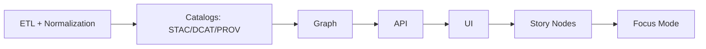

# 📊 KFM Stats Validation Toolkit (`tools/validation/stats`)


**Goal:** turn “trust me” data into **measurable, repeatable, and CI-enforced** quality signals ✅  
This folder is where KFM computes **dataset stats** + runs **statistical validation checks** so that every dataset in `data/processed/` and `data/catalog/` stays **audit-friendly** and **merge-safe**.

---

## 🧭 Where this fits in KFM

KFM’s pipeline ordering is strict:



**This tool lives in the “Catalogs” neighborhood**: it exists to make sure we can publish stats and quality signals *as metadata* (and block merges when quality regressions appear). 🧪🧱

---

## ✅ What this tool is responsible for

### 1) Dataset profiling (stats-as-metadata)
Produce compact, stable summaries that are safe to store alongside metadata:

- **Tabular** (`.parquet`, `.csv`): row counts, missingness, uniqueness, min/max, percentiles, cardinality, top-K values.
- **Vector geospatial** (`.geojson`, `.geoparquet`): feature counts, geometry types, invalid geometry count, bbox, CRS, area/length summaries.
- **Raster** (`.tif`, COG): nodata %, min/max/mean/std, histogram bins (optional), basic tiling / overview checks (optional).
- **Time series**: coverage window, gaps, duplicates, cadence drift.
- **Graph-ish datasets**: node/edge counts, connected component counts, degree distribution summary (optional).

### 2) Rule checks (deterministic validation)
Rule checks are explicit and config-driven, e.g.:

- Schema-level: required columns, dtypes, nullable vs non-nullable
- Range checks: `0 ≤ value ≤ max_expected`
- Allowed values / vocab checks (enums)
- Uniqueness checks: primary keys, compound keys
- Spatial: CRS, bbox bounds, geometry validity, simplified geometry constraints
- License + metadata completeness checks (usually shared with / complementing Catalog QA)

### 3) Drift & regression detection (quality over time)
Compare **current output** vs **baseline** (typically previous version in `main`, or the last published dataset):

- Distribution drift tests (continuous + categorical)
- Missingness drift
- Cardinality drift
- Schema drift (columns added/removed/renamed)
- Spatial extent drift (bbox changes, geometry invalidity increases)

---

## 🧰 Relationship to `tools/validation/catalog_qa`

**Catalog QA** is the hard gate for:
- required metadata fields
- schema compliance for STAC/DCAT/PROV
- broken links / missing referenced files
- basic sanity checks

**Stats Validation** extends that with:
- deeper profiling
- statistical drift checks
- dataset-level “health metrics”
- machine-readable reports for dashboards/telemetry

> Think: **Catalog QA = “Is it valid?”**  
> Stats Validation = **“Is it stable and trustworthy?”** 📈

---

## 🚀 Quickstart

> These commands are **reference interfaces**. If your implementation differs, keep the *behavior* and *outputs* but adjust the CLI.

### Run all configured stats validations
```bash
python -m tools.validation.stats run \
  --config tools/validation/stats/configs/default.yml \
  --out artifacts/validation/stats_report.json
```

### Run stats for a single dataset
```bash
python -m tools.validation.stats run \
  --dataset-id population_county_1860_2020 \
  --config tools/validation/stats/configs/default.yml \
  --out artifacts/validation/stats_population.json
```

### Produce a human-readable Markdown report
```bash
python -m tools.validation.stats report \
  --in artifacts/validation/stats_report.json \
  --format md \
  --out artifacts/validation/stats_report.md
```

---

## ⚙️ Configuration

Recommended pattern: one config file, multiple datasets, explicit baselines.

```yaml
version: 1

defaults:
  sample_rows: 250000          # avoid pulling full datasets in CI when huge
  fail_on_warning: false
  max_report_size_kb: 512

outputs:
  json: artifacts/validation/stats_report.json
  md: artifacts/validation/stats_report.md
  junit: artifacts/validation/stats_report.junit.xml

datasets:
  - id: population_county_1860_2020
    kind: tabular
    path: data/processed/population/population_county_1860_2020.parquet
    baseline:
      strategy: git_main        # or: explicit_path, latest_catalog, etc.
    checks:
      - type: required_columns
        columns: [county_id, year, population]
      - type: range
        column: population
        min: 0
      - type: uniqueness
        columns: [county_id, year]
      - type: drift_ks
        column: population
        alpha: 0.01

  - id: county_boundaries
    kind: vector
    path: data/processed/boundaries/counties.geoparquet
    checks:
      - type: crs
        epsg: 4326
      - type: geometry_valid
      - type: bbox_within
        bbox: [-102.05, 36.99, -94.59, 40.01]
```

### 🧩 Check types (suggested minimum set)

| Check | Purpose | Typical Fail Condition |
|------|---------|------------------------|
| `required_columns` | Schema presence | missing column(s) |
| `dtype` | Type consistency | dtype drift |
| `range` | Value sanity | out-of-range |
| `allowed_values` | Controlled vocab | unexpected categories |
| `uniqueness` | Keys & dedupe | duplicates exist |
| `missingness_max` | Completeness | null rate > threshold |
| `geometry_valid` | Spatial integrity | invalid geometries found |
| `crs` | Spatial standardization | CRS mismatch |
| `bbox_within` | Spatial plausibility | extent outside expected |
| `drift_ks` | Continuous drift | KS p-value < alpha |
| `drift_chi2` | Categorical drift | chi² p-value < alpha |
| `drift_missingness` | Quality drift | missingness delta too high |

---

## 📦 Outputs (artifacts)

Stats validation should generate **two kinds** of outputs:

### 1) Machine-readable report (for CI + dashboards)
- JSON is the “source of truth” artifact.
- JUnit XML enables CI annotations (failures show inline in PR checks).

Suggested JSON shape:

```json
{
  "run_id": "2026-01-14T00:00:00Z__abcdef",
  "summary": { "datasets_total": 12, "passed": 11, "failed": 1, "warnings": 2 },
  "datasets": [
    {
      "id": "population_county_1860_2020",
      "path": "data/processed/population/population_county_1860_2020.parquet",
      "profile": {
        "rows": 123456,
        "columns": 3,
        "missingness": { "population": 0.0 },
        "numeric": { "population": { "min": 0, "p50": 1543, "max": 999999 } }
      },
      "checks": [
        { "type": "uniqueness", "status": "pass" },
        { "type": "drift_ks", "status": "fail", "details": { "p_value": 0.0003, "alpha": 0.01 } }
      ]
    }
  ]
}
```

### 2) Published stats-as-metadata (for catalogs)
When appropriate, key stats should be **written back into**:
- dataset catalog JSON (STAC/DCAT extensions / dataset metadata fields)
- provenance log / run metadata

> 🟢 Principle: **stats belong with the dataset’s metadata**, not buried in ad-hoc notebooks.

---

## 🧪 CI integration (hard gate)

This folder is intended to run inside CI as a **merge blocker** when:
- schema integrity fails
- stats show unacceptable regressions (e.g., huge missingness spike)
- drift tests exceed thresholds (when drift gating is enabled)

Recommended exit codes:
- `0` = all pass
- `1` = failed checks exist
- `2` = tool/config error (invalid config, missing file)
- `3` = baseline unavailable (when baseline is required)

---

## 🔒 Sovereignty, privacy & “stats safety”

Stats can accidentally leak sensitive information if done carelessly.

**Rules of thumb:**
- Prefer **aggregates** over raw samples in published reports.
- Never dump “top values” for fields that are sensitive or could deanonymize.
- For sensitive datasets, apply **small-n suppression** (e.g., do not publish category counts < 5).
- Treat “classification” as **sticky**: outputs should not become less restricted than inputs.

> ✅ If a dataset is restricted, the stats output must respect that restriction too.

---

## ⚡ Performance notes (don’t melt CI)

When datasets are large (COGs, nationwide time series, dense vectors):

- Use streaming/chunked computation for profiles
- Sample deterministically (fixed seed, stable sampling strategy)
- Cache baseline profiles when possible
- Emit bounded-size reports (cap JSON / MD size)
- Prefer columnar reads (Parquet/GeoParquet) and lazy IO patterns

**Observability matters:** log timings, row counts processed, and memory footprint so performance regressions are visible.

---

## 🧱 Adding a new check (plugin mindset)

A good check is:
- deterministic
- explainable
- fast enough for CI
- configurable per dataset
- produces structured output

Suggested interface:

```python
class Check:
    name: str

    def run(self, dataset_ctx) -> "CheckResult":
        ...
```

Where `CheckResult` always includes:
- `status`: pass | warn | fail
- `message`: short human readable
- `details`: JSON-serializable payload (numbers, thresholds, etc.)
- `evidence`: optional pointers to artifacts (paths) — never raw sensitive rows

---

## 🧭 Troubleshooting

- **Baseline not found?**  
  Configure `baseline.strategy` (or set drift checks to warn-only until baselines exist).

- **Validation is too slow?**  
  Lower `sample_rows`, disable expensive histograms, and avoid full geometry operations in CI (run full checks in nightly).

- **Too many false positives on drift?**  
  Increase sample size, adjust alpha, or switch from strict p-value gating to threshold-based deltas.

---

## 📚 Reference shelf (in-repo PDFs)  

<details>
<summary>📦 Project library used to inform this toolkit (click to expand)</summary>

**Core KFM + governance**
- Kansas Frontier Matrix (KFM) – Comprehensive Technical Documentation  
- MARKDOWN_GUIDE v13 (Draft)  
- Comprehensive Markdown Guide: Syntax, Extensions, and Best Practices (doc templates + metadata discipline)

**Statistics, validation, and modeling**
- Understanding Statistics & Experimental Design  
- Regression analysis with Python (book + linear regression slides)  
- Think Bayes (Bayesian validation mindset)  
- Graphical Data Analysis with R  
- Scientific Modeling and Simulation (NASA-grade mindset)  

**Data engineering & scale**
- Database Performance at Scale  
- Scalable Data Management for Future Hardware  
- Data Spaces  

**Geospatial & cartography**
- Python Geospatial Analysis Cookbook  
- Making Maps: Visual Guide to Map Design for GIS  
- Archaeological 3D GIS  
- Cloud-Based Remote Sensing with Google Earth Engine  
- Mobile Mapping: Space, Cartography and the Digital  

**Implementation & platform craft**
- PostgreSQL Notes for Professionals  
- Concurrent Real-Time and Distributed Programming in Java  
- Responsive Web Design with HTML5 & CSS3  
- WebGL Programming Guide  
- Compressed Image File Formats (JPEG/PNG/GIF/…)  
- Spectral Geometry of Graphs  
- Generalized Topology Optimization for Structural Design  
- Principles of Biological Autonomy  
- Introduction to Digital Humanism  
- Programming Books (A, B–C, D–E, F–H, I–L, M–N, O–R, S–T, U–X) — multi-book compendiums

</details>

---

## ✅ Definition of Done (DoD)

This toolkit is “done” when:

- [ ] Every dataset type we publish (tabular/vector/raster/time-series) has **at least one** profile module
- [ ] Profiles are **deterministic** (stable sampling, stable rounding)
- [ ] Reports are generated in **JSON + Markdown** (and optionally JUnit)
- [ ] CI uses this tool as a **merge gate**
- [ ] Stats outputs are stored as **catalog metadata** where appropriate
- [ ] Sensitive datasets have **safe stats modes** (suppression + no top-values leakage)

---

### ✨ Next up ideas
- 🧾 Auto-update dataset catalog JSON with computed stats blocks (opt-in per dataset)
- 📉 Drift dashboards (trendline over releases)
- 🛰️ Raster histogram profiling with bounded bins for COG layers
- 🧠 “Evidence artifact” export: treat stats reports themselves as cataloged artifacts (STAC/DCAT + PROV)

> KFM motto for validation: **If it’s not measurable and repeatable, it’s not governable.** 🧪✅
