# 🌐 Web Validation Tool — `tools/validation/web`


> 🧭 **Purpose**: make every web-derived claim in KFM *traceable, replayable, and reviewable* — with **snapshots**, **stable IDs**, and **first-class citations**.

---

## ✨ What this is

The **Web Validation Tool** is KFM’s “evidence intake + verification” subsystem for anything that comes from the public web (docs, datasets, PDFs, HTML pages, APIs, images, map portals, etc.).  

It converts a URL into an **Evidence Bundle** that can be:
- ✅ **Audited** (who/when/what changed)
- ✅ **Reproduced** (same snapshot, same extracted text)
- ✅ **Cited** (consistent citation objects used everywhere)
- ✅ **Reviewed** (human approval with notes + confidence)
- ✅ **Queried** (search, filter, diff, provenance graph)

---

## 🎯 Non-negotiables (KFM-grade rules)

### 1) Provenance-first ✅
Every fetch creates **immutable snapshot artifacts** + metadata (timestamps, hashes, headers, content-type, redirect chain, canonical URL).

### 2) Stable identifiers 🔒
Snapshots and extracted artifacts must have **stable IDs** that do not change if a title changes.  
**Rule of thumb**: *IDs are meaningless, unique, and invariant.*

### 3) Human-centered + advisory AI 🧠
This tool should support **Focus Mode AI**: evidence-backed, never autonomous decisions.  
Humans are always the final approver for “usable evidence.”

### 4) Security is not optional 🛡️
The fetcher must assume the web is hostile:
- SSRF protection
- strict timeouts
- safe content parsing
- sandboxed extraction

---

## 🧩 What it does (pipeline)

### ✅ Evidence pipeline stages
1. **Acquire**: accept URL(s), optional context (why we need it)
2. **Fetch**: HTTP + optional headless-browser capture (dynamic sites)
3. **Freeze**: store raw snapshot (HTML/PDF/JSON/image) + headers + redirect chain
4. **Extract**: text + metadata (title, authors, publish date if present, etc.)
5. **Normalize**: canonical URL, normalized text, content fingerprint
6. **Validate**: heuristics + rule checks + cross-source checks
7. **Package**: emit `EvidenceBundle` (snapshot + extraction + validation results)
8. **Review**: UI workflow for human approval, notes, and citations export
9. **Monitor**: drift detection (re-fetch & diff), expired sources, rot alerts

---

## 🗺️ Architecture (Clean Architecture mapping)

This module follows KFM’s clean architecture separation:

- **Domain**: pure entities (no IO)
- **Application**: use-cases (orchestrate domain)
- **Adapters**: parsing, fetch clients, browser capture
- **Infrastructure**: Postgres/object store, queues, caches, schedulers
- **UI**: reviewer interface (responsive, mobile-friendly)

```mermaid
flowchart TB
  subgraph UI["🖥️ UI (Review & Approval)"]
    R1["Evidence Review"]
    R2["Snapshot Viewer + Diff"]
    R3["Citation Export"]
  end

  subgraph APP["🧠 Application (Use Cases)"]
    U1["FetchSource"]
    U2["FreezeSnapshot"]
    U3["ExtractContent"]
    U4["ValidateEvidence"]
    U5["GenerateCitation"]
    U6["DetectDrift"]
  end

  subgraph DOM["📦 Domain (Entities)"]
    E1["Source"]
    E2["Snapshot"]
    E3["Extraction"]
    E4["ValidationResult"]
    E5["Citation"]
    E6["EvidenceBundle"]
  end

  subgraph INFRA["🧰 Infrastructure (IO)"]
    I1["HTTP Client / Headless Browser"]
    I2["Blob Store (raw snapshots)"]
    I3["Postgres (metadata + search)"]
    I4["Queue/Scheduler"]
  end

  UI --> APP --> DOM
  APP --> INFRA
```



---

## 🧱 Core data model (minimum viable)

### Entities
- **Source**
  - `source_id` (stable)
  - `input_url`
  - `canonical_url`
  - `domain`
  - `source_type` (gov, academic, vendor, community, etc.)
  - `notes`
- **Snapshot**
  - `snapshot_id` (stable)
  - `source_id`
  - `retrieved_at`
  - `content_type`
  - `http_status`
  - `headers` (normalized)
  - `redirect_chain[]`
  - `sha256_raw`
  - `storage_uri`
- **Extraction**
  - `extraction_id`
  - `snapshot_id`
  - `text_plain`
  - `text_md` (optional)
  - `metadata` (title, authors, dates, license hints)
  - `sha256_text`
- **ValidationResult**
  - `validation_id`
  - `snapshot_id`
  - `checks[]` (pass/warn/fail)
  - `trust_score` (0–100)
  - `confidence` (low/med/high + rationale)
- **Citation**
  - `citation_id`
  - `snapshot_id`
  - `style` (kfm, apa, chicago, etc.)
  - `rendered`
- **EvidenceBundle**
  - `bundle_id`
  - links to all above + reviewer approvals

---

## 🧪 Validation strategy (how “trust” is computed)

This tool supports **layered validation**. Not everything needs “peer-reviewed” certainty, but everything needs **transparent scoring**.

### ✅ Validation levels
- **L0 — Captured**: snapshot stored + hashed
- **L1 — Parsed**: extraction produced without errors
- **L2 — Structured**: metadata inferred + normalized
- **L3 — Checked**: heuristic + rule checks passed (or warnings documented)
- **L4 — Corroborated**: cross-source agreement (optional)
- **L5 — Human-approved**: reviewer signs off for use in KFM outputs

### 🔎 Example checks
- **Integrity**
  - hash present, storage URI resolvable
  - content-type consistent with bytes
- **Stability**
  - canonical URL resolved
  - redirect chain saved
- **Credibility**
  - domain category weighting (gov/edu/org vs unknown)
  - author/publisher presence
  - publication date found (or explicitly missing)
- **Safety**
  - content sanitized (no script injection in UI)
  - no private IP fetch targets (SSRF guard)
- **Relevance**
  - keyword match to validation request context
  - geospatial/temporal alignment when applicable
- **Drift**
  - diff from prior snapshots (text + metadata)
  - “rot” detection (404/410/timeout)

### 🎲 Probabilistic confidence (optional)
When the system must choose between conflicting sources, treat confidence as a **belief update problem** (Bayesian-style):
- start with priors by source type
- update with corroboration + freshness + internal consistency
- always store **why** the score changed

---

## 🧠 “Evidence Graph” (why graphs matter)

Evidence isn’t a list — it’s a **network**:
- one dataset cites a paper
- a paper cites a standard
- a map layer depends on a processing step
- a screenshot is derived from a PDF page

This module should support a provenance **graph view**, optionally rendered with **WebGL** for scale and laid out with **spectral / embedding-inspired** approaches for readability (especially as the evidence corpus grows).

---

## 🧰 Storage & performance notes

### Recommended storage split
- **Blob store** (immutable objects): raw HTML/PDF/images, WARC-like bundles, rendered screenshots
- **Postgres**: metadata, extracted text, indexes, diffs, reviewer notes, citations
- **Cache**: content fetch caching + extraction caching (don’t re-parse if unchanged)

### Indexing suggestions
- URL + canonical URL
- domain + TLD class
- content hashes
- full-text search on extracted text
- time-based partitions for snapshots (optional)

### Performance mindset
Treat validation as a workload mix:
- bursty ingest (campaigns)
- interactive review (latency sensitive)
- batch drift detection (throughput sensitive)

---

## 🛡️ Security & compliance checklist

### SSRF + network hardening
- deny private IP ranges + link-local
- restrict protocols (http/https only)
- limit redirects (count + domain policy)
- strict timeouts + max download size
- user-agent policy + rate limiting

### Parser safety
- sandbox PDF/HTML extraction
- disable script execution
- sanitize HTML before UI rendering
- treat every file as untrusted

### Legal / ethical basics
- respect robots + site terms where applicable
- do not store secrets / auth cookies in snapshots
- store license hints if present
- document “allowed sources” policy for KFM

---

## 🖥️ Web UI (reviewer experience)

The reviewer UI should be **responsive-first** and optimized for:
- quick triage (approve/reject/needs-more-sources)
- snapshot viewer (HTML + PDF + image)
- **diff viewer** between snapshots
- annotation tools (highlight excerpt → attach to claim)
- one-click citation export (KFM citation object)
- mobile review for fieldwork workflows 📱

---

## ⚙️ Intended folder layout

```text
tools/validation/web/
├─ 📄 README.md                     # 📘 What this tool does, supported sources (HTML/PDF), and how to run locally/CI
├─ 🧠 src/
│  ├─ 🧠 domain/                    # Domain entities (Source, Snapshot, EvidenceBundle) + invariants
│  ├─ 🧩 application/               # Use cases (fetch, extract, validate, cite) + orchestration workflows
│  ├─ 🧷 adapters/                  # Parsers/capture/normalizers (HTML/PDF parsers, browser capture, content cleanup)
│  └─ 🏗️ infrastructure/            # Infrastructure glue (DB, blob store, queues, caching)
├─ 🖥️ ui/                           # Review UI (responsive): inspect captures, citations, and validation findings
├─ 🧰 cli/                          # Batch ingest + maintenance commands (headless capture, re-validate, export)
├─ 🧪 tests/
│  ├─ 🧪 unit/                      # Unit tests (pure logic, parsers, normalization rules)
│  ├─ 🔗 integration/               # Integration tests (pipeline end-to-end with local deps)
│  └─ 🧊 fixtures/                  # Frozen sample pages + expected outputs (goldens for regression)
└─ 📚 docs/
   ├─ 🧭 decisions/                 # ADRs for this tool (tradeoffs, threat models, data handling)
   └─ 📐 schemas/                   # JSON Schemas for EvidenceBundle + Citation contracts (used by validators/tests)
```

---

## 🧪 Testing strategy (NASA-grade mindset)

Validation tooling should be tested like a modeling pipeline:
- **Unit tests**: canonicalization, hashing, parsers
- **Golden fixtures**: frozen HTML/PDF → deterministic extraction
- **Replay tests**: re-run extraction/validation on archived snapshots
- **Chaos tests**: slow servers, broken TLS, malformed PDF, truncated images
- **Load tests**: ingestion spikes + concurrent reviewer UI sessions
- **Bias/robustness checks**: ensure trust scoring is explainable & not “authority worship”

---

## 🧭 Roadmap (suggested milestones)

- [ ] **M1**: URL → snapshot → extraction → citation (minimal happy path)
- [ ] **M2**: Reviewer UI (approve/reject + snapshot viewer)
- [ ] **M3**: Drift detection + diff UI
- [ ] **M4**: Rules/DSL for validation policies (source allow/deny, checks)
- [ ] **M5**: Evidence Graph viewer (WebGL) + graph export
- [ ] **M6**: Geospatial-aware validators (bbox/time alignment)
- [ ] **M7**: Evidence bundles integrated into KFM query + Focus Mode outputs

---

## 📚 Project reference shelf (all bundled project files)

These PDFs are the **local “design & implementation library”** used to shape this module:

### 🧭 KFM foundations
- **Kansas Frontier Matrix (KFM) – Comprehensive Technical Documentation**  
  → provenance-first principles, clean architecture, human-centered AI

### 🧱 Software architecture & longevity
- **Flexible Software Design: Systems Development for Changing Requirements**  
  → stable identifiers, “regulation” (rules separated from code), maintainability

### 🗄️ Databases & scaling
- **Database Performance at Scale**  
  → workload thinking, monitoring mindset, performance tradeoffs  
- **PostgreSQL Notes for Professionals**  
  → Postgres patterns, practical usage

### 🧠 Statistics, ML, and evidence scoring
- **Understanding Statistics & Experimental Design**  
  → testing methodology, inference discipline  
- **Regression analysis with Python** + **Regression analysis using Python (slides)**  
  → model-based scoring & diagnostics  
- **Think Bayes (Bayesian statistics in Python)**  
  → probabilistic confidence and updating beliefs  
- **Understanding Machine Learning: From Theory to Algorithms**  
  → generalization, risk, evaluation logic  
- **Graphical Data Analysis with R**  
  → exploratory checks, visual anomaly detection

### 🛰️ Geospatial, mapping, remote sensing
- **Python Geospatial Analysis Cookbook**  
  → parsing/transforming spatial data + metadata strategies  
- **Making Maps: A Visual Guide to Map Design for GIS**  
  → cartographic clarity for evidence overlays  
- **Mobile Mapping: Space, Cartography and the Digital**  
  → field UX and mobile-first map interaction  
- **Cloud-Based Remote Sensing with Google Earth Engine**  
  → remote sensing source handling + reproducibility  
- **Archaeological 3D GIS**  
  → 3D spatial evidence workflows + interpretability

### 🌐 Web UX & visualization
- **Responsive Web Design with HTML5 and CSS3**  
  → reviewer UI layout, accessibility, responsiveness  
- **WebGL Programming Guide**  
  → graph + 3D evidence rendering

### 🔐 Security & defensive posture
- **Ethical Hacking and Countermeasures: Secure Network Infrastructures**  
  → threat modeling mindset (defensive use)  
- **Gray Hat Python**  
  → exploit awareness to harden parsers/sandboxes (defensive use)

### 🧵 Concurrency & distributed execution
- **Concurrent, Real-Time, and Distributed Programming in Java (Threads, RTSJ, RMI)**  
  → schedulers, queues, concurrency patterns for crawlers

### 🧬 Humanism, autonomy, and law (guardrails)
- **Introduction to Digital Humanism**  
  → human-centered constraints + accountability  
- **On the path to AI Law’s prophecies…**  
  → legal framing for ML era governance  
- **Principles of Biological Autonomy**  
  → useful metaphors for agency, feedback loops, control boundaries

### 🖼️ Media formats & robustness
- **Compressed Image File Formats (JPEG/PNG/GIF/… )**  
  → handling screenshots, thumbnails, and lossless storage rules

### 🧮 Modeling & simulation discipline
- **Scientific Modeling and Simulation (NASA-grade guide)**  
  → verification/validation mindset and reproducibility

### 🧠 Graphs & optimization (advanced/optional)
- **Spectral Geometry of Graphs**  
  → provenance graph embeddings/layouts and structure analysis  
- **Generalized Topology Optimization for Structural Design**  
  → constraint-based optimization patterns (useful for multi-objective scoring)  
- **Scalable Data Management for Future Hardware**  
  → performance-aware data layout and scalable compute assumptions  
- **Data Spaces**  
  → interoperability, metadata-first sharing, distributed governance

### 📦 Programming compendiums (multi-book files)
- **A programming Books**
- **B-C programming Books**
- **D-E programming Books**
- **F-H programming Books**
- **I-L programming Books**
- **M-N programming Books**
- **O-R programming Books**
- **S-T programming Books**
- **U-X programming Books**  
  → multi-language “reference shelf” for implementation patterns, CLI scripts, and integration examples.

### 📘 Deep learning reference (tooling limitation note)
- **Deep Learning for Coders with fastai and PyTorch**  
  → conceptual reference for ML workflows *(file currently not accessible to our file browser tooling)*

---

## 🤝 Contributing (short version)

- Keep new features behind small, testable use-cases ✅  
- Add fixtures for every new extractor/parser ✅  
- No “magic trust scores” — every score must be explainable ✅  
- Prefer stable IDs + append-only snapshots ✅  

---

## 🔭 Definition of Done (DoD) for “web evidence”

A URL is considered **validated enough for KFM output** when:
- [ ] snapshot is stored + hashed
- [ ] extraction is reproducible
- [ ] citation renders consistently
- [ ] validation checks recorded (even warnings)
- [ ] human review outcome is recorded (approve/reject/conditional)
- [ ] evidence bundle is queryable + exportable

---
