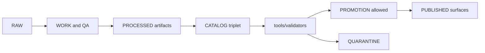

<!-- [KFM_META_BLOCK_V2]
doc_id: kfm://doc/8b12f7b8-1b34-4f5b-9b2d-6a7b16f3f3f6
title: tools/validators — Catalog & Promotion Validators
type: standard
version: v1
status: draft
owners: TBD
created: 2026-02-26
updated: 2026-02-26
policy_label: public
related:
  - docs/MASTER_GUIDE_v13.md
  - docs/architecture/
  - tools/linkcheck/
tags: [kfm, validators, promotion, catalog, stac, dcat, prov]
notes:
  - Fail-closed validators for promotion gates (catalog triplet + integrity).
  - Update CLI examples once concrete binaries/scripts are confirmed in-repo.
[/KFM_META_BLOCK_V2] -->

# tools/validators
Fail-closed validators for **KFM Promotion Contract** gates (especially **Catalog Triplet validation**).


> **WARNING**
> Validators are a **hard gate**. If a validator cannot prove an artifact is valid, it must fail (block promotion).

---

## Quick navigation
- [Purpose](#purpose)
- [Scope and non-goals](#scope-and-non-goals)
- [Where this fits in KFM](#where-this-fits-in-kfm)
- [Validator registry](#validator-registry)
- [Validator contract](#validator-contract)
- [Run locally](#run-locally)
- [Add a new validator](#add-a-new-validator)
- [CI integration](#ci-integration)
- [Directory layout](#directory-layout)
- [Troubleshooting](#troubleshooting)
- [Security and governance notes](#security-and-governance-notes)

---

## Purpose
This directory contains **validators** that enforce KFM’s “no promotion without proof” posture by validating:

- **DCAT** dataset-level metadata
- **STAC** asset-level metadata (collections/items/assets)
- **PROV** lineage bundles (run receipts + provenance entities)
- **Cross-links** between the “catalog triplet” surfaces (DCAT ⇄ STAC ⇄ PROV)

Promotion must be blocked if required artifacts are missing, invalid, or inconsistent.

---

## Scope and non-goals

### ✅ In scope
- Schema/profile validation (JSON / JSON-LD as applicable)
- Cross-file referential integrity checks (IDs, hrefs, provenance links)
- Deterministic, machine-readable **reports** suitable for CI
- Fail-closed behavior aligned to promotion gates

### ❌ Out of scope (do not put here)
- Data transformation / ETL (belongs in pipelines)
- Index building / tiling (belongs in indexers)
- Policy enforcement at runtime (belongs in policy boundary / governed API)
- Network fetches (validators should default to offline, local-file validation)

---

## Where this fits in KFM
Validators are part of the **promotion gate** path that moves content from **WORK** to **PROCESSED + CATALOG/TRIPLET**, and ultimately to **PUBLISHED** surfaces.



**Practical meaning:** if a dataset version’s DCAT/STAC/PROV is wrong, missing, or not cross-linked, it is **not eligible** for promotion.

[Back to top](#quick-navigation)

---

## Validator registry
> This table is the **directory contract**. Keep it current as new validators are added.

| Validator | What it checks | Typical inputs | Output | Gate impact |
|---|---|---|---|---|
| `dcat_validator/` | DCAT profile conformance (required fields, distributions, license/rights presence) | `data/catalog/dcat/*.jsonld` | JSON report + nonzero exit on failure | Gate D (Triplet), supports Gate B |
| `stac_validator/` | STAC profile conformance (collections/items/assets; required fields; asset href rules) | `data/stac/collections/*.json`, `data/stac/items/**/*.json` | JSON report + nonzero exit on failure | Gate D (Triplet) |
| `prov_validator/` | PROV profile conformance (Entities/Activities/Agents; run metadata) | `data/prov/**/*.jsonld` | JSON report + nonzero exit on failure | Gate D (Triplet), supports Gate E |
| *(related)* `../linkcheck/catalog_linkcheck` | Cross-links between DCAT/STAC/PROV resolve and match expected IDs | catalog roots | JSON report + nonzero exit on failure | Gate D (Triplet) |

> **NOTE**
> If your repo currently uses a different catalog location (e.g., `tools/validation/catalog/`), treat that as legacy and migrate or align CI to a single canonical path.

---

## Validator contract
All validators should converge on a single, boring, automatable interface.

### CLI behavior (required)
- **Exit code `0`**: pass
- **Exit code `1`**: validation failures found (expected “fail closed”)
- **Exit code `2`**: internal error (crash, misconfig, missing deps)
- **No partial success**: if any required check fails → exit nonzero

### Report format (recommended)
Write a JSON report to a predictable location so CI can upload it.

```json
{
  "tool": "stac_validator",
  "version": "0.1.0",
  "run_id": "local-2026-02-26T18:02:11Z",
  "inputs": ["data/stac/collections/example.json"],
  "summary": { "passed": false, "errors": 3, "warnings": 1 },
  "checks": [
    { "id": "stac.schema", "passed": false, "message": "Missing 'license' in collection" },
    { "id": "stac.assets.href", "passed": true, "message": "OK" }
  ]
}
```

### Determinism rules
- Same inputs → same outputs (including check ordering if possible)
- No network calls by default
- Treat “unknown / missing” as failure unless explicitly scoped as optional

---

## Run locally
> **NOTE**
> The exact commands depend on how validators are implemented in this repo. These are **example invocation shapes** to standardize on.

### Run one validator
```bash
# Example: run DCAT validation (adjust binary/script name to match repo)
./tools/validators/dcat_validator/run \
  --in data/catalog/dcat \
  --report out/validation/dcat.report.json
```

### Run all validators (catalog gate)
```bash
# Example: a single entrypoint script that runs the full catalog gate suite
./tools/validators/run_catalog_gate \
  --dcat data/catalog/dcat \
  --stac data/stac \
  --prov data/prov \
  --out out/validation
```

---

## Add a new validator

### 1) Decide what gate you’re enforcing
Map the validator to a promotion gate (or a sub-check of one). If it doesn’t connect to a gate, it probably doesn’t belong here.

### 2) Create a fixture-driven test set
Minimum:
- `fixtures/valid/…`
- `fixtures/invalid/…`
- golden expected reports (or stable assertions)

### 3) Implement the validator
Minimum expectations:
- deterministic outputs
- machine-readable report
- nonzero exit on failure
- clear error messages that point to the exact file/path

### 4) Register it here
Update the [Validator registry](#validator-registry) table and the [Directory layout](#directory-layout).

### 5) Wire it into CI
Validators should run automatically on PRs that touch catalog artifacts, and failures must block merges.

[Back to top](#quick-navigation)

---

## CI integration
A common pattern is “run only when relevant files change,” but still fail closed when the validator cannot locate required artifacts.

```yaml
# PSEUDO: .github/workflows/catalog-validate.yml
name: catalog-validate
on:
  pull_request:
    paths:
      - "data/catalog/**"
      - "data/stac/**"
      - "data/prov/**"
      - "tools/validators/**"
jobs:
  validate:
    runs-on: ubuntu-latest
    steps:
      - uses: actions/checkout@v4
      - name: Run catalog gate
        run: |
          ./tools/validators/run_catalog_gate --out out/validation
      - name: Upload reports
        uses: actions/upload-artifact@v4
        with:
          name: validation-reports
          path: out/validation
```

---

## Directory layout
> This is the **expected** structure. Adjust to match actual implementation, but keep the “one validator per folder” convention.

```text
tools/validators/                                      # Validation toolchain (fail-closed gates for catalogs + lineage)
├── README.md                                          # How to run validators, expected inputs/outputs, CI wiring
├── run_catalog_gate*                                  # Optional umbrella runner (DCAT+STAC+PROV in one gate)
├── dcat_validator/                                    # DCAT profile validator (KFM constraints + required fields)
│   ├── README.md                                       # Rules, profile references, examples, exit codes
│   ├── run*                                            # Runner script/CLI entrypoint (platform-specific ok)
│   ├── fixtures/                                       # Minimal, synthetic samples (public + sanitized as needed)
│   └── tests/                                          # Unit + schema tests for validator behavior (fail-closed)
├── stac_validator/                                    # STAC Item/Collection validator (KFM STAC profile + link rules)
│   ├── README.md                                       # Supported object types, extensions, constraints, examples
│   ├── run*                                            # Runner script/CLI entrypoint
│   ├── fixtures/                                       # Sample Items/Collections (safe + deterministic)
│   └── tests/                                          # Tests (schema conformance, link integrity, edge cases)
├── prov_validator/                                    # PROV validator (lineage completeness + required relationships)
│   ├── README.md                                       # Expected PROV shape, required edges, error taxonomy
│   ├── run*                                            # Runner script/CLI entrypoint
│   ├── fixtures/                                       # Sample PROV graphs (sanitized; no restricted identifiers)
│   └── tests/                                          # Tests (graph rules, missing edges, redaction obligations)
└── _shared/                                           # Shared assets/helpers (used by multiple validators)
    ├── schemas/                                        # Shared profiles/schemas (if reused across validators)
    └── reporting/                                      # Shared JSON report helpers (stable format + canonical ordering)
```

---

## Troubleshooting

### “Validation fails but I don’t know why”
- Open the JSON report (uploaded in CI artifacts if configured).
- Search for `checks[].message` and the failing check `id`.
- Fix the artifact (preferred) rather than weakening the validator.

### “Validator passes locally but fails in CI”
Common causes:
- nondeterministic ordering
- locale/timezone differences
- missing pinned dependencies
- different path roots in CI

Fix by making validation deterministic and path-robust.

---

## Security and governance notes
- Validators must not print sensitive content to logs. Prefer **counts + hashes + paths** over dumping raw records.
- For sensitive-location or restricted datasets, validation must confirm **no precise coordinate leakage** in public-facing artifacts (when applicable).
- If licensing or sensitivity is unclear, fail closed and keep the dataset in quarantine until resolved.

[Back to top](#quick-navigation)
