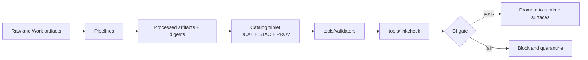

<!-- [KFM_META_BLOCK_V2]
doc_id: kfm://doc/4b14a785-d474-413e-a22b-37049f88cfd8
title: tools/validators
type: standard
version: v1
status: draft
owners: KFM Engineering
created: 2026-02-22
updated: 2026-02-22
policy_label: public
related:
  - tools/linkcheck/
  - schemas/
  - docs/standards/
tags:
  - kfm
  - validators
  - catalogs
  - dcat
  - stac
  - prov
  - ci
  - promotion
notes:
  - Fail-closed validators used by CI promotion gates.
[/KFM_META_BLOCK_V2] -->

# tools/validators
Fail-closed validation utilities for KFM catalog and promotion contracts.


**Purpose:** this directory is the contract boundary between **pipeline outputs** and **runtime surfaces**. Validators enforce that catalogs and provenance are strict, predictable, and safe to promote.

**Non-goal:** validators are not ETL. They must **not** mutate data, fetch network resources, or “fix” artifacts.

> **WARNING**
> These tools are part of promotion gates. Treat failures as blockers, not suggestions.

---

## Quick navigation
- [What belongs here](#what-belongs-here)
- [Validator scope](#validator-scope)
- [Planned tool list](#planned-tool-list)
- [Minimum checks](#minimum-checks)
- [Promotion gate mapping](#promotion-gate-mapping)
- [Running locally](#running-locally)
- [CI integration](#ci-integration)
- [Adding a validator](#adding-a-validator)
- [Design constraints](#design-constraints)
- [Troubleshooting](#troubleshooting)

---

## What belongs here
Validators in `tools/validators/` are **standalone, repo-local** checks that can run:

- in CI on pull requests
- on developer machines before opening a PR
- in pipeline “promotion” steps as a final fail-closed gate

### Expected properties
- **Deterministic:** same inputs → same results.
- **Fail-closed:** missing or unknown required fields must be a hard failure.
- **Fast:** should support validating only changed files.
- **Non-leaky logs:** avoid printing restricted values in error output.

### Lifecycle diagram


---

## Validator scope
KFM treats catalogs and provenance as contract surfaces. The core surface is the catalog triplet:

- **DCAT**: dataset discovery, publisher, license, distributions.
- **STAC**: asset inventory, spatiotemporal extents, asset links, checksums.
- **PROV**: lineage across inputs, runs, tools, parameters.

Validators here should ensure:

1. **Syntax validity**
   - JSON parses (STAC)
   - JSON-LD parses (DCAT, PROV)

2. **Schema and profile validation**
   - Validate against KFM profiles for DCAT, STAC, and PROV.

3. **Promotion readiness**
   - Required identifiers are present
   - Policy labels are present where required
   - Asset digests and media types are present where required

4. **Cross-link sanity**
   - Required links exist and are well-formed
   - Deep link resolution is typically handled by `tools/linkcheck/catalog_linkcheck/`

### EvidenceRef schemes
When catalogs use EvidenceRef-style links, validators and link checkers should support these schemes:

- `dcat://...`
- `stac://...`
- `prov://...`
- `doc://...`
- `graph://...`

---

## Planned tool list
This README documents the **intended** validator set. If the repo currently differs, update this table to reflect reality.

| Tool | Responsibility | Typical inputs | Output |
|---|---|---|---|
| `tools/validators/dcat_validator/` | Validate KFM DCAT profile for dataset and distribution records | `data/catalog/dcat/**/*.jsonld` | report + exit code |
| `tools/validators/stac_validator/` | Validate KFM STAC profile for collections and items | `data/stac/**/collection.json`, `data/stac/items/**/*.json` | report + exit code |
| `tools/validators/prov_validator/` | Validate KFM PROV profile for lineage bundles and run receipts | `data/prov/**/*.jsonld` | report + exit code |
| `tools/linkcheck/catalog_linkcheck/` | Resolve and verify required cross-links across DCAT, STAC, PROV | mixed catalog paths | report + exit code |

### Directory tree
```text
tools/
├─ validators/
│  ├─ README.md
│  ├─ dcat_validator/
│  ├─ stac_validator/
│  ├─ prov_validator/
│  └─ _shared/              # optional: common lib for parsing + reporting
└─ linkcheck/
   └─ catalog_linkcheck/
```

---

## Minimum checks
This section captures the minimum checks that each validator should implement.

### DCAT validator
Minimum expectations:

- Required dataset fields such as title, description, publisher, license or rights, theme, spatial and temporal coverage
- At least one distribution
- Linkage to provenance and policy label fields
- Stable dataset identifiers, including a dataset version ID

### STAC validator
Collections:

- Required collection identity fields
- Extent includes a bounding box and a temporal interval
- License present
- Link to the corresponding DCAT dataset
- Policy label and dataset version ID fields present

Items:

- `id`, `collection`, and spatiotemporal fields present
- Geometry or bbox is policy-consistent
- Assets include `href`, media type, and checksum or digest where required
- Links to PROV run receipt or bundle and to DCAT distributions where required

### PROV validator
Minimum expectations:

- At least one activity per run
- Entities for source inputs and produced artifacts
- Agents for pipeline identity and approvals
- `used` and `wasGeneratedBy` edges are present and consistent
- Environment capture fields exist, including container digest and git commit where available

---

## Promotion gate mapping
Validators are one part of promotion. Promotion is blocked unless artifacts exist and validate.

| Promotion gate | What must be true | Implemented by |
|---|---|---|
| Identity and versioning | Dataset version IDs are present and stable; promotion manifest exists | promotion step and manifest checks |
| Artifacts | Processed artifacts exist and have digests and media types | pipeline QA and artifact manifest checks |
| Catalogs | DCAT, STAC, and PROV validate under profile | `dcat_validator`, `stac_validator`, `prov_validator` |
| Cross-links | Links resolve and EvidenceRefs resolve | `catalog_linkcheck` |
| Policy | Policy label assigned; obligations applied; default deny tests pass | policy pack tests |
| QA | Validation reports exist; failures quarantined | QA checks |
| Audit | Run receipts emitted; approvals captured where required | audit and receipt checks |

---

## Running locally
The exact CLI entrypoints are implementation-specific, but every validator must support:

- validating a single file
- validating a directory tree
- machine-readable output for CI

### Example invocations
```bash
# Validate all DCAT catalog artifacts
tools/validators/dcat_validator --input data/catalog/dcat

# Validate all STAC collections and items
tools/validators/stac_validator --input data/stac

# Validate all PROV bundles
tools/validators/prov_validator --input data/prov

# Verify cross-links
tools/linkcheck/catalog_linkcheck --repo-root . --input data
```

### Recommended exit codes
- `0` pass
- `1` validation failures
- `2` tool error or misconfiguration

---

## CI integration
Validators should run in CI as PR gates and should be invoked incrementally.

Recommended workflow:

1. Detect changed files under:
   - `data/stac/`
   - `data/catalog/dcat/`
   - `data/prov/`
2. Run only the relevant validator.
3. Upload the report artifact.
4. Block merge on any failing validator.

### Suggested report shape
A consistent report schema makes CI and dashboards easier. A minimal shape:

```json
{
  "tool": "stac_validator",
  "version": "v1",
  "ok": false,
  "checked": 128,
  "errors": [
    {
      "path": "data/stac/items/example.json",
      "code": "KFM_STAC_MISSING_CHECKSUM",
      "message": "asset.events_geoparquet missing checksum",
      "severity": "error"
    }
  ]
}
```

---

## Adding a validator
When you add a new validator, treat it like a contract surface.

1. Define the contract
   - what artifact types are checked
   - what fail-closed means for that artifact
   - what report format it emits

2. Add fixtures
   - at least 1 valid fixture
   - at least 1 invalid fixture per major rule

3. Add tests
   - unit tests for rule logic
   - golden tests for deterministic reports

4. Wire into CI
   - run on changed files
   - block merge on failures

5. Document
   - update this README table
   - add a module README under the validator directory if needed

---

## Design constraints
### Fail-closed rules
Validators must fail when any required contract element is missing, including:

- required profile fields
- missing digests or checksums when required
- unresolved required cross-links

### Determinism rules
To preserve reproducibility, validators should:

- canonicalize JSON before hashing comparisons
- avoid timestamps in outputs unless explicitly requested
- emit stable error ordering

### Sensitivity rules
Validators are allowed to detect sensitive content leaks but should not print them.

Example: if a public-generalized dataset contains precise coordinates, emit an error that references the file and rule, not the coordinate.

---

## Troubleshooting
### Common failures
- JSON-LD parsing error
- Missing required profile field
- Broken cross-link
- Checksum missing in a STAC asset

### What to do
1. Fix the catalog artifact or the generator that produced it.
2. Re-run the validator locally.
3. Confirm that link checks succeed before attempting promotion.

---

## References
- See `tools/linkcheck/` for cross-link resolution tooling.
- See `schemas/` and `docs/standards/` for the profile schemas that validators enforce.
