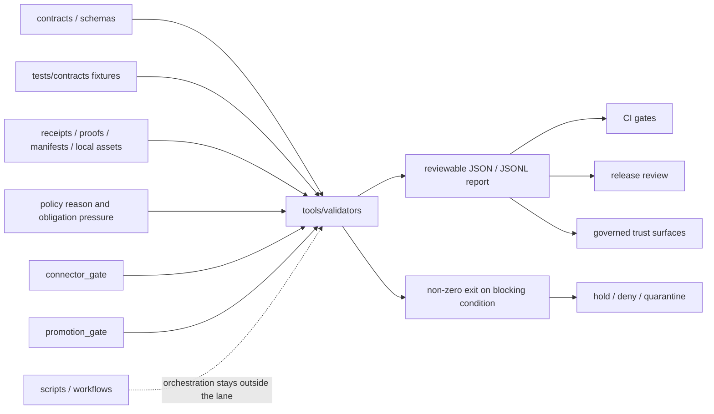

<!-- [KFM_META_BLOCK_V2]
doc_id: kfm.tools.validators.readme
title: tools/validators
type: standard
version: v1
status: draft
owners: @bartytime4life
created: 2026-04-11
updated: 2026-04-14
policy_label: public-safe
related: [
  ../README.md,
  ../../contracts/README.md,
  ../../schemas/README.md,
  ../../schemas/contracts/README.md,
  ../../schemas/tests/README.md,
  ../../tests/README.md,
  ../../tests/contracts/README.md,
  ../attest/README.md,
  ../../policy/README.md,
  ./connector_gate/README.md,
  ./promotion_gate/README.md
]
tags: [kfm, tools, validators, fail-closed, verification, contracts, receipts, proofs, spec_hash]
notes: [Parent lane contract for validator helpers. Mounted repo inventory beyond the supplied draft remains NEEDS VERIFICATION; examples stay conservative and authority stays with contracts, schemas, policy, and tests.]
[/KFM_META_BLOCK_V2] -->

<a id="top"></a>

# `tools/validators/`

Fail-closed validation helpers for trust-bearing artifacts, contract-first checks, declared linkage, and reviewable machine-readable outputs.

> [!NOTE]
> **Status:** experimental  
> **Document status:** draft  
> **Owners:** `@bartytime4life`  
>      
> **Quick jumps:** [Scope](#scope) · [Repo fit](#repo-fit) · [Accepted inputs](#accepted-inputs) · [Exclusions](#exclusions) · [Directory tree](#directory-tree) · [Quickstart](#quickstart) · [Usage](#usage) · [Diagram](#diagram) · [Reference tables](#reference-tables) · [Task list](#task-list) · [FAQ](#faq) · [Appendix](#appendix)

> [!IMPORTANT]
> This README is strongest on **lane role**, **validator posture**, and the **documented starter slice**. Current-session implementation evidence is narrower than the doctrine: mounted repo contents beyond the supplied draft were not directly inspected here. Treat exact file inventory, workflow wiring, and runtime details beyond the visible document as **NEEDS VERIFICATION**.

> [!TIP]
> Keep the KFM trust split visible across this lane:
>
> **receipt ≠ proof ≠ catalog ≠ publication**
>
> Validators may check declared linkage among these surfaces, but they should not collapse them into one object or one ownership boundary.

---

## Scope

This lane exists for reusable helpers whose primary job is to **check**, **report**, and **fail closed** against trust-bearing artifacts and declared machine contracts.

Use `tools/validators/` for helpers that:

- compile and check machine-readable contracts
- exercise valid and invalid fixtures
- verify release, catalog, provenance, correction, or connector-admission linkage
- enforce finite runtime outcome grammar
- detect placeholder-state or incomplete enforcement scaffolds
- validate manifest `spec_hash`
- require declared `bundle_ref`, `proof_ref`, `receipt_ref`, or similar linkage when configured
- verify declared asset SHA-256 and byte length when local bytes are available
- emit stable, reviewable output for humans and CI

The strongest first landed slice should remain **contract-first**, **admission-first**, or **release-manifest-first**. This family stays narrow, deterministic, and read-only by default.

### Operating posture

- **Fail closed:** blocking conditions remain visible and return non-zero status.
- **Deterministic:** the same inputs should produce the same outcome class and report shape.
- **Inspectable:** outputs should be easy for both maintainers and CI to review.
- **Scoped:** validator logic belongs here; workflow choreography does not.
- **Conservative:** do not silently trust undeclared, unsigned, or incomplete artifacts.
- **Finite:** outcomes should stay within a small, reviewable decision grammar.

[Back to top](#top)

---

## Repo fit

| Path | Role | Relationship |
|---|---|---|
| [`tools/validators/README.md`](./README.md) | this file | parent lane README for validator logic |
| [`../README.md`](../README.md) | tools hub | parent tooling lane |
| [`./connector_gate/README.md`](./connector_gate/README.md) | connector admission validator | upstream admission membrane for connector-facing candidates |
| [`./promotion_gate/README.md`](./promotion_gate/README.md) | release-facing validator | later membrane for release-bearing promotion decisions |
| [`../attest/README.md`](../attest/README.md) | attestation/signing lane | adjacent lane; signatures are related to validation but not the same thing |
| [`../../contracts/README.md`](../../contracts/README.md) | contracts hub | upstream source of contract intent |
| [`../../schemas/README.md`](../../schemas/README.md) | schemas hub | upstream source of machine-readable shapes |
| [`../../schemas/contracts/README.md`](../../schemas/contracts/README.md) | contract schemas | upstream schema family for contract validation |
| [`../../schemas/tests/README.md`](../../schemas/tests/README.md) | schema test surfaces | upstream fixture and negative-case pressure |
| [`../../tests/README.md`](../../tests/README.md) | test hub | downstream execution lane for broader unit, integration, and e2e checks |
| [`../../tests/contracts/README.md`](../../tests/contracts/README.md) | contract tests | downstream fixture execution and contract proof |
| [`../../policy/README.md`](../../policy/README.md) | policy hub | authority for reason, obligation, denial, and decision consistency |

### Upstream

- `contracts/` and `schemas/contracts/`
- `schemas/tests/` and `tests/contracts/`
- `policy/`
- build outputs and staged trust-bearing artifacts
- connector descriptors, manifests, and declared receipts/proofs when a validator consumes them

### Downstream

- CI gates
- release review
- reviewer-readable summaries
- governed trust surfaces in UI or API layers
- adjacent admission and promotion decisions

### Boundary rule

Use `tools/validators/` to validate declared authority and trust-visible linkage.

Do **not** use this lane to:

- own policy logic
- own schema or contract authority
- own runtime connector code
- sign artifacts
- publish or promote artifacts directly
- replace tests or workflow orchestration

[Back to top](#top)

---

## Accepted inputs

The following belong in or under `tools/validators/`:

- narrow validator entrypoints such as `kfm-verify.ts`
- pinned validator dependency files
- small validator-local config files
- machine-readable report schemas or documented output contracts
- validator-local smoke examples or report examples
- readers over declared contract, fixture, receipt, proof, or release-manifest surfaces when authority is explicit

### Documented starter slice

The supplied draft documents one starter validator entrypoint:

| Entry point | Primary concern | Intended checks | Evidence posture |
|---|---|---|---|
| `kfm-verify.ts` | release-manifest-first validation | manifest shape assumptions, `spec_hash`, optional `bundle_ref` / `proof_ref`, optional local asset bytes | **Documented in the supplied draft**; mounted file presence remains **NEEDS VERIFICATION** |

### Likely validator families in this lane

| Family | Example concern | Notes |
|---|---|---|
| Contract validators | contract shape, required fields, schema compileability | contract-first helpers stay narrow and deterministic |
| Runtime-envelope validators | finite outcome grammar, evidence/citation shape, fail-closed response structure | useful for request-time governed outputs |
| Connector admission validators | descriptor completeness, rights posture, `spec_hash`, receipt emission | see `connector_gate/` for the narrower membrane |
| Promotion validators | release-manifest integrity, linkage, proof requirements | promotion remains narrower than publication but stronger than admission |
| Linkage validators | receipt/proof/catalog/provenance joins | validate the declared chain without becoming the chain owner |

---

## Exclusions

This lane does **not**:

- sign artifacts
- decide organization-level approval policy
- own schemas or vocabularies
- replace tests
- replace CI orchestration
- publish or promote data on its own
- silently trust unsigned or undeclared artifacts
- collapse receipts, proofs, and catalog objects into one validator-owned truth object

Put those concerns elsewhere:

- signing and attestation mechanics → [`../attest/README.md`](../attest/README.md)
- organization-level policy ownership → [`../../policy/README.md`](../../policy/README.md)
- schema ownership → [`../../schemas/README.md`](../../schemas/README.md)
- workflow choreography → `scripts/` and `.github/workflows/`
- broader quality execution → [`../../tests/README.md`](../../tests/README.md)

---

## Directory tree

Current documented shape, kept deliberately conservative:

```text
tools/validators/
├── README.md
├── kfm-verify.ts               # documented starter validator entrypoint
├── connector_gate/             # connector-admission validator surface
├── promotion_gate/             # release-facing validator surface
├── <validator-local-config>    # optional, small, pinned, lane-local
├── <report-schema-or-examples> # optional, JSON/JSONL contracts or report examples
└── <smoke-or-fixture-examples> # optional, tiny lane-local examples
```

> [!NOTE]
> Angle-bracket entries above describe what **belongs here**. They are not a claim that those exact supporting files are already present in the mounted repository snapshot.

[Back to top](#top)

---

## Quickstart

### Validate manifest only

```bash
node tools/validators/kfm-verify.ts \
  --manifest dist/release/kfm-release-manifest.json
```

### Validate manifest and local assets

```bash
node tools/validators/kfm-verify.ts \
  --manifest dist/release/kfm-release-manifest.json \
  --assets-root dist \
  --require-bundle true \
  --require-proof true
```

> [!TIP]
> The command shape above is preserved from the supplied draft. Keep it until the live runtime path is directly verified and intentionally changed.

---

## Usage

### What this family should do well

A validator in this lane should make it easy to answer three questions:

1. **What did it inspect?**
2. **What did it conclude?**
3. **Why did it fail closed, if it failed?**

That usually means:

- a narrow entrypoint
- explicit inputs
- finite outcomes
- a stable report shape
- predictable exit behavior

### Keep orchestration outside the family

When a validator becomes useful in local workflows or CI:

- let `scripts/` own operator choreography where needed
- let `.github/workflows/` own workflow orchestration
- keep reusable validation logic here

That split matters because reviewers should be able to inspect the validator directly without reverse-engineering workflow YAML.

### Output posture

Prefer JSON or JSONL whenever CI, release review, or trust surfaces consume the output. Human-readable summaries are welcome, but they should not become the only source of truth for what was checked.

### Side-effect posture

Default to read-only inspection. Writing should be limited to explicit report paths or similarly narrow, opt-in outputs.

### Neighbor-lane split

Use the validator family like this:

| If the main burden is... | Start here | Why |
|---|---|---|
| connector admission readiness | `connector_gate/` | descriptor-first admission is narrower than release promotion |
| release/promotion readiness | `promotion_gate/` | proof-facing validation is stronger and later than admission |
| signing or attestation | `tools/attest/` | signatures and attestations are adjacent, not the same as validation |
| broader execution correctness | `tests/` | validators do not replace unit, integration, or e2e tests |

---

## Diagram


```mermaid
flowchart LR
    A[contracts / schemas] --> V[tools/validators]
    B[tests/contracts fixtures] --> V
    C[receipts / proofs / manifests / local assets] --> V
    D[policy reason and obligation pressure] --> V

    V --> R[reviewable JSON / JSONL report]
    V --> X[non-zero exit on blocking condition]

    R --> CI[CI gates]
    R --> RR[release review]
    R --> UI[governed trust surfaces]
    X --> HOLD[hold / deny / quarantine]

    CG[connector_gate] --> V
    PG[promotion_gate] --> V

    S[scripts / workflows] -. orchestration stays outside the lane .-> V
```

[Back to top](#top)

---

## Reference tables

### Outcome model

| Outcome | Meaning |
|---|---|
| `ALLOW` | Declared checks passed strongly enough for the next governed handoff |
| `ABSTAIN` | Inputs are intentionally partial or support is insufficient for automatic handoff |
| `DENY` | A trust requirement failed |
| `ERROR` | Execution, parse, or runtime failure |

> [!NOTE]
> Older or adjacent docs may still use `ANSWER` in some runtime-proof contexts. Within `tools/validators/`, prefer the narrower validator-facing grammar used by connector-admission and promotion decision surfaces unless a child lane explicitly documents a different envelope.

### Validator behavior contract

| Concern | Required posture |
|---|---|
| Determinism | Same inputs should yield the same exit class and report shape |
| Failure semantics | Blocking conditions return non-zero and stay visible |
| Output shape | Prefer JSON or JSONL when CI or review tooling consumes output |
| Side effects | Default to read-only inspection; writing should be limited to explicit report paths |
| Contract-home handling | Follow explicit authority or fail loud when authority is unresolved |
| Fixture handling | Support positive and negative proof paths |
| Placeholder-state handling | Distinguish meaningful contract content from scaffold-state files |
| Provenance joinability | Reports should name checked paths, artifact refs, or digests clearly enough for review |
| Local/CI parity | The same entrypoint should be runnable by a maintainer and by CI |
| Trust-boundary separation | Receipt, proof, catalog, and publication boundaries stay visible |

### Typical blocking conditions for this lane

| Blocker family | Example fail-closed condition |
|---|---|
| Schema / contract | a schema fails to compile |
| Fixtures | a supposedly valid example fails validation |
| Fixtures | a supposedly invalid example passes validation |
| Runtime envelope grammar | an envelope admits an outcome outside `ALLOW \| ABSTAIN \| DENY \| ERROR` |
| Citation / evidence structure | an evidence-bearing envelope lacks required citation structure |
| Linkage reconstruction | a release, receipt, or proof linkage check cannot reconstruct the expected chain |
| Required references | a required `bundle_ref`, `proof_ref`, or `receipt_ref` is missing when strict validation was requested |
| Local bytes vs declarations | a declared asset hash or byte length does not match local bytes |
| Placeholder-state detection | an enforcement-bearing schema or vocabulary file is still scaffold-state when strict validation was requested |

### Status vocabulary used in this README

| Label | Use here |
|---|---|
| **CONFIRMED** | Directly supported by the supplied draft or attached KFM corpus |
| **INFERRED** | Small structural completion strongly implied by KFM doctrine |
| **PROPOSED** | Recommended lane behavior or addition not directly verified in mounted implementation |
| **UNKNOWN** | Not verified strongly enough in the current session |
| **NEEDS VERIFICATION** | Review flag for inventory, commands, workflow wiring, or file presence that should be checked before hardening claims |

[Back to top](#top)

---

## Task list

### Definition of done for a new validator

- [ ] the entrypoint is narrow and clearly named
- [ ] inputs are explicit and minimal
- [ ] blocking conditions are finite and documented
- [ ] output shape is stable and reviewable
- [ ] positive and negative fixtures exist where the validator contract warrants them
- [ ] local and CI usage both work from the same entrypoint
- [ ] orchestration remains outside `tools/validators/`
- [ ] adjacent docs are linked where authority, policy, schema, or test ownership lives elsewhere
- [ ] receipt, proof, and catalog boundaries remain explicit where linkage is checked
- [ ] README examples are updated when behavior changes materially

### Review checks before promotion of a validator change

- [ ] no repo state is implied without evidence
- [ ] no policy-significant ownership is silently moved into this lane
- [ ] no signing logic is confused with validation logic
- [ ] no free-form output replaces machine-readable review output
- [ ] no placeholder-state file is described as enforcement-bearing without proof
- [ ] no child-lane boundary is blurred between admission and promotion

---

## FAQ

### Does this lane own signatures or attestation execution?

No. Validators may **check** for proof objects, required references, or local-vs-declared integrity, but signing and attestation mechanics belong in [`../attest/README.md`](../attest/README.md).

### Does this lane replace tests?

No. Validators and tests are adjacent but different. Validators check trust-bearing contracts and release-facing artifacts. `tests/` owns broader unit, integration, and end-to-end execution.

### Where should workflow logic live?

Outside this lane. Put operator choreography in `scripts/` when needed and pipeline orchestration in `.github/workflows/`.

### Can validators write files?

Yes, but only narrowly and explicitly, such as writing a report to a known path. Read-only inspection remains the default posture.

### Why emphasize receipt/proof separation in a validator lane?

Because validators often touch the joins between process memory, proof artifacts, and release manifests. Keeping those surfaces distinct makes failures more inspectable and prevents helper code from quietly becoming authority.

---

## Appendix

<details id="appendix">
<summary><strong>Illustrative example — validator report shape (not a claimed mounted schema)</strong></summary>

```json
{
  "tool": "kfm-verify",
  "outcome": "DENY",
  "subject_ref": "dist/release/kfm-release-manifest.json",
  "checked_at": "2026-04-14T00:00:00Z",
  "checks": [
    {
      "name": "manifest.spec_hash",
      "status": "pass"
    },
    {
      "name": "required.bundle_ref",
      "status": "fail",
      "reason_code": "MISSING_REQUIRED_REFERENCE"
    }
  ],
  "artifacts": [
    {
      "path": "dist/release/kfm-release-manifest.json",
      "sha256": "ILLUSTRATIVE_ONLY"
    }
  ]
}
```

### Notes

- This JSON block is **illustrative only**.
- It demonstrates the kind of stable, reviewable output shape that fits this lane.
- It does **not** assert that this exact schema or command output already exists in the mounted repository.

</details>

> [!NOTE]
> A validator here may require `bundle_ref`, `proof_ref`, or related linkage while still remaining separate from signature execution details.

[Back to top](#top)
