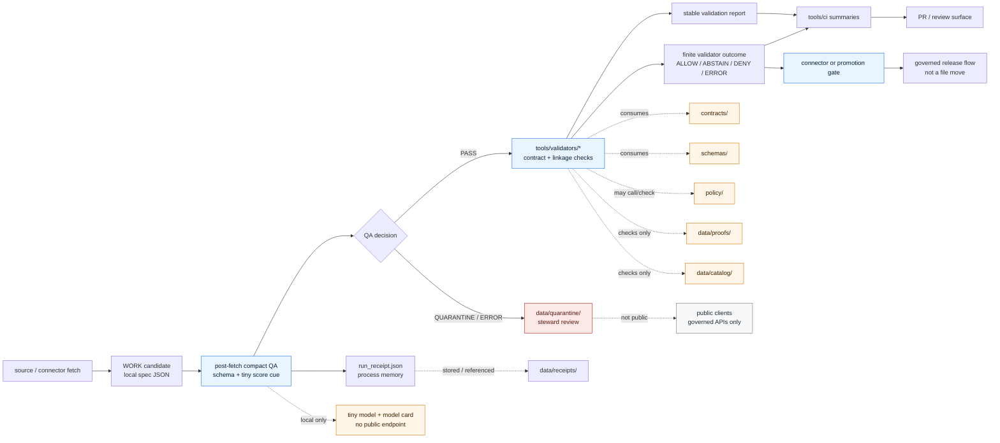

<!-- [KFM_META_BLOCK_V2]
doc_id: kfm://doc/NEEDS-VERIFICATION
title: tools/validators
type: standard
version: v1
status: draft
owners: @bartytime4life
created: 2026-04-11
updated: 2026-05-06
policy_label: public-safe
related: [
  ../README.md,
  ../attest/README.md,
  ../catalog/README.md,
  ../ci/README.md,
  ../diff/README.md,
  ../../contracts/README.md,
  ../../schemas/README.md,
  ../../schemas/contracts/README.md,
  ../../schemas/tests/README.md,
  ../../policy/README.md,
  ../../data/receipts/README.md,
  ../../data/proofs/README.md,
  ../../data/work/README.md,
  ../../data/quarantine/README.md,
  ../../tests/README.md,
  ../../tests/contracts/README.md,
  ./connector_gate/README.md,
  ./promotion_gate/README.md
]
tags: [kfm, tools, validators, fail-closed, verification, contracts, receipts, proofs, spec_hash, qa-gate, run_receipt, quarantine]
notes: [
  Parent lane contract for validator helpers.
  Updated to integrate a PROPOSED post-fetch compact QA gate while preserving the existing fail-closed validator lane doctrine.
  The uploaded draft surfaced an AirNow Layer 1 validator path; this README records it as NEEDS VERIFICATION until active branch inventory is inspected.
  Owner, related links, executable inventory, schema homes, model runtime binding, CI wiring, and merge-blocking enforcement remain NEEDS VERIFICATION against the mounted repository.
]
[/KFM_META_BLOCK_V2] -->

<a id="top"></a>

# `tools/validators/`

Fail-closed validation helpers for trust-bearing artifacts, contract-first checks, declared linkage, post-fetch QA, and reviewable machine-readable outputs.

> [!NOTE]
> **Status:** experimental  
> **Document status:** draft  
> **Owners:** `@bartytime4life` — NEEDS VERIFICATION against active `CODEOWNERS`  
> **Path:** `tools/validators/README.md`  
> 
> 
> 
> 
> 
> 
>   
> **Quick jumps:** [Scope](#scope) · [Repo fit](#repo-fit) · [Accepted inputs](#accepted-inputs) · [Exclusions](#exclusions) · [Current evidence posture](#current-evidence-posture) · [Directory tree](#directory-tree) · [Quickstart](#quickstart) · [Usage](#usage) · [Post-fetch compact QA gate](#post-fetch-compact-qa-gate) · [Diagram](#diagram) · [Reference tables](#reference-tables) · [Task list](#task-list) · [FAQ](#faq) · [Appendix](#appendix)

> [!IMPORTANT]
> This README is strongest on **lane role**, **validator posture**, and **reviewable gate contracts**. Exact active-branch file inventory, command runtime, workflow wiring, schema presence, model dependency, and merge-blocking enforcement remain **NEEDS VERIFICATION** until the real repository checkout is inspected.

> [!TIP]
> Keep the KFM trust split visible across this lane:
>
> **receipt ≠ proof ≠ catalog ≠ publication**
>
> Validators may check declared linkage among those surfaces. They must not collapse them into one object, one store, or one ownership boundary.

> [!CAUTION]
> This lane validates trust-bearing shapes, references, finite outcomes, fixtures, and post-fetch candidate health. It must not quietly become a second policy home, second schema home, receipt store, proof store, attestation lane, workflow owner, model endpoint, or publication mechanism.

---

## Scope

`tools/validators/` exists for reusable helpers whose primary job is to **check**, **report**, and **fail closed** against trust-bearing artifacts and declared machine contracts.

Use this lane for helpers that:

- compile and check machine-readable contracts
- exercise valid and invalid fixtures
- verify release, catalog, provenance, correction, review, or connector-admission linkage
- enforce finite validator or runtime outcome grammar
- detect placeholder-state or incomplete enforcement scaffolds
- validate manifest `spec_hash`
- validate post-fetch candidate shape before material leaves `WORK`
- compute local confidence cues from tiny, pinned QA models
- require declared `bundle_ref`, `proof_ref`, `receipt_ref`, or similar linkage when configured
- verify declared asset SHA-256 and byte length when local bytes are available
- validate receipt-shaped process memory without taking ownership of receipt storage
- emit stable, reviewable output for maintainers, auditors, stewards, and CI

The strongest slices stay **contract-first**, **admission-first**, **receipt-first**, **post-fetch-QA-first**, or **release-manifest-first**. This family stays narrow, deterministic, local-first, and read-only by default.

### Operating posture

| Principle | Validator posture |
| --- | --- |
| **Fail closed** | Blocking conditions stay visible and return a non-zero exit. |
| **Deterministic** | The same inputs produce the same exit class and report shape. |
| **Inspectable** | Output is reviewable by humans and CI without hidden side channels. |
| **Scoped** | Validator logic belongs here; workflow choreography belongs elsewhere. |
| **Conservative** | Undeclared, unsigned, incomplete, model-missing, schema-missing, or placeholder-state artifacts are not silently trusted. |
| **Boundary-aware** | Receipts, proofs, catalogs, release manifests, model cues, quarantine state, and publication state remain distinct. |
| **No public model surface** | Tiny model scoring may support local QA, but this lane must not expose a public model endpoint. |

[Back to top](#top)

---

## Repo fit

| Direction | Surface | Relationship |
| --- | --- | --- |
| This lane | [`tools/validators/README.md`](./README.md) | Parent README for validator helpers and child validator lanes. |
| Parent tooling | [`../README.md`](../README.md) | Broader `tools/` contract and tool-family boundaries. |
| Attestation | [`../attest/README.md`](../attest/README.md) | Adjacent lane; validators may check proofs or bundles but do not sign. |
| Catalog QA | [`../catalog/README.md`](../catalog/README.md) | Adjacent lane for catalog closure helpers and crosslink checks. |
| CI rendering | [`../ci/README.md`](../ci/README.md) | Downstream renderer lane for reviewer-facing summaries. |
| Stable diffs | [`../diff/README.md`](../diff/README.md) | Adjacent deterministic comparison lane consumed by some validators. |
| Contract intent | [`../../contracts/README.md`](../../contracts/README.md) | Upstream contract doctrine and interface intent. |
| Schema homes | [`../../schemas/README.md`](../../schemas/README.md) | Upstream machine-readable shape registry. |
| Contract schemas | [`../../schemas/contracts/README.md`](../../schemas/contracts/README.md) | Upstream cross-lane schema family. |
| Schema tests | [`../../schemas/tests/README.md`](../../schemas/tests/README.md) | Upstream fixture and negative-case pressure. |
| Policy | [`../../policy/README.md`](../../policy/README.md) | Policy owns decision rules; validators may call or check policy outputs. |
| Receipts | [`../../data/receipts/README.md`](../../data/receipts/README.md) | Durable process memory; validators may emit or validate receipts but do not own storage doctrine. |
| Proofs | [`../../data/proofs/README.md`](../../data/proofs/README.md) | Release-grade trust objects; validators may check proof refs but do not become proof custody. |
| Work state | [`../../data/work/README.md`](../../data/work/README.md) | Post-fetch QA should run before candidates leave `WORK`. |
| Quarantine | [`../../data/quarantine/README.md`](../../data/quarantine/README.md) | Fail-closed outputs should route unsafe candidates to steward review. |
| Tests | [`../../tests/README.md`](../../tests/README.md) | Downstream proof that validators work locally and in CI. |
| Contract tests | [`../../tests/contracts/README.md`](../../tests/contracts/README.md) | Fixture execution for contracts and schemas. |
| Connector admission | [`./connector_gate/README.md`](./connector_gate/README.md) | Child lane for connector-admission validation, if present. |
| Promotion | [`./promotion_gate/README.md`](./promotion_gate/README.md) | Child lane for release-facing promotion validation. |

### Upstream inputs

- `contracts/`
- `schemas/`
- `policy/`
- `data/work/`
- `data/receipts/`
- `data/proofs/`
- `data/catalog/`
- staged release assets
- post-fetch candidate specs
- tiny local QA model artifacts and model cards
- valid and invalid fixtures
- child-lane README contracts

### Downstream consumers

- CI gates
- batch-runner post-fetch checks
- release review
- reviewer-readable summaries
- governed API checks
- Evidence Drawer compatibility checks
- Focus Mode / runtime envelope checks
- map-adjacent trust controls
- quarantine and steward-review workflows
- rollback and correction workflows

[Back to top](#top)

---

## Accepted inputs

The following belong in or under `tools/validators/` when the helper is narrow, deterministic, and reviewable.

| Input family | Accepted examples | Required posture |
| --- | --- | --- |
| Contracts and schemas | JSON Schema, OpenAPI-like contracts, runtime envelope schemas | Compile or validate; do not become the schema authority. |
| Fixtures | positive fixtures, negative fixtures, semantic-invalid fixtures | Assert both pass and fail paths. |
| Candidate manifests | release manifests, layer manifests, geo manifests, source descriptors | Check shape, digest, linkage, and lifecycle rules. |
| Post-fetch specs | candidate package metadata, fetched source summary, normalized handoff spec | Validate schema, compute `spec_hash`, and gate before leaving `WORK`. |
| Tiny QA model artifacts | ONNX model, JSON stub model, pinned feature order, model card | Local confidence cue only; no public serving; missing model fails closed. |
| Receipts | watcher receipts, run receipts, promotion receipts, QA receipts | Validate process memory; do not store or promote it. |
| Proof references | proof packs, signature bundle references, attestation references | Check declared presence and linkage; signing belongs elsewhere. |
| Catalog references | STAC/DCAT/PROV/catalog matrix refs | Check closure and digest alignment. |
| Runtime envelopes | `RuntimeResponseEnvelope`, Evidence Drawer payloads, Focus fixtures | Enforce finite grammar, citation structure, and trust-boundary rules. |
| Local bytes | PMTiles, GeoParquet, COG, JSON, CSV, or other staged artifacts | Compare declared hashes/byte lengths only when local bytes are available. |
| Stable diffs | prior/current bundle diffs, policy classifications | Consume deterministic diff outputs; do not recompute policy meaning invisibly. |

### Post-fetch QA minimum input contract

A compact post-fetch QA validator should require:

| Requirement | Why |
| --- | --- |
| explicit input spec JSON | prevents hidden source-system side effects from passing as validation |
| explicit schema authority path | avoids schema drift and silent shape acceptance |
| canonical JSON `spec_hash` | keeps candidate identity stable across whitespace and key-order changes |
| local model artifact or explicit fail-closed stub | prevents accidental pass when ML scoring is unavailable |
| pinned threshold | keeps reviewer interpretation stable |
| receipt output path | preserves process memory without making the validator a receipt store |
| no network dependency | keeps CI/local replay deterministic and safe |

[Back to top](#top)

---

## Exclusions

Do **not** put the following responsibilities in `tools/validators/`.

| Excluded responsibility | Belongs instead | Why |
| --- | --- | --- |
| Canonical schema ownership | `schemas/` | Validators check shapes; they do not settle schema authority. |
| Contract-law authorship | `contracts/` | Validators operationalize contracts; they do not define product meaning alone. |
| Policy rule ownership | `policy/` | Validators may call policy, but policy decides obligations and denial logic. |
| Signature creation | `tools/attest/` | Attestation mechanics must stay separate from validation checks. |
| Workflow orchestration | `.github/workflows/` or `scripts/` | YAML/scripts call validators; validators should remain reusable entrypoints. |
| General test ownership | `tests/` | Tests prove behavior; validators provide reusable checks. |
| Source ingestion | `pipelines/` or source-specific lanes | Validators may inspect outputs, not harvest live source data. |
| Receipt storage | `data/receipts/` | Validators may validate receipts, not become the receipt store. |
| Proof storage | `data/proofs/` | Validators may check proof linkage, not become proof custody. |
| Catalog publication | `data/catalog/` and release tooling | Validators may verify closure, not publish catalogs. |
| UI rendering | app/UI lanes and `tools/ci/` summaries | Validators emit machine output; UI/renderers present it. |
| Public model endpoint | governed backend only, if ever approved | Post-fetch QA scoring is local evidence support, not a public runtime service. |
| Canonical or RAW data access | lifecycle stores through governed flows only | Public validation must not bypass KFM lifecycle boundaries. |
| Quarantine exposure | steward/admin review paths only | Rejected material must not be served to public clients. |

[Back to top](#top)

---

## Current evidence posture

| Item | Status | Current meaning |
| --- | --- | --- |
| Parent `tools/validators/` README draft exists in the supplied material | **CONFIRMED** | This revision preserves its meta block, top impact block, scope, repo fit, exclusions, directory tree, usage, diagram, tables, task list, FAQ, and appendix rhythm. |
| The lane is defined as fail-closed validation helpers for trust-bearing artifacts | **CONFIRMED** | The README keeps fail-closed behavior as the parent lane invariant. |
| Receipt/proof/catalog/publication separation is central to this lane | **CONFIRMED** | The existing draft repeatedly separates validators from policy, schema, attestation, receipt storage, proof storage, catalog publication, and UI rendering. |
| `promotion_gate/` is an adjacent release-facing validator lane | **CONFIRMED in supplied adjacent doc** | This parent lane treats promotion as downstream and stronger than post-fetch QA. |
| `connector_gate/` is a child admission validator lane | **CONFIRMED in supplied README set / NEEDS active-branch verification** | This parent lane links it as an admission membrane without claiming executable inventory. |
| `tools/validators/air_quality/validate_airnow_layer1.py` was surfaced in the uploaded draft | **USER-SUPPLIED NOTE / NEEDS VERIFICATION** | Recorded as a surfaced validator leaf, not as proven active-branch code. |
| Post-fetch compact QA gate | **PROPOSED** | Added as a contract and landing shape; implementation, schema, model runtime, fixtures, and CI wiring remain open. |
| `kfm-model-qa` executable | **PROPOSED** | Documented as a target CLI contract, not as a verified installed command. |
| ONNX model scoring | **PROPOSED / NEEDS VERIFICATION** | Missing runtime binding must fail closed until dependency and model-card review are complete. |
| Active branch inventory | **NEEDS VERIFICATION** | No mounted checkout was available in this session; repository connector search was not available without selecting a repo. |

[Back to top](#top)

---

## Directory tree

### Current documented starter shape

The exact active branch must be inspected before treating this as a complete inventory.

```text
tools/validators/
├── README.md
├── connector_gate/                         # NEEDS VERIFICATION
├── promotion_gate/                         # documented child lane; executable inventory NEEDS VERIFICATION
└── air_quality/
    └── validate_airnow_layer1.py           # surfaced by user-supplied note; NEEDS VERIFICATION
```

### Recommended growth shape

```text
tools/validators/
├── README.md
├── _shared/                                # PROPOSED shared loading, exit, report helpers
├── connector_gate/                         # connector admission checks
├── promotion_gate/                         # release-facing promotion checks
├── post_fetch_qa/                          # PROPOSED schema + tiny-model QA gate
├── models/                                 # PROPOSED model cards and tiny local model artifacts
├── evidence_bundle/                        # PROPOSED EvidenceBundle integrity checks
├── citation_gate/                          # PROPOSED citation / EvidenceRef checks
├── catalog_matrix/                         # PROPOSED STAC/DCAT/PROV closure checks
├── source_registry/                        # PROPOSED SourceDescriptor registry checks
├── runtime_envelope/                       # PROPOSED governed runtime response checks
├── review_record/                          # PROPOSED browser/API ReviewRecord validation
└── README.<topic>.md                       # optional thin-slice notes when local convention supports them
```

> [!NOTE]
> Prefer child directories for durable validator families. Use topic-specific README fragments only when the repo has already adopted that pattern and the fragment is clearly linked from this parent lane.

### Minimal post-fetch QA landing shape

```text
tools/validators/
├── kfm_model_qa.py                         # PROPOSED no-network CLI stub
├── models/
│   ├── README.md                           # PROPOSED model-card index
│   └── post_fetch_qa.stub-model.json       # PROPOSED deterministic local smoke model
└── post_fetch_qa/
    ├── README.md                           # optional once the family grows
    └── fixtures/
        ├── pass/
        ├── quarantine/
        └── error/
```

[Back to top](#top)

---

## Quickstart

### 1. Inspect before claiming

Run these from the repository root after the real checkout is mounted.

```bash
pwd
git status --short
git branch --show-current || true

find tools/validators -maxdepth 4 -print 2>/dev/null | sort
find tests/validators tests/contracts schemas contracts policy -maxdepth 4 -type f 2>/dev/null | sort | head -300
```

### 2. Read the local contracts

```bash
sed -n '1,280p' tools/validators/README.md
sed -n '1,320p' tools/validators/promotion_gate/README.md 2>/dev/null || true
sed -n '1,260p' tools/validators/connector_gate/README.md 2>/dev/null || true
sed -n '1,220p' schemas/README.md 2>/dev/null || true
sed -n '1,220p' policy/README.md 2>/dev/null || true
sed -n '1,220p' data/receipts/README.md 2>/dev/null || true
sed -n '1,220p' data/work/README.md 2>/dev/null || true
sed -n '1,220p' data/quarantine/README.md 2>/dev/null || true
sed -n '1,220p' tests/validators/README.md 2>/dev/null || true
```

### 3. Reconfirm surfaced validator leaves

```bash
find tools/validators -maxdepth 3 -type f 2>/dev/null | sort

git grep -n \
  -e 'validate_airnow_layer1.py' \
  -e 'kfm-model-qa' \
  -e 'post_fetch_qa' \
  -e 'RunReceipt' \
  -e 'spec_hash' \
  -- tools tests schemas contracts policy data .github 2>/dev/null || true
```

### 4. Run repo-native validator tests

The exact command is **NEEDS VERIFICATION**. Use the repo-native test runner once confirmed.

```bash
python -m pytest tests/validators -q
```

### 5. Run a child validator directly

Illustrative only until the active branch proves the entrypoint exists.

```bash
python tools/validators/promotion_gate/promotion_gate.py \
  tests/fixtures/promotion/candidate.runtime.json \
  --skip-policy
```

### 6. Run the proposed post-fetch QA gate

Illustrative only until the active branch lands the helper, schema, model artifact, and fixtures.

```bash
python tools/validators/kfm_model_qa.py \
  --model tools/validators/models/post_fetch_qa.stub-model.json \
  --threshold 0.85 \
  --schema schemas/NEEDS-VERIFICATION/post-fetch-candidate.schema.json \
  --input data/work/NEEDS-VERIFICATION/spec.json \
  --emit data/work/NEEDS-VERIFICATION/run_receipt.json
```

### 7. Compute canonical `spec_hash`

Use canonical JSON so whitespace and key order do not affect identity.

```bash
python - <<'PY'
import hashlib
import json
from pathlib import Path

path = Path("spec.json")
obj = json.loads(path.read_text(encoding="utf-8"))
payload = json.dumps(obj, sort_keys=True, separators=(",", ":"), ensure_ascii=False).encode("utf-8")
print(hashlib.sha256(payload).hexdigest())
PY
```

[Back to top](#top)

---

## Usage

A validator should be callable as a narrow, local-first command with explicit inputs and stable output.

```bash
python tools/validators/<family>/<validator>.py \
  --input <candidate-or-fixture> \
  --schema <schema-or-contract> \
  --report <report.json>
```

Expected behavior:

1. Load explicit inputs.
2. Validate structure and semantic obligations.
3. Return `0` only for a passing non-blocking result.
4. Return non-zero for blocking, quarantine, deny, or error cases.
5. Emit JSON or JSONL when downstream tools consume the result.
6. Keep generated reports separate from receipts, proofs, catalogs, and release aliases.
7. Route unclear or unsafe post-fetch candidates to quarantine rather than promotion.

### Validator outcome grammar

| Outcome | Meaning |
| --- | --- |
| `ALLOW` | Validation found no blocking condition for the checked scope. |
| `ABSTAIN` | Structure may be valid, but evidence, source authority, rights, policy state, or completeness is insufficient for a trustable outward decision. |
| `DENY` | A policy-significant, trust-significant, or contract-significant blocker exists. |
| `ERROR` | The validator could not complete its own work reliably. |

> [!NOTE]
> Some runtime-proof contexts use `ANSWER | ABSTAIN | DENY | ERROR`. Within `tools/validators/`, prefer `ALLOW | ABSTAIN | DENY | ERROR` for validator-facing decisions unless a child lane explicitly documents a different envelope.

### Post-fetch local result grammar

The compact QA gate uses a narrower local result because it is a candidate triage membrane, not a publication decision.

| Local result | Meaning | Expected routing |
| --- | --- | --- |
| `PASS` | Schema and confidence checks cleared the configured local threshold. | Continue to the next governed validator. |
| `QUARANTINE` | Schema invalid, confidence below threshold, missing model, missing schema, or unsafe ambiguity. | Move candidate to quarantine / steward review. |
| `ERROR` | The gate failed to evaluate reliably. | Fail closed; attach receipt; investigate. |

[Back to top](#top)

---

## Post-fetch compact QA gate

The post-fetch QA gate is a small membrane between fetched payloads and downstream governed promotion.

It should run **immediately after fetch** and **before promotion out of `WORK`**.

### Gate order

| Step | Gate | Fail-closed condition |
| --- | --- | --- |
| 1 | Parse input JSON | invalid JSON, non-object input, unreadable file |
| 2 | Canonicalize and hash | canonical hash cannot be computed |
| 3 | Validate schema | missing schema, invalid schema, missing required field, bad enum, extra field when disallowed |
| 4 | Score confidence | missing model, unsupported runtime, missing required feature, score below threshold |
| 5 | Emit receipt | receipt write failure |
| 6 | Route decision | `schema_invalid == true` OR `confidence < threshold` |

### Composite policy

```text
if schema_invalid == true:
    decision = QUARANTINE
elif confidence < gate_threshold:
    decision = QUARANTINE
else:
    decision = PASS
```

### Default threshold

```text
gate_threshold = 0.85
```

### Receipt contract

The gate should always emit a compact receipt, including failures.

```json
{
  "object_type": "RunReceipt",
  "schema_version": "v1",
  "qa_gate_version": "kfm-model-qa-NEEDS-VERIFICATION",
  "spec_hash": "NEEDS-VERIFICATION",
  "model_version": "post-fetch-qa-NEEDS-VERIFICATION",
  "model_score": 0.91,
  "gate_threshold": 0.85,
  "decision": "PASS",
  "reason_codes": ["qa_gate_passed"],
  "timestamp": "2026-05-06T00:00:00Z"
}
```

### Required receipt fields

| Field | Required | Notes |
| --- | ---: | --- |
| `object_type` | yes | Use `RunReceipt` unless the repo lands a narrower QA receipt contract. |
| `schema_version` | yes | Receipt contract version. |
| `qa_gate_version` | yes | Validator version, independent of model artifact version. |
| `spec_hash` | yes | SHA-256 over canonical JSON input. |
| `model_version` | yes | Model artifact identity or fail-closed runtime marker. |
| `model_score` | yes | Confidence cue in `[0, 1]`. |
| `gate_threshold` | yes | Configured threshold, normally `0.85`. |
| `decision` | yes | `PASS`, `QUARANTINE`, or `ERROR`. |
| `reason_codes` | yes | Finite review hints. |
| `timestamp` | yes | UTC emission time. |

### Tiny model expectations

| Requirement | Posture |
| --- | --- |
| feature order is frozen | required |
| model version is emitted | required |
| model card exists | required before merge |
| training window is documented | required before merge |
| data rights are documented | required before merge |
| evaluation notes are documented | required before merge |
| ONNX runtime path is reviewed | required before ONNX can pass |
| missing model fails closed | required |
| public model endpoint is forbidden | required |

> [!IMPORTANT]
> ML output is a **cue**, not truth. A high score can only allow the candidate to continue to the next governed check. It cannot authorize publication.

> [!WARNING]
> Quarantine contents and raw post-fetch payloads must not be served to public clients.

[Back to top](#top)

---

## Diagram


```mermaid
flowchart LR
    SRC["source / connector fetch"] --> WORK["WORK candidate<br/>local spec JSON"]
    WORK --> QA["post-fetch compact QA<br/>schema + tiny score cue"]
    QA --> QD{"QA decision"}
    QD -->|PASS| V["tools/validators/*<br/>contract + linkage checks"]
    QD -->|QUARANTINE / ERROR| QT["data/quarantine/<br/>steward review"]

    V --> R["stable validation report"]
    V --> O["finite validator outcome<br/>ALLOW / ABSTAIN / DENY / ERROR"]

    R --> CI["tools/ci summaries"]
    O --> CI
    CI --> PR["PR / review surface"]

    O --> PG["connector or promotion gate"]
    PG --> REL["governed release flow<br/>not a file move"]

    QA --> RR["run_receipt.json<br/>process memory"]
    RR -. stored / referenced .-> RECEIPTS["data/receipts/"]

    V -. consumes .-> CONTRACTS["contracts/"]
    V -. consumes .-> SCHEMAS["schemas/"]
    V -. may call/check .-> POLICY["policy/"]
    V -. checks only .-> PROOFS["data/proofs/"]
    V -. checks only .-> CATALOG["data/catalog/"]

    QA -. local only .-> MODEL["tiny model + model card<br/>no public endpoint"]
    QT -. not public .-> PUBLIC["public clients<br/>governed APIs only"]

    classDef gate fill:#E8F4FF,stroke:#1f6feb,color:#0b1f33;
    classDef blocked fill:#FCE8E6,stroke:#b42318,color:#5c1b16;
    classDef authority fill:#FFF5E8,stroke:#d97706,color:#3b2200;
    classDef public fill:#F6F8FA,stroke:#6e7781,color:#24292f;

    class QA,V,PG gate;
    class QT blocked;
    class CONTRACTS,SCHEMAS,POLICY,PROOFS,CATALOG,MODEL authority;
    class PUBLIC public;
```

[Back to top](#top)

---

## Reference tables

### Validator behavior contract

| Concern | Required posture |
| --- | --- |
| Determinism | Same inputs should yield the same exit class and report shape. |
| Failure semantics | Blocking conditions return non-zero and stay visible. |
| Output shape | Prefer JSON or JSONL when CI or review tooling consumes output. |
| Side effects | Default to read-only inspection; writing is limited to explicit report or receipt paths. |
| Contract-home handling | Follow explicit authority or fail loud when authority is unresolved. |
| Fixture handling | Support positive, negative, quarantine, and semantic-invalid proof paths where useful. |
| Placeholder-state handling | Distinguish meaningful contract content from scaffold-state files. |
| Provenance joinability | Name checked paths, artifact refs, digests, scores, thresholds, and reason codes clearly enough for review. |
| Local/CI parity | The same entrypoint should be runnable by maintainers and CI. |
| Trust-boundary separation | Receipt, proof, catalog, release, model cue, quarantine, and publication boundaries stay visible. |

### Typical blocking conditions

| Blocker family | Example fail-closed condition |
| --- | --- |
| Schema / contract | A schema fails to compile. |
| Fixtures | A supposedly valid example fails validation. |
| Fixtures | A supposedly invalid example passes validation. |
| Post-fetch QA | Schema missing, model missing, unsupported model runtime, or confidence below threshold. |
| Runtime envelope grammar | An envelope admits an outcome outside its documented finite grammar. |
| Citation / evidence structure | An evidence-bearing envelope lacks required citation structure. |
| Evidence closure | An `EvidenceRef` cannot resolve to the expected `EvidenceBundle` reference. |
| Linkage reconstruction | Release, receipt, proof, or catalog linkage cannot reconstruct the expected chain. |
| Required references | A required `bundle_ref`, `proof_ref`, or `receipt_ref` is missing under strict validation. |
| Local bytes vs declarations | Declared asset hash or byte length does not match local bytes. |
| Placeholder-state detection | An enforcement-bearing schema or vocabulary file is still scaffold-state under strict validation. |
| Public lifecycle leak | A public-facing candidate points at `RAW`, `WORK`, or `QUARANTINE` data. |
| Model boundary leak | A candidate path assumes public access to model runtime output. |

### Validator family map

| Family | Example concern | Status |
| --- | --- | --- |
| Contract validators | contract shape, required fields, schema compileability | lane-native |
| Runtime-envelope validators | finite outcome grammar, evidence/citation shape, fail-closed response structure | lane-native / PROPOSED leaves |
| Connector admission validators | descriptor completeness, rights posture, `spec_hash`, receipt emission | child lane when present |
| Post-fetch QA validators | strict schema validation, tiny model confidence cue, quarantine routing | **PROPOSED** |
| Promotion validators | release-manifest integrity, linkage, proof requirements | child lane when present |
| Linkage validators | receipt/proof/catalog/provenance joins | lane-native / PROPOSED leaves |
| AirNow Layer 1 validator | air-quality layer candidate checks | **USER-SUPPLIED NOTE / NEEDS VERIFICATION** |
| ReviewRecord validators | browser/API emitted `ReviewRecord` pre-persistence checks | **PROPOSED** |

### Boundary map

| Surface | Primary job | Validator handoff rule |
| --- | --- | --- |
| `tools/validators/` | Assert rule or shape conformance | Keep pass/fail logic explicit and reusable. |
| `tools/attest/` | Signing, verification support, and attestation helpers | Validators may require attestation refs but do not sign. |
| `tools/catalog/` | Catalog QA and closure helpers | Validators may call closure checks when catalog consistency is the subject. |
| `tools/diff/` | Deterministic comparisons | Validators may consume stable diffs; diff law stays there. |
| `tools/ci/` | Reviewer-facing summaries | Render validation output without changing its meaning. |
| `policy/` | Decision rules and obligations | Validators call or verify policy output; policy owns law. |
| `contracts/` | Interface and trust-object intent | Validators check conformance; contracts own meaning. |
| `schemas/` | Machine-readable shape definitions | Validators compile/check schemas; schemas own shape authority. |
| `data/work/` | Candidate work state | Post-fetch QA may inspect local candidate specs; it does not publish them. |
| `data/quarantine/` | Blocked review state | Fail-closed QA and validator results may route here; public clients must not read it. |
| `data/receipts/` | Durable process memory | Validators may emit or validate receipt-shaped records; storage doctrine stays there. |
| `tests/` | Unit, integration, e2e, and regression proof | Tests prove validators, including failure cases. |
| `.github/workflows/` | CI/CD automation | Workflows call validators; YAML should not become hidden validator logic. |

### Status vocabulary

| Label | Use here |
| --- | --- |
| **CONFIRMED** | Directly supported by mounted repo evidence or supplied KFM corpus. |
| **INFERRED** | Small structural completion strongly implied by adjacent KFM doctrine. |
| **PROPOSED** | Recommended lane behavior or landing shape not verified as current implementation. |
| **UNKNOWN** | Not verified strongly enough in the current session. |
| **NEEDS VERIFICATION** | Review flag for inventory, command, workflow, owner, link, schema, model, or file-presence checks before hardening claims. |

[Back to top](#top)

---

## Task list

### Definition of done for a new validator

- [ ] The entrypoint is narrow and clearly named.
- [ ] Inputs are explicit and minimal.
- [ ] Blocking conditions are finite and documented.
- [ ] Output shape is stable and reviewable.
- [ ] Positive and negative fixtures exist where the validator contract warrants them.
- [ ] Quarantine and error fixtures exist where ambiguity or runtime failure matters.
- [ ] Semantic-invalid fixtures exist when schema validity alone is insufficient.
- [ ] Local and CI usage both work from the same entrypoint.
- [ ] Orchestration remains outside `tools/validators/`.
- [ ] Adjacent docs are linked where authority, policy, schema, receipt, proof, catalog, or test ownership lives elsewhere.
- [ ] Receipt, proof, catalog, release, quarantine, and publication boundaries remain explicit where linkage is checked.
- [ ] README examples are updated when behavior changes materially.
- [ ] Rollback is documented: remove invocation first, then retire the validator if needed.

### Definition of done for post-fetch compact QA

- [ ] Active branch path for the QA helper is confirmed.
- [ ] Authoritative schema home for post-fetch candidate specs is confirmed.
- [ ] Canonical JSON `spec_hash` behavior is tested.
- [ ] Missing schema fails closed.
- [ ] Missing model fails closed.
- [ ] Unsupported ONNX runtime fails closed until dependency is reviewed.
- [ ] Tiny model artifact has a model card.
- [ ] Feature order is frozen and documented.
- [ ] Threshold defaults to `0.85` unless a reviewed policy says otherwise.
- [ ] Receipt always includes `model_version`, `model_score`, `gate_threshold`, `spec_hash`, `decision`, and `reason_codes`.
- [ ] Batch-runner or CI wiring runs after fetch and before promotion out of `WORK`.
- [ ] Failures route to quarantine with `run_receipt.json` attached or referenced.
- [ ] Public clients cannot access model internals, `WORK`, or quarantine contents.

### Review checks before promotion of a validator change

- [ ] No repo state is implied without evidence.
- [ ] No policy-significant ownership is silently moved into this lane.
- [ ] No schema authority is created here by convenience.
- [ ] No signing logic is confused with validation logic.
- [ ] No receipt store is confused with validator output.
- [ ] No proof store is confused with validation output.
- [ ] No model score is described as truth.
- [ ] No free-form output replaces machine-readable review output.
- [ ] No placeholder-state file is described as enforcement-bearing without proof.
- [ ] No child-lane boundary is blurred between admission, post-fetch QA, and promotion.
- [ ] No watcher, pipeline, or workflow lane is described as owned here when it is only consumed here.

### Pre-publish checklist for this README

- [x] KFM Meta Block V2 present.
- [x] One H1 only.
- [x] Status, owners, badges, and quick jumps present.
- [x] Repo fit, accepted inputs, and exclusions present.
- [x] Current evidence posture present.
- [x] Directory tree present with verification caveat.
- [x] Post-fetch compact QA gate contract present.
- [x] Mermaid diagram present and grounded in validator responsibility boundaries.
- [x] Reference tables present for behavior, blockers, families, boundaries, and labels.
- [x] Task list includes definition of done and review gates.
- [x] Code fences are language-tagged.
- [x] Long illustrative material is in `<details>`.
- [x] Unknown implementation claims are labeled.

[Back to top](#top)

---

## FAQ

### Does this lane own signatures or attestation execution?

No. Validators may **check** for proof objects, required references, local-vs-declared integrity, or attestation references. Signing and attestation mechanics belong in [`../attest/README.md`](../attest/README.md).

### Does this lane replace tests?

No. Validators and tests are adjacent but different. Validators check trust-bearing contracts, receipt linkage, proof references, post-fetch candidate health, and release-facing artifacts. `tests/` owns broader unit, integration, end-to-end, and regression proof.

### Where should workflow logic live?

Outside this lane. Put operator choreography in `scripts/` when needed and pipeline orchestration in `.github/workflows/`. Validators should remain callable by both local maintainers and CI.

### Can validators write files?

Yes, but only narrowly and explicitly, such as writing a report or receipt to a known path. Read-only inspection remains the default posture.

### Why emphasize receipt/proof separation in a validator lane?

Because validators often touch the joins between process memory, proof artifacts, catalog records, and release manifests. Keeping those surfaces distinct makes failures inspectable and prevents helper code from quietly becoming authority.

### Can validators consume watcher receipts?

Yes. They may validate watcher-emitted receipts, linkage, and finite outcomes. They should not become the watcher runtime owner, receipt storage owner, or publication gate by accident.

### Can post-fetch QA publish a candidate when the confidence score is high?

No. A high score only allows the candidate to continue to the next governed check. Publication remains a separate governed state transition.

### What happens if the model runtime is missing?

The gate should fail closed, emit a receipt with a model/runtime reason code, and route the candidate to quarantine or steward review.

### Should a validator return `ABSTAIN`, `DENY`, or `QUARANTINE`?

Use `ABSTAIN` when the artifact is structurally checkable but evidence, source authority, completeness, or review posture is insufficient for a trustable outward decision. Use `DENY` when a blocking violation is known. Use `QUARANTINE` for post-fetch/local triage when the candidate must be held before downstream trust decisions.

[Back to top](#top)

---

## Appendix

<details id="appendix-report-shape">
<summary><strong>Illustrative example — validator report shape</strong></summary>

This JSON block is **illustrative only**. It demonstrates a stable, reviewable output shape that fits this lane. It does **not** assert that this exact schema or command output already exists in the mounted repository.

```json
{
  "tool": "kfm-verify",
  "tool_version": "NEEDS-VERIFICATION",
  "outcome": "DENY",
  "subject_ref": "dist/release/kfm-release-manifest.json",
  "checked_at": "2026-05-06T00:00:00Z",
  "checks": [
    {
      "name": "manifest.spec_hash",
      "status": "pass"
    },
    {
      "name": "required.bundle_ref",
      "status": "fail",
      "reason_code": "MISSING_REQUIRED_REFERENCE",
      "path": "$.bundle_ref"
    }
  ],
  "artifacts": [
    {
      "path": "dist/release/kfm-release-manifest.json",
      "sha256": "ILLUSTRATIVE_ONLY"
    }
  ],
  "links": {
    "receipt_ref": "kfm://receipt/NEEDS-VERIFICATION",
    "proof_ref": null,
    "catalog_ref": null
  },
  "notes": [
    "Illustrative report shape only.",
    "Do not treat this as a mounted schema without active-branch verification."
  ]
}
```

</details>

<details id="appendix-model-card">
<summary><strong>Illustrative example — tiny QA model card skeleton</strong></summary>

Use a small model card for any post-fetch QA model artifact before treating it as merge-ready.

```markdown
# Post-fetch QA model card

Status: NEEDS VERIFICATION
Model version: post-fetch-qa-NEEDS-VERIFICATION
Artifact path: tools/validators/models/NEEDS-VERIFICATION
Runtime: ONNX | JSON stub | sklearn export | NEEDS VERIFICATION
Owner: @bartytime4life — NEEDS VERIFICATION

## Purpose

Local confidence cue for post-fetch candidate triage.

## Non-purpose

This model does not decide truth, policy, release, publication, or public runtime responses.

## Feature order

1. NEEDS_VERIFICATION
2. NEEDS_VERIFICATION
3. NEEDS_VERIFICATION

## Training window

NEEDS VERIFICATION

## Data rights

NEEDS VERIFICATION

## Evaluation notes

NEEDS VERIFICATION

## Fail-closed behavior

- missing model: QUARANTINE
- unsupported runtime: QUARANTINE
- missing feature: QUARANTINE or scored with documented default
- score below threshold: QUARANTINE
```

</details>

<details id="appendix-maintainer-review">
<summary><strong>Maintainer review prompts</strong></summary>

Before hardening this README from `draft` to `review` or `published`, verify:

- Does the active branch actually contain each linked README?
- Does `CODEOWNERS` confirm the owner shown above?
- Does the repo prefer `contracts/`, `schemas/`, or `schemas/contracts/v1/` for the validator’s target schema family?
- Are child validator lanes directory-backed or README-fragment-backed?
- Which package manager and test runner are repo-native?
- Are validators currently merge-blocking, advisory, or local-only?
- Does `tools/validators/air_quality/validate_airnow_layer1.py` exist, and what does it validate?
- Should post-fetch QA live as `tools/validators/kfm_model_qa.py`, `tools/validators/post_fetch_qa/`, or another repo-native path?
- Are outputs attached to CI summaries without mutating release state?
- Are receipts, proofs, catalogs, quarantine records, model cards, and publication aliases still separate in both code and docs?
- Does any model artifact have reviewed data rights and a model card?

</details>

[Back to top](#top)
