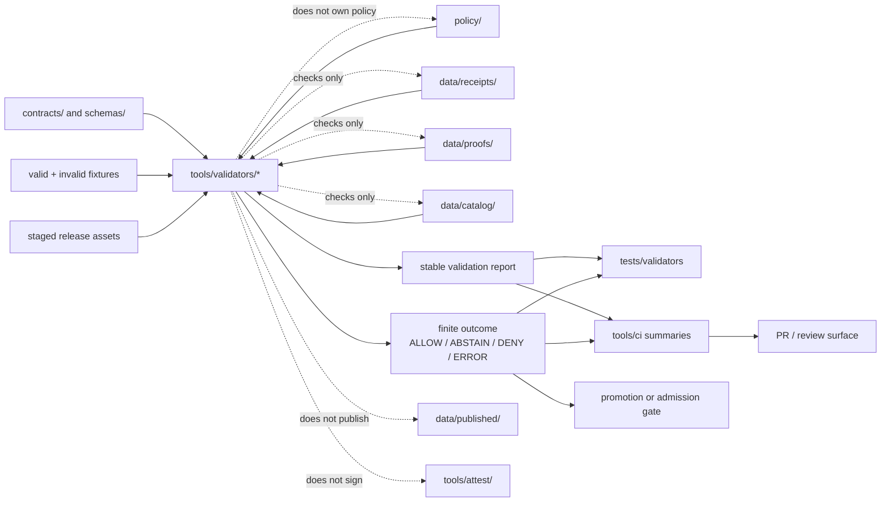

<!-- [KFM_META_BLOCK_V2]
doc_id: kfm://doc/NEEDS-VERIFICATION
title: tools/validators
type: standard
version: v1
status: draft
owners: @bartytime4life
created: 2026-04-11
updated: 2026-04-22
policy_label: public-safe
related: [
  ../README.md,
  ../attest/README.md,
  ../catalog/README.md,
  ../ci/README.md,
  ../diff/README.md,
  ../../contracts/README.md,
  ../../schemas/README.md,
  ../../schemas/contracts/README.md,
  ../../schemas/tests/README.md,
  ../../policy/README.md,
  ../../tests/README.md,
  ../../tests/contracts/README.md,
  ./connector_gate/README.md,
  ./promotion_gate/README.md
]
tags: [kfm, tools, validators, fail-closed, verification, contracts, receipts, proofs, spec_hash]
notes: [
  Parent lane contract for validator helpers.
  Owner, created date, related links, and active branch inventory are inherited from supplied validator README drafts and remain NEEDS VERIFICATION against the mounted repository.
  This README keeps validator logic separate from policy ownership, schema ownership, attestation, workflow orchestration, receipt storage, proof storage, catalog publication, and UI rendering.
]
[/KFM_META_BLOCK_V2] -->

<a id="top"></a>

# `tools/validators/`

Fail-closed validation helpers for trust-bearing artifacts, contract-first checks, declared linkage, and reviewable machine-readable outputs.

> [!NOTE]
> **Status:** experimental  
> **Document status:** draft  
> **Owners:** `@bartytime4life` — NEEDS VERIFICATION against active `CODEOWNERS`  
> **Path:** `tools/validators/README.md`  
> 
> 
> 
> 
> 
>   
> **Quick jumps:** [Scope](#scope) · [Repo fit](#repo-fit) · [Accepted inputs](#accepted-inputs) · [Exclusions](#exclusions) · [Directory tree](#directory-tree) · [Quickstart](#quickstart) · [Usage](#usage) · [Diagram](#diagram) · [Reference tables](#reference-tables) · [Task list](#task-list) · [FAQ](#faq) · [Appendix](#appendix)

> [!IMPORTANT]
> This README is strongest on **lane role**, **validator posture**, and the **documented starter slice**. Exact active-branch file inventory, command runtime, workflow wiring, schema presence, and merge-blocking enforcement remain **NEEDS VERIFICATION** until the real repository checkout is inspected.

> [!TIP]
> Keep the KFM trust split visible across this lane:
>
> **receipt ≠ proof ≠ catalog ≠ publication**
>
> Validators may check declared linkage among those surfaces. They should not collapse them into one object, one store, or one ownership boundary.

> [!CAUTION]
> This lane validates trust-bearing shapes, references, finite outcomes, and fixture behavior. It must not quietly become a second policy home, second schema home, receipt store, proof store, attestation lane, workflow owner, or publication mechanism.

---

## Scope

`tools/validators/` exists for reusable helpers whose primary job is to **check**, **report**, and **fail closed** against trust-bearing artifacts and declared machine contracts.

Use this lane for helpers that:

- compile and check machine-readable contracts
- exercise valid and invalid fixtures
- verify release, catalog, provenance, correction, review, or connector-admission linkage
- enforce finite validator or runtime outcome grammar
- detect placeholder-state or incomplete enforcement scaffolds
- validate manifest `spec_hash`
- require declared `bundle_ref`, `proof_ref`, `receipt_ref`, or similar linkage when configured
- verify declared asset SHA-256 and byte length when local bytes are available
- validate receipt-shaped process memory without taking ownership of receipt storage
- emit stable, reviewable output for maintainers, auditors, and CI

The strongest first landed slices should remain **contract-first**, **admission-first**, **receipt-first**, or **release-manifest-first**. This family stays narrow, deterministic, and read-only by default.

### Operating posture

| Principle | Validator posture |
| --- | --- |
| **Fail closed** | Blocking conditions stay visible and return a non-zero exit. |
| **Deterministic** | The same inputs produce the same exit class and report shape. |
| **Inspectable** | Output is reviewable by humans and CI without hidden side channels. |
| **Scoped** | Validator logic belongs here; workflow choreography belongs elsewhere. |
| **Conservative** | Undeclared, unsigned, incomplete, or placeholder-state artifacts are not silently trusted. |
| **Boundary-aware** | Receipts, proofs, catalogs, release manifests, and publication state remain distinct. |

[Back to top](#top)

---

## Repo fit

| Direction | Surface | Relationship |
| --- | --- | --- |
| This lane | [`tools/validators/README.md`](./README.md) | Parent README for validator helpers and child validator lanes. |
| Parent tooling | [`../README.md`](../README.md) | Broader `tools/` contract and tool-family boundaries. |
| Attestation | [`../attest/README.md`](../attest/README.md) | Adjacent lane; validators may check proofs or bundles but do not sign. |
| Catalog QA | [`../catalog/README.md`](../catalog/README.md) | Adjacent lane for catalog closure helpers and crosslink checks. |
| CI rendering | [`../ci/README.md`](../ci/README.md) | Downstream renderer lane for reviewer-facing summaries. |
| Stable diffs | [`../diff/README.md`](../diff/README.md) | Adjacent deterministic comparison lane consumed by some validators. |
| Contract intent | [`../../contracts/README.md`](../../contracts/README.md) | Upstream contract doctrine and interface intent. |
| Schema homes | [`../../schemas/README.md`](../../schemas/README.md) | Upstream machine-readable shape registry. |
| Contract schemas | [`../../schemas/contracts/README.md`](../../schemas/contracts/README.md) | Upstream cross-lane schema family. |
| Schema tests | [`../../schemas/tests/README.md`](../../schemas/tests/README.md) | Upstream fixture and negative-case pressure. |
| Policy | [`../../policy/README.md`](../../policy/README.md) | Policy owns decision rules; validators may call or check policy outputs. |
| Tests | [`../../tests/README.md`](../../tests/README.md) | Downstream proof that validators work locally and in CI. |
| Contract tests | [`../../tests/contracts/README.md`](../../tests/contracts/README.md) | Fixture execution for contracts and schemas. |
| Connector admission | [`./connector_gate/README.md`](./connector_gate/README.md) | Child lane for connector-admission validation, if present. |
| Promotion | [`./promotion_gate/README.md`](./promotion_gate/README.md) | Child lane for release-facing promotion validation. |

### Upstream inputs

- `contracts/`
- `schemas/`
- `policy/`
- `data/receipts/`
- `data/proofs/`
- `data/catalog/`
- staged release assets
- valid and invalid fixtures
- child-lane README contracts

### Downstream consumers

- CI gates
- release review
- reviewer-readable summaries
- governed API checks
- Evidence Drawer compatibility checks
- Focus Mode / runtime envelope checks
- map-adjacent trust controls
- steward audit and correction workflows

[Back to top](#top)

---

## Accepted inputs

The following belong in or under `tools/validators/` when the helper is narrow, deterministic, and reviewable:

| Input family | Accepted examples | Required posture |
| --- | --- | --- |
| Contracts and schemas | JSON Schema, OpenAPI-like contracts, runtime envelope schemas | Compile or validate; do not become the schema authority. |
| Fixtures | positive fixtures, negative fixtures, semantic-invalid fixtures | Assert both pass and fail paths. |
| Candidate manifests | release manifests, layer manifests, geo manifests, source descriptors | Check shape, digest, linkage, and lifecycle rules. |
| Receipts | watcher receipts, run receipts, promotion receipts | Validate process memory; do not store or promote it. |
| Proof references | proof packs, signature bundle references, attestation references | Check declared presence and linkage; signing belongs elsewhere. |
| Catalog references | STAC/DCAT/PROV/catalog matrix refs | Check closure and digest alignment. |
| Runtime envelopes | `RuntimeResponseEnvelope`, Evidence Drawer payloads, Focus fixtures | Enforce finite grammar, citation structure, and trust-boundary rules. |
| Local bytes | PMTiles, GeoParquet, COG, JSON, CSV, or other staged artifacts | Compare declared hashes/byte lengths only when local bytes are available. |
| Stable diffs | prior/current bundle diffs, policy classifications | Consume deterministic diff outputs; do not recompute policy meaning invisibly. |

[Back to top](#top)

---

## Exclusions

Do **not** put the following responsibilities in `tools/validators/`:

| Excluded responsibility | Belongs instead | Why |
| --- | --- | --- |
| Canonical schema ownership | `schemas/` | Validators check shapes; they do not settle schema authority. |
| Contract-law authorship | `contracts/` | Validators operationalize contracts; they do not define product meaning alone. |
| Policy rule ownership | `policy/` | Validators may call policy, but policy decides obligations and denial logic. |
| Signature creation | `tools/attest/` | Attestation mechanics must stay separate from validation checks. |
| Workflow orchestration | `.github/workflows/` or `scripts/` | YAML/scripts call validators; validators should remain reusable entrypoints. |
| General test ownership | `tests/` | Tests prove behavior; validators provide reusable checks. |
| Source ingestion | `pipelines/` or source-specific lanes | Validators may inspect outputs, not harvest live source data. |
| Receipt storage | `data/receipts/` | Validators may validate receipts, not become the receipt store. |
| Proof storage | `data/proofs/` | Validators may check proof linkage, not become proof custody. |
| Catalog publication | `data/catalog/` and release tooling | Validators may verify closure, not publish catalogs. |
| UI rendering | app/UI lanes and `tools/ci/` summaries | Validators emit machine output; UI/renderers present it. |
| Canonical or RAW data access | lifecycle stores through governed flows only | Public validation must not bypass KFM lifecycle boundaries. |

[Back to top](#top)

---

## Directory tree

### Current documented starter shape

The exact active branch must be inspected before treating this as a complete inventory.

```text
tools/validators/
├── README.md
├── connector_gate/          # NEEDS VERIFICATION
└── promotion_gate/          # documented child lane; executable inventory NEEDS VERIFICATION
```

### Recommended growth shape

```text
tools/validators/
├── README.md
├── _shared/                 # PROPOSED shared loading, exit, report helpers
├── connector_gate/          # connector admission checks
├── promotion_gate/          # release-facing promotion checks
├── evidence_bundle/         # PROPOSED EvidenceBundle integrity checks
├── citation_gate/           # PROPOSED citation / EvidenceRef checks
├── catalog_matrix/          # PROPOSED STAC/DCAT/PROV closure checks
├── source_registry/         # PROPOSED SourceDescriptor registry checks
├── runtime_envelope/        # PROPOSED governed runtime response checks
└── README.<topic>.md        # optional thin-slice notes when local convention supports them
```

> [!NOTE]
> Prefer child directories for durable validator families. Use topic-specific README fragments only when the repo has already adopted that pattern and the fragment is clearly linked from this parent lane.

[Back to top](#top)

---

## Quickstart

### 1. Inspect before claiming

Run these from the repository root after the real checkout is mounted.

```bash
pwd
git status --short
git branch --show-current || true

find tools/validators -maxdepth 3 -print 2>/dev/null | sort
find tests/validators tests/contracts schemas contracts policy -maxdepth 3 -type f 2>/dev/null | sort | head -300
```

### 2. Read the local contracts

```bash
sed -n '1,260p' tools/validators/README.md
sed -n '1,260p' tools/validators/promotion_gate/README.md 2>/dev/null || true
sed -n '1,260p' tools/validators/connector_gate/README.md 2>/dev/null || true
sed -n '1,220p' schemas/README.md 2>/dev/null || true
sed -n '1,220p' policy/README.md 2>/dev/null || true
sed -n '1,220p' tests/validators/README.md 2>/dev/null || true
```

### 3. Run repo-native validator tests

The exact command is **NEEDS VERIFICATION**. Use the repo-native test runner once confirmed.

```bash
python -m pytest tests/validators -q
```

### 4. Run a child validator directly

Illustrative only until the active branch proves the entrypoint exists.

```bash
python tools/validators/promotion_gate/promotion_gate.py \
  tests/fixtures/promotion/candidate.runtime.json \
  --skip-policy
```

[Back to top](#top)

---

## Usage

A validator should be callable as a narrow, local-first command with explicit inputs and stable output.

```bash
python tools/validators/<family>/<validator>.py \
  --input <candidate-or-fixture> \
  --schema <schema-or-contract> \
  --report <report.json>
```

Expected behavior:

1. Load explicit inputs.
2. Validate structure and semantic obligations.
3. Return `0` only for a passing non-blocking result.
4. Return non-zero for blocking `DENY` or `ERROR` cases.
5. Emit JSON or JSONL when downstream tools consume the result.
6. Keep generated reports separate from receipts, proofs, catalogs, and release aliases.

### Validator outcome grammar

| Outcome | Meaning |
| --- | --- |
| `ALLOW` | Validation found no blocking condition for the checked scope. |
| `ABSTAIN` | Structure may be valid, but evidence, source authority, rights, policy state, or completeness is insufficient for a trustable outward decision. |
| `DENY` | A policy-significant, trust-significant, or contract-significant blocker exists. |
| `ERROR` | The validator could not complete its own work reliably. |

> [!NOTE]
> Some runtime-proof contexts use `ANSWER | ABSTAIN | DENY | ERROR`. Within `tools/validators/`, prefer `ALLOW | ABSTAIN | DENY | ERROR` for validator-facing decisions unless a child lane explicitly documents a different envelope.

[Back to top](#top)

---

## Diagram


```mermaid
flowchart LR
    A[contracts/ and schemas/] --> V[tools/validators/*]
    B[valid + invalid fixtures] --> V
    C[policy/] --> V
    D[data/receipts/] --> V
    E[data/proofs/] --> V
    F[data/catalog/] --> V
    G[staged release assets] --> V

    V --> R[stable validation report]
    V --> O[finite outcome<br/>ALLOW / ABSTAIN / DENY / ERROR]

    R --> T[tests/validators]
    O --> T

    R --> CI[tools/ci summaries]
    O --> CI

    CI --> PR[PR / review surface]
    O --> PG[promotion or admission gate]

    V -. checks only .-> D
    V -. checks only .-> E
    V -. checks only .-> F
    V -. does not publish .-> P[data/published/]
    V -. does not sign .-> S[tools/attest/]
    V -. does not own policy .-> C
```

[Back to top](#top)

---

## Reference tables

### Validator behavior contract

| Concern | Required posture |
| --- | --- |
| Determinism | Same inputs should yield the same exit class and report shape. |
| Failure semantics | Blocking conditions return non-zero and stay visible. |
| Output shape | Prefer JSON or JSONL when CI or review tooling consumes output. |
| Side effects | Default to read-only inspection; writing is limited to explicit report paths. |
| Contract-home handling | Follow explicit authority or fail loud when authority is unresolved. |
| Fixture handling | Support positive, negative, and semantic-invalid proof paths. |
| Placeholder-state handling | Distinguish meaningful contract content from scaffold-state files. |
| Provenance joinability | Name checked paths, artifact refs, digests, and reason codes clearly enough for review. |
| Local/CI parity | The same entrypoint should be runnable by maintainers and CI. |
| Trust-boundary separation | Receipt, proof, catalog, release, and publication boundaries stay visible. |

### Typical blocking conditions

| Blocker family | Example fail-closed condition |
| --- | --- |
| Schema / contract | A schema fails to compile. |
| Fixtures | A supposedly valid example fails validation. |
| Fixtures | A supposedly invalid example passes validation. |
| Runtime envelope grammar | An envelope admits an outcome outside its documented finite grammar. |
| Citation / evidence structure | An evidence-bearing envelope lacks required citation structure. |
| Evidence closure | An `EvidenceRef` cannot resolve to the expected `EvidenceBundle` reference. |
| Linkage reconstruction | Release, receipt, proof, or catalog linkage cannot reconstruct the expected chain. |
| Required references | A required `bundle_ref`, `proof_ref`, or `receipt_ref` is missing under strict validation. |
| Local bytes vs declarations | Declared asset hash or byte length does not match local bytes. |
| Placeholder-state detection | An enforcement-bearing schema or vocabulary file is still scaffold-state under strict validation. |
| Public lifecycle leak | A public-facing candidate points at `RAW`, `WORK`, or `QUARANTINE` data. |

### Boundary map

| Surface | Primary job | Validator handoff rule |
| --- | --- | --- |
| `tools/validators/` | Assert rule or shape conformance | Keep pass/fail logic explicit and reusable. |
| `tools/attest/` | Signing, verification support, and attestation helpers | Validators may require attestation refs but do not sign. |
| `tools/catalog/` | Catalog QA and closure helpers | Validators may call closure checks when catalog consistency is the subject. |
| `tools/diff/` | Deterministic comparisons | Validators may consume stable diffs; diff law stays there. |
| `tools/ci/` | Reviewer-facing summaries | Render validation output without changing its meaning. |
| `policy/` | Decision rules and obligations | Validators call or verify policy output; policy owns law. |
| `contracts/` | Interface and trust-object intent | Validators check conformance; contracts own meaning. |
| `schemas/` | Machine-readable shape definitions | Validators compile/check schemas; schemas own shape authority. |
| `tests/` | Unit, integration, e2e, and regression proof | Tests prove validators, including failure cases. |
| `.github/workflows/` | CI/CD automation | Workflows call validators; YAML should not become hidden validator logic. |

### Status vocabulary

| Label | Use here |
| --- | --- |
| **CONFIRMED** | Directly supported by mounted repo evidence or supplied KFM corpus. |
| **INFERRED** | Small structural completion strongly implied by adjacent KFM doctrine. |
| **PROPOSED** | Recommended lane behavior or landing shape not verified as current implementation. |
| **UNKNOWN** | Not verified strongly enough in the current session. |
| **NEEDS VERIFICATION** | Review flag for inventory, command, workflow, owner, link, or file-presence checks before hardening claims. |

[Back to top](#top)

---

## Task list

### Definition of done for a new validator

- [ ] The entrypoint is narrow and clearly named.
- [ ] Inputs are explicit and minimal.
- [ ] Blocking conditions are finite and documented.
- [ ] Output shape is stable and reviewable.
- [ ] Positive and negative fixtures exist where the validator contract warrants them.
- [ ] Semantic-invalid fixtures exist when schema validity alone is insufficient.
- [ ] Local and CI usage both work from the same entrypoint.
- [ ] Orchestration remains outside `tools/validators/`.
- [ ] Adjacent docs are linked where authority, policy, schema, receipt, proof, catalog, or test ownership lives elsewhere.
- [ ] Receipt, proof, catalog, release, and publication boundaries remain explicit where linkage is checked.
- [ ] README examples are updated when behavior changes materially.
- [ ] Rollback is documented: remove invocation first, then retire the validator if needed.

### Review checks before promotion of a validator change

- [ ] No repo state is implied without evidence.
- [ ] No policy-significant ownership is silently moved into this lane.
- [ ] No schema authority is created here by convenience.
- [ ] No signing logic is confused with validation logic.
- [ ] No receipt store is confused with validator output.
- [ ] No proof store is confused with validation output.
- [ ] No free-form output replaces machine-readable review output.
- [ ] No placeholder-state file is described as enforcement-bearing without proof.
- [ ] No child-lane boundary is blurred between admission and promotion.
- [ ] No watcher, pipeline, or workflow lane is described as owned here when it is only consumed here.

### Pre-publish checklist for this README

- [x] KFM Meta Block V2 present.
- [x] One H1 only.
- [x] Status, owners, badges, and quick jumps present.
- [x] Repo fit, accepted inputs, and exclusions present.
- [x] Directory tree present with verification caveat.
- [x] Mermaid diagram present and grounded in validator responsibility boundaries.
- [x] Reference tables present for behavior, blockers, boundaries, and labels.
- [x] Task list includes definition of done and review gates.
- [x] Code fences are language-tagged.
- [x] Long illustrative material is in `<details>`.
- [x] Unknown implementation claims are labeled.

[Back to top](#top)

---

## FAQ

### Does this lane own signatures or attestation execution?

No. Validators may **check** for proof objects, required references, local-vs-declared integrity, or attestation references. Signing and attestation mechanics belong in [`../attest/README.md`](../attest/README.md).

### Does this lane replace tests?

No. Validators and tests are adjacent but different. Validators check trust-bearing contracts, receipt linkage, proof references, and release-facing artifacts. `tests/` owns broader unit, integration, end-to-end, and regression proof.

### Where should workflow logic live?

Outside this lane. Put operator choreography in `scripts/` when needed and pipeline orchestration in `.github/workflows/`. Validators should remain callable by both local maintainers and CI.

### Can validators write files?

Yes, but only narrowly and explicitly, such as writing a report to a known path. Read-only inspection remains the default posture.

### Why emphasize receipt/proof separation in a validator lane?

Because validators often touch the joins between process memory, proof artifacts, catalog records, and release manifests. Keeping those surfaces distinct makes failures inspectable and prevents helper code from quietly becoming authority.

### Can validators consume watcher receipts?

Yes. They may validate watcher-emitted receipts, linkage, and finite outcomes. They should not become the watcher runtime owner, receipt storage owner, or publication gate by accident.

### Should a validator return `ABSTAIN` or `DENY`?

Use `ABSTAIN` when the artifact is structurally checkable but evidence, source authority, completeness, or review posture is insufficient for a trustable outward decision. Use `DENY` when a blocking violation is known.

[Back to top](#top)

---

## Appendix

<details id="appendix">
<summary><strong>Illustrative example — validator report shape</strong></summary>

This JSON block is **illustrative only**. It demonstrates a stable, reviewable output shape that fits this lane. It does **not** assert that this exact schema or command output already exists in the mounted repository.

```json
{
  "tool": "kfm-verify",
  "tool_version": "NEEDS-VERIFICATION",
  "outcome": "DENY",
  "subject_ref": "dist/release/kfm-release-manifest.json",
  "checked_at": "2026-04-22T00:00:00Z",
  "checks": [
    {
      "name": "manifest.spec_hash",
      "status": "pass"
    },
    {
      "name": "required.bundle_ref",
      "status": "fail",
      "reason_code": "MISSING_REQUIRED_REFERENCE",
      "path": "$.bundle_ref"
    }
  ],
  "artifacts": [
    {
      "path": "dist/release/kfm-release-manifest.json",
      "sha256": "ILLUSTRATIVE_ONLY"
    }
  ],
  "links": {
    "receipt_ref": "kfm://receipt/NEEDS-VERIFICATION",
    "proof_ref": null,
    "catalog_ref": null
  },
  "notes": [
    "Illustrative report shape only.",
    "Do not treat this as a mounted schema without active-branch verification."
  ]
}
```

</details>

<details id="appendix-maintainer-review">
<summary><strong>Maintainer review prompts</strong></summary>

Before hardening this README from `draft` to `review` or `published`, verify:

- Does the active branch actually contain each linked README?
- Does `CODEOWNERS` confirm the owner shown above?
- Does the repo prefer `contracts/`, `schemas/`, or `schemas/contracts/v1/` for the validator’s target schema family?
- Are child validator lanes directory-backed or README-fragment-backed?
- Which package manager and test runner are repo-native?
- Are validators currently merge-blocking, advisory, or local-only?
- Are outputs attached to CI summaries without mutating release state?
- Are receipts, proofs, catalogs, and publication aliases still separate in both code and docs?

</details>

[Back to top](#top)
