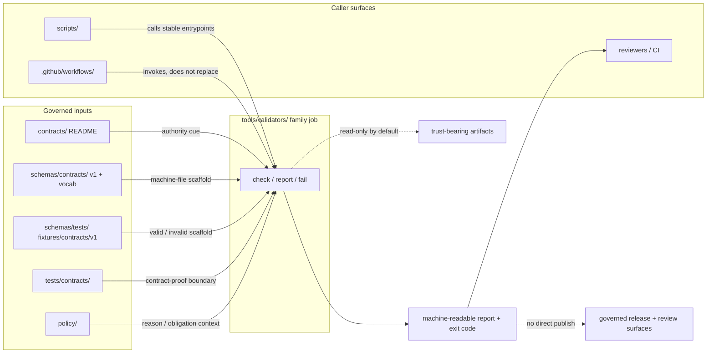

<!-- [KFM_META_BLOCK_V2]
doc_id: kfm://doc/<TODO: assign-uuid>
title: validators
type: standard
version: v1
status: draft
owners: @bartytime4life
created: <TODO: verify existing file creation date>
updated: <TODO: set on merge>
policy_label: <TODO: verify public|restricted|...>
related: [../../README.md, ../README.md, ../../.github/README.md, ../../.github/CODEOWNERS, ../../.github/workflows/README.md, ../../contracts/README.md, ../../schemas/README.md, ../../schemas/contracts/README.md, ../../schemas/tests/README.md, ../../tests/README.md, ../../tests/contracts/README.md, ../../policy/README.md, ../../scripts/README.md, ../../docs/standards/README.md]
tags: [kfm, tools, validators, verification, contracts]
notes: [owners are grounded from current public /.github/CODEOWNERS coverage for /tools/; current public main still shows tools/validators/ as README-only; live machine-file scaffolds now exist under schemas/contracts/ and schemas/tests/ while tests/contracts/ remains README-only; doc_id, dates, and policy_label still need verification before merge]
[/KFM_META_BLOCK_V2] -->

# validators

Lane contract and landing surface for deterministic, fail-closed validation helpers in Kansas Frontier Matrix.

> **Status:** experimental  
> **Owners:** `@bartytime4life`  
> **Path:** `tools/validators/README.md`  
> **Repo fit:** validator-family lane under [`../README.md`](../README.md) · root orientation in [`../../README.md`](../../README.md) · authority neighbors [`../../contracts/README.md`](../../contracts/README.md), [`../../schemas/README.md`](../../schemas/README.md), [`../../schemas/contracts/README.md`](../../schemas/contracts/README.md), [`../../schemas/tests/README.md`](../../schemas/tests/README.md), [`../../tests/contracts/README.md`](../../tests/contracts/README.md), and [`../../docs/standards/README.md`](../../docs/standards/README.md) · policy [`../../policy/README.md`](../../policy/README.md) · tests [`../../tests/README.md`](../../tests/README.md) · scripts [`../../scripts/README.md`](../../scripts/README.md) · workflow callers [`../../.github/workflows/README.md`](../../.github/workflows/README.md)  
> **Current public subtree:** `tools/validators/` exists and currently exposes `README.md` only on public `main`  
> **Current public adjacent contract state:** `contracts/` still reads as a root contract lane, while `schemas/contracts/` and `schemas/tests/` now expose visible machine-file scaffolds in public `main`  
> **Current public file state:** this README is already substantive on public `main`; future edits should revise it in place rather than reset it to scaffold text  
>        
> **Quick jumps:** [Scope](#scope) · [Repo fit](#repo-fit) · [Accepted inputs](#accepted-inputs) · [Exclusions](#exclusions) · [Current public contract/proof delta](#current-public-contractproof-delta) · [Current verified snapshot](#current-verified-snapshot) · [Directory tree](#directory-tree) · [Quickstart](#quickstart) · [Usage](#usage) · [Validator behavior contract](#validator-behavior-contract) · [Diagram](#diagram) · [Operating tables](#operating-tables) · [Task list](#task-list--definition-of-done) · [FAQ](#faq) · [Appendix](#appendix)

> [!IMPORTANT]
> `validators/` is the narrow `tools/` family for helpers whose main job is **check / report / fail** against trust-bearing artifacts. It is **not** the canonical home of schemas, policy bundles, runtime code, or workflow orchestration.

> [!NOTE]
> This README intentionally separates **current public-tree fact** from **PROPOSED landing shape**. Public `main` still shows `tools/validators/` as README-only, but current public contract/test surfaces are no longer as thin as older README-only stories implied: `schemas/contracts/` and `schemas/tests/` now expose visible scaffold trees, while `tests/contracts/` and `.github/workflows/` still remain README-first in the public tree.

## Scope

`tools/validators/` is where KFM should keep long-lived validation entrypoints that make contract-first doctrine executable without hiding trust logic in shell glue or workflow YAML.

In practical terms, this lane is for validators that:

- compile and check machine-readable contracts
- exercise valid and invalid fixtures
- verify release, catalog, provenance, or correction linkage
- enforce finite runtime outcome grammar
- detect placeholder-state or incomplete enforcement scaffolds
- emit stable, reviewable output for humans and CI

The strongest immediate fit for this family is still **contract-first validation**. KFM doctrine repeatedly pushes toward explicit contract families, invalid-example coverage, finite runtime outcomes, and visible correction lineage before broader shell polish or domain expansion.

### What this README does

This file exists to do five jobs at once:

1. describe what `tools/validators/` means in the repo today
2. keep present-state claims honest
3. define the narrow boundary of the validator family
4. account for the current public split between human-readable contract docs and visible machine-file scaffolds
5. provide a clean landing contract for the first executable validator(s)

### Evidence labels used here

| Label | Meaning in this file |
| --- | --- |
| **CONFIRMED** | Directly supported by current public repo evidence or attached KFM doctrine |
| **INFERRED** | Strongly suggested by adjacent repo/docs, but not proven as current subtree implementation |
| **PROPOSED** | Recommended landing shape or operating rule consistent with doctrine |
| **UNKNOWN** | Not verified strongly enough to present as current repo fact |
| **NEEDS VERIFICATION** | Placeholder or unresolved detail that should be checked before merge |

[Back to top](#validators)

## Repo fit

**Path:** `tools/validators/README.md`  
**Role in repo:** directory README for executable validation helpers, not for canonical rule ownership.

| Direction | Surface | Why it matters |
| --- | --- | --- |
| Upstream | [`../README.md`](../README.md) | Parent `tools/` lane defines the broader helper boundary and family map |
| Upstream | [`../../README.md`](../../README.md) | Root repo README sets system identity and verification-first posture |
| Governance | [`../../.github/CODEOWNERS`](../../.github/CODEOWNERS) | Current owner coverage for `/tools/` lives here |
| Governance | [`../../.github/README.md`](../../.github/README.md) | Repo-wide gatehouse posture and current public `.github/` inventory live here |
| Adjacent | [`../../contracts/README.md`](../../contracts/README.md) | Root contract lane still carries the human-readable contract-home argument |
| Adjacent | [`../../schemas/README.md`](../../schemas/README.md) | Current public tree now exposes schema-family sublanes under `schemas/` |
| Adjacent | [`../../schemas/contracts/README.md`](../../schemas/contracts/README.md) | Visible machine-file scaffolds now live here, even though canonical schema-home authority is still unresolved |
| Adjacent | [`../../schemas/tests/README.md`](../../schemas/tests/README.md) | Fixture scaffolds for contract-shaped validation are now visible here |
| Adjacent | [`../../tests/contracts/README.md`](../../tests/contracts/README.md) | Contract-facing verification lane exists as a README-first family boundary |
| Adjacent | [`../../docs/standards/README.md`](../../docs/standards/README.md) | Current standards routing still matters when validator inputs need an explicit authority rule |
| Adjacent | [`../../policy/README.md`](../../policy/README.md) | Policy bundles, vocabularies, and deny-by-default decision grammar remain policy-owned |
| Adjacent | [`../../tests/README.md`](../../tests/README.md) | Authoritative proof surfaces belong here, not inside helper code |
| Adjacent | [`../../scripts/README.md`](../../scripts/README.md) | Scripts orchestrate staged work and may call validators |
| Downstream | [`../../.github/workflows/README.md`](../../.github/workflows/README.md) | CI may invoke validators, but workflow YAML must not become the only implementation surface |

### Working interpretation

`validators/` is the first place a maintainer should look for reusable, fail-closed checks.

It is **not** where KFM should bury:

- schema law
- policy law
- fixture authority
- release promotion logic
- long-running service behavior

That separation matters because KFM’s trust posture depends on being able to tell the difference between:

- the thing that **defines** truth-bearing structure
- the thing that **checks** it
- the thing that **proves** it with fixtures
- the thing that **orchestrates** it through operator or CI flow

## Accepted inputs

The following belong in or under `tools/validators/`:

| Belongs here | Why it belongs here |
| --- | --- |
| Narrow validator entrypoints such as `validate_contracts.py` | Their main job is deterministic inspection and failure signaling |
| Pinned validator dependency files such as `requirements.txt` | Local and CI runs should resolve the same validator stack |
| Small validator-local config files | Useful when they shape checker behavior without becoming source-of-truth law |
| Validator-local smoke inputs or report examples | Helpful when they document output shape without replacing `tests/` as the authoritative proof surface |
| Shared helper modules used only by validator entrypoints | Acceptable while the logic remains family-local and not broadly reusable |
| Machine-readable report schemas or documented output contracts | Reviewers and CI should not parse ad hoc prose logs |
| Readers over visible contract scaffolds such as `schemas/contracts/v1/**` and `schemas/contracts/vocab/**` | Acceptable when the job is inspection and validation rather than ownership |
| Readers over visible fixture scaffolds such as `schemas/tests/fixtures/contracts/v1/**` | Acceptable when they help compare intended valid/invalid shapes against validator behavior |

### Family boundary map

| Surface | Belongs there when… | Does **not** belong there when… |
| --- | --- | --- |
| `tools/validators/` | the artifact’s primary job is validate / summarize / emit exit status | it defines authoritative schema or policy law |
| `../../tests/` | the artifact proves behavior with positive/negative fixtures or end-to-end drills | it is the primary operational CLI |
| `../../schemas/tests/` | the artifact is a schema-facing fixture scaffold or test-shape surface | it quietly becomes the only proof lane without `tests/` ownership clarity |
| `../../scripts/` | the artifact coordinates staged work and calls validators | it is a reusable validation helper |
| `../../contracts/` | the artifact defines object shape, required fields, or versioned contract law | it is executable validation logic |
| `../../schemas/contracts/` | the artifact is a machine-file contract scaffold or eventual contract registry | it is a helper that quietly chooses authority without documentation |
| `../../policy/` | the artifact is executable rule logic, fixture ownership, or vocabulary law | it is only a wrapper around policy evaluation |
| `../../.github/workflows/` | the artifact declares CI orchestration | it is the only place validator behavior exists |

## Exclusions

| Does **not** belong here | Better home | Why |
| --- | --- | --- |
| Canonical JSON Schemas, OpenAPI docs, standards profiles, or vocab registries | [`../../contracts/README.md`](../../contracts/README.md), [`../../schemas/contracts/README.md`](../../schemas/contracts/README.md), and the repo’s declared authority surface | Validators consume law; they do not own it |
| Executable policy bundles, policy fixtures, reason/obligation registries, or decision grammar | [`../../policy/README.md`](../../policy/README.md) | KFM keeps governance visible and reviewable outside tool code |
| Full authoritative fixture libraries | [`../../tests/README.md`](../../tests/README.md) and [`../../tests/contracts/README.md`](../../tests/contracts/README.md) | Validators should read fixture truth, not quietly redefine it |
| Workflow-only shell blobs that become the validator implementation | [`../../.github/workflows/README.md`](../../.github/workflows/README.md) **plus** stable tool entrypoints here | Reviewers must be able to inspect logic outside workflow YAML |
| Long-lived runtime service code | app or package surfaces | `validators/` is support tooling, not product runtime |
| One-off operator experiments | local scratch or a clearly disposable script | This lane should stay repeatable and reviewable |
| Secret-bearing config, restricted fixtures, or unrestricted precise-location dumps | secured data/config surfaces | Public validation tooling should remain safe to clone, review, and run |

## Current public contract/proof delta

The current public repo surface no longer fits a simple “everything is still README-only” summary.

| Surface | Current public reading | Validator consequence |
| --- | --- | --- |
| `contracts/` | Root lane remains human-readable and README-first | Keep contract-home authority explicit in docs and CLI behavior |
| `schemas/contracts/` | Public tree now visibly exposes `v1/` and `vocab/` subtrees | Validators should be able to inspect machine-file scaffolds without treating them as settled semantic authority |
| Representative schema files | At least some visible first-wave schema files are still placeholder-state | Validators should detect and report incomplete enforcement surfaces rather than pretending meaningful validation already exists |
| `schemas/tests/fixtures/contracts/v1/{valid,invalid}` | Nested fixture scaffolds are visible in public `main` | Validators can read these as intended proof shapes, but should not overclaim harness maturity |
| `tests/contracts/` | Contract-facing verification lane exists but remains README-only | Public main does not yet prove an executable contract-test harness |
| `.github/workflows/` | Workflow lane remains README-only on public `main` | Do not imply a checked-in merge-blocking validator caller already exists |

### Placeholder-state rule to prefer

A validator in this lane should be able to distinguish between:

- a meaningful contract file
- a machine-file scaffold
- a placeholder-state artifact such as `{}` that still needs real contract content

That is a **PROPOSED** validator behavior, not a claim that a current helper already implements it.

[Back to top](#validators)

## Current verified snapshot

| Item | Status | Validator consequence |
| --- | --- | --- |
| `tools/` is a real top-level repo lane | **CONFIRMED** | validator family has a stable repo home |
| Current public `tools/` directory lists `attest/`, `catalog/`, `ci/`, `diff/`, `docs/`, `probes/`, `validators/`, and `README.md` | **CONFIRMED** | validator family is already named in the live tree |
| `tools/validators/` currently lists `README.md` only | **CONFIRMED** | this subtree is still documentary, not executable |
| The current public `tools/validators/README.md` is already a substantive family README, not the earlier one-line scaffold | **CONFIRMED** | future revisions should preserve and improve this lane contract rather than restart it |
| Current CODEOWNERS coverage maps `/tools/` to `@bartytime4life`; no narrower validator-specific owner is directly confirmed here | **CONFIRMED** | owner line should stay conservative |
| `contracts/` and `schemas/` both exist, and canonical schema-home authority is still unresolved in public doctrine | **CONFIRMED unresolved** | validators must not silently decide schema authority |
| `contracts/README.md` now documents a split public surface: root `contracts/` remains README-first while branch-visible machine-file scaffolds sit under `schemas/contracts/` | **CONFIRMED tension** | validators should prefer explicit input or declared repo authority over directory guessing |
| `schemas/contracts/` now exposes `v1/` and `vocab/` in public `main` | **CONFIRMED** | machine-file contract scaffolds are now part of the public validator context |
| Representative files such as `schemas/contracts/v1/runtime/runtime_response_envelope.schema.json` and `schemas/contracts/vocab/reason_codes.json` currently remain scaffold-state placeholder bodies | **CONFIRMED current file state** | a serious validator should be able to report incomplete contract/vocabulary content rather than overstate enforcement |
| `schemas/tests/` now exposes fixture scaffolds under `fixtures/contracts/v1/valid` and `fixtures/contracts/v1/invalid` | **CONFIRMED** | nested contract-fixture shape exists publicly, even though full harness maturity is not yet proven |
| `tests/contracts/` exists as its own public lane and currently exposes `README.md` only | **CONFIRMED** | public evidence proves the boundary, not an executable suite |
| `tests/` already exposes `accessibility/`, `contracts/`, `e2e/`, `integration/`, `policy/`, `reproducibility/`, and `unit/` | **CONFIRMED** | validators should plug into a broader proof surface rather than inventing private ones |
| `tests/e2e/` public `main` exposes `correction/`, `release_assembly/`, and `runtime_proof/` as README-first leaf families | **CONFIRMED** | correction, release, and runtime-proof burdens are already named in the tree |
| `.github/workflows/` public `main` still exposes `README.md` only | **CONFIRMED** | do not imply a checked-in validator workflow already exists |

> [!WARNING]
> The live tree and some older directory stories are now partially out of sync. Public `main` still leaves several lanes README-first, but the contract/test surfaces are no longer flat: `schemas/contracts/`, `schemas/tests/`, and `tests/contracts/` materially change what this README should say about validator inputs and proof surfaces.

## Directory tree

### Current confirmed snapshot (relevant partial tree)

```text
tools/
├── README.md
├── attest/
├── catalog/
├── ci/
├── diff/
├── docs/
├── probes/
└── validators/
    └── README.md

contracts/
└── README.md

schemas/
├── README.md
├── contracts/
│   ├── README.md
│   ├── v1/
│   └── vocab/
└── tests/
    ├── README.md
    └── fixtures/
        └── contracts/
            └── v1/
                ├── invalid/
                └── valid/

tests/
├── README.md
├── contracts/
│   └── README.md
└── e2e/
    ├── correction/
    ├── release_assembly/
    └── runtime_proof/

.github/
└── workflows/
    └── README.md
```

### Near-term landing shape to prefer for this lane (PROPOSED)

Keep the first landed validator slice intentionally small.

```text
tools/validators/
├── README.md
├── validate_contracts.py
├── requirements.txt
└── report.schema.json
```

### Why the near-term shape stays this small

The first landed validator should prove one high-value seam well:

- explicit contract-home selection
- valid and invalid fixture handling
- placeholder-state detection for incomplete public scaffolds
- stable machine-readable report output
- non-zero exit on blocking failure

Anything broader should wait until that first seam is real.

## Quickstart

Run the inventory-first loop before adding or moving anything here.

### 1) Confirm the subtree you actually have

```bash
tree -a -L 2 tools/validators 2>/dev/null \
  || find tools/validators -maxdepth 2 \( -type f -o -type d \) 2>/dev/null | sort

tree -a -L 3 tools 2>/dev/null \
  || find tools -maxdepth 3 \( -type f -o -type d \) 2>/dev/null | sort
```

### 2) Re-read adjacent authority surfaces before naming a validator

```bash
sed -n '1,240p' tools/README.md 2>/dev/null
sed -n '1,260p' contracts/README.md 2>/dev/null
sed -n '1,260p' schemas/README.md 2>/dev/null
sed -n '1,260p' schemas/contracts/README.md 2>/dev/null
sed -n '1,240p' schemas/tests/README.md 2>/dev/null
sed -n '1,240p' tests/README.md 2>/dev/null
sed -n '1,240p' tests/contracts/README.md 2>/dev/null
sed -n '1,240p' policy/README.md 2>/dev/null
sed -n '1,220p' .github/workflows/README.md 2>/dev/null
sed -n '1,200p' .github/CODEOWNERS 2>/dev/null
```

### 3) Inspect visible contract and fixture scaffolds instead of guessing

```bash
find schemas/contracts -maxdepth 3 -type f 2>/dev/null | sort
find schemas/tests/fixtures/contracts -maxdepth 4 \( -type f -o -type d \) 2>/dev/null | sort
find tests/contracts -maxdepth 2 \( -type f -o -type d \) 2>/dev/null | sort

sed -n '1,120p' schemas/contracts/v1/runtime/runtime_response_envelope.schema.json 2>/dev/null
sed -n '1,120p' schemas/contracts/vocab/reason_codes.json 2>/dev/null
```

### 4) Search for caller surfaces and trust-bearing object names

```bash
rg -n \
  "validate_contracts|RuntimeResponseEnvelope|CorrectionNotice|DecisionEnvelope|EvidenceBundle|reason_codes|obligation_codes|tools/validators" \
  . -S 2>/dev/null
```

### 5) If the first validator has landed, inspect the interface instead of assuming it

```bash
if [ -f tools/validators/validate_contracts.py ]; then
  python3 tools/validators/validate_contracts.py --help
fi
```

## Usage

### Add the first validator

The strongest first move is still a **contract-first** validator.

Use this family for the smallest reversible slice that can:

1. compile the first-wave contract set
2. run at least one valid and one invalid example per target surface
3. emit a stable report
4. fail non-zero on blocking conditions
5. stay runnable both locally and from CI

### Keep authority explicit

The current public repo now shows a split contract surface:

- `contracts/` still carries the human-readable contract-home story
- `schemas/contracts/` now visibly exposes machine-file scaffolds
- `schemas/tests/` exposes nested fixture scaffolds
- `tests/contracts/` names the contract-facing proof lane but does not yet prove public harness depth

Until the repo makes canonical schema-home authority singular in a way this lane can treat as settled, a validator here should do **one** of the following:

- accept an explicit `--contract-home` or equivalent input
- read a declared repo authority file or ADR
- fail loudly and tell the operator that contract-home authority must be resolved first

It should **not** silently infer authority from whichever directory happened to contain files.

### Treat visible scaffold files honestly

Because current public `main` exposes representative machine files whose bodies are still placeholder-state, a validator should avoid the two worst outcomes:

- **false confidence** — treating `{}` as meaningful semantic law
- **false absence** — pretending the public scaffold surface does not exist

A better behavior is to report the surface clearly:

- file exists
- file is scaffold-state or placeholder-state
- enforcement meaning is incomplete
- operator must supply stricter inputs or wait for real contract content

### Keep fixtures authoritative elsewhere

`validators/` may ship tiny smoke examples or output examples, but authoritative positive/negative proof packs should stay in `../../tests/` and its contract-facing neighbors.

That keeps these roles clear:

- `validators/` = executable checker
- `tests/` / `tests/contracts/` = proof surface
- `contracts/` / `schemas/contracts/` = contract-law debate plus machine-file scaffold surface
- `policy/` = governance law

### Keep orchestration outside the family

When a validator becomes useful in local workflows or CI:

- let [`../../scripts/README.md`](../../scripts/README.md) own operator choreography where needed
- let [`../../.github/workflows/README.md`](../../.github/workflows/README.md) own workflow orchestration
- keep the reusable validation logic here

That split matters because reviewers should be able to inspect the validator directly without reverse-engineering a workflow file.

## Validator behavior contract

| Concern | Required posture |
| --- | --- |
| Determinism | Same inputs should yield the same exit class and report shape |
| Failure semantics | Blocking conditions return non-zero and stay visible |
| Output shape | Prefer JSON or JSONL when CI or review tooling consumes output |
| Side effects | Default to read-only inspection; writing should be limited to explicit report paths |
| Contract-home handling | Follow explicit authority or fail loud when authority is unresolved |
| Fixture handling | Support positive and negative proof paths; do not require only happy-path examples |
| Placeholder-state handling | Distinguish between meaningful contract content and scaffold-state files; do not silently treat placeholders as semantically complete |
| Policy joinability | When policy-relevant objects are validated, carry enough IDs or codes to link back to policy and review surfaces |
| Provenance joinability | Reports should name checked paths, artifact refs, or digests clearly enough for review |
| Safety | Do not dump sensitive raw payloads into logs when summarized output is sufficient |
| Local/CI parity | The same entrypoint should be runnable by a maintainer and by CI |

### Blocking conditions that fit this lane

Blocking conditions will vary by validator, but the following are in-family and doctrine-aligned:

- a schema fails to compile
- a supposedly valid example fails validation
- a supposedly invalid example passes validation
- a runtime envelope admits an outcome outside `ANSWER | ABSTAIN | DENY | ERROR`
- an answer-shaped runtime envelope lacks required citation structure
- a correction drill fails visible supersession or withdrawal linkage
- a release/proof linkage check cannot reconstruct the expected chain
- a supposedly enforcement-bearing schema or vocabulary file is still placeholder-state when strict validation was requested

## Diagram


```mermaid
flowchart LR
    subgraph Inputs["Governed inputs"]
        C["contracts/ README"]
        SC["schemas/contracts/ v1 + vocab"]
        STF["schemas/tests/ fixtures/contracts/v1"]
        TC["tests/contracts/"]
        P["policy/"]
    end

    subgraph Validators["tools/validators/ family job"]
        V["check / report / fail"]
    end

    subgraph Callers["Caller surfaces"]
        S["scripts/"]
        W[".github/workflows/"]
        R["reviewers / CI"]
    end

    C -->|"authority cue"| V
    SC -->|"machine-file scaffold"| V
    STF -->|"valid / invalid scaffold"| V
    TC -->|"contract-proof boundary"| V
    P -->|"reason / obligation context"| V

    S -->|"calls stable entrypoints"| V
    W -->|"invokes, does not replace"| V

    V --> O["machine-readable report + exit code"]
    O --> R

    V -. "read-only by default" .-> D["trust-bearing artifacts"]
    O -. "no direct publish" .-> G["governed release + review surfaces"]
```

## Operating tables

### Current repo signals that shape this README

| Signal | Why it matters for `validators/` |
| --- | --- |
| Parent `tools/` docs already frame validators as a named helper family | this subtree should lead with validation, not a generic utility bucket |
| `contracts/README.md` now documents a split public surface rather than a single settled machine-contract home | validator design should recognize current tension instead of papering it over |
| `schemas/contracts/README.md` confirms that public `main` now exposes `v1/` and `vocab/` scaffolds | validators should be scaffold-aware, not README-era blind |
| Representative public machine files remain placeholder-state | the first validator should be able to detect and report incomplete enforcement surfaces |
| `schemas/tests/README.md` and `tests/contracts/README.md` now name distinct fixture/proof surfaces | validator design should respect proof-lane boundaries |
| `tests/README.md` exposes contract-, policy-, correction-, release-, and runtime-proof families | validator design should anticipate caller/proof surfaces that already exist conceptually |
| `scripts/README.md` says reusable validator libraries should not stay buried in shell glue | validator logic belongs here, not hidden in scripts |
| `.github/workflows/README.md` remains README-only on public `main` | do not imply a checked-in merge-blocking validator workflow already exists |

### First-wave priority set for a contract-first validator

| Object family | Minimum expectation from the validator family |
| --- | --- |
| `SourceDescriptor` | compile and validate at least one valid and one invalid example |
| `DatasetVersion` | validate identity, version, and time/support-bearing structure |
| `DecisionEnvelope` | validate finite decision grammar, audit linkage, and policy-bearing fields |
| `ReleaseManifest` / `ReleaseProofPack` | validate release linkage and proof-bearing references |
| `EvidenceBundle` | validate minimum evidence-package structure |
| `RuntimeResponseEnvelope` | enforce finite runtime outcomes and cite-or-abstain structure |
| `CorrectionNotice` | enforce visible correction lineage rather than silent overwrite |

### Public scaffold-state items this lane should notice early

| Surface | Current public posture | Why validators should care |
| --- | --- | --- |
| `schemas/contracts/v1/runtime/runtime_response_envelope.schema.json` | visible but placeholder-state | runtime-envelope checks should not bluff maturity |
| `schemas/contracts/vocab/reason_codes.json` | visible but placeholder-state | decision grammar needs real registry content before strong enforcement claims |
| `schemas/tests/fixtures/contracts/v1/valid` | visible scaffold | positive-fixture path is named publicly |
| `schemas/tests/fixtures/contracts/v1/invalid` | visible scaffold | invalid-fixture burden is named publicly |
| `tests/contracts/README.md` | README-only | proof-lane boundary is public even if harness depth is not |

### Near-term landed artifacts to prefer

| Artifact | Job | Status |
| --- | --- | --- |
| `tools/validators/README.md` | family contract and landing guide | **CONFIRMED current file** |
| `tools/validators/validate_contracts.py` | first-wave contract + fixture gate | **PROPOSED next landed helper** |
| `tools/validators/requirements.txt` | deterministic validator dependency pinning | **PROPOSED next landed helper** |
| `tools/validators/report.schema.json` | stable machine-readable report contract | **PROPOSED next landed helper** |

[Back to top](#validators)

## Task list / Definition of done

Before merging work into this lane, confirm all applicable items below.

- [ ] The validator has one narrow, named purpose.
- [ ] Directory placement matches the validator’s real job.
- [ ] Inputs, outputs, and exit semantics are documented here.
- [ ] Contract-home authority is explicit, or ambiguity fails loudly.
- [ ] Placeholder-state contract or vocabulary files are detected and reported clearly when relevant.
- [ ] At least one representative passing case and one failing case exist.
- [ ] The validator is read-only by default.
- [ ] Machine-readable output exists when CI or review tooling needs stable parsing.
- [ ] No policy, schema, or vocabulary source-of-truth was smuggled into helper code.
- [ ] No sensitive raw fixture or secret-bearing config was committed here.
- [ ] Local execution and CI invocation can use the same stable entrypoint.
- [ ] Caller surfaces are documented in the nearest relevant README.
- [ ] If the validator changes merge posture, the workflow and the validator are reviewed together.
- [ ] If the validator touches correction or runtime-envelope logic, the negative-path proof surface is named explicitly.
- [ ] If the validator reads `schemas/contracts/` or `schemas/tests/`, that read path is documented instead of hidden behind assumptions.

## FAQ

### Why does `validators/` need its own README if the family is still README-only?

Because the subtree already exists in the live repo tree, and the family needs a boundary contract before executable helpers land. KFM loses trust when code arrives before placement and responsibility are explained. The subtree is README-only in file inventory today, but the README itself is already part of the lane’s checked-in contract.

### Why did this revision add `schemas/contracts/` and `schemas/tests/` so prominently?

Because current public `main` now visibly exposes those scaffold surfaces. Ignoring them would under-describe the repo; treating them as settled semantic authority would over-describe it. This README keeps both mistakes visible and avoided.

### Should validators treat placeholder-state `{}` files as real enforcement law?

No. They should treat them as **existing scaffold surfaces with incomplete semantic content** and report that state honestly.

### Why not just keep validator logic inside `scripts/`?

Because `scripts/` coordinates staged work. Reusable validation logic should remain directly inspectable as a stable helper surface, not buried in operator choreography.

### Should `validators/` own the fixture library?

No. Tiny smoke examples are fine here, but authoritative positive/negative proof packs should stay in `../../tests/` and its contract-facing surfaces.

### Should validators decide whether `contracts/` or `schemas/contracts/` is authoritative?

No. They should follow an explicit repo authority decision or fail loud when that decision is missing.

### Can a validator promote, publish, or correct data on its own?

Normally no. This family is for inspection and failure signaling. Lifecycle state changes belong in governed workflows and operator-reviewed surfaces.

[Back to top](#validators)

## Appendix

<details>
<summary><strong>Illustrative machine-readable report shape (PROPOSED)</strong></summary>

```json
{
  "tool": "validate_contracts",
  "status": "fail",
  "blocking": true,
  "checked_at": "2026-04-04T00:00:00Z",
  "contract_home": "schemas/contracts/",
  "authority_posture": "unresolved",
  "checks": [
    {
      "id": "schema-compile",
      "result": "pass"
    },
    {
      "id": "valid-fixture-pass",
      "result": "pass"
    },
    {
      "id": "invalid-fixture-fail",
      "result": "pass"
    },
    {
      "id": "placeholder-state-detected",
      "result": "fail",
      "message": "runtime_response_envelope schema exists but still has placeholder-state content"
    }
  ]
}
```

</details>

<details>
<summary><strong>Minimal exit-code contract to prefer (PROPOSED)</strong></summary>

| Exit code | Meaning |
| --- | --- |
| `0` | all blocking checks passed |
| `1` | one or more blocking checks failed |
| `2` | invocation or configuration error |
| `3` | authority ambiguity or missing required input prevented evaluation |
| `4` | scaffold-state or placeholder-state prevented requested strict enforcement |

</details>

<details>
<summary><strong>Illustrative first follow-on checks after <code>validate_contracts.py</code> lands (PROPOSED)</strong></summary>

- correction drill linkage checks for `CorrectionNotice` and supersession flow
- release/proof linkage checks for `ReleaseManifest` / `ReleaseProofPack`
- runtime-envelope structural checks for `RuntimeResponseEnvelope`
- catalog-closure linkage checks once the contract home is explicit
- vocabulary completeness checks for `reason_codes` and `obligation_codes` once those registries stop being scaffold-state

These are **not** current public-tree claims. They are the next natural proof burdens once the first contract validator is real.

</details>
