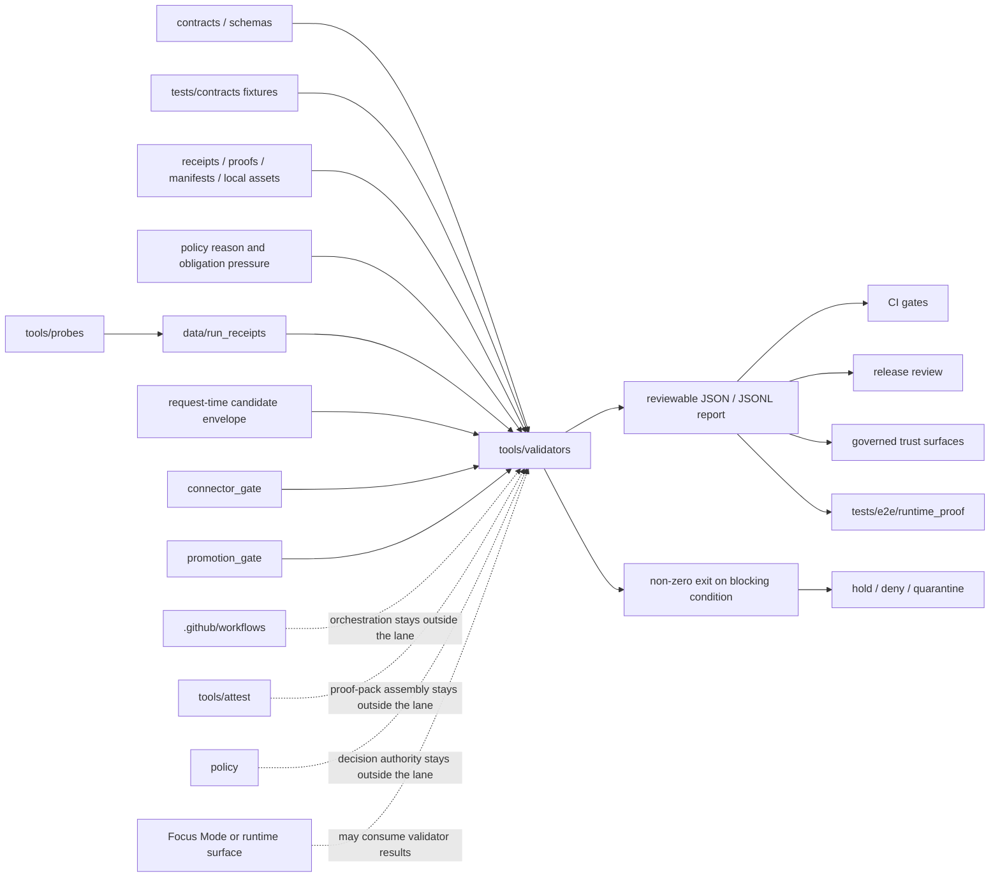

<!-- [KFM_META_BLOCK_V2]
doc_id: kfm.tools.validators.readme
title: Tools — Validators
type: standard
version: v1
status: draft
owners: @bartytime4life
created: 2026-04-11
updated: 2026-04-18
policy_label: public-safe
related: [../README.md, ../../contracts/README.md, ../../schemas/README.md, ../../tests/README.md, ../../tests/e2e/runtime_proof/, ../../policy/README.md, ../../data/receipts/README.md, ../../data/run_receipts/, ../../data/work/README.md, ../../.github/workflows/README.md, ../../.github/watchers/README.md, ../attest/README.md, ../probes/README.md, ./connector_gate/README.md, ./promotion_gate/README.md]
tags: [kfm, tools, validators, fail-closed, verification, contracts, receipts, runtime-proof, evidence-bundles]
notes: [Parent lane contract for validator helpers., Validators consume receipts but do not own them., This revision preserves the documented probe -> receipt -> validator -> policy -> CI chain and adds a clearly marked Focus Mode / EvidenceBundle validator slice as proposed lane fit., Mounted repo inventory beyond the supplied draft remains NEEDS VERIFICATION.]
[/KFM_META_BLOCK_V2] -->

<a id="top"></a>

# `tools/validators/`

Fail-closed validation helpers for trust-bearing artifacts, contract-first checks, declared linkage, finite outcome grammar, and reviewable machine-readable outputs.

<div align="left">


</div>

| Field | Value |
|---|---|
| **Path** | `tools/validators/README.md` |
| **Status** | experimental |
| **Owners** | `@bartytime4life` |
| **Primary job** | validate declared shapes, linkage, and finite outcomes |
| **Not this lane** | policy authority, schema authority, attestation, receipt storage, workflow choreography |
| **Current emphasis** | lane role, fail-closed posture, starter validator slice, receipt/proof separation, runtime-proof alignment |

**Quick jumps:** [Scope](#scope) · [Repo fit](#repo-fit) · [Accepted inputs](#accepted-inputs) · [Exclusions](#exclusions) · [Directory tree](#directory-tree) · [Quickstart](#quickstart) · [Usage](#usage) · [Diagram](#diagram) · [Reference tables](#reference-tables) · [Task list](#task-list) · [FAQ](#faq) · [Appendix](#appendix)

> [!IMPORTANT]
> This README is strongest on **lane role**, **validator posture**, the **documented starter slice**, and the **doctrinal boundary between validation, policy, orchestration, and trust objects**. Exact mounted repo inventory, workflow wiring, runtime details, and active entrypoints beyond the supplied draft remain **NEEDS VERIFICATION** unless separately confirmed in-tree.

> [!TIP]
> Keep the KFM trust split visible across this lane:
>
> **receipt ≠ proof ≠ catalog ≠ publication**
>
> Validators may check declared linkage among these surfaces, but they should not collapse them into one object or one ownership boundary.

> [!CAUTION]
> This lane validates trust-bearing shapes, references, finite outcomes, and runtime envelopes. It should **not** quietly become a second policy home, a second schema home, a receipt store, a watcher runtime, an attestation lane, or a hidden agent-orchestration surface.

---

## Scope

This lane exists for reusable helpers whose primary job is to **check**, **report**, and **fail closed** against trust-bearing artifacts and declared machine contracts.

Use `tools/validators/` for helpers that:

- compile and check machine-readable contracts
- exercise valid and invalid fixtures
- verify release, catalog, provenance, correction, or connector-admission linkage
- enforce finite runtime outcome grammar
- detect placeholder-state or incomplete enforcement scaffolds
- validate manifest `spec_hash`
- require declared `bundle_ref`, `proof_ref`, `receipt_ref`, `audit_ref`, or similar linkage when configured
- verify declared asset SHA-256 and byte length when local bytes are available
- validate receipt-shaped process memory without taking ownership of it
- validate runtime evidence envelopes, sufficiency preconditions, and response-shape contracts
- emit stable, reviewable output for humans and CI

The strongest landed slice should remain **contract-first**, **receipt-first**, **admission-first**, **release-manifest-first**, or **runtime-envelope-first**. This family stays narrow, deterministic, and read-only by default.

### Operating posture

- **Fail closed:** blocking conditions remain visible and return non-zero status.
- **Deterministic:** the same inputs should produce the same outcome class and report shape.
- **Inspectable:** outputs should be easy for both maintainers and CI to review.
- **Scoped:** validator logic belongs here; workflow choreography does not.
- **Conservative:** do not silently trust undeclared, unsigned, incomplete, or weakly linked artifacts.
- **Finite:** outcomes should stay within a small, reviewable decision grammar.
- **Non-sovereign:** validators check declared authority; they do not become that authority.

### What changed in this revision

This revision preserves the documented validator lane and makes one additional lane fit explicit:

1. validators may **consume receipts** but do not own receipt storage
2. validators support **probe lanes**, **watcher lanes**, **promotion lanes**, and **runtime-proof lanes** without becoming orchestration
3. validators may support **proof-pack assembly preconditions**, but they are not the attestation lane
4. fail-closed validation should occur **before** commit, upload, promotion, or publish-facing side effects
5. validators sit between **observation** and **policy decision**, not inside either one
6. the current starter chain remains visible as:
   - **probe → receipt → validator → policy → CI**
7. **PROPOSED:** Focus Mode / EvidenceBundle validation is a natural validator concern when it is limited to shape, linkage, sufficiency prerequisites, and finite outcomes rather than agent orchestration

[Back to top](#top)

---

## Repo fit

| Path | Role | Relationship |
|---|---|---|
| [`tools/validators/README.md`](./README.md) | this file | parent lane README for validator logic |
| [`../README.md`](../README.md) | tools hub | parent tooling lane |
| [`./connector_gate/README.md`](./connector_gate/README.md) | connector admission validator | upstream admission membrane for connector-facing candidates |
| [`./promotion_gate/README.md`](./promotion_gate/README.md) | release-facing validator | later membrane for release-bearing promotion decisions |
| [`../attest/README.md`](../attest/README.md) | attestation/signing lane | adjacent lane; signatures and proof packs are related to validation but not the same thing |
| [`../probes/README.md`](../probes/README.md) | probe helper lane | adjacent bounded inspection surface that may emit receipt-worthy process memory |
| [`../../contracts/README.md`](../../contracts/README.md) | contracts hub | upstream source of contract intent |
| [`../../schemas/README.md`](../../schemas/README.md) | schemas hub | upstream source of machine-readable shapes |
| [`../../tests/README.md`](../../tests/README.md) | test hub | downstream execution lane for broader unit, integration, and e2e checks |
| [`../../tests/e2e/runtime_proof/`](../../tests/e2e/runtime_proof/) | request-time proof family | downstream runtime-proof consumer of finite-outcome validation |
| [`../../policy/README.md`](../../policy/README.md) | policy hub | authority for allow/deny/obligation/reason consistency |
| [`../../data/receipts/README.md`](../../data/receipts/README.md) | receipts lane | validator consumers should treat receipts as process memory rather than validator-owned outputs |
| [`../../data/run_receipts/`](../../data/run_receipts/) | run receipt surface | concrete process-memory destination for probe-run receipts |
| [`../../data/work/README.md`](../../data/work/README.md) | work lane | temporary state belongs there, not in validator-owned directories |
| [`../../.github/workflows/README.md`](../../.github/workflows/README.md) | workflow gatehouse | workflows orchestrate validator execution and downstream side effects |
| [`../../.github/watchers/README.md`](../../.github/watchers/README.md) | watcher gatehouse | watcher doctrine depends on validator checks without moving watcher logic into this lane |

### Upstream

- `contracts/` and machine-contract surfaces
- `schemas/`
- `tests/contracts/`, `schemas/tests/`, or equivalent fixture surfaces when present
- `policy/`
- build outputs and staged trust-bearing artifacts
- declared receipts, proofs, manifests, runtime envelopes, and subject references when a validator consumes them
- watcher or probe outputs when contract, linkage, or finite-outcome checks are required

### Downstream

- CI gates
- review-ready JSON or JSONL reports
- release review
- reviewer-readable summaries rendered elsewhere
- governed trust surfaces in UI or API layers
- adjacent admission and promotion decisions
- runtime-proof checks and fail-closed request-time verification
- preconditions for proof-pack or attestation assembly

### Boundary rule

Use `tools/validators/` to validate declared authority and trust-visible linkage.

Do **not** use this lane to:

- own policy logic
- own schema or contract authority
- own runtime connector or watcher code
- own receipt storage
- sign artifacts
- publish or promote artifacts directly
- replace tests or workflow orchestration
- replace proof-pack assembly
- own Focus Mode agent selection, tool routing, or UI/runtime orchestration

[Back to top](#top)

---

## Accepted inputs

The following belong in or under `tools/validators/`:

- narrow validator entrypoints such as `kfm-verify.ts`
- narrow validator entrypoints such as `run_receipt_validator.py`
- validator helpers for runtime envelopes or EvidenceBundle-like objects
- pinned validator dependency files
- small validator-local config files
- machine-readable report schemas or documented output contracts
- validator-local smoke examples or report examples
- readers over declared contract, fixture, receipt, proof, release-manifest, runtime-envelope, or bundle surfaces when authority is explicit

### Documented starter slice

The supplied draft documents one starter validator entrypoint and strongly supports a second receipt-first validator surface:

| Entry point | Primary concern | Intended checks | Evidence posture |
|---|---|---|---|
| `kfm-verify.ts` | release-manifest-first validation | manifest shape assumptions, `spec_hash`, optional `bundle_ref` / `proof_ref`, optional local asset bytes | **CONFIRMED** in the supplied draft; mounted file presence remains **NEEDS VERIFICATION** |
| `run_receipt_validator.py` | receipt-first validation | receipt shape, `spec_hash`, timestamp parsing, changed-item typing, optional transport status bounds | **PROPOSED** starter slice aligned to the draft; mounted file presence remains **NEEDS VERIFICATION** |

### Runtime-proof and EvidenceBundle validator slice

The current KFM doctrine makes a third family a natural fit here when kept narrow:

| Family | Example concern | Posture |
|---|---|---|
| Runtime-envelope validators | finite outcome grammar, evidence/citation shape, outward trust cues, `bundle_ref` / `audit_ref` presence | **INFERRED** from runtime-proof doctrine |
| EvidenceBundle validators | bundle shape, declared block refs, scope bounds, required linkage, validator-ready sufficiency preconditions | **PROPOSED** lane fit |
| Building-block validators | block shape, declared constraints, provenance requirements, validator registration shape | **PROPOSED** lane fit |

> [!NOTE]
> The table above describes what **belongs here doctrinally**. It does **not** claim those exact validator files already exist in the mounted repository snapshot.

### Likely validator families in this lane

| Family | Example concern | Notes |
|---|---|---|
| Contract validators | contract shape, required fields, schema compileability | contract-first helpers stay narrow and deterministic |
| Receipt validators | receipt shape, linkage refs, replay/correction-friendly integrity | consume process memory without owning it |
| Runtime-envelope validators | finite outcome grammar, evidence/citation shape, fail-closed response structure | useful for request-time governed outputs |
| EvidenceBundle validators | bundle shape, declared scope, required block refs, release/provenance linkage | keep to validation, not orchestration |
| Building-block validators | block declaration shape, validator registration, provenance requirements | do not become schema authority |
| Connector admission validators | descriptor completeness, rights posture, `spec_hash`, receipt emission expectations | see `connector_gate/` for the narrower membrane |
| Promotion validators | release-manifest integrity, linkage, proof requirements | promotion remains narrower than publication but stronger than admission |
| Linkage validators | receipt/proof/catalog/provenance joins | validate the declared chain without becoming the chain owner |
| Placeholder-state validators | detect stub or scaffold-state contract/policy/schema surfaces | useful for fail-loud readiness checks |

### Probe- and watcher-facing validator pressure

Adjacent docs now imply a concrete validator burden for probe and watcher lanes:

| Concern | Validator role |
|---|---|
| emitted receipt exists | confirm expected receipt artifact is present and readable |
| receipt shape is correct | validate schema or contract expectations |
| linkage is declared | confirm refs to source, subject, decision, proof, or audit surfaces when required |
| policy ran | verify required policy-result presence or fail closed when configured |
| side effects are gated | support workflow decisions before commit, upload, or promotion-facing steps |
| process memory remains distinct | validate receipt shape without converting receipt into proof or publication |

### Focus Mode boundary inside this lane

When Focus Mode or other request-time surfaces depend on validator helpers, keep the split explicit:

| Concern | Belongs in `tools/validators/`? | Why |
|---|---|---|
| bundle shape validation | yes | finite, deterministic, contract-first |
| block declaration checks | yes | linkage and required-field enforcement fit this lane |
| sufficiency prerequisite check | yes, narrowly | validator may determine missing declared prerequisites |
| policy allow/deny decision | no | policy lane remains sovereign |
| agent planning/orchestration | no | this lane validates inputs and envelopes, not runtime choreography |
| UI rendering | no | trust surfaces may consume results, but UI logic lives elsewhere |

---

## Exclusions

This lane does **not**:

- sign artifacts
- decide organization-level approval policy
- own schemas or vocabularies
- replace tests
- replace CI orchestration
- publish or promote data on its own
- store receipt archives
- silently trust unsigned or undeclared artifacts
- collapse receipts, proofs, catalogs, bundles, and publication objects into one validator-owned truth object
- own Focus Mode orchestration, agent behavior, or UI execution

Put those concerns elsewhere:

- signing and attestation mechanics → [`../attest/README.md`](../attest/README.md)
- organization-level policy ownership → [`../../policy/README.md`](../../policy/README.md)
- schema ownership → [`../../schemas/README.md`](../../schemas/README.md)
- receipt process-memory ownership → [`../../data/receipts/README.md`](../../data/receipts/README.md) and `../../data/run_receipts/`
- workflow choreography → `scripts/` and `.github/workflows/`
- broader quality execution → [`../../tests/README.md`](../../tests/README.md)
- request-time proof behavior coverage → [`../../tests/e2e/runtime_proof/`](../../tests/e2e/runtime_proof/)

---

## Directory tree

Current documented shape, kept deliberately conservative:

```text
tools/validators/
├── README.md
├── kfm-verify.ts                  # documented starter validator entrypoint
├── run_receipt_validator.py       # receipt-first validator surface
├── connector_gate/                # connector-admission validator surface
├── promotion_gate/                # release-facing validator surface
├── <runtime-envelope-validators>  # optional, finite outcome / evidence envelope checks
├── <bundle-or-block-validators>   # optional, EvidenceBundle / building-block checks
├── <validator-local-config>       # optional, small, pinned, lane-local
├── <report-schema-or-examples>    # optional, JSON/JSONL contracts or report examples
└── <smoke-or-fixture-examples>    # optional, tiny lane-local examples
```

> [!NOTE]
> Angle-bracket entries above describe what **belongs here**. They are not a claim that those exact supporting files are already present in the mounted repository snapshot.

### Doctrine-aligned nearby shape

The surrounding docs make this split especially important:

```text
data/work/**                  # bounded temporary state
data/receipts/**              # governed process memory
data/run_receipts/**          # run-level process memory
tools/probes/**               # bounded observation logic
tools/validators/**           # fail-closed validation logic
tools/attest/**               # proof-pack / attestation logic
policy/**                     # decision authority
tests/e2e/runtime_proof/**    # request-time proof coverage
.github/workflows/**          # orchestration and side-effect control
```

That split is doctrinal guidance, not a claim about every currently mounted file.

[Back to top](#top)

---

## Quickstart

### Validate manifest only

```bash
node tools/validators/kfm-verify.ts \
  --manifest dist/release/kfm-release-manifest.json
```

### Validate manifest and local assets

```bash
node tools/validators/kfm-verify.ts \
  --manifest dist/release/kfm-release-manifest.json \
  --assets-root dist \
  --require-bundle true \
  --require-proof true
```

### Validate receipt-shaped input

```bash
python3 tools/validators/run_receipt_validator.py \
  data/run_receipts/example/run-receipt.json
```

### Validate receipt-shaped input from stdin

```bash
cat data/run_receipts/example/run-receipt.json | \
  python3 tools/validators/run_receipt_validator.py
```

### Illustrative runtime-envelope validation

```bash
node tools/validators/<runtime-envelope-validator> \
  --input tests/e2e/runtime_proof/fixtures/<runtime-envelope>.json
```

### Illustrative EvidenceBundle validation

```bash
node tools/validators/<bundle-validator> \
  --input data/catalog/<bundle-or-registry-surface>.json
```

> [!TIP]
> The command shapes above are conservative lane examples. Angle-bracket commands are **illustrative only** until direct mounted entrypoints are verified.

---

## Usage

### What this family should do well

A validator in this lane should make it easy to answer three questions:

1. **What did it inspect?**
2. **What did it conclude?**
3. **Why did it fail closed, if it failed?**

That usually means:

- a narrow entrypoint
- explicit inputs
- finite outcomes
- a stable report shape
- predictable exit behavior

### Keep orchestration outside the family

When a validator becomes useful in local workflows or CI:

- let `scripts/` own operator choreography where needed
- let `.github/workflows/` own workflow orchestration
- keep reusable validation logic here

That split matters because reviewers should be able to inspect the validator directly without reverse-engineering workflow YAML.

### Output posture

Prefer JSON or JSONL whenever CI, release review, or trust surfaces consume the output. Human-readable summaries are welcome, but they should not become the only source of truth for what was checked.

### Side-effect posture

Default to read-only inspection. Writing should be limited to explicit report paths or similarly narrow, opt-in outputs.

### Neighbor-lane split

Use the validator family like this:

| If the main burden is... | Start here | Why |
|---|---|---|
| connector admission readiness | `connector_gate/` | descriptor-first admission is narrower than release promotion |
| probe or watcher receipt validation | `tools/validators/` | process-memory checks and linkage checks belong here, not in receipt storage |
| release/promotion readiness | `promotion_gate/` | proof-facing validation is stronger and later than admission |
| request-time runtime-envelope checks | `tools/validators/` | finite outcomes and trust-visible response shape fit the lane |
| signing or attestation | `tools/attest/` | signatures and proof-pack assembly are adjacent, not the same as validation |
| broader execution correctness | `tests/` | validators do not replace unit, integration, or e2e tests |

### Receipt / proof / bundle separation inside validator logic

Validators often stand at the joins between process memory and higher-order trust objects. Preserve these rules:

- a validator may require a `receipt_ref` without owning the receipt
- a validator may require a `proof_ref` without assembling the proof
- a validator may require a `bundle_ref` without becoming the bundle authority
- a validator may compare receipt, bundle, and proof linkage without collapsing them into one object
- a validator report should make missing or mismatched linkage visible rather than silently downgrading trust claims

### Probe / validator / policy split

Keep this sequence explicit:

1. **probes observe**
2. **validators enforce declared shape and linkage**
3. **policy decides allow/deny/obligations**
4. **workflows orchestrate side effects**

When these boundaries blur, helper code starts quietly absorbing authority it should not own.

### Runtime-proof split

For request-time governed outputs, keep these responsibilities distinct:

1. runtime surfaces resolve or assemble the candidate input
2. validator helpers check envelope shape, evidence/citation structure, and finite outcome grammar
3. policy determines whether the governed response is allowed
4. tests in `tests/e2e/runtime_proof/` prove request-time behavior at system level

### Workflow-facing posture

Where workflows use validators, the healthy order is usually:

1. generate or collect the candidate object
2. validate shape and linkage
3. evaluate policy-facing prerequisites where applicable
4. only then allow commit, artifact upload, promotion, or proof-pack assembly

Validators help enforce that order. They should not replace the workflow lane that orchestrates it.

[Back to top](#top)

---

## Diagram


```mermaid
flowchart LR
    A[contracts / schemas] --> V[tools/validators]
    B[tests/contracts fixtures] --> V
    C[receipts / proofs / manifests / local assets] --> V
    D[policy reason and obligation pressure] --> V

    P[tools/probes] --> RR[data/run_receipts]
    RR --> V

    RP[request-time candidate envelope] --> V
    V --> R[reviewable JSON / JSONL report]
    V --> X[non-zero exit on blocking condition]

    R --> CI[CI gates]
    R --> REV[release review]
    R --> UI[governed trust surfaces]
    R --> RTP[tests/e2e/runtime_proof]
    X --> HOLD[hold / deny / quarantine]

    CG[connector_gate] --> V
    PG[promotion_gate] --> V

    WF[.github/workflows] -. orchestration stays outside the lane .-> V
    AT[tools/attest] -. proof-pack assembly stays outside the lane .-> V
    POL[policy] -. decision authority stays outside the lane .-> V
    FM[Focus Mode or runtime surface] -. may consume validator results .-> V
```

[Back to top](#top)

---

## Reference tables

### Outcome model

| Outcome | Meaning |
|---|---|
| `ALLOW` | Declared checks passed strongly enough for the next governed handoff |
| `ABSTAIN` | Inputs are intentionally partial or support is insufficient for automatic handoff |
| `DENY` | A trust requirement failed |
| `ERROR` | Execution, parse, or runtime failure |

> [!NOTE]
> Older or adjacent docs may still use `ANSWER` in some runtime-proof contexts. Within `tools/validators/`, prefer the narrower validator-facing grammar used by connector-admission and promotion decision surfaces unless a child lane explicitly documents a different envelope.

### Validator behavior contract

| Concern | Required posture |
|---|---|
| Determinism | Same inputs should yield the same exit class and report shape |
| Failure semantics | Blocking conditions return non-zero and stay visible |
| Output shape | Prefer JSON or JSONL when CI or review tooling consumes output |
| Side effects | Default to read-only inspection; writing should be limited to explicit report paths |
| Contract-home handling | Follow explicit authority or fail loud when authority is unresolved |
| Fixture handling | Support positive and negative proof paths |
| Placeholder-state handling | Distinguish meaningful contract content from scaffold-state files |
| Provenance joinability | Reports should name checked paths, artifact refs, or digests clearly enough for review |
| Local/CI parity | The same entrypoint should be runnable by a maintainer and by CI |
| Trust-boundary separation | Receipt, proof, catalog, bundle, and publication boundaries stay visible |

### Typical blocking conditions for this lane

| Blocker family | Example fail-closed condition |
|---|---|
| Schema / contract | a schema fails to compile |
| Fixtures | a supposedly valid example fails validation |
| Fixtures | a supposedly invalid example passes validation |
| Receipt shape | a receipt is malformed, incomplete, or mismatched to declared expectations |
| Receipt linkage | a required source, decision, audit, or proof reference is missing |
| Runtime envelope grammar | an envelope admits an outcome outside `ALLOW \| ABSTAIN \| DENY \| ERROR` |
| Citation / evidence structure | an evidence-bearing envelope lacks required citation structure |
| Bundle shape | a required `block_id`, `bundle_ref`, scope bound, or linkage field is missing when strict validation was requested |
| Linkage reconstruction | a release, receipt, bundle, or proof linkage check cannot reconstruct the expected chain |
| Required references | a required `bundle_ref`, `proof_ref`, `receipt_ref`, or `audit_ref` is missing when strict validation was requested |
| Local bytes vs declarations | a declared asset hash or byte length does not match local bytes |
| Placeholder-state detection | an enforcement-bearing schema or vocabulary file is still scaffold-state when strict validation was requested |
| Transport status bounds | a receipt presents an invalid or disallowed transport status when strict receipt validation is requested |

### Where receipts and bundles enter validator logic

| Validator concern | Receipt / bundle role | What the validator should not do |
|---|---|---|
| replayable process memory | confirm receipt exists and is shaped correctly | own receipt storage |
| promotion preconditions | verify declared receipt or proof linkage | convert receipt into proof |
| runtime sufficiency prerequisites | verify declared `bundle_ref`, outcome grammar, or required block presence when configured | own runtime orchestration |
| probe or watcher validation | confirm emitted receipt and finite result posture | own probe or watcher orchestration |
| review output | reference receipt IDs, refs, paths, or bundle identifiers clearly | replace human review with opaque output |

### Status vocabulary used in this README

| Label | Use here |
|---|---|
| **CONFIRMED** | Directly supported by the supplied draft or attached KFM corpus |
| **INFERRED** | Small structural completion strongly implied by KFM doctrine |
| **PROPOSED** | Recommended lane behavior or addition not directly verified in mounted implementation |
| **UNKNOWN** | Not verified strongly enough in the current session |
| **NEEDS VERIFICATION** | Review flag for inventory, commands, workflow wiring, or file presence that should be checked before hardening claims |

[Back to top](#top)

---

## Task list

### Definition of done for a new validator

- [ ] the entrypoint is narrow and clearly named
- [ ] inputs are explicit and minimal
- [ ] blocking conditions are finite and documented
- [ ] output shape is stable and reviewable
- [ ] positive and negative fixtures exist where the validator contract warrants them
- [ ] local and CI usage both work from the same entrypoint
- [ ] orchestration remains outside `tools/validators/`
- [ ] adjacent docs are linked where authority, policy, schema, receipt, runtime-proof, and test ownership live elsewhere
- [ ] receipt, proof, bundle, and catalog boundaries remain explicit where linkage is checked
- [ ] README examples are updated when behavior changes materially

### Review checks before promotion of a validator change

- [ ] no repo state is implied without evidence
- [ ] no policy-significant ownership is silently moved into this lane
- [ ] no signing logic is confused with validation logic
- [ ] no receipt store is confused with validator output
- [ ] no runtime orchestration is confused with validator logic
- [ ] no free-form output replaces machine-readable review output
- [ ] no placeholder-state file is described as enforcement-bearing without proof
- [ ] no child-lane boundary is blurred between admission, promotion, and runtime-proof support
- [ ] no probe or watcher lane is described as owned here when it is only consumed here

---

## FAQ

### Does this lane own signatures or attestation execution?

No. Validators may **check** for proof objects, required references, or local-vs-declared integrity, but signing and attestation mechanics belong in [`../attest/README.md`](../attest/README.md).

### Does this lane replace tests?

No. Validators and tests are adjacent but different. Validators check trust-bearing contracts, receipt linkage, runtime envelopes, and release-facing artifacts. `tests/` owns broader unit, integration, and end-to-end execution.

### Where should workflow logic live?

Outside this lane. Put operator choreography in `scripts/` when needed and pipeline orchestration in `.github/workflows/`.

### Can validators write files?

Yes, but only narrowly and explicitly, such as writing a report to a known path. Read-only inspection remains the default posture.

### Why emphasize receipt/proof/bundle separation in a validator lane?

Because validators often touch the joins between process memory, bundle declarations, proof artifacts, and release manifests. Keeping those surfaces distinct makes failures more inspectable and prevents helper code from quietly becoming authority.

### Can validators consume probe or watcher receipts?

Yes. They may validate emitted receipts, linkage, and finite outcomes. They should not become the probe runtime owner, watcher runtime owner, or receipt storage owner.

### Can Focus Mode or other runtime surfaces use validator helpers?

Yes — **narrowly**. This lane may validate input shape, linkage, finite outcomes, and declared sufficiency prerequisites. It should not own agent orchestration, policy decisions, or UI behavior.

---

## Appendix

<details id="appendix">
<summary><strong>Illustrative example — validator report shape (not a claimed mounted schema)</strong></summary>

```json
{
  "tool": "run_receipt_validator",
  "outcome": "DENY",
  "subject_ref": "data/run_receipts/example/run-receipt.json",
  "checked_at": "2026-04-16T00:00:00Z",
  "checks": [
    {
      "name": "receipt.spec_hash",
      "status": "pass"
    },
    {
      "name": "receipt.transport_status",
      "status": "fail",
      "reason_code": "INVALID_TRANSPORT_STATUS"
    }
  ],
  "artifacts": [
    {
      "path": "data/run_receipts/example/run-receipt.json",
      "sha256": "ILLUSTRATIVE_ONLY"
    }
  ]
}
```

### Notes

- This JSON block is **illustrative only**.
- It demonstrates the kind of stable, reviewable output shape that fits this lane.
- It does **not** assert that this exact schema or command output already exists in the mounted repository.

</details>

<details>
<summary><strong>Illustrative example — runtime-envelope / bundle-facing validator concerns</strong></summary>

```json
{
  "tool": "runtime_envelope_validator",
  "outcome": "ABSTAIN",
  "subject_ref": "tests/e2e/runtime_proof/fixtures/focus-envelope.json",
  "checks": [
    {
      "name": "runtime.outcome_grammar",
      "status": "pass"
    },
    {
      "name": "runtime.bundle_ref_present",
      "status": "pass"
    },
    {
      "name": "runtime.required_blocks_declared",
      "status": "fail",
      "reason_code": "MISSING_REQUIRED_BLOCK"
    }
  ]
}
```

### Notes

- This JSON block is **illustrative only**.
- It shows a validator-shaped concern that fits this lane when runtime-proof and EvidenceBundle checks are added.
- It does **not** claim that this exact validator or fixture already exists in-tree.

</details>

> [!NOTE]
> A validator here may require `bundle_ref`, `proof_ref`, `receipt_ref`, `audit_ref`, or related linkage while still remaining separate from signature execution details, policy authority, and runtime orchestration.

[Back to top](#top)
