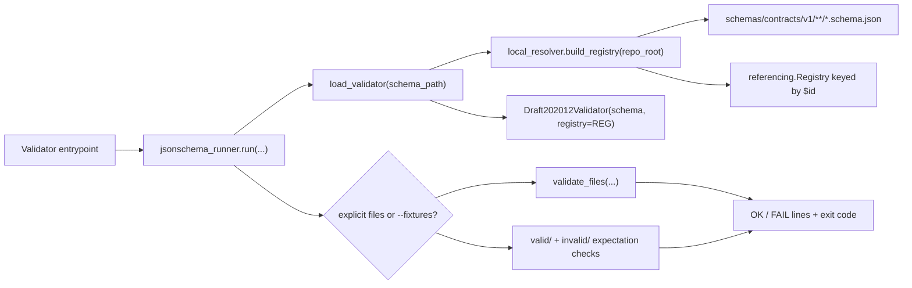

<!-- [KFM_META_BLOCK_V2]
doc_id: kfm://doc/tools-validators-common-readme
title: tools/validators/_common/ — Shared JSON Schema Validator Runtime Boundary
type: readme; directory-readme; shared-validator-runtime; schema-resolution-helper; compatibility-boundary
version: v0.3
status: draft; repository-grounded; executable; widely-consumed; fixture-driven; ci-invoked; extraction-decision-open; non-authoritative
owners: OWNER_TBD — Validator steward · Schema steward · Contract steward · Test/fixture steward · Python tooling steward · Security steward · CI steward · Release steward · Docs steward
created: 2026-05-09
updated: 2026-07-16
supersedes: v0.2 shared-validator helper guide
policy_label: "public-review; tools; validators; shared-runtime; json-schema; draft-2020-12; local-resolution; no-network; deterministic-intent; fail-closed; schema-authority-external; contract-authority-external; policy-authority-external; evidence-authority-external; release-authority-external; extraction-aware; correction-aware; rollback-aware"
current_path: tools/validators/_common/README.md
truth_posture: >
  CONFIRMED target v0.2 README; direct helper modules jsonschema_runner.py, local_resolver.py,
  and run_all.py; root jsonschema dependency; local recursive schemas/contracts/v1/**/*.schema.json
  indexing; $id skip and duplicate-$id failure behavior; Draft 2020-12 validator construction;
  five hard-coded top-level fixture validators; Makefile schemas target; schema-validation and
  validator-suite workflows; generic schema fixture test harness; bounded exact-import search
  surfacing seventeen validator scripts and two test modules; package/schema-registry placeholder
  with working implementation still under this lane; and no direct network calls in the inspected
  helper modules / PROPOSED stable helper contract, structured result envelope, deterministic
  ordering, explicit exit-code contract, resource limits, direct tests, extraction parity contract,
  migration, correction, and rollback rules / CONFLICTED v0.2 run_all verification language versus
  current executable evidence; fixture mode printing expected invalid fixtures as FAIL while
  returning success; unreachable rc == 2 branch after validate_files; hard-coded aggregation versus
  broader consumer set; working local registry under tools versus proposed reusable schema-registry
  package / UNKNOWN exhaustive consumers, accepted public/private API status, format-keyword
  enforcement, schema dialect coverage outside Draft 2020-12, operational scale limits, emitted
  machine reports, release consumers, and production use / NEEDS VERIFICATION owners, CODEOWNERS,
  direct helper test coverage, error/result schema, path-security controls, resource budgets,
  compatibility policy, package extraction ADR, consumer migration, deprecation window, and rollback
evidence_snapshot:
  repository: bartytime4life/Kansas-Frontier-Matrix
  repository_id: "1059091169"
  visibility: public
  base_ref: main
  base_commit: 42e28cb1c17be943da70576f427563c7cbd27898
  prior_blob: 39eba24a5e5bfd5943c3f2f3ae69ca3102011b37
  jsonschema_runner_blob: ce05ae25d0cb6fc29a2ea41db6c65a99ca5e13e6
  local_resolver_blob: 171a2b8251d10fcc276107459a41056cdedc8ff5
  run_all_blob: 3375cce172631dc3675cf2e46bb7788d273ff425
  validators_parent_blob: e35742288404a1eeb214f8269fbacb1429c0f86a
  root_pyproject_blob: e3bd40e8e6ce14dfcde78ff5c09608095c3eca76
  makefile_blob: 4dc8cf633581893d83fba53219c6ea847992e6be
  schema_validation_workflow_blob: 4656da9884ec7cccef453c06ae26e8eee90992da
  validator_suite_workflow_blob: 7651f0571ba8f879819b197155d160c08f9fe7ac
  common_schema_test_blob: b04342cc034d7f1cc554e155fdd02d6e972976e6
  schema_registry_namespace_readme_blob: 6c28c0152c8d17acec594e1442936b0a36f9f200
  schema_home_adr_blob: ab0010a278d766356845c23055f882f328abb418
  bounded_direct_inventory:
    - tools/validators/_common/README.md
    - tools/validators/_common/jsonschema_runner.py
    - tools/validators/_common/local_resolver.py
    - tools/validators/_common/run_all.py
  hard_coded_run_all_entrypoints:
    - tools/validators/validate_source_descriptor.py
    - tools/validators/validate_evidence_bundle.py
    - tools/validators/validate_runtime_response_envelope.py
    - tools/validators/validate_decision_envelope.py
    - tools/validators/validate_run_receipt.py
related:
  - ../README.md
  - jsonschema_runner.py
  - local_resolver.py
  - run_all.py
  - ../../../pyproject.toml
  - ../../../Makefile
  - ../../../.github/workflows/schema-validation.yml
  - ../../../.github/workflows/validator-suite.yml
  - ../../../tests/schemas/test_common_contracts.py
  - ../../../tests/schemas/test_hydrology_alias_contracts.py
  - ../../../schemas/contracts/v1/
  - ../../../fixtures/contracts/v1/
  - ../../../contracts/
  - ../../../policy/
  - ../../../data/receipts/
  - ../../../data/proofs/
  - ../../../release/
  - ../../../packages/schema-registry/src/schema_registry/README.md
  - ../../../docs/doctrine/directory-rules.md
  - ../../../docs/adr/ADR-0001-schema-home--schemas-contracts-v1-is-canonical.md
  - ../../../.github/PULL_REQUEST_TEMPLATE.md
  - ../../../schemas/contracts/v1/receipts/generated_receipt.schema.json
tags: [kfm, tools, validators, common, jsonschema, draft-2020-12, registry, resolver, fixtures, ci, fail-closed, deterministic, schema-registry, migration, correction, rollback]
notes:
  - "This revision changes only tools/validators/_common/README.md; a generated provenance receipt is paired separately."
  - "No helper code, validator entrypoint, schema, contract, policy, fixture, test, workflow, package, lifecycle object, receipt instance, proof, release object, runtime behavior, or public artifact is modified."
  - "This README documents current observable behavior, including known limitations, without treating documentation as a code fix."
[/KFM_META_BLOCK_V2] -->

<a id="top"></a>

# `tools/validators/_common/` — Shared JSON Schema Validator Runtime Boundary

> **One-line purpose.** Provide the current repository-local JSON Schema loading, `$id` registry, fixture execution, and aggregate-runner plumbing used by multiple validator entrypoints—without becoming schema authority, semantic contract authority, policy, evidence, release approval, or public truth.

<p>
  
  
  
  
  
  
  
</p>

> [!IMPORTANT]
> **This lane contains working code.** At the pinned repository snapshot it contains a local schema resolver, a shared JSON Schema runner, and a five-entrypoint aggregate runner. The parent README's general warning that executable behavior needs verification does not erase the implementation evidence in this directory.

> [!CAUTION]
> **A successful schema check proves only machine-shape conformance for the configured schema and instance.** It does not prove semantic correctness, evidence closure, source authority, rights, sensitivity safety, policy permission, release readiness, or public truth.

> [!WARNING]
> **Shared-helper changes have a broad blast radius.** A bounded exact-import search surfaced seventeen validator scripts and two test modules importing `tools.validators._common.jsonschema_runner`. Treat signatures, output text, exit codes, registry behavior, path handling, and exception behavior as compatibility-sensitive until a formal migration says otherwise.

**Quick links:** [Purpose](#purpose) · [Evidence](#current-evidence-and-maturity) · [Inventory](#confirmed-inventory) · [Architecture](#runtime-architecture) · [API](#current-helper-api) · [Registry](#local-schema-registry-contract) · [Runner](#json-schema-runner-contract) · [Aggregate](#aggregate-runner-contract) · [Outcomes](#exit-codes-outcomes-and-output) · [Fixtures](#fixture-mode) · [Consumers](#current-consumers-and-blast-radius) · [Authority](#authority-and-anti-collapse) · [Security](#path-security-resource-and-privacy-posture) · [Testing](#tests-and-ci) · [Gaps](#known-gaps-and-conflicts) · [Migration](#schema-registry-package-extraction-boundary) · [Belongs](#what-belongs-here) · [Done](#definition-of-done) · [Open](#open-verification-register) · [Rollback](#maintenance-correction-migration-and-rollback) · [Evidence ledger](#evidence-ledger)

---

## Purpose

`tools/validators/_common/` is the current repository-local runtime shared by JSON Schema validator entrypoints.

Its responsibilities are narrow:

1. discover local canonical-candidate schema files;
2. construct a `referencing.Registry` keyed by schema `$id`;
3. create a `jsonschema.Draft202012Validator`;
4. validate explicit JSON files;
5. exercise paired `valid/` and `invalid/` fixture directories;
6. run a small hard-coded set of top-level validators for `make schemas`.

The durable question is:

> Can shared validator mechanics remain deterministic, local, testable, and fail-closed while every schema, contract, policy, fixture, evidence, and release decision remains visible in its owning root?

This lane is not a generic domain utility bucket. It is not a hidden schema registry authority, policy engine, evidence resolver, release gate, pipeline, or application library.

[Back to top](#top)

---

## Current evidence and maturity

| Surface | Inspected status | Safe conclusion |
|---|---|---|
| `tools/validators/_common/README.md` | **CONFIRMED v0.2 before revision** | Documentation existed but understated verified implementation and retained stale uncertainty. |
| `local_resolver.py` | **CONFIRMED executable** | Builds an in-memory local registry from `schemas/contracts/v1/**/*.schema.json`. |
| `jsonschema_runner.py` | **CONFIRMED executable** | Loads Draft 2020-12 validators, validates files, and supports fixture mode. |
| `run_all.py` | **CONFIRMED executable** | Runs five hard-coded top-level validator entrypoints with `--fixtures`. |
| Root dependency | **CONFIRMED** | `jsonschema>=4.26.0,<5`; Python `>=3.11`. |
| `make schemas` | **CONFIRMED wired** | Invokes `python tools/validators/_common/run_all.py`. |
| `schema-validation` workflow | **CONFIRMED wired** | Installs the root project and runs `make schemas`. |
| `validator-suite` workflow | **CONFIRMED wired** | Runs `make schemas` and a fail-closed invalid-fixture check. |
| Generic contract fixture tests | **CONFIRMED executable test code** | Uses `load_validator()` across selected schema families with fixture directories. |
| Import consumers | **CONFIRMED bounded search** | Seventeen validator scripts and two test modules import the shared runner. |
| Structured machine report | **NOT ESTABLISHED** | Current output is line-oriented `OK` / `FAIL` text plus process exit status. |
| Direct `_common` unit-test suite | **NOT ESTABLISHED** | No dedicated direct test lane was verified for every helper branch and error path. |
| Stable public API | **UNKNOWN** | Imports are widespread, but no semantic-version or compatibility policy is accepted. |
| Production/runtime use | **UNKNOWN** | CI use is verified; deployed service or production release use is not. |

**Current determination:** this directory is an implemented, CI-invoked internal validator runtime with broad repository consumers. It remains non-authoritative and has unresolved compatibility, testing, output, and extraction questions.

[Back to top](#top)

---

## Confirmed inventory

```text
tools/validators/_common/
├── README.md
├── jsonschema_runner.py
├── local_resolver.py
└── run_all.py
```

### File roles

| File | Confirmed responsibility | Current boundary |
|---|---|---|
| `README.md` | Human-facing contract, evidence boundary, maintenance guidance | Cannot establish implementation by itself. |
| `local_resolver.py` | Build a local `$id` registry from canonical-candidate schema files | Does not decide schema admission, status, aliases, or canonicality. |
| `jsonschema_runner.py` | Construct validator, validate explicit files, exercise fixture directories | Does not produce a governed `ValidationReport` object. |
| `run_all.py` | Sequentially invoke five top-level validators in fixture mode | Not dynamic discovery and not the complete validator inventory. |

No `_common/__init__.py` was surfaced in bounded search. Current imports rely on the repository's Python path/package layout rather than an explicitly exported `_common` API module.

[Back to top](#top)

---

## Runtime architecture



### Dependency direction

```text
validator entrypoints
  -> tools/validators/_common/
  -> jsonschema + referencing
  -> schemas/contracts/v1/
  -> fixture JSON

NOT:

_common -> domain meaning
_common -> policy decisions
_common -> evidence authority
_common -> release authority
_common -> public runtime
```

The shared runtime should remain read-only with respect to schemas, fixtures, lifecycle data, receipts, proofs, and release records.

[Back to top](#top)

---

## Current helper API

The following functions are confirmed by code.

### `build_registry(repo_root: Path) -> Registry`

Located in `local_resolver.py`.

Observed behavior:

- resolves `repo_root / "schemas" / "contracts" / "v1"`;
- raises `FileNotFoundError` if that root is absent;
- recursively scans sorted `*.schema.json` paths;
- parses each file as UTF-8 JSON;
- reads `$id`;
- skips schemas without `$id`;
- raises `ValueError` on duplicate `$id`;
- converts each schema with `Resource.from_contents`;
- returns `Registry().with_resources(...)`.

### `load_validator(schema_path: Path)`

Located in `jsonschema_runner.py`.

Observed behavior:

- parses the requested schema as UTF-8 JSON;
- resolves repository root from `Path(__file__).resolve().parents[3]`;
- builds the full local registry;
- returns `Draft202012Validator(schema, registry=registry)`.

### `validate_files(validator, files) -> int`

Observed behavior:

- parses each file as JSON;
- sorts validation errors by instance path;
- prints the first validation error per invalid file;
- prints `OK <path>` for valid files;
- catches broad exceptions per input file;
- returns `0` only when every file validates;
- otherwise returns `1`.

### `run(schema_path: Path, fixtures_dir: Path | None, argv) -> int`

Observed behavior:

- accepts positional files;
- accepts `--fixtures`;
- returns `2` when neither explicit files nor fixture mode is supplied;
- delegates explicit files to `validate_files`;
- in fixture mode, validates `valid/*.json` and `invalid/*.json` against expected polarity.

### `main() -> int` in `run_all.py`

Observed behavior:

- invokes five top-level validator scripts sequentially;
- passes `--fixtures`;
- stops at the first non-zero exit code;
- returns `0` only when all five complete successfully.

These functions are currently import-consumed. Renaming, moving, changing signatures, changing exit codes, or changing output should be treated as a compatibility change.

[Back to top](#top)

---

## Local schema registry contract

### Confirmed scope

The resolver indexes only:

```text
schemas/contracts/v1/**/*.schema.json
```

It does not currently establish support for:

- `*.json` schemas without the `.schema.json` suffix;
- YAML schemas;
- JSON-LD contexts;
- schemas outside `schemas/contracts/v1/`;
- aliases or supersession;
- schema status or admission state;
- semantic version selection;
- generated registry snapshots;
- network retrieval.

### `$id` posture

| Condition | Current behavior | Governance interpretation |
|---|---|---|
| Schema has unique `$id` | Added to registry | Resolvable locally; not thereby canonical or approved. |
| Schema has no `$id` | Silently skipped | File may still be the primary schema passed to `load_validator`, but cannot be referenced through this registry entry. |
| Duplicate `$id` | Raises `ValueError` | Correct fail-closed behavior for ambiguous identity. |
| Invalid JSON | Exception propagates during registry construction | Run fails; no structured reason code is emitted. |
| Schema root absent | Raises `FileNotFoundError` | Run fails before validation. |

### Authority boundary

The registry is a **resolution mechanism**, not a schema-governance register.

It must not decide:

- which schema is accepted;
- whether a schema is draft, active, deprecated, or retired;
- whether a `$id` is canonical;
- whether compatibility aliases are allowed;
- whether semantic contracts and schemas agree;
- whether an instance is policy-allowed or releasable.

Those decisions belong to accepted ADRs, schema/contract governance, validation policy, reviews, and release controls.

[Back to top](#top)

---

## JSON Schema runner contract

### Supported mode: explicit files

Example:

```bash
python tools/validators/validate_evidence_bundle.py \
  path/to/candidate.json
```

Current output:

```text
OK path/to/candidate.json
```

or:

```text
FAIL path/to/candidate.json: <first validation or parse error>
```

### Supported mode: fixtures

Example:

```bash
python tools/validators/validate_evidence_bundle.py --fixtures
```

Expected directory convention:

```text
fixtures/contracts/v1/<family>/<object>/
├── valid/
│   └── *.json
└── invalid/
    └── *.json
```

Fixture mode separately verifies:

- every `valid/*.json` has no validation errors;
- every `invalid/*.json` has at least one validation error.

### Working-directory assumption

The top-level entrypoints pass relative schema and fixture paths. The current commands therefore assume execution from repository root unless absolute paths are supplied by a caller.

The local registry root is independently derived from `__file__`; the primary schema and fixture paths are not.

### Error surface

Current errors are human-readable text and exit codes. The runner does not emit a schema-backed result envelope with:

- validator id and version;
- schema id and digest;
- instance digest;
- all errors;
- JSON Pointer locations;
- reason-code families;
- timestamps;
- policy or evidence refs;
- correction or rollback refs.

Do not treat the current console line as a governed `ValidationReport`.

[Back to top](#top)

---

## Aggregate runner contract

`run_all.py` currently invokes:

```text
validate_source_descriptor.py
validate_evidence_bundle.py
validate_runtime_response_envelope.py
validate_decision_envelope.py
validate_run_receipt.py
```

### Confirmed callers

- `make schemas`;
- `.github/workflows/schema-validation.yml`;
- `.github/workflows/validator-suite.yml`.

### Current behavior

```text
for each hard-coded validator:
  run Python entrypoint with --fixtures
  if return code != 0:
    stop and return that code
return 0
```

### Boundary

`run_all.py` is a **curated smoke/fixture aggregator**, not:

- automatic validator discovery;
- a registry of every validator;
- a proof that every schema family is covered;
- a complete release gate;
- a parallel CI configuration authority.

A bounded import search shows more shared-runner consumers than the five aggregate entries. The five-entrypoint list is therefore a selected subset, not the complete shared-runtime consumer inventory.

[Back to top](#top)

---

## Exit codes, outcomes, and output

### Current process exit codes

| Code | Confirmed meaning |
|---:|---|
| `0` | Requested validation or fixture-polarity checks completed successfully. |
| `1` | One or more explicit files failed, a valid fixture failed, an invalid fixture passed, or an aggregate child returned `1`. |
| `2` | `run()` was called without explicit files and without `--fixtures`. |

Uncaught schema-loading, registry-construction, argument, path, or subprocess errors may terminate with other interpreter/process behavior. They are not normalized into the table above.

### Console tokens

| Token | Current meaning | Limitation |
|---|---|---|
| `OK` | One explicit instance produced no schema errors. | Does not mean evidence/policy/release success. |
| `FAIL` | One explicit instance had a validation/parse/runtime error. | In fixture mode, expected-invalid fixtures are also printed as `FAIL`. |
| `No files provided` | No files and no fixture flag were supplied. | Human text only; no reason-code object. |

### Proposed stable reason-code families

The following are documentation proposals, not current emitted values:

```text
VALIDATOR_PASS
VALIDATOR_INSTANCE_INVALID
VALIDATOR_INSTANCE_PARSE_ERROR
VALIDATOR_SCHEMA_NOT_FOUND
VALIDATOR_SCHEMA_PARSE_ERROR
VALIDATOR_SCHEMA_ID_MISSING
VALIDATOR_DUPLICATE_SCHEMA_ID
VALIDATOR_REGISTRY_BUILD_ERROR
VALIDATOR_FIXTURE_ROOT_MISSING
VALIDATOR_VALID_FIXTURE_FAILED
VALIDATOR_INVALID_FIXTURE_PASSED
VALIDATOR_NO_INPUT
VALIDATOR_CONFIG_ERROR
VALIDATOR_INTERNAL_ERROR
```

A future result envelope should distinguish invalid candidate data from validator infrastructure failure.

[Back to top](#top)

---

## Fixture mode

### Current positive/negative contract

```text
valid/*.json   must validate
invalid/*.json must fail validation
```

This is a useful fail-closed polarity check and is exercised by CI through `make schemas`.

### Current output conflict

Fixture mode first sends both valid and invalid files through `validate_files()`.

Consequences:

- expected-invalid fixtures print `FAIL ...`;
- `validate_files()` returns `1` when invalid fixtures correctly fail;
- `run()` ignores that `1` and performs separate polarity checks;
- the final process may return `0`.

Therefore:

```text
console contains FAIL
process exit code is 0
```

can be a successful fixture run.

This is **CONFIRMED current behavior**, not a recommendation. Human reviewers and log parsers must not infer overall failure from the presence of `FAIL` lines alone.

### Unreachable branch

`validate_files()` currently returns only `0` or `1`, while fixture mode checks:

```python
if rc == 2:
    return rc
```

That branch is unreachable under the current implementation.

### Ordering

The registry scan is explicitly sorted. Fixture glob iteration in `jsonschema_runner.py` is not explicitly sorted, while `tests/schemas/test_common_contracts.py` does sort discovered fixtures.

Stable output ordering is therefore **NEEDS VERIFICATION** across platforms and filesystems.

[Back to top](#top)

---

## Current consumers and blast radius

A bounded exact-import search surfaced:

- **17 validator scripts** importing `run`;
- **2 test modules** importing `load_validator`.

Confirmed consumer classes include:

- top-level contract validators;
- release validators;
- Hydrology alias validators;
- MapLibre performance governance validators;
- schema fixture tests.

### Compatibility-sensitive surfaces

Treat these as internal-but-shared interfaces:

```text
tools.validators._common.local_resolver.build_registry
tools.validators._common.jsonschema_runner.load_validator
tools.validators._common.jsonschema_runner.validate_files
tools.validators._common.jsonschema_runner.run
```

Compatibility includes more than Python signatures:

- repository-root derivation;
- schema scan root and suffix;
- `$id` duplicate behavior;
- skipped missing `$id` behavior;
- exception types;
- console prefixes;
- first-error selection;
- fixture naming and directory conventions;
- exit codes;
- aggregate ordering and fail-fast behavior.

### Change discipline

Before changing shared behavior:

1. inventory all imports and subprocess callers;
2. classify behavior as bug fix, compatible extension, or breaking change;
3. add direct regression tests;
4. preserve or intentionally version output and exit codes;
5. update wrappers, Makefile, workflows, and docs together;
6. define rollback;
7. avoid dual implementations.

[Back to top](#top)

---

## Authority and anti-collapse

### Owning roots

| Responsibility | Owning home |
|---|---|
| Shared validator implementation | `tools/validators/_common/` |
| Validator entrypoints | `tools/validators/` and accepted sublanes |
| Semantic meaning | `contracts/` |
| Machine shape | `schemas/` |
| Policy decisions | `policy/` |
| Fixtures | `fixtures/` |
| Tests | `tests/` |
| Source authority | accepted registry/control-plane homes |
| Evidence and proofs | `data/proofs/` and accepted evidence homes |
| Process receipts | `data/receipts/` |
| Release/correction/rollback | `release/` |
| Public serving | governed applications and released artifacts |

### Disallowed collapses

```text
schema found                  -> schema accepted
schema validates              -> semantic contract satisfied
instance validates            -> evidence complete
instance validates            -> policy allowed
instance validates            -> release approved
fixture suite passes          -> all schemas covered
run_all passes                -> all validators passed
console OK                    -> public truth
registry entry exists         -> canonical schema identity
shared helper                 -> schema authority
```

### Fail-closed rule

Infrastructure errors must not become validation passes. Missing schemas, duplicate identities, parse failures, unresolved references, and unexpected exceptions must result in non-zero or explicit abstain/error outcomes.

[Back to top](#top)

---

## Path, security, resource, and privacy posture

### Confirmed current properties

The inspected `_common` Python modules:

- read local files;
- construct in-memory schema resources;
- perform no direct network calls;
- do not write lifecycle data;
- do not emit receipts or proofs;
- do not mutate schemas or fixtures.

### Path considerations

Current APIs accept `Path` values from validator entrypoints and CLI file arguments.

Before accepting untrusted or externally supplied paths, verify:

- repository-root containment where required;
- symlink behavior;
- traversal outside allowed roots;
- file type and extension;
- maximum file size;
- maximum file count;
- permission and access posture;
- error-message redaction.

### Resource considerations

No explicit limits were verified for:

- schema count;
- schema size;
- instance size;
- nesting depth;
- number of validation errors;
- validation time;
- aggregate subprocess duration.

Large or adversarial JSON/Schema inputs may require separate resource controls before this runtime is used with untrusted data.

### Privacy and sensitivity

Validation errors can echo schema messages, instance-derived values, or file paths. Do not send sensitive locations, credentials, living-person data, DNA/genomic material, archaeology, infrastructure details, private-land information, or restricted source content into public CI logs without a reviewed minimization strategy.

[Back to top](#top)

---

## Tests and CI

### Confirmed test coverage

`tests/schemas/test_common_contracts.py`:

- imports `load_validator`;
- discovers selected schema families;
- pairs schemas with fixture directories;
- asserts valid fixtures pass;
- asserts invalid fixtures fail;
- optionally checks expected error text or patterns.

`tests/schemas/test_hydrology_alias_contracts.py` also imports the shared runner.

### Confirmed CI wiring

```text
Makefile schemas
  -> python tools/validators/_common/run_all.py

schema-validation workflow
  -> pip install -e .
  -> make schemas

validator-suite workflow
  -> pip install -e .
  -> make schemas
  -> explicit invalid EvidenceBundle must return non-zero
```

### Direct tests still needed

A dedicated `_common` test suite should cover:

- missing schema root;
- invalid schema JSON;
- schema without `$id`;
- duplicate `$id`;
- reference resolution;
- registry ordering;
- primary schema outside the scan root;
- explicit valid/invalid file behavior;
- malformed instance JSON;
- no-input exit code `2`;
- missing fixture directory;
- expected-invalid console semantics;
- deterministic fixture ordering;
- `fixtures_dir=None` with `--fixtures`;
- aggregate order and fail-fast behavior;
- child exit-code propagation;
- path containment and symlinks;
- resource limits;
- error redaction;
- format-keyword enforcement posture.

### Current verification commands

```bash
python tools/validators/_common/run_all.py
make schemas
python -m pytest tests/schemas/test_common_contracts.py -q
python -m pytest tests/schemas tests/contracts -q
make test
```

Passing these commands is implementation evidence for their declared scope only.

[Back to top](#top)

---

## Known gaps and conflicts

| ID | Gap or conflict | Status |
|---|---|---|
| COMMON-01 | v0.2 said `run_all.py` needed code verification; current code is confirmed. | Corrected in v0.3 |
| COMMON-02 | Fixture mode prints expected invalid fixtures as `FAIL` while the run may succeed. | CONFIRMED |
| COMMON-03 | `if rc == 2` after `validate_files()` is unreachable. | CONFIRMED |
| COMMON-04 | Aggregate runner is hard-coded to five entrypoints while shared imports are broader. | CONFIRMED |
| COMMON-05 | No structured `ValidationReport` output is emitted. | CONFIRMED absence |
| COMMON-06 | Only the first validation error per explicit file is printed. | CONFIRMED |
| COMMON-07 | Format-keyword enforcement is not explicitly configured in `load_validator()`. | NEEDS VERIFICATION |
| COMMON-08 | Fixture iteration is not explicitly sorted in the CLI runner. | CONFIRMED code / runtime effect NEEDS VERIFICATION |
| COMMON-09 | Direct unit coverage for registry and CLI error branches is incomplete. | NEEDS VERIFICATION |
| COMMON-10 | Relative schema/fixture paths assume repository-root execution. | CONFIRMED wrappers |
| COMMON-11 | Working registry logic overlaps a proposed `packages/schema-registry` extraction. | CONFLICTED |
| COMMON-12 | Stable API, output, exit-code, and deprecation policy are absent. | NEEDS VERIFICATION |
| COMMON-13 | Resource, path, symlink, timeout, and log-redaction limits are not established. | NEEDS VERIFICATION |
| COMMON-14 | ADR-0001 declares the intended schema home but remains `proposed`. | CONFIRMED status |

This README documents these conditions; it does not repair them.

[Back to top](#top)

---

## Schema-registry package extraction boundary

The repository contains a proposed reusable package namespace:

```text
packages/schema-registry/src/schema_registry/
```

Its current README confirms that:

- the package namespace is a placeholder;
- its initializer is empty;
- its `core.py` is comment-only;
- no accepted package API or consumers are established;
- working local registry logic remains in `_common/local_resolver.py`.

### No-dual-implementation rule

Do not independently evolve equivalent registry logic in both locations.

Until an accepted extraction decision:

```text
working implementation = tools/validators/_common/
package namespace       = proposed placeholder
```

### Extraction requirements

A future move to `packages/schema-registry` must define:

1. accepted package API and version;
2. schema-root and `$id` parity;
3. skip/duplicate/error behavior;
4. deterministic ordering;
5. path and resource security;
6. tests covering both old and new behavior;
7. all import and subprocess consumers;
8. compatibility shim or coordinated cutover;
9. deprecation window;
10. rollback to the prior `_common` implementation;
11. documentation and generated receipts.

The package must remain a resolution utility, not schema authority.

[Back to top](#top)

---

## What belongs here

Good fits:

- repository-local schema registry construction used only by validator tooling;
- Draft 2020-12 validator construction;
- common JSON parsing and validation plumbing;
- deterministic error normalization;
- shared fixture polarity helpers;
- internal CLI/exit-code utilities;
- aggregate fixture-runner support;
- compatibility adapters during an approved extraction;
- helper-local documentation.

A helper belongs here only when it is:

- shared across multiple validators;
- subordinate to external schemas/contracts/policy;
- deterministic or explicitly bounded;
- no-network by default;
- read-only with respect to governed records;
- directly tested;
- free of domain-specific meaning and release decisions.

[Back to top](#top)

---

## What does not belong here

| Do not put here | Correct home |
|---|---|
| Domain-specific validation rules | accepted domain validator lane |
| Top-level user-facing validator entrypoints | `tools/validators/` or accepted sublane |
| Canonical schemas or `$id` authority records | `schemas/` and accepted governance registers |
| Semantic object meaning | `contracts/` |
| Allow/deny/restrict/abstain policy | `policy/` |
| Fixture payloads | `fixtures/` |
| Test suites | `tests/` |
| Source descriptors or activation decisions | accepted registry/control-plane homes |
| Validation report records | accepted `data/` report/receipt home |
| EvidenceBundles or proof packs | `data/proofs/` |
| Release decisions or rollback cards | `release/` |
| Ingest, transform, catalog, or publication workflows | `connectors/`, `pipelines/`, release tooling |
| Public API/UI behavior | governed application roots |
| Credentials, private endpoints, exact sensitive data | denied |

[Back to top](#top)

---

## Smallest sound improvement sequence

1. Add direct tests for current behavior before changing code.
2. Make fixture output distinguish expected invalid cases from operational failure.
3. Remove or redefine the unreachable `rc == 2` branch.
4. Sort fixture discovery explicitly.
5. Define stable result and exit-code contracts.
6. Decide whether all errors or only the first error are reported.
7. Pin format-keyword enforcement posture.
8. Add path, resource, timeout, and redaction controls.
9. Reconcile the five-entrypoint aggregate list with intended coverage.
10. Decide retain-versus-extract for `packages/schema-registry`.
11. Migrate consumers with parity tests and rollback.
12. Update parent docs, workflows, and runbooks with verified behavior.

Each item should be a small, reviewable change. Do not combine package extraction, output redesign, and validator behavior changes without an ADR/migration plan and broad regression coverage.

[Back to top](#top)

---

## Definition of done

### Documentation boundary

- [x] Direct implementation files are identified.
- [x] Current helper functions and exit codes are documented.
- [x] CI, Makefile, aggregate runner, and generic fixture test wiring are grounded.
- [x] Known fixture-output and unreachable-branch behavior is surfaced.
- [x] Schema authority, policy, evidence, release, and public boundaries are explicit.
- [x] Package extraction conflict is visible.

### Implementation quality

- [ ] Direct tests cover every helper function and error branch.
- [ ] Fixture output has unambiguous expected-invalid semantics.
- [ ] File and fixture ordering is deterministic.
- [ ] Result/exit-code compatibility is documented and tested.
- [ ] Format-keyword posture is explicit and tested.
- [ ] Path, symlink, size, count, depth, timeout, and redaction controls are accepted.
- [ ] Structured result reporting is accepted or explicitly rejected.
- [ ] Aggregate-runner scope is intentional and tested.
- [ ] CODEOWNERS and reviewer burden are enforced.

### Extraction and lifecycle

- [ ] Retain-versus-extract decision is accepted.
- [ ] No dual registry implementation exists.
- [ ] Consumer inventory is complete.
- [ ] Compatibility/deprecation window is defined.
- [ ] Correction and rollback are exercised.
- [ ] Documentation and receipts match implementation.

Until these close: **working internal shared runtime; compatibility-sensitive; non-authoritative; extraction unresolved**.

[Back to top](#top)

---

## Open verification register

| ID | Item | Status |
|---|---|---|
| VCOMMON-01 | Assign validator/schema/Python tooling owners. | NEEDS VERIFICATION |
| VCOMMON-02 | Confirm exhaustive direct inventory and all consumers. | NEEDS VERIFICATION |
| VCOMMON-03 | Define stable API and compatibility policy. | NEEDS VERIFICATION |
| VCOMMON-04 | Define structured result/report posture. | NEEDS VERIFICATION |
| VCOMMON-05 | Resolve fixture console semantics. | NEEDS VERIFICATION |
| VCOMMON-06 | Resolve unreachable return-code branch. | NEEDS VERIFICATION |
| VCOMMON-07 | Confirm deterministic fixture ordering on supported systems. | NEEDS VERIFICATION |
| VCOMMON-08 | Confirm format-keyword enforcement requirements. | NEEDS VERIFICATION |
| VCOMMON-09 | Add direct registry and runner tests. | NEEDS VERIFICATION |
| VCOMMON-10 | Define allowed path roots and symlink behavior. | NEEDS VERIFICATION |
| VCOMMON-11 | Define schema/instance resource budgets. | NEEDS VERIFICATION |
| VCOMMON-12 | Define sensitive error/log redaction. | NEEDS VERIFICATION |
| VCOMMON-13 | Reconcile aggregate runner with intended validator coverage. | NEEDS VERIFICATION |
| VCOMMON-14 | Decide `_common` retention versus package extraction. | NEEDS VERIFICATION |
| VCOMMON-15 | Define migration, deprecation, correction, and rollback. | NEEDS VERIFICATION |
| VCOMMON-16 | Confirm ADR-0001 acceptance or successor status. | NEEDS VERIFICATION |

[Back to top](#top)

---

## Maintenance, correction, migration, and rollback

### Maintenance triggers

Update this README when:

- helper files, signatures, or behavior change;
- registry scan roots, suffixes, `$id` behavior, or dialect change;
- output text, error selection, fixture conventions, or exit codes change;
- aggregate entrypoints change;
- tests or workflows change;
- `schema-registry` extraction advances;
- security/resource controls change;
- correction or rollback reveals undocumented behavior.

### Documentation correction

1. preserve the prior blob and evidence snapshot;
2. identify the incorrect statement and affected consumers;
3. correct through review;
4. update parent validator, package, workflow, and test documentation;
5. preserve supersession and changelog history.

### Code migration

A behavior or package migration must:

1. inventory imports, subprocess calls, Make targets, and workflows;
2. capture current behavior with regression tests;
3. define compatibility and breaking changes;
4. implement one authoritative path;
5. provide a time-bounded shim only when necessary;
6. prevent dual execution and dual registry behavior;
7. validate positive, negative, error, path, and resource cases;
8. update consumers and CI;
9. document deprecation and removal;
10. verify rollback.

### Rollback for this documentation change

Before merge, close the review branch. After merge, revert the documentation commit or restore prior blob `39eba24a5e5bfd5943c3f2f3ae69ca3102011b37` through a reviewed branch. No validator code, schema, fixture, workflow, lifecycle data, policy, release, or runtime rollback is required.

[Back to top](#top)

---

## Evidence ledger

| Evidence | Supports | Does not prove |
|---|---|---|
| Current `_common` README | Prior scope and documentation lineage | Current code behavior by itself |
| `local_resolver.py` | Registry root, sorted scan, `$id` skip, duplicate failure | Schema acceptance or alias policy |
| `jsonschema_runner.py` | Validator construction, explicit file mode, fixture mode, output, exit paths | Semantic correctness or release readiness |
| `run_all.py` | Five hard-coded aggregate entries and fail-fast behavior | Complete validator coverage |
| Top-level validator wrappers | Relative schema/fixture paths and shared-runner imports | All consumers or supported CWDs |
| Exact-import search | Seventeen validator and two test consumers surfaced | Exhaustive dependency graph |
| `test_common_contracts.py` | Generic fixture polarity tests using `load_validator` | Direct coverage of every helper branch |
| Makefile | `make schemas` invokes aggregate runner | Overall repository correctness |
| Schema workflows | CI invokes `make schemas` and fail-closed invalid check | Production use or complete policy enforcement |
| Root `pyproject.toml` | Python and `jsonschema` dependency bounds | Full supported environment matrix |
| Schema-registry package README | Placeholder package and extraction conflict | Accepted extraction or working package |
| ADR-0001 | Proposed schema-home decision | Accepted status or field-level schema quality |
| Directory Rules | Responsibility-root placement | Exact helper API or implementation correctness |

[Back to top](#top)

---

## Changelog

| Version | Date | Change | Status |
|---|---|---|---|
| v0.2 | 2026-07-07 | Expanded shared-helper documentation while retaining implementation uncertainty. | Superseded |
| v0.3 | 2026-07-16 | Grounded direct implementation, consumers, CI, exit/output behavior, fixture semantics, known defects, security/resource posture, and schema-registry extraction conflict. | Draft / repository-grounded |

---

> **Final rule:** `_common` may normalize validator mechanics. It must never normalize away the evidence, authority, uncertainty, policy, sensitivity, review, release, correction, or rollback boundaries that validators are supposed to enforce.

[Back to top](#top)
