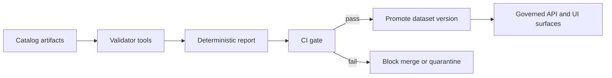

<!-- [KFM_META_BLOCK_V2]
doc_id: kfm://doc/6c3f4c36-5d09-4c8a-92aa-cb8d8dfe0a6a
title: Validators Shared Harness
type: standard
version: v1
status: draft
owners: <TBD>
created: 2026-02-26
updated: 2026-02-26
policy_label: public
related:
  - tools/validators/README.md
  - docs/MASTER_GUIDE_v13.md
tags: [kfm, validators, tooling, ci-gates]
notes:
  - Shared utilities for catalog validators and link-checkers.
  - Keep outputs deterministic and fail-closed.
[/KFM_META_BLOCK_V2] -->

# Validators Shared Harness

Shared utilities used by `tools/validators/*` to enforce **fail-closed** validation for KFM catalog + provenance artifacts.


> **WARNING**
> This code is part of the **trust membrane**. It must be deterministic, testable, and safe-by-default.
> When in doubt: **deny / fail** and emit a clear, machine-readable report.

## Navigation

- [Why this exists](#why-this-exists)
- [Where it fits](#where-it-fits)
- [What lives here](#what-lives-here)
- [Validator contract](#validator-contract)
- [Determinism and safety rules](#determinism-and-safety-rules)
- [How to build a new validator](#how-to-build-a-new-validator)
- [Testing checklist](#testing-checklist)
- [Repo verification checklist](#repo-verification-checklist)

---

## Why this exists

KFM promotion is governed by a **Promotion Contract**: catalogs, provenance, and cross-links must validate before anything becomes publishable.

KFM treats the catalog + provenance “triplet” as a first-class contract surface:

- **DCAT** — dataset-level metadata (license, publisher, distributions)
- **STAC** — asset-level metadata (collections/items/assets)
- **PROV** — lineage describing how artifacts were created

These artifacts must be **cross-linked** so evidence references resolve without guessing.

In practice, that means validators (and the link-checker) must be able to answer:

- “Does this JSON/JSON‑LD conform to the required profile?”
- “Do all declared links resolve?”
- “Are required identifiers, digests, and policy labels present?”

Failing validation should **block promotion / block merge**.

This folder exists so each validator does **not** reinvent:

- file discovery and ignore rules
- schema-loading and schema-validation
- normalized finding formats
- stable error codes and exit semantics
- deterministic report output (for CI diffs + audit)

### Minimum checks this harness should support

| Check type | Examples | Typical failure | Gate impact |
|---|---|---|---|
| Schema validity | JSON Schema, JSON‑LD shape checks | Missing required field, invalid type | Fail closed |
| Referential integrity | DCAT ↔ STAC ↔ PROV links | Broken `href`, missing target file | Fail closed |
| Evidence pointer sanity | Evidence refs / pointers format | Unparseable pointer | Fail closed |
| Determinism checks | Stable sorted output | “Flaky” CI diffs | Must fix |

## Where it fits

This `_shared/` package is an internal library for validator tools.

Typical consumers:

- `tools/validators/dcat_validator`
- `tools/validators/stac_validator`
- `tools/validators/prov_validator`
- `tools/linkcheck/catalog_linkcheck`

## How validators gate promotion



## What lives here

This directory should contain **only** shared validator infrastructure.

### Acceptable inputs

- Catalog artifacts (DCAT / STAC / PROV)
- Validator configuration (local-only)
- JSON Schema definitions and/or JSON-LD shapes used by validators
- Test fixtures and golden reports

### Exclusions

Do **not** put these here:

- anything that fetches from the network
- credentials, tokens, or environment-specific secrets
- business/domain transforms (those belong in pipelines)
- policy decision logic (that belongs in the policy engine / OPA pack)
- UI code

### Proposed directory tree

> This is a **suggested** layout (adjust to match the repo’s language/tooling).

```text
tools/validators/_shared/
  README.md                # you are here
  src/                     # shared library code (if used)
  fixtures/                # optional shared fixtures
  schemas/                 # optional shared schema bundles
  tests/                   # unit tests for the shared harness
```

---

## Validator contract

All validators should share a single, versioned contract for:

- inputs (paths/globs)
- output report shape
- exit codes

### Result model (recommended)

Validators should emit a **single JSON report** (stdout or file) and exit non‑zero on failure.

```json
{
  "validator": {
    "id": "kfm.validators.stac",
    "version": "v1",
    "run_id": "<optional>"
  },
  "target": {
    "paths": ["data/**/stac/**/*.json"],
    "git_commit": "<optional>"
  },
  "summary": {
    "status": "fail",
    "error_count": 3,
    "warn_count": 1
  },
  "findings": [
    {
      "severity": "error",
      "code": "STAC_SCHEMA_INVALID",
      "message": "STAC Item does not conform to schema",
      "artifact": "data/stac/items/event_123.json",
      "json_pointer": "/properties/datetime",
      "hint": "Expected RFC3339 datetime",
      "evidence": {
        "line": 42,
        "col": 17
      }
    }
  ]
}
```

### Exit codes (recommended)

- `0` — pass (no `error` findings)
- `2` — validation failed (one or more `error` findings)
- `3` — internal error (crash, invalid config, unexpected exception)

---

## Determinism and safety rules

**Hard requirements** for anything in `_shared/`:

- **No network I/O** (validators must be able to run in CI offline).
- **Stable ordering** of findings (sort by `artifact`, then `code`, then `json_pointer`).
- **Stable formatting** (avoid timestamps unless explicitly requested).
- **Fail-closed** behavior: missing required artifacts/fields = `error`.
- **No secret leakage**: scrub environment-derived values from reports.

---

## How to build a new validator

1. **Define** a stable validator id (example: `kfm.validators.dcat`).
2. **Implement** a pure function that returns `findings[]`.
3. **Use** the shared harness to:
   - discover files
   - load schemas/shapes
   - run checks
   - write a deterministic report
4. **Add fixtures**:
   - `valid/` samples that must pass
   - `invalid/` samples that must fail with known codes

### Pseudocode

```text
validate(paths):
  files = discover(paths)
  schemas = loadSchemas()

  findings = []
  for file in files:
    doc = parse(file)
    findings += schemaValidate(doc, schemas)
    findings += crossLinkChecks(doc)

  findings = sortDeterministically(findings)
  report = buildReport(findings)
  emit(report)

  exit(codeFrom(findings))
```

---

## Testing checklist

Use fixtures-driven tests so CI can enforce behavior.

- [ ] valid fixture set passes with exit `0`
- [ ] invalid fixture set fails with exit `2`
- [ ] crash scenarios return exit `3` and a minimal report
- [ ] findings are deterministic across OS / runtime
- [ ] adding a new check requires updating or adding fixture expectations

---

## Repo verification checklist

This README intentionally avoids guessing the repo’s implementation details.
Before wiring `_shared/` into CI, verify:

- [ ] **Language/runtime** used for tools (Node, Python, etc.)
- [ ] Where **schemas** live (`schemas/`, `contracts/schemas/`, etc.)
- [ ] Which CI workflow(s) execute validators on PRs
- [ ] Which paths are considered the **catalog triplet** in this repo
- [ ] How validation reports are stored / referenced (run receipts, audit ledger, etc.)

<details>
<summary>Why the verification checklist matters</summary>

KFM treats validators as part of the promotion gate. If the repo layout, schema locations, or CI wiring differ from assumptions,
validators can silently stop enforcing the Promotion Contract.

</details>

---

<p align="right"><a href="#validators-shared-harness">Back to top</a></p>
