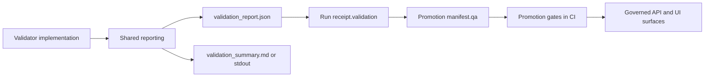

<!-- [KFM_META_BLOCK_V2]
doc_id: kfm://doc/a53b45f6-96e0-40b3-b26a-6e1080873c3d
title: Shared Validator Reporting
type: standard
version: v1
status: draft
owners: TBD
created: 2026-02-26
updated: 2026-02-26
policy_label: public
related:
  - kfm://doc/README@tools/validators
tags: [kfm, validators, reporting]
notes:
  - Shared helpers for emitting deterministic, machine-readable validation reports and mapping them into KFM run receipts.
[/KFM_META_BLOCK_V2] -->

# tools/validators/_shared/reporting
Shared reporting contract + helpers for validator outputs (JSON + optional human summaries).


> **NOTE**
> This folder is *reporting*, not *validation logic*. Validators should depend on this module to emit uniform artifacts that CI, promotion gates, and run receipts can consume.

## Quick links
- [Purpose](#purpose)
- [Where this fits](#where-this-fits)
- [Directory contract](#directory-contract)
- [Reporting contract](#reporting-contract)
- [Run receipt integration](#run-receipt-integration)
- [Determinism and report digests](#determinism-and-report-digests)
- [Redaction and sensitivity](#redaction-and-sensitivity)
- [Testing](#testing)
- [Definition of done](#definition-of-done)
- [Appendix](#appendix)

---

## Purpose
KFM’s promotion and publication gates rely on **QA reports** and **run receipts** being present and verifiable. This directory defines (and optionally implements) a **shared, validator-agnostic reporting contract** so that:

1. Every validator can emit a **machine-readable report** with stable fields.
2. CI can fail-closed based on **status** and **exit codes** without parsing brittle logs.
3. Pipelines can record a `report_digest` and per-check statuses into the **run receipt** and/or **promotion manifest**.
4. Humans still get a clear summary (stdout or a Markdown report) without losing auditability.

---

## Where this fits
KFM’s “truth path” expects QA outputs before promotion/publishing. Validators are tooling that support the catalog + QA gates, and reporting is the glue that makes validator results **portable**, **auditable**, and **digestible** by automation.



---

## Directory contract

### Where it lives
This directory is intended to be imported by validator tools under:

- `tools/validators/<validator_name>/...`
- `tools/linkcheck/...` (if link checking also emits validation-like reports)

### Expected contents
**Do not treat this tree as confirmed unless you check the repo.** This is a recommended shape:

```text
tools/validators/_shared/reporting/
  README.md                      # this file
  schema/                        # JSON Schema(s) for report payloads (recommended)
    validation_report_v1.schema.json
  src/                           # shared reporter implementation (optional)
    reporter.*
    types.*
    digest.*
    redaction.*
  fixtures/                       # golden reports for tests (recommended)
  tests/                          # unit tests ensuring determinism + schema conformance
```

### What belongs here
Acceptable inputs to the reporting layer:

- Structured check outcomes (name, status, optional numeric `value`, optional `threshold`)
- Structured issue lists (severity, code, message, optional JSON pointer/path)
- Minimal target metadata (what was validated: file path(s), dataset slug/version when available)
- Optional runtime metadata needed for audit friendliness (start/end timestamps, tool version)

### What must not go here
Exclusions (keep this layer pure and reusable):

- **No validation logic** (schema validation, link resolution, geometry checks belong in validators)
- **No promotion decisions** (promotion gates live in CI/pipeline logic; reporting only records outcomes)
- **No network calls** (reports must be reproducible from local artifacts)
- **No writes into canonical data zones** (RAW/WORK/PROCESSED/CATALOG are pipeline-owned)
- **No secrets / credentials** in reports (ever)

> **WARNING**
> If a report can end up served via governed APIs (or attached to PR artifacts), treat it as potentially user-visible: do not embed sensitive raw values; prefer counts, hashes, and redacted snippets.

[Back to top](#quick-links)

---

## Reporting contract

### Status semantics
All shared reporting should normalize to a small set of statuses:

| Status | Meaning | CI behavior (recommended) |
|---|---|---|
| `pass` | All checks met thresholds | exit 0 |
| `warn` | Non-blocking issues (policy-dependent) | exit 0 (or configurable) |
| `fail` | One or more blocking failures | exit 1 |

> **TIP**
> Keep policy out of validators: a validator should report `warn` vs `fail` based on *technical correctness*, while CI/promotion policy decides whether warnings are promotable.

### Report payload (proposed) — `kfm_validation_report_version: v1`
The following JSON is a **proposed** minimum shape. If the repo already has a schema, treat that schema as the source of truth and update this README accordingly.

```json
{
  "kfm_validation_report_version": "v1",

  "validator": {
    "name": "stac_validator",
    "version": "0.0.0+local"
  },

  "target": {
    "kind": "catalog",
    "paths": ["data/stac/collections/example.json"]
  },

  "summary": {
    "status": "pass",
    "error_count": 0,
    "warning_count": 1,
    "info_count": 0
  },

  "checks": [
    { "name": "schema_valid", "status": "pass" },
    { "name": "cross_links_resolve", "status": "warn", "value": 0.98, "threshold": 1.0 }
  ],

  "issues": [
    {
      "severity": "warning",
      "code": "STAC_MISSING_FIELD",
      "message": "Missing optional field: links[rel=license].",
      "path": "$.links",
      "hint": "Add a license link or document why it is absent."
    }
  ],

  "meta": {
    "created_at": "2026-02-26T00:00:00Z",
    "runtime": {
      "git_commit": "<commit>",
      "container_image": "sha256:<image_digest>"
    }
  }
}
```

### Required invariants
Reporting should enforce invariants that make downstream automation safe:

- **Deterministic ordering:** `checks[]` and `issues[]` must be emitted in a stable order.
- **No ambiguous nulls:** prefer omitting optional keys rather than emitting `null` (keeps canonicalization stable).
- **Machine + human separation:** JSON is the contract; Markdown/stdout is convenience.
- **Fail-closed compatibility:** if a validator cannot produce a valid report payload, it must fail (exit non-zero).

[Back to top](#quick-links)

---

## Run receipt integration
KFM run receipts are expected to carry validation outcomes (status + report references). This reporting module exists to make that easy.

### Mapping
Recommended mapping from a full report to a run receipt’s `validation` block:

| Run receipt field | Source |
|---|---|
| `validation.status` | `summary.status` |
| `validation.reports[].name` | `checks[].name` |
| `validation.reports[].status` | `checks[].status` |
| `validation.reports[].value` | `checks[].value` |
| `validation.report_digest` or equivalent | computed digest of the canonical JSON report |

### Example `validation` block (run receipt)
```json
{
  "validation": {
    "status": "pass",
    "reports": [
      { "name": "schema_valid", "status": "pass" },
      { "name": "cross_links_resolve", "status": "warn", "value": 0.98 }
    ]
  }
}
```

> **NOTE**
> If your run receipt schema supports only a single `report_digest`, store the digest of the *full* JSON report and keep the JSON report artifact alongside other CI artifacts (or in WORK/QA outputs) so it can be retrieved later.

[Back to top](#quick-links)

---

## Determinism and report digests
Promotion gates and audit trails benefit from **stable digests**:

1. Serialize the JSON report using a canonical form (e.g., canonical JSON rules).
2. Compute `sha256` over the canonical bytes.
3. Store the resulting `sha256:<hex>` as the report digest in:
   - `run_receipt.validation.report_digest` (or equivalent), and/or
   - `promotion_manifest.qa.report_digest` (if used)

### Recommended digest rules
- The digest must be computed over the report **without** any self-referential digest field.
- Timestamps are allowed, but if they impact digest stability, store timestamps outside the digested body (policy choice).
- If you need stable digests across runs, ensure all non-deterministic fields (like file order) are normalized.

[Back to top](#quick-links)

---

## Redaction and sensitivity
Validator reports may contain file paths, identifiers, or sample values.

Rules of thumb:

- Prefer **counts** and **hashes** over raw values.
- If you must include an example value, include a **redacted** or **truncated** version and label it.
- Never down-classify: if inputs are restricted/sensitive, the report must not be less restricted than its inputs.

> **WARNING**
> Avoid embedding exact coordinates or other targeting-enabling details in reports for sensitive-location datasets. Use generalized summaries and leave the raw evidence in governed storage.

[Back to top](#quick-links)

---

## Testing
Minimum recommended tests for shared reporting:

- **Schema validation test:** generated report validates against `validation_report_v1.schema.json` (if present).
- **Golden digest test:** the same input events produce the same `report_digest` (deterministic).
- **Ordering test:** adding issues/checks yields stable ordering rules.
- **Redaction test:** known sensitive keys/fields are never emitted unredacted.

---

## Definition of done
A change to shared reporting is “done” when:

- [ ] Report schema version is explicit and (if changed) **version-bumped**
- [ ] Backwards compatibility impact is documented (what breaks, what doesn’t)
- [ ] Golden fixtures updated *intentionally* (not drift)
- [ ] Digest stability verified (or drift justified + gated)
- [ ] At least one validator consumes the shared reporting layer end-to-end
- [ ] CI can enforce fail/pass via the contract (no log-scraping)

[Back to top](#quick-links)

---

## Appendix

<details>
<summary><strong>FAQ</strong></summary>

### Why not parse stdout?
Because logs are for humans. CI and promotion gates need a stable contract.

### Where should the JSON report be stored?
Depends on your pipeline. A common pattern is to keep QA reports in WORK/QUARANTINE outputs and attach them as CI artifacts for PRs.

### How do I add a new check?
Add a new `checks[]` item (name + status + optional value/threshold) and, if needed, add a corresponding JSON Schema constraint + fixture.

</details>
