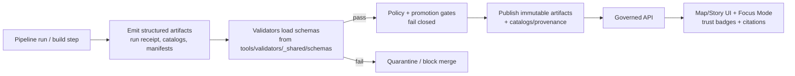

<!-- [KFM_META_BLOCK_V2]
doc_id: kfm://doc/62ebfb92-ab2f-4acd-916e-b00710789fca
title: Shared Validator Schemas
type: standard
version: v1
status: draft
owners: TBD
created: 2026-02-26
updated: 2026-02-26
policy_label: restricted
related:
  - tools/validators/_shared/schemas/
tags: [kfm, validators, schemas, json-schema]
notes:
  - Shared JSON Schemas used by KFM validators and CI gates (fail-closed).
[/KFM_META_BLOCK_V2] -->

<a id="top"></a>

# Shared Validator Schemas
Pinned **JSON Schemas** used by `tools/validators/**` to enforce **contract-first** and **fail-closed** validation across KFM structured artifacts.


<!-- TODO: add real CI badge once workflow path is known -->

**TL;DR:** If it’s a structured artifact that participates in **promotion**, **catalogs**, **provenance**, or **UI trust surfaces**, it should be schema-validated here (or referenced from here), and schema validation failures should block promotion/merge.

---

## Quick links
- [Purpose](#purpose)
- [Where this fits](#where-this-fits)
- [What belongs here](#what-belongs-here)
- [What must NOT go here](#what-must-not-go-here)
- [Schema registry](#schema-registry)
- [Naming and versioning](#naming-and-versioning)
- [Quality gates](#quality-gates)
- [How to add or change a schema](#how-to-add-or-change-a-schema)
- [Troubleshooting](#troubleshooting)
- [References](#references)

---

## Purpose
This directory exists to make schema contracts **first-class, reviewable, and testable** artifacts.

Schema validation is a hard gate for:
- **Catalog & provenance artifacts** (e.g., STAC, DCAT, PROV and KFM profiles)
- **Operational contracts** (e.g., run receipts/manifests, watcher registry entries)
- **Governed content structures** (e.g., Story Node metadata, UI/telemetry configs) — when schemas exist

> **NOTE**
> Schemas validate *shape and required fields*. They do **not** replace policy evaluation (rights, sensitivity, redaction obligations). Treat schemas as the “type system”; treat policy as the “authorization system”.

[Back to top](#top)

---

## Where this fits


**Design intent:** The UI and APIs only see artifacts that have passed schema validation + policy checks, so trust surfaces can confidently display “green” affordances.

[Back to top](#top)

---

## What belongs here
Directory documentation standard: **acceptable inputs**.

✅ Allowed:
- Versioned **JSON Schema** files (Draft 2020-12 unless explicitly justified otherwise)
  - Recommended extension: `*.schema.json`
- Small, representative example payloads for testing:
  - `examples/**` (valid/invalid fixtures)
- Optional: a schema registry file (if used by the tooling)
  - e.g., `schema-registry.(yml|json)` listing schema → validator mappings

[Back to top](#top)

---

## What must NOT go here
❌ Exclusions:
- Dataset outputs or large samples (belongs under `data/**`)
- Generated build artifacts / compiled bundles
- Credentials, tokens, secrets, or “real” environment configs
- Ad-hoc, one-off JSON that is not used as a contract
- Copies of upstream schemas without pinning rationale + version (if you must vendor, vendor explicitly)

> **WARNING**
> Treat this directory as production-critical: changes here can block promotions, break CI, or (worst case) weaken trust surfaces.

[Back to top](#top)

---

## Schema registry
This folder is **_shared_**: any validator can depend on the contracts defined here.

> **UNKNOWN (repo reality check)**
> The exact set of schemas present in this directory must be verified in the current repository.
> The table below lists *canonical contracts KFM expects to exist somewhere* and are commonly referenced by validation + promotion gates.

| Contract (example name) | What it validates | Typically used by | Breaking change rule |
|---|---|---|---|
| `run_receipt.v1.schema.json` | Per-run receipt (inputs, outputs, env, validation summary) | pipeline runners, audit tooling, CI gates | New **v2** file; keep v1 |
| `run_manifest.v1.schema.json` | Promotion/publish manifest for a dataset version | promotion tooling, release process | New **v2** file; keep v1 |
| `watcher.v1.schema.json` | Watchers registry entries (what to watch, schedules, signatures) | ops automation, freshness monitors | New **v2** file; keep v1 |
| `KFM_*_PROFILE.schema.json` | KFM profiles for STAC/DCAT/PROV (required fields + linkage) | catalog validators, link checkers | New **vN** profile; keep prior |

[Back to top](#top)

---

## Naming and versioning
**Goals:** stable references, safe evolution, and reproducible validation.

Recommended conventions:
- **Version in filename** for anything used by CI/promotion: `*.v1.schema.json`
- Keep old versions **side-by-side**; do not “edit in place” when a change is breaking.
- Prefer **additive** changes within a major version:
  - add optional fields
  - widen enums only when safe
  - avoid changing meaning of existing fields

> **TIP**
> When in doubt, treat schema changes as **breaking** and bump the major version. It’s cheaper than silently invalidating history.

[Back to top](#top)

---

## Quality gates
A schema PR is considered “done” when it meets these gates:

- [ ] Schema is valid JSON (no trailing commas)
- [ ] Uses a clear JSON Schema draft (`$schema`), preferably **2020-12**
- [ ] Includes stable `$id`, `title`, and `description`
- [ ] Deny-by-default posture where appropriate:
  - [ ] `additionalProperties: false` (or constrained)
  - [ ] explicit `required` fields
- [ ] Has **fixtures**:
  - [ ] at least one valid example
  - [ ] at least one invalid example that should fail for a meaningful reason
- [ ] Validator(s) reference the schema by path (deterministic, repo-local)
- [ ] CI runs schema validation and fails on violation
- [ ] Any schema change that affects promotion updates **promotion gates** and fixtures

[Back to top](#top)

---

## How to add or change a schema
1) **Decide change type**
- **Non-breaking:** extend within current `vN` (e.g., new optional property)
- **Breaking:** create `v(N+1)` file and migrate validators gradually

2) **Create / update the schema**
- Use Draft 2020-12 unless there’s a compatibility constraint.
- Prefer deny-by-default (`additionalProperties: false`) for governance-critical artifacts.

3) **Add examples**
- Add fixtures under `examples/` (or the repo’s chosen fixtures location).
- Include both a “happy path” and at least one “failure path”.

4) **Wire into validators**
- Update the relevant validator(s) under `tools/validators/**` to load the schema.
- Ensure the validator output is actionable (points to the failing path).

5) **Update registry docs**
- Update the [Schema registry](#schema-registry) table above (or a machine registry if present).

6) **Run the validation suite**
- Run the repo’s validation command(s) locally and in CI.
  - If the repo exposes a single entrypoint (recommended): `make validate` or equivalent.
  - Otherwise: run the validator package tests directly.

> **NOTE**
> Keep schema validation deterministic: do not rely on fetching remote `$ref`s at CI time unless the repo explicitly allows it and pins versions.

[Back to top](#top)

---

## Troubleshooting
- **“additionalProperties” failures:** an object includes keys not allowed by the schema.
  - Fix by updating the producer OR (if truly part of contract) introducing a new schema version.
- **Draft mismatch:** your validator library may default to an older draft.
  - Configure the validator to the draft used by the schema and ensure formats are supported.
- **Unhelpful error messages:** add `title`/`description` to subschemas and include examples to reproduce.

[Back to top](#top)

---

## References
- `docs/MASTER_GUIDE_v13.md` — canonical system + validation overview (if present)
- `docs/standards/` — KFM profiles for STAC/DCAT/PROV (if present)
- `policy/` — fail-closed promotion gates (OPA/Rego) (if present)
- `tools/validators/` — catalog, provenance, and link-check validators (this module)

<details>
<summary>Appendix: Minimal schema skeleton (example)</summary>

```json
{
  "$schema": "https://json-schema.org/draft/2020-12/schema",
  "$id": "https://example.invalid/schemas/my_contract.v1.json",
  "title": "My Contract (v1)",
  "type": "object",
  "additionalProperties": false,
  "required": ["id", "created_at"],
  "properties": {
    "id": { "type": "string", "pattern": "^[a-z0-9:_-]+$" },
    "created_at": { "type": "string", "format": "date-time" }
  }
}
```

</details>

[Back to top](#top)
