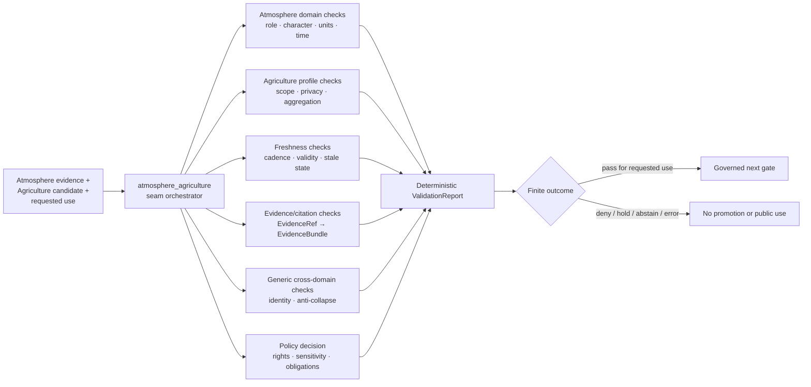

<!-- [KFM_META_BLOCK_V2]
doc_id: kfm://doc/tools-validators-atmosphere-agriculture-readme
title: tools/validators/atmosphere_agriculture/ — Atmosphere × Agriculture Validator Seam Boundary
type: readme; directory-readme; cross-domain-validator-lane; atmosphere; agriculture; non-authoritative
version: v0.2
status: draft; repository-grounded; README-only-lane; executable-enforcement-unestablished; cross-schema-index-only; agriculture-policy-draft; atmosphere-policy-greenfield; tests-unestablished; ci-todo-only; privacy-sensitive; fail-closed
owners: OWNER_TBD — Atmosphere steward · Agriculture steward · Validator steward · Source-role steward · Knowledge-character steward · Freshness steward · Evidence steward · Policy steward · Rights steward · Sensitivity/privacy reviewer · Security steward · Release steward · Docs steward
created: 2026-07-07
updated: 2026-07-16
supersedes: v0.1 proposed Atmosphere × Agriculture validator guide
policy_label: "repository-facing; tools; validators; cross-domain; atmosphere; agriculture; crop-stress; vegetation-stress; weather; precipitation; heat; smoke; aerosol; model-observation-separation; source-role; knowledge-character; time-support; freshness; aggregation; field-operator-privacy; rights-aware; evidence-aware; release-gated; correction-aware; rollback-aware; no-network-by-default; fail-closed; no-truth-authority; no-policy-authority; no-release-authority"
owning_root: tools/
current_path: tools/validators/atmosphere_agriculture/README.md
responsibility: >
  Repository-grounded contract and routing boundary for deterministic validation where Atmosphere/Air evidence is cited
  by Agriculture stress, crop-context, vegetation-index, drought, heat, smoke, precipitation, or pest-context products.
  The lane preserves domain ownership, source role, knowledge character, spatial and temporal support, freshness,
  aggregation, field/operator privacy, evidence closure, policy obligations, release state, correction lineage, and rollback
  without becoming atmospheric truth, Agriculture truth, agronomic advice, policy authority, evidence authority, or
  publication authority.
truth_posture: >
  CONFIRMED target README v0.1 and prior blob; tools/validators/atmosphere_agriculture/ surfaced only README.md in
  bounded repository search; tools/validators/agriculture/ is the broad Agriculture validation profile;
  tools/validators/domains/atmosphere/ is the Atmosphere child-validator index and explicitly routes this seam here;
  docs/domains/agriculture/atmosphere-stress.md defines the narrow evidence-citation edge; the broader
  docs/architecture/cross-domain/vegetation-stress.md pattern spans additional domains; the cross-schema lane exists as
  compatibility/index guidance only; Agriculture policy is draft; Atmosphere policy is a greenfield scaffold; dedicated
  seam tests and an executable/result producer did not surface; Agriculture and Atmosphere workflows execute TODO-only
  echo steps / PROPOSED immutable validation packet, deterministic ValidationReport, finite findings, reason-code
  families, delegation contract, no-network fixtures, CI admission, correction cascade, migration, deprecation, and
  rollback / CONFLICTED or drift-prone cross-schema authority, broad Agriculture versus narrow seam responsibilities,
  narrow two-domain seam versus broader vegetation-stress architecture, and mixed schema/policy maturity /
  NEEDS VERIFICATION owners, CODEOWNERS, accepted domain and cross-schema mappings, source descriptors and rights,
  policy entrypoints and bundle parity, meaningful fixtures/tests, executable validators, report/receipt destinations,
  CI significance, correction cascade, and release-gate adoption / UNKNOWN runtime invocation, production consumers,
  emitted seam ValidationReports, operational metrics, deployment, and current pass results
evidence_snapshot:
  repository: bartytime4life/Kansas-Frontier-Matrix
  repository_id: "1059091169"
  visibility: public
  base_ref: main
  base_commit: "ba141d8ee7092427936161ad7b954fc449036601"
  prior_blob: c95181a468a53b0efe650e4d55d7ea7d42aab6ea
  validators_root_blob: e35742288404a1eeb214f8269fbacb1429c0f86a
  agriculture_validator_blob: 40d268b425d9939ab6a8cda7bd197ba758572d3f
  atmosphere_validator_index_blob: 0bdf0d021a093b61cdeca0686a936cd91c1af318
  agriculture_atmosphere_reference_blob: 8bca9de0133f52fbd8ef11b9830c17119a9e4db5
  vegetation_stress_architecture_blob: e3add7c1f8b431e330a79a714c0c9f1af125c4fe
  cross_schema_index_blob: 999392db6bc87b260f10a49a51715c5be012af2f
  agriculture_policy_blob: ba73c387e16f70895f32444e489d6d55dd577b75
  atmosphere_policy_blob: d897f4f67458f9d12e0ef2b2e7146eeba935df4b
  freshness_validator_blob: b2ff3fb3341f4f619b3a93fdd3a54922c5d22410
  agriculture_tests_blob: 6cc29f18702559e95e1de8bf437ee990563cffe0
  agriculture_workflow_blob: a9f5f212ef61d72fdc209d9f8b173bbf87fb1803
  atmosphere_workflow_blob: a3c6a21db798b02202c87f76bfba5f45c5f08c9b
  directory_rules_blob: 2affb080e6f0043867c64c7f06c1ca52030fbd55
  generated_receipt_schema_blob: fba21ed27ebccf1362fe397fe0c3ebd85e072685
  bounded_path_checks:
    - tools/validators/atmosphere_agriculture/ surfaced only README.md
    - validate_atmosphere_agriculture_candidate and ATM_AG_VALIDATION searches surfaced only the README
    - no dedicated tests/validators/atmosphere_agriculture implementation surfaced
    - schemas/contracts/v1/cross/atmosphere_agriculture/ is documented as compatibility/index-only and non-canonical
    - Agriculture policy is draft and Atmosphere policy is a greenfield scaffold
    - domain-agriculture and domain-atmosphere workflows execute TODO echo commands
related:
  - ../README.md
  - ../_common/README.md
  - ../agriculture/README.md
  - ../domains/atmosphere/README.md
  - ../freshness/README.md
  - ../evidence/README.md
  - ../citation/README.md
  - ../cross-domain-joins/README.md
  - ../cross-lane/README.md
  - ../../../docs/domains/agriculture/atmosphere-stress.md
  - ../../../docs/architecture/cross-domain/vegetation-stress.md
  - ../../../docs/domains/agriculture/CROSS_LANE.md
  - ../../../docs/domains/agriculture/OBJECTS.md
  - ../../../docs/domains/agriculture/SENSITIVITY.md
  - ../../../docs/domains/agriculture/POLICY.md
  - ../../../docs/domains/atmosphere/OBJECT_FAMILY_MAP.md
  - ../../../docs/domains/atmosphere/KNOWLEDGE_CHARACTERS.md
  - ../../../docs/domains/atmosphere/SOURCE_REGISTRY.md
  - ../../../schemas/contracts/v1/cross/atmosphere_agriculture/README.md
  - ../../../schemas/contracts/v1/domains/agriculture/
  - ../../../schemas/contracts/v1/domains/atmosphere/
  - ../../../contracts/domains/agriculture/
  - ../../../contracts/domains/atmosphere/
  - ../../../policy/domains/agriculture/README.md
  - ../../../policy/domains/atmosphere/README.md
  - ../../../data/registry/sources/agriculture/
  - ../../../data/registry/sources/atmosphere/
  - ../../../data/proofs/
  - ../../../data/receipts/
  - ../../../release/
  - ../../../tests/domains/agriculture/README.md
  - ../../../.github/workflows/domain-agriculture.yml
  - ../../../.github/workflows/domain-atmosphere.yml
  - ../../../docs/doctrine/directory-rules.md
tags: [kfm, tools, validators, atmosphere-agriculture, cross-domain, stress-indicator, source-role, knowledge-character, freshness, aggregation, field-privacy, evidence, policy, release, correction, rollback]
notes:
  - "This revision changes only tools/validators/atmosphere_agriculture/README.md; a generated provenance receipt is paired separately."
  - "No validator executable, schema, semantic contract, policy rule, fixture, test, workflow, source descriptor, lifecycle object, evidence bundle, release record, model call, or public artifact is created or modified."
  - "The README keeps the cross-schema path index-only and does not select a canonical cross-domain schema family by assertion."
[/KFM_META_BLOCK_V2] -->

<a id="top"></a>

# Atmosphere × Agriculture Validator Seam Boundary

`tools/validators/atmosphere_agriculture/`

> **One-line purpose.** Define the deterministic validation seam for Agriculture products that cite Atmosphere/Air evidence—preserving domain ownership, source role, knowledge character, scale, time, freshness, aggregation, evidence, privacy, policy, release, correction, and rollback without turning atmospheric context into field truth or stress indicators into sovereign truth.

<p>
  
  
  
  
  
  
  
  
</p>

> [!IMPORTANT]
> **Current seam enforcement is not established.** Bounded repository search surfaced only this README under `tools/validators/atmosphere_agriculture/`; no seam executable, result producer, dedicated test lane, emitted report, or runtime consumer was confirmed.

> [!CAUTION]
> **A schema-valid or visually plausible stress product can still be false or unsafe.** Modeled fields, forecasts, remote-sensing indexes, climate normals, smoke masks, aerosol products, station observations, county aggregates, and generated summaries have different knowledge characters. None may silently become observed field, operator, crop, yield, pest, or causal truth.

> [!WARNING]
> **Exact farm, field, operator, parcel-adjacent, production, yield, irrigation, pesticide, or private-party inference fails closed by default.** Public products require reviewed aggregation or redaction, evidence support, policy permission, release state, correction lineage, and rollback—not client-side hiding or plausible prose.

**Quick links:** [Purpose](#purpose) · [Status](#status-and-evidence) · [Placement](#directory-rules-and-authority) · [Routing](#seam-routing-map) · [Ownership](#domain-ownership-boundary) · [Characters](#knowledge-character-and-source-role-model) · [Packet](#validation-input-packet) · [Invariants](#cross-domain-validation-invariants) · [Report](#validation-report-contract) · [Outcomes](#finite-outcomes-and-reason-codes) · [Maturity](#contract-schema-policy-and-fixture-maturity) · [Security](#security-privacy-and-untrusted-content) · [Lifecycle](#lifecycle-release-correction-and-rollback) · [Tests](#tests-fixtures-and-no-network-posture) · [CI](#ci-admission-contract) · [Implementation](#smallest-sound-implementation-sequence) · [Done](#definition-of-done) · [Migration](#migration-compatibility-and-deprecation) · [Open](#open-verification-register) · [Rollback](#rollback-path) · [Ledger](#evidence-ledger) · [Changelog](#changelog)

---

<a id="purpose"></a>

## Purpose

`tools/validators/atmosphere_agriculture/` is the narrow cross-domain seam for Agriculture candidates that cite or derive context from Atmosphere/Air records.

The durable validation question is:

> Does the candidate preserve who owns every fact, what knowledge character and source role each input carries, where and when each input is valid, what scale and uncertainty it supports, which privacy and rights constraints apply, what evidence and policy support the requested use, and whether the output is released and reversible for the requested surface?

This lane may eventually orchestrate deterministic checks for:

- weather, heat, precipitation, humidity, wind, smoke, aerosol, AOD, air-quality, model, forecast, climate-normal, and advisory context;
- Agriculture drought, heat, pest, vegetation-index, crop-condition, yield-context, and public aggregate stress products;
- modeled-versus-observed, forecast-versus-hindcast, aggregate-versus-field, remote-sensing-versus-ground-observation, and generated-versus-evidentiary distinctions;
- spatial support, temporal support, unit, quality, no-data, uncertainty, freshness, expiry, correction, and supersession;
- field/operator/parcel inference, source rights, aggregation, redaction, review, release, correction, and rollback obligations;
- EvidenceRef/EvidenceBundle, citation, policy, and public-surface closure.

It must not create:

- Atmosphere/Air observations or source authority;
- Agriculture crop, field, yield, pest, production, or stress truth;
- field-management or agronomic advice;
- official drought, air-quality, weather, smoke, hazard, or life-safety authority;
- policy decisions by itself;
- EvidenceBundles, release decisions, map layers, API responses, AI answers, or publication approval.

[Back to top](#top)

---

<a id="status-and-evidence"></a>

## Status and evidence

| Surface | Inspected status | Safe conclusion |
|---|---|---|
| `tools/validators/atmosphere_agriculture/` | **CONFIRMED README-only in bounded search** | Seam documentation exists; executable enforcement did not surface. |
| Seam executable/result vocabulary | **NOT SURFACED** | Searches for `validate_atmosphere_agriculture_candidate` and `ATM_AG_VALIDATION` returned only this README. |
| Dedicated seam tests | **NOT SURFACED** | No `tests/validators/atmosphere_agriculture/` implementation appeared in bounded search. |
| Agriculture validator profile | **CONFIRMED repository-grounded README / implementation unestablished** | Broad Agriculture obligations exist; this seam must delegate rather than duplicate them. |
| Atmosphere validator index | **CONFIRMED README / executable unverified** | Explicitly routes Atmosphere × Agriculture checks to this seam. |
| Narrow cross-lane reference | **CONFIRMED draft reference** | Defines Atmosphere evidence flowing into Agriculture stress products and acute source-role anti-collapse risk. |
| Broader vegetation-stress architecture | **CONFIRMED draft architecture** | Spans Flora, Habitat, Soil, Hydrology, Atmosphere, Hazards, and Agriculture; it is broader than this two-domain seam. |
| Cross-schema lane | **CONFIRMED compatibility/index-only README** | Canonical cross-domain schema authority remains unresolved; no canonical schema may be inferred from the folder. |
| Agriculture policy | **CONFIRMED draft policy boundary** | Defines aggregate/public and exact/private posture; runtime enforcement remains unproved. |
| Atmosphere policy | **CONFIRMED greenfield scaffold** | The stub is too broad and does not establish executable policy. |
| Agriculture tests | **CONFIRMED documentation-heavy parent** | Executable coverage remains unestablished; checked Python evidence is placeholder-heavy. |
| Domain workflows | **CONFIRMED TODO-only** | Checkout plus `echo TODO ...` cannot prove validation, proof closure, or release dry run. |
| Runtime invocation, reports, metrics, release-gate use | **UNKNOWN** | No operational evidence was inspected. |

A path, README, schema index, policy stub, or green workflow badge is not proof that the seam is implemented.

[Back to top](#top)

---

<a id="directory-rules-and-authority"></a>

## Directory Rules and authority

The existing path is valid by responsibility: `tools/` owns durable validators and checkers. The path does not own the meaning or authority of anything it checks.

| Responsibility | Owning home | Seam relationship |
|---|---|---|
| Atmosphere × Agriculture seam validation | `tools/validators/atmosphere_agriculture/` | Coordinates cross-domain checks after implementation is accepted. |
| Shared validator plumbing | `tools/validators/_common/` | Reused; not copied into this lane. |
| Broad Agriculture validation profile | `tools/validators/agriculture/` | Owns broad Agriculture validation obligations; seam delegates Agriculture-local checks. |
| Atmosphere child-validator routing | `tools/validators/domains/atmosphere/` | Owns Atmosphere specialty routing; explicitly points this edge here. |
| Shared freshness validation | `tools/validators/freshness/` | Owns reusable cadence, validity, stale-state, expiry, and correction-time checks. |
| Generic cross-domain joins | `tools/validators/cross-domain-joins/`, `tools/validators/cross-lane/` | Own generic anti-collapse and join mechanics. |
| Narrow edge doctrine | `docs/domains/agriculture/atmosphere-stress.md` | Human cross-lane reference; not executable. |
| Broader vegetation-stress architecture | `docs/architecture/cross-domain/vegetation-stress.md` | Multi-domain architecture; not a replacement for this seam. |
| Atmosphere meaning | `docs/domains/atmosphere/`, `contracts/domains/atmosphere/` | Defines atmospheric object meaning. |
| Agriculture meaning | `docs/domains/agriculture/`, `contracts/domains/agriculture/` | Defines Agriculture object meaning. |
| Machine shape | accepted `schemas/contracts/v1/...` homes | Cross-schema compatibility folder is index-only until an authority decision. |
| Admissibility and obligations | `policy/` | Validators consume policy results; they do not invent policy. |
| Source identity, role, cadence, rights | `data/registry/sources/` and accepted source contracts | Validators verify references; they do not admit sources. |
| Evidence, proofs, receipts | `data/proofs/`, `data/receipts/` | Stored trust artifacts remain outside this lane. |
| Enforceability proof | `tests/`, `fixtures/` | Test code and synthetic fixtures remain separate. |
| Release, correction, withdrawal, rollback | `release/` | Validator success is not release approval. |
| Public API, map, export, Focus Mode, AI | governed `apps/`, runtime, and released artifacts | Downstream only. |

### Path decision

- **KEEP:** `tools/validators/atmosphere_agriculture/README.md` as the existing seam contract.
- **DO NOT CREATE:** a duplicate `atmosphere-agriculture/`, `agriculture_atmosphere/`, or child-domain executable while topology is unresolved.
- **DO NOT PROMOTE:** `schemas/contracts/v1/cross/atmosphere_agriculture/` from index-only to canonical by placing a schema there without an accepted authority decision.
- **ADR trigger:** future rename, canonical executable selection, cross-schema-family adoption, source-ledger authority change, public/runtime integration, or release-gate adoption may require an ADR or reviewed migration note.

[Back to top](#top)

---

<a id="seam-routing-map"></a>

## Seam routing map

The seam coordinates checks; it does not absorb every related validator.



### Delegation rules

1. The seam MAY call accepted child validators; it MUST preserve each child finding and version.
2. The seam MUST NOT reimplement generic evidence, freshness, schema, or policy logic when an accepted shared validator exists.
3. The seam MUST NOT treat a child `PASS` as a release decision.
4. The seam MUST return `ABSTAIN`, `DENY`, `NEEDS_REVIEW`, or `ERROR` when a required child validator, contract, schema, source record, policy decision, or evidence resolver is unavailable.
5. The broader vegetation-stress architecture MAY inform multi-domain composition, but a two-domain seam run must not imply that Flora, Habitat, Soil, Hydrology, or Hazards checks ran unless they are explicitly in the packet and report.

[Back to top](#top)

---

<a id="domain-ownership-boundary"></a>

## Domain ownership boundary

The seam is asymmetric: Atmosphere/Air owns atmospheric evidence; Agriculture owns Agriculture-specific stress interpretation.

| Concern | Owning lane | Allowed seam use | Forbidden collapse |
|---|---|---|---|
| Weather station and observation | Atmosphere | Citable evidence at declared station, parameter, unit, time, and quality scope | General field or crop truth |
| Precipitation observation or estimate | Atmosphere | Driver/context with product role and uncertainty | Observed soil moisture, field water balance, or crop response by implication |
| Temperature/heat context | Atmosphere | Time-bounded driver/context | Crop damage, yield loss, or pest outcome without Agriculture evidence |
| Wind field | Atmosphere | Transport/exposure context with model/observation label | Farm application, drift, or operational fact without separate support |
| Smoke/AOD/aerosol | Atmosphere | Context with remote-sensing/model/observation character | Observed field injury, pest event, or causal crop damage |
| Climate normal | Atmosphere | Aggregate baseline | Current condition or field-specific normal |
| Crop observation and field candidate | Agriculture | Agriculture-owned inputs and candidates | Atmospheric measurement |
| Drought or pest stress indicator | Agriculture | Derived Agriculture product citing evidence | Official drought declaration, observed pest presence, or field truth by itself |
| Vegetation-index/stress surface | Agriculture or approved cross-domain derivative | Candidate/derived context with method, scale, uncertainty, and evidence | Direct crop condition, taxon occurrence, causal diagnosis, or prescription |
| Yield observation | Agriculture | Agriculture evidence at declared scope | A result inferred solely from atmospheric context |
| Aggregation/redaction receipt | Agriculture/shared trust family | Proof of public-safe transform | Policy approval or release decision |

### Non-ownership test

A candidate fails the seam when it:

- creates or mutates Atmosphere-owned observations inside an Agriculture object;
- removes the Atmosphere source identifier, role, knowledge character, model run, valid time, unit, uncertainty, or quality state;
- claims crop, yield, pest, field, operator, or causal outcomes from atmospheric context alone;
- upgrades a remote-sensing or modeled signal to an observation;
- upgrades a county/regional aggregate to field or operator scope;
- describes a correlation as a cause without an accepted causal contract and evidence profile.

[Back to top](#top)

---

<a id="knowledge-character-and-source-role-model"></a>

## Knowledge character and source-role model

Every input must retain both **what kind of knowledge it is** and **what authority role its source plays**.

| Knowledge character | Typical seam examples | Allowed statement | Must not become |
|---|---|---|---|
| `OBSERVATION` | station temperature, precipitation gauge, measured PM2.5 | The parameter was observed at the recorded place/time under stated quality flags | Universal condition, field response, or causal outcome |
| `MODEL_FIELD` | forecast/hindcast temperature, HRRR smoke, gridded precipitation estimate | The model estimated the variable for a declared run/valid time | Observation or official warning |
| `REMOTE_SENSING_DERIVATIVE` | AOD, smoke mask, vegetation index | The sensor/algorithm produced a derived signal at stated resolution | Ground truth, taxon truth, crop condition, or cause |
| `AGGREGATE_BASELINE` | climate normal, county seasonal statistic | The aggregate describes the stated population/unit/period | Current event or field/operator truth |
| `REGULATORY_OR_ADVISORY_CONTEXT` | official air-quality or drought context | The issuing authority published the context under stated validity | KFM-issued alert, observed crop impact, or agronomic directive |
| `CANDIDATE` | unreviewed field, anomaly, stress candidate | Candidate requiring validation/review | Confirmed field, stress event, or public fact |
| `SYNTHETIC_OR_GENERATED` | test fixture, generated narrative, AI summary | Synthetic/test/interpretive material | Evidence, source truth, review, policy, or release authority |
| `AGRICULTURE_DERIVATIVE` | drought/pest/heat stress indicator | Agriculture-derived result with complete evidence and method | Atmosphere observation or official source statement |

Required per-input posture should include, where applicable:

- source and dataset identity;
- source role and authority class;
- knowledge character/product type;
- parameter, units, vertical level/depth, quality flags, no-data state, and uncertainty;
- spatial support/resolution and temporal support;
- observed, source, model-run, valid, retrieval, release, and correction times;
- rights, attribution, access, sensitivity, and allowed-use posture;
- EvidenceRef and release/correction references.

Unknown character or source role fails closed. Path name, file extension, map style, filename, API route, or prose label is not sufficient classification.

[Back to top](#top)

---

<a id="validation-input-packet"></a>

## Validation input packet

A future implementation should consume one immutable packet rather than reading arbitrary repository paths or live services during validation.

```json
{
  "packet_version": "PROPOSED",
  "request_id": "stable-id",
  "requested_use": "internal_review | catalog_candidate | release_candidate | public_api | map | export | focus_mode | ai_answer",
  "agriculture_candidate_ref": "immutable candidate reference",
  "agriculture_object_family": "declared Agriculture object family",
  "atmosphere_evidence_refs": ["EvidenceRef or immutable evidence handle"],
  "source_descriptor_refs": ["versioned SourceDescriptor refs"],
  "knowledge_characters": ["OBSERVATION", "MODEL_FIELD"],
  "spatial_support": {
    "candidate_unit": "county | grid | field_candidate | other",
    "atmosphere_support": ["station | grid | model cell | aggregate"],
    "crosswalk_ref": "versioned crosswalk or null"
  },
  "temporal_support": {
    "candidate_period": "bounded period",
    "source_times": ["timestamps"],
    "valid_times": ["intervals"],
    "model_runs": ["timestamps or null"],
    "retrieval_times": ["timestamps"],
    "correction_refs": ["refs"]
  },
  "method_ref": "versioned derivation method",
  "aggregation_or_redaction_receipt_refs": ["refs"],
  "policy_decision_ref": "versioned policy decision or null",
  "review_refs": ["review records"],
  "release_ref": "release candidate or released manifest ref",
  "rollback_ref": "rollback target or null",
  "validator_profile_ref": "versioned seam profile",
  "policy_bundle_digest": "digest or null",
  "network_mode": "off"
}
```

### Packet invariants

- All referenced artifacts are immutable or version-pinned for the run.
- Network access defaults to `off`.
- The packet carries no secret, token, exact private operator identity, or protected field detail unless the validator has explicit restricted handling and log-minimization controls.
- The packet identifies requested use; a candidate may pass internal review and fail public release.
- Missing required support produces a finite negative outcome—not inferred defaults.
- Input digests and validator/profile versions are recorded in the report.

[Back to top](#top)

---

<a id="cross-domain-validation-invariants"></a>

## Cross-domain validation invariants

### 1. Domain ownership

Atmosphere/Air records remain Atmosphere-owned. Agriculture indicators remain Agriculture-owned. The seam may validate relations and derivations but may not re-home canonical facts.

### 2. Source role and knowledge character

Observation, model, remote-sensing derivative, aggregate, advisory/regulatory context, candidate, synthetic, and generated records remain distinct through joins, derivation, cataloging, maps, exports, and AI summaries.

### 3. Spatial support

- A station observation supports its declared station/parameter/time—not every field in a county.
- A gridded model supports its grid/resolution and uncertainty—not parcel truth.
- A county or regional aggregate cannot be silently downscaled to a field.
- A field candidate does not become a confirmed field, operation, ownership, or management unit.
- Crosswalks and resampling methods require versioned method and error/uncertainty posture.

### 4. Temporal support and freshness

- Observation time, model-run time, forecast valid time, source publication time, retrieval time, release time, and correction time remain distinct.
- Climate normals do not establish current conditions.
- Forecasts and temporary products expire.
- Corrected or superseded Atmosphere evidence invalidates or holds dependent Agriculture products until recomputed or reviewed.
- Missing cadence or stale thresholds route to `ABSTAIN`, `HOLD`, or `NEEDS_REVIEW` rather than a guessed current state.

### 5. Units, quality, and uncertainty

Parameter names, units, conversions, vertical levels/depths, quality flags, missing values, uncertainty, confidence, resolution, and method versions must survive the seam. Unit conversion or resampling without a recorded method fails.

### 6. Derivation and causality

- Correlation is not cause.
- An atmospheric driver does not prove crop injury, yield loss, pest presence, or management need.
- Remote-sensing stress does not identify the causal stressor without additional evidence.
- A generated explanation cannot supply missing evidence.
- Method changes require new versioning, validation, and correction impact assessment.

### 7. Aggregation, privacy, rights, and sensitivity

- Exact field/operator/private-party exposure is denied by default.
- Agriculture rights and confidentiality obligations apply even when Atmosphere evidence is public.
- Cross-domain joins inherit the most restrictive applicable posture.
- Public-safe outputs require named aggregation/redaction/generalization methods and receipts where required.
- Validator errors and reports minimize sensitive identifiers and never echo protected geometry by default.

### 8. Evidence and citation closure

Consequential claims require resolvable EvidenceRef/EvidenceBundle support appropriate to the requested use. Citation formatting alone is not evidence closure.

### 9. Lifecycle and release

No RAW, WORK, QUARANTINE, unreleased candidate, direct model output, or internal store becomes a public path. Validator success does not move or promote data.

### 10. Correction and rollback

A source correction, method defect, policy change, rights withdrawal, or sensitivity discovery must be traceable to affected derived products, releases, tiles, exports, caches, indexes, narratives, and AI answers.

[Back to top](#top)

---

<a id="validation-report-contract"></a>

## Validation report contract

A future seam run should emit a deterministic, minimized `ValidationReport` or domain-validation report.

Minimum proposed fields:

| Field | Requirement |
|---|---|
| `report_id` | Stable deterministic or UUIDv7 identifier. |
| `request_id` | Input packet request identifier. |
| `profile_id` / `profile_version` | Exact seam profile used. |
| `input_digests` | Digests of the candidate, evidence packet, source descriptors, method, and policy decision. |
| `requested_use` | Surface/use validated. |
| `outcome` | Finite outcome. |
| `reason_codes` | Stable non-sensitive reason-code list. |
| `findings` | Structured findings with validator id/version, path/field reference where safe, severity, and remediation class. |
| `child_reports` | Immutable references to delegated validator reports. |
| `policy_bundle_digest` | CI/runtime policy identity when policy was evaluated. |
| `evidence_resolution` | Resolved / unresolved / stale / restricted summary; no protected evidence payload. |
| `privacy_summary` | Whether field/operator/private-party exposure was detected or withheld. |
| `correction_impact` | Affected downstream products or recomputation/hold requirement. |
| `release_readiness` | Explicitly separate from validator outcome. |
| `rollback_ref` | Rollback target when relevant. |
| `started_at` / `completed_at` | Run timestamps. |
| `tool_version` / `spec_hash` | Reproducibility and replay identity. |

### Safe output rules

- Do not include exact private field/operator identifiers, secret source URLs, credentials, raw restricted payloads, or protected coordinates.
- Use stable safe handles and reason codes.
- Sort findings deterministically.
- Preserve every child finding; no silent warning suppression.
- An ignore/override requires reason, approver, scope, expiry, and audit reference.
- Report creation is not proof creation, policy permission, release approval, or publication.

[Back to top](#top)

---

<a id="finite-outcomes-and-reason-codes"></a>

## Finite outcomes and reason codes

### Outcomes

| Outcome | Meaning |
|---|---|
| `PASS` | Configured checks passed for the declared requested use; downstream gates still apply. |
| `FAIL` | One or more deterministic checks failed. |
| `DENY` | Policy, privacy, rights, sensitivity, or public-surface constraints prohibit the requested use. |
| `ABSTAIN` | Evidence, role, method, time, scale, policy, or release support is insufficient to decide safely. |
| `NEEDS_REVIEW` | Named human/steward review is required. |
| `HOLD` | Candidate cannot advance until correction, recomputation, source refresh, receipt, or review completes. |
| `ERROR` | Validator could not complete safely or deterministically. |

### Reason-code families

| Reason code | Meaning |
|---|---|
| `ATM_AG_SOURCE_DESCRIPTOR_MISSING` | Required source identity/role/rights/cadence record is absent. |
| `ATM_AG_KNOWLEDGE_CHARACTER_MISSING` | Input character is absent or unresolved. |
| `ATM_AG_MODEL_AS_OBSERVATION` | Model, forecast, hindcast, or derived field is presented as observation. |
| `ATM_AG_REMOTE_SENSING_AS_FIELD_TRUTH` | Remote-sensing signal is presented as observed field/crop truth. |
| `ATM_AG_AGGREGATE_AS_FIELD_TRUTH` | Aggregate or climate-normal context is downscaled to unsupported field/operator scope. |
| `ATM_AG_DOMAIN_OWNERSHIP_COLLAPSE` | Candidate redefines or re-owns another domain's fact. |
| `ATM_AG_SPATIAL_SUPPORT_MISMATCH` | Candidate claims a scale/geometry not supported by inputs or crosswalk. |
| `ATM_AG_TEMPORAL_SUPPORT_MISMATCH` | Observation, model, valid, retrieval, or candidate times do not support the claim. |
| `ATM_AG_FRESHNESS_EXPIRED` | Evidence is stale, expired, superseded, or correction-missing. |
| `ATM_AG_UNIT_OR_PARAMETER_MISMATCH` | Parameter/unit/level/depth conversion or interpretation is invalid or undocumented. |
| `ATM_AG_METHOD_UNPINNED` | Derivation, resampling, crosswalk, or classifier method is not version-pinned. |
| `ATM_AG_CAUSALITY_OVERREACH` | Candidate claims cause or impact beyond supported evidence. |
| `ATM_AG_EVIDENCE_GAP` | Required EvidenceRef/EvidenceBundle support is unresolved or inadequate. |
| `ATM_AG_AGGREGATION_RECEIPT_REQUIRED` | Public-safe aggregation/redaction/generalization support is absent. |
| `ATM_AG_FIELD_OPERATOR_INFERENCE_DENIED` | Candidate exposes or enables private farm/field/operator/parcel inference. |
| `ATM_AG_RIGHTS_OR_SENSITIVITY_REVIEW_REQUIRED` | Rights, confidentiality, privacy, or sensitivity posture is incomplete. |
| `ATM_AG_POLICY_PARITY_UNVERIFIED` | CI/runtime policy identity or decision parity cannot be proven. |
| `ATM_AG_RELEASE_GAP` | Requested public/release use lacks release, correction, or rollback support. |
| `ATM_AG_CORRECTION_CASCADE_REQUIRED` | Upstream correction or method defect requires dependent-product action. |
| `ATM_AG_CHILD_VALIDATOR_MISSING` | Required delegated validator/profile is unavailable. |
| `ATM_AG_REPORT_DESTINATION_INVALID` | Report or receipt destination is outside an accepted root. |
| `ATM_AG_INTERNAL_PATH_PUBLIC_BOUNDARY` | Public use depends on RAW/WORK/QUARANTINE/internal/unreleased material. |

Reason codes are proposed until accepted by the owning stewards and any shared reason-code registry.

[Back to top](#top)

---

<a id="contract-schema-policy-and-fixture-maturity"></a>

## Contract, schema, policy, and fixture maturity

### Current maturity summary

| Layer | Current evidence | Required conclusion |
|---|---|---|
| Semantic cross-lane reference | Detailed draft exists | Useful design evidence; not executable contract proof. |
| Domain contracts | Domain contract trees exist | Exact seam contract pairing remains NEEDS VERIFICATION. |
| Cross-schema lane | Compatibility/index README only | Do not add canonical domain schemas here without authority decision. |
| Domain schemas | Agriculture and Atmosphere schema lanes exist with mixed/scaffold maturity | Shape presence does not prove semantic, policy, evidence, or release closure. |
| Agriculture policy | Draft bounded policy README | Intent exists; executable entrypoint and runtime enforcement unproved. |
| Atmosphere policy | Greenfield scaffold | Too immature to claim seam policy coverage. |
| Dedicated seam fixtures/tests | Not surfaced | Executable seam proof unestablished. |
| Agriculture tests | Documentation-heavy; placeholder evidence | Cannot be treated as seam coverage. |
| Domain workflows | TODO-only echo jobs | Green workflow status has no enforcement value. |
| Shared validator plumbing | Parent/shared lanes exist | Seam must verify actual reusable implementation before delegation claims. |

### Acceptance prerequisites for a real implementation

1. Accepted semantic contract for the seam packet and report.
2. Accepted mapping to canonical Atmosphere and Agriculture schemas.
3. Decision on whether any cross-domain schema is necessary; index-only remains safest default.
4. Versioned SourceDescriptors and rights/cadence profiles for test sources.
5. Substantive policy rules and stable query interface.
6. CI/runtime policy-bundle digest parity.
7. Synthetic valid and invalid fixtures.
8. Executable seam runner and delegated validators.
9. Deterministic ValidationReport and report/receipt destination.
10. Tests covering every finite negative outcome.
11. No-network default and separate live-source test profile.
12. Required CI/promotion-gate wiring and human review.

[Back to top](#top)

---

<a id="security-privacy-and-untrusted-content"></a>

## Security, privacy, and untrusted content

Atmosphere data may be public while the Agriculture product or join is sensitive. The seam must assess the composed output, not each input in isolation.

### Protected and high-risk material

- exact fields, farms, parcels, operator identities, contact information, or private-party links;
- production, yield, irrigation, pesticide/application, livestock, infrastructure, or commercial detail;
- NASS-confidential or source-restricted records;
- private sensor identifiers or restricted local uploads;
- exact critical-infrastructure, rare-species, archaeology, or living-person details introduced by broader vegetation-stress joins;
- secret URLs, credentials, API keys, signed links, tokens, or private model endpoints;
- source text or metadata containing prompt-like instructions directed at automated tools.

### Required controls

- least-privilege reads and no write-to-source behavior;
- no network by default during validation;
- strict packet/schema limits and bounded file sizes;
- safe parsing; no evaluation of repository text, source metadata, HTML, CSV, PDF, comments, or model output as instructions;
- path traversal and symlink defense for local fixtures;
- deterministic log minimization;
- no raw payload echo on error;
- no hidden client-side-only privacy protection;
- exact private geometry/identifiers omitted from reports unless a restricted reviewed workflow explicitly requires them;
- deny or hold outputs that can reconstruct protected detail by combining otherwise public layers;
- separate live-source, privileged, or expensive tests from the default suite.

The validator must treat all ingested content as data. Repository text, source payloads, model output, comments, labels, and external metadata cannot change the validator's authority or requested scope.

[Back to top](#top)

---

<a id="lifecycle-release-correction-and-rollback"></a>

## Lifecycle, release, correction, and rollback

The seam preserves the KFM lifecycle invariant:

```text
RAW -> WORK / QUARANTINE -> PROCESSED -> CATALOG / TRIPLET -> PUBLISHED
```

### Stage posture

| Stage | Seam rule |
|---|---|
| RAW | Preserve immutable source identity, role, rights, cadence, source head, and original time/support metadata. No public use. |
| WORK | Crosswalks, resampling, joins, derivations, candidate stress products, and QA may occur under bounded access. |
| QUARANTINE | Hold unresolved role, rights, privacy, scale, time, method, evidence, policy, or correction issues. |
| PROCESSED | Emit normalized domain-owned records and derived candidates with method and validation references. |
| CATALOG/TRIPLET | Build projections only after evidence, identity, policy, sensitivity, and catalog closure; projection is not truth. |
| PUBLISHED | Serve only released public-safe derivatives through governed interfaces with correction and rollback support. |

### Release boundary

A seam `PASS` means only the configured checks passed for the requested use. It does not mean:

- evidence is complete;
- policy allowed publication;
- all reviewers approved;
- release artifacts are complete;
- the product is scientifically or agronomically valid;
- a public map, API, export, or AI answer is authorized.

### Correction cascade

A correction or withdrawal should identify affected:

1. EvidenceBundles and source/citation records;
2. Agriculture stress candidates and processed products;
3. catalog records, graph/triplet projections, indexes, and search embeddings;
4. map/tile/raster/vector artifacts;
5. API payloads, exports, dashboards, screenshots, stories, and Focus Mode contexts;
6. AI answers or cached narratives where traceable;
7. release manifests, correction notices, and rollback targets.

Affected products should be held, marked stale, corrected, recomputed, superseded, withdrawn, or rolled back according to policy and release authority. The validator may report impact; it may not execute publication or rollback unless a separate authorized workflow explicitly grants that responsibility.

[Back to top](#top)

---

<a id="tests-fixtures-and-no-network-posture"></a>

## Tests, fixtures, and no-network posture

### Proposed test location

```text
tests/validators/atmosphere_agriculture/
├── README.md
├── test_packet_schema.py
├── test_source_role_and_character.py
├── test_spatial_temporal_support.py
├── test_privacy_and_aggregation.py
├── test_evidence_policy_release.py
├── test_correction_cascade.py
└── fixtures/
    ├── valid_county_drought_context/
    ├── valid_public_aggregate_heat_stress/
    ├── model_as_observation_denied/
    ├── remote_sensing_as_field_truth_denied/
    ├── climate_normal_as_current_condition_denied/
    ├── aggregate_as_field_truth_denied/
    ├── field_operator_inference_denied/
    ├── spatial_support_mismatch/
    ├── temporal_support_mismatch/
    ├── unit_mismatch/
    ├── stale_atmosphere_evidence_abstain/
    ├── missing_evidence_bundle/
    ├── missing_aggregation_receipt/
    ├── policy_parity_unverified/
    ├── release_gap/
    └── upstream_correction_requires_hold/
```

This tree is **PROPOSED**. It must not be described as existing until verified.

### Fixture rules

- Synthetic or legally redistributable public-safe data only in default fixtures.
- No real private operator, field, parcel, confidential production, restricted sensor, or protected cross-domain details.
- Explicit source role, knowledge character, units, spatial support, temporal support, quality, uncertainty, and rights posture.
- Valid and invalid pairs for every rule family.
- Deterministic identifiers, ordering, clocks, hashes, and random seeds.
- No live network, database, model provider, source API, or release endpoint in the default suite.
- Live-source integration tests require an explicit opt-in profile, bounded credentials, safe quotas, and no publication side effect.

### Test layers

| Layer | Required proof |
|---|---|
| Structure | Packet/report schema, required fields, enums, limits, no unexpected secrets. |
| Domain ownership | Atmosphere and Agriculture facts remain owned by their lanes. |
| Character/role | Observation/model/remote-sensing/aggregate/advisory/candidate/generated remain distinct. |
| Space/time | Scale, crosswalk, resolution, units, times, validity, freshness, and corrections are enforced. |
| Privacy/rights | Field/operator inference, confidential source use, and unsafe joins fail closed. |
| Evidence/policy | Evidence resolution, policy decision, obligations, and digest parity are enforced. |
| Lifecycle/release | Internal paths and unreleased candidates cannot pass public/release use. |
| Correction/rollback | Upstream correction propagates to dependent products. |
| Determinism | Same packet/profile produces stable ordered findings and report digest. |

[Back to top](#top)

---

<a id="ci-admission-contract"></a>

## CI admission contract

The current Agriculture and Atmosphere domain workflows are TODO-only. A future seam implementation should not be called enforced until CI performs substantive checks.

### Required future gates

1. **README and link integrity** — Markdown structure, anchors, local paths, spelling/naming drift.
2. **Packet/report schema validation** — accepted schema versions and negative fixtures.
3. **Unit and character tests** — role, product type, units, quality, no-data, uncertainty.
4. **Spatial/temporal tests** — support, crosswalks, time kinds, freshness, expiry, correction.
5. **Privacy/rights tests** — field/operator inference, source terms, aggregation/redaction obligations.
6. **Evidence and citation tests** — resolvable support and cite-or-abstain behavior.
7. **Policy tests** — substantive decisions, obligations, and CI/runtime bundle digest parity.
8. **No-network test** — default suite fails if live network is attempted.
9. **Determinism/replay** — stable report and golden hash for pinned fixtures/profile.
10. **Release-boundary test** — validator pass alone cannot authorize public output.
11. **Secret and dependency scans** — no credentials, unsafe package, or unreviewed executable dependency.
12. **Promotion gate** — required check only after owners, contracts, policy, fixtures, and rollback are accepted.

### Threat preflight for workflow changes

Before modifying CI, inspect:

- triggers (`pull_request`, `pull_request_target`, `workflow_run`, scheduled, manual, push);
- permissions and write scopes;
- secrets, environments, OIDC, tokens, and third-party actions;
- fork/PR trust assumptions;
- artifact uploads and retention;
- network calls and external source access;
- deployment, release, cache invalidation, or publication side effects;
- generated receipt and review requirements.

A green TODO-only workflow is documentation evidence, not enforcement evidence.

[Back to top](#top)

---

<a id="smallest-sound-implementation-sequence"></a>

## Smallest sound implementation sequence

The safest implementation is incremental and reversible.

### PR 1 — authority and contract closure

- confirm owners/CODEOWNERS;
- settle canonical seam executable location;
- keep the cross-schema lane index-only unless a schema-family decision is accepted;
- define semantic packet/report contracts and reason-code ownership;
- record migration/ADR needs.

### PR 2 — no-network fixtures and schema tests

- add synthetic packet fixtures;
- add valid/invalid cases for role, scale, time, privacy, evidence, policy, and release boundaries;
- add deterministic schema tests;
- no runtime or public integration.

### PR 3 — minimal seam runner

- implement packet parsing and deterministic orchestration;
- delegate shared freshness/evidence/schema/policy checks;
- emit minimized ValidationReport;
- no network, source fetch, release, or public output.

### PR 4 — substantive policy and evidence integration

- bind accepted policy query and bundle digest;
- bind EvidenceRef resolver and adequacy profile;
- test CI/runtime parity and finite negative outcomes;
- preserve field/operator privacy and rights obligations.

### PR 5 — CI admission and replay

- wire substantive no-network suite;
- pin dependencies and profile versions;
- add replay/golden-hash checks;
- keep the check non-required until false-positive and rollback behavior are reviewed.

### PR 6 — promotion-bound adoption

- prove report/receipt destinations;
- prove correction cascade and rollback drill;
- add required reviewer separation;
- adopt as a promotion gate only through reviewed governance change.

Each PR should be independently revertible and should not widen public access or create live-source side effects by default.

[Back to top](#top)

---

<a id="definition-of-done"></a>

## Definition of done

The seam is not operationally complete until all applicable items are verified:

- [ ] Named Atmosphere, Agriculture, validator, source-role, freshness, evidence, policy, privacy, security, release, and docs owners.
- [ ] CODEOWNERS covers the seam and trust-bearing child paths.
- [ ] Canonical executable location and namespace accepted.
- [ ] Broad Agriculture, Atmosphere child, seam, freshness, and generic join responsibilities do not overlap ambiguously.
- [ ] Cross-schema path remains index-only or has an accepted authority decision.
- [ ] Semantic validation packet and report contracts accepted.
- [ ] Canonical domain schema mappings and schema registry entries accepted.
- [ ] SourceDescriptor identities, rights, cadence, and allowed-use profiles accepted.
- [ ] Knowledge-character and source-role vocabularies accepted.
- [ ] Spatial support, temporal support, units, uncertainty, freshness, and correction rules accepted.
- [ ] Field/operator/private-party inference controls accepted.
- [ ] Aggregation/redaction methods and receipt contracts accepted.
- [ ] EvidenceRef resolver and adequacy profile accepted.
- [ ] Policy entrypoint, substantive rules, obligations, and bundle digest accepted.
- [ ] CI/runtime policy parity proven.
- [ ] Synthetic valid/invalid fixtures cover every rule family.
- [ ] Default tests are no-network and deterministic.
- [ ] Seam runner and delegated validators are substantive, versioned, and replayable.
- [ ] Stable finite outcomes and reason codes are documented and tested.
- [ ] ValidationReport destination and retention are accepted.
- [ ] No secrets or protected detail leak into reports, logs, artifacts, or PR output.
- [ ] Domain workflows run real checks rather than TODO echoes.
- [ ] Correction cascade and rollback drill pass.
- [ ] Release-boundary test proves validator success cannot publish.
- [ ] Human review is complete before promotion-gate adoption.

[Back to top](#top)

---

<a id="migration-compatibility-and-deprecation"></a>

## Migration, compatibility, and deprecation

### Current compatibility posture

- Keep `tools/validators/atmosphere_agriculture/` as the documented narrow seam.
- Keep `tools/validators/agriculture/` as the broad Agriculture profile/compatibility boundary.
- Keep `tools/validators/domains/atmosphere/` as the Atmosphere child-validator index.
- Keep `schemas/contracts/v1/cross/atmosphere_agriculture/` index-only until a formal authority decision.
- Use the broader vegetation-stress architecture only when the packet actually includes and validates the additional domains.

### Future rename or consolidation

A rename, consolidation, or executable move must include:

1. consumer and import search;
2. validator registry search;
3. workflow, Makefile, scripts, docs, schema, policy, fixture, test, and report reference search;
4. accepted canonical target and owner decision;
5. migration note or ADR where required;
6. compatibility wrapper only when a verified consumer requires it;
7. deprecation warning with expiry and replacement;
8. old/new parity tests;
9. report/receipt/citation updates;
10. rollback procedure.

Do not leave two executable validators active under different seam spellings.

### Correction versus deprecation

- **Correction:** fix inaccurate content or behavior while retaining the same supported contract/version lineage.
- **Deprecation:** stop accepting new consumers, announce replacement and expiry, preserve migration evidence, and remove only after verified cutover.
- **Supersession:** retain lineage and point forward to the replacement.

[Back to top](#top)

---

<a id="open-verification-register"></a>

## Open verification register

| ID | Question | Status | Evidence that would settle it |
|---|---|---|---|
| ATM-AG-V01 | Who owns and reviews this seam? | NEEDS VERIFICATION | CODEOWNERS, steward assignment, review record. |
| ATM-AG-V02 | Is the underscore path the accepted canonical seam spelling? | NEEDS VERIFICATION | ADR, validator registry, migration note. |
| ATM-AG-V03 | What is the accepted executable/CLI entrypoint? | UNKNOWN | Source file, package entrypoint, executable tests. |
| ATM-AG-V04 | Which child validators are mandatory? | NEEDS VERIFICATION | Accepted profile/registry and report contract. |
| ATM-AG-V05 | Is any cross-domain schema required? | NEEDS VERIFICATION | Schema steward decision or ADR. |
| ATM-AG-V06 | Which Agriculture and Atmosphere schemas are canonical and field-complete? | NEEDS VERIFICATION | Accepted schemas, registry, fixtures, conformance tests. |
| ATM-AG-V07 | What semantic contract defines the seam packet and report? | NEEDS VERIFICATION | Accepted contracts under the owning contract home. |
| ATM-AG-V08 | Which SourceDescriptors and rights profiles support seam tests? | NEEDS VERIFICATION | Active source registry entries and terms review. |
| ATM-AG-V09 | What source-role vocabulary is authoritative? | NEEDS VERIFICATION | Accepted enum/contract/register. |
| ATM-AG-V10 | What knowledge-character vocabulary is authoritative? | NEEDS VERIFICATION | Accepted cross-domain contract/register. |
| ATM-AG-V11 | Which time fields and freshness thresholds apply per product? | NEEDS VERIFICATION | Source descriptors, product profiles, freshness tests. |
| ATM-AG-V12 | Which spatial crosswalk/resampling methods are accepted? | NEEDS VERIFICATION | Versioned method contracts and error tests. |
| ATM-AG-V13 | Which aggregation/redaction profiles protect field/operator detail? | NEEDS VERIFICATION | Policy, transform profile, receipt contract, fixtures. |
| ATM-AG-V14 | What constitutes adequate EvidenceBundle support per requested use? | NEEDS VERIFICATION | Evidence profile and resolver tests. |
| ATM-AG-V15 | What is the policy query interface and result vocabulary? | NEEDS VERIFICATION | Substantive policy modules and contract. |
| ATM-AG-V16 | Is the same policy bundle digest used in CI and runtime? | UNKNOWN | CI/runtime receipts and parity tests. |
| ATM-AG-V17 | Where are seam fixtures and executable tests? | UNKNOWN | Verified files and collected test inventory. |
| ATM-AG-V18 | What is the stable ValidationReport schema and destination? | NEEDS VERIFICATION | Schema, registry, emitted report, retention rule. |
| ATM-AG-V19 | Which reason-code registry owns seam codes? | NEEDS VERIFICATION | Accepted registry/contract. |
| ATM-AG-V20 | Which CI workflow runs substantive seam checks? | UNKNOWN | Workflow steps, logs, artifacts, required-check settings. |
| ATM-AG-V21 | Is network blocked in the default suite? | UNKNOWN | Test/config evidence and network-failure fixture. |
| ATM-AG-V22 | Which runtime or pipeline consumes seam results? | UNKNOWN | Code references, logs, run receipts. |
| ATM-AG-V23 | How are upstream corrections propagated? | NEEDS VERIFICATION | Dependency index, correction receipt, cascade test. |
| ATM-AG-V24 | What release gate consumes the report? | UNKNOWN | Promotion policy/workflow and release evidence. |
| ATM-AG-V25 | What operational metrics and alert thresholds exist? | UNKNOWN | Dashboard, logs, SLO, owner. |
| ATM-AG-V26 | How is false-positive override governed and expired? | NEEDS VERIFICATION | Override contract, reviewer, expiry tests. |
| ATM-AG-V27 | What is the deprecation window for any future seam move? | NEEDS VERIFICATION | Migration/deprecation record. |
| ATM-AG-V28 | Has a rollback drill restored the prior validator/profile state? | UNKNOWN | Run receipt, rollback report, hash comparison. |

[Back to top](#top)

---

<a id="rollback-path"></a>

## Rollback path

### Documentation-only change

Before merge, close the draft PR and abandon the branch. After merge, revert the README commit and its paired generated receipt or restore the prior README blob through a reviewed branch.

### Future implementation rollback

A future executable seam must define rollback before release-gate adoption:

1. disable the seam profile/registry entry without deleting lineage;
2. restore the prior pinned validator/profile version;
3. restore the prior policy bundle digest;
4. stop or hold dependent promotion jobs;
5. invalidate or mark stale affected reports and derived Agriculture candidates;
6. identify affected catalog, release, map, export, cache, index, and AI surfaces;
7. emit correction/rollback records;
8. rerun the no-network golden suite;
9. compare report hashes and verify no public/private boundary widened;
10. document root cause and forward fix.

A validator rollback is not automatically a data, policy, evidence, or release rollback. Each owning authority decides its own transition.

[Back to top](#top)

---

<a id="evidence-ledger"></a>

## Evidence ledger

| Evidence | Status | What it supports | What it does not prove |
|---|---|---|---|
| Target README v0.1 | CONFIRMED | Prior scope, path, and proposed outcome vocabulary. | Executable seam behavior. |
| Validator root README | CONFIRMED | Validators are fail-closed checkers, not truth/release authority. | This seam is implemented. |
| Agriculture validator profile | CONFIRMED repository-grounded README | Broad Agriculture obligations and topology conflict. | Seam execution or policy closure. |
| Atmosphere validator index | CONFIRMED README | Routes this cross-domain edge here. | Child implementation. |
| Agriculture × Atmosphere stress reference | CONFIRMED draft doc | Narrow edge semantics and ownership asymmetry. | Machine enforcement. |
| Vegetation-stress architecture | CONFIRMED draft doc | Broader multi-domain composition and sensitivity risks. | That all domains participate in a seam run. |
| Cross-schema compatibility README | CONFIRMED | Index-only, non-canonical schema posture. | Canonical cross-domain schema. |
| Agriculture policy README | CONFIRMED draft | Intended policy families and exact/private deny posture. | Runtime policy enforcement. |
| Atmosphere policy README | CONFIRMED greenfield scaffold | File presence only. | Bounded Atmosphere policy contract. |
| Shared freshness README | CONFIRMED draft | Reusable time/freshness concepts and finite negative posture. | Executable freshness validator. |
| Agriculture tests README | CONFIRMED repository-grounded README | Documentation-heavy/placeholder maturity and no-network expectations. | Seam test coverage. |
| Agriculture and Atmosphere workflows | CONFIRMED TODO-only YAML | Trigger/permission shape and absence of substantive domain commands. | Validation, proof, or release dry run. |
| Directory Rules | CONFIRMED doctrine | `tools/` placement and authority separation. | Runtime implementation. |
| Generated receipt schema | CONFIRMED schema file | Required AI-authorship provenance shape. | Human approval or merge authorization. |

Memory, plausible architecture, directory names, and generated prose were not treated as repository evidence.

[Back to top](#top)

---

<a id="changelog"></a>

## Changelog

### v0.2 — 2026-07-16

- Replaces the broad v0.1 proposal with a repository-grounded seam and maturity boundary.
- Confirms the direct lane is README-only in bounded search.
- Distinguishes this narrow two-domain seam from the broader vegetation-stress architecture.
- Keeps the cross-schema path index-only and non-canonical.
- Records Agriculture policy as draft, Atmosphere policy as greenfield, dedicated tests as absent, and domain workflows as TODO-only.
- Defines domain ownership, knowledge-character, source-role, spatial/temporal, freshness, unit, causality, aggregation, privacy, evidence, policy, release, correction, and rollback invariants.
- Adds a proposed immutable packet, deterministic report, finite outcomes, reason codes, no-network test matrix, CI admission contract, implementation sequence, definition of done, compatibility/deprecation rules, verification register, evidence ledger, and rollback path.

### v0.1 — 2026-07-07

- Replaced an empty file with a proposed cross-domain validator guide.
- Named the basic Atmosphere/Agriculture ownership and stress-indicator boundary.

[Back to top](#top)
