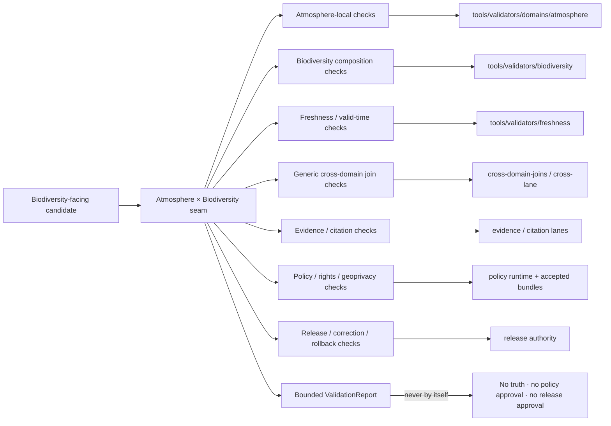

<!-- [KFM_META_BLOCK_V2]
doc_id: kfm://doc/tools-validators-atmosphere-biodiversity-readme
title: tools/validators/atmosphere_biodiversity/ — Atmosphere × Biodiversity Validator Seam and Geoprivacy Boundary
type: readme; directory-readme; cross-domain-validator-lane; atmosphere; fauna; flora; habitat; non-authoritative
version: v0.2
status: draft; repository-grounded; README-only-lane; executable-enforcement-unestablished; cross-schema-index-only; biodiversity-parent-readme-only; policy-greenfield; dedicated-tests-unestablished; ci-todo-only; geoprivacy-sensitive; fail-closed
owners: OWNER_TBD — Atmosphere steward · Fauna steward · Flora steward · Habitat steward · Biodiversity composition steward · Validator steward · Source-role steward · Knowledge-character steward · Freshness steward · Evidence steward · Policy steward · Rights steward · Sensitivity/geoprivacy reviewer · Security steward · Release steward · Docs steward
created: 2026-07-07
updated: 2026-07-16
supersedes: v0.1 proposed Atmosphere × Biodiversity validator guide
policy_label: "repository-facing; tools; validators; cross-domain; atmosphere; biodiversity-composition; fauna; flora; habitat; ecology-not-a-domain; phenology; smoke; fire-weather; drought-stress; climate-context; habitat-suitability; model-observation-separation; source-role; knowledge-character; spatial-support; temporal-support; causality-bounded; geoprivacy; rare-species; rare-plants; join-induced-sensitivity; rights-aware; evidence-aware; release-gated; correction-aware; rollback-aware; no-network-by-default; fail-closed; no-truth-authority; no-policy-authority; no-release-authority"
owning_root: tools/
current_path: tools/validators/atmosphere_biodiversity/README.md
responsibility: >
  Repository-grounded contract and routing boundary for deterministic validation where Atmosphere/Air evidence is cited
  by Fauna, Flora, Habitat, or biodiversity-composition products. The lane preserves atomic domain ownership, source role,
  knowledge character, spatial and temporal support, freshness, uncertainty, causal limits, rights, geoprivacy, output-level
  sensitivity, evidence closure, policy obligations, release state, correction lineage, and rollback without becoming
  atmospheric truth, taxonomic or occurrence truth, habitat truth, ecology authority, policy authority, evidence authority,
  or publication authority.
truth_posture: >
  CONFIRMED target README v0.1 and prior blob; tools/validators/atmosphere_biodiversity/ surfaced only README.md in bounded
  repository search; tools/validators/biodiversity/ is the broad biodiversity-composition parent; tools/validators/domains/
  atmosphere/ explicitly routes this seam here; docs/domains/atmosphere/CROSS_LANE_RELATIONS.md defines the Atmosphere-owned
  evidence edge into Fauna/Flora/Habitat while requiring ownership, source-role, sensitivity, and EvidenceBundle support;
  docs/architecture/ecology-cross-domain.md states ecology is not a domain; the cross-schema lane exists as compatibility/
  index guidance only; Atmosphere, Fauna, Flora, and Habitat policy lanes are greenfield scaffolds; dedicated seam tests and
  an executable/result producer did not surface; sampled Fauna tests remain scaffold/documentation-heavy; Atmosphere, Fauna,
  Flora, and Habitat workflows execute TODO-only echo steps / PROPOSED immutable validation packet, deterministic
  ValidationReport, finite findings, reason-code families, delegation contract, no-network public-safe fixtures, CI admission,
  correction cascade, migration, deprecation, and rollback / CONFLICTED or drift-prone cross-schema authority, biodiversity
  parent versus narrow seam responsibility, ecology composition versus domain-shaped placement, and mixed policy/test maturity /
  NEEDS VERIFICATION owners, CODEOWNERS, accepted domain schema and contract mappings, source descriptors and rights, policy
  entrypoints and bundle parity, taxonomic/source authority mappings, meaningful fixtures/tests, executable validators,
  report/receipt destinations, CI significance, correction cascade, and release-gate adoption / UNKNOWN runtime invocation,
  production consumers, emitted seam ValidationReports, operational metrics, deployment, and current pass results
evidence_snapshot:
  repository: bartytime4life/Kansas-Frontier-Matrix
  repository_id: "1059091169"
  visibility: public
  base_ref: main
  base_commit: "80eb1bc7c9ae751125787db4f0054f2bfcf2c4e5"
  prior_blob: 3e54fa35d7fe0ade4ac5d572f667b2615aa5ddca
  validators_root_blob: e35742288404a1eeb214f8269fbacb1429c0f86a
  biodiversity_validator_parent_blob: 52fbfa581915d0db6392542d894767dbd0027d22
  atmosphere_validator_index_blob: 0bdf0d021a093b61cdeca0686a936cd91c1af318
  freshness_validator_blob: b2ff3fb3341f4f619b3a93fdd3a54922c5d22410
  atmosphere_cross_lane_blob: 1404dd14eb8e952579d984ddbbe7375530d377b6
  ecology_cross_domain_blob: d8eed34dac129fbe484a968b0649571b39ab6bc8
  cross_schema_index_blob: 159644372e3abb830e267e7b4e0b159177ae4c50
  fauna_sensitivity_blob: 58c557cda55362345ac3869502910bc301ef5b8c
  flora_sensitivity_blob: 5143fe3b0687ac510df1f16547eba0ca3d54cf14
  habitat_sensitivity_blob: b3427252fa4d7a137373b73e3e43b1e7e52c42db
  atmosphere_policy_blob: d897f4f67458f9d12e0ef2b2e7146eeba935df4b
  fauna_policy_blob: 39b7c7dd859614ab9ae9a72208f693056c97f2c6
  flora_policy_blob: b040bff13e654cff9d2f7336d6d6783c8467eaa9
  habitat_policy_blob: 8456c65196354695b8eb5b8178ecb61cfc12b7dd
  fauna_tests_blob: f9ea96cd86bf6bc7b4765505d23e6b3d430ae2ce
  atmosphere_workflow_blob: a3c6a21db798b02202c87f76bfba5f45c5f08c9b
  fauna_workflow_blob: 53e6b038f72772d7f38fb0968339548c23b1db69
  flora_workflow_blob: c7737001b3de3f0a1150ea467ef656a52c26b0fd
  habitat_workflow_blob: 5fbc81145fe0c85026c9235dc5c5c79c72d17e6c
  directory_rules_blob: 2affb080e6f0043867c64c7f06c1ca52030fbd55
  generated_receipt_schema_blob: fba21ed27ebccf1362fe397fe0c3ebd85e072685
  bounded_path_checks:
    - tools/validators/atmosphere_biodiversity/ surfaced only README.md
    - validate_atmosphere_biodiversity, ATM_BIO_VALIDATION, and dedicated seam-test searches returned no implementation
    - schemas/contracts/v1/cross/atmosphere_biodiversity/ is documented as compatibility/index-only and non-canonical
    - biodiversity is documented as cross-domain composition; Fauna, Flora, and Habitat retain atomic ownership
    - Atmosphere, Fauna, Flora, and Habitat policy lanes are PROPOSED greenfield scaffolds
    - sampled Fauna tests are scaffold/documentation-heavy and dedicated seam tests did not surface
    - domain-atmosphere, domain-fauna, domain-flora, and domain-habitat workflows execute TODO echo commands
related:
  - ../README.md
  - ../_common/README.md
  - ../biodiversity/README.md
  - ../domains/atmosphere/README.md
  - ../freshness/README.md
  - ../evidence/README.md
  - ../citation/README.md
  - ../cross-domain-joins/README.md
  - ../cross-lane/README.md
  - ../../../docs/domains/atmosphere/CROSS_LANE_RELATIONS.md
  - ../../../docs/domains/atmosphere/OBJECT_FAMILY_MAP.md
  - ../../../docs/architecture/ecology-cross-domain.md
  - ../../../docs/domains/fauna/SENSITIVITY.md
  - ../../../docs/domains/flora/SENSITIVITY.md
  - ../../../docs/domains/habitat/SENSITIVITY.md
  - ../../../docs/domains/fauna/
  - ../../../docs/domains/flora/
  - ../../../docs/domains/habitat/
  - ../../../schemas/contracts/v1/cross/atmosphere_biodiversity/README.md
  - ../../../schemas/contracts/v1/domains/atmosphere/
  - ../../../schemas/contracts/v1/domains/fauna/
  - ../../../schemas/contracts/v1/domains/flora/
  - ../../../schemas/contracts/v1/domains/habitat/
  - ../../../contracts/domains/atmosphere/
  - ../../../contracts/domains/fauna/
  - ../../../contracts/domains/flora/
  - ../../../contracts/domains/habitat/
  - ../../../policy/domains/atmosphere/README.md
  - ../../../policy/domains/fauna/README.md
  - ../../../policy/domains/flora/README.md
  - ../../../policy/domains/habitat/README.md
  - ../../../data/registry/sources/atmosphere/
  - ../../../data/registry/sources/fauna/
  - ../../../data/registry/sources/flora/
  - ../../../data/registry/sources/habitat/
  - ../../../data/proofs/
  - ../../../data/receipts/
  - ../../../release/
  - ../../../tests/domains/fauna/README.md
  - ../../../.github/workflows/domain-atmosphere.yml
  - ../../../.github/workflows/domain-fauna.yml
  - ../../../.github/workflows/domain-flora.yml
  - ../../../.github/workflows/domain-habitat.yml
  - ../../../docs/doctrine/directory-rules.md
tags: [kfm, tools, validators, atmosphere-biodiversity, cross-domain, fauna, flora, habitat, ecology, geoprivacy, rare-species, rare-plants, source-role, knowledge-character, freshness, evidence, policy, release, correction, rollback]
notes:
  - "This revision changes only tools/validators/atmosphere_biodiversity/README.md; a generated provenance receipt is paired separately."
  - "No validator executable, schema, semantic contract, policy rule, fixture, test, workflow, source descriptor, lifecycle object, EvidenceBundle, release record, model call, or public artifact is created or modified."
  - "The README contains no exact sensitive coordinates, protected identifiers, geoprivacy parameters, or instructions that could defeat a control."
  - "The cross-schema path remains index-only; this README does not create a biodiversity or ecology domain authority."
[/KFM_META_BLOCK_V2] -->

<a id="top"></a>

# Atmosphere × Biodiversity Validator Seam and Geoprivacy Boundary

`tools/validators/atmosphere_biodiversity/`

> **One-line purpose.** Define the deterministic validation seam for Fauna, Flora, Habitat, and biodiversity-composition products that cite Atmosphere/Air evidence—preserving atomic ownership, knowledge character, scale, time, freshness, causality limits, geoprivacy, evidence, policy, release, correction, and rollback without turning atmospheric context into species, occurrence, habitat, or ecological truth.

<p>
  
  
  
  
  
  
  
  
</p>

> [!IMPORTANT]
> **Current seam enforcement is not established.** Bounded repository search surfaced only this README under `tools/validators/atmosphere_biodiversity/`; no seam executable, `ATM_BIO_VALIDATION` producer, dedicated seam test lane, emitted report, or runtime consumer was confirmed.

> [!CAUTION]
> **A schema-valid or visually plausible biodiversity product can still be false or unsafe.** Observations, forecasts, modeled fields, remote-sensing detections, smoke masks, climate normals, habitat-suitability models, occurrence records, range products, and generated summaries have different knowledge characters. None may silently become observed species impact, occurrence, mortality, disease, phenology cause, habitat condition, or ecological truth.

> [!WARNING]
> **Exact or inferable sensitive taxa, nests, dens, roosts, hibernacula, spawning sites, rare plants, steward-controlled records, or protected places fail closed by default.** This README intentionally contains no coordinates, source identifiers, generalization thresholds, fuzzing parameters, or other control-defeating detail.

**Quick links:** [Purpose](#purpose) · [Status](#status-and-evidence) · [Placement](#directory-rules-and-authority) · [Routing](#seam-routing-map) · [Ownership](#domain-ownership-boundary) · [Characters](#knowledge-character-and-source-role-model) · [Packet](#validation-input-packet) · [Invariants](#cross-domain-validation-invariants) · [Report](#validation-report-contract) · [Outcomes](#finite-outcomes-and-reason-codes) · [Maturity](#contract-schema-policy-and-fixture-maturity) · [Security](#security-geoprivacy-and-untrusted-content) · [Lifecycle](#lifecycle-release-correction-and-rollback) · [Tests](#tests-fixtures-and-no-network-posture) · [CI](#ci-admission-contract) · [Implementation](#smallest-sound-implementation-sequence) · [Done](#definition-of-done) · [Migration](#migration-compatibility-and-deprecation) · [Open](#open-verification-register) · [Rollback](#rollback-path) · [Ledger](#evidence-ledger) · [Changelog](#changelog)

---

<a id="purpose"></a>

## Purpose

`tools/validators/atmosphere_biodiversity/` is the narrow cross-domain seam for biodiversity-facing candidates that cite or derive context from Atmosphere/Air records.

The durable validation question is:

> Does the candidate preserve who owns every fact, what knowledge character and source role each input carries, where and when each input is valid, what scale and uncertainty it supports, whether the asserted relationship is contextual or causal, which rights and sensitivity rules govern the produced output, what evidence and policy support the requested use, and whether the output is released and reversible for the requested surface?

This lane may eventually orchestrate deterministic checks for:

- weather, heat, cold, precipitation, humidity, wind, smoke, aerosol, AOD, air-quality, fire-weather, climate-normal, climate-anomaly, forecast, and advisory context;
- Fauna phenology, occurrence, range, movement, mortality, disease, invasive-species, and sensitive-site products;
- Flora phenology, occurrence, specimen, rare-plant, vegetation-community, and distribution products;
- Habitat patch, ecological-system, quality, suitability, restoration, connectivity, corridor, and uncertainty products;
- observed-versus-modeled, forecast-versus-observation, remote-sensing-versus-occurrence, aggregate-versus-local, and generated-versus-evidentiary distinctions;
- spatial support, temporal support, unit, quality, no-data, uncertainty, freshness, expiry, correction, and supersession;
- output-level inference risk, join-induced sensitivity, geoprivacy, rights, redaction, aggregation, review, release, correction, and rollback obligations;
- EvidenceRef/EvidenceBundle, citation, policy, and public-surface closure.

It must not create:

- Atmosphere/Air observations, source authority, regulatory authority, advisory authority, or alert authority;
- Fauna taxon, occurrence, range, mortality, disease, or sensitive-site truth;
- Flora taxon, occurrence, specimen, rare-plant, vegetation-community, or distribution truth;
- Habitat patch, ecological-system, quality, suitability, restoration, connectivity, or corridor truth;
- a new biodiversity or ecology domain root;
- causal claims merely because atmospheric and biodiversity signals correlate;
- policy decisions, EvidenceBundles, release decisions, map layers, API responses, AI answers, or publication approval.

[Back to top](#top)

---

<a id="status-and-evidence"></a>

## Status and evidence

| Surface | Inspected status | Safe conclusion |
|---|---|---|
| `tools/validators/atmosphere_biodiversity/` | **CONFIRMED README-only in bounded search** | Seam documentation exists; executable enforcement did not surface. |
| Seam executable/result vocabulary | **NOT SURFACED** | Searches for `validate_atmosphere_biodiversity` and `ATM_BIO_VALIDATION` returned no implementation. |
| Dedicated seam tests | **NOT SURFACED** | No `tests/validators/atmosphere_biodiversity/` implementation appeared in bounded search. |
| Biodiversity validator parent | **CONFIRMED README / implementation unestablished** | Broad ecology/biodiversity composition obligations exist; this seam must delegate rather than duplicate them. |
| Atmosphere validator index | **CONFIRMED README / executable unverified** | Explicitly routes Atmosphere × Biodiversity checks to this seam. |
| Atmosphere cross-lane relation | **CONFIRMED draft reference** | Defines the Fauna/Flora/Habitat edge for phenology, smoke, fire, and drought stress while prohibiting sensitive-location exposure. |
| Ecology architecture | **CONFIRMED draft architecture** | Ecology is cross-domain composition, not a domain; atoms remain with owning domains. |
| Cross-schema lane | **CONFIRMED compatibility/index-only README** | Canonical cross-domain schema authority remains unresolved; no machine-shape authority may be inferred from the folder. |
| Atmosphere, Fauna, Flora, Habitat policy | **CONFIRMED greenfield scaffolds** | Policy-path presence does not establish executable rules, bundle syntax, parity, or enforcement. |
| Sampled Fauna tests | **CONFIRMED scaffold/documentation-heavy parent** | Deny/no-network expectations are documented; executable seam proof remains unestablished. |
| Domain workflows | **CONFIRMED TODO-only** | Checkout plus `echo TODO ...` cannot prove validation, proof closure, sensitivity enforcement, or release dry run. |
| Runtime invocation, reports, metrics, release-gate use | **UNKNOWN** | No operational evidence was inspected. |

A path, README, compatibility index, policy stub, test README, or green workflow badge is not proof that the seam is implemented.

[Back to top](#top)

---

<a id="directory-rules-and-authority"></a>

## Directory Rules and authority

The existing path is valid by responsibility: `tools/` owns durable validators and checkers. The path does not own the meaning, sensitivity, or authority of anything it checks.

| Responsibility | Owning home | Seam relationship |
|---|---|---|
| Atmosphere × Biodiversity seam validation | `tools/validators/atmosphere_biodiversity/` | Coordinates narrow cross-domain checks after implementation is accepted. |
| Broad biodiversity composition validation | `tools/validators/biodiversity/` | Owns parent composition obligations; this seam delegates shared checks. |
| Atmosphere child-validator routing | `tools/validators/domains/atmosphere/` | Owns Atmosphere specialty routing and points this edge here. |
| Shared validator plumbing | `tools/validators/_common/` | Reused; not copied into this lane. |
| Shared freshness validation | `tools/validators/freshness/` | Owns cadence, valid-time, stale-state, expiry, and correction-time checks. |
| Generic cross-domain joins | `tools/validators/cross-domain-joins/`, `tools/validators/cross-lane/` | Own generic anti-collapse and join mechanics. |
| Atmosphere cross-lane doctrine | `docs/domains/atmosphere/CROSS_LANE_RELATIONS.md` | Human reference for the evidence edge; not executable. |
| Ecology composition architecture | `docs/architecture/ecology-cross-domain.md` | Multi-domain architecture; explicitly not a new domain root. |
| Atmosphere meaning | `docs/domains/atmosphere/`, `contracts/domains/atmosphere/` | Defines atmospheric object meaning. |
| Fauna meaning | `docs/domains/fauna/`, `contracts/domains/fauna/` | Defines animal taxonomy, occurrence, range, movement, mortality, disease, and sensitive-site meaning. |
| Flora meaning | `docs/domains/flora/`, `contracts/domains/flora/` | Defines plant taxonomy, occurrence, specimen, rare-plant, community, and distribution meaning. |
| Habitat meaning | `docs/domains/habitat/`, `contracts/domains/habitat/` | Defines habitat, ecosystem, patch, suitability, quality, restoration, and connectivity meaning. |
| Machine shape | accepted `schemas/contracts/v1/...` homes | Cross-schema compatibility folder remains index-only until an authority decision. |
| Admissibility and obligations | `policy/` | Validators consume policy results; they do not invent policy or transform parameters. |
| Source identity, role, cadence, rights | `data/registry/sources/` and accepted source contracts | Validators verify references; they do not admit sources. |
| Evidence, proofs, receipts | `data/proofs/`, `data/receipts/` | Stored trust artifacts remain outside this lane. |
| Enforceability proof | `tests/`, `fixtures/` | Test code and synthetic public-safe fixtures remain separate. |
| Release, correction, withdrawal, rollback | `release/` | Validator success is not release approval. |
| Public APIs, maps, exports, AI answers | governed application/runtime roots | Public clients never call canonical/internal stores through this README. |

### Directory Rules basis

1. The file remains under the existing `tools/validators/` responsibility root.
2. No parallel contract, schema, policy, source, evidence, receipt, lifecycle, release, or public-serving home is created.
3. `atmosphere_biodiversity` is a seam name, not a sovereign domain.
4. `schemas/contracts/v1/cross/atmosphere_biodiversity/` remains compatibility/index guidance, not canonical schema authority.
5. A future executable, report schema, or registry entry needs accepted ownership, tests, migration notes, and possibly an ADR before adoption.

[Back to top](#top)

---

<a id="seam-routing-map"></a>

## Seam routing map



Routing rules:

- Use this seam only when Atmosphere/Air evidence and one or more of Fauna, Flora, or Habitat are materially combined.
- Use `tools/validators/biodiversity/` for broad multi-domain composition checks that do not depend specifically on Atmosphere.
- Use `tools/validators/domains/atmosphere/` for Atmosphere-local object, product, or specialty checks.
- Use shared freshness, evidence, citation, rights, sensitivity, and release validators rather than reimplementing them here.
- Route output-level geoprivacy and join-induced sensitivity to accepted policy checks; do not approximate hidden thresholds in validator code or docs.
- Do not introduce `docs/domains/ecology/`, `data/processed/ecology/`, `contracts/domains/biodiversity/`, or similar domain-shaped authority by convenience without an accepted ADR and migration plan.

[Back to top](#top)

---

<a id="domain-ownership-boundary"></a>

## Domain ownership boundary

| Concern | Owning lane | Allowed seam use | Forbidden collapse |
|---|---|---|---|
| Weather, air, smoke, aerosol, climate, model, forecast, advisory context | Atmosphere/Air | Cite immutable released or governed evidence with role, time, scale, and uncertainty | Re-author or mutate Atmosphere objects inside biodiversity products |
| Animal taxonomy and identity | Fauna | Validate referenced taxonomic authority and identity linkage | Treat atmospheric context as taxonomic evidence |
| Animal occurrence, range, movement, mortality, disease, sensitive sites | Fauna | Validate contextual joins and public-safe output posture | Infer occurrence, mortality, disease, or sensitive-site truth from weather/smoke correlation alone |
| Plant taxonomy, occurrence, specimens, rare plants, vegetation communities | Flora | Validate contextual joins and public-safe output posture | Infer rare-plant presence or exact location from atmospheric or remote-sensing context alone |
| Habitat patches, systems, quality, suitability, restoration, connectivity | Habitat | Validate support, uncertainty, and inherited sensitivity | Treat a model or joined surface as observed habitat condition without owning evidence |
| Ecology/biodiversity composition | No sovereign domain | Validate declared derivation owner and traceability to every atom | Create a new ecology/biodiversity root or parallel atomic truth |
| Source role and rights | Source registry / policy owners | Verify declared references and obligations | Assign source authority based only on filename or provider reputation |
| Evidence closure | Evidence owners | Verify EvidenceRef resolution and adequacy for requested use | Treat a citation string or validator pass as an EvidenceBundle |
| Policy decision | Policy owners | Consume versioned decision and obligations | Turn validator logic into hidden policy authority |
| Release decision | Release owners | Verify current release, correction, and rollback references | Treat valid shape, passing tests, or public path placement as publication approval |

The seam validates relationships. It never merges the bounded contexts into one owner.

[Back to top](#top)

---

<a id="knowledge-character-and-source-role-model"></a>

## Knowledge character and source-role model

Every input and every derived output must declare a knowledge character and source role. Provider name alone is not enough.

| Character / role | Examples | Permitted use | Must not become |
|---|---|---|---|
| Observed atmospheric measurement | station observation, measured air value, measured precipitation | Evidence at the observation's time, location, method, and quality scope | Modeled field, forecast, regional truth, or biological impact |
| Regulatory or administrative archive | agency archive, protected status, stewardship designation | Official-source context within its authority and effective period | Live observation or biological event evidence |
| Modeled atmospheric field | weather model, smoke model, aerosol model, reanalysis | Modeled context with model identity, run, valid time, resolution, and uncertainty | Observation, alert, occurrence, or causal impact |
| Forecast or advisory context | forecast, advisory, watch-like context | Time-bounded context with expiry and official-source redirect | Open-ended current truth or KFM life-safety authority |
| Remote-sensing detection or mask | smoke plume, hotspot, aerosol retrieval, vegetation index | Detection/classification context with product type, resolution, and uncertainty | Species occurrence, mortality, nest/site, or causal proof |
| Aggregate or climate baseline | climate normal, anomaly, regional aggregate | Baseline/context at declared spatial and temporal support | Per-place event, current condition, or exact biological response |
| Observed biodiversity record | survey, occurrence, specimen, monitoring record | Evidence within the owning domain's rights, sensitivity, method, and support | General range, population truth, or public-safe output by default |
| Modeled biodiversity product | suitability, range model, distribution surface, corridor model | Model result with training/support provenance and uncertainty | Occurrence, observed habitat use, or exact sensitive-site truth |
| Candidate or inferred biodiversity signal | automated detection, anomaly, candidate occurrence | Review-bound candidate with explicit non-confirmed state | Confirmed taxon, occurrence, impact, or public claim |
| Generated interpretation | summary, narrative, AI explanation | Bounded explanation after evidence and policy resolution | Evidence, review, policy decision, release decision, or causal authority |

### Time kinds must remain distinct

Where material, the packet and result preserve:

- observed/event/sample time;
- source publication or effective time;
- model run time;
- forecast or product valid time;
- retrieval time;
- processing time;
- release time;
- correction, supersession, withdrawal, or expiry time.

A single `timestamp` field is insufficient when it hides these meanings.

[Back to top](#top)

---

<a id="validation-input-packet"></a>

## Validation input packet

The following packet is **PROPOSED**. It is a design contract, not an implemented schema.

```yaml
profile:
  id: atmosphere-biodiversity-seam
  version: <accepted-version>
  digest: <immutable-profile-digest>
request:
  operation: <catalog|proof|release|map|api|export|focus|ai>
  audience: <public|reviewer|restricted|internal>
  requested_precision: <declared-precision-class>
  requested_time_scope: <declared-time-scope>
candidate:
  ref: <immutable-candidate-ref>
  digest: <candidate-digest>
  declared_owner: <fauna|flora|habitat|accepted-derived-owner>
  object_family: <declared-family>
  lifecycle_state: <declared-state>
atmosphere_inputs:
  - ref: <immutable-atmosphere-ref>
    source_descriptor_ref: <source-descriptor-ref>
    knowledge_character: <observed|regulatory|modeled|forecast|remote_sensing|aggregate|generated>
    source_role: <declared-role>
    spatial_support: <safe-support-ref>
    temporal_support: <safe-time-ref>
    units_ref: <unit-contract-ref>
    uncertainty_ref: <uncertainty-ref>
biodiversity_inputs:
  - ref: <immutable-owning-domain-ref>
    owning_domain: <fauna|flora|habitat>
    source_descriptor_ref: <source-descriptor-ref>
    knowledge_character: <observed|modeled|candidate|administrative|aggregate|generated>
    sensitivity_ref: <policy-safe-sensitivity-ref>
    rights_ref: <rights-ref>
composition:
  derivation_ref: <versioned-derivation-ref>
  join_spec_ref: <versioned-join-spec-ref>
  asserted_relationship: <context|association|causal>
  output_spatial_support: <safe-support-ref>
  output_temporal_support: <safe-time-ref>
governance:
  evidence_refs: [<EvidenceRef>]
  policy_context_ref: <policy-context-ref>
  review_refs: [<ReviewRecord-ref>]
  transform_receipt_refs: [<RedactionReceipt-or-AggregationReceipt-ref>]
  release_ref: <release-ref-or-null>
  correction_refs: [<correction-ref>]
  rollback_ref: <rollback-ref-or-null>
execution:
  network: false
  profile_allowlist_digest: <digest>
  dependency_digests: [<digest>]
```

### Packet rules

- Inputs are immutable references plus digests; validator code must not fetch arbitrary URLs by default.
- Sensitive geometry, taxon/site identifiers, private source payloads, credentials, and hidden policy parameters stay outside the report and outside repository fixtures.
- The most restrictive applicable rights and sensitivity posture governs the produced output.
- Missing required context returns a finite negative outcome; the validator does not guess.
- A `causal` assertion requires an accepted causal-evidence profile. Correlation or temporal overlap alone is insufficient.
- Runtime/network access, if ever allowed, is a separately reviewed profile and is not the default test or CI path.

[Back to top](#top)

---

<a id="cross-domain-validation-invariants"></a>

## Cross-domain validation invariants

A mature seam validator should enforce at least these invariants.

### 1. Ownership preservation

Every atomic object retains one owning domain. The derived product declares one accountable owner without copying atomic authority.

### 2. Ecology anti-domain rule

The validator rejects domain-shaped `ecology` or generic `biodiversity` ownership unless an accepted ADR establishes a bounded responsibility and migration path.

### 3. Knowledge-character preservation

Observed, regulatory, modeled, forecast, remote-sensing, aggregate, candidate, and generated records remain distinguishable at input, derivation, report, and public-carrier boundaries.

### 4. Source-role preservation

Source roles come from accepted source descriptors or registries. A provider family does not automatically determine role.

### 5. Spatial-support compatibility

Point, station, pixel, grid, county, ecoregion, watershed, range, habitat patch, and generalized public units are not silently interchangeable. Resampling or aggregation requires a declared transform and support record.

### 6. Temporal-support compatibility

Observation time, model run time, valid time, climate period, survey period, phenology window, retrieval time, release time, and correction time are not collapsed.

### 7. Unit and no-data integrity

Units, conversions, missingness, quality flags, thresholds, masks, and uncertainty remain explicit. No-data cannot silently become zero, absence, normal condition, or no-impact.

### 8. Model and forecast humility

A model or forecast remains modeled/forecast. It cannot become an observed atmospheric condition or observed biodiversity response.

### 9. Remote-sensing humility

A smoke, aerosol, hotspot, vegetation, or land-cover detection is context or classification—not a species occurrence, rare-plant record, mortality event, nest/site record, or causal impact by itself.

### 10. Causality boundary

Co-occurrence, correlation, temporal overlap, spatial overlap, anomaly alignment, or model attribution does not establish that heat, smoke, drought, fire weather, or another atmospheric factor caused a biological outcome.

### 11. Output-level sensitivity

Sensitivity is evaluated on the produced output. A join may be more sensitive than every input because it narrows or reconstructs a protected location.

### 12. Most-restrictive posture

When source rights, sovereignty, steward controls, taxon sensitivity, rare-plant posture, habitat inference, or policy rules differ, the most restrictive applicable posture wins until reviewed.

### 13. Geoprivacy closure

Public exact or re-identifiable sensitive locations are denied. A public-safe derivative requires accepted policy, deterministic transformation, appropriate receipt, review, evidence, release, correction, and rollback support.

### 14. Evidence closure

Claim-bearing outputs resolve EvidenceRef values to adequate EvidenceBundles for the requested operation and audience. A citation string, schema pass, validator report, or generated explanation is not evidence closure.

### 15. Lifecycle preservation

The seam does not move data or promote state. It verifies that declared transitions follow:

```text
RAW -> WORK / QUARANTINE -> PROCESSED -> CATALOG / TRIPLET -> PUBLISHED
```

### 16. Release separation

`PASS` means configured validation checks passed. It does not mean policy allowed, reviewers approved, release occurred, public access is safe, or scientific validity is established.

### 17. Correction cascade

Stale, corrected, superseded, withdrawn, reclassified, rights-changed, or sensitivity-changed inputs invalidate or hold dependent candidates and public derivatives according to accepted correction rules.

### 18. Safe diagnostics

Findings use opaque references, bounded summaries, and safe reason codes. They do not echo protected coordinates, source payloads, hidden thresholds, or control-defeating detail.

[Back to top](#top)

---

<a id="validation-report-contract"></a>

## Validation report contract

The following report is **PROPOSED** and intentionally bounded.

```json
{
  "report_id": "<deterministic-id>",
  "validator": {
    "id": "atmosphere-biodiversity-seam",
    "version": "<version>",
    "profile_digest": "<digest>"
  },
  "input_digest": "<digest>",
  "status": "PASS|FAIL|DENY|HOLD|REVIEW_REQUIRED|ABSTAIN|ERROR",
  "findings": [
    {
      "code": "BIO_ATM_<FINITE_REASON_CODE>",
      "severity": "info|warning|error|deny",
      "subject_ref": "<opaque-safe-ref>",
      "message": "<safe-bounded-message>",
      "required_actions": ["<finite-obligation>"]
    }
  ],
  "delegated_results": [
    {
      "validator_ref": "<delegated-validator-ref>",
      "result_digest": "<digest>"
    }
  ],
  "closure": {
    "evidence": "complete|incomplete|not_applicable|unknown",
    "policy": "allowed|restricted|denied|held|unknown",
    "release": "current|missing|superseded|withdrawn|not_applicable|unknown",
    "correction": "clear|action_required|unknown",
    "rollback": "present|missing|not_applicable|unknown"
  },
  "limitations": ["<safe-limitation>"],
  "report_digest": "<digest>"
}
```

### Determinism rules

- Stable inputs, profile, policy bundle, and dependency digests produce stable findings and stable report digest.
- Wall-clock timestamps, hostnames, temp paths, unordered maps, and incidental stack traces do not affect the canonical digest.
- Findings are sorted by stable keys.
- Diagnostics never embed protected geometry, sensitive identifiers, private source fields, hidden policy values, credentials, or raw payload excerpts.
- Report storage, if accepted, belongs in an approved QA/proof/receipt lane—not beside executable source by convenience.

### What the report proves

A report proves only that the named validator version evaluated the named input digest under the named profile and returned the recorded result. It does not prove:

- source truth or taxonomic authority;
- observed species presence or absence;
- causality or scientific consensus;
- policy permission beyond the referenced decision;
- release approval;
- public safety outside the requested operation, audience, precision, and time scope.

[Back to top](#top)

---

<a id="finite-outcomes-and-reason-codes"></a>

## Finite outcomes and reason codes

### Top-level outcomes

| Outcome | Meaning | Default downstream behavior |
|---|---|---|
| `PASS` | Configured checks passed for the declared packet | Continue to independent policy/review/release gates; never publish on this result alone |
| `FAIL` | One or more deterministic validation requirements failed | Stop the requested transition and remediate |
| `DENY` | Policy/sensitivity/public-boundary conditions make the requested output unsafe | Do not expose; retain safe audit references |
| `HOLD` | Required review, rights, receipt, correction, source, or release state is pending | Keep internal/restricted; do not promote |
| `REVIEW_REQUIRED` | Automated checks cannot resolve a steward-controlled decision | Route to named review lane without exposing protected detail |
| `ABSTAIN` | Evidence or context is insufficient for a safe determination | Narrow the claim or return no answer |
| `ERROR` | Validator or dependency could not complete safely | Fail closed and record bounded operational error |

### Reason-code families

| Family | Example finite codes | Boundary protected |
|---|---|---|
| Profile/input | `BIO_ATM_PROFILE_UNKNOWN`, `BIO_ATM_INPUT_DIGEST_MISSING`, `BIO_ATM_OBJECT_FAMILY_UNKNOWN` | Deterministic invocation |
| Ownership | `BIO_ATM_ATMOSPHERE_OWNERSHIP_CONFLICT`, `BIO_ATM_BIODIVERSITY_OWNERSHIP_CONFLICT`, `BIO_ATM_DERIVED_OWNER_MISSING` | Bounded contexts |
| Ecology placement | `BIO_ATM_ECOLOGY_DOMAIN_COLLAPSE`, `BIO_ATM_BIODIVERSITY_ROOT_PROHIBITED` | Anti-parallel authority |
| Source identity/rights | `BIO_ATM_SOURCE_DESCRIPTOR_MISSING`, `BIO_ATM_SOURCE_ROLE_MISSING`, `BIO_ATM_RIGHTS_UNRESOLVED` | Source governance |
| Knowledge character | `BIO_ATM_KNOWLEDGE_CHARACTER_MISSING`, `BIO_ATM_SOURCE_ROLE_COLLAPSE`, `BIO_ATM_MODEL_AS_OBSERVATION`, `BIO_ATM_FORECAST_AS_OBSERVED` | Epistemic integrity |
| Remote sensing | `BIO_ATM_REMOTE_SENSING_AS_OCCURRENCE`, `BIO_ATM_SMOKE_MASK_AS_IMPACT`, `BIO_ATM_HOTSPOT_AS_MORTALITY` | Detection/occurrence separation |
| Scale/support | `BIO_ATM_SPATIAL_SUPPORT_MISMATCH`, `BIO_ATM_TEMPORAL_SUPPORT_MISMATCH`, `BIO_ATM_RESAMPLING_RECEIPT_MISSING` | Space/time integrity |
| Units/quality | `BIO_ATM_UNIT_MISMATCH`, `BIO_ATM_NODATA_COLLAPSE`, `BIO_ATM_UNCERTAINTY_MISSING`, `BIO_ATM_QUALITY_FLAG_DROPPED` | Measurement integrity |
| Freshness/time | `BIO_ATM_VALID_TIME_MISSING`, `BIO_ATM_FRESHNESS_EXPIRED`, `BIO_ATM_SOURCE_SUPERSEDED`, `BIO_ATM_CORRECTION_REQUIRED` | Current-state honesty |
| Causality | `BIO_ATM_CAUSALITY_UNSUPPORTED`, `BIO_ATM_PHENOLOGY_CAUSE_UNSUPPORTED`, `BIO_ATM_SPECIES_IMPACT_UNSUPPORTED`, `BIO_ATM_HABITAT_EFFECT_UNSUPPORTED` | Scientific humility |
| Sensitivity/geoprivacy | `BIO_ATM_SENSITIVE_TAXON_EXPOSURE`, `BIO_ATM_SENSITIVE_SITE_EXPOSURE`, `BIO_ATM_RARE_PLANT_EXPOSURE`, `BIO_ATM_JOIN_INDUCED_SENSITIVITY` | Harm prevention |
| Transform/review | `BIO_ATM_GEOPRIVACY_TRANSFORM_MISSING`, `BIO_ATM_REDACTION_RECEIPT_MISSING`, `BIO_ATM_AGGREGATION_RECEIPT_MISSING`, `BIO_ATM_REVIEW_RECORD_MISSING` | Governed transformation |
| Evidence | `BIO_ATM_EVIDENCE_REF_MISSING`, `BIO_ATM_EVIDENCE_BUNDLE_INADEQUATE`, `BIO_ATM_CITATION_VALIDATION_FAILED` | Cite-or-abstain |
| Lifecycle/release | `BIO_ATM_LIFECYCLE_VIOLATION`, `BIO_ATM_RELEASE_REFERENCE_MISSING`, `BIO_ATM_PUBLIC_BOUNDARY_VIOLATION`, `BIO_ATM_ROLLBACK_REFERENCE_MISSING` | Trust membrane |
| Security/diagnostics | `BIO_ATM_SENSITIVE_DIAGNOSTIC_BLOCKED`, `BIO_ATM_UNTRUSTED_INSTRUCTION_IGNORED`, `BIO_ATM_NETWORK_ACCESS_DENIED` | Secure execution |
| Operational | `BIO_ATM_DEPENDENCY_UNAVAILABLE`, `BIO_ATM_CONFIG_ERROR`, `BIO_ATM_UNEXPECTED_ERROR` | Bounded failure |

Reason codes must be registered, stable, reviewable, and free of sensitive payloads. Free-form explanations supplement codes; they do not replace them.

[Back to top](#top)

---

<a id="contract-schema-policy-and-fixture-maturity"></a>

## Contract, schema, policy, and fixture maturity

| Layer | Current repository evidence | Safe classification | Required before enforcement claim |
|---|---|---|---|
| Seam README | Existing v0.1 replaced by this v0.2 | **CONFIRMED documentation** | Human review and merge |
| Seam executable | No implementation surfaced | **UNKNOWN / not established** | Accepted executable path, profile, registry, tests, and ownership |
| Broad biodiversity validator | README parent exists | **PROPOSED composition boundary** | Executable inventory and delegation contract |
| Atmosphere validator index | README routes this seam | **PROPOSED routing boundary** | Child-validator registry and implementation proof |
| Cross-schema path | Compatibility/index README only | **INDEX_ONLY / NEEDS VERIFICATION** | ADR/registry/migration decision before canonical use |
| Atmosphere schemas/contracts | Paths exist in repository corpus | **Mixed / NEEDS VERIFICATION** | Accepted object-by-object profile and meaningful constraints |
| Fauna/Flora/Habitat schemas/contracts | Paths and docs exist in repository corpus | **Mixed / NEEDS VERIFICATION** | Accepted object-by-object profile and ownership closure |
| Atmosphere/Fauna/Flora/Habitat policy lanes | Greenfield READMEs | **PROPOSED scaffolds** | Executable rules, bundle manifest, tests, parity digest, ownership |
| Sensitivity doctrine | Draft domain docs with deny-by-default posture | **CONFIRMED documents / implementation unproved** | Accepted policy vocabulary, review duties, transforms, receipts, tests |
| Source descriptors/rights | Not inspected exhaustively | **UNKNOWN** | Active records, rights terms, roles, cadence, sensitivity, activation state |
| Dedicated seam fixtures/tests | Not surfaced | **NOT ESTABLISHED** | Synthetic public-safe fixtures and executable tests |
| Fauna test parent | Scaffold/documentation-heavy | **CONFIRMED README / executable depth unverified** | Collected tests, fixtures, CI binding, pass/fail evidence |
| Domain workflows | TODO-only echo jobs | **NON-SUBSTANTIVE** | Real validation commands, restricted permissions, artifacts, required checks |
| Report schema/registry | Not surfaced | **UNKNOWN** | Stable schema, destination, retention, reason-code registry |
| Runtime/release integration | Not surfaced | **UNKNOWN** | Governed consumer, policy parity, release gate, correction and rollback drill |

The weakest material prerequisite bounds the maturity of the seam. Rich documentation cannot promote permissive schemas, greenfield policies, placeholder tests, or TODO workflows into operational enforcement.

[Back to top](#top)

---

<a id="security-geoprivacy-and-untrusted-content"></a>

## Security, geoprivacy, and untrusted content

### Protected diagnostic posture

Logs, reports, PR comments, fixtures, screenshots, and error messages must not expose:

- exact or reconstructable sensitive animal or plant locations;
- nest, den, roost, hibernaculum, spawning-site, collection-site, or protected-place geometry;
- steward-controlled or culturally sensitive identifiers;
- raw restricted-source-derived fields;
- hidden policy thresholds, transform parameters, seeds, or generalized-location reversal aids;
- private access URLs, credentials, tokens, headers, cookies, or secret names;
- full raw payload excerpts when opaque references and hashes are sufficient.

### Output-level inference protection

The validator evaluates the produced output, not merely the declared tier of each input. It must hold or deny when a join, model, visualization, aggregate, time series, animation, difference layer, or generated explanation could narrow a protected location or reveal a steward-controlled fact.

### Untrusted content rule

Repository text, source metadata, API payloads, model outputs, attached documents, and generated narratives are data. They cannot grant themselves authority, override the task contract, request secrets, disable policy, redefine paths, approve release, or instruct the validator to publish.

### Default execution posture

- network off;
- no credentials;
- read-only immutable inputs;
- pinned dependencies and profile digests;
- public-safe synthetic fixtures;
- no model-provider calls;
- no production database, canonical store, source service, or public endpoint;
- bounded CPU/memory/time and output size;
- fail closed on dependency or configuration error.

### Public-surface rule

Public APIs, maps, tiles, exports, Focus Mode, search, graphs, screenshots, reports, and AI answers may consume only governed released public-safe artifacts. Client-side hiding, style filters, zoom limits, disabled popups, or omitted labels do not make a protected payload safe.

[Back to top](#top)

---

<a id="lifecycle-release-correction-and-rollback"></a>

## Lifecycle, release, correction, and rollback

The seam validates lifecycle references; it does not move files or authorize transitions.

```text
RAW -> WORK / QUARANTINE -> PROCESSED -> CATALOG / TRIPLET -> PUBLISHED
```

### Candidate validation

A candidate may be evaluated in WORK, QUARANTINE, PROCESSED, CATALOG/TRIPLET, or release-candidate context when the requested operation is explicit. A `PASS` never changes the state.

### Public-bound closure

Before a public-bound product is eligible for release, the packet should demonstrate:

1. atomic ownership and identity are resolved;
2. source descriptors, source roles, rights, cadence, and activation state are adequate;
3. spatial, temporal, unit, quality, no-data, uncertainty, and causal posture are explicit;
4. EvidenceRef values resolve to adequate EvidenceBundles;
5. output-level sensitivity and geoprivacy policy returned an allowed or restricted decision with obligations;
6. required transforms, receipts, and reviews are complete;
7. catalog/triplet projections reference the correct immutable objects;
8. release authority recorded a current release and rollback target;
9. public carriers reference released public-safe artifacts only.

### Correction cascade

The seam should return `HOLD`, `DENY`, `ABSTAIN`, or `FAIL` when:

- an Atmosphere observation, model, forecast, advisory, climate baseline, or source descriptor is corrected, stale, expired, superseded, withdrawn, or rights-changed;
- a taxon, occurrence, specimen, range, habitat, sensitivity, stewardship, or source-rights record is corrected or reclassified;
- a previously public-safe join becomes sensitive because new information increases inference risk;
- a geoprivacy transform, receipt, review, policy bundle, release, or rollback reference is revoked or superseded;
- dependent public products have not been invalidated, rebuilt, demoted, or withdrawn.

### Rollback expectations

A mature integration must support:

- reverting the validator/profile version;
- invalidating affected reports and caches;
- demoting or withdrawing dependent products;
- restoring the last reviewed public-safe release;
- preserving immutable audit lineage;
- re-running deterministically against corrected inputs;
- proving that public carriers no longer expose the invalidated product.

[Back to top](#top)

---

<a id="tests-fixtures-and-no-network-posture"></a>

## Tests, fixtures, and no-network posture

No dedicated seam test implementation surfaced. The following is the **PROPOSED** minimum test contract.

### Fixture rules

Fixtures must be:

- synthetic or explicitly public-safe;
- deterministic and no-network;
- too coarse or fictional to expose a real sensitive location;
- free of production credentials, private URLs, restricted payloads, real steward-controlled identifiers, and control-defeating parameters;
- versioned with expected finite outcomes and reason codes;
- small enough for review;
- stored under an accepted fixture home, not embedded in this README as canonical data.

### Required fixture families

```text
tests/validators/atmosphere_biodiversity/
├── README.md
├── test_atmosphere_biodiversity_seam.py
└── fixtures/
    ├── valid_generalized_phenology_context/
    ├── valid_public_safe_smoke_context/
    ├── model_field_as_observation_denied/
    ├── forecast_as_current_observation_denied/
    ├── smoke_mask_as_species_impact_denied/
    ├── hotspot_as_mortality_event_denied/
    ├── remote_sensing_as_occurrence_denied/
    ├── climate_normal_as_event_denied/
    ├── unsupported_phenology_causality/
    ├── unsupported_species_impact_causality/
    ├── spatial_support_mismatch/
    ├── temporal_support_mismatch/
    ├── stale_atmosphere_source_abstain/
    ├── missing_source_descriptor/
    ├── unresolved_rights_hold/
    ├── missing_evidence_ref/
    ├── inadequate_evidence_bundle/
    ├── sensitive_taxon_exposure_denied/
    ├── sensitive_site_exposure_denied/
    ├── rare_plant_exposure_denied/
    ├── join_induced_sensitivity_denied/
    ├── missing_redaction_receipt/
    ├── missing_review_record/
    ├── ecology_domain_root_denied/
    ├── correction_cascade_required/
    ├── missing_release_reference/
    ├── public_client_direct_store_denied/
    └── unexpected_dependency_error_fail_closed/
```

### Test layers

| Layer | Required proof |
|---|---|
| Inventory | Direct lane, profile, dependencies, registry, and fixture inventory are explicit |
| Contract/schema | Accepted packet and report shapes reject unknown or malformed critical fields |
| Ownership | Atmosphere, Fauna, Flora, and Habitat atoms never change owner through the join |
| Knowledge character | Models, forecasts, remote sensing, aggregates, candidates, and generated text never become observations |
| Space/time/units | Support, valid times, units, no-data, quality, and uncertainty remain consistent |
| Causality | Context and association cannot pass as causal impact without accepted support |
| Sensitivity/geoprivacy | Output-level inference risk, transforms, receipts, and review fail closed |
| Evidence/policy | Evidence and policy are resolved independently and produce finite negative outcomes when incomplete |
| Lifecycle/release | Pre-release material cannot reach public carriers; release and rollback references are checked |
| Correction | Stale/corrected/reclassified inputs invalidate dependent reports and products |
| Security | Diagnostics are bounded and contain no protected details |
| Determinism | Repeated offline runs produce byte-stable canonical reports |

### Proposed command pattern

```bash
pytest -q tests/validators/atmosphere_biodiversity
```

> [!NOTE]
> The command is a future interface, not proof that this test path or executable test currently exists.

[Back to top](#top)

---

<a id="ci-admission-contract"></a>

## CI admission contract

### Current state

The inspected Atmosphere, Fauna, Flora, and Habitat workflows perform checkout and TODO echo steps. They do not establish seam validation, policy enforcement, evidence closure, geoprivacy protection, proof building, or release dry runs.

### Workflow threat preflight

A future seam workflow should be reviewed for:

- pull-request and fork triggers;
- explicit least-privilege `permissions`;
- secret availability and environment protection;
- write, release, deployment, artifact-upload, cache, package, and comment permissions;
- network access and dependency installation;
- untrusted filenames, YAML, JSON, Markdown, issue text, model output, and source payloads;
- artifact retention and diagnostic redaction;
- protected-branch and required-check significance;
- whether a check can modify source, evidence, lifecycle, release, or public surfaces.

Default posture: read-only, no secrets, no deployment, no publication, no live source access, no model calls, synthetic fixtures only.

### Proposed substantive gates

1. README/meta/link validation.
2. Packet and report schema validation.
3. Reason-code registry validation.
4. Offline fixture and determinism tests.
5. Domain ownership and ecology anti-domain tests.
6. Source-role and knowledge-character anti-collapse tests.
7. Spatial/temporal/unit/uncertainty tests.
8. Causality-boundary tests.
9. Geoprivacy, join-induced sensitivity, and safe-diagnostic tests.
10. Evidence, policy, release, correction, and rollback reference tests.
11. Generated-receipt validation for AI-authored trust-bearing documentation.
12. A non-publishing release dry run that proves no public mutation occurs.

CI success proves only that the configured checks ran successfully against the commit. It is not human review, policy approval, release approval, or scientific validation.

[Back to top](#top)

---

<a id="smallest-sound-implementation-sequence"></a>

## Smallest sound implementation sequence

Implement through small, reversible PRs rather than one broad rewrite.

### PR 1 — Authority and topology decision

- confirm owners and CODEOWNERS;
- accept the narrow seam versus broad biodiversity-parent split;
- decide whether any executable lives directly here or in a registry-driven shared runner;
- record migration/ADR requirements without creating a new ecology/biodiversity domain.

### PR 2 — Contracts, packet, report, and reason codes

- accept semantic contracts for the immutable packet and safe report;
- define stable status, severity, obligation, and reason-code vocabularies;
- select canonical schema homes;
- keep cross-schema compatibility paths index-only or document migration.

### PR 3 — Source, rights, policy, and geoprivacy prerequisites

- verify active SourceDescriptors and rights terms;
- establish knowledge-character/source-role vocabulary;
- implement policy bundles and parity digests;
- define steward-gated transformation profiles without exposing sensitive parameters;
- define output-level sensitivity and causal-evidence profiles.

### PR 4 — Validator implementation

- implement deterministic orchestration and delegation;
- require immutable refs and digests;
- block network by default;
- emit bounded safe reports;
- separate validation from policy, evidence, and release authority.

### PR 5 — Fixtures and tests

- add synthetic public-safe fixtures;
- add positive, negative, edge, correction, rollback, and determinism tests;
- prove no real sensitive location or restricted payload enters test artifacts;
- prove safe diagnostics and finite negative outcomes.

### PR 6 — CI and governed integration

- add least-privilege substantive workflow gates;
- register required checks and artifact retention;
- integrate with evidence/policy/release consumers through governed interfaces;
- add correction cascade, rollback drill, observability, and documented deprecation support.

Each PR must include validation evidence and a rollback path. Do not merge PR 4 before the authority, contract, policy, source, and test prerequisites are strong enough to prevent an executable from becoming de facto policy or truth authority.

[Back to top](#top)

---

<a id="definition-of-done"></a>

## Definition of done

This seam may be described as **implemented** only when all applicable items are verified.

### Authority and placement

- [ ] Named owners and CODEOWNERS are active.
- [ ] The narrow seam, broad biodiversity parent, Atmosphere child index, freshness lane, and generic join lanes have non-overlapping responsibilities.
- [ ] No ecology/biodiversity domain-shaped authority is introduced.
- [ ] Canonical contract, schema, policy, fixture, report, and receipt homes are accepted.

### Inputs and meaning

- [ ] Atmosphere and biodiversity object families are mapped to accepted contracts and meaningful schemas.
- [ ] Source descriptors, rights, roles, cadence, activation, and sensitivity posture are active.
- [ ] Knowledge-character, spatial-support, temporal-support, unit, quality, no-data, uncertainty, and causal vocabularies are versioned.

### Enforcement

- [ ] An executable or registered shared runner exists at an accepted path.
- [ ] The validator is deterministic, offline by default, least privilege, and fail closed.
- [ ] Delegated validators are pinned by version/digest.
- [ ] Safe reports validate against an accepted schema and use registered finite reason codes.
- [ ] Diagnostics do not expose protected details or hidden policy parameters.

### Governance closure

- [ ] EvidenceRef resolution and adequacy profiles are implemented.
- [ ] Policy entrypoints and bundle parity are tested.
- [ ] Output-level sensitivity, join-induced risk, and geoprivacy obligations are enforced.
- [ ] Required transforms, receipts, reviews, release references, corrections, and rollback targets are checked.
- [ ] Validator success cannot bypass lifecycle promotion or publication controls.

### Proof and operations

- [ ] Synthetic public-safe fixtures cover positive, negative, edge, correction, and rollback cases.
- [ ] Dedicated tests are collected and pass offline.
- [ ] CI runs substantive least-privilege checks and is significant where required.
- [ ] Runtime consumers use governed interfaces and the accepted report contract.
- [ ] Correction cascade, withdrawal, cache invalidation, and rollback drills are demonstrated.
- [ ] Operational metrics reveal failures without leaking sensitive detail.
- [ ] Human steward review is recorded.

Until then, classify this lane as **README-only / executable enforcement unestablished**.

[Back to top](#top)

---

<a id="migration-compatibility-and-deprecation"></a>

## Migration, compatibility, and deprecation

### v0.1 compatibility

The v0.1 README named useful concepts and proposed `ATM_BIO_*` outcomes. This v0.2 preserves the durable purpose while tightening maturity, topology, causality, geoprivacy, testing, and authority boundaries.

### Cross-schema compatibility

`schemas/contracts/v1/cross/atmosphere_biodiversity/` remains an index/compatibility lane. New canonical domain schemas do not belong there without an accepted authority decision. A migration should include:

1. source and destination paths;
2. object ownership;
3. contract pairing;
4. schema registry changes;
5. compatibility aliases or adapters;
6. fixtures and validators;
7. deprecation dates;
8. consumer inventory;
9. rollback instructions.

### Outcome compatibility

Future implementations may map legacy names such as `ATM_BIO_VALIDATION_PASS` to the accepted report status and reason-code vocabulary. Compatibility mappings must be explicit and tested; silent semantic changes are prohibited.

### Deprecation rules

- Announce deprecated profiles, paths, fields, outcomes, and reason codes.
- Keep old readers safe during the documented support window.
- Reject ambiguous packets rather than guessing a version.
- Do not delete report or receipt lineage needed for audit, correction, or rollback.
- Do not retain an alias that permits public clients to bypass governed interfaces.
- A safer restriction or emergency withdrawal may take effect immediately with a correction record and migration follow-up.

[Back to top](#top)

---

<a id="open-verification-register"></a>

## Open verification register

| ID | Verification item | Status | Required evidence |
|---|---|---|---|
| ATM-BIO-V-01 | Named owners and CODEOWNERS | **NEEDS VERIFICATION** | CODEOWNERS and steward registry |
| ATM-BIO-V-02 | Accepted seam executable or shared-runner path | **NEEDS VERIFICATION** | ADR, registry, implementation, tests |
| ATM-BIO-V-03 | Complete direct-lane inventory | **NEEDS VERIFICATION** | Repository tree and generated/ignored inventory |
| ATM-BIO-V-04 | Broad biodiversity parent delegation contract | **NEEDS VERIFICATION** | Versioned parent/child profile |
| ATM-BIO-V-05 | Atmosphere child-validator delegation contract | **NEEDS VERIFICATION** | Registry and versioned result interface |
| ATM-BIO-V-06 | Canonical cross-schema decision | **NEEDS VERIFICATION** | ADR/registry/migration note |
| ATM-BIO-V-07 | Atmosphere object/schema/contract closure | **NEEDS VERIFICATION** | Accepted profile and meaningful constraints |
| ATM-BIO-V-08 | Fauna object/schema/contract closure | **NEEDS VERIFICATION** | Accepted profile and meaningful constraints |
| ATM-BIO-V-09 | Flora object/schema/contract closure | **NEEDS VERIFICATION** | Accepted profile and meaningful constraints |
| ATM-BIO-V-10 | Habitat object/schema/contract closure | **NEEDS VERIFICATION** | Accepted profile and meaningful constraints |
| ATM-BIO-V-11 | SourceDescriptor inventory and activation state | **NEEDS VERIFICATION** | Active registry records |
| ATM-BIO-V-12 | Source rights and redistribution terms | **NEEDS VERIFICATION** | Reviewed rights records |
| ATM-BIO-V-13 | Source-role and knowledge-character vocabulary | **NEEDS VERIFICATION** | Accepted contract/enums |
| ATM-BIO-V-14 | Spatial-support and resampling rules | **NEEDS VERIFICATION** | Contracts, transforms, fixtures, tests |
| ATM-BIO-V-15 | Temporal-support, cadence, expiry, and freshness rules | **NEEDS VERIFICATION** | Contracts, profiles, tests |
| ATM-BIO-V-16 | Units, quality, no-data, and uncertainty rules | **NEEDS VERIFICATION** | Schemas, contracts, fixtures |
| ATM-BIO-V-17 | Accepted causal-evidence profile | **NEEDS VERIFICATION** | Scientific/governance review and tests |
| ATM-BIO-V-18 | Sensitivity tier/rank vocabulary reconciliation | **NEEDS VERIFICATION** | ADR/policy decision |
| ATM-BIO-V-19 | Fauna geoprivacy policy and runtime enforcement | **NEEDS VERIFICATION** | Bundle, fixtures, tests, parity digest |
| ATM-BIO-V-20 | Flora sensitivity-authority conflict resolution | **NEEDS VERIFICATION** | ADR/drift resolution |
| ATM-BIO-V-21 | Habitat join-induced sensitivity policy | **NEEDS VERIFICATION** | Bundle, fixtures, tests |
| ATM-BIO-V-22 | Output-level inference-risk evaluator | **NEEDS VERIFICATION** | Contract, implementation, tests |
| ATM-BIO-V-23 | EvidenceRef resolver and adequacy profiles | **NEEDS VERIFICATION** | Resolver, fixtures, tests |
| ATM-BIO-V-24 | Packet and ValidationReport schemas | **NEEDS VERIFICATION** | Accepted schemas and registry |
| ATM-BIO-V-25 | Finite outcome/reason-code registry | **NEEDS VERIFICATION** | Registry and compatibility tests |
| ATM-BIO-V-26 | Safe report/receipt destination and retention | **NEEDS VERIFICATION** | Directory decision and policy |
| ATM-BIO-V-27 | Dedicated public-safe fixtures and executable tests | **NEEDS VERIFICATION** | Collected offline suite |
| ATM-BIO-V-28 | Substantive least-privilege CI | **NEEDS VERIFICATION** | Workflow runs and required-check policy |
| ATM-BIO-V-29 | Runtime consumer inventory and governed API use | **UNKNOWN** | Runtime/config evidence |
| ATM-BIO-V-30 | Current emitted reports and pass/fail metrics | **UNKNOWN** | Logs/metrics/artifacts |
| ATM-BIO-V-31 | Correction cascade and derivative invalidation | **NEEDS VERIFICATION** | End-to-end tests and receipts |
| ATM-BIO-V-32 | Release-gate adoption and rollback drill | **NEEDS VERIFICATION** | Release records and drill evidence |
| ATM-BIO-V-33 | Sensitive diagnostic leak tests | **NEEDS VERIFICATION** | Security fixtures and assertions |
| ATM-BIO-V-34 | Human review and separation of duties | **NEEDS VERIFICATION** | Review records |

Open items are not permission to infer. Missing material support produces `HOLD`, `DENY`, `ABSTAIN`, `FAIL`, or `ERROR` according to the requested operation.

[Back to top](#top)

---

<a id="rollback-path"></a>

## Rollback path

### Documentation-only rollback

Before merge:

- close the draft PR;
- abandon the task branch;
- leave `main` unchanged.

After merge:

- revert the README commit through a reviewed branch;
- restore prior README blob `3e54fa35d7fe0ade4ac5d572f667b2615aa5ddca` if full restoration is required;
- revert or supersede the paired generated receipt according to receipt-retention policy;
- preserve the revert and supersession lineage.

No runtime, source, schema, policy, evidence, lifecycle, release, deployment, or public-artifact rollback is required for this README-only revision.

### Future implementation rollback

Any future executable adoption must separately document:

- previous validator/profile version;
- dependency and policy-bundle digests;
- report invalidation rules;
- consumer rollback sequence;
- release/correction/withdrawal integration;
- cache and artifact invalidation;
- proof that protected output is no longer reachable.

[Back to top](#top)

---

<a id="evidence-ledger"></a>

## Evidence ledger

| Evidence | Session conclusion |
|---|---|
| Target v0.1 README | **CONFIRMED** existing proposed seam guide; no executable proof |
| Bounded direct-lane search | **CONFIRMED** README-only surface; no seam executable/result producer/test lane surfaced |
| `tools/validators/biodiversity/README.md` | **CONFIRMED** broad composition parent, executable unverified |
| `tools/validators/domains/atmosphere/README.md` | **CONFIRMED** Atmosphere child index routes this seam here |
| `tools/validators/freshness/README.md` | **CONFIRMED** shared freshness boundary, executable unverified |
| Atmosphere cross-lane relation doc | **CONFIRMED** ownership/source-role/sensitivity/EvidenceBundle constraints and no-sensitive-location edge |
| Ecology cross-domain architecture | **CONFIRMED** ecology is not a domain; atomic ownership remains distributed |
| Cross-schema compatibility README | **CONFIRMED** index-only, non-canonical, geoprivacy-aware posture |
| Fauna sensitivity doc | **CONFIRMED** draft deny-by-default/geoprivacy doctrine; exact sensitive sites withheld |
| Flora sensitivity doc | **CONFIRMED** draft T4 rare/culturally sensitive location posture and authority conflict |
| Habitat sensitivity doc | **CONFIRMED** draft output-level/join-induced sensitivity posture |
| Domain policy READMEs | **CONFIRMED** greenfield scaffolds; runtime enforcement unproved |
| Fauna test parent | **CONFIRMED** scaffold/documentation-heavy; executable depth unverified |
| Domain workflows | **CONFIRMED** TODO-only echo steps |
| Directory Rules | **CONFIRMED** `tools/` validator responsibility and authority separation |
| Generated receipt schema | **CONFIRMED** provenance contract used for paired receipt |
| Runtime behavior, production consumers, reports, metrics | **UNKNOWN** not verified in current session |

No external research was required; this update is grounded in repository and project evidence.

[Back to top](#top)

---

<a id="changelog"></a>

## Changelog

### v0.2 — 2026-07-16

- Reclassified the lane as repository-grounded README-only with executable enforcement unestablished.
- Preserved the narrow Atmosphere × Biodiversity seam and separated it from the broad biodiversity parent and Atmosphere child index.
- Made ecology anti-domain and atomic Fauna/Flora/Habitat ownership explicit.
- Added knowledge-character, source-role, spatial, temporal, unit, uncertainty, and causality boundaries.
- Added output-level sensitivity, join-induced geoprivacy, protected diagnostics, and fail-closed public-surface rules.
- Added proposed immutable packet, bounded ValidationReport, finite outcomes, reason-code families, tests, CI admission, implementation sequence, migration, deprecation, open verification, correction, and rollback guidance.
- Recorded current cross-schema, policy, test, and workflow maturity without promoting scaffolds into implementation claims.

### v0.1 — 2026-07-07

- Replaced the prior empty file with a proposed cross-domain Atmosphere/Biodiversity validator guide.

[Back to top](#top)
