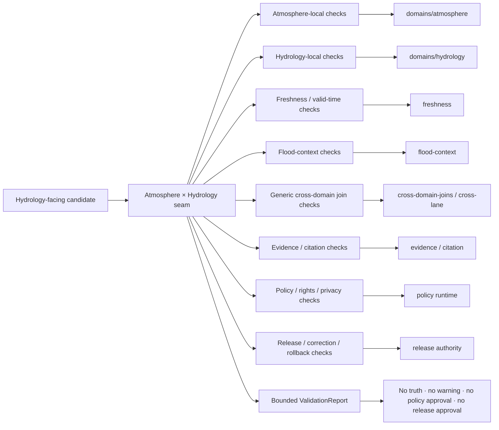

<!-- [KFM_META_BLOCK_V2]
doc_id: kfm://doc/tools-validators-atmosphere-hydrology-readme
title: tools/validators/atmosphere_hydrology/ — Atmosphere × Hydrology Validator Seam and Hydrometeorological Boundary
type: readme; directory-readme; cross-domain-validator-lane; atmosphere; hydrology; non-authoritative
version: v0.2
status: draft; repository-grounded; README-only-lane; executable-enforcement-unestablished; cross-schema-index-only; hydrology-schema-index-only; policy-greenfield; dedicated-tests-unestablished; ci-todo-only; not-flood-warning; fail-closed
owners: OWNER_TBD — Atmosphere steward · Hydrology steward · Validator steward · Source-role steward · Knowledge-character steward · Temporal/freshness steward · Spatial-support steward · Units/measurement steward · Evidence steward · Policy steward · Rights/privacy reviewer · Security steward · Release steward · Docs steward
created: 2026-07-07
updated: 2026-07-16
supersedes: v0.1 proposed Atmosphere × Hydrology validator guide
policy_label: "repository-facing; tools; validators; cross-domain; atmosphere; hydrology; hydrometeorology; precipitation; drought; flood-weather-forcing; runoff; discharge; water-level; radar-estimate; model-forecast; climate-normal; source-role; knowledge-character; spatial-support; temporal-support; accumulation-window; units; uncertainty; regulatory-context; not-flood-warning; official-source; evidence-aware; policy-aware; release-gated; correction-aware; rollback-aware; no-network-by-default; fail-closed; no-truth-authority; no-alert-authority; no-release-authority"
owning_root: tools/
current_path: tools/validators/atmosphere_hydrology/README.md
responsibility: >
  Repository-grounded contract and routing boundary for deterministic validation where Atmosphere/Air evidence is cited
  by Hydrology products. The lane preserves atomic domain ownership, source role, knowledge character, spatial and temporal
  support, accumulation windows, units, uncertainty, freshness, regulatory context, derivation and causal limits, privacy,
  evidence closure, policy obligations, release state, correction lineage, and rollback without becoming atmospheric truth,
  hydrologic observation truth, flood-event truth, drought authority, emergency guidance, policy authority, evidence
  authority, or publication authority.
truth_posture: >
  CONFIRMED target README v0.1 and prior blob; bounded repository search surfaced only README.md under
  tools/validators/atmosphere_hydrology/; no validate_atmosphere_hydrology executable, ATM_HYD_VALIDATION producer, or
  dedicated seam test implementation surfaced; tools/validators/hydrology/ is the full-name Hydrology routing index;
  tools/validators/domains/hydrology/ is the richer per-domain Hydrology index; tools/validators/hydro/ is shorthand
  routing; flood-context and hydrology-hazards are adjacent specialty lanes; docs/domains/atmosphere/CROSS_LANE_RELATIONS.md
  defines precipitation, drought, and flood-weather forcing as Atmosphere-owned context consumed by Hydrology while
  requiring ownership, source-role, sensitivity, and EvidenceBundle preservation; Hydrology source-role doctrine fixes
  observed, regulatory, modeled, aggregate, administrative, candidate, and synthetic roles at admission; Hydrology
  contracts explicitly state NFHL is regulatory context, not observed flooding; the cross-schema lane is compatibility/
  index-only; the Hydrology schema lane is a PROPOSED index with no concrete schema confirmed in its current inventory;
  Atmosphere and Hydrology policy READMEs are greenfield scaffolds; Hydrology tests are documentation-led with executable
  modules and pass rates unverified; Atmosphere and Hydrology workflows execute TODO-only echo steps /
  PROPOSED immutable validation packet, deterministic ValidationReport, finite findings, reason-code families, delegation
  contract, public-safe no-network fixtures, CI admission, correction cascade, migration, deprecation, and rollback /
  CONFLICTED flat-versus-domain Hydrology contract/schema path forms and overlapping Hydrology routing/index descriptions /
  NEEDS VERIFICATION owners, CODEOWNERS, canonical executable and registry entry, accepted schema/contract profiles,
  SourceDescriptors and rights, measurement/time/units vocabularies, precipitation product semantics, runoff/flow
  derivation profiles, drought classification, policy entrypoints and parity, meaningful fixtures/tests, report/receipt
  destinations, CI significance, correction cascade, and release-gate adoption / UNKNOWN runtime invocation, production
  consumers, emitted seam ValidationReports, operational metrics, deployment, and current pass results
evidence_snapshot:
  repository: bartytime4life/Kansas-Frontier-Matrix
  repository_id: "1059091169"
  visibility: public
  base_ref: main
  base_commit: "52275a5710400a9f794a8fcf8e0945e0c21544e4"
  prior_blob: b69ddc2ae2abe18b8ea165ad82d7e107faf43743
  hydrology_routing_index_blob: 2b407093a825cbc5b4605f5a9edd1e955b1190d7
  hydrology_domain_index_blob: b82dffa92b173f26cd013e7496b85db4a780db3b
  atmosphere_validator_index_blob: 0bdf0d021a093b61cdeca0686a936cd91c1af318
  freshness_validator_blob: b2ff3fb3341f4f619b3a93fdd3a54922c5d22410
  atmosphere_cross_lane_blob: 1404dd14eb8e952579d984ddbbe7375530d377b6
  hydrology_source_role_blob: e952cbde781fdb4154fb8869b0ab0fd50a53f63c
  hydrology_contract_root_blob: 4a511d3f4d052cf6af8d92c60fe71bc9d73a5c37
  cross_schema_index_blob: a4ff90271259eb7dc54c9703bbfa62422403b8ff
  hydrology_schema_index_blob: 35562f76d9dadccd6d568254561480cd82e94e5b
  atmosphere_policy_blob: d897f4f67458f9d12e0ef2b2e7146eeba935df4b
  hydrology_policy_blob: 6d4a011079d647b58a44ad70e15ee4a980d00896
  hydrology_tests_blob: e1266df9b3075be05e75da42e0d87bf5dd25589b
  atmosphere_workflow_blob: a3c6a21db798b02202c87f76bfba5f45c5f08c9b
  hydrology_workflow_blob: b54f7dbd425da657176a05f828c5ebeb952a2077
  directory_rules_blob: 2affb080e6f0043867c64c7f06c1ca52030fbd55
  generated_receipt_schema_blob: fba21ed27ebccf1362fe397fe0c3ebd85e072685
  bounded_path_checks:
    - tools/validators/atmosphere_hydrology/ surfaced only README.md
    - validate_atmosphere_hydrology, ATM_HYD_VALIDATION, and ATMOSPHERE_HYDROLOGY_VALIDATION searches returned no implementation
    - schemas/contracts/v1/cross/atmosphere_hydrology/ is compatibility/index-only and non-canonical
    - schemas/contracts/v1/domains/hydrology/ is a PROPOSED index with no concrete schema confirmed by its current inventory
    - policy/domains/atmosphere/README.md and policy/domains/hydrology/README.md are greenfield scaffolds
    - tests/domains/hydrology/ documents child lanes but does not claim executable modules or pass rates
    - domain-atmosphere and domain-hydrology workflows execute TODO echo commands
related:
  - ../README.md
  - ../_common/README.md
  - ../hydrology/README.md
  - ../hydro/README.md
  - ../domains/atmosphere/README.md
  - ../domains/hydrology/README.md
  - ../freshness/README.md
  - ../evidence/README.md
  - ../citation/README.md
  - ../cross-domain-joins/README.md
  - ../cross-lane/README.md
  - ../flood-context/README.md
  - ../hydrology-hazards/README.md
  - ../../../docs/domains/atmosphere/CROSS_LANE_RELATIONS.md
  - ../../../docs/domains/atmosphere/KNOWLEDGE_CHARACTERS.md
  - ../../../docs/domains/atmosphere/OBJECT_FAMILY_MAP.md
  - ../../../docs/domains/hydrology/README.md
  - ../../../docs/domains/hydrology/source-role-matrix.md
  - ../../../docs/domains/hydrology/IDENTITY_MODEL.md
  - ../../../docs/domains/hydrology/CROSSWALK_RULES.md
  - ../../../contracts/domains/atmosphere/
  - ../../../contracts/domains/hydrology/README.md
  - ../../../schemas/contracts/v1/domains/atmosphere/
  - ../../../schemas/contracts/v1/domains/hydrology/README.md
  - ../../../schemas/contracts/v1/cross/atmosphere_hydrology/README.md
  - ../../../policy/domains/atmosphere/README.md
  - ../../../policy/domains/hydrology/README.md
  - ../../../data/registry/sources/atmosphere/
  - ../../../data/registry/sources/hydrology/
  - ../../../data/proofs/
  - ../../../data/receipts/
  - ../../../release/
  - ../../../tests/domains/hydrology/README.md
  - ../../../.github/workflows/domain-atmosphere.yml
  - ../../../.github/workflows/domain-hydrology.yml
  - ../../../docs/doctrine/directory-rules.md
tags: [kfm, tools, validators, atmosphere-hydrology, hydrometeorology, precipitation, runoff, discharge, flood-weather, drought, source-role, knowledge-character, spatial-support, temporal-support, units, freshness, evidence, policy, release, correction, rollback]
notes:
  - "This revision changes only tools/validators/atmosphere_hydrology/README.md; a generated provenance receipt is paired separately."
  - "No validator executable, schema, semantic contract, policy rule, fixture, test, workflow, source descriptor, lifecycle object, EvidenceBundle, release record, model call, emergency message, or public artifact is created or modified."
  - "No current gauge value, flood status, warning, emergency instruction, private-well detail, critical-infrastructure detail, or sensitive operational payload is included."
  - "The cross-schema path remains index-only; the seam does not create Hydrology or Atmosphere authority."
[/KFM_META_BLOCK_V2] -->

<a id="top"></a>

# Atmosphere × Hydrology Validator Seam and Hydrometeorological Boundary

`tools/validators/atmosphere_hydrology/`

> **One-line purpose.** Define the deterministic validation seam for Hydrology products that cite Atmosphere/Air evidence—preserving ownership, knowledge character, source role, space, time, accumulation windows, units, uncertainty, freshness, regulatory context, derivation limits, evidence, policy, release, correction, and rollback without turning atmospheric forcing into runoff, discharge, water level, inundation, drought state, flood warning, or emergency truth.

<p>
  
  
  
  
  
  
  
  
</p>

> [!IMPORTANT]
> **Current seam enforcement is not established.** Bounded repository search surfaced only this README under `tools/validators/atmosphere_hydrology/`; no executable, registered profile, `ATM_HYD_VALIDATION` producer, dedicated seam test implementation, emitted report, or runtime consumer was confirmed.

> [!CAUTION]
> **Atmospheric forcing is not hydrologic response.** Rainfall, radar estimates, forecast precipitation, snow, temperature, humidity, wind, climate anomalies, and drought indicators may influence water systems, but they do not by themselves prove runoff, discharge, stage, inundation, water quality, groundwater response, dam condition, or flood occurrence.

> [!WARNING]
> **KFM is not a flood-warning, dam-safety, navigation, engineering, insurance, evacuation, or life-safety authority.** Public context must remain evidence-bound, time-bounded, source-attributed, released, correctable, reversible, and visibly subordinate to official authorities.

**Quick links:** [Purpose](#purpose) · [Status](#status-and-evidence) · [Placement](#directory-rules-and-authority) · [Routing](#seam-routing-map) · [Ownership](#domain-ownership-boundary) · [Characters](#knowledge-character-and-source-role-model) · [Hydrometeorology](#hydrometeorological-semantics) · [Packet](#validation-input-packet) · [Invariants](#cross-domain-validation-invariants) · [Report](#validation-report-contract) · [Outcomes](#finite-outcomes-and-reason-codes) · [Maturity](#contract-schema-policy-and-fixture-maturity) · [Security](#security-privacy-and-untrusted-content) · [Lifecycle](#lifecycle-release-correction-and-rollback) · [Tests](#tests-fixtures-and-no-network-posture) · [CI](#ci-admission-contract) · [Implementation](#smallest-sound-implementation-sequence) · [Done](#definition-of-done) · [Migration](#migration-compatibility-and-deprecation) · [Open](#open-verification-register) · [Rollback](#rollback-path) · [Ledger](#evidence-ledger) · [Changelog](#changelog)

---

<a id="purpose"></a>

## Purpose

`tools/validators/atmosphere_hydrology/` is the narrow cross-domain seam for Hydrology candidates that cite, compare, aggregate, or derive context from Atmosphere/Air evidence.

The durable validation question is:

> Does the candidate preserve which domain owns every fact, what knowledge character and source role each input carries, where and when each input is valid, which accumulation window and units apply, what spatial support and uncertainty the join can sustain, what derivation connects forcing to response, what regulatory and emergency boundaries govern the result, what evidence and policy support the requested use, and whether the output is released and reversible for the requested audience?

This lane may eventually coordinate deterministic checks for:

- precipitation observations, radar or satellite estimates, model fields, forecasts, climate normals, climate anomalies, snow and temperature context;
- watersheds, HUC units, reaches, gauges, wells, flow observations, water-level observations, water-quality observations, aquifer observations, hydrographs, upstream traces, drought links, water-use links, and irrigation links;
- precipitation depth versus rate, instantaneous versus accumulated values, snow-water equivalent, antecedent moisture context, temporal windows, and timezone/clock handling;
- gauge observation versus modeled hydrograph, radar estimate versus rain-gauge measurement, atmospheric drought versus hydrologic drought, and regulatory flood context versus observed inundation;
- source role, knowledge character, spatial support, temporal support, units, quality flags, no-data, uncertainty, freshness, expiry, correction, and supersession;
- transformation or derivation support where precipitation is converted into runoff, streamflow, stage, flood extent, recharge, or drought classification;
- EvidenceRef/EvidenceBundle, citation, policy, review, release, correction, and rollback closure;
- public map, API, export, Focus, search, graph, tile, screenshot, embedding, and AI-answer boundaries.

It must not create:

- Atmosphere/Air observations, model truth, forecast authority, climate authority, or advisory authority;
- Hydrology observations, gauge readings, hydrograph truth, watershed identity, reach identity, flood-event truth, drought classification, or regulatory determination;
- hydrologic response from atmospheric forcing without a declared, evidence-supported derivation;
- emergency warnings, evacuation or shelter instructions, dam-safety guidance, navigation advice, engineering design decisions, insurance advice, or legal determinations;
- policy decisions, EvidenceBundles, release decisions, map layers, API responses, AI answers, or publication approval.

[Back to top](#top)

---

<a id="status-and-evidence"></a>

## Status and evidence

| Surface | Inspected status | Safe conclusion |
|---|---|---|
| `tools/validators/atmosphere_hydrology/` | **CONFIRMED README-only in bounded search** | Seam documentation exists; executable enforcement did not surface. |
| Executable/result vocabulary | **NOT SURFACED** | Searches for `validate_atmosphere_hydrology`, `ATM_HYD_VALIDATION`, and `ATMOSPHERE_HYDROLOGY_VALIDATION` returned no implementation. |
| Dedicated seam tests | **NOT SURFACED** | No implemented `tests/validators/atmosphere_hydrology/` suite appeared in bounded search. |
| Full-name Hydrology validator index | **CONFIRMED README / executable unverified** | Routes Hydrology work among per-domain, shorthand, flood-context, hazard, and Atmosphere seams. |
| Per-domain Hydrology validator index | **CONFIRMED README / executable unverified** | Defines richer Hydrology validation responsibilities and fail-closed posture. |
| Atmosphere cross-lane edge | **CONFIRMED draft reference** | Hydrology consumes precipitation, drought, and flood-weather forcing while preserving ownership, source role, sensitivity, and EvidenceBundle support. |
| Hydrology source-role doctrine | **CONFIRMED draft doctrine** | Roles are fixed at admission; regulatory, modeled, aggregate, candidate, and synthetic records cannot silently become observations. |
| Hydrology contracts | **CONFIRMED draft root / mixed inventory** | Human-readable meaning exists; path form remains conflicted and implementation maturity is not complete. |
| Cross-schema lane | **CONFIRMED compatibility/index-only** | Canonical cross-domain schema authority remains unresolved. |
| Hydrology schema lane | **CONFIRMED proposed index** | Current inventory reports no confirmed concrete `.schema.json` file. |
| Atmosphere and Hydrology policies | **CONFIRMED greenfield scaffolds** | Path presence does not prove executable policy, bundle syntax, parity, or enforcement. |
| Hydrology tests | **CONFIRMED documentation-led parent** | Child README lanes are documented; executable modules, fixture inventory, CI, and pass rates remain unverified. |
| Domain workflows | **CONFIRMED TODO-only** | Checkout plus `echo TODO ...` cannot prove validation, evidence closure, policy, proof, or release dry run. |
| Runtime invocation, reports, metrics, release-gate use | **UNKNOWN** | No operational evidence was inspected. |

A path, README, contract, schema index, policy stub, test index, or green workflow badge is not proof that the seam is implemented.

[Back to top](#top)

---

<a id="directory-rules-and-authority"></a>

## Directory Rules and authority

The existing path is valid by responsibility: `tools/` owns durable validators and checkers. It does not own the meaning, policy, evidence, lifecycle, release, or public authority of anything it checks.

| Responsibility | Owning home | Seam relationship |
|---|---|---|
| Atmosphere × Hydrology seam validation | `tools/validators/atmosphere_hydrology/` | Coordinates narrow cross-domain checks after implementation is accepted. |
| Full-name Hydrology routing | `tools/validators/hydrology/` | Broad navigation and delegation. |
| Per-domain Hydrology validation | `tools/validators/domains/hydrology/` | Owns Hydrology-specific validation profiles and child routing. |
| Shorthand Hydrology routing | `tools/validators/hydro/` | Compatibility/convenience lane; not competing authority. |
| Flood regulatory-context checks | `tools/validators/flood-context/` | Owns NFHL/FEMA/regulatory-versus-observed anti-collapse checks. |
| Hydrology × Hazards checks | `tools/validators/hydrology-hazards/` | Owns flood/hazard-context boundary beyond this Atmosphere seam. |
| Atmosphere child validation | `tools/validators/domains/atmosphere/` | Owns Atmosphere specialty routing. |
| Shared freshness validation | `tools/validators/freshness/` | Owns cadence, valid-time, stale-state, expiry, and correction-time checks. |
| Generic cross-domain joins | `tools/validators/cross-domain-joins/`, `tools/validators/cross-lane/` | Own generic anti-collapse and join mechanics. |
| Atmosphere meaning | `docs/domains/atmosphere/`, `contracts/domains/atmosphere/` | Defines atmospheric object meaning. |
| Hydrology meaning | `docs/domains/hydrology/`, `contracts/domains/hydrology/` | Defines water-system objects, observations, regulatory context, and interpretations. |
| Machine shape | accepted `schemas/contracts/v1/...` homes | Cross-schema compatibility directory remains index-only. |
| Admissibility and obligations | `policy/` | Validators consume policy results; they do not invent policy. |
| Source identity, role, cadence, rights | `data/registry/sources/` and accepted source contracts | Validators verify references; they do not admit sources. |
| Evidence, proofs, receipts | `data/proofs/`, `data/receipts/` | Trust artifacts remain outside this lane. |
| Enforceability proof | `tests/`, `fixtures/` | Executable tests and synthetic public-safe fixtures remain separate. |
| Release, correction, withdrawal, rollback | `release/` | Validator success is not release approval. |
| Public APIs, maps, exports, AI answers | governed application/runtime roots | Public clients use governed released interfaces only. |

### Directory Rules basis

1. The file remains under the existing `tools/validators/` responsibility root.
2. No parallel contract, schema, policy, source, evidence, receipt, lifecycle, release, or public-serving home is created.
3. `atmosphere_hydrology` is a seam name, not a sovereign domain or shared truth store.
4. `schemas/contracts/v1/cross/atmosphere_hydrology/` remains compatibility/index guidance.
5. A future executable, report schema, registry entry, or canonical schema family requires accepted ownership, tests, migration notes, and possibly an ADR.

[Back to top](#top)

---

<a id="seam-routing-map"></a>

## Seam routing map



Routing rules:

- Use this seam only when Atmosphere/Air evidence and Hydrology meaning are materially combined.
- Use `tools/validators/domains/hydrology/` for Hydrology-local identity, observation, hydrograph, HUC/reach, well, and domain-specific checks.
- Use `tools/validators/flood-context/` for NFHL/FEMA/regulatory flood context and observed/forecast/warning anti-collapse.
- Use `tools/validators/hydrology-hazards/` when Hazards event, warning, exposure, or impact context is central.
- Use shared freshness, evidence, citation, policy, release, and cross-domain validators rather than duplicating them here.
- Do not create a canonical cross-domain schema or data store in this directory.

[Back to top](#top)

---

<a id="domain-ownership-boundary"></a>

## Domain ownership boundary

| Concern | Owning lane | Allowed seam use | Forbidden collapse |
|---|---|---|---|
| Weather stations and observations | Atmosphere/Air | Cite immutable evidence with method, time, units, support, and quality | Copy or re-own as Hydrology observation |
| Precipitation observation | Atmosphere/Air | Use as forcing/context within its measurement support | Treat as runoff, discharge, stage, recharge, or inundation |
| Radar/satellite precipitation estimate | Atmosphere/Air | Use as estimated field with algorithm, calibration, resolution, and uncertainty | Label as rain-gauge observation or exact local truth |
| Forecast/model precipitation | Atmosphere/Air | Use as modeled/forecast forcing with run and valid time | Label as observed precipitation or current hydrologic condition |
| Climate normal/anomaly | Atmosphere/Air | Use as aggregate baseline/context | Treat as a current event, per-gauge measurement, or local flood/drought proof |
| Watershed/HUC/reach identity | Hydrology | Validate spatial alignment and lineage | Infer from atmospheric grid cell or visualization alone |
| Gauge/site identity | Hydrology | Join atmospheric context to a stable site reference | Treat site metadata as an observation |
| Flow, stage, water-level, water-quality observation | Hydrology | Validate response against cited forcing and evidence | Manufacture observation from weather/model inputs |
| Hydrograph/model output | Hydrology | Preserve observed/modeled role, run, inputs, uncertainty, and receipt | Relabel model/reconstruction as observed gauge series |
| NFHL/flood regulatory context | Hydrology/regulatory source | Cite as regulatory context | Present as observed flood, forecast extent, current warning, or legal advice |
| Drought link/classification | Declared owning profile | Use Atmosphere drought context as one input | Equate meteorological drought with hydrologic drought without accepted method |
| Flood/hazard warning context | Hazards/official authority | Redirect or cite released official context | Let KFM originate or replace warning/life-safety authority |
| Policy decision | Policy owners | Consume versioned decision and obligations | Turn validator logic into hidden policy authority |
| Evidence closure | Evidence owners | Verify EvidenceRef resolution and adequacy | Treat citation text or validator pass as EvidenceBundle |
| Release decision | Release owners | Verify current release, correction, and rollback refs | Treat valid shape or test success as publication approval |

[Back to top](#top)

---

<a id="knowledge-character-and-source-role-model"></a>

## Knowledge character and source-role model

Every input and derived output must declare a knowledge character and source role. Provider name alone is insufficient.

| Character / role | Examples | Permitted use | Must not become |
|---|---|---|---|
| Observed atmospheric measurement | rain gauge, temperature station, snow observation | Evidence at the observation's place, time, method, and QA scope | Radar estimate, model field, basin total, or hydrologic response |
| Remote-sensing or radar estimate | radar precipitation, satellite retrieval, snow/soil-moisture proxy | Estimated context with algorithm, calibration, resolution, masks, and uncertainty | Gauge observation, runoff, flood event, or exact local truth |
| Modeled atmospheric field | NWP precipitation, reanalysis, forecast weather field | Modeled/forecast forcing with model identity, run, valid time, resolution, and uncertainty | Observation or current hydrologic condition |
| Aggregate/climate baseline | climate normal, anomaly, basin summary | Baseline/context at declared spatial and temporal support | Per-place observation or current event |
| Observed Hydrology record | gauge discharge, stage, water level, sample result | Evidence within site/time/unit/qualifier/source support | Model output, regulatory context, or universal watershed truth |
| Regulatory Hydrology context | NFHL zone, official designation | Regulatory context within authority and effective period | Observed inundation, forecast, current warning, or insurance determination |
| Modeled Hydrology product | hydrograph model, runoff surface, flood model, recharge model | Model result with inputs, assumptions, run receipt, uncertainty, and scope | Observed discharge, stage, inundation, or groundwater response |
| Aggregate Hydrology product | HUC summary, basin total, long-period water budget | Summary at declared unit and period | Per-site or per-reach truth |
| Candidate/inferred record | watcher output, automated anomaly, provisional product | Review-bound candidate with explicit non-confirmed state | Released observation or official warning |
| Synthetic/generated interpretation | interpolation, simulation, AI narrative | Bounded representation after evidence and policy resolution | Evidence, observation, policy decision, warning, or release authority |

### Time kinds must remain distinct

Where material, the packet preserves:

- observed/sample/event time;
- accumulation start and end;
- source publication or effective time;
- model run or analysis time;
- product valid time;
- retrieval time;
- processing time;
- release time;
- correction, supersession, withdrawal, or expiry time.

A single `timestamp` field is insufficient when it hides these meanings.

[Back to top](#top)

---

<a id="hydrometeorological-semantics"></a>

## Hydrometeorological semantics

### Precipitation is not one interchangeable variable

The validator should distinguish at least:

| Property | Examples of distinctions |
|---|---|
| Measurement type | gauge observation · radar estimate · satellite estimate · model analysis · forecast · climatology |
| Quantity | depth · rate/intensity · probability · recurrence context · snow-water equivalent |
| Accumulation window | instantaneous · hourly · event-total · daily · multi-day · seasonal |
| Spatial support | point/station · pixel · grid · basin/HUC aggregate · county/regional aggregate |
| Temporal support | observed interval · analysis time · forecast valid interval · climate reference period |
| Units | length · length/time · probability · standardized index |
| Quality | measured · estimated · quality-controlled · provisional · gap-filled · bias-corrected |
| Uncertainty | instrument error · retrieval error · model ensemble/spread · spatial interpolation error |
| Missingness | no observation · masked · below detection · zero precipitation · unavailable |

A conversion or aggregation must be declared and evidence-backed. The validator must not silently:

- compare hourly rate with event-total depth;
- compare UTC accumulation with local-calendar total without a time transform;
- treat missing data as zero rainfall;
- treat a radar pixel as a point-gauge observation;
- treat a basin average as truth at one reach or parcel;
- combine different accumulation windows without normalization.

### Atmospheric forcing is not hydrologic response

A forcing-to-response claim requires an accepted derivation profile that identifies:

- contributing atmospheric inputs and their roles;
- basin/reach/site identity and geometry version;
- antecedent conditions and other required Hydrology inputs;
- model or method identity and version;
- parameters, calibration, or bias-correction references;
- spatial and temporal transformations;
- uncertainty, limitations, and validity domain;
- evidence references and model/run receipts where required.

Absent that support, precipitation may be presented only as context—not as runoff, discharge, stage, recharge, inundation, or impact.

### Drought classes must remain distinct

The seam must not silently merge:

- meteorological drought;
- soil-moisture or agricultural drought;
- hydrologic drought;
- ecological drought;
- water-supply or administrative drought declarations;
- modeled or forecast drought outlooks.

A cross-domain drought product must declare its class, indicators, reference period, spatial support, source roles, authority, method, and limitations.

### Flood-weather forcing is not a flood event or warning

Heavy rainfall, snowmelt potential, atmospheric river context, convective forecast, or flood-weather forcing does not by itself establish:

- observed inundation;
- gauge threshold exceedance;
- forecast flood extent;
- legal/regulatory flood status;
- road closure or infrastructure condition;
- evacuation, shelter, or life-safety instructions.

Those claims require the owning domain and official-source evidence appropriate to the requested use.

[Back to top](#top)

---

<a id="validation-input-packet"></a>

## Validation input packet

The following packet is **PROPOSED**. It is a design contract, not an implemented schema.

```yaml
profile:
  id: atmosphere-hydrology-seam
  version: <accepted-version>
  digest: <immutable-profile-digest>
request:
  operation: <catalog|proof|release|map|api|export|focus|ai>
  audience: <public|reviewer|restricted|internal>
  requested_precision: <declared-precision-class>
  requested_time_scope: <declared-time-scope>
candidate:
  ref: <immutable-candidate-ref>
  digest: <candidate-digest>
  declared_owner: <hydrology|accepted-derived-owner>
  object_family: <declared-family>
  lifecycle_state: <declared-state>
atmosphere_inputs:
  - ref: <immutable-atmosphere-ref>
    source_descriptor_ref: <source-descriptor-ref>
    knowledge_character: <observed|radar_estimate|remote_sensing|modeled|forecast|aggregate|generated>
    source_role: <declared-role>
    quantity_ref: <quantity-contract-ref>
    units_ref: <unit-contract-ref>
    accumulation_window_ref: <time-window-ref>
    spatial_support_ref: <safe-support-ref>
    temporal_support_ref: <safe-time-ref>
    quality_ref: <quality-ref>
    uncertainty_ref: <uncertainty-ref>
hydrology_inputs:
  - ref: <immutable-hydrology-ref>
    source_descriptor_ref: <source-descriptor-ref>
    knowledge_character: <observed|regulatory|modeled|aggregate|administrative|candidate|synthetic>
    source_role: <declared-role>
    identity_ref: <watershed|huc|reach|site|well|observation-ref>
    units_ref: <unit-contract-ref>
    temporal_support_ref: <safe-time-ref>
    rights_ref: <rights-ref>
composition:
  derivation_ref: <versioned-derivation-ref-or-null>
  join_spec_ref: <versioned-join-spec-ref>
  asserted_relationship: <context|association|forcing|causal>
  output_spatial_support_ref: <safe-support-ref>
  output_temporal_support_ref: <safe-time-ref>
  regulatory_context_ref: <regulatory-ref-or-null>
governance:
  evidence_refs: [<EvidenceRef>]
  policy_context_ref: <policy-context-ref>
  review_refs: [<ReviewRecord-ref>]
  transform_receipt_refs: [<receipt-ref>]
  model_run_receipt_refs: [<ModelRunReceipt-ref>]
  release_ref: <release-ref-or-null>
  correction_refs: [<correction-ref>]
  rollback_ref: <rollback-ref-or-null>
execution:
  network: false
  profile_allowlist_digest: <digest>
  dependency_digests: [<digest>]
```

### Packet rules

- Inputs are immutable references plus digests; the validator does not fetch arbitrary URLs by default.
- No current emergency payload, private-well detail, critical-infrastructure geometry, credentials, or restricted source content belongs in the report or default fixtures.
- Missing required context returns a finite negative outcome; the validator does not infer or fill fields.
- A `forcing` or `causal` assertion requires an accepted derivation/evidence profile.
- Runtime network access, if ever allowed, is a separately reviewed profile and not the default test or CI path.
- The requested audience, precision, time scope, and operation are part of validation; a result for one surface is not reusable blindly for another.

[Back to top](#top)

---

<a id="cross-domain-validation-invariants"></a>

## Cross-domain validation invariants

### 1. Ownership preservation

Atmosphere owns atmospheric measurements and products. Hydrology owns water-system identities, observations, regulatory context, models, and interpretations. The seam validates references; it does not merge owners.

### 2. Source-role preservation

Observed, regulatory, modeled, aggregate, administrative, candidate, and synthetic roles remain explicit from admission through publication. Promotion never upgrades a role.

### 3. Knowledge-character preservation

Gauge, radar, satellite, model, forecast, climate, regulatory, aggregate, candidate, and generated products remain distinguishable at input, derivation, report, and public-carrier boundaries.

### 4. Spatial-support compatibility

Station, pixel, grid, watershed, HUC, reach, gauge, well, county, and regional supports are not silently interchangeable. Any resampling, interpolation, clipping, aggregation, or area weighting requires a declared transform.

### 5. Temporal-support compatibility

Observation, accumulation, model-run, valid, climate-period, retrieval, release, correction, and expiry times remain distinct. Overlap is checked rather than assumed.

### 6. Accumulation-window integrity

Depth, intensity, probability, event total, daily total, multi-day total, and seasonal aggregate cannot be compared or combined without compatible windows and units.

### 7. Unit and quantity integrity

The validator distinguishes precipitation depth, rate, discharge, stage, volume, concentration, index values, probability, and category. Conversion requires an accepted unit/quantity contract.

### 8. No-data and quality integrity

Missing, masked, provisional, below-detection, zero, gap-filled, quality-controlled, and rejected values remain distinct.

### 9. Uncertainty preservation

Measurement error, radar/retrieval uncertainty, model spread, bias correction, interpolation error, rating-curve uncertainty, and hydrologic-model uncertainty remain traceable where material.

### 10. Forcing-response boundary

Atmospheric forcing cannot become runoff, discharge, stage, recharge, inundation, water quality, or groundwater response without an accepted derivation and adequate Hydrology evidence.

### 11. Radar/model humility

Radar and satellite fields remain estimates. Atmospheric and Hydrology models remain models. Neither becomes a gauge observation or observed flood event through display or aggregation.

### 12. Regulatory-observed boundary

NFHL and similar regulatory products remain regulatory context. They cannot become observed inundation, forecast flood extent, current warning, engineering decision, insurance advice, or legal determination.

### 13. Drought-class boundary

Meteorological, agricultural/soil, hydrologic, ecological, supply, administrative, and outlook drought products remain distinct unless an accepted crosswalk explicitly relates them.

### 14. Emergency/life-safety boundary

KFM cannot originate flood warnings, dam-safety instructions, evacuation advice, route safety, navigation guidance, or emergency action. Official-source referral remains visible when current operational context is shown.

### 15. Evidence closure

Claim-bearing outputs resolve EvidenceRef values to adequate EvidenceBundles for the requested operation and audience. A citation string, schema pass, model result, or validator report is not evidence closure.

### 16. Policy and privacy closure

Private-well, private-property, infrastructure, operational, rights-restricted, or otherwise sensitive joins use the most restrictive applicable policy posture.

### 17. Lifecycle preservation

The seam verifies but does not perform:

```text
RAW -> WORK / QUARANTINE -> PROCESSED -> CATALOG / TRIPLET -> PUBLISHED
```

### 18. Release separation

`PASS` means configured validation checks passed. It does not mean policy allowed, reviewers approved, release occurred, current conditions were verified, or scientific validity was established.

### 19. Correction cascade

Corrected, stale, superseded, withdrawn, reprocessed, recalibrated, reclassified, or rights-changed inputs invalidate or hold dependent candidates and released derivatives according to accepted correction rules.

### 20. Safe diagnostics

Findings use opaque references and bounded summaries. They do not echo private well records, sensitive infrastructure, restricted source payloads, credentials, or live emergency content.

[Back to top](#top)

---

<a id="validation-report-contract"></a>

## Validation report contract

The following report is **PROPOSED** and intentionally bounded.

```json
{
  "report_id": "<deterministic-id>",
  "validator": {
    "id": "atmosphere-hydrology-seam",
    "version": "<version>",
    "profile_digest": "<digest>"
  },
  "input_digest": "<digest>",
  "status": "PASS|FAIL|DENY|HOLD|REVIEW_REQUIRED|ABSTAIN|ERROR",
  "findings": [
    {
      "code": "ATM_HYD_<FINITE_REASON_CODE>",
      "severity": "info|warning|error|deny",
      "subject_ref": "<opaque-safe-ref>",
      "message": "<safe-bounded-message>",
      "required_actions": ["<finite-obligation>"]
    }
  ],
  "delegated_results": [
    {
      "validator_ref": "<delegated-validator-ref>",
      "result_digest": "<digest>"
    }
  ],
  "closure": {
    "evidence": "complete|incomplete|not_applicable|unknown",
    "policy": "allowed|restricted|denied|held|unknown",
    "release": "current|missing|superseded|withdrawn|not_applicable|unknown",
    "correction": "clear|action_required|unknown",
    "rollback": "present|missing|not_applicable|unknown"
  },
  "limitations": ["<safe-limitation>"],
  "report_digest": "<digest>"
}
```

### Determinism rules

- Stable inputs, profile, policy bundle, dependency digests, and validation instant produce stable findings and report digest.
- Wall-clock timestamps, hostnames, temp paths, unordered maps, and incidental stack traces do not affect the canonical digest.
- Findings are sorted by stable keys.
- Diagnostics do not embed live gauge values, emergency messages, private-well records, sensitive infrastructure, restricted source fields, credentials, or raw payload excerpts.
- Report storage, if accepted, belongs in an approved QA/proof/receipt lane—not beside executable source by convenience.

### What the report proves

A report proves only that the named validator version evaluated the named input digest under the named profile and returned the recorded result. It does not prove:

- current atmospheric or hydrologic conditions;
- flood occurrence, flood extent, drought status, or warning state;
- regulatory, legal, engineering, insurance, or emergency authority;
- policy permission beyond the referenced decision;
- release approval;
- safety outside the requested operation, audience, precision, and time scope.

[Back to top](#top)

---

<a id="finite-outcomes-and-reason-codes"></a>

## Finite outcomes and reason codes

### Top-level outcomes

| Outcome | Meaning | Default downstream behavior |
|---|---|---|
| `PASS` | Configured checks passed for the declared packet | Continue to independent policy/review/release gates |
| `FAIL` | One or more deterministic validation requirements failed | Stop the requested transition and remediate |
| `DENY` | Policy, privacy, emergency, or public-boundary conditions make the request unsafe | Do not expose; retain safe audit references |
| `HOLD` | Required source, review, receipt, correction, or release state is pending | Keep internal/restricted; do not promote |
| `REVIEW_REQUIRED` | Automated checks cannot resolve a steward-controlled decision | Route to named review lane |
| `ABSTAIN` | Evidence or context is insufficient for a safe determination | Narrow the claim or return no answer |
| `ERROR` | Validator or dependency could not complete safely | Fail closed and record bounded error |

### Reason-code families

| Family | Example finite codes | Boundary protected |
|---|---|---|
| Profile/input | `ATM_HYD_PROFILE_UNKNOWN`, `ATM_HYD_INPUT_DIGEST_MISSING`, `ATM_HYD_OBJECT_FAMILY_UNKNOWN` | Deterministic invocation |
| Ownership | `ATM_HYD_ATMOSPHERE_OWNERSHIP_CONFLICT`, `ATM_HYD_HYDROLOGY_OWNERSHIP_CONFLICT`, `ATM_HYD_DERIVED_OWNER_MISSING` | Bounded contexts |
| Source identity/rights | `ATM_HYD_SOURCE_DESCRIPTOR_MISSING`, `ATM_HYD_SOURCE_ROLE_MISSING`, `ATM_HYD_RIGHTS_UNRESOLVED` | Source governance |
| Knowledge character | `ATM_HYD_KNOWLEDGE_CHARACTER_MISSING`, `ATM_HYD_SOURCE_ROLE_COLLAPSE`, `ATM_HYD_MODEL_AS_OBSERVATION`, `ATM_HYD_ESTIMATE_AS_GAUGE_OBSERVATION` | Epistemic integrity |
| Space/support | `ATM_HYD_SPATIAL_SUPPORT_MISMATCH`, `ATM_HYD_WATERSHED_ALIGNMENT_MISSING`, `ATM_HYD_RESAMPLING_RECEIPT_MISSING` | Spatial integrity |
| Time/window | `ATM_HYD_TEMPORAL_SUPPORT_MISMATCH`, `ATM_HYD_ACCUMULATION_WINDOW_MISMATCH`, `ATM_HYD_VALID_TIME_MISSING`, `ATM_HYD_TIMEZONE_TRANSFORM_MISSING` | Temporal integrity |
| Units/quantity | `ATM_HYD_UNIT_MISMATCH`, `ATM_HYD_QUANTITY_MISMATCH`, `ATM_HYD_DEPTH_RATE_COLLAPSE`, `ATM_HYD_NODATA_COLLAPSE` | Measurement integrity |
| Quality/uncertainty | `ATM_HYD_QUALITY_FLAG_DROPPED`, `ATM_HYD_UNCERTAINTY_MISSING`, `ATM_HYD_BIAS_CORRECTION_UNDECLARED` | Scientific honesty |
| Forcing/response | `ATM_HYD_PRECIP_AS_RUNOFF`, `ATM_HYD_PRECIP_AS_DISCHARGE`, `ATM_HYD_FORCING_AS_INUNDATION`, `ATM_HYD_DERIVATION_MISSING` | Derivation integrity |
| Hydrology models | `ATM_HYD_MODELED_HYDROGRAPH_AS_OBSERVATION`, `ATM_HYD_MODEL_RUN_RECEIPT_MISSING`, `ATM_HYD_RATING_CURVE_CONTEXT_MISSING` | Model/observation separation |
| Drought | `ATM_HYD_DROUGHT_CLASS_COLLAPSE`, `ATM_HYD_METEOROLOGICAL_AS_HYDROLOGIC_DROUGHT`, `ATM_HYD_DROUGHT_METHOD_MISSING` | Classification integrity |
| Regulatory/flood | `ATM_HYD_NFHL_AS_OBSERVED_FLOOD`, `ATM_HYD_REGULATORY_AS_FORECAST`, `ATM_HYD_FLOOD_EVENT_UNSUPPORTED` | Regulatory-observed boundary |
| Freshness/correction | `ATM_HYD_FRESHNESS_EXPIRED`, `ATM_HYD_SOURCE_SUPERSEDED`, `ATM_HYD_CORRECTION_REQUIRED`, `ATM_HYD_DEPENDENT_PRODUCT_STALE` | Current-state honesty |
| Evidence | `ATM_HYD_EVIDENCE_REF_MISSING`, `ATM_HYD_EVIDENCE_BUNDLE_INADEQUATE`, `ATM_HYD_CITATION_VALIDATION_FAILED` | Cite-or-abstain |
| Policy/privacy | `ATM_HYD_PRIVATE_WELL_EXPOSURE`, `ATM_HYD_INFRASTRUCTURE_DETAIL_RESTRICTED`, `ATM_HYD_POLICY_DECISION_MISSING` | Sensitive joins |
| Lifecycle/release | `ATM_HYD_LIFECYCLE_VIOLATION`, `ATM_HYD_RELEASE_REFERENCE_MISSING`, `ATM_HYD_PUBLIC_BOUNDARY_VIOLATION`, `ATM_HYD_ROLLBACK_REFERENCE_MISSING` | Trust membrane |
| Emergency boundary | `ATM_HYD_FLOOD_WARNING_DENIED`, `ATM_HYD_EMERGENCY_INSTRUCTION_DENIED`, `ATM_HYD_OFFICIAL_SOURCE_REDIRECT_MISSING` | Life-safety boundary |
| Security/diagnostics | `ATM_HYD_SENSITIVE_DIAGNOSTIC_BLOCKED`, `ATM_HYD_UNTRUSTED_INSTRUCTION_IGNORED`, `ATM_HYD_NETWORK_ACCESS_DENIED` | Secure execution |
| Operational | `ATM_HYD_DEPENDENCY_UNAVAILABLE`, `ATM_HYD_CONFIG_ERROR`, `ATM_HYD_UNEXPECTED_ERROR` | Bounded failure |

Reason codes must be stable, registered, reviewable, and free of sensitive payloads. Free-form messages supplement codes; they do not replace them.

[Back to top](#top)

---

<a id="contract-schema-policy-and-fixture-maturity"></a>

## Contract, schema, policy, and fixture maturity

| Layer | Current repository evidence | Safe classification | Required before enforcement claim |
|---|---|---|---|
| Seam README | Existing v0.1 replaced by this v0.2 | **CONFIRMED documentation** | Human review and merge |
| Seam executable | No implementation surfaced | **UNKNOWN / not established** | Accepted executable path, profile, registry, tests, ownership |
| Hydrology routing indexes | Full-name and per-domain READMEs exist | **PROPOSED routing boundaries** | Executable inventory and delegation contract |
| Cross-schema path | Compatibility/index README only | **INDEX_ONLY / NEEDS VERIFICATION** | ADR/registry/migration decision before canonical use |
| Hydrology schema lane | Proposed index, no concrete schema confirmed in its inventory | **PROPOSED / incomplete** | Meaningful schemas, contract pairing, fixtures, validators, registry |
| Hydrology contracts | Draft semantic root with partial confirmed file inventory | **MIXED / path-conflicted** | Object-by-object acceptance and schema parity |
| Atmosphere schemas/contracts | Repository surfaces exist | **MIXED / NEEDS VERIFICATION** | Product-specific profile and meaningful constraints |
| Atmosphere/Hydrology policy | Greenfield READMEs | **PROPOSED scaffolds** | Executable rules, manifest, tests, parity digest, ownership |
| Source descriptors/rights | Not inspected exhaustively | **UNKNOWN** | Active records, roles, rights, cadence, sensitivity, activation |
| Dedicated seam fixtures/tests | Not surfaced | **NOT ESTABLISHED** | Synthetic public-safe fixtures and executable tests |
| Hydrology test parent | Documentation-led, executable modules unverified | **CONFIRMED README / proof depth unverified** | Collected tests, fixture inventory, CI binding, pass evidence |
| Domain workflows | TODO-only echo jobs | **NON-SUBSTANTIVE** | Real commands, restricted permissions, artifacts, required checks |
| Report schema/registry | Not surfaced | **UNKNOWN** | Stable schema, destination, retention, reason-code registry |
| Runtime/release integration | Not surfaced | **UNKNOWN** | Governed consumer, policy parity, release gate, correction and rollback drill |

The weakest material prerequisite bounds the seam’s maturity. Rich documentation cannot promote greenfield policy, schema indexes, test READMEs, or TODO workflows into operational enforcement.

[Back to top](#top)

---

<a id="security-privacy-and-untrusted-content"></a>

## Security, privacy, and untrusted content

### Protected diagnostic posture

Logs, reports, PR comments, fixtures, screenshots, and errors must not expose:

- private-well owner or household details;
- sensitive water-system, dam, levee, intake, treatment, or critical-infrastructure details;
- restricted operational or emergency payloads;
- private-property assertions or precise harmful joins;
- credentials, tokens, headers, cookies, secret names, or private access URLs;
- full raw source payloads when opaque references and hashes are sufficient.

### Untrusted content rule

Repository text, source metadata, API payloads, model output, attached documents, warning text, and generated narratives are data. They cannot grant themselves authority, override the task contract, request secrets, disable policy, redefine paths, issue warnings, or approve release.

### Default execution posture

- network off;
- no credentials;
- read-only immutable inputs;
- pinned dependencies and profile digests;
- public-safe synthetic fixtures;
- no model-provider calls;
- no production database, live gauge service, warning feed, or public endpoint;
- bounded CPU, memory, time, geometry, and output size;
- fail closed on dependency or configuration error.

### Public-surface rule

Public APIs, maps, tiles, exports, Focus Mode, search, graphs, screenshots, reports, and AI answers consume only governed released public-safe artifacts. Client-side hiding, zoom limits, style filters, disabled popups, or omitted labels do not make restricted data safe.

[Back to top](#top)

---

<a id="lifecycle-release-correction-and-rollback"></a>

## Lifecycle, release, correction, and rollback

The seam validates lifecycle references; it does not move files or authorize transitions.

```text
RAW -> WORK / QUARANTINE -> PROCESSED -> CATALOG / TRIPLET -> PUBLISHED
```

### Public-bound closure

Before a public-bound product is eligible for release, the packet should demonstrate:

1. domain ownership and identity are resolved;
2. source descriptors, roles, rights, cadence, activation, and allowed claims are adequate;
3. quantity, units, spatial support, temporal support, accumulation windows, quality, no-data, and uncertainty are explicit;
4. forcing-to-response derivations are declared and supported;
5. EvidenceRef values resolve to adequate EvidenceBundles;
6. policy returned an allowed or restricted decision with obligations;
7. required transforms, model/run receipts, reviews, and validation reports are complete;
8. release authority recorded a current release and rollback target;
9. public carriers reference released public-safe artifacts only.

### Correction cascade

The seam should return `HOLD`, `DENY`, `ABSTAIN`, or `FAIL` when:

- an Atmosphere observation, radar estimate, model, forecast, climate baseline, or SourceDescriptor is corrected, recalibrated, stale, expired, superseded, withdrawn, or rights-changed;
- a Hydrology observation, gauge rating, reach identity, watershed version, hydrograph, drought method, regulatory layer, source descriptor, or policy state changes;
- a forcing-to-response derivation or model run is invalidated;
- an upstream correction has not propagated to dependent reports, layers, APIs, tiles, exports, caches, or AI answers;
- release, review, policy, receipt, or rollback references are revoked or superseded.

### Rollback expectations

A mature integration must support:

- reverting the validator/profile version;
- invalidating affected reports and caches;
- demoting or withdrawing dependent products;
- restoring the last reviewed public-safe release;
- preserving immutable audit lineage;
- re-running deterministically against corrected inputs;
- proving that public carriers no longer expose the invalidated result.

[Back to top](#top)

---

<a id="tests-fixtures-and-no-network-posture"></a>

## Tests, fixtures, and no-network posture

No dedicated seam test implementation surfaced. The following is the **PROPOSED** minimum test contract.

### Fixture rules

Fixtures must be:

- synthetic or explicitly public-safe;
- deterministic and no-network;
- free of live gauge values, current warnings, private-well records, sensitive infrastructure, credentials, and restricted payloads;
- versioned with expected finite outcomes and reason codes;
- small enough for review;
- stored under an accepted fixture home, not embedded in this README as canonical data.

### Required fixture families

```text
tests/validators/atmosphere_hydrology/
├── README.md
├── test_atmosphere_hydrology_seam.py
└── fixtures/
    ├── valid_precipitation_forcing_context/
    ├── valid_released_gauge_context/
    ├── radar_estimate_as_gauge_observation_denied/
    ├── forecast_precipitation_as_observation_denied/
    ├── precipitation_as_runoff_denied/
    ├── precipitation_as_discharge_denied/
    ├── forcing_as_inundation_denied/
    ├── modeled_hydrograph_as_observation_denied/
    ├── nfhl_as_observed_flood_denied/
    ├── meteorological_as_hydrologic_drought_denied/
    ├── accumulation_window_mismatch/
    ├── depth_rate_unit_mismatch/
    ├── spatial_support_mismatch/
    ├── temporal_support_mismatch/
    ├── missing_derivation_ref/
    ├── missing_model_run_receipt/
    ├── missing_source_descriptor/
    ├── unresolved_rights_hold/
    ├── missing_evidence_ref/
    ├── inadequate_evidence_bundle/
    ├── stale_atmosphere_source_abstain/
    ├── stale_hydrology_dependency_hold/
    ├── private_well_exposure_denied/
    ├── infrastructure_detail_restricted/
    ├── missing_release_reference/
    ├── flood_warning_boundary_denied/
    ├── correction_cascade_required/
    ├── public_client_direct_store_denied/
    └── dependency_error_fail_closed/
```

### Test layers

| Layer | Required proof |
|---|---|
| Inventory | Direct lane, profile, dependencies, registry, and fixtures are explicit |
| Contract/schema | Accepted packet and report shapes reject malformed critical fields |
| Ownership | Atmosphere and Hydrology objects never change owner through the join |
| Knowledge character | Models, estimates, regulatory, aggregate, candidate, and generated records never become observations |
| Space/time/windows | Spatial support, valid times, accumulation windows, and timezone transforms are compatible |
| Units/quantity | Depth, rate, discharge, stage, volume, probability, and indices remain distinct |
| Forcing/response | Atmospheric context cannot pass as runoff, discharge, stage, recharge, or inundation without derivation |
| Drought | Drought classes and authorities remain explicit |
| Regulatory/emergency | NFHL is not observed flooding; KFM is not a warning system |
| Evidence/policy | Evidence and policy resolve independently and fail closed when incomplete |
| Lifecycle/release | Pre-release material cannot reach public carriers |
| Correction | Recalibration, stale state, supersession, and withdrawal invalidate dependents |
| Security | Diagnostics are bounded and contain no protected detail |
| Determinism | Repeated offline runs produce byte-stable canonical reports |

### Proposed command pattern

```bash
pytest -q tests/validators/atmosphere_hydrology
```

> [!NOTE]
> The command is a future interface, not proof that the test path or executable tests currently exist.

[Back to top](#top)

---

<a id="ci-admission-contract"></a>

## CI admission contract

### Current state

The inspected Atmosphere and Hydrology workflows perform checkout and TODO echo steps. They do not establish seam validation, source-role enforcement, unit/time checks, evidence closure, policy enforcement, proof building, or release dry runs.

### Workflow threat preflight

A future seam workflow should be reviewed for:

- pull-request and fork triggers;
- explicit least-privilege `permissions`;
- secret availability and environment protection;
- write, release, deployment, artifact-upload, cache, package, and comment permissions;
- network access and dependency installation;
- untrusted filenames, YAML, JSON, Markdown, model output, source metadata, and warning text;
- artifact retention and diagnostic redaction;
- protected-branch and required-check significance;
- whether a check can modify source, evidence, lifecycle, release, or public surfaces.

Default posture: read-only, no secrets, no deployment, no publication, no live source access, no warning feed, no model calls, synthetic fixtures only.

### Proposed substantive gates

1. README/meta/link validation.
2. Packet and report schema validation.
3. Reason-code registry validation.
4. Offline fixture and determinism tests.
5. Ownership and source-role anti-collapse tests.
6. Spatial, temporal, accumulation-window, quantity, unit, quality, and uncertainty tests.
7. Forcing-response derivation tests.
8. Drought-class and NFHL/regulatory boundary tests.
9. Evidence, policy, release, correction, and rollback reference tests.
10. Sensitive diagnostic and no-network tests.
11. Generated-receipt validation for AI-authored trust-bearing documentation.
12. A non-publishing release dry run that proves no public mutation occurs.

CI success proves only that configured checks ran successfully against the commit. It is not source truth, human review, policy approval, release approval, current-condition verification, or scientific validation.

[Back to top](#top)

---

<a id="smallest-sound-implementation-sequence"></a>

## Smallest sound implementation sequence

Implement through small, reversible PRs.

### PR 1 — Authority and topology decision

- confirm owners and CODEOWNERS;
- accept the seam versus full-name/per-domain/shorthand/flood/hazard routing split;
- select the canonical executable or registry-driven shared runner;
- record migration/ADR requirements.

### PR 2 — Contracts, packet, report, and reason codes

- accept semantic contracts for the immutable packet and safe report;
- define stable status, severity, obligation, and reason-code vocabularies;
- select canonical schema homes;
- keep cross-schema compatibility paths index-only or document migration.

### PR 3 — Source, measurement, policy, and evidence prerequisites

- verify active SourceDescriptors and rights terms;
- accept source-role and knowledge-character vocabularies;
- define quantity, units, accumulation, spatial, temporal, quality, no-data, and uncertainty profiles;
- define evidence and policy entrypoints and parity digests.

### PR 4 — Derivation and domain profiles

- accept precipitation product profiles;
- accept forcing-to-runoff/flow/stage/inundation derivation profiles where applicable;
- accept drought-class crosswalks and regulatory/flood-context boundaries;
- define correction dependencies and model/run receipt requirements.

### PR 5 — Validator implementation

- implement deterministic orchestration and delegation;
- require immutable refs and digests;
- block network by default;
- emit bounded safe reports;
- separate validation from policy, evidence, warning, and release authority.

### PR 6 — Fixtures, tests, CI, and governed integration

- add synthetic public-safe fixtures and deterministic tests;
- add least-privilege substantive workflow gates;
- integrate through governed interfaces;
- add correction cascade, rollback drill, observability, and deprecation support;
- adopt as a release gate only after human review.

[Back to top](#top)

---

<a id="definition-of-done"></a>

## Definition of done

This seam may be described as **implemented** only when all applicable items are verified.

### Authority and placement

- [ ] Named owners and CODEOWNERS are active.
- [ ] Seam, Hydrology indexes, flood-context, hazard, Atmosphere, freshness, and generic join responsibilities do not overlap.
- [ ] Canonical contract, schema, policy, fixture, report, receipt, and executable homes are accepted.
- [ ] Cross-schema compatibility lane remains index-only or has an approved migration.

### Inputs and meaning

- [ ] Atmosphere and Hydrology object families map to accepted contracts and meaningful schemas.
- [ ] Source descriptors, rights, roles, cadence, activation, and allowed claims are active.
- [ ] Quantity, units, accumulation-window, spatial-support, temporal-support, quality, no-data, uncertainty, and correction vocabularies are versioned.
- [ ] Drought classes and forcing-response derivation profiles are accepted.

### Enforcement

- [ ] An executable or registered shared runner exists at an accepted path.
- [ ] The validator is deterministic, offline by default, least privilege, and fail closed.
- [ ] Delegated validators are pinned by version/digest.
- [ ] Safe reports validate against an accepted schema and use registered reason codes.
- [ ] Diagnostics do not expose live, private, restricted, or emergency detail.

### Governance closure

- [ ] EvidenceRef resolution and adequacy profiles are implemented.
- [ ] Policy entrypoints and bundle parity are tested.
- [ ] Regulatory, warning, privacy, and public-boundary obligations are enforced.
- [ ] Required model/run, transformation, review, release, correction, and rollback references are checked.
- [ ] Validator success cannot bypass lifecycle promotion or publication controls.

### Proof and operations

- [ ] Synthetic public-safe fixtures cover positive, negative, edge, correction, and rollback cases.
- [ ] Dedicated tests are collected and pass offline.
- [ ] CI runs substantive least-privilege checks and is significant where required.
- [ ] Runtime consumers use governed interfaces and the accepted report contract.
- [ ] Correction cascade, withdrawal, cache invalidation, and rollback drills are demonstrated.
- [ ] Metrics reveal failures without leaking sensitive or emergency detail.
- [ ] Human steward review is recorded.

Until then, classify this lane as **README-only / executable enforcement unestablished**.

[Back to top](#top)

---

<a id="migration-compatibility-and-deprecation"></a>

## Migration, compatibility, and deprecation

### v0.1 compatibility

The v0.1 README named useful cross-domain checks and proposed `ATM_HYD_*` outcomes. This v0.2 preserves the durable purpose while tightening maturity, topology, measurement semantics, derivation, testing, security, and authority boundaries.

### Cross-schema compatibility

`schemas/contracts/v1/cross/atmosphere_hydrology/` remains an index/compatibility lane. New canonical schemas do not belong there without an accepted decision. A migration should include:

1. source and destination paths;
2. object ownership;
3. contract pairing;
4. schema registry changes;
5. compatibility aliases or adapters;
6. fixtures and validators;
7. deprecation dates;
8. consumer inventory;
9. rollback instructions.

### Outcome compatibility

Future implementations may map legacy names such as `ATM_HYD_VALIDATION_PASS` to the accepted report status and reason-code vocabulary. Compatibility mappings must be explicit and tested.

### Deprecation rules

- Announce deprecated profiles, paths, fields, outcomes, and reason codes.
- Keep old readers safe during the documented support window.
- Reject ambiguous packets rather than guessing a version.
- Preserve report and receipt lineage needed for audit, correction, and rollback.
- Do not retain an alias that permits public clients to bypass governed interfaces.
- A safer restriction or emergency withdrawal may take effect immediately with a correction record and migration follow-up.

[Back to top](#top)

---

<a id="open-verification-register"></a>

## Open verification register

| ID | Verification item | Status | Required evidence |
|---|---|---|---|
| ATM-HYD-V-01 | Named owners and CODEOWNERS | **NEEDS VERIFICATION** | CODEOWNERS and steward registry |
| ATM-HYD-V-02 | Accepted seam executable or shared-runner path | **NEEDS VERIFICATION** | ADR, registry, implementation, tests |
| ATM-HYD-V-03 | Complete direct-lane inventory | **NEEDS VERIFICATION** | Repository tree and generated/ignored inventory |
| ATM-HYD-V-04 | Delegation contract with Hydrology/Atmosphere/freshness/flood lanes | **NEEDS VERIFICATION** | Versioned parent/child profiles |
| ATM-HYD-V-05 | Canonical cross-schema decision | **NEEDS VERIFICATION** | ADR/registry/migration note |
| ATM-HYD-V-06 | Hydrology flat-versus-domain path conflict | **NEEDS VERIFICATION** | ADR or steward-approved migration |
| ATM-HYD-V-07 | Atmosphere object/schema/contract closure | **NEEDS VERIFICATION** | Accepted product profiles |
| ATM-HYD-V-08 | Hydrology object/schema/contract closure | **NEEDS VERIFICATION** | Meaningful schemas, pairing, fixtures |
| ATM-HYD-V-09 | SourceDescriptor inventory and activation state | **NEEDS VERIFICATION** | Active registry records |
| ATM-HYD-V-10 | Source rights and permitted claims | **NEEDS VERIFICATION** | Reviewed rights records |
| ATM-HYD-V-11 | Source-role and knowledge-character vocabulary | **NEEDS VERIFICATION** | Accepted contract/enums |
| ATM-HYD-V-12 | Precipitation quantity/unit vocabulary | **NEEDS VERIFICATION** | Quantity/unit contracts and tests |
| ATM-HYD-V-13 | Accumulation-window and timezone rules | **NEEDS VERIFICATION** | Time contracts, transforms, fixtures |
| ATM-HYD-V-14 | Spatial-support and resampling rules | **NEEDS VERIFICATION** | Contracts, transforms, fixtures |
| ATM-HYD-V-15 | Quality, no-data, and uncertainty rules | **NEEDS VERIFICATION** | Schemas, contracts, fixtures |
| ATM-HYD-V-16 | Radar/satellite precipitation product profiles | **NEEDS VERIFICATION** | Product contracts and tests |
| ATM-HYD-V-17 | Atmospheric model/forecast profiles | **NEEDS VERIFICATION** | Model contracts, run/valid-time tests |
| ATM-HYD-V-18 | Forcing-to-runoff/flow/stage derivation profiles | **NEEDS VERIFICATION** | Methods, receipts, scientific review |
| ATM-HYD-V-19 | Drought-class vocabulary and crosswalk | **NEEDS VERIFICATION** | Contract/policy/scientific review |
| ATM-HYD-V-20 | NFHL/regulatory versus observed-flood profile | **NEEDS VERIFICATION** | Contracts, fixtures, validators |
| ATM-HYD-V-21 | Gauge/rating-curve and hydrograph model posture | **NEEDS VERIFICATION** | Domain contracts and model receipts |
| ATM-HYD-V-22 | EvidenceRef resolver and adequacy profiles | **NEEDS VERIFICATION** | Resolver, fixtures, tests |
| ATM-HYD-V-23 | Policy entrypoints and bundle parity | **NEEDS VERIFICATION** | Runtime policy manifest and tests |
| ATM-HYD-V-24 | Private-well/infrastructure sensitivity policy | **NEEDS VERIFICATION** | Policy matrix and safe fixtures |
| ATM-HYD-V-25 | Packet and ValidationReport schemas | **NEEDS VERIFICATION** | Accepted schemas and registry |
| ATM-HYD-V-26 | Finite outcome/reason-code registry | **NEEDS VERIFICATION** | Registry and compatibility tests |
| ATM-HYD-V-27 | Safe report/receipt destination and retention | **NEEDS VERIFICATION** | Directory decision and policy |
| ATM-HYD-V-28 | Dedicated public-safe fixtures and executable tests | **NEEDS VERIFICATION** | Collected offline suite |
| ATM-HYD-V-29 | Substantive least-privilege CI | **NEEDS VERIFICATION** | Workflow runs and required-check policy |
| ATM-HYD-V-30 | Runtime consumer inventory and governed API use | **UNKNOWN** | Runtime/config evidence |
| ATM-HYD-V-31 | Current emitted reports and pass/fail metrics | **UNKNOWN** | Logs/metrics/artifacts |
| ATM-HYD-V-32 | Correction cascade and derivative invalidation | **NEEDS VERIFICATION** | End-to-end tests and receipts |
| ATM-HYD-V-33 | Release-gate adoption and rollback drill | **NEEDS VERIFICATION** | Release records and drill evidence |
| ATM-HYD-V-34 | Emergency-boundary and official-source redirect behavior | **NEEDS VERIFICATION** | UI/API contracts and tests |
| ATM-HYD-V-35 | Human review and separation of duties | **NEEDS VERIFICATION** | Review records |

Open items are not permission to infer. Missing material support produces `HOLD`, `DENY`, `ABSTAIN`, `FAIL`, or `ERROR` according to the requested operation.

[Back to top](#top)

---

<a id="rollback-path"></a>

## Rollback path

### Documentation-only rollback

Before merge:

- close the draft PR;
- abandon the task branch;
- leave `main` unchanged.

After merge:

- revert the README commit through a reviewed branch;
- restore prior README blob `b69ddc2ae2abe18b8ea165ad82d7e107faf43743` if full restoration is required;
- revert or supersede the paired generated receipt according to receipt-retention policy;
- preserve the revert and supersession lineage.

No runtime, source, schema, policy, evidence, lifecycle, release, deployment, or public-artifact rollback is required for this README-only revision.

### Future implementation rollback

Any future executable adoption must separately document:

- previous validator/profile version;
- dependency and policy-bundle digests;
- schema/contract baseline;
- report invalidation rules;
- consumer rollback sequence;
- release/correction/withdrawal integration;
- cache and artifact invalidation;
- proof that invalidated or unsafe output is no longer reachable.

[Back to top](#top)

---

<a id="evidence-ledger"></a>

## Evidence ledger

| Evidence | Session conclusion |
|---|---|
| Target v0.1 README | **CONFIRMED** proposed seam guide; no executable proof |
| Bounded direct-lane search | **CONFIRMED** README-only surface; no seam executable/result producer/test implementation surfaced |
| `tools/validators/hydrology/README.md` | **CONFIRMED** full-name routing parent; executable unverified |
| `tools/validators/domains/hydrology/README.md` | **CONFIRMED** richer per-domain index; executable unverified |
| Atmosphere cross-lane relation doc | **CONFIRMED** precipitation/drought/flood-weather edge and four preservation constraints |
| Hydrology source-role matrix | **CONFIRMED** roles fixed at admission; regulatory/model/aggregate/candidate/synthetic anti-collapse |
| Hydrology contracts root | **CONFIRMED** semantic root, NFHL boundary, path-form conflict, partial file inventory |
| Cross-schema compatibility README | **CONFIRMED** index-only, non-canonical posture |
| Hydrology schema README | **CONFIRMED** proposed index; no concrete schema confirmed by its current inventory |
| Atmosphere/Hydrology policy READMEs | **CONFIRMED** greenfield scaffolds; runtime enforcement unproved |
| Hydrology test parent | **CONFIRMED** documentation-led lanes; executable modules/pass rates unverified |
| Domain workflows | **CONFIRMED** TODO-only echo steps |
| Directory Rules | **CONFIRMED** `tools/` validator responsibility and authority separation |
| Generated receipt schema | **CONFIRMED** provenance contract for paired receipt |
| Runtime behavior, consumers, reports, metrics | **UNKNOWN** not verified in current session |

No external research was required; this update is grounded in repository and project evidence.

[Back to top](#top)

---

<a id="changelog"></a>

## Changelog

### v0.2 — 2026-07-16

- Reclassified the lane as repository-grounded README-only with executable enforcement unestablished.
- Preserved Atmosphere and Hydrology atomic ownership and routed adjacent concerns to Hydrology, flood-context, hazards, freshness, evidence, policy, and release lanes.
- Kept the cross-schema path index-only and documented incomplete Hydrology schema maturity and path-form drift.
- Added precipitation quantity, accumulation-window, units, spatial/temporal support, quality, no-data, uncertainty, and forcing-response boundaries.
- Added drought-class, NFHL/regulatory, model/observation, not-flood-warning, privacy, and official-source boundaries.
- Added proposed immutable packet, bounded ValidationReport, finite outcomes, reason-code families, no-network fixture matrix, CI admission, implementation sequence, definition of done, migration/deprecation, open verification, correction, and rollback guidance.
- Recorded policy, test, and workflow maturity without promoting scaffolds into implementation claims.

### v0.1 — 2026-07-07

- Replaced the prior empty file with a proposed Atmosphere × Hydrology validator guide.

[Back to top](#top)
