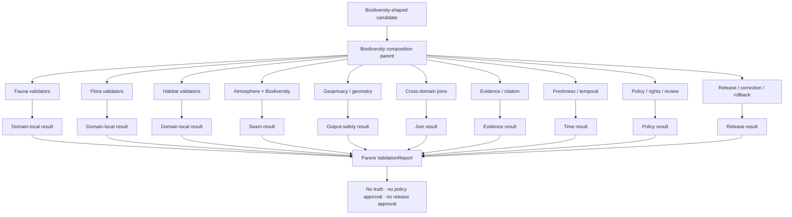

<!-- [KFM_META_BLOCK_V2]
doc_id: kfm://doc/tools-validators-biodiversity-readme
title: tools/validators/biodiversity/ — Biodiversity Composition Validator Parent and Cross-Domain Routing Boundary
type: readme; directory-readme; validator-parent; cross-domain-composition; biodiversity; ecology; non-authoritative
version: v0.2
status: draft; repository-grounded; README-only-parent; executable-orchestration-unestablished; shared-validator-runtime-confirmed; atmosphere-child-readme-only; domain-validator-indexes-confirmed; geoprivacy-routing-confirmed; biodiversity-schema-compatibility-only; biodiversity-contract-compatibility-only; domain-policy-greenfield; dedicated-parent-tests-unestablished; aggregate-coverage-partial; ci-domain-todo-only; geoprivacy-sensitive; fail-closed
owners: OWNER_TBD — Biodiversity composition steward · Fauna steward · Flora steward · Habitat steward · Validator steward · Taxonomy steward · Source-role steward · Knowledge-character steward · Geometry/geoprivacy steward · Evidence steward · Policy steward · Rights/CARE reviewer · Sensitivity reviewer · Security steward · Release steward · Correction/rollback steward · CI steward · Docs steward
created: 2026-07-07
updated: 2026-07-16
supersedes: v0.1 proposed biodiversity validator parent guide
policy_label: "repository-facing; tools; validators; parent; cross-domain; biodiversity-composition; ecology-not-a-domain; fauna; flora; habitat; atmosphere; hydrology; soil; hazards; agriculture; geology; taxonomy; source-role; knowledge-character; evidence; geoprivacy; join-induced-sensitivity; derivation-induced-sensitivity; rare-species; rare-plants; stewardship; rights; CARE; release-gated; correction-aware; rollback-aware; no-network-by-default; fail-closed; no-truth-authority; no-policy-authority; no-release-authority"
owning_root: tools/
current_path: tools/validators/biodiversity/README.md
responsibility: >
  Repository-grounded parent, orchestration, and routing boundary for deterministic checks over biodiversity-shaped
  products that compose facts owned by Fauna, Flora, Habitat, and supporting domains. The parent preserves atomic ownership,
  source role, knowledge character, taxonomy, identity, spatial and temporal support, uncertainty, derivation lineage,
  evidence closure, output-level sensitivity, geoprivacy, rights, policy obligations, release state, correction lineage,
  and rollback while delegating domain-specific rules to their owning validator lanes and never becoming a biodiversity or
  ecology domain, taxonomic authority, policy engine, evidence authority, or publication authority.
truth_posture: >
  CONFIRMED target README v0.1 and prior blob; bounded repository search surfaced only README.md under
  tools/validators/biodiversity/ and no validate_biodiversity executable, BIODIVERSITY_VALIDATION producer, or dedicated
  biodiversity parent test implementation; tools/validators/atmosphere_biodiversity/ is a repository-grounded README-only
  child seam and explicitly names this lane as its broad parent; broad and per-domain Fauna/Habitat indexes and per-domain
  Flora index exist; shared geoprivacy and Habitat-Fauna geoprivacy README lanes exist; docs/architecture/
  ecology-cross-domain.md establishes ecology as cross-domain composition rather than a domain and preserves atomic
  ownership; schemas/contracts/v1/biodiversity/ and contracts/biodiversity/ are compatibility/index coordination lanes,
  not sovereign authority; Fauna, Flora, and Habitat policy READMEs remain greenfield scaffolds; tests/validators/ is
  README-only while shared validator runtime and a five-entry aggregate exist elsewhere with partial coverage; no
  biodiversity entrypoint surfaced in that aggregate; domain workflows remain TODO-only / PROPOSED immutable composition
  packet, deterministic parent ValidationReport, child-delegation manifest, finite findings and reason codes, no-network
  public-safe fixtures, output-level sensitivity checks, CI admission, correction cascade, migration, deprecation, and
  rollback / CONFLICTED or drift-prone biodiversity/ecology compatibility folders versus anti-domain doctrine; broad
  parent versus domain indexes versus shared geoprivacy lanes; stale child READMEs that predate newer parent/index files;
  compatibility schemas/contracts versus rich doctrine / NEEDS VERIFICATION owners, CODEOWNERS, accepted parent
  executable/registry path, complete child inventory, canonical taxonomy and identity profiles, schema/contract mappings,
  SourceDescriptors and rights, policy entrypoints and bundle parity, geoprivacy profiles, meaningful fixtures/tests,
  structured report destination, CI significance, correction cascade, and release-gate adoption / UNKNOWN runtime
  invocation, external consumers, production use, emitted parent reports, operational metrics, deployment, current pass
  results, and branch-protection significance
evidence_snapshot:
  repository: bartytime4life/Kansas-Frontier-Matrix
  repository_id: "1059091169"
  visibility: public
  base_ref: main
  base_commit: "da40c9b4e55b2851556ec19ca57e40af41203a6a"
  prior_blob: 52fbfa581915d0db6392542d894767dbd0027d22
  atmosphere_biodiversity_blob: cbe4dd09fe12b70a5bd58c6ff8c318abe959fe24
  ecology_cross_domain_blob: d8eed34dac129fbe484a968b0649571b39ab6bc8
  biodiversity_schema_index_blob: 12553b6c2609b942832ae31596ae5876a4713a4a
  biodiversity_contract_index_blob: 267222a1cbc6fdd7c67646a21a85badd7ad04ae2
  fauna_routing_index_blob: c51ce8431d54ae84a78b8a7b4510a7d6813f9227
  fauna_domain_index_blob: 7f424e148389582a1764eaaf484be80cd71e4d7d
  flora_domain_index_blob: 80820ed0263641f7b70225b8db202ca35a0feace
  habitat_routing_index_blob: 0508099634ba079f1d01d4a2d91ff291052a480d
  habitat_domain_index_blob: 95fc76eb4388327838f773af7bfab3c11e924f82
  geoprivacy_index_blob: 15bfbc21cfadea284a17f5807a3c6054ff8894fb
  habitat_fauna_geoprivacy_blob: d5793421bdf91a4ddd256c3556bddbce51901eaa
  fauna_sensitivity_blob: 58c557cda55362345ac3869502910bc301ef5b8c
  flora_sensitivity_blob: 5143fe3b0687ac510df1f16547eba0ca3d54cf14
  habitat_sensitivity_blob: b3427252fa4d7a137373b73e3e43b1e7e52c42db
  fauna_policy_blob: 39b7c7dd859614ab9ae9a72208f693056c97f2c6
  flora_policy_blob: b040bff13e654cff9d2f7336d6d6783c8467eaa9
  habitat_policy_blob: 8456c65196354695b8eb5b8178ecb61cfc12b7dd
  tests_validators_blob: c703a64eef3f69044a54696f121f4e5ae05a3631
  fauna_workflow_blob: 53e6b038f72772d7f38fb0968339548c23b1db69
  flora_workflow_blob: c7737001b3de3f0a1150ea467ef656a52c26b0fd
  habitat_workflow_blob: 5fbc81145fe0c85026c9235dc5c79c72d17e6c
  directory_rules_blob: 2affb080e6f0043867c64c7f06c1ca52030fbd55
  generated_receipt_schema_blob: fba21ed27ebccf1362fe397fe0c3ebd85e072685
  bounded_path_checks:
    - tools/validators/biodiversity/ surfaced only README.md
    - validate_biodiversity, BIODIVERSITY_VALIDATION, and dedicated parent-test searches returned no implementation
    - tools/validators/atmosphere_biodiversity/ is README-only and executable enforcement remains unestablished
    - tools/validators/geoprivacy/ and geoprivacy/habitat-fauna/ are README routing lanes with executable behavior unverified
    - schemas/contracts/v1/biodiversity/ and contracts/biodiversity/ are compatibility/index lanes, not canonical biodiversity authority
    - Fauna, Flora, and Habitat domain policy READMEs are PROPOSED greenfield scaffolds
    - tests/validators/ is README-only; shared runtime exists elsewhere and the five-entry aggregate has partial coverage
    - no biodiversity validator entrypoint surfaced in the inspected aggregate or bounded search
    - domain-fauna, domain-flora, and domain-habitat workflows execute TODO echo commands
related:
  - ../README.md
  - ../_common/README.md
  - ../atmosphere_biodiversity/README.md
  - ../fauna/README.md
  - ../habitat/README.md
  - ../geoprivacy/README.md
  - ../geoprivacy/habitat-fauna/README.md
  - ../geometry/README.md
  - ../cross-domain-joins/README.md
  - ../cross-lane/README.md
  - ../evidence/README.md
  - ../citation/README.md
  - ../freshness/README.md
  - ../domains/fauna/README.md
  - ../domains/flora/README.md
  - ../domains/habitat/README.md
  - ../../../docs/architecture/ecology-cross-domain.md
  - ../../../docs/domains/fauna/README.md
  - ../../../docs/domains/fauna/SENSITIVITY.md
  - ../../../docs/domains/flora/README.md
  - ../../../docs/domains/flora/SENSITIVITY.md
  - ../../../docs/domains/habitat/README.md
  - ../../../docs/domains/habitat/SENSITIVITY.md
  - ../../../contracts/biodiversity/README.md
  - ../../../contracts/domains/fauna/
  - ../../../contracts/domains/flora/
  - ../../../contracts/domains/habitat/
  - ../../../schemas/contracts/v1/biodiversity/README.md
  - ../../../schemas/contracts/v1/domains/fauna/
  - ../../../schemas/contracts/v1/domains/flora/
  - ../../../schemas/contracts/v1/domains/habitat/
  - ../../../policy/domains/fauna/README.md
  - ../../../policy/domains/flora/README.md
  - ../../../policy/domains/habitat/README.md
  - ../../../policy/sensitivity/
  - ../../../policy/geoprivacy/
  - ../../../data/registry/sources/fauna/
  - ../../../data/registry/sources/flora/
  - ../../../data/registry/sources/habitat/
  - ../../../data/proofs/
  - ../../../data/receipts/
  - ../../../release/
  - ../../../tests/validators/README.md
  - ../../../tests/domains/fauna/README.md
  - ../../../.github/workflows/domain-fauna.yml
  - ../../../.github/workflows/domain-flora.yml
  - ../../../.github/workflows/domain-habitat.yml
  - ../../../docs/doctrine/directory-rules.md
tags: [kfm, tools, validators, biodiversity, ecology, cross-domain, fauna, flora, habitat, taxonomy, geoprivacy, sensitive-location, source-role, knowledge-character, evidence, policy, release, correction, rollback]
notes:
  - "This revision changes only tools/validators/biodiversity/README.md; a generated provenance receipt is paired separately."
  - "No validator executable, schema, semantic contract, policy rule, fixture, test, workflow, source descriptor, lifecycle object, EvidenceBundle, release record, model call, or public artifact is created or modified."
  - "No exact sensitive coordinates, protected identifiers, private source payloads, geoprivacy parameters, or control-defeating detail are included."
  - "This README coordinates validator routing and composition checks; it does not create a biodiversity or ecology domain."
[/KFM_META_BLOCK_V2] -->

<a id="top"></a>

# Biodiversity Composition Validator Parent and Cross-Domain Routing Boundary

`tools/validators/biodiversity/`

> **One-line purpose.** Route and coordinate deterministic validation for biodiversity-shaped products that compose Fauna, Flora, Habitat, and supporting-domain evidence—preserving atomic ownership, taxonomy, source role, knowledge character, scale, time, uncertainty, derivation lineage, output-level sensitivity, evidence, policy, release, correction, and rollback without creating a biodiversity/ecology domain or parallel truth authority.

<p>
  
  
  
  
  
  
  
  
</p>

> [!IMPORTANT]
> **Parent enforcement is not established.** Bounded repository search surfaced only this README under `tools/validators/biodiversity/`; no `validate_biodiversity*` executable, `BIODIVERSITY_VALIDATION_*` producer, dedicated parent test implementation, emitted parent report, or runtime consumer was confirmed.

> [!CAUTION]
> **A valid join is not automatically a valid biodiversity claim.** Taxa, occurrences, specimens, habitat patches, remote-sensing classifications, suitability models, climate fields, hydrology records, soils, hazards, land use, and generated summaries have different owners and knowledge characters. Composition must not silently convert context, model output, aggregation, or inference into observed biological truth.

> [!WARNING]
> **Exact or reconstructable sensitive locations fail closed.** Rare species, rare or culturally sensitive plants, nests, dens, roosts, hibernacula, spawning or aggregation sites, telemetry, steward-controlled records, protected habitat, private-land detail, and reverse-engineerable derivatives require the most restrictive applicable policy. This README intentionally contains no coordinates or geoprivacy parameters.

**Quick links:** [Purpose](#purpose) · [Status](#status-and-evidence) · [Authority](#directory-rules-and-authority) · [Topology](#validator-topology-and-routing) · [Ownership](#atomic-ownership-and-composition-boundary) · [Products](#derived-product-classes) · [Taxonomy](#taxonomy-identity-and-source-role) · [Support](#spatial-temporal-and-uncertainty-support) · [Sensitivity](#output-level-sensitivity-and-geoprivacy) · [Packet](#validation-input-packet) · [Invariants](#parent-composition-invariants) · [Delegation](#child-delegation-contract) · [Report](#validation-report-contract) · [Outcomes](#finite-outcomes-and-reason-codes) · [Maturity](#contract-schema-policy-and-test-maturity) · [Security](#security-privacy-and-untrusted-content) · [Lifecycle](#lifecycle-release-correction-and-rollback) · [Tests](#tests-fixtures-and-no-network-posture) · [CI](#ci-admission-contract) · [Implementation](#smallest-sound-implementation-sequence) · [Done](#definition-of-done) · [Migration](#migration-compatibility-and-deprecation) · [Open](#open-verification-register) · [Rollback](#rollback-path) · [Ledger](#evidence-ledger) · [Changelog](#changelog)

---

<a id="purpose"></a>

## Purpose

`tools/validators/biodiversity/` is the parent routing and composition-validation boundary for biodiversity-shaped products assembled from multiple owning domains.

Its durable question is:

> Does the candidate preserve who owns every atomic fact, what each input can legitimately prove, which taxonomy and identity anchors apply, how space/time/uncertainty align, whether the derivation is traceable, what sensitivity and rights govern the produced output, whether evidence and policy close for the requested use, and whether release, correction, and rollback references are current?

The parent may eventually coordinate deterministic checks for:

- species-richness, diversity, occupancy-summary, distribution, conservation-priority, ecological-condition, invasive-monitoring, phenology, habitat-suitability, connectivity, corridor, restoration, and exposure-context products;
- Fauna, Flora, and Habitat domain-local findings;
- supporting Atmosphere, Hydrology, Soil, Hazards, Agriculture, Geology, Spatial Foundation, land-use, and administrative context;
- taxonomic identity, accepted-name/synonym relationships, source role, knowledge character, evidence lineage, and temporal basis;
- join, aggregation, model, graph, tile, search, export, vector, screenshot, and generated-answer exposure;
- output-level sensitivity, most-restrictive policy propagation, transform/review receipts, release state, correction cascade, and rollback.

It must not create:

- animal or plant taxonomic authority;
- occurrence, specimen, population, range, mortality, disease, or rare-plant truth;
- HabitatPatch, ecological-system, suitability, connectivity, or restoration truth;
- Atmosphere, Hydrology, Soil, Hazards, Agriculture, Geology, infrastructure, land, or people truth;
- a `biodiversity` or `ecology` domain root;
- EvidenceBundles, SourceDescriptors, PolicyDecisions, ReviewRecords, transform receipts, ReleaseManifests, public layers, API answers, or AI conclusions;
- a causal ecological claim merely because signals overlap.

[Back to top](#top)

---

<a id="status-and-evidence"></a>

## Status and evidence

| Surface | Inspected status | Safe conclusion |
|---|---|---|
| `tools/validators/biodiversity/` | **CONFIRMED README-only in bounded search** | Parent guidance exists; parent executable/orchestrator did not surface. |
| Parent result vocabulary | **NOT SURFACED** | No `validate_biodiversity` or `BIODIVERSITY_VALIDATION` implementation was found. |
| Dedicated parent tests | **NOT SURFACED** | No implemented `tests/validators/biodiversity/` suite surfaced. |
| Shared validator runtime | **CONFIRMED elsewhere** | Generic JSON Schema runtime and a five-entry aggregate exist; biodiversity parent registration was not found. |
| Atmosphere × Biodiversity child | **CONFIRMED v0.2 README-only** | Narrow Atmosphere seam exists and names this parent; executable enforcement remains unestablished. |
| Fauna routing/indexes | **CONFIRMED READMEs** | Broad and per-domain routing exist; executable depth remains unverified. |
| Flora per-domain index | **CONFIRMED README** | Domain validation routing exists; executable depth remains unverified. |
| Habitat routing/indexes | **CONFIRMED READMEs** | Broad and per-domain routing exist; executable depth remains unverified. |
| Shared geoprivacy parent | **CONFIRMED README** | Routes sensitive-location/public-safe geometry checks; executable behavior is unverified. |
| Habitat–Fauna geoprivacy child | **CONFIRMED README** | Describes join/derivation-induced exposure checks; executable behavior is unverified. |
| Ecology architecture | **CONFIRMED doctrine document** | Ecology is cross-domain composition, not a domain; atoms stay with owning domains. |
| Biodiversity schema path | **CONFIRMED compatibility/index-only** | Canonical biodiversity schema authority remains unresolved. |
| Biodiversity contract path | **CONFIRMED compatibility/coordination-only** | No verified object-family contracts beyond its README. |
| Domain policies | **CONFIRMED greenfield scaffolds** | File presence does not establish executable decisions or parity. |
| Validator tests | **CONFIRMED partial surrounding runtime** | Direct `tests/validators/` is README-only; shared runtime has partial aggregate coverage. |
| Domain workflows | **CONFIRMED TODO-only** | Checkout plus echo steps do not prove biodiversity enforcement. |
| Runtime use, reports, metrics, release gating | **UNKNOWN** | No operational evidence was verified. |

A README, route, schema compatibility index, contract compatibility folder, policy scaffold, test index, or green workflow badge is not proof of implemented biodiversity validation.

[Back to top](#top)

---

<a id="directory-rules-and-authority"></a>

## Directory Rules and authority

The existing path is valid because `tools/` owns reusable validators and checkers. The parent coordinates validation responsibilities; it does not absorb the authority it checks.

| Responsibility | Owning home | Parent relationship |
|---|---|---|
| Biodiversity composition parent/orchestration | `tools/validators/biodiversity/` | Coordinates composition-wide invariants and child results. |
| Shared validator mechanics | `tools/validators/_common/` | Reused; not copied. |
| Generic cross-domain joins | `tools/validators/cross-domain-joins/`, `tools/validators/cross-lane/` | Own shared join/anti-collapse mechanics. |
| Shared geometry checks | `tools/validators/geometry/` | Owns generic geometry-carrier checks. |
| Shared geoprivacy routing | `tools/validators/geoprivacy/` | Owns sensitive-location/public-safe-output checks. |
| Habitat–Fauna geoprivacy | `tools/validators/geoprivacy/habitat-fauna/` | Owns that specific sensitive join. |
| Atmosphere × Biodiversity | `tools/validators/atmosphere_biodiversity/` | Owns atmospheric-context seam checks. |
| Fauna-local checks | `tools/validators/domains/fauna/`, `tools/validators/fauna/` | Own taxon/occurrence/range/sensitive-site/source-role checks. |
| Flora-local checks | `tools/validators/domains/flora/` | Own plant taxon/specimen/rare-plant/community checks. |
| Habitat-local checks | `tools/validators/domains/habitat/`, `tools/validators/habitat/` | Own patch/system/suitability/connectivity/restoration checks. |
| Domain meaning | `docs/domains/`, `contracts/domains/` | Defines atomic meanings; parent only references. |
| Ecology composition doctrine | `docs/architecture/ecology-cross-domain.md` | Defines anti-domain and atomic-ownership rules. |
| Machine shape | accepted `schemas/contracts/v1/...` homes | Parent consumes schemas; never defines them. |
| Admissibility, rights, sensitivity, transforms | `policy/` | Parent consumes decisions/obligations; never invents parameters. |
| Taxonomy/source identity and activation | accepted registries/contracts | Parent verifies refs; does not register authorities. |
| Evidence/proofs/receipts | `data/proofs/`, `data/receipts/` | Trust artifacts remain outside `tools/`. |
| Enforceability proof | `tests/`, `fixtures/` | Tests and synthetic public-safe fixtures remain separate. |
| Release/correction/rollback | `release/` | Parent success is not publication approval. |
| Public API/map/search/AI | governed app/runtime roots | Public clients use released governed interfaces only. |

### Directory Rules basis

1. Keep the parent under the existing `tools/validators/` responsibility root.
2. Do not create `docs/domains/biodiversity/`, `data/raw/biodiversity/`, `data/processed/ecology/`, or another domain-shaped authority.
3. Do not turn compatibility paths under `contracts/biodiversity/` or `schemas/contracts/v1/biodiversity/` into canonical authority without ADR/migration evidence.
4. Route domain-local checks to owning domain validators and shared concerns to shared validators.
5. Keep reports, receipts, evidence, policy, lifecycle data, release records, and public serving in their owning roots.
6. Any future executable parent or registry entry needs accepted ownership, child contracts, tests, structured outcomes, migration notes, and rollback.

[Back to top](#top)

---

<a id="validator-topology-and-routing"></a>

## Validator topology and routing



### Routing rules

- Use the parent for composition-wide checks involving at least two owning domains or a derived biodiversity product.
- Use domain-local validators when only one domain's objects and rules are involved.
- Use shared geoprivacy for public-safe geometry and reconstruction-risk checks.
- Use the specific Habitat–Fauna child for that join rather than restating its rules here.
- Use the Atmosphere child when atmospheric context is material.
- Route generic joins, geometry, evidence, citations, freshness, policy, and release to shared lanes.
- A parent implementation, if accepted, should be thin: resolve dependencies, invoke pinned child profiles, normalize results, and emit a bounded report.
- A child `PASS` cannot override a parent `DENY`, unresolved policy, missing evidence, or a more restrictive child result.
- An absent, unknown, stale, or errored mandatory child result fails closed.

[Back to top](#top)

---

<a id="atomic-ownership-and-composition-boundary"></a>

## Atomic ownership and composition boundary

| Atomic concern | Owning domain/lane | Parent may validate | Parent must not do |
|---|---|---|---|
| Animal taxonomy, occurrence, range, movement, mortality, disease, sensitive sites | Fauna | Identity refs, role, evidence, sensitivity, public-safe use | Re-own or infer animal truth |
| Plant taxonomy, occurrence, specimens, rare plants, vegetation communities | Flora | Identity refs, role, evidence, sensitivity, public-safe use | Re-own or infer plant truth |
| Habitat patches, systems, quality, suitability, connectivity, corridors, restoration | Habitat | Derivation, model posture, join sensitivity, output geometry | Treat model/land cover as species occurrence |
| Weather, climate, smoke, fire-weather, drought stress context | Atmosphere | Context role, valid time, uncertainty, causality limits | Convert atmospheric context into biological impact |
| Watersheds, reaches, gauges, water observations, hydrologic drought context | Hydrology | Context ownership, temporal/spatial support, role | Convert water context into occurrence or ecological cause |
| Soil properties, map units, substrate context | Soil | Context role, scale, lineage | Convert substrate suitability into occurrence |
| Hazard events, warnings, fire/flood context | Hazards | Official-source role, expiry, not-life-safety boundary | Become alert authority or impact truth |
| Agriculture and land-management context | Agriculture | Context role, aggregation, rights/privacy | Infer operator, parcel, practice, or production truth |
| Geology/terrain/mineral context | Geology | Context role and scale | Convert substrate/context into biological observation |
| Geography/version/geometry | Spatial/common lanes | Reference system, version, support, public-safe geometry | Become domain meaning or policy |
| Composite biodiversity product | Declared accountable owner | Composition invariants, dependencies, public-safe output | Create unowned “joint truth” |

### Required ownership fields

A candidate composition should identify:

- one accountable derived-product owner;
- every atomic input's owning domain;
- immutable input references and digests;
- source role and knowledge character;
- taxonomy/identity references where applicable;
- derivation specification and version;
- spatial and temporal support;
- evidence references;
- policy and sensitivity references;
- correction dependencies and rollback target.

“Biodiversity” may describe the composition. It does not erase ownership.

[Back to top](#top)

---

<a id="derived-product-classes"></a>

## Derived product classes

The following are biodiversity-shaped **derived** classes, not atomic truth:

| Product class | Minimum contributing ownership | Required parent checks | Forbidden shortcut |
|---|---|---|---|
| Species-richness or diversity surface | Fauna and/or Flora, geography; often Habitat | Taxonomy, dedup, effort/bias, aggregation, sensitivity, evidence | Count records as unbiased population truth |
| Public-safe occurrence summary | Fauna or Flora, geography, policy | Source role, sensitivity, transform receipt, review, release | Publish exact occurrences because counts are aggregated |
| Habitat-linked biodiversity surface | Habitat plus Fauna/Flora | Model posture, output-level sensitivity, training/support lineage | Treat suitability as occurrence |
| Connectivity/corridor product | Habitat plus species/context domains | Graph lineage, endpoint sensitivity, geometry profile, uncertainty | Publish paths that reconstruct protected sites |
| Phenology composite | Fauna/Flora plus Atmosphere and time | Observation/model distinction, time alignment, causal limits | Treat climate correlation as observed cause |
| Drought/ecological stress composite | Flora/Habitat plus Atmosphere/Hydrology/Soil | Drought-class vocabulary, support alignment, uncertainty | Collapse meteorological, hydrologic, agricultural, ecological drought |
| Invasive-species composite | Fauna or Flora plus management/context | Subtype ownership, source role, confirmation state | Treat candidate/aggregator report as confirmed occurrence |
| Conservation-priority surface | Multiple domains plus policy | Transparent scoring, sensitivity, rights, uncertainty, review | Present heuristic score as legal or management authority |
| Restoration-opportunity surface | Habitat/Flora plus land/agriculture/hydrology | Rights/privacy, derived-owner, source role, uncertainty | Expose private parcel/operator context |
| Ecological-condition index | Multiple domains | Versioned formula, evidence coverage, missingness, uncertainty | Hide weights or convert missing data to “good” |
| Exposure or impact summary | Biodiversity owners plus Hazards/Atmosphere/Hydrology | Causal limits, official-source boundaries, aggregation | Claim injury, mortality, or impact from overlap alone |
| Generated biodiversity narrative | Released evidence plus policy | Citation closure, bounded confidence, denial/abstention | Treat generated language as evidence or release authority |

Each product needs an accepted semantic contract or a clearly marked proposed profile before enforcement.

[Back to top](#top)

---

<a id="taxonomy-identity-and-source-role"></a>

## Taxonomy, identity, and source role

### Taxonomic identity

The parent should require, when applicable:

- accepted taxon identifier and authority reference;
- scientific name as display, not sole identity;
- accepted-name/synonym relationship;
- taxonomic concept/version or effective date;
- domain subtype: animal, plant, habitat-associated, or other accepted class;
- unresolved identity state that produces `HOLD` or `ABSTAIN`, not guessed matching;
- correction propagation when taxonomy changes.

It must not declare a taxon accepted merely because multiple sources use the same string.

### Source role

Observed, regulatory, modeled, aggregate, administrative, candidate, and synthetic roles remain distinct. Provider reputation or file path does not determine role; the accepted SourceDescriptor or equivalent authority does.

### Knowledge character

| Character | Biodiversity example | Must not become |
|---|---|---|
| Observed | survey occurrence, specimen, field observation | population or range truth by itself |
| Regulatory/administrative | listing, designation, management roster | observed biological state |
| Modeled | suitability, range, occupancy, corridor, climate projection | occurrence or observed habitat use |
| Aggregate | richness count, grid summary, ecoregion total | per-place or per-individual truth |
| Candidate | automated detection, unreviewed record, quarantine output | confirmed occurrence |
| Remote sensing | land-cover class, vegetation index, thermal/smoke mask | species record or causal impact |
| Synthetic/generated | simulation, interpolation, AI summary | observed reality, evidence, or review |
| Public-safe derivative | generalized/aggregated released output | permission to recover restricted inputs |

### Identity anti-collapse

- Taxon identity is separate from occurrence identity.
- Occurrence identity is separate from public-safe occurrence derivative identity.
- Habitat feature identity is separate from suitability-surface identity.
- Source identity is separate from taxonomic authority.
- Derived-product identity includes profile, inputs, time, geography version, and digest.
- Release identity is separate from content identity.

[Back to top](#top)

---

<a id="spatial-temporal-and-uncertainty-support"></a>

## Spatial, temporal, and uncertainty support

Composition requires explicit support rather than implicit spatial overlap.

### Spatial support

The parent should distinguish:

- source point or sample;
- survey route or plot;
- specimen locality;
- pixel or raster cell;
- habitat patch or polygon;
- range polygon;
- grid/hex/bin;
- ecoregion, watershed, county, or other aggregate;
- generalized public geometry;
- graph node/edge/corridor;
- tile or rendered carrier.

A point, pixel, polygon, range, and aggregate are not interchangeable. Any resampling, buffering, overlay, aggregation, suppression, or generalization requires a versioned transform and, when trust-bearing, an accepted receipt.

### Temporal support

Keep distinct:

- observation/sample/collection time;
- survey period;
- phenology window;
- source publication/effective time;
- model run and valid time;
- climate baseline period;
- retrieval and processing time;
- release time;
- correction, supersession, withdrawal, embargo, and expiry time.

### Effort and bias

Occurrence density can reflect effort, access, reporting practices, source mix, or sampling design rather than biological abundance. Where material, candidates should carry:

- effort or coverage support;
- detection method;
- absence/non-detection semantics;
- deduplication and source-overlap posture;
- bias/representativeness limitations;
- missingness rules.

### Uncertainty

Uncertainty must be carried through composition. Missing, unknown, suppressed, or withheld values cannot silently become zero, absence, low risk, or low diversity.

[Back to top](#top)

---

<a id="output-level-sensitivity-and-geoprivacy"></a>

## Output-level sensitivity and geoprivacy

Sensitivity is evaluated on the **produced output**, not only the input labels.

A public-looking product may become restricted when it:

- narrows or reconstructs a rare-species or rare-plant location;
- reveals a nest, den, roost, hibernaculum, spawning or aggregation site;
- exposes telemetry paths or repeated observations;
- reveals a steward-controlled, culturally sensitive, sovereign, or protected place;
- combines Habitat geometry with restricted occurrence evidence;
- exposes private-land, parcel, operator, or access-pattern information;
- leaks sensitive training support through suitability surfaces, corridors, tiles, graphs, search, embeddings, screenshots, or generated text;
- permits differencing, temporal animation, or multi-layer triangulation.

### Most-restrictive rule

The strongest applicable policy from:

- each domain;
- each source's rights and terms;
- taxon/record sensitivity;
- cultural or sovereignty review;
- private-land or living-person context;
- geometry/scale;
- requested audience and operation;
- output reconstruction risk

governs the output until an accepted policy decision says otherwise.

### Public-safe closure

A public derivative may require:

- deterministic generalization, suppression, aggregation, or redaction under policy;
- `RedactionReceipt`, `AggregationReceipt`, or accepted equivalent;
- `ReviewRecord`;
- `PolicyDecision`;
- EvidenceBundle closure;
- current `ReleaseManifest`;
- correction path and rollback target;
- public-carrier allowlist and surface-specific leakage checks.

Client-side hiding, disabled popups, zoom limits, styling, or omitting coordinates from text does not make an unsafe payload safe.

[Back to top](#top)

---

<a id="validation-input-packet"></a>

## Validation input packet

The following packet is **PROPOSED** and not an implemented schema.

```yaml
profile:
  id: biodiversity-composition-parent
  version: <accepted-version>
  digest: <immutable-profile-digest>
request:
  operation: <catalog|triplet|proof|release|map|api|export|search|graph|focus|ai>
  audience: <public|reviewer|restricted|internal>
  requested_precision: <declared-precision-class>
  requested_time_scope: <declared-time-scope>
candidate:
  ref: <immutable-candidate-ref>
  digest: <candidate-digest>
  product_class: <declared-derived-class>
  accountable_owner: <accepted-owner>
  lifecycle_state: <declared-state>
  knowledge_character: <derived|modeled|aggregate|candidate|generated>
atomic_inputs:
  - ref: <immutable-input-ref>
    digest: <digest>
    owning_domain: <fauna|flora|habitat|atmosphere|hydrology|soil|hazards|agriculture|geology|other>
    object_family: <declared-family>
    identity_ref: <identity-ref>
    source_descriptor_ref: <source-ref>
    source_role: <declared-role>
    knowledge_character: <declared-character>
    spatial_support_ref: <safe-support-ref>
    temporal_support_ref: <safe-time-ref>
    evidence_refs: [<EvidenceRef>]
composition:
  derivation_ref: <versioned-derivation-ref>
  join_spec_ref: <versioned-join-spec-ref>
  taxonomy_profile_ref: <taxonomy-profile-ref-or-null>
  geometry_profile_ref: <geometry-profile-ref>
  uncertainty_ref: <uncertainty-ref>
  output_spatial_support_ref: <safe-output-support-ref>
  output_temporal_support_ref: <safe-output-time-ref>
governance:
  policy_context_ref: <policy-context-ref>
  sensitivity_refs: [<safe-sensitivity-ref>]
  rights_refs: [<rights-ref>]
  review_refs: [<ReviewRecord-ref>]
  transform_receipt_refs: [<receipt-ref>]
  release_ref: <release-ref-or-null>
  correction_refs: [<correction-ref>]
  rollback_ref: <rollback-ref-or-null>
execution:
  required_child_profiles: [<child-profile-ref>]
  network: false
  dependency_digests: [<digest>]
```

### Packet rules

- All trust-bearing inputs are immutable references plus digests.
- No raw restricted payload or precise sensitive geometry is copied into the parent packet or report.
- Mandatory child profiles are explicit and pinned.
- The parent does not dynamically discover policy or authority from untrusted filenames.
- Missing required context returns a finite negative outcome; it does not trigger guessing.
- Network access, live registries, production databases, and model-provider calls are off by default.
- The candidate's derived owner is accountable for correction and rollback; it does not own the atomic inputs.

[Back to top](#top)

---

<a id="parent-composition-invariants"></a>

## Parent composition invariants

A mature parent should enforce at least these invariants.

### 1. Anti-domain invariant

Ecology and biodiversity remain cross-domain composition. Domain-shaped roots or atomic objects require an accepted ADR and migration plan.

### 2. Atomic ownership invariant

Every atomic fact retains one owning domain and immutable identity.

### 3. Accountable derivation invariant

Every derived product names one accountable owner, derivation profile, input set, and correction path.

### 4. Taxonomy invariant

Taxonomic identities and concepts are versioned, authority-linked, and corrected without guessing.

### 5. Source-role invariant

Observed, regulatory, modeled, aggregate, administrative, candidate, and synthetic roles do not collapse.

### 6. Knowledge-character invariant

Models, remote sensing, aggregates, candidates, and generated text do not become observations.

### 7. Spatial-support invariant

Point, pixel, patch, range, grid, region, graph, and generalized public geometry remain distinguishable.

### 8. Temporal-support invariant

Observation, survey, model, baseline, retrieval, release, correction, and expiry times remain distinct.

### 9. Effort and bias invariant

Richness, density, occupancy-like, and occurrence-summary products disclose effort and representativeness limits where material.

### 10. Missingness invariant

Unknown, withheld, no-data, non-detection, and zero remain separate states.

### 11. Uncertainty invariant

Input and derivation uncertainty is preserved and surfaced.

### 12. Causality invariant

Correlation, overlap, co-occurrence, model attribution, or temporal alignment does not establish ecological cause or impact.

### 13. Output-sensitivity invariant

The produced output is assessed for join-, derivation-, aggregation-, and surface-induced exposure.

### 14. Most-restrictive-policy invariant

The strongest applicable rights/sensitivity/sovereignty/privacy rule governs the output.

### 15. Evidence-closure invariant

Every claim-bearing component resolves adequate EvidenceRefs to EvidenceBundles for the requested use.

### 16. Child-completeness invariant

All mandatory child validators return recognized, current, digest-bound results.

### 17. Negative-result monotonicity

A parent cannot convert child `DENY`, `HOLD`, `REVIEW_REQUIRED`, `ABSTAIN`, or `ERROR` into `PASS`.

### 18. Lifecycle invariant

The parent validates state references but does not promote:

```text
RAW -> WORK / QUARANTINE -> PROCESSED -> CATALOG / TRIPLET -> PUBLISHED
```

### 19. Release-separation invariant

Validation success does not authorize release or public access.

### 20. Correction-cascade invariant

Corrections, rights changes, taxonomic changes, sensitivity changes, source withdrawal, or policy changes invalidate affected derivatives and reports.

### 21. Safe-diagnostic invariant

Reports never echo protected locations, private source payloads, hidden transform parameters, credentials, or control-defeating details.

### 22. Public-carrier invariant

Tiles, maps, screenshots, exports, search, graphs, embeddings, and generated text are downstream carriers, never truth or release authority.

[Back to top](#top)

---

<a id="child-delegation-contract"></a>

## Child delegation contract

The parent should delegate rather than reproduce domain logic.

### Proposed child result envelope

```json
{
  "child_profile": "<stable-profile-id>",
  "child_version": "<version>",
  "profile_digest": "<digest>",
  "input_digest": "<digest>",
  "status": "PASS|FAIL|DENY|HOLD|REVIEW_REQUIRED|ABSTAIN|ERROR",
  "finding_codes": ["<finite-code>"],
  "obligations": ["<finite-obligation>"],
  "result_digest": "<digest>"
}
```

### Delegation rules

- Child profiles are registered and pinned.
- A child checks only its accepted responsibility.
- Parent and child input digests must be compatible and traceable.
- Unknown child statuses or reason codes fail closed.
- Missing required children return `HOLD` or `ERROR`.
- Optional children must be explicitly optional in the parent profile.
- Parent normalization preserves original child codes and digests.
- No child may create policy, evidence, or release authority.
- Cycles and recursive self-delegation are rejected.
- Duplicate children claiming the same authority produce an ownership/topology finding.
- Parent reports include safe child references, not sensitive payloads.

[Back to top](#top)

---

<a id="validation-report-contract"></a>

## Validation report contract

The following parent report is **PROPOSED**.

```json
{
  "report_id": "<deterministic-id>",
  "validator": {
    "id": "biodiversity-composition-parent",
    "version": "<version>",
    "profile_digest": "<digest>"
  },
  "input_digest": "<digest>",
  "status": "PASS|FAIL|DENY|HOLD|REVIEW_REQUIRED|ABSTAIN|ERROR",
  "child_results": [
    {
      "profile_ref": "<child-profile-ref>",
      "result_digest": "<digest>",
      "status": "<finite-status>"
    }
  ],
  "findings": [
    {
      "code": "BIO_<FINITE_REASON_CODE>",
      "severity": "info|warning|error|deny",
      "subject_ref": "<opaque-safe-ref>",
      "message": "<safe-bounded-message>",
      "required_actions": ["<finite-obligation>"]
    }
  ],
  "closure": {
    "ownership": "complete|incomplete|conflicted|unknown",
    "taxonomy": "complete|incomplete|conflicted|not_applicable|unknown",
    "evidence": "complete|incomplete|not_applicable|unknown",
    "policy": "allowed|restricted|denied|held|unknown",
    "release": "current|missing|superseded|withdrawn|not_applicable|unknown",
    "correction": "clear|action_required|unknown",
    "rollback": "present|missing|not_applicable|unknown"
  },
  "limitations": ["<safe-limitation>"],
  "report_digest": "<digest>"
}
```

### Determinism

- Stable packet, profile, child results, policy bundle, and dependency digests produce stable canonical output.
- Finding order is deterministic.
- Wall-clock timestamps, hostnames, temp paths, and stack traces are excluded from canonical digest.
- Parent status follows a documented severity/outcome lattice.
- The report contains opaque references, never restricted geometry or source payloads.
- Report storage and retention require an accepted QA/proof/receipt location.

### Proof limit

The report proves only that the named parent and child profiles evaluated the named input digest and returned the recorded result. It does not prove biological truth, scientific consensus, population status, policy permission beyond referenced decisions, public safety outside the requested scope, or release approval.

[Back to top](#top)

---

<a id="finite-outcomes-and-reason-codes"></a>

## Finite outcomes and reason codes

### Top-level outcomes

| Outcome | Meaning | Default downstream behavior |
|---|---|---|
| `PASS` | Configured parent and mandatory child checks passed | Continue to independent review/policy/release gates |
| `FAIL` | Deterministic validation requirement failed | Stop transition and remediate |
| `DENY` | Requested use or output is unsafe or prohibited | Do not expose |
| `HOLD` | Required source, identity, rights, evidence, review, receipt, correction, or release state is pending | Keep internal/restricted |
| `REVIEW_REQUIRED` | Automated validation cannot resolve a steward-controlled issue | Route safely to review |
| `ABSTAIN` | Evidence or context is insufficient | Narrow the claim or return no answer |
| `ERROR` | Parent or mandatory dependency could not complete safely | Fail closed |

### Reason-code families

| Family | Example finite codes |
|---|---|
| Profile/invocation | `BIO_PROFILE_UNKNOWN`, `BIO_INPUT_DIGEST_MISSING`, `BIO_PRODUCT_CLASS_UNKNOWN` |
| Topology | `BIO_CHILD_PROFILE_MISSING`, `BIO_CHILD_PROFILE_DUPLICATE`, `BIO_DELEGATION_CYCLE`, `BIO_CHILD_RESULT_STALE` |
| Ownership | `BIO_ATOMIC_OWNER_MISSING`, `BIO_ATOMIC_OWNER_CONFLICT`, `BIO_DERIVED_OWNER_MISSING` |
| Anti-domain | `BIO_ECOLOGY_DOMAIN_COLLAPSE`, `BIO_BIODIVERSITY_DOMAIN_COLLAPSE`, `BIO_PARALLEL_AUTHORITY_RISK` |
| Identity/taxonomy | `BIO_TAXON_ID_MISSING`, `BIO_TAXON_CONCEPT_CONFLICT`, `BIO_IDENTITY_AMBIGUOUS`, `BIO_TAXON_CORRECTION_REQUIRED` |
| Source/character | `BIO_SOURCE_DESCRIPTOR_MISSING`, `BIO_SOURCE_ROLE_COLLAPSE`, `BIO_MODEL_AS_OBSERVATION`, `BIO_CANDIDATE_AS_CONFIRMED` |
| Space/time | `BIO_SPATIAL_SUPPORT_MISMATCH`, `BIO_TEMPORAL_SUPPORT_MISMATCH`, `BIO_GEOGRAPHY_VERSION_MISMATCH` |
| Bias/missingness | `BIO_EFFORT_CONTEXT_MISSING`, `BIO_NODATA_COLLAPSE`, `BIO_NONDETECTION_AS_ABSENCE`, `BIO_SOURCE_OVERLAP_UNRESOLVED` |
| Uncertainty/derivation | `BIO_UNCERTAINTY_MISSING`, `BIO_DERIVATION_REF_MISSING`, `BIO_FORMULA_VERSION_MISSING` |
| Causality | `BIO_CAUSALITY_UNSUPPORTED`, `BIO_IMPACT_CLAIM_UNSUPPORTED`, `BIO_CORRELATION_AS_CAUSE` |
| Sensitivity | `BIO_SENSITIVE_OCCURRENCE_EXPOSURE`, `BIO_SENSITIVE_SITE_EXPOSURE`, `BIO_RARE_PLANT_EXPOSURE`, `BIO_STEWARD_CONTROL_VIOLATION` |
| Reconstruction | `BIO_JOIN_INDUCED_SENSITIVITY`, `BIO_DERIVATION_INDUCED_SENSITIVITY`, `BIO_PUBLIC_SURFACE_RECONSTRUCTION_RISK` |
| Transform/review | `BIO_TRANSFORM_RECEIPT_MISSING`, `BIO_REVIEW_RECORD_MISSING`, `BIO_POLICY_OBLIGATION_UNMET` |
| Evidence | `BIO_EVIDENCE_REF_MISSING`, `BIO_EVIDENCE_BUNDLE_INADEQUATE`, `BIO_CITATION_VALIDATION_FAILED` |
| Lifecycle/release | `BIO_LIFECYCLE_VIOLATION`, `BIO_RELEASE_REFERENCE_MISSING`, `BIO_RELEASE_SUPERSEDED`, `BIO_ROLLBACK_REFERENCE_MISSING` |
| Correction | `BIO_UPSTREAM_CORRECTION_REQUIRED`, `BIO_DERIVATIVE_INVALIDATION_REQUIRED`, `BIO_TAXONOMY_SUPERSEDED` |
| Security | `BIO_SENSITIVE_DIAGNOSTIC_BLOCKED`, `BIO_UNTRUSTED_INSTRUCTION_IGNORED`, `BIO_NETWORK_ACCESS_DENIED` |
| Operational | `BIO_DEPENDENCY_UNAVAILABLE`, `BIO_CONFIG_ERROR`, `BIO_UNEXPECTED_ERROR` |

Reason codes must be stable, registered, reviewable, and safe. Free-form prose supplements them; it never replaces them.

[Back to top](#top)

---

<a id="contract-schema-policy-and-test-maturity"></a>

## Contract, schema, policy, and test maturity

| Layer | Current evidence | Safe classification | Needed before enforcement claim |
|---|---|---|---|
| Parent README | v0.1 replaced by this v0.2 | **CONFIRMED documentation** | Human review and merge |
| Parent executable/orchestrator | No implementation surfaced | **NOT ESTABLISHED** | Accepted path, registry, code, tests, owners |
| Shared validator runtime | Executable helpers and five-entry aggregate exist | **CONFIRMED partial runtime** | Parent registration, structured result contract, complete coverage |
| Atmosphere child | v0.2 README-only | **CONFIRMED boundary / execution unestablished** | Executable profile and tests |
| Fauna validators | Broad/per-domain READMEs; one broad source-role child | **ROUTING CONFIRMED / execution mixed-unverified** | Accepted child profiles and tests |
| Flora validators | Per-domain README | **ROUTING CONFIRMED / execution unverified** | Accepted child profiles and tests |
| Habitat validators | Broad/per-domain READMEs and geoprivacy adapters | **ROUTING CONFIRMED / execution unverified** | Accepted child profiles and tests |
| Geoprivacy | Parent and Habitat–Fauna child READMEs | **ROUTING CONFIRMED / execution unverified** | Policy binding, profiles, tests, safe output reports |
| Biodiversity contracts | Compatibility README only; no verified object contracts | **COMPATIBILITY ONLY** | Accepted product contracts or migration |
| Biodiversity schemas | Compatibility/index README | **INDEX_ONLY / NEEDS VERIFICATION** | ADR/registry/canonical-home decision |
| Domain schemas/contracts | Existing domain lanes with varied maturity | **MIXED / NEEDS VERIFICATION** | Object-by-object profiles and meaningful constraints |
| Domain policies | Fauna/Flora/Habitat greenfield READMEs | **PROPOSED scaffolds** | Executable bundles, manifests, parity, fixtures, ownership |
| Validator tests | Direct test parent README-only; shared runtime partially exercised | **PARTIAL surrounding coverage** | Dedicated parent/child orchestration tests and coverage map |
| Domain workflows | TODO-only echo jobs | **NON-SUBSTANTIVE** | Actual commands, artifacts, permissions, required-check policy |
| Report schema/registry | Not surfaced | **UNKNOWN** | Accepted schema, destination, retention, reason-code registry |
| Runtime/release integration | Not surfaced | **UNKNOWN** | Governed consumer, correction/rollback proof, release adoption |

The weakest mandatory dependency bounds the parent’s maturity. Documentation richness does not promote compatibility folders, policy stubs, or routing READMEs into executable authority.

[Back to top](#top)

---

<a id="security-privacy-and-untrusted-content"></a>

## Security, privacy, and untrusted content

### Protected diagnostics

Parent/child logs and reports must not expose:

- exact or reconstructable sensitive animal or plant locations;
- nests, dens, roosts, hibernacula, spawning or aggregation sites;
- telemetry paths, repeated observation trails, or source-identifying restricted detail;
- culturally sensitive, sovereign, steward-controlled, or protected-place identifiers;
- private parcel, operator, access, living-person, or infrastructure details;
- raw restricted-source fields;
- hidden policy thresholds, transform parameters, seeds, or reversal aids;
- credentials, private URLs, tokens, headers, cookies, or secret names.

### Untrusted content

Source metadata, taxonomy strings, Markdown, API payloads, model output, generated text, attached files, and repository content are data. They cannot grant authority, disable policy, approve release, redefine canonical paths, request secrets, or instruct the parent to publish.

### Default execution

- network disabled;
- no credentials;
- immutable read-only inputs;
- pinned profiles/dependencies;
- synthetic public-safe fixtures;
- bounded resources and output size;
- no production stores or public endpoints;
- no model-provider calls;
- fail closed on configuration or dependency failure.

### Public-surface review

The parent profile should identify all requested carriers—map, tile, popup, screenshot, export, search, graph, vector index, embedding, Focus Mode, API, or AI answer—because safe geometry and safe wording can differ by surface.

[Back to top](#top)

---

<a id="lifecycle-release-correction-and-rollback"></a>

## Lifecycle, release, correction, and rollback

The parent validates references; it does not move data or authorize promotion.

```text
RAW -> WORK / QUARANTINE -> PROCESSED -> CATALOG / TRIPLET -> PUBLISHED
```

### Derived-product readiness

Before public eligibility, a candidate should demonstrate:

1. atomic owners and identities are resolved;
2. SourceDescriptors, roles, rights, cadence, and activation are adequate;
3. taxonomy, spatial support, temporal support, units, missingness, bias, and uncertainty are explicit;
4. derivation and join specifications are versioned;
5. mandatory child profiles passed or returned acceptable bounded outcomes;
6. EvidenceRefs resolve to adequate EvidenceBundles;
7. output-level sensitivity and policy obligations are resolved;
8. required transforms, receipts, and reviews exist;
9. release and rollback references are current;
10. public carriers reference only released public-safe derivatives.

### Correction triggers

A parent report or derivative requires re-evaluation when:

- taxonomy or identity changes;
- a source is corrected, superseded, withdrawn, deactivated, or rights-changed;
- an occurrence/specimen/site becomes sensitive or less public;
- Habitat geometry or suitability support changes;
- a derivation formula, model, classification, threshold, geography version, or aggregation changes;
- a policy bundle, review, transform receipt, or release is revoked or superseded;
- a new join reveals previously unrecognized reconstruction risk;
- a mandatory child profile/version changes.

### Correction cascade

The accepted flow should:

- mark affected reports stale or invalid;
- identify dependent candidates, triplets, releases, tiles, indexes, caches, and generated answers;
- hold, demote, rebuild, redact, withdraw, or deny as policy requires;
- preserve immutable lineage;
- re-run deterministic validation;
- verify that invalid public carriers are no longer reachable.

### Rollback

Rollback must restore a reviewed safe state, not merely a previous validator version that accepted unsafe output.

[Back to top](#top)

---

<a id="tests-fixtures-and-no-network-posture"></a>

## Tests, fixtures, and no-network posture

No dedicated biodiversity parent test implementation surfaced. The following is **PROPOSED**.

### Fixture requirements

Fixtures must be:

- synthetic or explicitly public-safe;
- deterministic and no-network;
- free of real sensitive coordinates, private source payloads, credentials, and control-defeating parameters;
- explicit about atomic owners, roles, knowledge characters, taxonomy, support, evidence, policy, and expected outcomes;
- small and reviewable;
- stored in accepted fixture homes with backlinks to consuming tests;
- nonempty for both valid and invalid families where polarity is required.

### Proposed suite

```text
tests/validators/biodiversity/
├── README.md
├── test_parent_profile.py
├── test_child_delegation.py
├── test_atomic_ownership.py
├── test_taxonomy_identity.py
├── test_source_role_and_character.py
├── test_space_time_uncertainty.py
├── test_output_sensitivity.py
├── test_evidence_policy_release.py
├── test_correction_and_rollback.py
├── test_safe_diagnostics.py
├── test_determinism.py
└── fixtures/
    ├── valid_public_safe_richness_composition/
    ├── valid_generalized_occurrence_summary/
    ├── missing_atomic_owner/
    ├── duplicate_authority/
    ├── ecology_domain_root_denied/
    ├── taxon_identity_ambiguous/
    ├── modeled_suitability_as_occurrence_denied/
    ├── remote_sensing_as_species_record_denied/
    ├── candidate_as_confirmed_denied/
    ├── effort_context_missing/
    ├── non_detection_as_absence_denied/
    ├── spatial_support_mismatch/
    ├── temporal_support_mismatch/
    ├── missing_uncertainty/
    ├── unsupported_causality/
    ├── sensitive_occurrence_exposure_denied/
    ├── rare_plant_exposure_denied/
    ├── habitat_join_reconstruction_denied/
    ├── missing_transform_receipt/
    ├── missing_review_record/
    ├── missing_evidence_ref/
    ├── inadequate_evidence_bundle/
    ├── child_validator_missing/
    ├── child_deny_not_overridden/
    ├── release_reference_missing/
    ├── upstream_correction_invalidates_derivative/
    ├── public_surface_reconstruction_risk/
    └── dependency_error_fail_closed/
```

### Test layers

| Layer | Required proof |
|---|---|
| Inventory | Parent/child/profile/fixture inventory is explicit and nonempty |
| Topology | Parent does not duplicate child authority |
| Ownership | Atoms stay with owning domains; derived owner is accountable |
| Identity/taxonomy | Ambiguity and supersession fail safely |
| Source/character | Role and knowledge character remain visible |
| Space/time/bias | Support, effort, missingness, and uncertainty remain honest |
| Derivation/causality | Formula/model lineage is explicit; unsupported cause is denied |
| Geoprivacy | Produced output and public carriers fail closed on reconstruction risk |
| Evidence/policy | Evidence and policy close independently |
| Lifecycle/release | Parent pass does not promote or release |
| Correction | Upstream changes invalidate dependent outputs |
| Security | Diagnostics reveal no sensitive material |
| Determinism | Repeated runs produce byte-stable canonical reports |

Proposed command:

```bash
pytest -q tests/validators/biodiversity
```

This command is not proof that the suite exists or passes.

[Back to top](#top)

---

<a id="ci-admission-contract"></a>

## CI admission contract

### Current evidence

The shared validator runtime and five-entry aggregate are exercised elsewhere, but no biodiversity parent entrypoint surfaced. The inspected Fauna, Flora, and Habitat domain workflows are TODO-only. Green checks do not establish parent coverage.

### Proposed CI stages

1. README/meta/link validation.
2. Parent/child profile registry validation.
3. Contract/schema reference resolution.
4. Reason-code registry validation.
5. Nonempty fixture and polarity checks.
6. Offline deterministic parent tests.
7. Mandatory-child completeness tests.
8. Atomic ownership and anti-domain tests.
9. Taxonomy, source-role, knowledge-character, and identity tests.
10. Spatial/temporal/effort/missingness/uncertainty tests.
11. Derivation and causality tests.
12. Geoprivacy and public-surface reconstruction tests.
13. Evidence, policy, review, receipt, release, correction, and rollback tests.
14. Safe diagnostic and resource-bound tests.
15. Generated receipt validation for AI-authored trust-bearing docs.
16. Non-publishing dry adoption report.

### CI must fail when

- a parent or child claims duplicate authority;
- mandatory child results are missing, stale, unknown, or errored;
- negative child outcomes are upgraded to success;
- fixture sets are empty;
- invalid fixtures pass;
- report ordering or digests are nondeterministic;
- network, credentials, production stores, public endpoints, or model calls are used by default;
- diagnostics expose protected detail;
- compatibility schema/contract paths are treated as canonical without an accepted decision;
- TODO-only jobs are presented as substantive coverage.

CI success proves only the configured checks ran for the commit and profile. It is not policy permission, scientific validation, steward approval, or release authority.

[Back to top](#top)

---

<a id="smallest-sound-implementation-sequence"></a>

## Smallest sound implementation sequence

### PR 1 — Topology and authority

- confirm parent responsibility and owners;
- reconcile broad/per-domain/shared geoprivacy routing;
- define required versus optional children;
- record compatibility-path and stale-index drift;
- avoid a biodiversity/ecology domain.

### PR 2 — Product, packet, report, and reason-code contracts

- accept product-class and composition packet semantics;
- define child result envelope and parent outcome lattice;
- select canonical schema homes;
- register safe reason codes and obligations.

### PR 3 — Taxonomy, source, rights, and policy prerequisites

- accept taxonomy/identity profiles;
- verify SourceDescriptors, roles, rights, cadence, and activation;
- implement sensitivity/geoprivacy policy entrypoints and bundle parity;
- define output-reconstruction profiles without exposing parameters.

### PR 4 — Thin parent implementation

- implement deterministic dependency resolution and delegation;
- require immutable refs/digests;
- reject cycles/duplicate authority;
- emit bounded structured reports;
- keep network off and authority separate.

### PR 5 — Fixtures and tests

- add synthetic public-safe positive/negative fixtures;
- cover ownership, taxonomy, roles, support, bias, causality, sensitivity, evidence, policy, release, correction, and rollback;
- assert nonempty fixture families;
- prove safe diagnostics and determinism.

### PR 6 — CI and governed adoption

- add least-privilege substantive CI;
- retain reports at an accepted location;
- inventory consumers and public carriers;
- run documentation/advisory dry adoption;
- adopt as a gate only after steward, security, policy, evidence, and release review;
- rehearse rollback and correction cascades.

Each PR must be independently reversible and must not let incomplete parent plumbing become de facto policy or publication authority.

[Back to top](#top)

---

<a id="definition-of-done"></a>

## Definition of done

### Authority and topology

- [ ] Named owners and CODEOWNERS are active.
- [ ] Parent, domain indexes, child seams, geoprivacy, generic joins, evidence, policy, and release responsibilities do not overlap.
- [ ] No biodiversity/ecology domain-shaped authority is introduced.
- [ ] Compatibility schema/contract paths have accepted disposition.

### Contracts and inputs

- [ ] Derived product classes have accepted semantic contracts.
- [ ] Composition packet and child result envelopes have accepted schemas.
- [ ] Taxonomy/identity profiles are versioned.
- [ ] SourceDescriptor, role, rights, cadence, and activation requirements are active.
- [ ] Space/time/effort/missingness/uncertainty and derivation vocabularies are accepted.

### Enforcement

- [ ] Parent executable or registered shared-runner profile exists.
- [ ] Mandatory child profiles and versions are registered.
- [ ] Parent is deterministic, no-network by default, resource-bounded, and fail closed.
- [ ] Negative child outcomes cannot be weakened.
- [ ] Structured reports validate and contain safe finite findings.

### Governance closure

- [ ] EvidenceRef resolution and adequacy profiles are implemented.
- [ ] Policy entrypoints and bundle parity are tested.
- [ ] Output-level sensitivity and public-surface reconstruction checks are enforced.
- [ ] Required transforms, receipts, reviews, release references, corrections, and rollback targets are checked.
- [ ] Validation cannot bypass lifecycle or publication controls.

### Proof and operations

- [ ] Synthetic fixtures cover valid, invalid, edge, correction, and rollback cases.
- [ ] Fixture families are nonempty and polarity-tested.
- [ ] Dedicated parent tests run offline and pass.
- [ ] CI is substantive and significant where intended.
- [ ] Consumer inventory and governed-interface usage are verified.
- [ ] Metrics and diagnostics do not leak sensitive detail.
- [ ] Correction cascade and rollback drills are demonstrated.
- [ ] Human multidisciplinary review is recorded.

Until these close, this lane remains **README-only parent / executable orchestration unestablished**.

[Back to top](#top)

---

<a id="migration-compatibility-and-deprecation"></a>

## Migration, compatibility, and deprecation

### Current compatibility posture

```text
tools/validators/biodiversity/                 # parent routing/composition boundary
contracts/biodiversity/                        # compatibility/coordination only
schemas/contracts/v1/biodiversity/             # compatibility/index only
tools/validators/atmosphere_biodiversity/      # child seam
tools/validators/geoprivacy/                    # shared sensitive-output routing
tools/validators/geoprivacy/habitat-fauna/     # specific shared child
tools/validators/domains/{fauna,flora,habitat}/
```

### Compatibility rules

- Existing `BIODIVERSITY_VALIDATION_*` names are documentation vocabulary only until an implementation is accepted.
- Future implementation may map legacy names to the accepted report status/reason-code vocabulary through explicit tested adapters.
- Compatibility paths may point or delegate; they must not fork atomic meaning or policy behavior.
- Stale README claims about missing parent/index files should be corrected through focused documentation PRs, not silently treated as current facts.

### Migration requirements

Any move, rename, or canonicalization must include:

1. source and destination paths;
2. authority/owner decision;
3. parent/child registry changes;
4. contract/schema mappings;
5. import/CLI compatibility;
6. fixture/test updates;
7. workflow and consumer inventory;
8. deprecation window;
9. report/receipt compatibility;
10. correction/rollback instructions.

### Deprecation

- Announce deprecated paths/profiles/codes.
- Preserve safe readers during the support window.
- Reject ambiguous versions rather than guessing.
- Preserve audit lineage.
- Remove aliases that permit bypass of governed interfaces.
- Safety restrictions or withdrawals may take effect immediately with correction records.

[Back to top](#top)

---

<a id="open-verification-register"></a>

## Open verification register

| ID | Verification item | Status | Required evidence |
|---|---|---|---|
| BIO-V-01 | Parent owners and CODEOWNERS | **NEEDS VERIFICATION** | Owner registry and CODEOWNERS |
| BIO-V-02 | Accepted parent executable/registry path | **NEEDS VERIFICATION** | ADR/profile registry/code/tests |
| BIO-V-03 | Complete direct-lane inventory | **NEEDS VERIFICATION** | Tree plus generated/ignored inventory |
| BIO-V-04 | Complete child profile inventory | **NEEDS VERIFICATION** | Validator registry and consumer map |
| BIO-V-05 | Required versus optional child rules | **NEEDS VERIFICATION** | Parent profile contract |
| BIO-V-06 | Biodiversity contract compatibility disposition | **NEEDS VERIFICATION** | ADR/migration/steward decision |
| BIO-V-07 | Biodiversity schema compatibility disposition | **NEEDS VERIFICATION** | ADR/registry/migration |
| BIO-V-08 | Fauna object/schema/contract profile | **NEEDS VERIFICATION** | Accepted mappings and fixtures |
| BIO-V-09 | Flora object/schema/contract profile | **NEEDS VERIFICATION** | Accepted mappings and fixtures |
| BIO-V-10 | Habitat object/schema/contract profile | **NEEDS VERIFICATION** | Accepted mappings and fixtures |
| BIO-V-11 | Supporting-domain profile rules | **NEEDS VERIFICATION** | Accepted seam contracts |
| BIO-V-12 | Taxonomic authority and concept-version profile | **NEEDS VERIFICATION** | Registry/contracts/tests |
| BIO-V-13 | Cross-source identity/dedup rules | **NEEDS VERIFICATION** | Contract, implementation, fixtures |
| BIO-V-14 | SourceDescriptor inventory and activation | **NEEDS VERIFICATION** | Active registry records |
| BIO-V-15 | Source rights/redistribution terms | **NEEDS VERIFICATION** | Reviewed rights records |
| BIO-V-16 | Source-role/knowledge-character vocabulary | **NEEDS VERIFICATION** | Accepted enums/contracts |
| BIO-V-17 | Spatial-support and geography-version rules | **NEEDS VERIFICATION** | Contracts, transforms, tests |
| BIO-V-18 | Temporal-support and freshness rules | **NEEDS VERIFICATION** | Profiles, policies, fixtures |
| BIO-V-19 | Effort, detection, absence, and bias semantics | **NEEDS VERIFICATION** | Product contracts and tests |
| BIO-V-20 | Missingness/no-data semantics | **NEEDS VERIFICATION** | Schemas/contracts/fixtures |
| BIO-V-21 | Uncertainty propagation | **NEEDS VERIFICATION** | Derivation profiles and tests |
| BIO-V-22 | Derived-product owner and identity rules | **NEEDS VERIFICATION** | Contract and registry |
| BIO-V-23 | Causal-evidence profile | **NEEDS VERIFICATION** | Scientific/governance review |
| BIO-V-24 | Output-level sensitivity evaluator | **NEEDS VERIFICATION** | Policy binding and tests |
| BIO-V-25 | Most-restrictive policy propagation | **NEEDS VERIFICATION** | Bundle, fixtures, parity digest |
| BIO-V-26 | Fauna geoprivacy enforcement | **NEEDS VERIFICATION** | Policy/tests/runtime evidence |
| BIO-V-27 | Flora rare/cultural sensitivity reconciliation | **NEEDS VERIFICATION** | ADR/drift resolution |
| BIO-V-28 | Habitat join/derivation sensitivity enforcement | **NEEDS VERIFICATION** | Policy/tests/runtime evidence |
| BIO-V-29 | Public-carrier reconstruction profiles | **NEEDS VERIFICATION** | Map/tile/search/graph/vector/AI tests |
| BIO-V-30 | EvidenceRef resolver and adequacy profiles | **NEEDS VERIFICATION** | Resolver, fixtures, tests |
| BIO-V-31 | Parent packet/report schemas | **NEEDS VERIFICATION** | Accepted schemas and registry |
| BIO-V-32 | Outcome/reason-code registry | **NEEDS VERIFICATION** | Registry and compatibility tests |
| BIO-V-33 | Safe report/receipt destination | **NEEDS VERIFICATION** | Directory decision and retention policy |
| BIO-V-34 | Dedicated parent fixtures/tests | **NEEDS VERIFICATION** | Collected no-network suite |
| BIO-V-35 | Shared runtime integration | **NEEDS VERIFICATION** | Registry/aggregate inclusion and tests |
| BIO-V-36 | Substantive least-privilege CI | **NEEDS VERIFICATION** | Workflow runs and required-check policy |
| BIO-V-37 | Runtime consumer inventory | **UNKNOWN** | Code/config/log evidence |
| BIO-V-38 | Current emitted reports and metrics | **UNKNOWN** | Artifacts/dashboards/logs |
| BIO-V-39 | Correction cascade and derivative invalidation | **NEEDS VERIFICATION** | End-to-end tests and receipts |
| BIO-V-40 | Release-gate adoption and rollback drill | **NEEDS VERIFICATION** | Release records and drills |
| BIO-V-41 | Sensitive diagnostic leak tests | **NEEDS VERIFICATION** | Security fixtures and assertions |
| BIO-V-42 | Multidisciplinary human review | **NEEDS VERIFICATION** | Review records |
| BIO-V-43 | Stale parent/child README drift inventory | **NEEDS VERIFICATION** | Documentation audit and drift entries |
| BIO-V-44 | Branch-protection significance | **UNKNOWN** | Ruleset/required-check evidence |

Open items do not authorize inference. Missing material support yields `HOLD`, `DENY`, `REVIEW_REQUIRED`, `ABSTAIN`, `FAIL`, or `ERROR` as the profile requires.

[Back to top](#top)

---

<a id="rollback-path"></a>

## Rollback path

### Documentation-only rollback

Before merge:

- close the draft PR;
- abandon the task branch;
- leave `main` unchanged.

After merge:

- revert the README commit through a reviewed branch;
- restore prior blob `52fbfa581915d0db6392542d894767dbd0027d22` if full restoration is required;
- revert or supersede the paired generated receipt according to receipt-retention policy;
- preserve revert and supersession lineage.

No runtime, source, schema, policy, evidence, lifecycle, release, deployment, or public-artifact rollback is required for this README-only revision.

### Future parent rollback

Any implementation must separately define:

- prior parent profile/executable version;
- child profile versions/digests;
- policy bundle and taxonomy profile versions;
- report invalidation;
- consumer and release rollback;
- cache/index/tile/vector invalidation;
- correction/withdrawal of unsafe derivatives;
- proof that public carriers no longer expose invalidated output.

[Back to top](#top)

---

<a id="evidence-ledger"></a>

## Evidence ledger

| Evidence | What it supports | Limits |
|---|---|---|
| Target v0.1 README | Existing proposed parent purpose and outcomes | No executable proof |
| Bounded direct-lane search | README-only parent; no executable/result/test surfaced | Does not prove historical or ignored absence |
| Atmosphere × Biodiversity v0.2 | Parent/child relationship and seam maturity | Child executable unestablished |
| Ecology cross-domain doctrine | Anti-domain rule, atomic ownership, lifecycle, sensitivity | Specific runtime paths still require verification |
| Biodiversity schema README | Compatibility/index-only posture | No canonical schema family |
| Biodiversity contract README | Cross-domain coordination only | No verified object contracts beyond README |
| Fauna broad/per-domain indexes | Fauna routing, source role, sensitivity boundaries | Executable depth unverified |
| Flora per-domain index | Flora routing and rare-plant fail-closed boundary | Executable depth unverified |
| Habitat broad/per-domain indexes | Habitat routing and join-induced sensitivity | Executable depth unverified |
| Geoprivacy parent/child | Shared output-level sensitivity routing | Executable/policy binding unverified |
| Domain policy READMEs | Greenfield policy homes | No executable policy proof |
| Validator test README/runtime evidence | Shared runtime exists; aggregate coverage partial | No parent registration or direct parent suite |
| Domain workflows | TODO-only jobs | No substantive biodiversity coverage |
| Directory Rules | `tools/` placement and authority separation | Does not implement the parent |
| Generated receipt schema | Provenance contract for this revision | Human review still required |

No external research was required. This revision is grounded in repository and project evidence.

[Back to top](#top)

---

<a id="changelog"></a>

## Changelog

### v0.2 — 2026-07-16

- reclassified the lane as a repository-grounded README-only validator parent;
- separated parent composition invariants from Fauna, Flora, Habitat, Atmosphere, geoprivacy, geometry, join, evidence, policy, and release responsibilities;
- preserved ecology/biodiversity as cross-domain composition rather than a domain;
- documented atomic ownership, derived-product ownership, taxonomy, source role, knowledge character, support, effort/bias, missingness, uncertainty, causality, and correction boundaries;
- added output-level sensitivity, reconstruction-risk, most-restrictive-policy, and safe-diagnostic requirements;
- recorded biodiversity schema and contract paths as compatibility/index-only;
- recorded shared validator runtime as real but parent integration and coverage as unestablished;
- added proposed packet, child delegation, structured report, finite outcomes/reason codes, tests, CI, implementation sequence, definition of done, migration/deprecation, verification register, evidence ledger, and rollback;
- added no executable behavior or authority.

### v0.1 — 2026-07-07

- replaced the earlier empty file with a proposed biodiversity validator parent guide.

[Back to top](#top)
