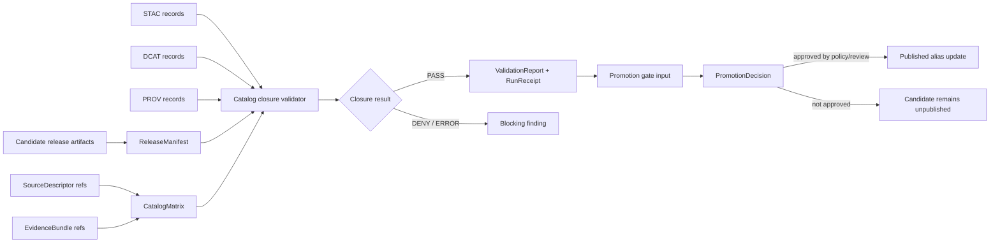

<!-- [KFM_META_BLOCK_V2]
doc_id: kfm://doc/NEEDS-VERIFICATION-tools-validators-catalog-readme
title: tools/validators/catalog
type: standard
version: v1
status: draft
owners: NEEDS-VERIFICATION
created: NEEDS-VERIFICATION
updated: 2026-04-28
policy_label: NEEDS-VERIFICATION
related: [../README.md, ../../README.md, ../../../data/catalog/README.md, ../../../data/receipts/README.md, ../../../data/proofs/README.md, ../../../schemas/README.md, ../../../schemas/contracts/README.md, ../../../policy/README.md, ../../../tests/README.md, ../../../.github/workflows/README.md, ../promotion_gate/README.md]
tags: [kfm, tools, validators, catalog, catalog-matrix, release-manifest, stac, dcat, prov, receipts, promotion]
notes: [doc_id, owners, created date, policy label, executable inventory, schema home, and CI binding need direct repo verification; this README is authored from KFM doctrine and visible documentation patterns, not from a mounted local repository tree; target path and neighboring validator files are PROPOSED until verified.]
[/KFM_META_BLOCK_V2] -->

<a id="top"></a>

# `tools/validators/catalog`

Catalog-closure validation lane for checking that KFM release candidates connect manifests, catalog records, provenance, digests, evidence references, and rollback targets before promotion.

> [!IMPORTANT]
> **Status:** experimental  
> **Document status:** draft  
> **Owners:** `NEEDS-VERIFICATION`  
> **Path:** `tools/validators/catalog/README.md`  
> **Repo fit:** child lane of [`../README.md`](../README.md) inside [`../../README.md`](../../README.md); validates catalog/proof closure for candidate and released artifacts before [`../promotion_gate/README.md`](../promotion_gate/README.md) is allowed to treat catalog state as promotion-ready.  
> **Quick jumps:** [Scope](#scope) · [Repo fit](#repo-fit) · [Accepted inputs](#accepted-inputs) · [Exclusions](#exclusions) · [Directory tree](#directory-tree) · [Quickstart](#quickstart) · [Usage](#usage) · [Diagram](#diagram) · [Operating tables](#operating-tables) · [Task list / definition of done](#task-list--definition-of-done) · [FAQ](#faq) · [Appendix](#appendix)


---

## Scope

This directory is for **catalog closure validators**: small, deterministic checks that prove a candidate release has a coherent catalog trail before any public alias, layer, story, export, or governed API response treats the release as available.

Catalog validation is not a decorative metadata check. In KFM, it is one of the places where the trust path becomes executable:

```text
SourceDescriptor
  -> processed artifact metadata
  -> ReleaseManifest
  -> STAC / DCAT / PROV / internal catalog refs
  -> CatalogMatrix
  -> ValidationReport + RunReceipt
  -> promotion gate input
```

**CONFIRMED doctrine:** catalog closure is part of the KFM proof/release chain.  
**PROPOSED implementation:** this directory should host repo-native validators, examples, fixtures, and receipt helpers for that closure.  
**UNKNOWN:** exact validator filenames, schema locations, and CI commands until the active repository tree is inspected.

[Back to top](#top)

---

## Repo fit

| Relationship | Path | Role |
|---|---:|---|
| Parent validator family | [`../README.md`](../README.md) | Describes the wider `tools/validators/` surface. |
| Tooling family | [`../../README.md`](../../README.md) | Places validators beside CI, probes, attest helpers, and docs tooling. |
| Catalog records | [`../../../data/catalog/README.md`](../../../data/catalog/README.md) | Expected home for catalog-side records and closure material. |
| Receipts | [`../../../data/receipts/README.md`](../../../data/receipts/README.md) | Expected home for validation reports and run receipts as process memory. |
| Proofs | [`../../../data/proofs/README.md`](../../../data/proofs/README.md) | Expected neighbor for proof packs; validators may reference proofs but do not replace them. |
| Schemas | [`../../../schemas/README.md`](../../../schemas/README.md) and [`../../../schemas/contracts/README.md`](../../../schemas/contracts/README.md) | Expected machine-contract homes; exact schema authority needs verification. |
| Policy | [`../../../policy/README.md`](../../../policy/README.md) | Rights, sensitivity, source-role, and publication admissibility policy live outside this validator. |
| Tests | [`../../../tests/README.md`](../../../tests/README.md) | Valid/invalid fixtures and regression tests should prove the validator behavior. |
| Promotion | [`../promotion_gate/README.md`](../promotion_gate/README.md) | Promotion consumes catalog validation; it does not silently redo or bypass it. |
| CI | [`../../../.github/workflows/README.md`](../../../.github/workflows/README.md) | Expected orchestration surface for branch checks and release dry-runs. |

> [!NOTE]
> Link targets are written as repo-relative expectations from this target path. Recheck them against the active branch before merge and update the meta block if local conventions differ.

[Back to top](#top)

---

## Accepted inputs

Only **reviewable, deterministic, non-live-fetch** inputs belong here.

| Input | Accepted when | Must include |
|---|---|---|
| `CatalogMatrix` | It is generated from candidate or released artifacts, not raw source guesses. | Stable IDs, digest crosswalks, catalog refs, release refs, closure state, and finding codes. |
| `ReleaseManifest` | It identifies release artifacts, rollback target, source refs, proof refs, and digests. | Immutable artifact refs, hashes, release ID, supersession/rollback data, and policy label. |
| STAC records | A release profile uses STAC for spatial/temporal assets. | Item/collection IDs, checksums or asset digests, time/spatial scope, and source linkage. |
| DCAT records | A release profile uses DCAT for dataset/distribution catalog interoperability. | Dataset/distribution identifiers, checksums where applicable, access/distribution refs, and rights posture. |
| PROV records | Provenance is required for generated or transformed artifacts. | Entity/activity/agent refs, transformation lineage, source links, and digest support where applicable. |
| `SourceDescriptor` references | Source identity is part of catalog closure. | Source role, rights/sensitivity posture, activation state, and stable source ID. |
| `EvidenceBundle` references | Claims or UI payloads depend on released evidence. | Evidence refs, source summaries, policy/review state, and bundle digest. |
| Fixtures | Validator behavior needs proof without live network access. | At least one valid closed case and one invalid/open case per validator rule. |

[Back to top](#top)

---

## Exclusions

| This directory must not contain | Goes instead | Why |
|---|---|---|
| Live source fetchers, scrapers, or watchers | `tools/probes/`, pipeline lanes, or source-specific tooling | Catalog validation must stay deterministic and replayable. |
| Canonical data stores or source records | `data/raw/`, `data/work/`, `data/quarantine/`, `data/processed/` | Validators inspect references; they do not own lifecycle storage. |
| Policy truth or steward decisions | `policy/` and review/promotion surfaces | Catalog closure is not rights approval or human review. |
| Proof-pack signing or attestation custody | `tools/attest/` and `data/proofs/` | Validator reports are process evidence, not the signing root. |
| Promotion alias changes | `tools/validators/promotion_gate/` or release tooling | Promotion is a governed state transition, not a validator side effect. |
| UI rendering, map popups, or Focus answers | governed API/UI surfaces | Catalog validators do not generate public claims. |
| Direct AI/model calls | governed AI adapter layer | Catalog closure is evidence infrastructure, not synthesis. |

> [!CAUTION]
> A catalog validator must never update `data/published/current`, rewrite release aliases, fetch live URLs, or make a public claim. It should report, not publish.

[Back to top](#top)

---

## Directory tree

**PROPOSED target shape.** Only this README is authored here unless the active branch already contains additional files.

```text
tools/validators/catalog/
├── README.md
├── validate_catalog_matrix.py                 # PROPOSED; verify repo-native language first
├── validate_release_catalog_closure.py        # PROPOSED; checks manifest/catalog/prov/digest closure
├── emit_catalog_validation_receipt.py         # PROPOSED; writes process-memory receipt/report
├── examples/                                  # PROPOSED
│   ├── catalog_matrix.closed.example.json
│   └── catalog_matrix.open.example.json
└── fixtures/                                  # PROPOSED
    ├── valid/
    │   └── release_with_closed_catalog.json
    └── invalid/
        ├── release_missing_prov_entity.json
        ├── release_digest_mismatch.json
        └── release_unresolved_evidence_ref.json
```

**NEEDS VERIFICATION:** exact filenames, Python/Node choice, fixture paths, schema-home conventions, and CI entrypoints.

[Back to top](#top)

---

## Quickstart

> [!WARNING]
> Commands below are **PROPOSED** examples. Run the repo scan first and adapt to the actual package manager, validator language, and schema tooling before wiring CI.

From the repository root:

```bash
git status --short
git branch --show-current
find tools/validators/catalog -maxdepth 3 -type f | sort
find data/catalog data/receipts data/proofs schemas contracts policy tests -maxdepth 3 -type f 2>/dev/null | sort | head -200
```

Validate one candidate catalog matrix:

```bash
python tools/validators/catalog/validate_catalog_matrix.py \
  --matrix data/catalog/<domain>/<release_id>/catalog_matrix.json \
  --release-manifest data/published/<domain>/<release_id>/release_manifest.json \
  --out data/receipts/catalog/<release_id>.validation_report.json
```

Validate fixture coverage:

```bash
python tools/validators/catalog/validate_release_catalog_closure.py \
  --fixtures tests/fixtures/catalog \
  --schemas schemas/contracts/v1 \
  --out data/receipts/catalog/fixture-validation-report.json
```

Expected behavior:

```text
closed catalog + matching digests + resolved refs       -> validation PASS
missing catalog refs / digest mismatch / unresolved ref -> blocking finding
malformed input / missing schema / tool failure          -> ERROR
```

[Back to top](#top)

---

## Usage

### Validator contract

A catalog validator should emit a machine-readable report with enough detail for CI, promotion, reviewers, and rollback analysis.

```json
{
  "schema": "kfm.catalog.validation_report.v1",
  "validator": "tools/validators/catalog/validate_catalog_matrix.py",
  "status": "PROPOSED",
  "decision": "PASS | DENY | ERROR",
  "checked_at": "YYYY-MM-DDTHH:MM:SSZ",
  "inputs": {
    "catalog_matrix": "data/catalog/<domain>/<release_id>/catalog_matrix.json",
    "release_manifest": "data/published/<domain>/<release_id>/release_manifest.json"
  },
  "checks": {
    "schema_valid": true,
    "release_manifest_digest_match": true,
    "stac_refs_closed": true,
    "dcat_refs_closed": true,
    "prov_refs_closed": true,
    "evidence_refs_resolved": true,
    "source_descriptors_resolved": true,
    "rollback_target_present": true,
    "no_raw_work_quarantine_refs": true
  },
  "findings": [],
  "receipt_ref": "kfm://receipt/catalog/<release_id>"
}
```

### Exit posture

| Condition | Recommended decision | Promotion impact |
|---|---|---|
| All required closure checks pass | `PASS` | Promotion gate may continue. |
| Any required catalog, digest, evidence, source, or rollback ref is missing | `DENY` | Promotion must stop or remain candidate-only. |
| Validator cannot parse input, load schema, or complete deterministically | `ERROR` | Promotion must stop; do not reinterpret as absence of findings. |
| A profile marks a standard as not applicable | `PASS` only if explicit and policy-allowed | Silent omission remains blocking. |

### Receipt boundary

A validator report or run receipt is **process memory**. It can support later proof assembly, but it is not itself a `ProofPack`, `ReleaseManifest`, `PromotionDecision`, or public release.

[Back to top](#top)

---

## Diagram



[Back to top](#top)

---

## Operating tables

### What catalog validators own

| Owns | Must not own |
|---|---|
| CatalogMatrix schema validation | Policy truth |
| STAC/DCAT/PROV/internal ref closure checks | Source rights decisions |
| ReleaseManifest catalog-ref consistency | Promotion alias changes |
| Digest and identifier crosswalk checks | Public UI text |
| EvidenceBundle and SourceDescriptor reference presence | Canonical evidence storage |
| ValidationReport / receipt emission | Proof-pack signing |
| No RAW/WORK/QUARANTINE public-path checks | Live connector admission |

### Blocking checks

| Check | Blocks when | Notes |
|---|---|---|
| Schema validity | Input does not match expected contract. | Use repo-native schema tooling once verified. |
| Digest closure | Manifest, catalog, artifact, or PROV digests disagree. | Digest mismatch is never “just metadata.” |
| Identifier closure | STAC/DCAT/PROV/internal IDs cannot be crosswalked. | Catalog closure is not title matching. |
| Evidence closure | `EvidenceRef` cannot resolve to an `EvidenceBundle` where required. | Unsupported public claims must abstain or be denied upstream. |
| Source closure | Source refs lack valid `SourceDescriptor` records. | Unknown source role blocks release-significant catalog claims. |
| Rollback closure | Release lacks a rollback target or supersession context. | Public correction and rollback require durable targets. |
| Lifecycle leak | Input or output references `RAW`, `WORK`, or `QUARANTINE` as public material. | Public clients use governed/released surfaces only. |
| Silent omission | A required catalog family is missing without an explicit not-applicable decision. | Silence is not closure. |

### Truth labels in this README

| Label | Meaning here |
|---|---|
| `CONFIRMED` | Supported by KFM doctrine or directly visible authoring evidence. |
| `PROPOSED` | Recommended path, command, file, schema, or behavior not verified in the target repo. |
| `UNKNOWN` | Not verifiable until the real repo tree, tests, schemas, workflows, and artifacts are inspected. |
| `NEEDS VERIFICATION` | Specific value or convention must be checked before merge or CI binding. |

[Back to top](#top)

---

## Task list / definition of done

A catalog-validator PR is not done until these checks are satisfied or explicitly deferred with a review note:

- [ ] `tools/validators/catalog/README.md` has verified relative links or documented placeholders.
- [ ] `doc_id`, `owners`, `created`, and `policy_label` are replaced or left as explicit reviewable placeholders.
- [ ] Schema home is verified; no parallel `contracts/` vs `schemas/` authority is introduced.
- [ ] Valid and invalid fixtures exist for closed catalog, open catalog, digest mismatch, missing source, missing evidence, and lifecycle leak.
- [ ] Validator is deterministic and does not require network access.
- [ ] Validator refuses `RAW`, `WORK`, and `QUARANTINE` as public/release refs.
- [ ] Validator emits a machine-readable report and, if supported by repo convention, a run receipt.
- [ ] Promotion gate consumes the validator report instead of duplicating hidden logic.
- [ ] CI runs fixture checks on pull requests touching catalog, release, proof, schema, policy, or validator files.
- [ ] Rollback/correction references remain visible when a candidate release supersedes or withdraws prior catalog material.
- [ ] README links are updated in parent `tools/validators/README.md` and any relevant `tests/`, `data/catalog/`, or workflow README.

[Back to top](#top)

---

## FAQ

### Does a closed `CatalogMatrix` mean KFM can publish?

No. Catalog closure is necessary, not sufficient. Promotion still needs policy, rights, sensitivity, review, proof, release-manifest, and rollback gates.

### Is a validation report a proof object?

No. A validation report is process memory. It can support proof assembly, but it does not replace `ProofPack`, `ReleaseManifest`, or `PromotionDecision`.

### Can this validator fetch STAC, DCAT, or PROV URLs at runtime?

Not by default. The safe default is local, deterministic validation over candidate records, fixtures, and manifests. Live endpoint checks belong in probes or source-refresh tooling with receipts.

### What if a release profile does not use STAC or DCAT?

The profile must say so explicitly and provide the reason. Silent omission is treated as open catalog state.

### Can a catalog validator approve sensitive or restricted data?

No. It can report whether catalog refs close. Policy and steward review decide whether restricted, sensitive, redacted, generalized, or internal material can move forward.

[Back to top](#top)

---

## Appendix

<details>
<summary>Pre-publish review checklist</summary>

- [ ] One H1 only.
- [ ] Top KFM Meta Block v2 present.
- [ ] Status, owners, badges, and quick jumps present.
- [ ] Repo fit includes path, upstream links, and downstream links.
- [ ] Accepted inputs and exclusions are explicit.
- [ ] Directory tree is marked `PROPOSED` where not verified.
- [ ] Commands are language-tagged and clearly marked as proposed where implementation is unverified.
- [ ] Mermaid diagram reflects actual KFM lifecycle responsibilities, not decorative flow.
- [ ] Tables separate validator responsibilities from policy, proof, and promotion responsibilities.
- [ ] Task list includes gates and definition of done.
- [ ] Unknowns and placeholders are visible, not hidden in polished prose.

</details>

<details>
<summary>Review questions for maintainers</summary>

1. Does this branch already have a `tools/validators/catalog/` implementation that should be preserved or referenced?
2. Is `schemas/contracts/v1/catalog/catalog_matrix.schema.json` the canonical schema home, or does this repo use another path?
3. Should this lane emit only `ValidationReport`, or should it also emit a `RunReceipt` under `data/receipts/`?
4. Which workflow should consume this validator: pull request CI, release dry-run, promotion gate, or all three?
5. Which catalog profiles are required for the first release lane: STAC, DCAT, PROV, internal catalog, or a smaller fixture-only subset?
6. What exact owner or CODEOWNERS rule applies to `tools/validators/catalog/`?

</details>

[Back to top](#top)
