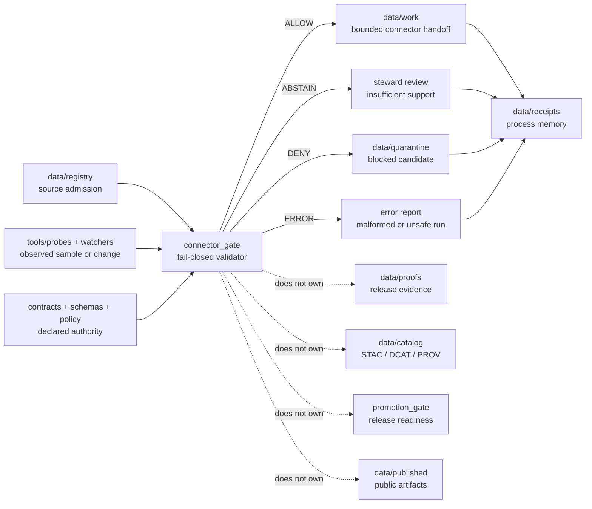

<!-- [KFM_META_BLOCK_V2]
doc_id: kfm://doc/NEEDS-VERIFICATION
title: Connector Gate
type: standard
version: v1
status: draft
owners: @bartytime4life
created: YYYY-MM-DD
updated: 2026-04-23
policy_label: public-safe
related: [
  ../README.md,
  ../../README.md,
  ../../probes/README.md,
  ../../attest/README.md,
  ../promotion_gate/README.md,
  ../../../contracts/README.md,
  ../../../schemas/README.md,
  ../../../policy/README.md,
  ../../../tests/README.md,
  ../../../data/registry/README.md,
  ../../../data/receipts/README.md,
  ../../../data/proofs/README.md,
  ../../../data/work/README.md,
  ../../../data/quarantine/README.md,
  ../../../.github/workflows/README.md,
  ../../../.github/watchers/README.md
]
tags: [kfm, validators, connector-gate, source-admission, fail-closed, source-descriptor, receipts, proofs, spec_hash]
notes: [
  Directory README for the connector-admission validator boundary.
  Replaces a skeletal placeholder with a scoped, reviewable, README-first validator contract.
  Exact executable entrypoints, schema files, fixtures, policy wiring, and merge-blocking CI remain NEEDS VERIFICATION until confirmed on the active branch.
  Connector admission remains earlier and narrower than promotion; receipt, proof, catalog, and publication boundaries must stay separate.
]
[/KFM_META_BLOCK_V2] -->

<a id="top"></a>
<a id="connector-gate"></a>

# Connector Gate

Fail-closed validator contract for admitting connector-facing source candidates into governed KFM work lanes.

> [!NOTE]
> **Status:** experimental  
> **Document status:** draft  
> **Owners:** `@bartytime4life`  
> **Path:** `tools/validators/connector_gate/README.md`  
> 
> 
> 
> 
> 
> 
>   
> **Quick jumps:** [Scope](#scope) · [Repo fit](#repo-fit) · [Accepted inputs](#accepted-inputs) · [Exclusions](#exclusions) · [Revision baseline](#revision-baseline) · [Directory tree](#directory-tree) · [Quickstart](#quickstart) · [Usage](#usage) · [Diagram](#diagram) · [Gate matrix](#gate-matrix) · [Output contract](#output-contract) · [Definition of done](#definition-of-done) · [FAQ](#faq) · [Appendix](#appendix)

> [!IMPORTANT]
> `connector_gate/` is a **validator membrane**, not connector runtime code. It should decide whether a connector-facing candidate is explicit enough to continue into governed work, quarantine, or review without quietly becoming trusted by convenience.

> [!TIP]
> Keep the KFM trust split visible here:
>
> **receipt ≠ proof ≠ catalog ≠ publication**
>
> This lane may require receipt-shaped process memory. It does not own release proofs, catalog closure, promotion decisions, or public publication.

---

## Scope

`tools/validators/connector_gate/` exists for one narrow question:

> **Is a connector-facing candidate explicit, governed, and stable enough to cross from source admission into KFM work lanes without weakening trust?**

In practice, this lane should check for:

- stable source identity before fetch, scheduling, or wider connector execution
- declared source role, publisher/controller, cadence, and downstream intent
- rights posture, policy label, review posture, and sensitivity handling
- deterministic manifest identity, preferably anchored by `spec_hash`
- minimum CRS, temporal-support, schema, and sample-readiness declarations
- receipt emission for allow, abstain, deny, and error paths
- explicit handoff targets for work, quarantine, receipts, and downstream release review

### Working definition

A **connector-facing candidate** is the smallest reviewable bundle that explains how an external source family is meant to enter KFM.

Depending on lane maturity, it may include:

- a source registry entry or `SourceDescriptor`-equivalent record
- a tiny canonical manifest or sample declaration
- explicit rights, source-role, and policy posture
- validation expectations and failure classes
- optional probe or sample-acquisition receipt
- handoff targets for `data/work/`, `data/quarantine/`, `data/receipts/`, and later release/citation surfaces

### Truth labels used here

| Label | Meaning in this README |
| --- | --- |
| **CONFIRMED** | Supported by inspected public repo evidence, attached KFM doctrine, or adjacent documented lane patterns |
| **INFERRED** | Strongly suggested by neighboring docs and KFM doctrine, but not directly proven as executable implementation |
| **PROPOSED** | Recommended first-wave behavior consistent with the current KFM trust model |
| **UNKNOWN** | Not verified strongly enough to state as current branch fact |
| **NEEDS VERIFICATION** | Path, command, owner, schema-home choice, fixture, workflow, or enforcement detail that must be checked before merge |

[Back to top](#top)

---

## Repo fit

**Path:** `tools/validators/connector_gate/README.md`  
**Lane:** `tools/validators/`  
**Role:** source-admission validator surface, upstream of subject validators and release-facing promotion gates

### Neighboring surfaces

| Relation | Surface | Status | Why it matters |
| --- | --- | ---: | --- |
| Parent validator lane | [`../README.md`](../README.md) | **CONFIRMED / NEEDS VERIFICATION on active branch** | Sets validator-family posture: deterministic checks, fail-closed behavior, reviewable outputs |
| Parent tools lane | [`../../README.md`](../../README.md) | **NEEDS VERIFICATION** | Keeps tools distinct from canonical data authority and runtime surfaces |
| Probe / watcher inputs | [`../../probes/README.md`](../../probes/README.md), [`../../../.github/watchers/README.md`](../../../.github/watchers/README.md) | **INFERRED / NEEDS VERIFICATION** | Probes and watchers may observe; they do not grant connector admission |
| Source admission | [`../../../data/registry/README.md`](../../../data/registry/README.md) | **CONFIRMED / NEEDS VERIFICATION on active branch** | Connector readiness starts with source identity, role, cadence, rights, and downstream intent |
| Work handoff | [`../../../data/work/README.md`](../../../data/work/README.md) | **INFERRED / NEEDS VERIFICATION** | Allowed candidates may continue only into governed work, not public release |
| Quarantine handoff | [`../../../data/quarantine/README.md`](../../../data/quarantine/README.md) | **INFERRED / NEEDS VERIFICATION** | Denied or unsafe candidates need explicit hold state |
| Receipts | [`../../../data/receipts/README.md`](../../../data/receipts/README.md) | **CONFIRMED / NEEDS VERIFICATION on active branch** | Connector admission should leave process memory without upgrading it into proof |
| Proofs | [`../../../data/proofs/README.md`](../../../data/proofs/README.md) | **CONFIRMED / NEEDS VERIFICATION on active branch** | Release-grade proof objects remain downstream and stronger |
| Release membrane | [`../promotion_gate/README.md`](../promotion_gate/README.md) | **CONFIRMED / NEEDS VERIFICATION on active branch** | Promotion is later, stronger, and release-facing |
| Contracts | [`../../../contracts/README.md`](../../../contracts/README.md) | **CONFIRMED / NEEDS VERIFICATION on active branch** | Human-readable meaning and lane placement should stay upstream |
| Schemas | [`../../../schemas/README.md`](../../../schemas/README.md) | **CONFIRMED / NEEDS VERIFICATION on active branch** | Machine-readable shape authority should not be redefined inside this validator |
| Policy | [`../../../policy/README.md`](../../../policy/README.md) | **CONFIRMED / NEEDS VERIFICATION on active branch** | Allow/deny/obligation logic belongs in policy surfaces |
| Tests | [`../../../tests/README.md`](../../../tests/README.md) | **NEEDS VERIFICATION** | Fixture proof should exercise both positive and negative admission paths |
| Workflow boundary | [`../../../.github/workflows/README.md`](../../../.github/workflows/README.md) | **NEEDS VERIFICATION** | Workflow YAML may orchestrate this gate, but should not hide policy-significant logic |

### Boundary rule

Use `connector_gate/` to validate **connector admission readiness**.

Do **not** use it to:

- fetch live source data as the normal path
- write canonical source law
- publish or promote artifacts
- sign proof bundles
- bypass policy review
- replace source descriptors, schemas, or fixtures
- turn probe output into trusted source state without validation
- collapse process receipts into release evidence

[Back to top](#top)

---

## Accepted inputs

Accepted inputs are intentionally small. The connector gate should validate a reviewable candidate, not run an entire ingestion system.

| Input | Required? | Purpose | Status |
| --- | ---: | --- | --- |
| Source registry entry or `SourceDescriptor`-equivalent | Yes | Names the source, source role, publisher/controller, cadence, access mode, and review posture | **PROPOSED** |
| Candidate manifest | Yes | Provides deterministic identity, candidate shape, declared assets, expected formats, and `spec_hash` basis | **PROPOSED** |
| Rights / policy posture | Yes | Makes unknown or restricted source conditions visible before any wider execution | **PROPOSED** |
| Validation plan | Yes | Declares schema, CRS, time, range, sample, and source-role checks expected downstream | **PROPOSED** |
| Handoff targets | Yes | Names work, quarantine, receipt, and later release-review destinations | **PROPOSED** |
| Probe / watcher receipt | Optional | Supports freshness or observed-change context without becoming proof | **INFERRED** |
| Tiny sample or fixture | Optional | Allows deterministic smoke validation without live source dependency | **PROPOSED** |

### Minimum candidate shape

The first executable slice should be able to evaluate one compact candidate with these field families:

```json
{
  "candidate_id": "example-source.connector-candidate.v1",
  "source_ref": "data/registry/sources/example.yaml",
  "source_role": "NEEDS-VERIFICATION",
  "publisher": "NEEDS-VERIFICATION",
  "acquisition_mode": "api | bulk_file | service_query | snapshot_diff | other",
  "rights_posture": "allow | restricted | unknown | needs_review",
  "policy_label": "public-safe | restricted | NEEDS-VERIFICATION",
  "expected_formats": ["json"],
  "spatial_support": {
    "crs": "EPSG:4326",
    "extent": "NEEDS-VERIFICATION"
  },
  "temporal_support": {
    "cadence": "NEEDS-VERIFICATION",
    "valid_time_basis": "NEEDS-VERIFICATION"
  },
  "validation_plan": ["schema", "source_role", "rights", "crs", "time"],
  "handoff_targets": {
    "allow": "data/work/NEEDS-VERIFICATION",
    "deny": "data/quarantine/NEEDS-VERIFICATION",
    "receipt": "data/receipts/NEEDS-VERIFICATION"
  },
  "spec_hash": "sha256:NEEDS-VERIFICATION"
}
```

> [!NOTE]
> This example is **illustrative**, not a canonical schema. Put machine authority in the verified schema home, not in README prose.

[Back to top](#top)

---

## Exclusions

| This does **not** belong here | Put it here instead | Why |
| --- | --- | --- |
| Connector runtime implementation | `pipelines/`, `tools/probes/`, or a verified connector package | Runtime code should not hide admission decisions |
| Raw source captures | `data/raw/` | RAW is a lifecycle stage, not validator storage |
| Work scratch files | `data/work/` | Work material should be separate from the gate that admits it |
| Held / unsafe source material | `data/quarantine/` | Quarantine needs explicit lifecycle handling |
| Human-readable contract meaning | `contracts/` | Validators should check declared meaning, not invent it |
| JSON Schema or equivalent machine shape | `schemas/` or verified schema home | Schema authority must stay singular |
| Allow/deny/obligation law | `policy/` | Policy should be auditable outside this validator |
| Release proofs and attestations | `data/proofs/`, `tools/attest/` | Proof is stronger and later than admission |
| Catalog closure | `data/catalog/` | STAC/DCAT/PROV closure belongs downstream |
| Promotion decisions | `tools/validators/promotion_gate/` | Promotion is a governed state transition, not a side effect of connector readiness |
| UI, Focus Mode, or public map output | Governed API / UI surfaces | Public clients should consume released, governed outputs only |

[Back to top](#top)

---

## Revision baseline

This README replaces a skeletal placeholder with a scoped connector-admission contract. Keep this table visible until the first executable slice lands.

| Evidence item | Status | How this README uses it |
| --- | ---: | --- |
| `tools/validators/connector_gate/` exists on public `main` | **CONFIRMED** | Grounds the target path as a real checked-in directory |
| Baseline public listing showed `README.md` only | **CONFIRMED** | Keeps the first revision focused on lane contract and modest executable growth |
| Baseline `README.md` was skeletal placeholder text | **CONFIRMED** | Justifies a full replacement rather than a light edit |
| Deeper connector code, fixtures, policies, schemas, and workflow enforcement | **NEEDS VERIFICATION** | Avoids claiming executable maturity this README does not prove |
| KFM doctrine requires fail-closed, evidence-first, lifecycle-aware validation | **CONFIRMED doctrine** | Shapes the gate matrix, output vocabulary, and exclusions |

> [!WARNING]
> Once executable files land, update this section into a real inventory. Do not let this README drift into claiming hidden entrypoints, branch protections, or CI enforcement that are not present.

[Back to top](#top)

---

## Directory tree

### Baseline before this replacement

```text
tools/validators/
└── connector_gate/
    └── README.md
```

### First executable landing shape

```text
tools/validators/
└── connector_gate/
    ├── README.md
    ├── connector_gate.py                  # PROPOSED entrypoint
    ├── report.schema.json                 # PROPOSED local report shape, if schema home allows
    ├── examples/
    │   ├── valid/
    │   │   └── connector_candidate.valid.json
    │   ├── abstain/
    │   │   └── connector_candidate.partial-support.json
    │   ├── deny/
    │   │   └── connector_candidate.unknown-rights.json
    │   └── error/
    │       └── connector_candidate.malformed.json
    └── policies/
        └── README.md                      # PROPOSED policy-local notes only
```

<details>
<summary><strong>Why this tree stays modest</strong></summary>

A first executable connector gate should prove the admission seam, not build the whole source-integration system.

The smallest useful landing is:

- one stable entrypoint
- one valid fixture
- one denied fixture
- one malformed/error fixture
- one abstain/insufficient-support fixture
- one machine-readable report shape
- one README that keeps contracts, schemas, policy, receipts, proofs, and publication separate

</details>

[Back to top](#top)

---

## Quickstart

Start with inspection, not invention.

```bash
# 0) Confirm the repo root on the active branch.
git rev-parse --show-toplevel 2>/dev/null || pwd

# 1) Inspect this lane.
find tools/validators/connector_gate -maxdepth 3 \( -type f -o -type d \) -print 2>/dev/null | sort
sed -n '1,260p' tools/validators/connector_gate/README.md 2>/dev/null || true

# 2) Re-read the parent and adjacent validator contracts.
sed -n '1,260p' tools/validators/README.md 2>/dev/null || true
sed -n '1,260p' tools/validators/promotion_gate/README.md 2>/dev/null || true

# 3) Re-check upstream and downstream trust surfaces.
sed -n '1,260p' data/registry/README.md 2>/dev/null || true
sed -n '1,220p' data/receipts/README.md 2>/dev/null || true
sed -n '1,220p' data/proofs/README.md 2>/dev/null || true
sed -n '1,220p' contracts/README.md 2>/dev/null || true
sed -n '1,220p' schemas/README.md 2>/dev/null || true
sed -n '1,220p' policy/README.md 2>/dev/null || true

# 4) Search for connector-admission vocabulary before adding new terms.
git grep -n "SourceDescriptor\|source_role\|spec_hash\|run_receipt\|connector_gate\|promotion_gate\|watcher\|quarantine" -- \
  tools data contracts schemas policy tests .github 2>/dev/null || true
```

### Future executable command

Add the real command only after the entrypoint exists.

```bash
# PROPOSED once connector_gate.py exists.
python3 tools/validators/connector_gate/connector_gate.py \
  --candidate tools/validators/connector_gate/examples/valid/connector_candidate.valid.json \
  --out /tmp/connector_gate_report.json
```

> [!IMPORTANT]
> Until executable inventory is confirmed, this README is the lane contract. It is not proof that the CLI, fixtures, schema, or workflow wiring exist.

[Back to top](#top)

---

## Usage

Reach for this lane when:

1. a new external source family needs descriptor-first admission before live connector work expands;
2. a probe or watcher candidate needs deterministic validation before work-lane handoff;
3. source role, cadence, rights, CRS, temporal support, or downstream intent needs to be forced into explicit review;
4. reviewers need a machine-readable `ALLOW`, `ABSTAIN`, `DENY`, or `ERROR` outcome for connector readiness;
5. a candidate must leave process memory without pretending release proof already exists.

Do not reach for this lane when:

- the candidate is already a release or promotion candidate;
- the main task is signing, attestation, proof-pack assembly, or catalog publication;
- the work is schema authoring rather than schema validation;
- the burden is subject-domain validation such as hydrology, soils, flora, fauna, archaeology, hazards, or roads;
- the branch needs UI behavior, Focus Mode behavior, or public map output.

### Neighbor-lane handoff rules

| Main burden | Start here | Reading rule |
| --- | --- | --- |
| Observe a source endpoint | `tools/probes/` or `.github/watchers/` | Observation is not admission |
| Validate source/connector admission | `tools/validators/connector_gate/` | Admission is earlier than subject validation and promotion |
| Validate subject-domain integrity | Domain validator lane | Domain meaning should stay domain-owned |
| Validate release readiness | `tools/validators/promotion_gate/` | Promotion is later and stronger |
| Sign or attest | `tools/attest/` and `data/proofs/` | Proof is not process memory |
| Store process memory | `data/receipts/` | Receipts should be queryable and separate |
| Publish or expose | Governed release/API/UI surfaces | Public output must stay downstream of release gates |

[Back to top](#top)

---

## Diagram



[Back to top](#top)

---

## Gate matrix

The connector gate is intentionally smaller than promotion. It forces admission clarity; it does not settle publication law.

| Gate | What must be true | Typical outcome | Notes |
| --- | --- | --- | --- |
| **G1 — Source identity** | Candidate resolves to one named source or dataset entry | `DENY` / `ERROR` | Missing or ambiguous identity stops the run early |
| **G2 — Descriptor completeness** | Source role, publisher/controller, acquisition mode, cadence, rights posture, policy label, and downstream intent are visible | `DENY` | Descriptor-first onboarding matters more than connector throughput |
| **G3 — Deterministic manifest identity** | Candidate manifest is canonicalizable and yields stable `spec_hash` or equivalent identity | `DENY` / `ERROR` | `spec_hash` anchors replay, diff, receipt linkage, and handoff accountability |
| **G4 — Minimum semantics** | Declared schema, CRS, time, range, and sample checks are appropriate to the source family | `ABSTAIN` / `DENY` | Use `ABSTAIN` when support is too weak for automatic handoff but not malformed |
| **G5 — Rights and sensitivity posture** | Unknown rights, restricted terms, policy ambiguity, or sensitive exact-location concerns are explicit and fail closed | `DENY` / `ABSTAIN` | Never admit by silence |
| **G6 — Receipt boundary** | A receipt-shaped result is emitted for allow, abstain, deny, and error paths | `DENY` / `ERROR` | Negative outcomes should remain visible |
| **G7 — Handoff readiness** | Work, quarantine, receipt, and downstream review targets are explicit enough to continue | `ALLOW` / `ABSTAIN` / `DENY` | Admission prepares the next lane; it does not improvise it |

### Outcome vocabulary

| Outcome | Meaning here | Exit posture |
| --- | --- | --- |
| `ALLOW` | Candidate passed declared admission checks strongly enough for the next governed handoff | `0` |
| `ABSTAIN` | Candidate is not malformed, but support is too weak or incomplete for automatic handoff | non-zero or configured review-hold |
| `DENY` | A trust requirement failed | non-zero |
| `ERROR` | Parser, execution, missing-file, or malformed-input failure prevented a safe determination | non-zero |

> [!NOTE]
> Keep this validator-facing grammar separate from runtime `ANSWER / ABSTAIN / DENY / ERROR` language and from release-facing promotion vocabularies. Connector admission should not silently redefine downstream envelopes.

[Back to top](#top)

---

## Output contract

A first executable connector gate should emit one machine-readable report and no publication side effects.

### Report shape

```json
{
  "validator_id": "connector_gate",
  "validator_version": "v1",
  "checked_at": "2026-04-23T00:00:00Z",
  "candidate_ref": "tools/validators/connector_gate/examples/valid/connector_candidate.valid.json",
  "outcome": "ALLOW",
  "spec_hash": "sha256:NEEDS-VERIFICATION",
  "source_ref": "data/registry/sources/NEEDS-VERIFICATION.yaml",
  "receipt_ref": "data/receipts/NEEDS-VERIFICATION.json",
  "handoff": {
    "next_surface": "data/work/NEEDS-VERIFICATION",
    "review_required": false
  },
  "findings": [
    {
      "gate_id": "G1",
      "severity": "info",
      "message": "source identity resolved",
      "path": "$.source_ref"
    }
  ],
  "obligations": []
}
```

### Blocking conditions

The report should fail closed when any of these are true:

| Blocker family | Fail-closed example |
| --- | --- |
| Source identity | No source ref, duplicate source ref, ambiguous dataset ID |
| Descriptor completeness | Missing `source_role`, `publisher`, cadence, rights posture, or policy label |
| Manifest identity | Missing, unstable, or noncanonical `spec_hash` |
| Rights / policy | Unknown rights treated as allowed; missing policy label; unreviewed restricted source |
| Spatial / temporal | Unknown CRS used as if normalized; missing valid-time basis for time-sensitive data |
| Handoff | No work/quarantine/receipt target; target points to public/published surface |
| Boundary collapse | Receipt doubles as proof; connector gate attempts promotion or publication |
| Execution | Malformed JSON/YAML, missing file, schema compile failure, parser crash |

[Back to top](#top)

---

## Definition of done

Before this README is considered implementation-backed rather than README-first, the branch should satisfy all of the following:

- [ ] Active-branch inventory confirms the real files under `tools/validators/connector_gate/`.
- [ ] One executable entrypoint exists and is runnable locally.
- [ ] The entrypoint emits stable JSON or JSONL.
- [ ] Valid, abstain, deny, and error fixtures exist.
- [ ] Fixtures prove fail-closed behavior.
- [ ] Report output names checked paths, source refs, candidate refs, and digest/spec identity.
- [ ] Unknown rights and missing policy labels fail closed.
- [ ] Handoff targets cannot point directly to `data/published/` or public UI/API surfaces.
- [ ] Receipt refs are process memory only.
- [ ] Proof, catalog, promotion, and publication remain downstream.
- [ ] Tests cover positive and negative cases.
- [ ] Workflow usage, if added, calls this validator as an explicit step rather than burying gate logic in YAML.
- [ ] README metadata, owner, related links, and badges are updated from placeholders.
- [ ] Rollback is documented: disable entrypoint invocation first, then revert validator files, without deleting receipts/proofs created by prior reviewed runs.

[Back to top](#top)

---

## FAQ

### Why does connector admission need a gate?

Because source connectors can create trust by momentum. Once a source is scheduled, sampled, normalized, or pushed into work lanes, later reviewers may assume the source identity, rights posture, cadence, and semantics were already settled. This gate makes those assumptions visible before they spread.

### Is `connector_gate/` a connector runtime?

No. It is an admission validator. Runtime connector code belongs in a verified connector, pipeline, probe, or ingestion package.

### Is an `ALLOW` outcome publication approval?

No. `ALLOW` means the connector-facing candidate is explicit enough for the next governed handoff. Promotion, proof, catalog closure, and publication remain separate.

### Why require receipts for negative outcomes?

Denied and errored connector candidates are part of the audit trail. A failed run should be reviewable rather than disappearing into a CI log or local terminal session.

### Why repeat “receipts are not proofs”?

Connector admission can easily blur process memory with release evidence. KFM keeps receipts and proofs separate so process history does not become release authority by accident.

### Should every new source family eventually pass through this gate?

That is the safest direction, but current branch coverage remains a verification item. This README documents the preferred membrane; it does not claim every source family already has it.

[Back to top](#top)

---

## Appendix

<details>
<summary><strong>Illustrative first-wave connector candidate fields</strong> <code>PROPOSED</code></summary>

These fields are a review checklist, not a canonical schema.

| Field family | Why it should be visible |
| --- | --- |
| `candidate_id` | Stable review identity before execution widens |
| `source_id` / `dataset_id` | Stable source identity before fetch or scheduling |
| `source_role` | Prevents observations, regulatory records, mirrors, models, and documentary sources from collapsing into one vague class |
| `publisher` / `controller` | Rights, stewardship, and escalation need named responsibility |
| `acquisition_mode` | Reviewers should know whether intake is API, bulk file, service query, snapshot+diff, or other |
| `cadence` / `freshness_basis` | Replay, lag, staleness, and watcher behavior depend on explicit timing |
| `expected_formats` | Normalization and validation scope should be legible up front |
| `spatial_support` / `temporal_support` | CRS, extent, valid time, and support semantics matter before downstream interpretation |
| `policy_label` / `rights_posture` | Admission should fail closed when these are missing or ambiguous |
| `sensitivity_posture` | Exact-location, cultural, ecological, infrastructure, or living-person risk should not be discovered after publication work begins |
| `validation_plan` | “We will check it later” should not be the default onboarding posture |
| `handoff_targets` | Connector admission should know where work, quarantine, receipts, and release review connect |
| `spec_hash` or canonicalization basis | Deterministic identity keeps replay, diff, and receipt logic honest |

</details>

<details>
<summary><strong>Shortest honest one-line summary</strong></summary>

`connector_gate/` is the fail-closed validator membrane between descriptor-first source admission and any wider connector execution, work-lane handoff, or release-bearing activity.

</details>

[Back to top](#top)
