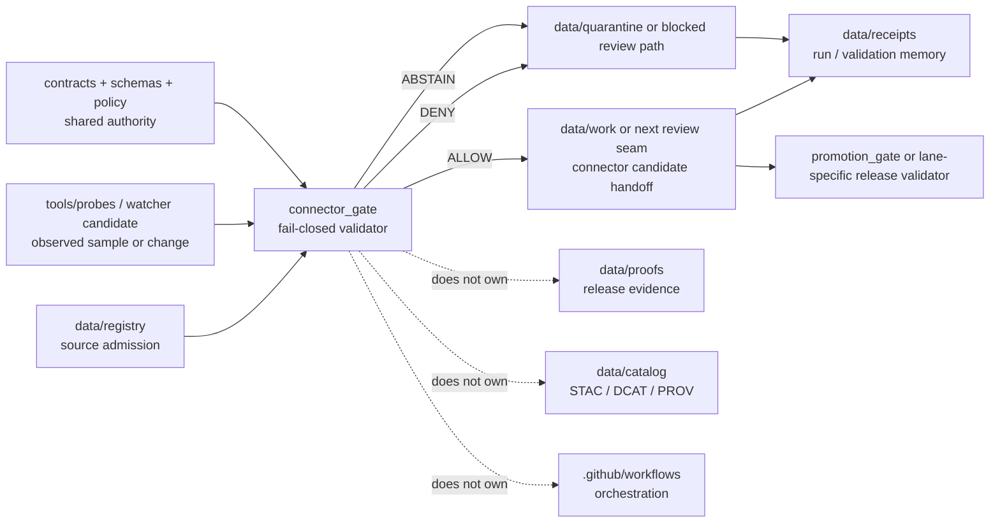

<!-- [KFM_META_BLOCK_V2]
doc_id: kfm://doc/NEEDS-VERIFICATION
title: tools/validators/connector_gate
type: standard
version: v1
status: draft
owners: @bartytime4life
created: 2026-04-14
updated: 2026-04-14
policy_label: public
related: [
  ../README.md,
  ../../README.md,
  ../../../data/registry/README.md,
  ../../../data/receipts/README.md,
  ../../../data/proofs/README.md,
  ../../probes/README.md,
  ../../../.github/watchers/README.md,
  ../promotion_gate/README.md,
  ../../../.github/workflows/README.md,
  ../../../.github/actions/README.md,
  ../../../contracts/README.md,
  ../../../schemas/README.md,
  ../../../policy/README.md,
  ../../../tests/README.md
]
tags: [kfm, validators, connector, connector-gate, admission, fail-closed, receipts, spec_hash]
notes: [Connector admission validator contract. Public-main executable inventory, exact entrypoint, fixture set, and schema-home placement remain NEEDS VERIFICATION.]
[/KFM_META_BLOCK_V2] -->

# `tools/validators/connector_gate/`

Fail-closed validator surface for **connector admission**, **connector-candidate integrity**, and **reviewable handoff** from source registration into governed KFM ingestion lanes.

> [!NOTE]
> **Status:** experimental  
> **Document status:** draft  
> **Owners:** `@bartytime4life`  
>       
> **Quick jumps:** [Scope](#scope) · [Repo fit](#repo-fit) · [Accepted inputs](#accepted-inputs) · [Exclusions](#exclusions) · [Current public snapshot](#current-public-snapshot) · [Directory tree](#directory-tree) · [Quickstart](#quickstart) · [Usage](#usage) · [Diagram](#diagram) · [Gate matrix](#gate-matrix) · [Output contract](#output-contract) · [Task list](#task-list) · [FAQ](#faq) · [Appendix](#appendix)

> [!IMPORTANT]
> Current public `main` shows `tools/validators/connector_gate/` as a **README-first** directory. This document therefore does two jobs at once:
>
> 1. records the smallest truthful current-state contract, and  
> 2. defines the narrowest credible thin-slice for a future executable connector gate.

> [!TIP]
> Keep the KFM trust split visible here:
>
> **receipt ≠ proof ≠ catalog ≠ publication**
>
> This lane validates **admission readiness** and requires **process memory**. Stronger release proofs, outward catalog closure, and publication state transitions belong downstream.

---

## Scope

`tools/validators/connector_gate/` exists for one narrow question:

> **Is a connector-facing candidate explicit, governed, and stable enough to cross from source admission into KFM work lanes without weakening trust?**

In practical terms, this lane is where a connector candidate should be checked for:

- source identity and source-role clarity
- descriptor completeness before fetch or scheduling
- rights, policy label, and review posture visibility
- deterministic manifest identity anchored by `spec_hash`
- minimum schema, CRS, time, and range readiness appropriate to the source family
- receipt emission on both allow and deny paths
- explicit downstream handoff without pretending publication already happened

### Working definition used here

A **connector-facing candidate** is the smallest reviewable bundle that explains how an external source family is meant to enter KFM.

Depending on lane maturity, that bundle may include some combination of:

- a registry entry or `SourceDescriptor`-equivalent record
- one sample or canonical manifest
- explicit rights and policy posture
- declared validation expectations
- optional probe or sample-acquisition receipt
- explicit handoff targets for work, quarantine, receipts, and later release or citation surfaces

### Truth labels used in this README

| Label | Meaning here |
|---|---|
| **CONFIRMED** | Directly supported by visible repo structure or stable KFM doctrine |
| **INFERRED** | Strongly suggested by adjacent checked-in docs and doctrine, but not directly proven as mounted implementation |
| **PROPOSED** | Recommended lane shape or thin-slice behavior consistent with current doctrine |
| **UNKNOWN** | Not surfaced strongly enough to state as current repo fact |
| **NEEDS VERIFICATION** | Path, command, owner, schema-home choice, or implementation detail that should be checked on the working branch before merge |

[Back to top](#toolsvalidatorsconnector_gate)

---

## Repo fit

**Path:** `tools/validators/connector_gate/README.md`  
**Role:** directory README for a fail-closed connector-admission validator surface inside the broader `tools/validators/` lane.

### Upstream and adjacent anchors

| Relation | Surface | Why it matters |
|---|---|---|
| Parent lane | [`../README.md`](../README.md) | Sets the validator-family posture: deterministic, reviewable, fail-closed helpers |
| Parent helper surface | [`../../README.md`](../../README.md) | Distinguishes `tools/` from runtime, policy ownership, and canonical data authority |
| Source admission | [`../../../data/registry/README.md`](../../../data/registry/README.md) | Connector readiness starts with explicit source identity, cadence, rights, and downstream intent |
| Receipt memory | [`../../../data/receipts/README.md`](../../../data/receipts/README.md) | This lane should require process memory without collapsing it into proof |
| Proof surface | [`../../../data/proofs/README.md`](../../../data/proofs/README.md) | Promotion-grade proofs and rollback/correction evidence stay downstream |
| Watcher doctrine | [`../../../.github/watchers/README.md`](../../../.github/watchers/README.md), [`../../probes/README.md`](../../probes/README.md) | Watchers and probes observe; this lane validates the candidate they help produce |
| Release comparator | [`../promotion_gate/README.md`](../promotion_gate/README.md) | Connector admission remains narrower than release readiness |
| Workflow boundary | [`../../../.github/workflows/README.md`](../../../.github/workflows/README.md), [`../../../.github/actions/README.md`](../../../.github/actions/README.md) | Orchestration should call stable helpers, not bury validator logic in workflow YAML |
| Shared authority | [`../../../contracts/README.md`](../../../contracts/README.md), [`../../../schemas/README.md`](../../../schemas/README.md), [`../../../policy/README.md`](../../../policy/README.md), [`../../../tests/README.md`](../../../tests/README.md) | This lane validates chosen authority; it does not redefine contracts, schemas, policy logic, or tests |

### Boundary rule

Use `connector_gate/` to validate **admission readiness**.

Do **not** use it to:

- own connector runtime code
- decide organization-level publication policy
- sign or attest release artifacts
- serve as the canonical schema registry
- replace promotion or correction flows
- quietly publish, schedule, or promote anything on its own

[Back to top](#toolsvalidatorsconnector_gate)

---

## Accepted inputs

The safest first-wave input set for this lane is small, explicit, and reviewable.

| Input family | Required | Why it belongs here |
|---|---:|---|
| registry entry or `SourceDescriptor`-equivalent | yes | admission should begin from named source identity, role, rights, cadence, and expected semantics |
| connector candidate manifest | yes | gives the validator one deterministic object to inspect instead of a diffuse folder of assumptions |
| `spec_hash` or canonicalization basis | yes | candidate identity should be stable enough for replay, diff, and receipt linkage |
| policy label and rights posture | yes | fail-closed review depends on explicit restrictions and default posture |
| validation expectations | yes | schema, CRS, time, range, and source-role checks must be visible before execution widens |
| optional probe or sample-acquisition receipt | recommended | helps preserve observed intake evidence without turning the validator into a fetcher |
| optional downstream handoff refs | recommended | keeps work, quarantine, receipts, and later proof/catalog movement inspectable |
| tiny valid and invalid fixtures | recommended | descriptor-first onboarding should be testable with at least one success path and one clean failure |

### Minimum questions a candidate should answer

Before this lane says anything stronger than `ABSTAIN`, a connector-facing candidate should be able to answer:

1. What source or dataset is this?
2. What source role does it carry?
3. Who publishes or controls it?
4. How is it acquired?
5. What formats, CRS, time semantics, and cadence are expected?
6. What rights or restrictions apply?
7. What policy label or review-needed posture applies before promotion?
8. What handoff targets are expected after admission validation?

---

## Exclusions

Keep this lane narrow.

| Keep out of `connector_gate/` | Why | Put it here instead |
|---|---|---|
| runtime connector code, adapters, long-running watchers, schedulers | validator logic should not quietly become execution ownership | `pipelines/`, `apps/`, `packages/`, or another confirmed runtime-owner surface |
| workflow YAML and reusable action metadata | orchestration belongs at the gatehouse boundary | [`../../../.github/workflows/README.md`](../../../.github/workflows/README.md), [`../../../.github/actions/README.md`](../../../.github/actions/README.md) |
| policy bundles and canonical rule bodies | validator consumption is not policy ownership | [`../../../policy/README.md`](../../../policy/README.md) |
| canonical contracts, schemas, or vocabularies | this lane should validate chosen authority, not fork it | [`../../../contracts/README.md`](../../../contracts/README.md), [`../../../schemas/README.md`](../../../schemas/README.md) |
| raw source captures or work scratch files | admission rules are not the same thing as captured bytes or transform work | `data/raw/`, `data/work/`, or `data/quarantine/` |
| release proofs, attestations, rollback packs | those are stronger, later trust objects | [`../../../data/proofs/README.md`](../../../data/proofs/README.md), [`../../attest/README.md`](../../attest/README.md) |
| outward catalog artifacts | release closure belongs later in the truth path | `data/catalog/` child lanes |
| direct publication or promotion decisions | promotion is a governed state transition, not a side effect of connector readiness | [`../promotion_gate/README.md`](../promotion_gate/README.md) |

---

## Current public snapshot

The current public tree should stay visible here because this lane is still early.

| Evidence item | Status | How this README uses it |
|---|---|---|
| `tools/validators/connector_gate/` exists on public `main` | **CONFIRMED** | Grounds the target path as a real checked-in directory |
| the directory currently shows `README.md` only | **CONFIRMED** | Keeps this file focused on lane contract plus thin-slice growth path |
| the checked-in `README.md` is empty on public `main` | **CONFIRMED** | Justifies a full replacement rather than a light revision |
| `tools/validators/README.md` defines validators as fail-closed helpers for trust-bearing artifacts | **CONFIRMED** | Sets the family posture for this lane |
| `tools/probes/README.md` and `.github/watchers/README.md` keep probes/watchers observational and evidence-bounded | **CONFIRMED** | Supports the “observe first, validate second” separation |
| `data/registry/README.md` frames source admission as reviewable before publication and asks for role, cadence, rights, policy label, semantics, and downstream intent | **CONFIRMED** | Provides the clearest upstream burden for connector validation |
| `data/receipts/README.md` and `data/proofs/README.md` keep process memory separate from release evidence | **CONFIRMED** | Informs this lane’s output contract and exclusions |
| `.github/workflows/README.md` says current public `main` shows workflow docs but not checked-in YAML inventory | **CONFIRMED** | Prevents this README from pretending workflow enforcement already exists |
| deeper connector code, schemas, fixtures, and merge-blocking automation | **NEEDS VERIFICATION** | Keeps implementation claims bounded until the working branch proves them |

> [!WARNING]
> Adjacent docs may describe richer future behavior than the public tree proves today. This README stays intentionally smaller: current path, current boundary, and the safest first-wave contract.

[Back to top](#toolsvalidatorsconnector_gate)

---

## Directory tree

### Current public inventory

```text
tools/validators/
└── connector_gate/
    └── README.md
```

### First executable landing shape (PROPOSED)

```text
tools/validators/
└── connector_gate/
    ├── README.md
    ├── examples/
    │   ├── valid/
    │   └── invalid/
    ├── policies/
    │   └── README.md
    ├── <connector-gate-entrypoint>
    ├── <report-schema-or-output-contract>
    └── <tiny-lane-local-config>
```

<details>
<summary><strong>Why the proposed tree stays modest</strong></summary>

A first executable `connector_gate/` should land with only what it needs to prove one governed admission seam clearly:

- one stable entrypoint
- one tiny valid fixture
- one tiny invalid fixture
- one policy example
- one machine-readable report shape
- no hidden runtime glue
- no duplicate schema authority
- no signing or promotion shortcuts

</details>

---

## Quickstart

Start by rechecking the lane exactly as it exists on the branch you plan to change.

```bash
# 0) Start from the repo root
git rev-parse --show-toplevel 2>/dev/null || pwd

# 1) Inspect the current lane and its immediate family
find tools/validators/connector_gate -maxdepth 2 \( -type f -o -type d \) | sort
sed -n '1,220p' tools/validators/README.md
sed -n '1,260p' tools/validators/promotion_gate/README.md

# 2) Recheck the upstream admission and downstream evidence lanes
sed -n '1,260p' data/registry/README.md
sed -n '1,220p' data/receipts/README.md
sed -n '1,220p' data/proofs/README.md

# 3) Reconfirm the gatehouse boundaries that should call this lane, not replace it
sed -n '1,220p' .github/watchers/README.md
sed -n '1,220p' .github/workflows/README.md
sed -n '1,220p' .github/actions/README.md

# 4) Recheck shared authority before inventing local truth
sed -n '1,220p' contracts/README.md
sed -n '1,220p' schemas/README.md
sed -n '1,220p' policy/README.md
sed -n '1,220p' tests/README.md

# 5) Search for connector-adjacent vocabulary before adding new terms
git grep -n "SourceDescriptor\|spec_hash\|run_receipt\|promotion_gate\|watcher" -- \
  tools data contracts schemas policy tests .github || true
```

> [!TIP]
> Because this lane is currently README-first, the truthful quickstart is **inspection-first**, not “run this undocumented CLI.” Add an execution command here only after the working branch proves the actual entrypoint.

[Back to top](#toolsvalidatorsconnector_gate)

---

## Usage

### Reach for this lane when

1. a new external source family needs descriptor-first admission before fetch or scheduling widens
2. a probe or watcher candidate needs a deterministic, fail-closed admission check
3. rights, cadence, CRS, time semantics, or source-role assumptions need to be forced into explicit review
4. a connector candidate needs machine-readable `ALLOW` / `ABSTAIN` / `DENY` / `ERROR` output
5. reviewers need process memory for connector readiness without pretending release proof already exists

### Do not reach for this lane when

- the subject is already a release candidate
- the main job is signing or attestation
- the main job is CI rendering or annotation
- the work is policy authoring rather than policy evaluation
- the real burden is runtime connector code, not admission validation

### Neighbor-lane handoff rules

| If the main burden is... | Use this surface first | Why |
|---|---|---|
| observing or sampling an external surface | [`../../probes/README.md`](../../probes/README.md) or [`../../../.github/watchers/README.md`](../../../.github/watchers/README.md) | probes/watchers observe; they do not grant admission |
| validating connector readiness | `connector_gate/` | this lane is the admission membrane |
| validating release readiness | [`../promotion_gate/README.md`](../promotion_gate/README.md) | promotion is later and stronger than connector admission |
| signing, DSSE, Rekor, or proof assembly | [`../../attest/README.md`](../../attest/README.md) and [`../../../data/proofs/README.md`](../../../data/proofs/README.md) | release proof must stay distinct from admission checks |
| writing canonical contracts or schemas | [`../../../contracts/README.md`](../../../contracts/README.md), [`../../../schemas/README.md`](../../../schemas/README.md) | validator code should not silently redefine authority |

---

## Diagram



[Back to top](#toolsvalidatorsconnector_gate)

---

## Gate matrix

The safest first-wave gate set for this lane is smaller than promotion. It should force admission clarity, not pretend to settle later release law.

| Gate | What must be true | Typical failure class | Notes |
|---|---|---|---|
| **G1 — Source identity** | candidate resolves to one named registry source or dataset entry | `DENY` / `ERROR` | missing or ambiguous source identity should stop the run early |
| **G2 — Descriptor completeness** | role, publisher, acquisition mode, cadence, rights posture, policy label, and downstream intent are visible | `DENY` | descriptor-first onboarding matters more than connector throughput |
| **G3 — Manifest identity** | a canonical manifest exists and yields a stable `spec_hash` | `DENY` / `ERROR` | `spec_hash` should anchor replay, diff, and receipt linkage |
| **G4 — Semantics and validation minimums** | schema, time, CRS, and range checks appropriate to the lane are declared and pass | `DENY` / `ABSTAIN` | avoid hard-coding undeclared domain rules |
| **G5 — Receipt boundary** | a machine-readable receipt is emitted for both allow and deny paths | `DENY` | this lane should not be silent on blocked or quarantined runs |
| **G6 — Handoff readiness** | work, quarantine, and receipt targets are explicit enough to continue review downstream | `ABSTAIN` / `DENY` | admission should prepare, not improvise, the next lane |
| **G7 — Sensitive or rights-ambiguous handling** | ambiguous rights, policy posture, or source-role mismatch fails closed | `DENY` | public-safe speed never outranks governed intake |

### Per-gate status vocabulary

Use a small, stable gate-status grammar:

- `PASS`
- `FAIL`
- `SKIP`
- `ERROR`

### Overall decision vocabulary

Until cross-lane normalization is fully settled, the safest local overall outcomes are:

- `ALLOW` — candidate may hand off to the next governed lane
- `ABSTAIN` — support is not strong enough for automatic handoff
- `DENY` — candidate violates declared intake or policy conditions
- `ERROR` — malformed input, missing required surfaces, or validator failure

> [!NOTE]
> The broader corpus still carries outcome-vocabulary tension across lanes. Keep this README explicit about its local contract and avoid implying that connector-admission vocabulary is already the final repo-wide canonical decision grammar.

---

## Output contract

A first thin slice should emit small, reviewable artifacts only.

| Output | Required on `ALLOW` | Required on `DENY` | Required on `ABSTAIN` | Why it matters |
|---|---:|---:|---:|---|
| machine-readable decision object | yes | yes | yes | callers and reviewers need finite outcomes |
| `run_receipt` or equivalent process-memory artifact | yes | yes | yes | blocked runs still need replayable memory |
| connector candidate manifest with `spec_hash` | yes | no | recommended | handoff identity should be explicit when support is sufficient |
| reviewer-readable summary | recommended | recommended | recommended | helps PR review and CI annotation without becoming canonical truth |
| proof bundle / signature / attestation | no | no | no | belongs downstream in proof surfaces |
| release manifest / outward catalog closure | no | no | no | admission validation is upstream of release-bearing objects |

---

## Task list

### Thin-slice definition of done

- [ ] this README remains aligned with the working branch instead of public-`main` assumptions alone
- [ ] at least one connector-facing candidate fixture exists
- [ ] at least one clean invalid fixture exists
- [ ] a deterministic `spec_hash` rule is documented and exercised
- [ ] one machine-readable `run_receipt` example exists for `ALLOW`
- [ ] one machine-readable `run_receipt` example exists for `DENY`
- [ ] one machine-readable `run_receipt` example exists for `ABSTAIN` or a documented reason why `ABSTAIN` is omitted
- [ ] one lane-specific policy example exists
- [ ] direct branch evidence confirms the actual validator entrypoint before this README claims a runnable CLI
- [ ] adjacent docs stay synchronized if connector admission changes watcher, workflow, registry, or proof expectations

### Review checklist

- [ ] source role is explicit
- [ ] rights and policy posture are explicit
- [ ] time, CRS, and format expectations are explicit
- [ ] receipt, proof, catalog, and promotion boundaries stay separate
- [ ] no hidden workflow or runtime assumptions are smuggled in as fact
- [ ] every new source family arrives with at least one valid descriptor, one invalid fixture, and one policy-bearing example

[Back to top](#toolsvalidatorsconnector_gate)

---

## FAQ

### Does `connector_gate/` publish anything directly?

No. It validates admission readiness, emits a decision plus process memory, and prepares the next governed handoff. Publication and promotion remain later state transitions.

### Is this the same thing as `promotion_gate/`?

No. `connector_gate/` is upstream. It checks whether a source-facing candidate is explicit and safe enough to enter work or review. `promotion_gate/` is release-facing and belongs closer to publication, proof, rollback, and correction.

### Does this lane own connector implementation code?

No. Runtime connector code, polling logic, adapters, and schedulers belong in confirmed runtime-owner surfaces, not here.

### Does this lane own `SourceDescriptor` schema authority?

No. This README assumes shared contract and schema authority stays upstream and that the exact schema-home choice may still need verification on the working branch.

### Why repeat “receipts are not proofs”?

Because connector admission can easily blur process memory with release evidence. KFM doctrine keeps them separate on purpose, and this lane should preserve that separation rather than erode it.

### Should every new source family eventually pass through a connector gate?

That is the safest direction, but current mounted coverage remains a branch-level verification question. This README documents the preferred membrane; it does not pretend all source families already have it.

---

## Appendix

<details>
<summary><strong>Illustrative first-wave connector candidate fields (PROPOSED)</strong></summary>

These fields are intentionally described as a review checklist, not a canonical schema.

| Field family | Why it should be visible |
|---|---|
| `source_id` / `dataset_id` | stable identity before fetch or scheduling |
| `source_role` | prevents direct observation, regulatory record, mirror, model, and documentary source from collapsing into one vague class |
| `publisher` / `controller` | rights and escalation path need a named source of responsibility |
| `acquisition_mode` | reviewers should know whether the candidate is API, bulk file, service query, snapshot+diff, or another intake style |
| `cadence` / `freshness_basis` | replay, lag, and staleness reasoning depend on explicit timing |
| `expected_formats` | normalization and validation scope should be legible up front |
| `spatial_support` / `temporal_support` | CRS, extent, valid-time, and support semantics matter before downstream interpretation |
| `policy_label` / `rights_posture` | admission should fail closed when these are missing or ambiguous |
| `validation_plan` | “we will check it later” should not be the default onboarding path |
| `handoff_targets` | connector admission should know where work, quarantine, receipts, and later release surfaces are meant to connect |
| `spec_hash` or canonicalization basis | deterministic identity keeps replay and diff logic honest |

</details>

<details>
<summary><strong>Shortest honest one-line summary</strong></summary>

`connector_gate/` is the fail-closed validator membrane between descriptor-first source admission and any wider connector execution, work-lane handoff, or release-bearing activity.

</details>

[Back to top](#toolsvalidatorsconnector_gate)
