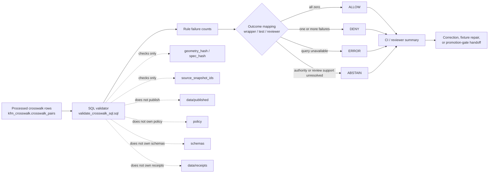

<!-- [KFM_META_BLOCK_V2]
doc_id: kfm://doc/NEEDS-VERIFICATION
title: Crosswalk Validator
type: standard
version: v1
status: draft
owners: TODO-verify-owner-or-codeowners
created: NEEDS-VERIFICATION
updated: 2026-04-27
policy_label: public
related: [../../README.md, ../../../README.md, ../../../../README.md, ./validate_crosswalk_sql.sql, ../../../../schemas/README.md, ../../../../contracts/README.md, ../../../../policy/README.md, ../../../../tests/README.md]
tags: [kfm, validators, crosswalk, sql, fail-closed, evidence, spatial]
notes: [Repository path, owner, adjacent SQL file, CI enforcement, fixtures, and formal policy label require active-branch verification before promotion from draft.]
[/KFM_META_BLOCK_V2] -->

<a id="top"></a>

# Crosswalk Validator

Validate KFM crosswalk pair rows for geometry, overlap, weight, CRS, deterministic hash, source-snapshot, and assignment-rule consistency before downstream trust surfaces consume them.


> [!NOTE]
> **Document status:** `draft` · **Validator status:** `experimental` · **Expected path:** `tools/validators/crosswalk/README.md` · **Owners:** `TODO-verify-owner-or-codeowners`
>
> **Quick jumps:** [What this is](#what-this-is) · [Scope](#scope) · [Repo fit](#repo-fit) · [Accepted inputs](#accepted-inputs) · [Exclusions](#exclusions) · [Directory tree](#directory-tree) · [Quickstart](#quickstart) · [Usage](#usage) · [Validation rules](#validation-rules) · [Outcome grammar](#outcome-grammar) · [Diagram](#diagram) · [Hardening plan](#hardening-plan) · [FAQ](#faq) · [Appendix](#appendix)

> [!IMPORTANT]
> This directory is a **validator lane**, not a source-ingest lane, schema authority, policy authority, catalog publisher, receipt store, proof store, or release mechanism. It checks declared crosswalk rows and reports failure counts. Downstream enforcement, waiver handling, publication, and promotion must stay explicit.

> [!WARNING]
> The SQL validator reports rule-level failure counts. A SQL file alone does **not** prove merge-blocking CI enforcement, fixture coverage, a Python wrapper, a database migration, production database availability, or release readiness. Treat those as **NEEDS VERIFICATION** until the active checkout, tests, and workflow callers prove them.

---

## What this is

This README documents a narrow SQL-first validator lane for crosswalk rows, especially rows that connect two spatial support systems such as hydrologic units and administrative, ecological, infrastructure, hazard, or other domain features.

| This lane is | This lane is not |
| --- | --- |
| A bounded row-integrity validator for crosswalk pair outputs. | A source connector, source registry, or source-rights authority. |
| A failure-count surface suitable for test, CI, or reviewer summaries. | A promotion gate by itself. |
| A place to document rule names, expected columns, and finite validator outcomes. | A catalog, proof, receipt, release, or public publication store. |
| A fail-closed support tool for downstream governance. | A way to bypass KFM lifecycle, policy, evidence, review, or rollback controls. |

### Verification boundary

| Claim | Current README posture | Required proof before stronger claim |
| --- | --- | --- |
| This README is intended for `tools/validators/validators/crosswalk/`. | **PROPOSED / target path** | Active checkout path inspection. |
| `validate_crosswalk_sql.sql` is the adjacent validator file. | **NEEDS VERIFICATION** | File presence and content review in the active branch. |
| The SQL file is invoked by tests or CI. | **NEEDS VERIFICATION** | Workflow/test references plus a successful run. |
| Non-zero failures block merge or promotion. | **NEEDS VERIFICATION** | Wrapper, CI, or promotion-gate evidence. |
| This lane owns crosswalk schema, policy, publication, or source intake. | **DENIED** | Those responsibilities belong to adjacent KFM surfaces. |

[Back to top](#top)

---

## Scope

The target validator surface is SQL-first:

```text
tools/validators/validators/crosswalk/validate_crosswalk_sql.sql
```

The rule set is intended to inspect `kfm_crosswalk.crosswalk_pairs` for:

- impossible or internally inconsistent area overlaps
- bounded percentage and weight fields
- expected CRS declaration
- declared SHA-256 hash shapes
- sufficient source-snapshot lineage
- assignment methods that satisfy their own stated thresholds

### What this validator protects

| Concern | Why it matters in KFM | Current validation posture |
| --- | --- | --- |
| Spatial sanity | Crosswalk rows should not imply negative area or area larger than either support geometry. | SQL failure counts |
| Deterministic identity | Crosswalk results should tie to `geometry_hash` and `spec_hash`, not floating calculations alone. | SQL regex checks |
| Source continuity | Rows should preserve enough source snapshot identity to reconstruct both sides of the relation. | Requires at least two `source_snapshot_ids` |
| CRS discipline | Area measurements should use a declared projected CRS suitable for area checks. | Current rule expects `EPSG:5070` |
| Assignment defensibility | Threshold-labeled assignments should satisfy the threshold they declare. | Checks `primary_overlap_ge_50pct_huc` |

> [!CAUTION]
> A zero-failure result means this SQL rule set found no blocking row-level issue. It does **not** establish source authority, rights, sensitivity clearance, catalog closure, proof completeness, review state, or release readiness.

[Back to top](#top)

---

## Repo fit

**Expected lane:** `tools/validators/validators/crosswalk/`

This directory sits below the validator tooling family and should stay narrow: validate crosswalk row integrity and report reviewable failures.

| Direction | Surface | Relationship |
| --- | --- | --- |
| Parent validator lane | [`../../README.md`](../../README.md) | Shared validator posture, accepted inputs, exclusions, and finite validator outcome grammar. |
| Parent tooling | [`../../../README.md`](../../../README.md) | Broader `tools/` boundary; this lane should not become general tooling sprawl. |
| Root orientation | [`../../../../README.md`](../../../../README.md) | Project-level KFM purpose, truth path, map/AI boundaries, validation, and rollback posture. |
| Local SQL validator | [`./validate_crosswalk_sql.sql`](./validate_crosswalk_sql.sql) | Expected SQL rule set for `kfm_crosswalk.crosswalk_pairs`; verify in active branch. |
| Schemas | [`../../../../schemas/README.md`](../../../../schemas/README.md) | Machine-readable shape authority when a crosswalk schema exists or is added. |
| Contracts | [`../../../../contracts/README.md`](../../../../contracts/README.md) | Human-readable contract and trust-object intent; validators operationalize but do not define meaning alone. |
| Policy | [`../../../../policy/README.md`](../../../../policy/README.md) | Rights, sensitivity, denial logic, waiver posture, and release policy. |
| Tests | [`../../../../tests/README.md`](../../../../tests/README.md) | Fixture and regression proof for validator behavior. |
| Source registry | [`../../../../data/registry/README.md`](../../../../data/registry/README.md) | Source identity, source role, source terms, snapshot lineage, and steward posture. |
| Catalog closure | [`../../../../data/catalog/README.md`](../../../../data/catalog/README.md) | Downstream STAC/DCAT/PROV-style catalog relationships when applicable. |

### Upstream/downstream flow

```text
source snapshots + processed crosswalk rows
  -> kfm_crosswalk.crosswalk_pairs
  -> validate_crosswalk_sql.sql
  -> failure-count report
  -> test / CI / reviewer summary
  -> policy-aware promotion or correction decision
```

The validator may support a release or promotion decision, but it must not replace that decision.

[Back to top](#top)

---

## Accepted inputs

This lane accepts explicit, reviewable inputs already staged for validation.

| Input family | Accepted examples | Required posture |
| --- | --- | --- |
| Crosswalk rows | `kfm_crosswalk.crosswalk_pairs` table or view | Rows expose every field consumed by the SQL validator. |
| Geometry support measures | `overlap_m2`, `huc_area_m2`, `admin_area_m2` | Area values are numeric, non-negative, and internally sane. |
| Normalized ratios | `overlap_pct_huc`, `overlap_pct_admin`, `weight` | Values stay in the closed interval `0..1`. |
| CRS declaration | `crs` | Current SQL expects `EPSG:5070`. |
| Deterministic hashes | `geometry_hash`, `spec_hash` | Values match `sha256:<64 lowercase hex characters>`. |
| Source lineage | `source_snapshot_ids` | Values identify both sides of the source snapshot relationship. |
| Assignment metadata | `assignment_method` | Threshold-sensitive methods satisfy their declared criteria. |
| Review fixtures | Valid and invalid SQL fixtures or seeded rows | Fixture homes and test runner remain **NEEDS VERIFICATION**. |

> [!TIP]
> Prefer deterministic, no-network fixtures for validator tests. Live source harvesting belongs in pipeline or source-specific lanes, not in this directory.

[Back to top](#top)

---

## Exclusions

Do **not** place these responsibilities in this lane.

| Excluded responsibility | Belongs instead | Reason |
| --- | --- | --- |
| Crosswalk source harvesting | `pipelines/` or source-specific domain lanes | Validators inspect outputs; they do not fetch live source data. |
| Schema ownership | `schemas/` after schema-home authority is verified | Validators check shape; they do not settle machine authority. |
| Contract meaning | `contracts/` | Crosswalk semantics should be defined outside the validator. |
| Policy authorship | `policy/` | Deny/allow obligations, rights, sensitivity, and release posture remain policy-owned. |
| Publication or promotion | `release/`, promotion tooling, or governed release docs | A clean validation report is not publication. |
| Receipt storage | `data/receipts/` | Validators may be referenced by receipts; they do not store process memory. |
| Proof custody | `data/proofs/` | Validators may check proof references; they do not own proof objects. |
| Catalog publication | `data/catalog/` | Validators may check catalog linkage; they do not publish catalog records. |
| UI or Focus Mode behavior | `apps/`, `web/`, `ui/`, governed API docs | Crosswalk results may be displayed downstream, but this lane does not render or narrate them. |
| RAW / WORK / QUARANTINE public access | Governed lifecycle flows only | Public or release-facing checks must not bypass KFM lifecycle boundaries. |

[Back to top](#top)

---

## Directory tree

### Expected current shape

```text
tools/validators/validators/crosswalk/
├── README.md                  # this file
└── validate_crosswalk_sql.sql # expected SQL failure-count validator; verify in active branch
```

### Proposed hardening shape

```text
tools/validators/validators/crosswalk/
├── README.md
├── validate_crosswalk_sql.sql
├── examples/                  # PROPOSED no-network SQL seed fixtures
│   ├── valid.crosswalk_pairs.sql
│   └── invalid.crosswalk_pairs.sql
└── reports/                   # PROPOSED local-only generated reports; normally not committed
```

> [!NOTE]
> Keep generated reports, receipts, proofs, catalogs, and release artifacts outside this directory unless an explicit repo convention says otherwise.

[Back to top](#top)

---

## Quickstart

Run from the repository root after the real checkout, database access, and target path are verified.

### 1. Confirm checkout, path, and adjacent SQL file

```bash
git rev-parse --show-toplevel
git status --short
git branch --show-current || true

test -f tools/validators/validators/crosswalk/README.md
test -f tools/validators/validators/crosswalk/validate_crosswalk_sql.sql
find tools/validators/validators/crosswalk -maxdepth 2 -type f -print | sort
```

### 2. Inspect the SQL rules

```bash
sed -n '1,240p' tools/validators/validators/crosswalk/validate_crosswalk_sql.sql
```

### 3. Run the SQL validator

```bash
psql "$KFM_DATABASE_URL" \
  --set ON_ERROR_STOP=1 \
  --file tools/validators/validators/crosswalk/validate_crosswalk_sql.sql
```

Expected output shape:

```text
check_name                         failures
---------------------------------  --------
negative_overlap                   0
overlap_gt_huc_area                0
...
invalid_assignment_primary_rule    0
```

> [!CAUTION]
> `KFM_DATABASE_URL`, database schema migration state, seeded fixtures, and CI database availability are **NEEDS VERIFICATION**. Do not hard-code credentials or private connection strings in this README, workflow YAML, tests, reports, or screenshots.

[Back to top](#top)

---

## Usage

### Current validator behavior

The expected SQL file emits one row per rule:

```sql
SELECT 'negative_overlap' AS check_name, count(*) AS failures
FROM kfm_crosswalk.crosswalk_pairs
WHERE overlap_m2 < 0;
```

Current behavior is **reporting-first**. A downstream wrapper, test, or CI job may map the report to finite validator outcomes, but that wrapper is not confirmed by this README.

### Reviewer interpretation

| Observed result | Interpretation | Next action |
| --- | --- | --- |
| All `failures` are `0` | SQL-scope row checks passed. | Continue evidence, policy, catalog, proof, review, and promotion checks. |
| One or more `failures` values are greater than `0` | SQL-scope row checks failed. | Block release-facing use until rows, schema, or rule definitions are corrected. |
| SQL cannot run | Validator did not complete reliably. | Treat as `ERROR`; inspect database availability, schema migration, credentials, and SQL engine. |
| SQL passes but source authority or review support is missing | Structure is checkable but outward trust is unsupported. | Treat as `ABSTAIN`; resolve source registry, EvidenceBundle, policy, and review context. |

[Back to top](#top)

---

## Validation rules

The current intended SQL validator checks the following rules against `kfm_crosswalk.crosswalk_pairs`.

| Rule name | Failure condition | Why it matters |
| --- | --- | --- |
| `negative_overlap` | `overlap_m2 < 0` | Area overlap cannot be negative. |
| `overlap_gt_huc_area` | `overlap_m2 > huc_area_m2` | Pair overlap cannot exceed the hydrologic support area. |
| `overlap_gt_admin_area` | `overlap_m2 > admin_area_m2` | Pair overlap cannot exceed the administrative or domain support area. |
| `overlap_pct_huc_out_of_bounds` | `overlap_pct_huc < 0 OR overlap_pct_huc > 1` | Percent coverage must stay bounded. |
| `overlap_pct_admin_out_of_bounds` | `overlap_pct_admin < 0 OR overlap_pct_admin > 1` | Percent coverage must stay bounded. |
| `weight_out_of_bounds` | `weight < 0 OR weight > 1` | Crosswalk weights must remain normalized. |
| `invalid_crs` | `crs <> 'EPSG:5070'` | Area calculations require the expected projected CRS declaration. |
| `missing_geometry_hash` | `geometry_hash` does not match `sha256:<64 lowercase hex>` | Geometry identity must be deterministic and reviewable. |
| `missing_spec_hash` | `spec_hash` does not match `sha256:<64 lowercase hex>` | Validator and crosswalk specifications must be traceable. |
| `missing_source_snapshots` | `array_length(source_snapshot_ids, 1) < 2` | Crosswalks should retain both sides of source snapshot identity. |
| `invalid_assignment_primary_rule` | `assignment_method = 'primary_overlap_ge_50pct_huc' AND overlap_pct_huc < 0.5` | Assignment methods must satisfy their own declared threshold. |

### Expected columns

| Column | Expected type posture | Used by rules |
| --- | --- | --- |
| `overlap_m2` | Numeric area | `negative_overlap`, `overlap_gt_huc_area`, `overlap_gt_admin_area` |
| `huc_area_m2` | Numeric area | `overlap_gt_huc_area` |
| `admin_area_m2` | Numeric area | `overlap_gt_admin_area` |
| `overlap_pct_huc` | Numeric ratio `0..1` | `overlap_pct_huc_out_of_bounds`, `invalid_assignment_primary_rule` |
| `overlap_pct_admin` | Numeric ratio `0..1` | `overlap_pct_admin_out_of_bounds` |
| `weight` | Numeric ratio `0..1` | `weight_out_of_bounds` |
| `crs` | CRS string | `invalid_crs` |
| `geometry_hash` | `sha256:<64 lowercase hex>` | `missing_geometry_hash` |
| `spec_hash` | `sha256:<64 lowercase hex>` | `missing_spec_hash` |
| `source_snapshot_ids` | Array-like source snapshot references | `missing_source_snapshots` |
| `assignment_method` | Controlled vocabulary string | `invalid_assignment_primary_rule` |

### Minimum review expectations

A crosswalk validator change should preserve:

- finite, reviewable failure names
- deterministic SQL behavior for the same database state
- no hidden network calls
- no credential exposure
- no direct publication side effect
- visible separation between row validation, policy decision, and promotion
- fixture coverage for both passing and failing examples
- synchronized updates to SQL, README, and tests when a rule changes

[Back to top](#top)

---

## Outcome grammar

Use validator-facing outcomes for this lane. Do not use release-facing `PROMOTE` here.

| Condition | Validator outcome | Review meaning |
| --- | --- | --- |
| Query runs and every `failures` value is `0` | `ALLOW` | No blocking condition found in this SQL scope. |
| Query runs and any `failures` value is greater than `0` | `DENY` | Crosswalk rows violate a documented invariant. |
| Query cannot run because the database, schema, table, or SQL engine is unavailable | `ERROR` | Validator could not complete its work reliably. |
| Query runs but source authority, source terms, or review posture cannot be reconstructed | `ABSTAIN` | Structure may be checkable, but outward trust is unsupported. |

> [!NOTE]
> Within `tools/validators/`, prefer `ALLOW | ABSTAIN | DENY | ERROR` unless a child lane explicitly documents a different validator envelope.

[Back to top](#top)

---

## Diagram



[Back to top](#top)

---

## Hardening plan

### Definition of done for this README

- [x] One H1 only.
- [x] KFM Meta Block V2 present.
- [x] Status, owners, badges, and quick jumps present.
- [x] Verification boundary visible.
- [x] Repo fit, accepted inputs, and exclusions documented.
- [x] Directory tree included.
- [x] SQL validator scope and rules described without overstating enforcement.
- [x] Validator-facing outcome grammar documented.
- [x] Mermaid diagram included and grounded in responsibility boundaries.
- [x] Code fences are language-tagged.
- [x] Remaining implementation unknowns are labeled.

### Definition of done for a validator hardening PR

- [ ] Active branch confirms whether `tools/validators/validators/crosswalk/` remains the intended path.
- [ ] `CODEOWNERS` or owner records confirm maintainers for this lane.
- [ ] `validate_crosswalk_sql.sql` exists beside this README and matches the documented rules.
- [ ] SQL execution is tested against deterministic local fixtures or a documented test database.
- [ ] Positive and negative fixtures cover every rule.
- [ ] A test or wrapper maps rule-count output to finite outcomes.
- [ ] Failure counts are visible in CI or reviewer-facing summaries.
- [ ] Database credentials and private endpoints are not committed.
- [ ] Schema and contract homes are linked but not duplicated here.
- [ ] Policy decisions remain policy-owned.
- [ ] Promotion remains a governed downstream decision, not a side effect of running SQL.
- [ ] Rollback is documented: remove CI invocation first, then retire or replace the SQL file.

### Review checks before promotion use

- [ ] Are `geometry_hash` and `spec_hash` generated deterministically?
- [ ] Are both source snapshots represented in `source_snapshot_ids`?
- [ ] Is `EPSG:5070` still the intended CRS for this crosswalk family?
- [ ] Are area and percent fields computed from the same geometry version?
- [ ] Does `assignment_method` vocabulary have a contract home?
- [ ] Does the release candidate carry enough evidence, policy, catalog, and rollback context for promotion?
- [ ] Is any failure being waived? If yes, is the waiver recorded outside this validator?

[Back to top](#top)

---

## Troubleshooting

| Symptom | Likely cause | Safe response |
| --- | --- | --- |
| `relation "kfm_crosswalk.crosswalk_pairs" does not exist` | Migration, schema name, or database target is missing. | Treat as `ERROR`; verify database setup before interpreting validator results. |
| Every rule returns zero rows unexpectedly | Validator may be pointed at an empty table or wrong database. | Verify row count and fixture seeding before accepting `ALLOW`. |
| Hash rules fail for uppercase hex | Current rule expects lowercase `sha256:<64 hex>`. | Normalize upstream or update the contract, SQL, README, and tests together. |
| CRS rule fails for valid projected alternatives | SQL currently expects `EPSG:5070`. | Confirm whether alternatives are allowed; update rule and evidence together. |
| CI passes despite non-zero failures | Wrapper may not map counts to process exit status. | Add an explicit finite-outcome wrapper or test assertion. |
| Reviewer wants to waive a failure | Waiver handling is outside this validator. | Record waiver in policy/review/promotion surfaces, not by weakening the SQL silently. |

[Back to top](#top)

---

## FAQ

### Is this validator a promotion gate?

No. It can support a promotion gate by producing failure-count evidence, but promotion requires policy, evidence, catalog, proof, review, and rollback context.

### Does a zero-failure SQL report mean a crosswalk is publishable?

No. It means this SQL rule set found no blocking row-level condition. Publication still requires source authority, rights, sensitivity, review state, catalog/proof closure, and release readiness.

### Why does the SQL require `EPSG:5070`?

The current rule set expects crosswalk area calculations to be measured in an equal-area projected CRS. If the repo later admits additional CRS options, update the SQL, tests, and this README together.

### Should this lane emit receipts?

Not by default. Validator reports may be referenced by receipts or promotion records, but receipt storage belongs in the receipt lifecycle surface.

### Should this lane use `ALLOW` or `PROMOTE`?

Use `ALLOW` for this validator lane. `PROMOTE` is a release-facing outcome and belongs to promotion-gate logic.

[Back to top](#top)

---

## Appendix

<details>
<summary><strong>Illustrative report shape for a future wrapper</strong></summary>

This JSON is **illustrative only**. It does not claim that a wrapper currently exists.

```json
{
  "tool": "kfm-crosswalk-sql-validator",
  "tool_version": "NEEDS-VERIFICATION",
  "subject_ref": "kfm_crosswalk.crosswalk_pairs",
  "outcome": "DENY",
  "checked_at": "2026-04-27T00:00:00Z",
  "checks": [
    {
      "name": "negative_overlap",
      "failures": 0,
      "status": "pass"
    },
    {
      "name": "missing_spec_hash",
      "failures": 3,
      "status": "fail",
      "reason_code": "MISSING_OR_MALFORMED_SPEC_HASH"
    }
  ],
  "notes": [
    "Illustrative wrapper output only.",
    "Do not treat this as an emitted schema or current CI artifact until active-branch verification proves it."
  ]
}
```

</details>

<details>
<summary><strong>Maintainer verification prompts</strong></summary>

Before hardening this file from `draft` to `review` or `published`, verify:

- Does the active branch keep this nested path, or should the lane move to `tools/validators/crosswalk/`?
- Does the database schema create `kfm_crosswalk.crosswalk_pairs` with all columns used by the SQL?
- Are SQL fixtures committed, generated, or deliberately external?
- Which command should CI use to run this SQL?
- Does CI currently treat non-zero failure counts as blocking?
- Where should generated validation reports be written?
- Are `geometry_hash` and `spec_hash` definitions documented in `schemas/`, `contracts/`, or an ADR?
- Is `EPSG:5070` a crosswalk-wide invariant or only a first-slice assumption?
- Which release or promotion gate consumes crosswalk validator output?
- What rollback path applies if a crosswalk release is later corrected or withdrawn?

</details>

[Back to top](#top)
