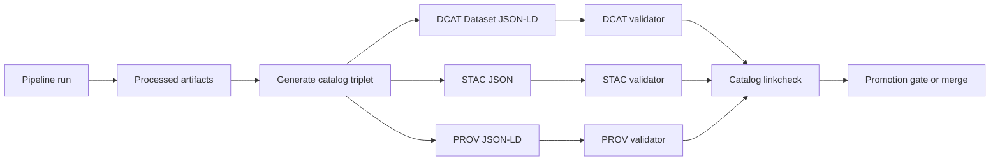

<!-- [KFM_META_BLOCK_V2]
doc_id: kfm://doc/6e8ee2a6-5ee1-4c3d-80f4-cc3e94a1c1b4
title: DCAT Validator
type: standard
version: v1
status: draft
owners: TBD
created: 2026-02-26
updated: 2026-02-26
policy_label: public
related:
  - tools/validators/validate_dcat.js
  - tools/validators/stac_validator
  - tools/validators/prov_validator
  - tools/linkcheck/catalog_linkcheck
  - contracts/schemas (if present)
tags: [kfm, validator, dcat, catalog]
notes:
  - Implements the KFM DCAT profile (minimum required fields + distribution metadata).
  - Intended to run as a CI merge gate for catalog artifacts.
[/KFM_META_BLOCK_V2] -->

# DCAT Validator


-lightgrey)

Fail-closed validation of **KFM DCAT (JSON-LD)** dataset records and distributions.

- ✅ Blocks merges when DCAT metadata is incomplete or malformed.
- ✅ Keeps the **catalog triplet** (DCAT + STAC + PROV) strict and predictable.
- ✅ Supports evidence resolution by ensuring dataset identifiers, policy labels, and provenance links exist.

---

## Quick navigation

- [What this does](#what-this-does)
- [Where this fits in KFM](#where-this-fits-in-kfm)
- [Running it](#running-it)
- [Inputs and outputs](#inputs-and-outputs)
- [Validation rules](#validation-rules-kfm-dcat-profile)
- [Troubleshooting](#troubleshooting)
- [Contributing](#contributing)
- [Directory layout](#directory-layout)
- [Appendix: minimal JSON-LD skeleton](#appendix-minimal-json-ld-skeleton)

---

## What this does

This validator enforces the **KFM DCAT profile** for dataset-level catalog records:

- Validates that DCAT dataset records are **valid JSON-LD** and match the required KFM fields.
- Validates that each dataset record includes **distributions** for publishable artifacts (e.g., parquet, tiles).
- Verifies that a dataset record includes a **provenance pointer** to the PROV bundle/run (`prov:wasGeneratedBy`).

> [!WARNING]
> Treat this validator as a **contract surface**: it is expected to be deterministic, offline-friendly, and **fail closed**.
> A single missing field should block promotion/merge rather than “best-effort” guessing.

---

## Where this fits in KFM

KFM uses a **catalog triplet** that acts as the interface between pipeline outputs and runtime/UI:

- **DCAT**: dataset identity, publisher, license/rights, coverage, and distributions.
- **STAC**: spatiotemporal extents + asset-level metadata.
- **PROV**: lineage (inputs, transforms, environment, approvals).

This validator covers **only the DCAT leg**. Cross-file referential integrity is typically handled by the catalog link-checker.



---

## Running it

### CI usage (expected)

KFM CI typically invokes a dedicated script from the repo root:

```bash
node tools/validators/validate_dcat.js
```

It is commonly paired with STAC + PROV validators and a catalog link-checker:

```bash
node tools/validators/validate_dcat.js
node tools/validators/validate_stac.js
node tools/validators/validate_prov.js
node tools/linkcheck/catalog_linkcheck.js
```

### Local usage

From the repo root:

```bash
npm ci
node tools/validators/validate_dcat.js
```

> [!NOTE]
> If you’re wiring this validator into a new repo layout, prefer **zero-arg defaults** (scan the canonical catalog output
> directory) and add optional flags later.

---

## Inputs and outputs

### Inputs

- **DCAT Dataset record(s)** in JSON-LD (`application/ld+json`).
- Records should use stable KFM identifiers (e.g., `kfm://dataset/<dataset_id>@<dataset_version_id>`).
- Records should be generated as part of the **promotion contract** (Raw → Work → Processed → Catalog/Triplet → Published).

### Outputs

- **Exit code**: `0` on success, non-zero on validation failure.
- **Human-readable diagnostics**: expected to list offending files + missing/invalid fields.

> [!TIP]
> Consider emitting a machine-readable report (JSON) as a build artifact if your CI needs to surface validation results
> in a UI. (Implementation detail; add once the validator code exists.)

---

## Validation rules: KFM DCAT profile

The KFM governance guide describes a **minimum DCAT profile** intended to make validation strict and predictable.

### Dataset record (minimum required fields)

| Field | Why it’s required |
|---|---|
| `dct:title` | Human-friendly dataset name |
| `dct:description` | Summary of contents, transformations, limitations |
| `dct:publisher` | Who is responsible for publishing |
| `dct:license` **or** `dct:rights` | Rights + reuse gate input |
| `dcat:theme` | Discoverability via controlled vocabulary |
| `dct:spatial` and `dct:temporal` | Dataset-level coverage |
| `dcat:distribution` | What artifacts are available |
| `prov:wasGeneratedBy` | Link to run/provenance bundle |
| `kfm:policy_label` | Classification input for policy enforcement |
| `kfm:dataset_id` and `kfm:dataset_version_id` | Stable identity + versioning |

### Distribution (minimum expected shape)

Each `dcat:distribution[]` entry should, at minimum:

| Field | Notes |
|---|---|
| `@type: "dcat:Distribution"` | Explicit distribution typing |
| `dct:title` | Human-friendly label (e.g., “GeoParquet distribution”) |
| `dcat:mediaType` | MIME type (e.g., `application/x-parquet`) |
| `dcat:downloadURL` | Artifact pointer (S3, HTTPS, etc.) |
| `kfm:digest` | Content digest for integrity & evidence resolution |

### Cross-link expectations

DCAT is part of a triplet; link correctness is a testable invariant:

- DCAT dataset → distributions → artifact digests
- DCAT dataset → `prov:wasGeneratedBy` → PROV bundle
- STAC collection → link rel `describedby` → DCAT dataset
- STAC item → link to PROV activity/run receipt

If you need a single “does everything link up?” check, use `tools/linkcheck/catalog_linkcheck`.

---

## Troubleshooting

Common failure modes:

- **Missing license/rights**: promotion must fail closed if rights are unclear.
- **No distributions** (or missing `kfm:digest`): runtime cannot serve governed artifacts deterministically.
- **Missing `kfm:policy_label`**: runtime cannot apply default-deny/policy filtering.
- **Broken PROV pointer** (`prov:wasGeneratedBy` missing or malformed): evidence cannot explain *how* outputs were produced.

---

## Contributing

When changing validation rules:

- [ ] Update the profile/shape definition (schemas or SHACL shapes).
- [ ] Add **golden fixtures**: at least one passing and one failing record.
- [ ] Add unit tests that prevent drift.
- [ ] Keep validation deterministic (no network calls; no time-based behavior).

> [!NOTE]
> If the governance guide evolves (new required fields or changed naming such as `kfm:dataset_id` vs `kfm:dataset_slug`),
> update the validator and fixtures in the same PR so CI changes are reviewable.

---

## Directory layout

> Update this section once the implementation lands; paths below are a recommended baseline.

```text
tools/validators/dcat_validator/
├─ README.md               # this file
├─ shapes/                 # (TBD) SHACL shapes or equivalent profile definitions
├─ fixtures/               # (TBD) golden pass/fail JSON-LD examples
├─ src/                    # (TBD) validator implementation
└─ ../validate_dcat.js      # expected CI entrypoint wrapper
```

---

## Appendix: minimal JSON-LD skeleton

A minimal **shape-aligned** dataset record (illustrative):

```json
{
  "@context": {
    "dcat": "http://www.w3.org/ns/dcat#",
    "dct": "http://purl.org/dc/terms/",
    "prov": "http://www.w3.org/ns/prov#",
    "kfm": "https://kansasfrontiermatrix.org/ns#"
  },
  "@id": "kfm://dataset/<dataset_id>@<dataset_version_id>",
  "@type": "dcat:Dataset",

  "dct:title": "<title>",
  "dct:description": "<description>",
  "dct:publisher": "<publisher>",
  "dct:license": "<license-or-rights>",

  "dcat:theme": ["<theme>", "<theme>"] ,
  "dct:spatial": "<spatial coverage>",
  "dct:temporal": { "@type": "dct:PeriodOfTime", "dcat:startDate": "YYYY-MM-DD", "dcat:endDate": "YYYY-MM-DD" },

  "kfm:policy_label": "public",
  "kfm:dataset_id": "<dataset_id>",
  "kfm:dataset_version_id": "<dataset_version_id>",

  "dcat:distribution": [
    {
      "@type": "dcat:Distribution",
      "dct:title": "GeoParquet distribution",
      "dcat:mediaType": "application/x-parquet",
      "dcat:downloadURL": "s3://<bucket>/<path>.parquet",
      "kfm:digest": "sha256:<hex>"
    }
  ],

  "prov:wasGeneratedBy": { "@id": "kfm://run/<run_id>" }
}
```

---

[Back to top](#dcat-validator)
