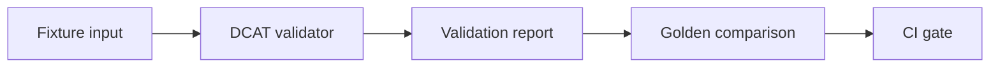

<!-- [KFM_META_BLOCK_V2]
doc_id: kfm://doc/8d5e5c52-1a58-46cb-9b9b-7d6a3c2d9d1a
title: DCAT Validator Fixtures
type: standard
version: v1
status: draft
owners: TODO
created: 2026-02-26
updated: 2026-02-26
policy_label: restricted
related:
  - tools/validators/dcat_validator
tags: [kfm, validator, dcat, fixtures]
notes:
  - Test fixtures and golden outputs for DCAT validation.
  - Keep fixtures synthetic and deterministic.
[/KFM_META_BLOCK_V2] -->

# DCAT Validator Fixtures

Golden fixture inputs and expected outputs for `dcat_validator` regression testing.


- **Owners:** TODO
- **Applies to:** `tools/validators/dcat_validator/*`

## Navigation

- [Purpose](#purpose)
- [Where this fits](#where-this-fits)
- [Fixtures contract](#fixtures-contract)
- [Layout and naming](#layout-and-naming)
- [Adding or updating a fixture](#adding-or-updating-a-fixture)
- [Running the fixtures](#running-the-fixtures)
- [Governance and safety](#governance-and-safety)
- [FAQ](#faq)

---

## Purpose

This directory contains **fixture inputs** (small DCAT documents) and, when applicable, **golden/expected outputs** (validation reports). They exist to:

- Make validator behavior **testable and repeatable**
- Prevent regressions when the validator, rules, or profiles evolve
- Provide *minimal* examples of valid and invalid DCAT patterns we care about

## Where this fits

This folder is a **test-fixture bundle** for the DCAT validator.

- **Directory:** `tools/validators/dcat_validator/fixtures/`
- **Used by:** the validator’s unit/integration tests (and/or CI checks)
- **Not used by:** runtime production validation (unless explicitly wired by tests)

If you’re looking for the validator implementation, start in `tools/validators/dcat_validator/`.

## Fixtures contract

Every fixture case SHOULD be:

1. **Small** (readable in a code review)
2. **Focused** (fails for *one* reason, or demonstrates *one* capability)
3. **Deterministic** (no timestamps, random IDs, unstable ordering)
4. **Safe to ship** (no secrets, no personal data, no restricted locations)
5. **Licensed/attributed** if derived from an external source (prefer synthetic)

When a fixture is expected to fail validation, the expected output MUST be stable enough to serve as a “golden” (or the test harness must normalize it).



## Layout and naming

The exact fixture set is project-specific, but we recommend (and tests may assume) a structure similar to:

```text
fixtures/
  README.md
  manifest.yaml                # optional registry of cases (if the harness uses it)
  cases/
    valid/
      <case_id>.<ext>
    invalid/
      <case_id>.<ext>
  expected/
    <case_id>.errors.json      # expected error list (for invalid fixtures)
    <case_id>.report.json      # optional full normalized report
```

### Case IDs

Use a **stable, descriptive case ID** so diffs are understandable:

| Pattern | Example | Notes |
|---|---|---|
| `catalog_minimal_*` | `catalog_minimal_valid.jsonld` | Smallest passing catalog |
| `dataset_*` | `dataset_missing_identifier.ttl` | Dataset-level cases |
| `distribution_*` | `distribution_bad_media_type.jsonld` | Distribution cases |
| `policy_*` | `policy_restricted_redaction_required.jsonld` | KFM profile/policy overlays (if applicable) |

### File formats

Fixtures MAY be authored in any format the validator supports, such as:

- JSON-LD (`.jsonld`)
- Turtle (`.ttl`)
- RDF/XML (`.rdf`)
- N-Triples / N-Quads (`.nt`, `.nq`)

Prefer **one canonical format** per case to keep review burden low.

### Expected outputs

If the validator emits a structured report, the golden files SHOULD be normalized to avoid diffs caused by:

- non-deterministic ordering
- absolute file paths
- environment-specific details
- timestamps

**Recommendation:** store only the stable subset needed for assertions (e.g., a list of error codes + paths).

## Adding or updating a fixture

Use this checklist so fixtures remain useful as governed regression evidence:

1. **Pick a case ID** that describes the behavior.
2. Add the input document under the appropriate folder (or follow the existing project convention).
3. If the case is expected to fail, add/update the corresponding `expected/<case_id>.*` file(s).
4. Ensure the fixture is:
   - minimal (delete unrelated triples/fields)
   - deterministic (no generated UUIDs unless pinned)
   - safe (synthetic values; no secrets)
5. Run the validator test suite locally and confirm the golden comparison passes.
6. If you introduced a **new convention**, update this README.

### Definition of done

- [ ] Fixture input is minimal and readable
- [ ] One primary intention per fixture case
- [ ] Expected output is normalized/stable
- [ ] No sensitive data included
- [ ] Tests pass in CI

## Running the fixtures

This repo may wire fixtures into different runners. Use the project’s existing test command.

Common patterns (pick the one your repo uses):

```bash
# Python / pytest
pytest -q tools/validators/dcat_validator

# Node / Jest
npm test -- tools/validators/dcat_validator

# Validator CLI (if present)
python -m tools.validators.dcat_validator validate tools/validators/dcat_validator/fixtures/cases/valid/<case_id>.<ext>
```

If none of the above apply, search for references to `fixtures/` in the validator tests.

## Governance and safety

Fixtures are treated as **shippable artifacts**. That means:

- **No secrets** (API keys, tokens, credentials)
- **No personal data** unless explicitly approved and documented
- **No precise coordinates** for vulnerable or restricted locations
- **No copyrighted text dumps**: keep examples small and attributable

If you suspect a fixture includes sensitive content, **remove or redact it immediately** and open a governance review.

## FAQ

### Why not just generate fixtures?

Generated fixtures tend to drift and are hard to review. Hand-authored fixtures make changes explicit and regressions explainable.

### Why store expected outputs at all?

Golden outputs catch subtle validator behavior changes (error codes, severities, paths). When outputs change intentionally, the diff is the review artifact.

### What if the validator report format changes?

Prefer to:

1. Add a normalization step in tests (so older goldens still compare), or
2. Bulk update goldens in one commit with a clear rationale.

---

<details>
<summary>Appendix: Fixture header templates</summary>

#### Turtle (`.ttl`)

```ttl
# Fixture: <case_id>
# Source: synthetic
# Purpose: <one line>
# Notes: keep IDs stable; avoid timestamps
```

#### JSON-LD (`.jsonld`)

```json
{
  "_comment": {
    "fixture": "<case_id>",
    "source": "synthetic",
    "purpose": "<one line>",
    "notes": "keep IDs stable; avoid timestamps"
  }
}
```

</details>
