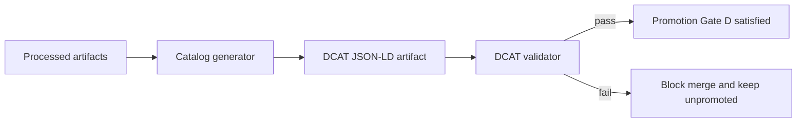

<!-- [KFM_META_BLOCK_V2]
doc_id: kfm://doc/77899cc3-c257-4079-b921-faaff2398982
title: DCAT Validator Tests
type: standard
version: v1
status: draft
owners: TBD
created: 2026-02-26
updated: 2026-02-26
policy_label: internal
related:
  - tools/validators/dcat_validator/
  - tools/validators/stac_validator/
  - tools/validators/prov_validator/
  - tools/linkcheck/catalog_linkcheck/
tags: [kfm, validation, dcat, tests, catalog, promotion-contract]
notes:
  - Contract + regression tests for fail-closed DCAT profile validation (Promotion Contract Gate D).
  - Update “owners”, “policy_label”, and any runner commands once repo conventions are confirmed.
[/KFM_META_BLOCK_V2] -->

<a id="top"></a>

# DCAT Validator — Test Suite
**Purpose:** Contract + regression tests for `dcat_validator`, designed to **fail closed** and block promotion/merge when DCAT artifacts are invalid.

**Status:** Draft • **Owners:** TBD (assign an owning team) • **Scope:** `tools/validators/dcat_validator/tests/`


---

## Quick navigation
- [Purpose](#purpose)
- [Where this fits](#where-this-fits)
- [Directory layout](#directory-layout)
- [Running tests](#running-tests)
- [Test cases matrix](#test-cases-matrix)
- [Adding a new test](#adding-a-new-test)
- [Design invariants](#design-invariants)
- [Troubleshooting](#troubleshooting)

---

## Purpose
These tests exist to ensure:

- **DCAT artifacts are validated deterministically** (same input → same pass/fail and stable error identifiers).
- The validator enforces a **profile** (KFM’s DCAT “minimum credible” expectations) and returns actionable, testable failures.
- CI can safely treat validation failure as a **hard gate** (i.e., “block merge / block promotion”).

> NOTE  
> KFM posture is “catalog triplet (DCAT/STAC/PROV) + strict cross-links + fail closed.”  
> The exact field-level profile details may evolve; this suite should make those changes explicit via fixtures + golden expectations.

[Back to top](#top)

---

## Where this fits
The validator and its tests support the KFM truth-path promotion flow:



This folder covers **tests** only. For the validator implementation and CLI usage, see the parent directory docs (e.g., `tools/validators/dcat_validator/README.md` if present).

[Back to top](#top)

---

## Directory layout

### What belongs here
- **Fixtures**: minimal, synthetic DCAT JSON-LD examples (valid + invalid) covering each rule.
- **Golden expectations**: stable error codes/messages (or normalized error objects) per fixture.
- **Test helpers**: small utilities to run the validator and normalize output for snapshotting.

### What must NOT go here
- Real production catalogs (may include sensitive metadata).
- Large fixtures that slow CI (keep fixtures minimal).
- Network-dependent tests (tests MUST run offline).
- Non-deterministic tests (no “current time”, random ordering, or environment-specific output).

### Suggested tree (update to match repo reality)
> TIP  
> Keep the directory structure shallow. Prefer a “fixture + expectation” pattern.

```text
tools/validators/dcat_validator/tests/
  README.md

  fixtures/
    valid/
      # minimal-valid.jsonld
    invalid/
      # missing-license.jsonld
      # missing-publisher.jsonld
      # invalid-spatial-footprint.jsonld
      # missing-distributions.jsonld
      # missing-prov-link.jsonld

  expected/
    # Optional: JSON snapshots of normalized errors
    # missing-license.expected.json

  helpers/
    # Optional: normalizers, loaders, shared asserts

  test_*.*
    # One or more test files (language/framework depends on repo)
```

[Back to top](#top)

---

## Running tests

> WARNING  
> The exact command(s) depend on the repo’s tooling (Python/Node/Bazel/etc.).  
> This section is intentionally written to be **safe by default** and easy to update once confirmed.

### Step 1 — Identify the runner (quick checks)
From repo root, check which of these exists near `tools/validators/dcat_validator/`:

- `pyproject.toml` / `pytest.ini` / `requirements*.txt` → likely **pytest**
- `package.json` / `pnpm-workspace.yaml` → likely **npm/pnpm + jest/vitest**
- `go.mod` → likely **go test**
- `bazel*` / `WORKSPACE` → likely **bazel test**

### Step 2 — Run the suite (examples; update once confirmed)
Pick the matching command style and replace paths as needed:

- **Pytest example** (not confirmed):
  - `python -m pytest tools/validators/dcat_validator/tests -q`

- **Node workspace example** (not confirmed):
  - `npm test --workspace tools/validators/dcat_validator`
  - or `pnpm -C tools/validators/dcat_validator test`

- **Go example** (not confirmed):
  - `go test ./tools/validators/dcat_validator/...`

- **Bazel example** (not confirmed):
  - `bazel test //tools/validators/dcat_validator/...`

[Back to top](#top)

---

## Test cases matrix

This suite should cover the **minimum DCAT expectations** and the **fail-closed posture**.

| Category | What it protects | Example fixture name | Expected result |
|---|---|---|---|
| Minimal valid | “Happy path” for CI | `valid/minimal-valid.jsonld` | ✅ Pass |
| Missing title | Prevent unlabeled datasets | `invalid/missing-title.jsonld` | ❌ Fail |
| Missing publisher | Enforce publisher provenance | `invalid/missing-publisher.jsonld` | ❌ Fail |
| Missing/unknown license | Fail closed on rights ambiguity | `invalid/missing-license.jsonld` | ❌ Fail |
| Missing spatial footprint | Prevent “where?” ambiguity | `invalid/missing-spatial-footprint.jsonld` | ❌ Fail |
| Missing distributions | Require raw/processed/catalog endpoints | `invalid/missing-distributions.jsonld` | ❌ Fail |
| Missing PROV link | Ensure DCAT links to lineage | `invalid/missing-prov-link.jsonld` | ❌ Fail |
| Non-JSON/invalid JSON-LD | Parser robustness | `invalid/not-jsonld.txt` | ❌ Fail |

> NOTE  
> Prefer asserting on **stable, machine-parseable error identifiers** (e.g., `error.code`) and the failing JSON Pointer / field path, rather than fragile full-text messages.

[Back to top](#top)

---

## Adding a new test

### Checklist
- [ ] Add a **minimal** fixture under `fixtures/valid/` or `fixtures/invalid/`
- [ ] Add/update the expected output (golden) under `expected/` (if used)
- [ ] Ensure test asserts on:
  - [ ] pass/fail
  - [ ] stable error code(s)
  - [ ] failing field path(s)
- [ ] Run the suite locally and confirm deterministic output
- [ ] Keep fixture free of real-world sensitive data

### Pattern (fixture → run → assert)
Pseudo-structure (adapt to your framework):

```text
for each fixture:
  result = run_validator(fixture)
  assert result.ok == expected.ok
  assert normalize(result.errors) == load_expected_errors(...)
```

[Back to top](#top)

---

## Design invariants

These invariants are treated as **contractual behavior** for the validator and its test suite:

1. **Fail closed**: missing or ambiguous required metadata MUST fail validation.
2. **Deterministic**: validation output MUST be stable across OS/runtime.
3. **Offline**: tests MUST not call the network.
4. **Small fixtures**: fixtures SHOULD be minimal and fast.
5. **Actionable errors**: failures SHOULD include a stable code and a field path.

> TIP  
> If you need richer “cross-link” validation (DCAT ↔ STAC ↔ PROV referential integrity), keep those tests in a dedicated link-check suite (or run link-check in CI alongside validator tests).

[Back to top](#top)

---

## Troubleshooting

- **JSON-LD context issues**: ensure fixtures include the required `@context` for your profile.
- **Ordering drift**: if errors arrive in nondeterministic order, normalize/sort them before snapshot comparisons.
- **“It passes locally but fails in CI”**: check for hidden environment dependencies (locale, filesystem ordering, line endings).

[Back to top](#top)
