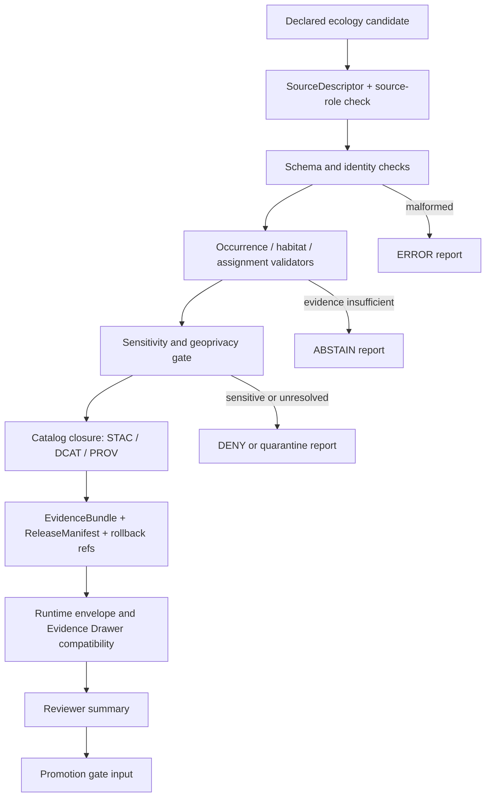

<!-- [KFM_META_BLOCK_V2]
doc_id: kfm://doc/NEEDS-VERIFICATION
title: Ecology Validators
type: standard
version: v1
status: draft
owners: TODO-NEEDS-VERIFICATION
created: YYYY-MM-DD
updated: 2026-04-28
policy_label: TODO-NEEDS-VERIFICATION
related: [../README.md, ../promotion_gate/README.md, ../../ci/README.md, ../../../contracts/README.md, ../../../schemas/README.md, ../../../policy/README.md, ../../../data/registry/README.md, ../../../data/receipts/README.md, ../../../data/proofs/README.md, ../../../tests/README.md, ../../../tests/e2e/runtime_proof/README.md]
tags: [kfm, validators, ecology, habitat, fauna, flora, biodiversity, evidence, fail-closed]
notes: [Target path requested as tools/validators/ecology/README.md. Drafted from attached KFM doctrine, ecology-adjacent Habitat/Fauna/Flora blueprints, validator README conventions, and current-session workspace scan. No mounted repository or executable ecology validator inventory was available; owner, created date, policy label, schema home, CI wiring, exact adjacent links, and executable files remain NEEDS VERIFICATION.]
[/KFM_META_BLOCK_V2] -->

<a id="top"></a>

# Ecology Validators

Fail-closed validation lane for ecology candidate artifacts before they can become reviewable, evidence-backed KFM outputs.

> [!IMPORTANT]
> **Status:** experimental  
> **Document status:** draft  
> **Owners:** `TODO-NEEDS-VERIFICATION`  
> **Path:** `tools/validators/ecology/README.md`  
> **Repo fit:** child lane of [`tools/validators/`](../README.md); upstream of release review and promotion checks; downstream of source descriptors, schemas, policy, receipts, proofs, and ecology domain docs.  
> 
> 
> 
> 
> 
>   
> **Quick jumps:** [Scope](#scope) · [Repo fit](#repo-fit) · [Accepted inputs](#accepted-inputs) · [Exclusions](#exclusions) · [Current evidence snapshot](#current-evidence-snapshot) · [Directory tree](#directory-tree) · [Validation flow](#validation-flow) · [Validator matrix](#validator-matrix) · [Quickstart](#quickstart) · [Outputs](#outputs) · [Policy posture](#policy-posture) · [Tests](#tests) · [Definition of done](#definition-of-done) · [FAQ](#faq) · [Appendix](#appendix)

> [!NOTE]
> This README defines a **validator contract and lane shape**, not proof that the executable files are already present. Treat all listed validator filenames as **PROPOSED** until the active repository is mounted and inspected.

---

## Scope

`tools/validators/ecology/` is the ecology-facing validator surface for biodiversity and habitat-adjacent candidate artifacts that may later feed KFM review, catalog closure, governed APIs, Evidence Drawer payloads, Focus Mode responses, or promotion gates.

Use this lane when the subject under validation is an ecology candidate that must preserve the difference between:

| Must remain distinct | Why it matters |
| --- | --- |
| **Observed occurrence** | An occurrence, specimen, survey, plot, or photo record is evidence-bearing but may be uncertain, licensed, duplicated, sensitive, or spatially imprecise. |
| **Habitat surface / covariate** | A raster, grid, polygon, or class surface provides context; it is not proof that a species is present. |
| **Derived habitat assignment** | A point-to-surface join is a derivation with parameters, input refs, receipts, and rollback requirements. |
| **Modeled range or suitability** | A model output is a derivative surface, not an observed record. |
| **Legal / conservation / stewardship status** | A regulatory or steward-reviewed status assertion has authority rules that occurrence aggregators cannot replace. |
| **Public-safe representation** | A generalized or redacted public layer is not the internal exact geometry. |
| **AI or Focus Mode explanation** | Generated text can summarize released evidence only after EvidenceBundle resolution and policy checks. |

This lane should validate candidates before they are treated as release-ready. It should not publish, repair, reinterpret, or silently normalize high-risk records into truth.

[Back to top](#top)

---

## Repo fit

### Path

`tools/validators/ecology/README.md`

### Upstream authorities

| Surface | Relationship | Status |
| --- | --- | --- |
| [`../README.md`](../README.md) | Parent validator-family guidance and shared fail-closed posture. | NEEDS VERIFICATION |
| [`../../../contracts/README.md`](../../../contracts/README.md) | Human-readable contract authority, if present. | NEEDS VERIFICATION |
| [`../../../schemas/README.md`](../../../schemas/README.md) | Machine schema authority, if present. | NEEDS VERIFICATION |
| [`../../../policy/README.md`](../../../policy/README.md) | Policy and deny/obligation semantics. | NEEDS VERIFICATION |
| [`../../../data/registry/README.md`](../../../data/registry/README.md) | SourceDescriptor and source-role registry home. | NEEDS VERIFICATION |
| `docs/domains/{habitat,fauna,flora,ecology}/` | Domain doctrine, preservation matrices, source registries, and gates. | PROPOSED / NEEDS VERIFICATION |

### Downstream consumers

| Consumer | What it should receive |
| --- | --- |
| [`../promotion_gate/README.md`](../promotion_gate/README.md) | Release-readiness reports, finite decision payloads, catalog/proof closure status. |
| [`../../ci/README.md`](../../ci/README.md) | Reviewer-readable summaries, not hidden policy logic. |
| [`../../../data/receipts/README.md`](../../../data/receipts/README.md) | Run receipts and validation summaries as process memory. |
| [`../../../data/proofs/README.md`](../../../data/proofs/README.md) | EvidenceBundle, ReleaseManifest, CatalogMatrix, rollback refs, and proof pack inputs. |
| `apps/governed_api/` | Only after released artifact and EvidenceBundle resolution are proven. |
| Evidence Drawer / Focus Mode | Trust payloads and finite outcomes, never raw model text or raw data paths. |

> [!WARNING]
> `tools/validators/ecology/` must not become a second schema home, policy engine, source registry, publication surface, or UI truth source. It checks declared artifacts; it does not redefine them.

[Back to top](#top)

---

## Accepted inputs

The validator lane may consume small, declared, reviewable inputs:

- `SourceDescriptor` records for ecology sources.
- Schema-valid candidate JSON / GeoJSON / descriptor payloads.
- Public-safe fixture records for flora, fauna, habitat, or habitat-assignment tests.
- Processed habitat surface descriptors, class lookup tables, and derivation parameter records.
- Candidate occurrence records with geometry, precision, time, provenance, rights, and sensitivity fields.
- Candidate redaction or generalization receipts.
- Candidate STAC / DCAT / PROV records.
- Candidate EvidenceBundle, DecisionEnvelope, ReleaseManifest, LayerManifest, CatalogMatrix, and rollback refs.
- Validator configuration files that are explicitly versioned and cited.
- No-network fixtures for ANSWER / ABSTAIN / DENY / ERROR behavior.

## Exclusions

Do **not** place or process the following here:

| Excluded | Goes instead |
| --- | --- |
| Raw habitat rasters, raw occurrence exports, source API dumps, or secret-bearing payloads | `data/raw/`, `data/work/`, `data/quarantine/`, or secure source-specific lanes |
| Live source fetching, scraping, watcher logic, or connector activation | `pipelines/`, source registries, and source-admission runbooks |
| Canonical schema definitions | `schemas/` or the repo-confirmed schema home |
| Policy law, rights decisions, source authority decisions, or steward approvals | `policy/`, source contracts, review records, and governance docs |
| Publication, mutable aliases, release promotion, or withdrawal | promotion/release lanes and governed release tooling |
| UI rendering components or Evidence Drawer layout code | UI/app lanes |
| AI prompt text or generated claims | governed AI/runtime contracts after EvidenceBundle resolution |
| Sensitive exact locations for rare, protected, culturally sensitive, or steward-controlled records | restricted data lanes with explicit authorization and secure logging |

[Back to top](#top)

---

## Current evidence snapshot

| Evidence item | Status | How this README uses it |
| --- | --- | --- |
| No mounted repository was available in this session. | CONFIRMED | Keeps executable file inventory, CI wiring, and adjacent links as NEEDS VERIFICATION. |
| KFM doctrine centers the inspectable claim over maps, tiles, graphs, AI text, or raw datasets. | CONFIRMED doctrine | Makes validators responsible for evidence linkage, finite outcomes, policy visibility, and release-readiness checks. |
| Habitat + Fauna thin-slice doctrine treats habitat source, fauna occurrence, habitat assignment, public artifact, API response, and Evidence Drawer payload as separate object families. | CONFIRMED doctrine / PROPOSED realization | Drives the validator set and the no-collapse rules below. |
| Fauna and Flora reports both require source-role, rights, sensitivity, geoprivacy, EvidenceBundle, DecisionEnvelope, catalog, release, and rollback handling. | CONFIRMED doctrine / PROPOSED realization | Sets the minimum gates for ecology candidates. |
| Exact schema home and runtime API path remain unresolved without checkout inspection. | UNKNOWN / NEEDS VERIFICATION | Prevents this README from claiming current `schemas/contracts/v1/` or API route implementation. |
| Ecology validator executables under this exact path were not visible. | UNKNOWN | Directory tree is labeled PROPOSED. |

[Back to top](#top)

---

## Directory tree

### Proposed lane shape

```text
tools/validators/ecology/
├── README.md
├── run_all.py
├── validate_source_descriptors.py
├── validate_taxa.py
├── validate_occurrences.py
├── validate_habitat_surfaces.py
├── validate_habitat_assignments.py
├── validate_sensitivity.py
├── validate_catalog_closure.py
├── validate_release_bundle.py
├── validate_runtime_envelope.py
├── render_summary.py
└── fixtures/
    ├── valid/
    └── invalid/
```

| File | Status | Primary role |
| --- | --- | --- |
| `README.md` | THIS DOC | Lane contract, boundaries, quickstart, gates, and verification backlog. |
| `run_all.py` | PROPOSED | Aggregate fail-closed runner for local review and CI. |
| `validate_source_descriptors.py` | PROPOSED | Check source role, rights, authority scope, citation, cadence, steward, and content identity. |
| `validate_taxa.py` | PROPOSED | Check taxon/naming/crosswalk records without treating names as occurrence evidence. |
| `validate_occurrences.py` | PROPOSED | Check occurrence geometry, precision, time, provenance, rights, review, and sensitivity. |
| `validate_habitat_surfaces.py` | PROPOSED | Check habitat/covariate surface descriptors, class codes, CRS, resolution, temporal scope, and checksum refs. |
| `validate_habitat_assignments.py` | PROPOSED | Check point-to-surface derivation refs, input hashes, class lookup, parameters, and evidence refs. |
| `validate_sensitivity.py` | PROPOSED | Deny unsafe exact public geometry, missing geoprivacy receipt, or unresolved steward review. |
| `validate_catalog_closure.py` | PROPOSED | Check STAC / DCAT / PROV / CatalogMatrix identifier and digest closure. |
| `validate_release_bundle.py` | PROPOSED | Check EvidenceBundle, ReleaseManifest, proof pack, rollback ref, review state, and policy status. |
| `validate_runtime_envelope.py` | PROPOSED | Check governed API / Evidence Drawer / Focus-compatible finite outcomes. |
| `render_summary.py` | PROPOSED | Emit compact reviewer-readable Markdown and JSON summaries from machine reports. |

[Back to top](#top)

---

## Validation flow



Working rule: ecology validators should make failure visible. A rejected occurrence, unsafe join, stale source descriptor, or missing provenance path is a reviewable signal, not trash to delete.

[Back to top](#top)

---

## Validator matrix

| Gate | Validator | Blocks when | Expected disposition |
| --- | --- | --- | --- |
| E1 — Source admission | `validate_source_descriptors.py` | Missing source role, rights, steward, citation, cadence, authority scope, or content identity. | `DENY` for promotion; `ERROR` for malformed descriptor. |
| E2 — Taxon / identity | `validate_taxa.py` | Taxon assertions lack source ref, crosswalk ambiguity is hidden, or name/state is treated as observation. | `ABSTAIN` on unresolved identity; `DENY` on unsupported claim. |
| E3 — Occurrence integrity | `validate_occurrences.py` | Missing geometry, precision, timestamp, provenance, rights, sensitivity, review state, or deterministic ID. | `DENY` or quarantine. |
| E4 — Habitat surface integrity | `validate_habitat_surfaces.py` | Missing CRS, resolution, class lookup, temporal scope, checksum, source descriptor, or processing spec. | `ERROR` for malformed; `DENY` for release. |
| E5 — Derived assignment | `validate_habitat_assignments.py` | Missing input refs, derivation params, evidence refs, class code, precision threshold, or assignment receipt. | `ABSTAIN` if evidence insufficient; `DENY` if unsafe. |
| E6 — Sensitivity / geoprivacy | `validate_sensitivity.py` | Exact sensitive location would become public, redaction receipt is absent, or steward review is unresolved. | `DENY`; no public artifact. |
| E7 — Catalog closure | `validate_catalog_closure.py` | STAC / DCAT / PROV / CatalogMatrix IDs, digests, or source refs disagree. | `DENY`; no promotion input. |
| E8 — Proof / release bundle | `validate_release_bundle.py` | EvidenceBundle, ReleaseManifest, policy decision, review record, rollback ref, or proof pack is incomplete. | `DENY`; release candidate invalid. |
| E9 — Runtime trust payload | `validate_runtime_envelope.py` | Outcome is not finite, citations are missing, EvidenceRef is unresolved, or RAW / WORK / QUARANTINE is exposed. | `ERROR` or `DENY`; disable response path. |
| E10 — Aggregate report | `run_all.py` | Any blocking validator fails, is unavailable, or emits malformed output. | Non-zero exit; attach summary to PR. |

[Back to top](#top)

---

## Quickstart

> [!CAUTION]
> Commands below are **PROPOSED** until the executable lane exists. They are intentionally no-network and should be safe to run against local fixtures after implementation.

Run all ecology validators:

```bash
python tools/validators/ecology/run_all.py --root . --no-network
```

Run one validator against fixtures:

```bash
python tools/validators/ecology/validate_occurrences.py \
  --fixtures tests/fixtures/ecology/occurrences \
  --report build/ecology/occurrence-validation.json
```

Run proposed proof tests:

```bash
pytest -q tests/ecology tests/e2e/runtime_proof/ecology
```

Render a reviewer summary:

```bash
python tools/validators/ecology/render_summary.py \
  --reports build/ecology \
  --output build/ecology/ecology-validation-summary.md
```

[Back to top](#top)

---

## Outputs

Validators should emit machine-readable reports first, then optional reviewer summaries.

| Output | Purpose | Required fields |
| --- | --- | --- |
| `source_descriptor_report.json` | Source admission status. | `validator`, `status`, `source_id`, `source_role`, `rights_status`, `reason_codes`, `evidence_refs`. |
| `occurrence_report.json` | Occurrence integrity and public-safety readiness. | `validator`, `status`, `record_count`, `sensitive_count`, `quarantined_count`, `reason_codes`. |
| `habitat_assignment_report.json` | Derived join validation. | `validator`, `status`, `input_refs`, `derivation_params_ref`, `assignment_count`, `blocked_count`. |
| `catalog_closure_report.json` | Catalog/provenance closure. | `validator`, `status`, `stac_ref`, `dcat_ref`, `prov_ref`, `digest_mismatches`. |
| `release_bundle_report.json` | Release-readiness result. | `validator`, `status`, `evidence_bundle_ref`, `release_manifest_ref`, `rollback_ref`, `policy_status`. |
| `runtime_envelope_report.json` | Governed runtime payload check. | `validator`, `status`, `allowed_outcomes`, `evidence_resolved`, `raw_path_exposed`. |
| `ecology_validation_summary.md` | Reviewer-readable handoff. | Scope, candidate refs, gate outcomes, blocking reasons, obligations, next action. |

### Status vocabulary

Use a finite status vocabulary so CI and reviewers can reason about negative paths without ambiguity:

| Status | Meaning |
| --- | --- |
| `PASS` | Candidate satisfies this validator and may move to the next gate. |
| `ABSTAIN` | Evidence is insufficient or identity is unresolved; do not answer or promote. |
| `DENY` | Candidate violates policy, safety, rights, source-role, or release-readiness requirements. |
| `ERROR` | Input, schema, execution, or report shape is malformed. |

[Back to top](#top)

---

## Policy posture

Ecology validation is high-risk because biological data can expose sensitive species, exact locations, steward-controlled records, private-land context, or misleading habitat claims.

Default posture:

- fail closed on missing rights, source role, precision, provenance, review state, or geoprivacy transform;
- quarantine unresolved, malformed, sensitive, or unsupported candidate records;
- preserve denied candidates as reviewable records where policy allows;
- never let a habitat join imply species presence;
- never let an occurrence aggregator assert legal or conservation status unless the source role permits it;
- never expose exact sensitive locations in public artifacts;
- require EvidenceBundle closure before runtime answers;
- require visible `ABSTAIN`, `DENY`, or `ERROR` outcomes rather than quietly hiding negative paths.

[Back to top](#top)

---

## Tests

### Proposed fixture families

| Fixture family | Purpose | Expected outcome |
| --- | --- | --- |
| `valid/public_safe_occurrence/` | Public-safe occurrence with source descriptor, precision, provenance, and review state. | `PASS` |
| `valid/habitat_surface_descriptor/` | Habitat surface descriptor with CRS, resolution, classes, checksum, and source ref. | `PASS` |
| `valid/habitat_assignment/` | Derived assignment with input refs, derivation params, receipt, and evidence refs. | `PASS` |
| `invalid/missing_precision/` | Occurrence precision missing or below join threshold. | `DENY` or `ABSTAIN` |
| `invalid/missing_provenance/` | Occurrence lacks provenance or EvidenceRef. | `ABSTAIN` |
| `invalid/sensitive_exact_public/` | Exact protected or steward-controlled location would be public. | `DENY` |
| `invalid/source_role_misuse/` | Aggregator or modeled source is used as legal/status authority. | `DENY` |
| `invalid/catalog_mismatch/` | STAC / DCAT / PROV identifiers or digests diverge. | `DENY` |
| `invalid/raw_path_leak/` | Runtime payload exposes RAW / WORK / QUARANTINE path. | `DENY` |
| `invalid/malformed_payload/` | Broken JSON or schema-required fields missing. | `ERROR` |

### Proposed test map

| Test path | Burden |
| --- | --- |
| `tests/ecology/test_source_descriptors.py` | Source-role, rights, steward, citation, cadence, and authority-scope checks. |
| `tests/ecology/test_occurrence_validation.py` | Occurrence geometry, precision, time, provenance, review, and sensitivity checks. |
| `tests/ecology/test_habitat_assignment_validation.py` | Point-to-surface derivation, class lookup, input refs, and assignment receipt. |
| `tests/ecology/test_catalog_closure.py` | STAC / DCAT / PROV / CatalogMatrix closure. |
| `tests/ecology/test_release_bundle.py` | EvidenceBundle, ReleaseManifest, rollback ref, and policy state. |
| `tests/e2e/runtime_proof/ecology/test_runtime_outcomes.py` | Finite ANSWER / ABSTAIN / DENY / ERROR behavior. |
| `tests/e2e/runtime_proof/ecology/test_evidence_drawer_payload.py` | Required trust fields for Evidence Drawer compatibility. |

[Back to top](#top)

---

## Definition of done

A first credible PR for this lane is done when it proves a no-network, public-safe ecology candidate without claiming live-source readiness.

- [ ] Active repository is mounted and `tools/validators/ecology/` inventory is confirmed.
- [ ] This README’s meta block has verified `doc_id`, `owners`, `created`, `updated`, `policy_label`, and relative links.
- [ ] Schema home is resolved by repo evidence or ADR before machine schemas are duplicated.
- [ ] At least one public-safe fixture source has a valid SourceDescriptor.
- [ ] At least one occurrence fixture validates without live source access.
- [ ] At least one habitat surface descriptor validates.
- [ ] At least one habitat assignment validates as a derived record, not canonical truth.
- [ ] Negative fixtures prove `ABSTAIN`, `DENY`, and `ERROR` behavior.
- [ ] Catalog closure checks STAC / DCAT / PROV identifiers and digests.
- [ ] EvidenceBundle and ReleaseManifest refs resolve in test fixtures.
- [ ] Sensitive exact public geometry is denied by default.
- [ ] Runtime envelope and Evidence Drawer payload fixtures expose trust state without raw path leakage.
- [ ] `run_all.py --no-network` emits machine-readable reports and exits non-zero on blocking failure.
- [ ] Reviewer summary is generated without becoming a proof object.
- [ ] Rollback or correction refs are present for any release-shaped candidate.
- [ ] CI orchestration calls validators rather than re-implementing policy in YAML.

[Back to top](#top)

---

## FAQ

### Is this the same as `tools/validators/habitat_fauna/`?

Not necessarily. Habitat/Fauna is a concrete thin-slice lane. `tools/validators/ecology/` should either become the shared ecology umbrella for flora, fauna, habitat, and biodiversity validators, or stay a small cross-domain gate that delegates to more specific validator lanes. The active repo should decide this through inspection and an ADR if both homes exist.

### Can this lane fetch GBIF, eBird, iNaturalist, KDWP, USFWS, NatureServe, NLCD, or other live sources?

No. Source fetching belongs in pipelines or source-specific connectors after SourceDescriptor, rights, cadence, steward, and sensitivity review. Validators may inspect declared source descriptors and fixtures.

### Can a passing habitat assignment be published?

Not by this lane alone. A validator pass means the candidate satisfied a check. Publication still requires policy, proof, catalog, review, release, promotion, and rollback surfaces.

### Why so much emphasis on negative outcomes?

In KFM, safe abstention and denial are not failures of the product. They are evidence that the trust membrane is working.

### What should happen to invalid or sensitive records?

Quarantine with reason codes, preserve reviewable receipts where policy allows, avoid public geometry leakage, and never silently delete or repair material evidence.

[Back to top](#top)

---

## Appendix

<details>
<summary>Open verification backlog</summary>

| Item | Why it matters | Closure condition |
| --- | --- | --- |
| Confirm whether `tools/validators/ecology/` already exists. | Avoid replacing existing repo substance or duplicating validator homes. | Mounted repo inventory and diff. |
| Confirm parent `tools/validators/README.md` conventions. | Keep this README native to the local validator family. | Direct file inspection. |
| Confirm owner / CODEOWNERS coverage. | Avoid invented ownership. | CODEOWNERS or governance record. |
| Resolve schema home. | Prevent `contracts/` vs `schemas/` drift. | ADR or direct repo standard. |
| Confirm policy engine and test command. | Avoid false OPA/Conftest enforcement claims. | Workflow or Makefile evidence. |
| Confirm source registry shape. | SourceDescriptor validators need the real registry contract. | Registry schema and examples. |
| Confirm output report naming. | CI and reviewer summary should consume stable filenames. | Adjacent validator convention. |
| Confirm runtime envelope shape. | Evidence Drawer / Focus compatibility depends on actual DTOs. | Runtime schema or API contract. |
| Confirm sensitive-species and steward-review policy. | Exact-location handling is high risk. | Approved policy and fixtures. |
| Confirm whether ecology should be umbrella, thin-slice, or delegated lane. | Avoid collapsing habitat, fauna, and flora ownership. | ADR or maintainer decision. |

</details>

<details>
<summary>Recommended first no-network slice</summary>

1. Add this README and verify parent links.
2. Add fixture-only SourceDescriptor examples for one public-safe occurrence source and one habitat surface source.
3. Add one occurrence fixture and one habitat surface descriptor fixture.
4. Add one derived assignment fixture with explicit derivation params and EvidenceRefs.
5. Add negative fixtures for missing precision, missing provenance, sensitive exact public geometry, catalog mismatch, and raw path leakage.
6. Implement `run_all.py --no-network` as a thin orchestrator over explicit validators.
7. Emit `build/ecology/ecology-validation-summary.md` for reviewer handoff.
8. Defer live connectors, broad biodiversity search, public UI binding, and promotion until proof objects pass.

</details>

<details>
<summary>Glossary</summary>

| Term | Meaning in this README |
| --- | --- |
| `SourceDescriptor` | Source admission record with role, rights, scope, cadence, citation, and steward context. |
| `EvidenceRef` | Pointer to evidence that must resolve before claims can be outward-facing. |
| `EvidenceBundle` | Reviewable evidence package supporting a claim or release artifact. |
| `DecisionEnvelope` | Finite outcome object for governed runtime or release decisions. |
| `CatalogMatrix` | Closure relationship across STAC, DCAT, PROV, manifests, and artifact digests. |
| `ReleaseManifest` | Release artifact index with digests, scope, policy, review, and rollback references. |
| `spec_hash` | Deterministic identity for a content or processing specification. |
| `run_receipt` | Process-memory record of a validator, watcher, or pipeline run. |
| `geoprivacy receipt` | Record of redaction, generalization, or public-safety transform. |
| `public-safe fixture` | Synthetic or controlled test input that does not leak sensitive, restricted, or third-party live data. |

</details>

[Back to top](#top)

---

## Implemented validator scripts (current)

The following scripts are currently implemented in this folder and executable as standalone checks:

- `validate_ecology_bundle.py`
- `validate_source_descriptors.py`
- `validate_taxa.py`
- `validate_occurrences.py`
- `validate_habitat_surfaces.py`
- `validate_habitat_assignments.py`
- `validate_sensitivity.py`
- `validate_catalog_closure.py`
- `validate_release_bundle.py`
- `validate_runtime_envelope.py`
- `run_all.py`
- `render_summary.py`
