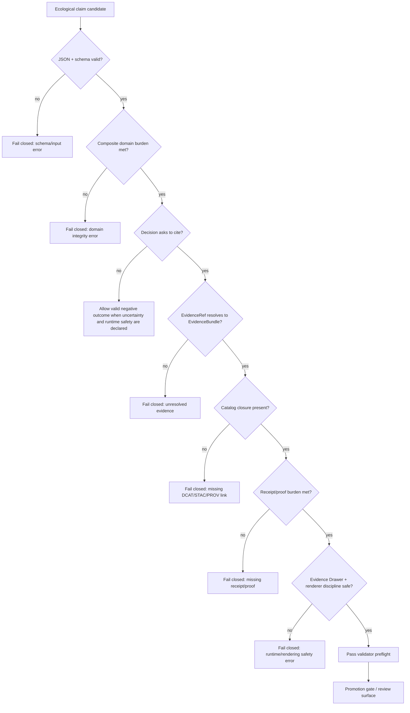

<!-- [KFM_META_BLOCK_V2]
doc_id: kfm://doc/<NEEDS_VERIFICATION_UUID>
title: Ecological Composite Claim Validator
type: standard
version: v1
status: draft
owners: @bartytime4life
created: <NEEDS_VERIFICATION_CREATED_DATE>
updated: 2026-04-24
policy_label: <NEEDS_VERIFICATION_POLICY_LABEL>
related: [
  ../../../schemas/contracts/v1/ecology/ecological_composite_claim.schema.json,
  ../../../contracts/runtime/ecological_composite_claim.md,
  ../../../data/registry/ecology/README.md,
  ../../../data/catalog/ecology/README.md,
  ../../../data/receipts/README.md,
  ../../../data/proofs/README.md,
  ../README.md
]
tags: [kfm, ecology, validator, composite-claims, evidence, fail-closed]
notes: [
  "README-like standard doc for a proposed ecological composite claim validator.",
  "Does not claim executable validator code, fixtures, schema, policy, CI, or promotion integration currently exists.",
  "Target path, created date, policy label, schema home, and related links need active-branch verification before commit."
]
[/KFM_META_BLOCK_V2] -->

<a id="top"></a>

# Ecological Composite Claim Validator

Fail-closed validator lane for ecological composite claims that must cite evidence, expose uncertainty, and remain safe for governed KFM runtime surfaces.

> [!NOTE]
> **Status:** `experimental` README / `draft` KFM document  
> **Owners:** `@bartytime4life`  
> **Truth posture:** `PROPOSED` until the active branch confirms the schema, executable validator, fixtures, tests, CI gate, and promotion wiring.  
> **Suggested path:** `tools/validators/ecology_composite_claim/README.md`  
> **Quick jumps:** [Scope](#scope) · [Repo fit](#repo-fit) · [Inputs](#inputs) · [Exclusions](#exclusions) · [Validation gates](#validation-gates) · [Fixtures](#fixtures) · [Exit behavior](#exit-behavior) · [Definition of done](#definition-of-done)


---

## Scope

This validator is for ecological runtime claims that combine evidence across ecological domains and could later appear in a governed API response, Evidence Drawer, Focus Mode response, review surface, export, or publication preflight.

It is designed for claims that join two or more domains, including:

- vegetation;
- soil;
- hydrology;
- fauna;
- flora;
- habitat;
- air;
- land cover.

The validator should reject claims that look polished but cannot resolve their evidence. A readable claim without an EvidenceBundle is not ready to cite.

### What this validator protects

| Risk | Fail-closed response |
|---|---|
| A `cite` decision without resolved evidence | Reject the claim. |
| A composite claim with only one domain | Reject as not composite. |
| A map layer used as proof | Reject; layer references are not evidence references. |
| Missing uncertainty on analytical claims | Reject or require abstention, depending on the schema. |
| Missing catalog, receipt, or proof burden | Reject the cited or release-significant claim. |
| 3D/Cesium rendering used as proof | Reject unless the rendering is justified and evidence remains separate. |
| Contradictory or insufficient evidence | Preserve the negative outcome; do not coerce into a positive claim. |

### Truth posture for this README

| Item | Label | Meaning |
|---|---|---|
| Validator role | `PROPOSED` | The role is grounded in KFM doctrine and the supplied draft, but executable implementation is not verified here. |
| Suggested file path | `NEEDS VERIFICATION` | The path is plausible from the draft but must be checked in the active branch. |
| Schema path | `NEEDS VERIFICATION` | The schema reference is a proposed related file until the schema is found or created. |
| CLI command | `ILLUSTRATIVE` | The CLI shape is useful for planning, not proof of an executable module. |
| Fixtures and tests | `PROPOSED` | Fixture names and test layout are suggested, not claimed as present. |

[Back to top](#top)

---

## Repo fit

**Suggested local path:** `tools/validators/ecology_composite_claim/README.md`

This README belongs near validator code because its main audience is maintainers who need to understand what the validator should accept, reject, and report before wiring it into promotion, runtime, or UI surfaces.

| Direction | Related surface | Expected role | Status |
|---|---|---|---|
| Upstream | [`../../../schemas/contracts/v1/ecology/ecological_composite_claim.schema.json`](../../../schemas/contracts/v1/ecology/ecological_composite_claim.schema.json) | Machine-readable claim contract. | `NEEDS VERIFICATION` |
| Upstream | [`../../../contracts/runtime/ecological_composite_claim.md`](../../../contracts/runtime/ecological_composite_claim.md) | Runtime-facing claim-envelope documentation. | `NEEDS VERIFICATION` |
| Upstream | [`../../../data/registry/ecology/README.md`](../../../data/registry/ecology/README.md) | Ecology source and domain registry context. | `NEEDS VERIFICATION` |
| Upstream | [`../../../data/catalog/ecology/README.md`](../../../data/catalog/ecology/README.md) | DCAT/STAC/PROV catalog closure context. | `NEEDS VERIFICATION` |
| Downstream | [`../../../data/receipts/README.md`](../../../data/receipts/README.md) | Run and transformation receipt storage guidance. | `NEEDS VERIFICATION` |
| Downstream | [`../../../data/proofs/README.md`](../../../data/proofs/README.md) | Release-significant proof storage guidance. | `NEEDS VERIFICATION` |
| Downstream | promotion gate + review surface | Publication and release decision path. | `PROPOSED` |
| Downstream | Evidence Drawer / Focus Mode | Trust-visible runtime explanation. | `PROPOSED` |
| Peer | [`../README.md`](../README.md) | Validator directory index. | `NEEDS VERIFICATION` |

> [!IMPORTANT]
> Do not use this validator as a source fetcher, map renderer, claim generator, proof writer, or publication authority. It is a fail-closed validation lane.

---

## Inputs

Accepted input shapes:

```text
*.ecological_claim.json
*.ecological_claim.bundle.json
stdin JSON object
```

### Minimum abstention-shaped object

This example is intentionally conservative. It shows the smallest useful shape for an **abstained** ecological claim candidate where cited evidence is not yet present.

```json
{
  "claim_id": "kfm.claim.ecology.example",
  "claim_type": "composite_ecological_claim",
  "status": "unresolved",
  "finding": "insufficient_evidence",
  "claim_text": "Example claim candidate.",
  "scope": {
    "geometry_ref": "HUC12:<id>",
    "time_window": {
      "start": "2024-01-01T00:00:00Z",
      "end": "2024-12-31T23:59:59Z"
    }
  },
  "domains": ["vegetation", "soil"],
  "evidence": {
    "status": "unresolved",
    "items": []
  },
  "uncertainty": {
    "status": "declared",
    "summary": "Evidence is insufficient to cite this claim."
  },
  "runtime_behavior": {
    "decision": "abstain",
    "evidence_drawer_required": true
  }
}
```

### Cited-claim burden

For `runtime_behavior.decision = "cite"`, the validator should require at minimum:

| Field family | Required burden |
|---|---|
| `evidence.status` | Must be `resolved`. |
| `evidence.items[]` | Must contain at least one cited evidence item. |
| `evidence.items[].evidence_ref` | Must resolve to an EvidenceBundle. |
| `domains[]` | Must include at least two independent domains for `composite_ecological_claim`. |
| `uncertainty` | Must be declared for analytical claims. |
| catalog references | Must satisfy DCAT, STAC, or PROV expectations for each evidence type. |
| receipt/proof references | Must satisfy transformation and release-significance burden. |
| runtime behavior | Must require the Evidence Drawer. |

> [!WARNING]
> A claim with `decision = "cite"` and `evidence.items = []` is invalid by design.

---

## Exclusions

This validator does not perform these responsibilities:

| Excluded behavior | Correct surface |
|---|---|
| Fetch source datasets | pipeline/watchers |
| Generate ecological claims | governed API or analysis pipeline |
| Render maps | MapLibre/Cesium application surfaces |
| Write DCAT/STAC/PROV records | `data/catalog/` tooling |
| Store receipts or proofs | `data/receipts/`, `data/proofs/` |
| Decide publication policy alone | promotion gate + review surface |
| Read raw, work, or quarantine data for public output | governed pipeline and release surfaces |
| Treat vector tiles, scenes, summaries, or map styles as truth | canonical evidence + released derivative contracts |

---

## Terms used here

| Term | Meaning in this validator |
|---|---|
| `EvidenceRef` | A reference that must resolve to an EvidenceBundle before a claim can be cited. |
| `EvidenceBundle` | The admissible evidence package that supports, narrows, contradicts, or blocks a claim. |
| `Catalog closure` | The evidence has appropriate DCAT, STAC, or PROV records for dataset, asset, or derivation context. |
| `Receipt` | Process memory for a run, transformation, validation, or redaction step. |
| `Proof` | Release-significant evidence that a claim or artifact passed required gates. |
| `Renderer discipline` | MapLibre/Cesium layer references may help display a claim, but they do not replace evidence references. |
| `Negative outcome` | An abstained, contradictory, denied, unresolved, or insufficient-evidence result that remains valid and must not be rewritten as a positive claim. |

---

## Validation flow



This diagram is `PROPOSED` and describes the intended responsibility boundary, not a confirmed implementation.

[Back to top](#top)

---

## Validation gates

### Gate A — JSON and schema validity

Fail when:

- input is not valid JSON;
- the ecological composite claim schema cannot be loaded;
- required fields are absent;
- additional unapproved fields exist;
- enum values are outside the contract;
- time, geometry, domain, or runtime fields do not match the schema.

### Gate B — Claim identity

Fail when:

- `claim_id` does not start with `kfm.claim.ecology.`;
- `claim_type` is not recognized;
- `claim_type = "composite_ecological_claim"` but the claim does not satisfy composite burden;
- `spec_hash` is required by the schema or runtime contract but absent.

### Gate C — Domain integrity

Fail when:

- `claim_type = "composite_ecological_claim"` and fewer than two domains are declared;
- a declared evidence item uses a domain not listed in `domains`;
- a domain join is implied but no join key, shared scope, or relationship basis is present;
- the claim collapses distinct knowledge characters, such as observation, model, regulatory context, and derived analysis, into one unsupported statement.

### Gate D — Evidence resolution

Fail when:

- `runtime_behavior.decision = "cite"` and `evidence.status != "resolved"`;
- `evidence.items[]` is empty for a cited claim;
- any cited evidence item lacks an `evidence_ref`;
- any cited `evidence_ref` cannot resolve to an EvidenceBundle;
- the source role is insufficient for the claim burden;
- the claim text is stronger than the supporting evidence.

### Gate E — Catalog closure

Fail when cited evidence lacks appropriate catalog references.

| Evidence type | Expected catalog family |
|---|---|
| Discovery/source dataset | DCAT |
| Geospatial raster/vector asset | STAC |
| Lineage/derivation | PROV |
| Composite derived artifact | PROV + relevant DCAT/STAC |

> [!CAUTION]
> A catalog link is not evidence by itself. It closes the discovery, asset, or lineage loop so evidence can be inspected.

### Gate F — Receipt and proof burden

Fail when:

- cited transformed evidence lacks a receipt reference;
- a release-significant claim lacks a proof reference;
- a proof is claimed but cannot be linked;
- a receipt is being used as a substitute for release proof;
- a proof points to a different `spec_hash`, artifact digest, claim ID, or release context.

### Gate G — Runtime safety

Fail when:

- `runtime_behavior.evidence_drawer_required` is not `true`;
- `decision = "cite"` but public message text implies certainty beyond evidence;
- `decision = "abstain"` but claim text presents the claim as factual;
- contradictory evidence is hidden instead of surfaced;
- insufficient evidence is converted into a positive finding;
- a negative outcome cannot be represented by the runtime response envelope.

### Gate H — Renderer discipline

Fail when:

- map `layer_refs` exist but evidence items are missing;
- a MapLibre or Cesium layer reference is used as an evidence reference;
- Cesium is selected without a `cesium_justification`;
- 3D rendering is used as proof;
- renderer state changes the meaning of the claim without a corresponding evidence or scope update.

---

## Fixtures

Suggested fixture layout:

```text
tools/validators/ecology_composite_claim/
├── README.md
├── fixtures/
│   ├── valid/
│   │   ├── resolved_composite_claim.json
│   │   ├── abstained_missing_evidence.json
│   │   └── contradictory_claim_visible.json
│   └── invalid/
│       ├── cite_without_resolved_evidence.json
│       ├── composite_single_domain.json
│       ├── missing_uncertainty.json
│       ├── missing_evidence_drawer.json
│       ├── renderer_as_evidence.json
│       ├── cesium_without_justification.json
│       └── missing_catalog_refs.json
└── tests/
    └── README.md
```

> [!CAUTION]
> Fixture paths are `PROPOSED` until checked into the active branch.

### Fixture intent matrix

| Fixture | Expected result | Why it matters |
|---|---|---|
| `resolved_composite_claim.json` | pass | Proves a cited claim can pass only with resolved evidence, catalog closure, uncertainty, and runtime safety. |
| `abstained_missing_evidence.json` | pass as negative outcome | Proves abstention remains valid instead of being treated as failure. |
| `contradictory_claim_visible.json` | pass as negative outcome | Proves contradictory evidence can be surfaced safely. |
| `cite_without_resolved_evidence.json` | fail | Blocks unsupported cited claims. |
| `composite_single_domain.json` | fail | Enforces composite-domain integrity. |
| `missing_uncertainty.json` | fail | Prevents analytical claims from hiding uncertainty. |
| `missing_evidence_drawer.json` | fail | Keeps runtime trust inspection mandatory. |
| `renderer_as_evidence.json` | fail | Prevents map layers from becoming proof. |
| `cesium_without_justification.json` | fail | Preserves 2D-first discipline and 3D burden. |
| `missing_catalog_refs.json` | fail | Enforces DCAT/STAC/PROV closure. |

---

## Exit behavior

Exit codes are `PROPOSED` until the executable validator exists.

| Condition | Exit |
|---|---:|
| Valid claim | `0` |
| Invalid claim | `1` |
| Missing input | `2` |
| Schema unavailable | `3` |
| Evidence reference unresolved | `4` |
| Internal validator error | `5` |

Validators should fail closed. Unknown evidence, unknown schema, unknown catalog record, unknown receipt state, or unknown proof status must not become a pass.

---

## Example CLI shape

```bash
python -m tools.validators.ecology_composite_claim \
  --input path/to/claim.ecological_claim.json \
  --schema schemas/contracts/v1/ecology/ecological_composite_claim.schema.json \
  --strict
```

> [!WARNING]
> The CLI above is illustrative. Do not document it as implemented until an executable module and tests exist.

---

## Reporting shape

The validator should eventually return a structured report that review, promotion, and CI surfaces can inspect.

<details>
<summary>Illustrative failure report shape</summary>

This is not a confirmed output contract. Treat it as a planning sketch until `contracts/runtime/ecological_composite_claim.md` or a validator schema confirms the shape.

```json
{
  "validator": "ecology_composite_claim",
  "validator_version": "v1",
  "claim_id": "kfm.claim.ecology.example",
  "result": "fail",
  "exit_code": 4,
  "truth_posture": "PROPOSED",
  "failures": [
    {
      "gate": "D",
      "code": "EVIDENCE_REF_UNRESOLVED",
      "message": "Cited evidence_ref could not resolve to an EvidenceBundle."
    }
  ],
  "warnings": [
    {
      "gate": "H",
      "code": "LAYER_REF_PRESENT",
      "message": "Layer references are present and must remain display-only."
    }
  ]
}
```

</details>

---

## Promotion integration

This validator should eventually feed the broader promotion gate as an ecological-domain preflight.

```text
ecological claim candidate
  → ecology composite claim validator
  → receipt emission
  → promotion gate
  → catalog closure check
  → runtime proof
  → publish or abstain
```

Integration remains `PROPOSED` until the active branch proves the promotion gate consumes this validator report.

### Integration rules

| Rule | Reason |
|---|---|
| The validator report should be machine-readable. | Promotion and CI should not parse prose. |
| Receipt emission should happen outside this README’s claimed scope unless implemented. | This README should not claim receipt storage behavior. |
| Promotion should remain a governed state transition. | A passing validator is not the same as publication approval. |
| Evidence Drawer payloads should consume released, validated evidence context. | Runtime trust surfaces should not depend on raw validator internals alone. |

---

## Definition of done

- [ ] Target path verified in active branch.
- [ ] Owner verified.
- [ ] `created` date verified.
- [ ] `policy_label` verified.
- [ ] Schema path verified.
- [ ] Runtime contract path verified.
- [ ] Validator module implemented or README marked as design-only.
- [ ] Fixture layout checked in.
- [ ] Valid fixtures added.
- [ ] Invalid fixtures added.
- [ ] Tests prove fail-closed behavior.
- [ ] EvidenceRef-to-EvidenceBundle resolution tested.
- [ ] Catalog closure test covers DCAT, STAC, and PROV expectations.
- [ ] Receipt output contract defined or explicitly deferred.
- [ ] Proof burden defined for release-significant claims.
- [ ] Promotion gate integration proven or explicitly deferred.
- [ ] CI enforcement proven or explicitly deferred.
- [ ] README status updated from `experimental` / `PROPOSED` to the narrowest truthful status.

---

## Verification backlog

| Item | Label | Why it remains open |
|---|---|---|
| `doc_id` | `NEEDS VERIFICATION` | No confirmed UUID was supplied. |
| `created` | `NEEDS VERIFICATION` | No confirmed creation date was supplied. |
| `policy_label` | `NEEDS VERIFICATION` | No confirmed policy label was supplied. |
| schema location | `NEEDS VERIFICATION` | The active schema home must be checked before linking this as implemented. |
| validator implementation | `UNKNOWN` | No executable validator code is confirmed here. |
| fixtures | `PROPOSED` | Fixture layout is useful but unverified. |
| CI gate | `UNKNOWN` | No workflow or required check is confirmed here. |
| promotion integration | `PROPOSED` | The integration path is architecture-aligned but not verified. |
| runtime envelope mapping | `NEEDS VERIFICATION` | The local `cite` / `abstain` decision vocabulary should be reconciled with broader finite runtime outcomes such as `ANSWER`, `ABSTAIN`, `DENY`, and `ERROR`. |

[Back to top](#top)
