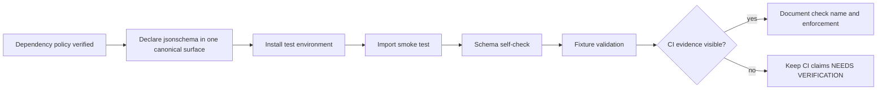

<!-- [KFM_META_BLOCK_V2]
doc_id: kfm://doc/<NEEDS-VERIFICATION-UUID>
title: Ecology Index Validator Dependencies
type: standard
version: v1
status: draft
owners: @bartytime4life
created: <NEEDS-VERIFICATION-CREATED-DATE>
updated: 2026-04-24
policy_label: <NEEDS-VERIFICATION-POLICY-LABEL>
related: [
  ./README.md,
  ./validator.py,
  ./__main__.py,
  ./tests/README.md,
  ../../../schemas/ecology/kfm_eco_index.schema.json
]
tags: [kfm, ecology, validator, dependencies, jsonschema, json-schema, draft-2020-12, ci]
notes: [
  "Documents dependency expectations for the ecology index validator.",
  "Does not claim repository dependency files are already updated.",
  "doc_id, created date, policy label, dependency-file home, and pinning policy need repository verification.",
  "CI enforcement must not be claimed until workflow installation and required-check status are verified."
]
[/KFM_META_BLOCK_V2] -->

<a id="top"></a>

# Ecology Index Validator Dependencies

Dependency expectations for `tools/validators/ecology_index`, centered on JSON Schema Draft 2020-12 validation.

<div align="left">


</div>

> [!NOTE]
> **Status:** `draft`  
> **Truth posture:** `PROPOSED`  
> **Primary dependency:** `jsonschema`  
> **Likely path:** `tools/validators/ecology_index/DEPENDENCIES.md` — **NEEDS VERIFICATION**

## Quick navigation

- [Repo fit](#repo-fit)
- [Dependency contract](#dependency-contract)
- [Required runtime dependency](#required-runtime-dependency)
- [Dependency declaration](#dependency-declaration)
- [Suggested minimum](#suggested-minimum)
- [Validation](#validation)
- [CI note](#ci-note)
- [Definition of done](#definition-of-done)
- [Open verification items](#open-verification-items)

---

## Repo fit

This note belongs beside the ecology index validator, not in a general Python dependency guide.

| Field | Value |
|---|---|
| Validator lane | `tools/validators/ecology_index` |
| Related module entry point | [`./__main__.py`](./__main__.py) |
| Related validator implementation | [`./validator.py`](./validator.py) |
| Related tests note | [`./tests/README.md`](./tests/README.md) |
| Related schema | [`../../../schemas/ecology/kfm_eco_index.schema.json`](../../../schemas/ecology/kfm_eco_index.schema.json) |
| Dependency status | **PROPOSED** until the active dependency file is verified |

### Accepted inputs

This document may describe:

- runtime dependencies required by the ecology index validator;
- minimum-version guidance for the validator’s imports and schema dialect;
- local validation commands that prove the dependency is installed;
- CI readiness conditions, only where enforcement has been verified.

### Exclusions

This document must not claim:

- that `requirements.txt`, `pyproject.toml`, or `requirements-dev.txt` is the canonical dependency surface before repository policy is verified;
- that CI installs `jsonschema` or runs ecology-index validator tests before workflow evidence is inspected;
- that dependency pinning is complete before lockfile or reproducibility policy is known.

---

## Dependency contract

| Requirement | Truth label | Dependency consequence |
|---|---:|---|
| `Draft202012Validator` is importable | **PROPOSED** | Needed for Draft 2020-12 JSON Schema validation. |
| `SchemaError` is importable | **PROPOSED** | Needed for explicit invalid-schema handling. |
| Schema self-validation is available through `Draft202012Validator.check_schema` | **PROPOSED** | Needed before treating schema validation failures as data failures. |
| `jsonschema` is declared in the repository’s Python dependency surface | **NEEDS VERIFICATION** | Required before local or CI execution can be assumed. |
| CI installs the dependency and runs validator tests | **UNKNOWN** | Do not claim enforcement until workflow evidence is visible. |



---

## Required runtime dependency

The ecology index validator dependency surface is expected to include:

```python
from jsonschema import Draft202012Validator
from jsonschema.exceptions import SchemaError
```

These imports are required for:

- Draft 2020-12 JSON Schema validation;
- schema self-validation through `Draft202012Validator.check_schema`;
- explicit invalid-schema CLI handling.

> [!CAUTION]
> This document records the dependency expectation. It does **not** prove that `validator.py`, dependency declarations, lockfiles, tests, or CI workflows have already been updated.

---

## Dependency declaration

Add `jsonschema` to the repository’s active Python dependency declaration surface.

Candidate locations from the draft dependency note are:

```text
requirements.txt
pyproject.toml
requirements-dev.txt
```

> [!IMPORTANT]
> The correct file depends on the active repository dependency policy. Verify the repo’s package-management convention before committing. Avoid declaring the same dependency in multiple places unless the repo’s dependency model requires it.

<details>
<summary><strong>Illustrative declaration examples</strong></summary>

Use **one** repo-approved surface. These examples are not a substitute for repository policy.

```text
# requirements.txt or requirements-dev.txt
jsonschema>=4.0
```

```toml
# pyproject.toml, illustrative only
[project]
dependencies = [
  "jsonschema>=4.0"
]
```

```toml
# pyproject.toml optional dependency group, illustrative only
[project.optional-dependencies]
dev = [
  "jsonschema>=4.0"
]
```

</details>

---

## Suggested minimum

```text
jsonschema>=4.0
```

A tighter pin may be preferred when KFM uses lockfiles, constraints files, reproducible environments, or release-bundle dependency capture.

| Pinning style | When it fits | Review posture |
|---|---|---:|
| `jsonschema>=4.0` | Small validator dependency with broad compatibility tolerance | **PROPOSED** |
| `jsonschema>=4.0,<5` | Repo prefers major-version guardrails | **NEEDS VERIFICATION** |
| Exact version in a lockfile | Repo uses reproducible dependency locks | **NEEDS VERIFICATION** |
| No declaration | Never acceptable once the validator import is active | **BLOCKED** |

---

## Validation

Run these checks after adding the dependency and installing the repo’s Python environment.

### 1. Import smoke test

```bash
python - <<'PY'
from importlib.metadata import version
from jsonschema import Draft202012Validator
from jsonschema.exceptions import SchemaError

print(f"jsonschema {version('jsonschema')}")
print(Draft202012Validator.__name__)
print(SchemaError.__name__)
PY
```

Expected shape:

```text
jsonschema <installed-version>
Draft202012Validator
SchemaError
```

### 2. Fixture validation

```bash
python -m tools.validators.ecology_index \
  --input tools/validators/ecology_index/fixtures/valid/air_station_vegetation.json \
  --schema schemas/ecology/kfm_eco_index.schema.json
```

Expected result:

```text
valid: tools/validators/ecology_index/fixtures/valid/air_station_vegetation.json
```

> [!TIP]
> Keep the fixture validation command in this document only while the fixture path and schema path remain current. If either path changes, update this file in the same PR as the validator or fixture change.

---

## CI note

Do not document CI enforcement until all four checks are verified:

- dependency installation is visible in CI;
- ecology-index validator tests run in CI;
- the CI check name is known;
- required-check status is verified.

Until then, the correct CI posture is:

```text
CI enforcement: NEEDS VERIFICATION
```

---

## Definition of done

- [ ] Confirm the active Python dependency declaration policy.
- [ ] Add `jsonschema` to the correct dependency surface.
- [ ] Verify the dependency is not duplicated across unmanaged surfaces.
- [ ] Run the import smoke test.
- [ ] Run fixture validation with `air_station_vegetation.json`.
- [ ] Run the ecology-index validator test suite, if present.
- [ ] Update CI documentation only after workflow evidence is confirmed.
- [ ] Keep this file’s truth labels aligned with the verified repository state.

---

## Open verification items

| Item | Current label | Why it remains open |
|---|---:|---|
| `doc_id` | **NEEDS VERIFICATION** | No canonical doc UUID was supplied. |
| `created` date | **NEEDS VERIFICATION** | Draft creation date was not independently verified. |
| `policy_label` | **NEEDS VERIFICATION** | Repository policy classification was not verified. |
| Dependency file home | **NEEDS VERIFICATION** | Active dependency declaration policy was not inspected. |
| `jsonschema` pin style | **NEEDS VERIFICATION** | Lockfile or reproducibility convention is unknown. |
| CI check name | **UNKNOWN** | Workflow files and required-check settings were not verified. |
| Test coverage | **UNKNOWN** | Validator tests were not inspected in this session. |

[Back to top](#top)
