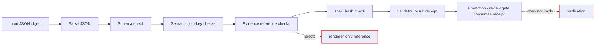

<!-- [KFM_META_BLOCK_V2]
doc_id: kfm://doc/<NEEDS_VERIFICATION_UUID>
title: KFM Eco Index Validator
type: standard
version: v1
status: draft
owners: @bartytime4life
created: <NEEDS_VERIFICATION_CREATED_DATE>
updated: 2026-04-24
policy_label: <NEEDS_VERIFICATION_POLICY_LABEL>
related: [
  "../../../schemas/ecology/kfm_eco_index.schema.json",
  "../README.md",
  "./fixtures/README.md",
  "./tests/README.md",
  "../../../data/registry/ecology/README.md",
  "../../../data/receipts/README.md"
]
tags: [kfm, ecology, validator, schema, join-index, receipts]
notes: [
  "Proposed README and implementation boundary for the KFM eco index validator.",
  "Does not claim executable module currently exists.",
  "CLI examples are illustrative until the module, schema, fixtures, tests, and CI path are verified.",
  "doc_id, created date, and policy_label remain placeholders pending repository/source-of-record verification."
]
[/KFM_META_BLOCK_V2] -->

<a id="top"></a>

# KFM Eco Index Validator

Fail-closed validation boundary for proposed `kfm_eco_index` rows before they support cross-domain ecological joins.


> [!IMPORTANT]
> **Status:** experimental  
> **Document status:** draft  
> **Owners:** `@bartytime4life`  
> **Suggested path:** `tools/validators/ecology_index/README.md`  
> **Truth posture:** `PROPOSED` until repository inspection confirms the module, schema, fixtures, tests, and CI wiring.  
> **Quick jumps:** [Scope](#scope) · [Repo fit](#repo-fit) · [Accepted inputs](#accepted-inputs) · [Exclusions](#exclusions) · [Directory tree](#directory-tree) · [Quickstart](#quickstart) · [Validator flow](#validator-flow) · [Validation rules](#validation-rules) · [Receipts and exits](#receipts-and-exits) · [Definition of done](#definition-of-done) · [FAQ](#faq) · [Appendix](#appendix)

> [!NOTE]
> This README defines the proposed validator boundary. It is not proof that `tools.validators.ecology_index` is implemented, importable, tested, or connected to promotion gates.

---

## Scope

The `ecology_index` validator checks whether an ecological join-index row is safe enough to be used as a cross-domain evidence join candidate.

It validates the parts of a row that can break KFM trust if they are missing, ambiguous, renderer-only, or detached from evidence:

| Validator concern | Proposed check | Why it matters |
|---|---|---|
| JSON shape | Input parses as JSON object | Prevents downstream validators from interpreting malformed data. |
| Schema conformance | Row matches `kfm_eco_index.schema.json` | Keeps contract shape explicit and reviewable. |
| Domain join keys | Domain-specific keys are present | Prevents weak joins across fauna, flora, hydrology, soil, and vegetation. |
| Evidence references | `evidence_refs` is present and non-empty | Keeps the row from becoming an unsupported claim surface. |
| Renderer-only references | Renderer/style/layer references do not count as evidence | Keeps map display artifacts subordinate to EvidenceRef / EvidenceBundle flow. |
| `spec_hash` | `spec_hash` is present | Supports deterministic identity and repeatable validation. |
| Receipt shape | Emits a validator-result receipt | Gives promotion and review surfaces a machine-readable decision object. |

This validator is a gate helper. It is not a catalog, source connector, map renderer, claim generator, or promotion authority.

[Back to top](#top)

---

## Repo fit

```text
RAW / WORK / QUARANTINE data
        │
        ▼
proposed kfm_eco_index row
        │
        ▼
tools/validators/ecology_index/
        │
        ▼
validator_result receipt
        │
        ▼
promotion / catalog / review gates
```

| Surface | Proposed path | Role |
|---|---|---|
| This README | `tools/validators/ecology_index/README.md` | Documents the validator boundary, proposed checks, receipts, and open verification items. |
| Parent validator lane | `../README.md` | Owns shared validator posture, fail-closed expectations, and validator-lane conventions. |
| Eco-index schema | `../../../schemas/ecology/kfm_eco_index.schema.json` | Proposed contract source for row shape. **NEEDS VERIFICATION**. |
| Fixtures | `./fixtures/` | Valid and invalid examples for schema and semantic checks. |
| Tests | `./tests/` | Validator behavior matrix and receipt assertions. |
| Ecology registry | `../../../data/registry/ecology/README.md` | Proposed upstream registry context for ecology source/domain references. **NEEDS VERIFICATION**. |
| Receipts | `../../../data/receipts/README.md` | Downstream home pattern for process-memory receipts. Exact validator receipt path remains **NEEDS VERIFICATION**. |

> [!WARNING]
> Do not wire this validator into publication as a standalone promotion decision. A passing validator receipt means “this row passed this validator,” not “this row is published,” “this row is authoritative,” or “this ecological claim is proven.”

[Back to top](#top)

---

## Accepted inputs

The current draft accepts one ecological join-index row at a time.

```text
*.kfm_eco_index.json
stdin JSON object
fixture JSON object
```

### Input boundary

| Input form | Status | Notes |
|---|---|---|
| File input | `PROPOSED` | Expected extension: `*.kfm_eco_index.json`. |
| `stdin` JSON object | `PROPOSED` | Useful for CI, scripts, and fixture checks. |
| Fixture JSON object | `PROPOSED` | Should cover valid, invalid, and edge-case rows. |
| Batch arrays | `NEEDS VERIFICATION` | Not listed in the supplied draft. Add only if schema and tests support it. |

### Minimal illustrative row

```json
{
  "domains": ["hydrology", "fauna"],
  "geometry_type": "huc12",
  "join_keys": {
    "watershed_id": "HUC12-EXAMPLE",
    "taxon_id": "TAXON-EXAMPLE"
  },
  "evidence_refs": ["evidence://example/source-record"],
  "spec_hash": "sha256:<example>"
}
```

> [!NOTE]
> The example above is illustrative. The checked-in schema must define the authoritative field set, value constraints, domain enum, hash format, and evidence reference format.

[Back to top](#top)

---

## Exclusions

This validator does **not**:

| Exclusion | Where it belongs instead |
|---|---|
| Fetch source datasets | Source connectors / ingest pipelines. |
| Create joins | Domain pipeline or join-builder code after validation. |
| Render maps | MapLibre layer/style delivery surfaces. |
| Generate ecological claims | Governed API / Focus Mode after EvidenceBundle resolution and policy checks. |
| Write catalog records | Catalog pipeline / catalog closure validators. |
| Decide promotion alone | Promotion gate with policy, proof, catalog, review, and release context. |
| Treat renderer references as evidence | EvidenceRef / EvidenceBundle resolution surfaces. |
| Resolve every EvidenceBundle by itself | Adjacent evidence-resolution validator unless explicitly implemented and tested here. |

[Back to top](#top)

---

## Directory tree

Proposed module layout:

```text
tools/validators/ecology_index/
├── README.md
├── __init__.py
├── __main__.py
├── validator.py
├── errors.py
├── receipts.py
├── fixtures/
│   └── README.md
└── tests/
    └── README.md
```

> [!IMPORTANT]
> The tree above is proposed. Do not mark it implemented until these paths are confirmed in the repository and tests prove the behavior.

[Back to top](#top)

---

## Quickstart

The CLI is proposed and must not be treated as executable until the module exists.

```bash
python -m tools.validators.ecology_index \
  --input path/to/index.kfm_eco_index.json \
  --schema schemas/ecology/kfm_eco_index.schema.json \
  --receipt-out data/receipts/validators/ecology_index/<receipt>.json \
  --strict
```

### Proposed `stdin` usage

```bash
cat path/to/index.kfm_eco_index.json | python -m tools.validators.ecology_index \
  --schema schemas/ecology/kfm_eco_index.schema.json \
  --receipt-out data/receipts/validators/ecology_index/<receipt>.json \
  --strict
```

### Verification-first usage rule

Run this validator only after confirming:

- [ ] `tools/validators/ecology_index/__main__.py` exists.
- [ ] `schemas/ecology/kfm_eco_index.schema.json` exists.
- [ ] fixtures exist for valid and invalid rows.
- [ ] tests assert both `pass` and `fail` receipts.
- [ ] receipt output path is aligned with the repo’s receipt convention.
- [ ] CI or local validation command is documented.

[Back to top](#top)

---

## Validator flow



The validator’s job ends at a validator-result receipt. Promotion remains a governed state transition, not a file move and not a validator side effect.

[Back to top](#top)

---

## Validation rules

### Fail-closed rules

| Case | Result | Proposed error code |
|---|---|---|
| Missing input | fail | `ECO_INDEX_INPUT_REQUIRED` |
| Malformed JSON | fail | `ECO_INDEX_JSON_INVALID` |
| Missing schema | fail | `ECO_INDEX_SCHEMA_REQUIRED` |
| Invalid schema conformance | fail | `ECO_INDEX_SCHEMA_INVALID` |
| Unknown domain | fail | `ECO_INDEX_UNKNOWN_DOMAIN` |
| Missing `spec_hash` | fail | `ECO_INDEX_SPEC_HASH_REQUIRED` |
| Empty `evidence_refs` | fail | `ECO_INDEX_EVIDENCE_REQUIRED` |
| HUC12 without `watershed_id` | fail | `ECO_INDEX_HUC12_WATERSHED_REQUIRED` |
| Fauna/flora without `taxon_id` or `obs_id` | fail | `ECO_INDEX_TAXON_OR_OBS_REQUIRED` |
| Hydrology without watershed, reach, or station key | fail | `ECO_INDEX_HYDROLOGY_KEY_REQUIRED` |
| Soil without soil or station key | fail | `ECO_INDEX_SOIL_KEY_REQUIRED` |
| Vegetation without layer or landcover key | fail | `ECO_INDEX_VEGETATION_KEY_REQUIRED` |
| Renderer-only reference | fail | `ECO_INDEX_RENDERER_AS_EVIDENCE` |

> [!NOTE]
> `ECO_INDEX_INPUT_REQUIRED` and `ECO_INDEX_JSON_INVALID` are proposed additions to make the fail-closed matrix complete. Keep or rename them only after aligning with the repo’s shared error-code convention.

### Semantic checks

```text
geometry_type = huc12
  requires join_keys.watershed_id

domain includes fauna or flora
  requires join_keys.taxon_id OR join_keys.obs_id

domain includes hydrology
  requires join_keys.watershed_id OR join_keys.reach_id OR join_keys.station_id

domain includes soil
  requires join_keys.soil_id OR join_keys.station_id

domain includes vegetation
  requires join_keys.layer_id OR join_keys.landcover_class
```

### Domain ownership note

The validator can check domain-key semantics, but the schema should own the canonical domain list. If the schema does not define a domain enum, the validator must either fail closed or document the domain registry it uses.

[Back to top](#top)

---

## Receipts and exits

### Receipt output

```json
{
  "receipt_type": "validator_result",
  "validator": "tools/validators/ecology_index",
  "schema_ref": "schemas/ecology/kfm_eco_index.schema.json",
  "input_ref": "<input-ref>",
  "decision": "pass",
  "errors": [],
  "warnings": [],
  "spec_hash": "<sha256>",
  "generated_at": "<timestamp>"
}
```

### Receipt rules

| Field | Rule |
|---|---|
| `receipt_type` | Must be `validator_result`. |
| `validator` | Must identify this validator boundary. |
| `schema_ref` | Must identify the schema used for validation. |
| `input_ref` | Must identify the input without turning raw input into public truth. |
| `decision` | Must be finite; proposed values are `pass` and `fail`. |
| `errors` | Must include stable error codes and readable messages. |
| `warnings` | May be empty, but must remain present for stable shape. |
| `spec_hash` | Must match the input row’s deterministic spec hash, or fail if missing. |
| `generated_at` | Must be timestamped; receipt-hash handling remains **NEEDS VERIFICATION** if receipts themselves are hashed. |

### Exit codes

| Code | Meaning |
|---:|---|
| `0` | pass |
| `1` | validation failure |
| `2` | missing input |
| `3` | missing schema |
| `4` | unresolved evidence |
| `5` | internal error |

> [!WARNING]
> Exit code `4` is reserved for evidence-resolution failure. If this validator only checks presence and shape of `evidence_refs`, do not emit `4` until a resolver is implemented and tested.

[Back to top](#top)

---

## Definition of done

This README can move out of `PROPOSED` only when the repository proves the validator exists and behaves as documented.

- [ ] Module path exists at `tools/validators/ecology_index/`.
- [ ] Schema is checked in and linked from this README.
- [ ] Valid and invalid fixtures are checked in.
- [ ] Tests execute the valid/invalid fixture matrix.
- [ ] Schema errors and semantic errors produce stable error codes.
- [ ] Renderer-only references fail as evidence.
- [ ] Empty `evidence_refs` fails.
- [ ] Missing `spec_hash` fails.
- [ ] Receipts use the documented `validator_result` shape.
- [ ] Receipt timestamp and hash semantics are documented.
- [ ] Promotion gate consumes the validator result without treating it as promotion authority.
- [ ] CI check exists and is documented.
- [ ] README status, badges, and truth posture are updated from `PROPOSED`.

[Back to top](#top)

---

## FAQ

### Can this validator publish an ecological join?

No. It emits a validator-result receipt. Publication requires catalog, proof, policy, review, and promotion context.

### Can a MapLibre layer, style, or renderer reference satisfy `evidence_refs`?

No. Renderer-only references are display artifacts, not evidence. They can point users toward a visual surface, but they cannot replace EvidenceRef / EvidenceBundle resolution.

### Does a passing row prove an ecological claim?

No. A passing row means the row passed this validator’s checks. Claims still need admissible evidence, scope, policy posture, review state, and release state.

### Should this validator fetch source datasets?

No. Fetching belongs to source connectors and ingest pipelines. This validator should stay deterministic and fixture-testable.

### Is the proposed CLI implemented?

UNKNOWN until the module, entrypoint, and tests are directly inspected.

[Back to top](#top)

---

## Appendix

<details>
<summary>Illustrative Python behavior sketch</summary>

This sketch preserves the intended semantic boundary. It is not implementation proof.

```python
from __future__ import annotations

from dataclasses import dataclass
from datetime import datetime, timezone
from typing import Any


ERROR_CODES = {
    "schema_invalid": "ECO_INDEX_SCHEMA_INVALID",
    "spec_hash_required": "ECO_INDEX_SPEC_HASH_REQUIRED",
    "huc12_watershed_required": "ECO_INDEX_HUC12_WATERSHED_REQUIRED",
    "taxon_or_obs_required": "ECO_INDEX_TAXON_OR_OBS_REQUIRED",
    "hydrology_key_required": "ECO_INDEX_HYDROLOGY_KEY_REQUIRED",
    "soil_key_required": "ECO_INDEX_SOIL_KEY_REQUIRED",
    "vegetation_key_required": "ECO_INDEX_VEGETATION_KEY_REQUIRED",
    "evidence_required": "ECO_INDEX_EVIDENCE_REQUIRED",
    "unknown_domain": "ECO_INDEX_UNKNOWN_DOMAIN",
    "renderer_as_evidence": "ECO_INDEX_RENDERER_AS_EVIDENCE",
}


@dataclass(frozen=True)
class ValidationErrorItem:
    code: str
    message: str


def validate_semantics(row: dict[str, Any]) -> list[ValidationErrorItem]:
    errors: list[ValidationErrorItem] = []

    domains = set(row.get("domains", []))
    join_keys = row.get("join_keys", {}) or {}

    if row.get("geometry_type") == "huc12" and not join_keys.get("watershed_id"):
        errors.append(
            ValidationErrorItem(
                ERROR_CODES["huc12_watershed_required"],
                "geometry_type huc12 requires join_keys.watershed_id",
            )
        )

    if {"fauna", "flora"} & domains:
        if not (join_keys.get("taxon_id") or join_keys.get("obs_id")):
            errors.append(
                ValidationErrorItem(
                    ERROR_CODES["taxon_or_obs_required"],
                    "flora/fauna rows require join_keys.taxon_id or join_keys.obs_id",
                )
            )

    if "hydrology" in domains:
        if not (
            join_keys.get("watershed_id")
            or join_keys.get("reach_id")
            or join_keys.get("station_id")
        ):
            errors.append(
                ValidationErrorItem(
                    ERROR_CODES["hydrology_key_required"],
                    "hydrology rows require watershed_id, reach_id, or station_id",
                )
            )

    if "soil" in domains:
        if not (join_keys.get("soil_id") or join_keys.get("station_id")):
            errors.append(
                ValidationErrorItem(
                    ERROR_CODES["soil_key_required"],
                    "soil rows require soil_id or station_id",
                )
            )

    if "vegetation" in domains:
        if not (join_keys.get("layer_id") or join_keys.get("landcover_class")):
            errors.append(
                ValidationErrorItem(
                    ERROR_CODES["vegetation_key_required"],
                    "vegetation rows require layer_id or landcover_class",
                )
            )

    if not row.get("evidence_refs"):
        errors.append(
            ValidationErrorItem(
                ERROR_CODES["evidence_required"],
                "evidence_refs must contain at least one item",
            )
        )

    if not row.get("spec_hash"):
        errors.append(
            ValidationErrorItem(
                ERROR_CODES["spec_hash_required"],
                "spec_hash is required",
            )
        )

    return errors


def build_receipt(
    *,
    validator: str,
    schema_ref: str,
    input_ref: str,
    decision: str,
    errors: list[ValidationErrorItem],
    spec_hash: str | None,
) -> dict[str, Any]:
    return {
        "receipt_type": "validator_result",
        "validator": validator,
        "schema_ref": schema_ref,
        "input_ref": input_ref,
        "decision": decision,
        "errors": [
            {"code": error.code, "message": error.message}
            for error in errors
        ],
        "warnings": [],
        "spec_hash": spec_hash,
        "generated_at": datetime.now(timezone.utc).isoformat(),
    }
```

</details>

<details>
<summary>Open verification backlog</summary>

| Item | Status | Review action |
|---|---|---|
| `doc_id` | `NEEDS VERIFICATION` | Replace placeholder with canonical KFM document ID. |
| `created` date | `NEEDS VERIFICATION` | Use source-of-record date, not generation guess. |
| `policy_label` | `NEEDS VERIFICATION` | Confirm whether this README is `public`, `public-safe`, `restricted`, or another project label. |
| Schema path | `NEEDS VERIFICATION` | Confirm `schemas/ecology/kfm_eco_index.schema.json` exists or adjust path. |
| Module path | `NEEDS VERIFICATION` | Confirm `tools/validators/ecology_index/` exists. |
| Parent validator README | `NEEDS VERIFICATION` | Confirm parent path and cross-link. |
| Receipt path | `NEEDS VERIFICATION` | Confirm validator receipts live under `data/receipts/validators/` or another repo convention. |
| Domain enum | `NEEDS VERIFICATION` | Confirm canonical domain list and unknown-domain behavior. |
| Evidence reference shape | `NEEDS VERIFICATION` | Confirm EvidenceRef format and renderer-only detection rule. |
| `spec_hash` algorithm | `NEEDS VERIFICATION` | Confirm canonicalization and hash input fields. |
| CI command | `NEEDS VERIFICATION` | Confirm package manager, test runner, and workflow path. |

</details>

[Back to top](#top)
