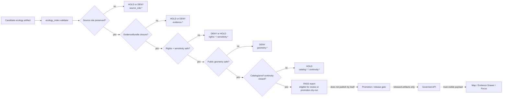

<!-- [KFM_META_BLOCK_V2]
doc_id: kfm://doc/TODO-UUID-NEEDS-VERIFICATION
title: tools/validators/ecology_index/docs
type: standard
version: v1
status: draft
owners: TODO-NEEDS-VERIFICATION
created: YYYY-MM-DD
updated: 2026-04-24
policy_label: TODO-NEEDS-VERIFICATION
related: [../README.md, ../../README.md, ../../../README.md, ../../../../README.md, ../../../../schemas/contracts/v1/ecology_index/README.md, ../../../../policy/ecology_index/README.md, ../../../../tests/fixtures/ecology_index/README.md, ../../../../data/registry/ecology_index/README.md, ../../../../docs/domains/README.md]
tags: [kfm, ecology-index, validators, documentation, evidence, source-role, sensitivity, geoprivacy, needs-verification]
notes: [Target README requested for tools/validators/ecology_index/docs/README.md. Active repo tree, owner, doc UUID, schema home, runner paths, CI wiring, and policy label remain NEEDS VERIFICATION before commit.]
[/KFM_META_BLOCK_V2] -->

<a id="top"></a>

# `tools/validators/ecology_index/docs/`

Documentation control surface for the proposed **ecology-index validator**: source-role, evidence, rights, sensitivity, and cross-domain consistency checks for ecology-derived artifacts.

> [!IMPORTANT]
> **Status:** experimental  
> **Owners:** `TODO-NEEDS-VERIFICATION`  
> **Path:** `tools/validators/ecology_index/docs/README.md`  
> **Repo fit:** child documentation lane under `tools/validators/ecology_index/`; upstream law should remain in contracts, schemas, policies, registries, and fixtures; downstream reports should feed review, CI, promotion dry-runs, and rollback/correction notes.  
>
> 
> 
> 
> 
> 
> 
>
> **Quick jumps:** [Scope](#scope) · [Repo fit](#repo-fit) · [Accepted inputs](#accepted-inputs) · [Exclusions](#exclusions) · [Directory tree](#directory-tree) · [Quickstart](#quickstart) · [Usage](#usage) · [Validator model](#validator-responsibility-model) · [Diagram](#diagram) · [Check matrix](#check-matrix) · [Outcome grammar](#outcome-grammar) · [Definition of done](#definition-of-done) · [FAQ](#faq) · [Appendix](#appendix)

> [!WARNING]
> This README is intentionally conservative. In the current documentation pass, the target file path is known from the requested work item, but the mounted repository tree, executable validator inventory, schema home, policy bundle, fixture layout, and CI wiring are **NEEDS VERIFICATION**. Do not upgrade any proposed path below into an implementation claim until the active checkout is inspected.

---

## Scope

`tools/validators/ecology_index/docs/` is the local documentation lane for the ecology-index validator family.

The validator’s proposed job is not to decide ecological truth. Its job is to help prevent ecology-facing artifacts from collapsing distinct KFM evidence classes into one persuasive but unsafe output.

Use this docs lane to explain and review how the validator checks whether candidate ecology artifacts preserve:

- source identity and `source_role`
- EvidenceRef → EvidenceBundle closure
- rights, license, and redistribution posture
- sensitivity, geoprivacy, and public-safe geometry handling
- habitat / fauna / flora boundary distinctions
- modeled, observed, documentary, regulatory, derived, and generalized knowledge-character labels
- catalog, proof, receipt, release, correction, and rollback separation
- deterministic identity and continuity across reruns or migrations

### Working definition

> **PROPOSED:** `ecology_index` is a cross-domain validator lane for ecology-derived candidate artifacts that link habitat, fauna, flora, occurrence evidence, public-safe layers, catalog records, and Evidence Drawer payloads without making any derived join the canonical source of truth.

This directory documents that validator lane. It does **not** by itself implement validation, policy, schema law, source admission, or public release.

[Back to top](#top)

---

## Repo fit

| Relationship | Candidate relative link | Status | Why it matters |
|---|---:|---|---|
| This docs leaf | `./README.md` | CONFIRMED target path by request | Local orientation and maintenance contract for the docs subfolder. |
| Parent validator lane | [`../README.md`](../README.md) | NEEDS VERIFICATION | Should define the executable validator surface, entry points, report paths, and fail-closed posture. |
| Validator family index | [`../../README.md`](../../README.md) | NEEDS VERIFICATION | Should place `ecology_index` among other validators. |
| Tools index | [`../../../README.md`](../../../README.md) | NEEDS VERIFICATION | Should separate validators, generators, support utilities, and CI helpers. |
| Root project README | [`../../../../README.md`](../../../../README.md) | NEEDS VERIFICATION | Should link the validator lane to KFM’s governed evidence posture. |
| Machine schema home | [`../../../../schemas/contracts/v1/ecology_index/README.md`](../../../../schemas/contracts/v1/ecology_index/README.md) | PROPOSED / NEEDS VERIFICATION | Must be reconciled with the repo’s canonical schema-home ADR before machine files land. |
| Policy bundle home | [`../../../../policy/ecology_index/README.md`](../../../../policy/ecology_index/README.md) | PROPOSED / NEEDS VERIFICATION | Deny / hold logic belongs in policy, not in prose. |
| Fixture home | [`../../../../tests/fixtures/ecology_index/README.md`](../../../../tests/fixtures/ecology_index/README.md) | PROPOSED / NEEDS VERIFICATION | Valid and invalid cases should prove behavior without live source pulls. |
| Source registry home | [`../../../../data/registry/ecology_index/README.md`](../../../../data/registry/ecology_index/README.md) | PROPOSED / NEEDS VERIFICATION | Source roles, rights posture, cadence, and authority scope should stay inspectable. |
| Domain docs index | [`../../../../docs/domains/README.md`](../../../../docs/domains/README.md) | PROPOSED / NEEDS VERIFICATION | Domain burden profiles should stay visible and not be buried inside validator docs. |

> [!NOTE]
> Relative links are intentionally retained even when their existence is not yet verified. That makes the expected repo relationship reviewable without pretending the target checkout has already been inspected.

[Back to top](#top)

---

## Accepted inputs

Content belongs in this docs folder when it explains, constrains, or reviews the ecology-index validator.

| Accepted input | Why it belongs here |
|---|---|
| Validator check matrices | Shows which checks exist, what they protect, and how they fail. |
| Reason-code documentation | Keeps `source_role.*`, `evidence.*`, `rights.*`, `sensitivity.*`, and related codes stable. |
| Source-role boundary notes | Prevents observed occurrence, modeled habitat support, legal status, and regulatory context from being treated as interchangeable. |
| Sensitivity and geoprivacy notes | Documents public-safe geometry expectations, redaction receipt requirements, and withheld-precision behavior. |
| Fixture coverage summaries | Explains valid / invalid fixture families without storing large fixture payloads in docs. |
| Continuity notes | Records migrations, aliases, supersession, and old-to-new validator behavior mappings. |
| Rollback and correction notes | Describes how bad public-safe ecology artifacts should be reverted without deleting evidence history. |
| Review checklists | Gives stewards and maintainers a compact way to decide whether the validator docs are release-ready. |

### Good first docs

A small, useful initial set is:

1. `CHECK_MATRIX.md`
2. `REASON_CODES.md`
3. `SOURCE_ROLE_BOUNDARIES.md`
4. `SENSITIVITY_AND_GEOPRIVACY.md`
5. `CONTINUITY_NOTES.md`
6. `ROLLBACK.md`

[Back to top](#top)

---

## Exclusions

This docs folder should consume upstream law and downstream proof objects. It should not replace them.

| Does **not** belong here | Put it here instead | Why |
|---|---|---|
| Executable validator scripts | `../` or the repo-confirmed validator implementation path | Docs explain behavior; scripts implement it. |
| Machine-readable JSON Schemas | `../../../../schemas/` or repo-confirmed schema home | Schema authority should not fragment into docs. |
| Policy-as-code bundles | `../../../../policy/` | Deny / hold logic must be executable and testable. |
| Valid / invalid fixture payloads | `../../../../tests/fixtures/` or repo-confirmed fixture home | Fixtures should be runnable and isolated from prose. |
| Live source pulls, scrape caches, raw provider exports | Governed data lifecycle zones | Raw and work data are never documentation payloads. |
| Source descriptors and registry records | `../../../../data/registry/` or contract/source homes | Source admission law should stay upstream. |
| Catalog, proof, receipt, release, and rollback artifacts | `../../../../data/catalog/`, `../../../../data/proofs/`, `../../../../data/receipts/`, or release homes | Emitted artifacts are not README content. |
| MapLibre components, Evidence Drawer components, or Focus UI code | Repo-confirmed app / UI paths | UI implementation must consume governed outputs rather than redefine them. |
| Sensitive coordinates, restricted occurrence details, private steward notes | Restricted / quarantined / steward-only surfaces | The ecology index should help prevent public leakage, not host it. |

[Back to top](#top)

---

## Directory tree

### Current safe claim

The only safe claim for this generated README is the target path itself.

```text
tools/validators/ecology_index/docs/
└── README.md
```

### Preferred growth shape

The following shape is **PROPOSED** until the active repository confirms local conventions.

```text
tools/validators/ecology_index/
├── README.md                         # validator-level contract; NEEDS VERIFICATION
├── docs/
│   ├── README.md                     # this file
│   ├── CHECK_MATRIX.md               # PROPOSED
│   ├── REASON_CODES.md               # PROPOSED
│   ├── SOURCE_ROLE_BOUNDARIES.md     # PROPOSED
│   ├── SENSITIVITY_AND_GEOPRIVACY.md # PROPOSED
│   ├── VALIDATION_PLAN.md            # PROPOSED
│   ├── CONTINUITY_NOTES.md           # PROPOSED
│   └── ROLLBACK.md                   # PROPOSED
└── reports/                          # PROPOSED only if repo convention supports local reports
```

> [!TIP]
> Keep this docs leaf narrow. If the parent validator README does not yet exist, create or verify it before expanding this subfolder.

[Back to top](#top)

---

## Quickstart

Run these from the repository root after mounting the real KFM checkout.

### 1. Verify the active checkout

```bash
git status --short
git branch --show-current
find tools/validators/ecology_index -maxdepth 3 -type f | sort
```

Expected result:

- `git` commands show a real checkout.
- The target path appears in the file inventory.
- Any existing parent README, scripts, schemas, policies, fixtures, and reports are identified before this docs folder is expanded.

### 2. Inspect local validator support

```bash
find tools/validators/ecology_index -maxdepth 3 -type f \
  \( -name '*.py' -o -name '*.ts' -o -name '*.js' -o -name '*.rego' -o -name '*.md' -o -name '*.json' -o -name '*.yml' -o -name '*.yaml' \) \
  | sort
```

### 3. Probe a runner only if it exists

```bash
if test -f tools/validators/ecology_index/run_all.py; then
  python tools/validators/ecology_index/run_all.py --help
else
  echo "NEEDS VERIFICATION: no tools/validators/ecology_index/run_all.py found in this checkout"
fi
```

### 4. Keep docs synchronized with behavior

```bash
git diff -- tools/validators/ecology_index docs schemas contracts policy tests data \
  | sed -n '1,200p'
```

> [!CAUTION]
> Do not add live source fetching, public publication, or UI binding as part of a docs-only change. The first safe increment is documentation, schema-home verification, source-role matrixing, fixtures, and no-network validation.

[Back to top](#top)

---

## Usage

Use this docs folder when the main review question is:

> “Can the ecology-index validator prove that a cross-domain ecology artifact is evidence-backed, rights-safe, sensitivity-safe, source-role honest, and release-ready enough to continue?”

Do **not** use it when the main question is:

| Main question | Better home |
|---|---|
| “What is the canonical schema shape?” | `schemas/` or repo-confirmed schema authority |
| “What does policy deny?” | `policy/` |
| “What fixtures prove the behavior?” | `tests/fixtures/` |
| “What is the source admission rule?” | source descriptor / source registry |
| “Can this be published?” | promotion gate / release assembly surfaces |
| “Can Focus answer this?” | governed API / runtime proof / Focus contract surfaces |
| “What does the map show?” | layer manifest / Evidence Drawer payload / UI docs |

[Back to top](#top)

---

## Validator responsibility model

The ecology-index validator should validate **relationships and publication pressure**, not become a hidden ecological model.

| Responsibility | Validator should check | Validator should not do |
|---|---|---|
| Source role | Every support item has explicit `source_role`, authority scope, rights posture, and source identity. | Promote community observation, modeled context, or derived support into legal/status authority. |
| Evidence closure | Every consequential claim resolves through EvidenceRef → EvidenceBundle. | Accept prose citations as proof. |
| Cross-domain boundary | Habitat, fauna, flora, range, occurrence, regulatory, and modeled support stay visibly distinct. | Collapse all ecology support into one generic “presence” flag. |
| Sensitivity | Restricted, embargoed, steward-review, generalized, and public-safe states are visible and enforced. | Publish exact restricted coordinates or private detail. |
| Geometry | Public payloads carry only allowed geometry class and necessary generalization/redaction receipts. | Leak restricted geometry through API fields, tile metadata, graph edges, search indexes, screenshots, or popups. |
| Temporal scope | Event date, source snapshot, source freshness, release time, and seasonal support remain distinct. | Treat ingest time as observation time. |
| Catalog closure | Candidate artifacts reference catalog/proof/receipt objects where required. | Treat catalog records as canonical truth. |
| Continuity | Renames, migrations, spec changes, and old-to-new mappings are explicit. | Break prior public-safe fixtures without a migration or rollback note. |

[Back to top](#top)

---

## Diagram



[Back to top](#top)

---

## Check matrix

| Check family | Example reason codes | Minimum positive case | Minimum negative case |
|---|---|---|---|
| Source role | `source_role.missing`, `source_role.illegal_authority`, `source_role.unverified_authority_scope` | Habitat support is labeled modeled/derived; occurrence support is labeled observed; legal status source is separate. | Occurrence aggregator is used as legal authority. |
| Evidence closure | `evidence.missing_ref`, `evidence.unresolved_bundle`, `evidence.policy_blocked` | Every outward claim has resolvable EvidenceRef and public-safe EvidenceBundle summary. | Claim text cites a source URL but no EvidenceBundle. |
| Rights | `rights.unknown`, `rights.redistribution_blocked`, `rights.license_missing` | Rights allow the intended release class. | Record-level license is unknown and candidate requests public publication. |
| Sensitivity | `sensitivity.unresolved`, `sensitivity.exact_location_blocked`, `sensitivity.review_required` | Public-safe generalized geometry plus redaction receipt. | Sensitive precise point appears in public payload. |
| Geometry | `geometry.precision_unsafe`, `geometry.restricted_field_leak`, `geometry.transform_receipt_missing` | Public geometry class matches sensitivity policy. | Tile metadata, graph edge, or popup includes restricted coordinates. |
| Taxonomy | `taxonomy.ambiguous`, `taxonomy.unresolved`, `taxonomy.migration_required` | Taxon mapping is exact or explicitly synonymized with receipt. | Ambiguous taxon match silently merges. |
| Temporal | `temporal.event_missing`, `temporal.snapshot_missing`, `temporal.scope_mixed` | Observation/event date, source retrieval date, and release date are distinct. | Ingest timestamp is treated as occurrence time. |
| Catalog / proof | `catalog.stac_missing`, `catalog.dcat_missing`, `catalog.prov_missing`, `proof.digest_mismatch` | STAC/DCAT/PROV or repo-equivalent closure is present for release-bearing artifact. | Artifact has no catalog/provenance identity. |
| Continuity | `continuity.unmapped_rename`, `continuity.fixture_regression`, `continuity.rollback_missing` | Old-to-new mapping and rollback note exist for material changes. | Existing valid public-safe fixture fails without migration note. |
| Docs sync | `docs.check_matrix_stale`, `docs.reason_codes_stale`, `docs.owner_unknown` | Docs changed when behavior changed. | Validator behavior changes but docs and reason codes remain stale. |

[Back to top](#top)

---

## Outcome grammar

The validator docs should keep validator outcomes distinct from runtime/public outcomes.

### Validator outcomes

| Outcome | Meaning | Typical next step |
|---|---|---|
| `PASS` | Candidate satisfies current validator checks for the requested stage. | Continue to review or promotion dry-run. |
| `HOLD` | Candidate may continue only after obligations are resolved. | Fix missing evidence, rights, schema, review, or continuity requirements. |
| `DENY` | Candidate is blocked for the requested outward use. | Do not publish; revise, redact, generalize, quarantine, or withdraw. |
| `ERROR` | Validator or input shape failed technically. | Repair validator wiring, schema, fixture, or malformed payload. |

### Runtime/public outcomes

Runtime-facing surfaces such as governed API or Focus Mode may use `ANSWER`, `ABSTAIN`, `DENY`, and `ERROR`. This docs folder should mention those outcomes only when explaining how validator results constrain downstream runtime behavior.

> [!IMPORTANT]
> A validator `PASS` is not publication approval. It only means the candidate is eligible for the next governed stage.

[Back to top](#top)

---

## Report sketch

The exact report schema is **PROPOSED** until the schema home and executable validator are verified.

```json
{
  "validator": "ecology_index",
  "validator_version": "v1",
  "status": "HOLD",
  "truth_label": "PROPOSED",
  "candidate_ref": "kfm://candidate/ecology-index/TODO",
  "spec_hash": "sha256:TODO",
  "checks": [
    {
      "family": "source_role",
      "status": "PASS",
      "reason_codes": []
    },
    {
      "family": "evidence",
      "status": "HOLD",
      "reason_codes": ["evidence.unresolved_bundle"]
    },
    {
      "family": "sensitivity",
      "status": "PASS",
      "reason_codes": []
    }
  ],
  "obligations": [
    {
      "code": "evidence.resolve_bundle",
      "description": "Resolve all outward ecology claims to EvidenceBundle references before release review."
    }
  ],
  "artifacts": {
    "validation_report": "build/ecology_index/reports/validation.json",
    "reason_summary": "build/ecology_index/reports/reason-summary.md"
  },
  "publication_allowed": false
}
```

[Back to top](#top)

---

## Definition of done

A future PR that makes this docs leaf real should satisfy the following gates.

- [ ] Repo scan verifies `tools/validators/ecology_index/` and this docs path in the active checkout.
- [ ] Owner, doc ID, policy label, created date, and related links are confirmed or explicitly left as reviewable placeholders.
- [ ] Parent `../README.md` exists or is created with the executable validator contract.
- [ ] Schema-home ADR or existing repo convention identifies where ecology-index schemas live.
- [ ] `CHECK_MATRIX.md` covers at least source role, evidence closure, rights, sensitivity, geometry, taxonomy, temporal scope, catalog/proof closure, continuity, and docs sync.
- [ ] `REASON_CODES.md` defines stable reason-code families.
- [ ] Valid and invalid fixtures exist or are intentionally deferred with a named owner and reason.
- [ ] No live source connector is activated by a docs-only PR.
- [ ] No public output path can read RAW, WORK, QUARANTINE, restricted exact geometry, or direct source APIs.
- [ ] Public-safe geometry checks require generalization/redaction receipts where sensitivity demands them.
- [ ] Receipts, proofs, catalogs, release manifests, and correction notices remain separate object families.
- [ ] Downstream promotion or release remains a governed state transition, not a file move.
- [ ] Rollback / correction notes preserve evidence rather than deleting it.

[Back to top](#top)

---

## FAQ

### Is `ecology_index` confirmed as an implemented validator?

**UNKNOWN.** The target path is known from the requested documentation task. The active repository tree, executable scripts, schemas, tests, reports, and workflow wiring still need direct verification.

### Is this a habitat, fauna, or flora validator?

**PROPOSED:** it is a cross-domain ecology validator lane. It should consume habitat, fauna, flora, and related domain artifacts without becoming the canonical home for any of those domains.

### Can this validator publish a public layer?

No. A validator report can support review or promotion. Publication must remain a governed state transition with evidence, rights, sensitivity, catalog/proof, release, and rollback checks.

### Can this docs folder contain examples?

Yes, but keep examples small, labeled, and non-sensitive. Large fixtures belong in the fixture home. Live provider payloads and restricted locations do not belong here.

### What is the safest first increment?

Create or verify the parent validator README, add `CHECK_MATRIX.md`, add `REASON_CODES.md`, and add a no-network fixture coverage plan. Defer live sources, public tiles, UI hooks, and promotion until repo evidence supports them.

[Back to top](#top)

---

## Appendix

<details>
<summary><strong>Truth labels used in this README</strong></summary>

| Label | Use here |
|---|---|
| CONFIRMED | Directly established by the requested target path, current-session inspection, or clearly surfaced project doctrine. |
| INFERRED | Conservative connection between KFM doctrine and the likely role of this docs lane. |
| PROPOSED | Design guidance that should fit KFM doctrine but is not verified as implementation. |
| UNKNOWN | Repo state, runner inventory, schema home, CI wiring, owners, policy label, and emitted reports not verified. |
| NEEDS VERIFICATION | Specific item that a future checkout inspection or steward review can resolve. |

</details>

<details>
<summary><strong>Open verification backlog</strong></summary>

| Item | Why it matters | Suggested resolver |
|---|---|---|
| Owner / steward | Required for review, release, and correction responsibility. | CODEOWNERS, team docs, or maintainer confirmation. |
| Doc UUID | Required for stable KFM meta identity. | Documentation registry or doc-ID generator. |
| Schema home | Prevents `contracts/` vs `schemas/` drift. | ADR or existing repo convention. |
| Parent validator README | Establishes executable boundary. | `../README.md` inspection or creation. |
| Runner path | Needed before commands can be canonical. | Repo scan and tests. |
| Report schema | Needed before CI / review can consume reports. | Schema + valid/invalid fixtures. |
| Policy bundle | Needed before deny/hold behavior is enforceable. | `policy/ecology_index/` or repo-confirmed equivalent. |
| Fixture home | Needed for no-network validation. | `tests/fixtures/ecology_index/` or repo-confirmed equivalent. |
| CI wiring | Needed before merge-blocking claims. | Workflow inventory and CI run evidence. |
| Public release interaction | Needed before promotion claims. | Promotion gate dry-run and review record. |

</details>

<details>
<summary><strong>Minimum candidate fields to document later</strong></summary>

A future machine schema or report contract should decide exact names. A useful minimum includes:

- candidate identity
- validator version
- spec hash
- source IDs and source roles
- domain partitions: habitat / fauna / flora / other
- evidence refs
- rights summary
- sensitivity summary
- geometry precision class
- temporal scope
- catalog refs
- proof refs
- receipt refs
- validation checks
- reason codes
- obligations
- rollback target
- publication allowed flag

</details>

[Back to top](#top)
