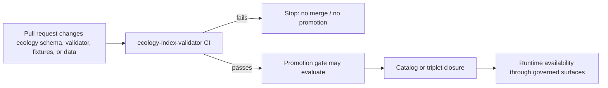

<!-- [KFM_META_BLOCK_V2]
doc_id: kfm://doc/<NEEDS_VERIFICATION_UUID>
title: Ecology Index Validator CI Workflow
type: standard
version: v1
status: draft
owners: @bartytime4life
created: <NEEDS_VERIFICATION_CREATED_DATE>
updated: 2026-04-24
policy_label: <NEEDS_VERIFICATION_POLICY_LABEL>
related: [
  tools/validators/ecology_index/README.md,
  tools/validators/ecology_index/tests/README.md,
  schemas/ecology/kfm_eco_index.schema.json,
  data/receipts/README.md,
  .github/workflows/README.md
]
tags: [kfm, ecology, ci, validator, github-actions, fail-closed]
notes: [
  "Proposed CI workflow for ecology index validator enforcement.",
  "Does not claim workflow YAML exists in repository.",
  "Related paths are repo-relative targets carried from the draft and must be verified before promotion.",
  "Check names, action versions, module entry points, fixture paths, and required-check enforcement must be verified before promotion."
]
[/KFM_META_BLOCK_V2] -->

<a id="top"></a>

# Ecology Index Validator CI Workflow

Proposed fail-closed CI workflow for validating ecological join-index contracts, fixtures, and validator behavior before merge.


> [!IMPORTANT]
> **Truth posture:** `PROPOSED`  
> This document describes a proposed GitHub Actions workflow. It must not be used as evidence that the workflow file, check name, branch protection rule, validator module entry point, fixtures, or required-check enforcement already exist.

---

## Quick navigation

- [Purpose](#purpose)
- [Repo fit](#repo-fit)
- [Validation boundary](#validation-boundary)
- [Trigger conditions](#trigger-conditions)
- [Proposed workflow](#proposed-workflow)
- [Required behavior](#required-behavior)
- [Promotion integration](#promotion-integration)
- [Check naming and branch protection](#check-naming-and-branch-protection)
- [Anti-patterns](#anti-patterns)
- [Rollback path](#rollback-path)
- [Definition of done](#definition-of-done)
- [Verification backlog](#verification-backlog)

---

## Purpose

The Ecology Index Validator workflow is intended to make ecological join-index validation visible, repeatable, and hard to bypass.

It should run before merge whenever a change can alter the meaning, shape, fixture coverage, or admissibility of ecological join-index data.

### Target workflow file

```text
.github/workflows/ecology_index_validator.yml
```

**Status:** `PROPOSED`  
**File existence:** `NEEDS VERIFICATION`

---

## Repo fit

| Surface | Proposed role | Truth posture |
|---|---|---|
| `schemas/ecology/kfm_eco_index.schema.json` | Machine-checkable shape for ecological join-index records | `PROPOSED / NEEDS VERIFICATION` |
| `tools/validators/ecology_index/` | Executable validator and validator-local docs | `PROPOSED / NEEDS VERIFICATION` |
| `tools/validators/ecology_index/tests/` | Runnable validator tests, including semantic failure cases | `PROPOSED / NEEDS VERIFICATION` |
| `tools/validators/ecology_index/fixtures/valid/` | Valid ecological join-index examples | `PROPOSED / NEEDS VERIFICATION` |
| `tools/validators/ecology_index/fixtures/invalid/` | Invalid examples proving failure recognition | `PROPOSED / NEEDS VERIFICATION` |
| `.github/workflows/ecology_index_validator.yml` | CI orchestration surface | `PROPOSED / NEEDS VERIFICATION` |

### Accepted inputs

This workflow should validate changes affecting:

- ecology schemas
- ecology-index validator code
- validator tests
- valid and invalid ecological fixtures
- ecological join-index data paths
- workflow configuration for this validator

### Exclusions

This workflow should **not** own:

| Excluded surface | Goes instead |
|---|---|
| Live ecological source ingestion | source onboarding / pipeline workflow |
| Public release or promotion decision | promotion gate |
| Runtime API behavior | governed API tests |
| Map layer rendering | MapLibre / layer-manifest validation |
| AI-generated ecological summaries | governed AI / runtime response validation |
| Rights, sensitivity, or steward review decisions | policy gate and review record surfaces |

---

## Validation boundary

The workflow is only a CI orchestration layer. It should expose failures from contracts, schemas, fixtures, validators, and tests; it should not become the source of truth for object meaning or publication admissibility.

| Layer | Owns | Workflow responsibility |
|---|---|---|
| Contract / README | Human meaning, field intent, lifecycle semantics | Link to it; do not replace it |
| Schema | Machine-valid shape | Check that the schema is valid and exercised |
| Validator | Domain-specific semantic checks | Run it and fail closed on nonzero exit |
| Tests / fixtures | Success and failure examples | Require both positive and negative coverage |
| Policy | Admissibility, obligations, deny/restrict logic | Do not silently substitute CI for policy |
| Receipts / proof objects | Evidence that a specific run occurred | Future integration; not claimed here |

> [!NOTE]
> `Unknown domain` is listed as a required failure condition below, but CI can only enforce it if the validator or tests implement that semantic check.

---

## Trigger conditions

The original draft used path-scoped pull request triggers and a `main` push trigger. That intent is preserved, with the workflow file itself added to the path list.

> [!WARNING]
> If this check becomes a required branch-protection check, path-filter behavior must be verified in GitHub before enforcement. A skipped workflow can create ambiguous required-check behavior unless the repo has an intentional always-run fallback.

```yaml
on:
  pull_request:
    paths:
      - "schemas/ecology/**"
      - "tools/validators/ecology_index/**"
      - "data/**"
      - ".github/workflows/ecology_index_validator.yml"
  push:
    branches:
      - main
    paths:
      - "schemas/ecology/**"
      - "tools/validators/ecology_index/**"
      - "data/**"
      - ".github/workflows/ecology_index_validator.yml"
  workflow_dispatch:
```

### Path-filter note

`data/**` is intentionally broad because the exact ecological join-index data home has not been verified in this session. Narrow it only after the actual data paths are inspected.

[Back to top](#top)

---

## Proposed workflow

```yaml
name: Ecology Index Validator

on:
  pull_request:
    paths:
      - "schemas/ecology/**"
      - "tools/validators/ecology_index/**"
      - "data/**"
      - ".github/workflows/ecology_index_validator.yml"
  push:
    branches:
      - main
    paths:
      - "schemas/ecology/**"
      - "tools/validators/ecology_index/**"
      - "data/**"
      - ".github/workflows/ecology_index_validator.yml"
  workflow_dispatch:

permissions:
  contents: read

concurrency:
  group: ecology-index-validator-${{ github.ref }}
  cancel-in-progress: true

jobs:
  validate-ecology-index:
    name: ecology-index-validator
    runs-on: ubuntu-latest
    timeout-minutes: 10

    steps:
      - name: Checkout repository
        uses: actions/checkout@v4

      - name: Set up Python
        uses: actions/setup-python@v5
        with:
          python-version: "3.11"

      - name: Install validator dependencies
        run: |
          python -m pip install --upgrade pip

          if [ -f tools/validators/ecology_index/requirements.txt ]; then
            python -m pip install -r tools/validators/ecology_index/requirements.txt
          fi

          python -m pip install jsonschema pytest

      - name: Check ecology schema is valid JSON Schema
        shell: bash
        run: |
          set -euo pipefail

          python - <<'PY'
          import json
          from pathlib import Path
          from jsonschema.validators import validator_for

          schema_path = Path("schemas/ecology/kfm_eco_index.schema.json")

          if not schema_path.exists():
              raise SystemExit(f"Missing ecology schema: {schema_path}")

          schema = json.loads(schema_path.read_text(encoding="utf-8"))
          validator_cls = validator_for(schema)
          validator_cls.check_schema(schema)

          print(f"Schema OK: {schema_path}")
          PY

      - name: Run validator tests
        run: |
          pytest tools/validators/ecology_index/tests -q

      - name: Validate direct fixture coverage
        shell: bash
        run: |
          set -euo pipefail
          shopt -s nullglob

          schema="schemas/ecology/kfm_eco_index.schema.json"
          valid_fixtures=(tools/validators/ecology_index/fixtures/valid/*.json)
          invalid_fixtures=(tools/validators/ecology_index/fixtures/invalid/*.json)

          if [ "${#valid_fixtures[@]}" -eq 0 ]; then
            echo "::error::No valid ecology index fixtures found."
            exit 1
          fi

          if [ "${#invalid_fixtures[@]}" -eq 0 ]; then
            echo "::error::No invalid ecology index fixtures found. Negative coverage is required."
            exit 1
          fi

          for file in "${valid_fixtures[@]}"; do
            echo "Validating expected-valid fixture: ${file}"
            python -m tools.validators.ecology_index \
              --input "$file" \
              --schema "$schema"
          done

          for file in "${invalid_fixtures[@]}"; do
            echo "Validating expected-invalid fixture is rejected: ${file}"

            if python -m tools.validators.ecology_index \
              --input "$file" \
              --schema "$schema"; then
              echo "::error file=${file}::Invalid ecology index fixture passed validation."
              exit 1
            fi
          done
```

### Workflow assumptions to verify

| Assumption | Why it matters | Status |
|---|---|---|
| `python -m tools.validators.ecology_index` is a valid module entry point | The direct fixture sweep depends on it | `NEEDS VERIFICATION` |
| Python `3.11` matches the repo’s supported validator runtime | Avoids CI/runtime drift | `NEEDS VERIFICATION` |
| `jsonschema` and `pytest` are sufficient dependencies | The validator may need repo-specific packages | `NEEDS VERIFICATION` |
| `fixtures/valid` and `fixtures/invalid` are the actual fixture homes | The workflow fails closed if they are missing | `NEEDS VERIFICATION` |
| `actions/checkout@v4` and `actions/setup-python@v5` are acceptable pins | Action versions are version-sensitive | `NEEDS VERIFICATION` |

[Back to top](#top)

---

## Required behavior

| Condition | Expected outcome | Enforced by |
|---|---|---|
| Any test fails | CI fails | `pytest` step |
| Schema file is missing | CI fails | schema preflight |
| Schema is not a valid JSON Schema | CI fails | schema preflight |
| Valid fixture fails validation | CI fails | direct fixture sweep |
| Invalid fixture passes validation | CI fails | direct fixture sweep |
| No valid fixtures exist | CI fails | fixture coverage preflight |
| No invalid fixtures exist | CI fails | fixture coverage preflight |
| Missing dependency | CI fails | dependency install or test step |
| Unknown domain | CI fails | validator or test suite |
| Warning represents evidence-integrity risk | CI fails or is escalated by validator | validator policy |

### Validator-owned semantic checks

The workflow should not encode ecology semantics in shell logic. The validator or its tests should own checks such as:

- unknown domain rejection
- malformed join target
- missing required evidence reference
- duplicate deterministic identifier
- invalid lifecycle or publication state
- unsupported source role
- unsafe silent warning behavior

---

## Promotion integration

CI is a precondition, not a promotion action.



### Integration rule

Passing this workflow means only:

```text
the proposed ecology index validation surface passed its configured CI checks
```

It does **not** mean:

```text
the data is promoted
the catalog is closed
the release is approved
runtime availability is granted
the check is enforced by branch protection
```

[Back to top](#top)

---

## Check naming and branch protection

Proposed job name:

```text
ecology-index-validator
```

Potential GitHub check label:

```text
Ecology Index Validator / ecology-index-validator
```

> [!WARNING]
> Do not document this as a required check until verified in repository settings. The exact check name must be copied from a real pull request status check after the workflow exists and runs.

### Verification steps before required-check enforcement

1. Add the workflow file in a branch.
2. Open a pull request that changes an ecology validator fixture.
3. Confirm the visible check name in the PR UI.
4. Confirm behavior when the path filter does and does not match.
5. Add branch protection only after the exact required check string is known.
6. Update this document from `PROPOSED` to `REVIEW` only after the workflow and check enforcement are verified.

---

## Anti-patterns

| Anti-pattern | Why invalid |
|---|---|
| Skipping the validator in CI | Breaks fail-closed guarantees |
| Running only schema validation | Misses semantic checks |
| Allowing warnings to pass silently | Hides evidence-integrity issues |
| Valid fixtures without invalid fixtures | Proves happy path only |
| Path-filtered required check without verification | Can create enforcement ambiguity |
| Treating CI pass as promotion | Collapses validation and release governance |
| Hard-coding ecology semantics in shell | Moves domain meaning out of the validator |
| Publishing data directly from this workflow | Bypasses promotion, catalog, proof, and review gates |

---

## Rollback path

This proposed workflow is safe to roll back because it should not mutate repository data, publish artifacts, or promote releases.

| Rollback target | Action |
|---|---|
| Workflow causes false failures | Revert `.github/workflows/ecology_index_validator.yml` |
| Branch protection blocks merges incorrectly | Remove the required-check rule first, then repair workflow |
| Module entry point is wrong | Update workflow to call the repo-verified validator command |
| Fixture homes are wrong | Update paths after repo inspection |
| Dependency install is wrong | Replace fallback install with repo-native dependency management |
| Path filter is too broad or too narrow | Adjust after ecological data homes are verified |

---

## Definition of done

- [ ] Workflow file exists at `.github/workflows/ecology_index_validator.yml`.
- [ ] Workflow runs on at least one pull request.
- [ ] CI installs validator dependencies through repo-approved dependency management.
- [ ] `jsonschema` is available in CI.
- [ ] Schema preflight checks `schemas/ecology/kfm_eco_index.schema.json`.
- [ ] Validator tests execute successfully.
- [ ] Valid fixtures validate correctly.
- [ ] Invalid fixtures are rejected.
- [ ] Missing fixture coverage fails closed.
- [ ] Unknown domain failure is covered by validator tests or fixtures.
- [ ] Exact PR check name is confirmed.
- [ ] Required-check enforcement is verified in repository settings.
- [ ] Path-filter behavior is verified.
- [ ] Adjacent README or workflow index is updated.
- [ ] This document is updated from `PROPOSED` only after repository evidence supports promotion.

[Back to top](#top)

---

## Verification backlog

| Item | Status | Verification evidence needed |
|---|---|---|
| `doc_id` UUID | `<NEEDS_VERIFICATION_UUID>` | Canonical document registry entry |
| `created` date | `<NEEDS_VERIFICATION_CREATED_DATE>` | Repo history or document registry |
| `policy_label` | `<NEEDS_VERIFICATION_POLICY_LABEL>` | Policy classification decision |
| Related paths | `NEEDS VERIFICATION` | File existence in mounted repo |
| Workflow file path | `PROPOSED` | File exists in `.github/workflows/` |
| Check name | `PROPOSED` | Real PR status check label |
| Branch protection | `UNKNOWN` | Repository settings evidence |
| Validator module entry point | `NEEDS VERIFICATION` | Running command in repo checkout |
| Fixture directories | `NEEDS VERIFICATION` | Valid and invalid fixture inventory |
| CI action pins | `NEEDS VERIFICATION` | Repo dependency/update policy |
| Ecological join-index data paths | `UNKNOWN` | Repo data inventory |

---

## Review note

This document should remain in `draft` until a real repository checkout confirms:

```text
workflow file exists
schema path exists
validator module entry point works
fixtures exist
tests run
check name is visible on PRs
required-check behavior is verified
```

Only then should the truth posture move from `PROPOSED` toward `REVIEW`.

[Back to top](#top)
