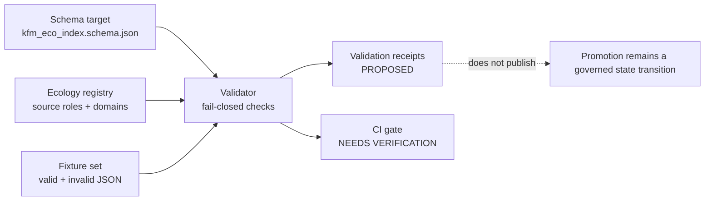

<!-- [KFM_META_BLOCK_V2]
doc_id: kfm://doc/<NEEDS_VERIFICATION_UUID>
title: KFM Eco Index Validator Fixtures
type: standard
version: v1
status: draft
owners: @bartytime4life
created: <NEEDS_VERIFICATION_CREATED_DATE>
updated: 2026-04-24
policy_label: <NEEDS_VERIFICATION_POLICY_LABEL>
related: [
  "../../../../schemas/ecology/kfm_eco_index.schema.json",
  "../../../../schemas/README.md",
  "../../README.md",
  "../../../../data/registry/ecology/README.md"
]
tags: [kfm, ecology, schema, fixtures, validator, join-index]
notes: [
  "README-like fixture inventory for the proposed kfm_eco_index schema.",
  "Does not claim fixture files, schema files, validators, receipts, or CI jobs already exist.",
  "Target path, policy label, creation date, schema home, and CI check names need verification in a mounted repository."
]
[/KFM_META_BLOCK_V2] -->

<a id="top"></a>

# KFM Eco Index Validator Fixtures

Fixture index and review guide for validating proposed `kfm_eco_index` join-index rows before they can support governed ecology outputs.


> [!IMPORTANT]
> **Status:** experimental / draft  
> **Owners:** `@bartytime4life` from source draft; CODEOWNERS / maintainer registry **NEEDS VERIFICATION**  
> **Suggested path:** `tools/validators/ecology_index/fixtures/README.md`  
> **Schema target:** `schemas/ecology/kfm_eco_index.schema.json`  
> **Truth posture:** `PROPOSED` until the schema, validator entrypoint, fixture files, and CI wiring are verified in the actual repository.

**Quick jumps:** [Scope](#scope) · [Repo fit](#repo-fit) · [Inputs](#accepted-inputs) · [Exclusions](#exclusions) · [Fixture tree](#proposed-fixture-tree) · [Validator rules](#validator-rule-matrix) · [Expected failures](#expected-failure-manifest) · [Task list](#task-list) · [Appendix](#appendix-fixture-payloads)

---

## Scope

This fixture set is a proposed no-live-source test surface for the `kfm_eco_index` schema.

It is intended to prove that ecology join-index rows preserve KFM’s evidence-first posture across ecological domains such as vegetation, soil, hydrology, fauna, habitat, landcover, and air-context joins.

The fixtures are **not** ecological truth records. They are schema and validator examples used to test whether a row can safely move toward later catalog, evidence, layer, and publication workflows.

### Truth-label split

| Label | Meaning for this fixture README |
|---|---|
| `CONFIRMED` | This Markdown draft and its proposed fixture payloads were supplied for revision. |
| `PROPOSED` | Fixture paths, schema target, validator behavior, expected failures, and CI wiring are design targets. |
| `UNKNOWN` | Actual repo layout, schema home, validator entrypoint, policy engine, test runner, receipt writer, and CI check names. |
| `NEEDS VERIFICATION` | `doc_id`, created date, policy label, source registry alignment, CODEOWNERS, and whether these paths already exist. |

---

## Repo fit

> [!NOTE]
> Path relationships below are written from the proposed README location:  
> `tools/validators/ecology_index/fixtures/README.md`

| Relationship | Proposed path | Status | Role |
|---|---:|---|---|
| This README | `tools/validators/ecology_index/fixtures/README.md` | `PROPOSED` | Describes fixture purpose, inventory, expected outcomes, and review gates. |
| Parent validator docs | [`../README.md`](../README.md) | `NEEDS VERIFICATION` | Expected home for validator behavior, CLI usage, and receipt emission. |
| Validator registry | [`../../README.md`](../../README.md) | `NEEDS VERIFICATION` | Expected broader validator index. |
| Schema target | [`../../../../schemas/ecology/kfm_eco_index.schema.json`](../../../../schemas/ecology/kfm_eco_index.schema.json) | `NEEDS VERIFICATION` | Machine-readable contract these fixtures should validate against. |
| Schema registry | [`../../../../schemas/README.md`](../../../../schemas/README.md) | `NEEDS VERIFICATION` | Expected schema authority and naming guidance. |
| Ecology source registry | [`../../../../data/registry/ecology/README.md`](../../../../data/registry/ecology/README.md) | `NEEDS VERIFICATION` | Expected source-role and domain registry reference. |

### Upstream / downstream boundary



[Back to top](#top)

---

## Accepted inputs

Only small, synthetic, reviewable JSON fixture rows belong in this directory.

| Input | Belongs here? | Requirements |
|---|---:|---|
| `valid/*.json` fixture row | Yes | Must be synthetic, public-safe, schema-valid, and evidence-linked. |
| `invalid/*.json` fixture row | Yes | Must fail for one clearly named reason. |
| Expected failure manifest | Yes | Should map each invalid fixture to the expected failure code/message. |
| Tiny illustrative catalog / evidence refs | Yes, as strings only | Must not imply referenced evidence files already exist. |
| Public-safe generalized sensitivity examples | Yes | Useful for proving `sensitivity` and precision handling. |

## Exclusions

| Excluded material | Why it does not belong here | Put it here instead |
|---|---|---|
| Live ecological source data | Fixtures must not become RAW / WORK data. | `data/raw/...` or source-specific lifecycle area after source activation. |
| Canonical schema definitions | This directory tests schemas; it does not define them. | `schemas/ecology/` or verified schema home. |
| Source registry records | Source roles and authority are upstream of validation. | `data/registry/ecology/` or verified registry home. |
| Validator implementation code | This directory is fixture payloads and expectations. | `tools/validators/ecology_index/` or verified validator package. |
| Generated validation receipts | Receipts are emitted process evidence, not static fixture inputs. | `data/receipts/...` or verified receipt home. |
| MapLibre layer descriptors | Renderer delivery must not become evidence. | Layer / delivery registry after release-state verification. |
| Restricted exact species locations | Public fixtures should not encode sensitive exact locations. | Restricted lane with redaction / generalization review. |

---

## Proposed fixture tree

```text
tools/validators/ecology_index/
├── README.md
└── fixtures/
    ├── README.md
    ├── expected_failures.json
    ├── valid/
    │   ├── huc12_vegetation_soil_hydrology.json
    │   ├── fauna_habitat_grid.json
    │   └── air_station_vegetation.json
    └── invalid/
        ├── missing_spec_hash.json
        ├── huc12_missing_watershed_id.json
        ├── fauna_without_taxon_or_obs.json
        ├── evidence_refs_empty.json
        └── unknown_domain.json
```

---

## Quickstart

No executable validator command is confirmed from current evidence.

After the actual repository is mounted and the validator entrypoint is verified, the command should be documented in the parent validator README. Until then, this command shape is only a **PROPOSED placeholder**:

```bash
# PROPOSED — verify validator entrypoint, package manager, and schema home before use.
python -m tools.validators.ecology_index.validate \
  --schema schemas/ecology/kfm_eco_index.schema.json \
  --fixtures tools/validators/ecology_index/fixtures \
  --expected-failures tools/validators/ecology_index/fixtures/expected_failures.json
```

Expected outcome:

| Fixture group | Expected result |
|---|---|
| `valid/*.json` | pass |
| `invalid/*.json` | fail |
| missing schema | fail closed |
| unresolved `evidence_ref` | fail closed |
| unknown domain | fail closed |
| renderer-only evidence | fail closed |

[Back to top](#top)

---

## Validator rule matrix

These rules are inferred from the supplied fixture set and KFM doctrine. They remain `PROPOSED` until enforced by the verified schema and validator.

| Rule ID | Fixture pressure | Expected behavior |
|---|---|---|
| `ECO_INDEX_SPEC_HASH_REQUIRED` | `invalid/missing_spec_hash.json` | `spec_hash` must be present. |
| `ECO_INDEX_SPEC_HASH_HEX64` | all valid fixtures | `spec_hash` should be a deterministic 64-character lowercase hex string. |
| `ECO_INDEX_EVIDENCE_REQUIRED` | `invalid/evidence_refs_empty.json` | `evidence_refs` must contain at least one item. |
| `ECO_INDEX_DOMAIN_ENUM` | `invalid/unknown_domain.json` | Unknown domain values fail closed. |
| `ECO_INDEX_HUC12_WATERSHED_KEY` | `invalid/huc12_missing_watershed_id.json` | `geometry_type: huc12` requires `join_keys.watershed_id`. |
| `ECO_INDEX_FAUNA_IDENTITY_KEY` | `invalid/fauna_without_taxon_or_obs.json` | `domain: fauna` requires `join_keys.taxon_id` or `join_keys.obs_id`. |
| `ECO_INDEX_CATALOG_REFS_SHAPE` | valid fixtures | `catalog_refs` may include `dcat`, `stac`, and `prov` arrays. |
| `ECO_INDEX_SENSITIVITY_VISIBLE` | `valid/fauna_habitat_grid.json` | Sensitive or generalized spatial support should be explicit. |
| `ECO_INDEX_NO_RENDERER_ONLY_EVIDENCE` | validator expectation | Map layers and renderers may illustrate released outputs, but cannot substitute for evidence. |

---

## Fixture inventory

| Fixture | Group | Purpose | Expected result |
|---|---|---|---|
| `valid/huc12_vegetation_soil_hydrology.json` | valid | Tests a HUC12 seasonal join across vegetation, soil, and hydrology. | pass |
| `valid/fauna_habitat_grid.json` | valid | Tests a generalized grid join across fauna, habitat, and landcover. | pass |
| `valid/air_station_vegetation.json` | valid | Tests a station-buffer monthly join between air context and vegetation. | pass |
| `invalid/missing_spec_hash.json` | invalid | Proves deterministic spec identity is required. | fail |
| `invalid/huc12_missing_watershed_id.json` | invalid | Proves HUC12 geometry needs watershed identity. | fail |
| `invalid/fauna_without_taxon_or_obs.json` | invalid | Proves fauna joins need a taxon or observation key. | fail |
| `invalid/evidence_refs_empty.json` | invalid | Proves evidence cannot be empty. | fail |
| `invalid/unknown_domain.json` | invalid | Proves domain enumeration fails closed. | fail |

---

## Expected failure manifest

The expected failure manifest should live beside the fixture directories so tests can assert exact negative behavior without depending on narrative text.

```json
{
  "manifest_id": "kfm.ecology_index.expected_failures.v1",
  "truth_posture": "PROPOSED",
  "schema_target": "schemas/ecology/kfm_eco_index.schema.json",
  "invalid": [
    {
      "fixture": "invalid/missing_spec_hash.json",
      "expected_rule": "ECO_INDEX_SPEC_HASH_REQUIRED",
      "expected_message": "required field missing: spec_hash"
    },
    {
      "fixture": "invalid/huc12_missing_watershed_id.json",
      "expected_rule": "ECO_INDEX_HUC12_WATERSHED_KEY",
      "expected_message": "geometry_type huc12 requires join_keys.watershed_id"
    },
    {
      "fixture": "invalid/fauna_without_taxon_or_obs.json",
      "expected_rule": "ECO_INDEX_FAUNA_IDENTITY_KEY",
      "expected_message": "domain fauna requires taxon_id or obs_id"
    },
    {
      "fixture": "invalid/evidence_refs_empty.json",
      "expected_rule": "ECO_INDEX_EVIDENCE_REQUIRED",
      "expected_message": "evidence_refs must contain at least one item"
    },
    {
      "fixture": "invalid/unknown_domain.json",
      "expected_rule": "ECO_INDEX_DOMAIN_ENUM",
      "expected_message": "unknown domain: climate_magic"
    }
  ]
}
```

---

## Review and promotion guardrails

> [!WARNING]
> Passing these fixtures must not be treated as publication approval. Fixture validation is an early contract check, not a promotion decision.

A conforming implementation should preserve these KFM guardrails:

| Guardrail | Why it matters |
|---|---|
| Evidence first | Every consequential row should carry `evidence_refs`; renderer state is not evidence. |
| Fail closed | Unknown domains, missing evidence, missing schema, and unresolved refs should fail. |
| Sensitivity visible | Generalization and public-safe geometry should be explicit, especially for fauna/habitat joins. |
| Catalog-aware | `dcat`, `stac`, and `prov` refs should remain separate from evidence refs and receipts. |
| Receipts separate | Validation receipts are process memory, not canonical truth or public release. |
| No live connectors | This fixture set should not activate source harvesting or public publication. |

---

## Task list

- [ ] Verify actual target path in a mounted KFM repository.
- [ ] Verify schema home for `kfm_eco_index.schema.json`.
- [ ] Create fixture directory.
- [ ] Add valid fixtures.
- [ ] Add invalid fixtures.
- [ ] Add `expected_failures.json`.
- [ ] Wire fixtures into validator tests.
- [ ] Emit validation receipts in the verified receipt home.
- [ ] Add policy tests for fail-closed cases.
- [ ] Confirm CI check name before documenting enforcement.
- [ ] Add or update parent validator README with the verified command.
- [ ] Confirm whether this README should remain `draft` or move to `review`.

### Definition of done

This fixture README is ready to promote from draft only when:

| Check | Required evidence |
|---|---|
| Path verified | File exists at the intended repository path. |
| Schema verified | `kfm_eco_index.schema.json` exists and validates the valid fixtures. |
| Negative tests verified | Every invalid fixture fails with the expected rule. |
| Evidence-ref behavior verified | Empty or unresolved evidence refs fail closed. |
| Receipts verified | Validator emits a machine-readable validation receipt. |
| CI verified | CI job name and pass/fail behavior are documented from workflow evidence. |
| Ownership verified | Maintainer / CODEOWNERS assignment is confirmed. |

[Back to top](#top)

---

## Appendix: fixture payloads

The payloads below are intentionally synthetic and illustrative. They should remain small enough for code review.

<details>
<summary><strong>Valid fixture — <code>valid/huc12_vegetation_soil_hydrology.json</code></strong></summary>

```json
{
  "index_id": "kfm.eco_index.huc12:102600080305.2024_growing_season",
  "geom_id": "HUC12:102600080305",
  "geometry_type": "huc12",
  "time_bucket": "2024_growing_season",
  "time_window": {
    "start": "2024-04-01T00:00:00Z",
    "end": "2024-10-31T23:59:59Z",
    "bucket": "seasonal"
  },
  "spec_hash": "aaaaaaaaaaaaaaaaaaaaaaaaaaaaaaaaaaaaaaaaaaaaaaaaaaaaaaaaaaaaaaaa",
  "domains": ["vegetation", "soil", "hydrology"],
  "join_keys": {
    "watershed_id": "102600080305",
    "soil_id": "SSURGO:KS:example",
    "station_id": "MESONET:ELL",
    "layer_id": "kfm.ecology.vegetation.ndvi_change.v1",
    "landcover_class": "grassland"
  },
  "catalog_refs": {
    "dcat": ["kfm:dcat:dataset:soil_moisture"],
    "stac": ["kfm:stac:item:vegetation:ndvi_change:2024"],
    "prov": ["kfm:prov:entity:processed:eco_index:2024"]
  },
  "evidence_refs": [
    {
      "domain": "vegetation",
      "evidence_ref": "kfm:evidence:vegetation:ndvi_change:2024",
      "receipt_refs": ["kfm:receipt:vegetation:ndvi_change:validation:2024"]
    },
    {
      "domain": "soil",
      "evidence_ref": "kfm:evidence:soil:moisture_anomaly:2024",
      "receipt_refs": ["kfm:receipt:soil_moisture:validation:2024"]
    },
    {
      "domain": "hydrology",
      "evidence_ref": "kfm:evidence:hydrology:huc12:102600080305"
    }
  ],
  "quality": {
    "spatial_precision": "huc12",
    "temporal_precision": "seasonal",
    "confidence": 0.74,
    "limitations": [
      "Station evidence may not fully represent local variation."
    ]
  },
  "sensitivity": "public",
  "status": "valid"
}
```

</details>

<details>
<summary><strong>Valid fixture — <code>valid/fauna_habitat_grid.json</code></strong></summary>

```json
{
  "index_id": "kfm.eco_index.grid:ks_10km_204.2023_annual.fauna_habitat",
  "geom_id": "GRID:KS_10KM_204",
  "geometry_type": "grid",
  "time_bucket": "2023_annual",
  "time_window": {
    "start": "2023-01-01T00:00:00Z",
    "end": "2023-12-31T23:59:59Z",
    "bucket": "annual"
  },
  "spec_hash": "bbbbbbbbbbbbbbbbbbbbbbbbbbbbbbbbbbbbbbbbbbbbbbbbbbbbbbbbbbbbbbbb",
  "domains": ["fauna", "habitat", "landcover"],
  "join_keys": {
    "taxon_id": "GBIF:123456",
    "obs_id": "OBS:789",
    "landcover_class": "grassland"
  },
  "catalog_refs": {
    "dcat": ["kfm:dcat:dataset:fauna_observations"],
    "stac": ["kfm:stac:item:habitat:grid_ks_10km_204:2023"],
    "prov": ["kfm:prov:entity:processed:habitat_grid:2023"]
  },
  "evidence_refs": [
    {
      "domain": "fauna",
      "evidence_ref": "kfm:evidence:fauna:observation:OBS:789"
    },
    {
      "domain": "habitat",
      "evidence_ref": "kfm:evidence:habitat:grid:KS_10KM_204:2023"
    },
    {
      "domain": "landcover",
      "evidence_ref": "kfm:evidence:landcover:nlcd:2023"
    }
  ],
  "quality": {
    "spatial_precision": "generalized_grid",
    "temporal_precision": "annual",
    "confidence": 0.68,
    "limitations": [
      "Sensitive species geometry generalized to grid."
    ]
  },
  "sensitivity": "generalized",
  "status": "valid"
}
```

</details>

<details>
<summary><strong>Valid fixture — <code>valid/air_station_vegetation.json</code></strong></summary>

```json
{
  "index_id": "kfm.eco_index.station:epa_example.2024_monthly.air_vegetation",
  "geom_id": "STATION_BUFFER:EPA_EXAMPLE",
  "geometry_type": "station_buffer",
  "time_bucket": "2024_07",
  "time_window": {
    "start": "2024-07-01T00:00:00Z",
    "end": "2024-07-31T23:59:59Z",
    "bucket": "monthly"
  },
  "spec_hash": "cccccccccccccccccccccccccccccccccccccccccccccccccccccccccccccccc",
  "domains": ["air", "vegetation"],
  "join_keys": {
    "station_id": "EPA:AQS:EXAMPLE",
    "layer_id": "kfm.ecology.vegetation.ndvi_monthly.v1"
  },
  "catalog_refs": {
    "dcat": ["kfm:dcat:dataset:air_quality"],
    "stac": ["kfm:stac:item:vegetation:ndvi_monthly:2024_07"],
    "prov": ["kfm:prov:entity:processed:air_vegetation_join:2024_07"]
  },
  "evidence_refs": [
    {
      "domain": "air",
      "evidence_ref": "kfm:evidence:air:aqs:example:2024_07"
    },
    {
      "domain": "vegetation",
      "evidence_ref": "kfm:evidence:vegetation:ndvi_monthly:2024_07"
    }
  ],
  "quality": {
    "spatial_precision": "station_buffer",
    "temporal_precision": "monthly",
    "confidence": 0.61,
    "limitations": [
      "Station buffer does not imply causal relationship."
    ]
  },
  "sensitivity": "public",
  "status": "valid"
}
```

</details>

<details>
<summary><strong>Invalid fixture — <code>invalid/missing_spec_hash.json</code></strong></summary>

```json
{
  "index_id": "kfm.eco_index.invalid.missing_spec_hash",
  "geom_id": "HUC12:102600080305",
  "geometry_type": "huc12",
  "time_bucket": "2024_growing_season",
  "domains": ["vegetation", "soil"],
  "join_keys": {
    "watershed_id": "102600080305",
    "soil_id": "SSURGO:KS:example"
  },
  "evidence_refs": [
    {
      "domain": "vegetation",
      "evidence_ref": "kfm:evidence:vegetation:ndvi_change:2024"
    }
  ],
  "status": "proposed"
}
```

Expected failure:

```text
required field missing: spec_hash
```

</details>

<details>
<summary><strong>Invalid fixture — <code>invalid/huc12_missing_watershed_id.json</code></strong></summary>

```json
{
  "index_id": "kfm.eco_index.invalid.huc12_missing_watershed_id",
  "geom_id": "HUC12:102600080305",
  "geometry_type": "huc12",
  "time_bucket": "2024_growing_season",
  "spec_hash": "dddddddddddddddddddddddddddddddddddddddddddddddddddddddddddddddd",
  "domains": ["vegetation", "soil", "hydrology"],
  "join_keys": {
    "soil_id": "SSURGO:KS:example",
    "layer_id": "kfm.ecology.vegetation.ndvi_change.v1"
  },
  "evidence_refs": [
    {
      "domain": "hydrology",
      "evidence_ref": "kfm:evidence:hydrology:huc12:102600080305"
    }
  ],
  "status": "partial"
}
```

Expected failure:

```text
geometry_type huc12 requires join_keys.watershed_id
```

</details>

<details>
<summary><strong>Invalid fixture — <code>invalid/fauna_without_taxon_or_obs.json</code></strong></summary>

```json
{
  "index_id": "kfm.eco_index.invalid.fauna_without_taxon_or_obs",
  "geom_id": "GRID:KS_10KM_204",
  "geometry_type": "grid",
  "time_bucket": "2023_annual",
  "spec_hash": "eeeeeeeeeeeeeeeeeeeeeeeeeeeeeeeeeeeeeeeeeeeeeeeeeeeeeeeeeeeeeeee",
  "domains": ["fauna", "habitat"],
  "join_keys": {
    "landcover_class": "grassland"
  },
  "evidence_refs": [
    {
      "domain": "fauna",
      "evidence_ref": "kfm:evidence:fauna:missing"
    }
  ],
  "status": "partial"
}
```

Expected failure:

```text
domain fauna requires taxon_id or obs_id
```

</details>

<details>
<summary><strong>Invalid fixture — <code>invalid/evidence_refs_empty.json</code></strong></summary>

```json
{
  "index_id": "kfm.eco_index.invalid.evidence_refs_empty",
  "geom_id": "HUC12:102600080305",
  "geometry_type": "huc12",
  "time_bucket": "2024_growing_season",
  "spec_hash": "ffffffffffffffffffffffffffffffffffffffffffffffffffffffffffffffff",
  "domains": ["vegetation", "soil"],
  "join_keys": {
    "watershed_id": "102600080305",
    "soil_id": "SSURGO:KS:example",
    "layer_id": "kfm.ecology.vegetation.ndvi_change.v1"
  },
  "evidence_refs": [],
  "status": "proposed"
}
```

Expected failure:

```text
evidence_refs must contain at least one item
```

</details>

<details>
<summary><strong>Invalid fixture — <code>invalid/unknown_domain.json</code></strong></summary>

```json
{
  "index_id": "kfm.eco_index.invalid.unknown_domain",
  "geom_id": "HUC12:102600080305",
  "geometry_type": "huc12",
  "time_bucket": "2024_growing_season",
  "spec_hash": "1111111111111111111111111111111111111111111111111111111111111111",
  "domains": ["vegetation", "climate_magic"],
  "join_keys": {
    "watershed_id": "102600080305",
    "layer_id": "kfm.ecology.vegetation.ndvi_change.v1"
  },
  "evidence_refs": [
    {
      "domain": "vegetation",
      "evidence_ref": "kfm:evidence:vegetation:ndvi_change:2024"
    }
  ],
  "status": "proposed"
}
```

Expected failure:

```text
unknown domain: climate_magic
```

</details>

[Back to top](#top)
