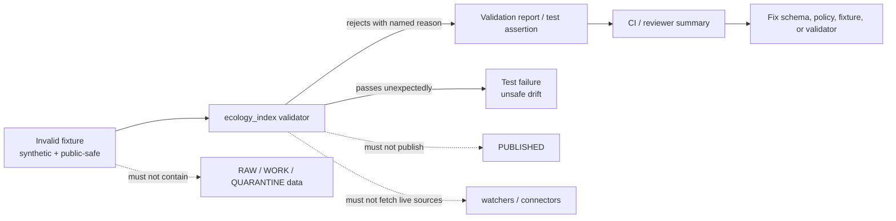

<!-- [KFM_META_BLOCK_V2]
doc_id: kfm://doc/NEEDS-VERIFICATION
title: Ecology Index Invalid Fixtures
type: standard
version: v1
status: draft
owners: TODO_NEEDS_VERIFICATION
created: TODO_NEEDS_VERIFICATION
updated: 2026-04-28
policy_label: public-safe
related: [../../README.md, ../README.md, ../../../README.md, ../../../../../schemas/README.md, ../../../../../policy/README.md, ../../../../../tests/README.md]
tags: [kfm, validators, ecology-index, fixtures, invalid, fail-closed]
notes: [Target path supplied by request. Active branch contents, exact validator runner, fixture schema, owners, and creation date remain NEEDS VERIFICATION.]
[/KFM_META_BLOCK_V2] -->

<a id="top"></a>

# Ecology Index Invalid Fixtures

Deliberately broken ecology-index fixture cases that must fail deterministically without exposing raw, restricted, or sensitive ecology data.

> [!NOTE]
> **Status:** experimental  
> **Document status:** draft  
> **Owners:** `TODO_NEEDS_VERIFICATION`  
>       
> **Quick jumps:** [Scope](#scope) · [Repo fit](#repo-fit) · [Accepted inputs](#accepted-inputs) · [Exclusions](#exclusions) · [Directory tree](#directory-tree) · [Quickstart](#quickstart) · [Usage](#usage) · [Diagram](#diagram) · [Fixture matrix](#fixture-matrix) · [Definition of done](#definition-of-done) · [FAQ](#faq) · [Appendix](#appendix)

> [!IMPORTANT]
> This README documents the **invalid fixture lane**, not the canonical ecology-index schema, not the policy bundle, and not publication approval. Exact checked-in filenames, runner commands, and fixture metadata keys remain **NEEDS VERIFICATION** until the active branch is inspected.

---

## Scope

This directory is for compact, reviewable fixtures that prove the ecology-index validator rejects malformed, unsafe, incomplete, or trust-flattening inputs.

Use this directory to test that the validator fails closed when an ecology-index candidate:

- omits required evidence, provenance, source, policy, or geometry support
- collapses observed occurrence, modeled context, habitat context, or regulatory/status support into one undifferentiated claim
- treats unresolved rights, unknown source role, or missing review state as publishable
- exposes precise sensitive ecology location detail where public-safe generalization or withholding is required
- carries unstable or missing deterministic identity fields such as `spec_hash`, where the checked-in schema requires them
- produces an invalid validation report, decision envelope, receipt reference, or evidence reference chain
- is malformed enough that the expected validator outcome should be `ERROR`, not a quiet pass

### Working posture

| Label | Meaning here |
|---|---|
| **CONFIRMED** | KFM validator lanes should be fail-closed, deterministic, fixture-backed, and subordinate to contracts, schemas, policy, and tests. |
| **INFERRED** | `ecology_index` is treated as an ecology-facing validator family because of the supplied target path. |
| **PROPOSED** | Fixture naming, local reason-code examples, and runner templates below. |
| **UNKNOWN** | Existing branch inventory, exact schema path, exact runner command, fixture metadata keys, and owner assignment. |
| **NEEDS VERIFICATION** | Anything that depends on active-branch files, package manager, CI wiring, executable presence, or repo-wide reason-code registry. |

[Back to top](#top)

---

## Repo fit

**Path:** `tools/validators/ecology_index/fixtures/invalid/README.md`  
**Lane:** `tools/validators/`  
**Role:** negative fixture catalog for the ecology-index validator.

| Direction | Path | Relationship |
|---|---|---|
| Owning validator | [`../../README.md`](../../README.md) | should define the validator’s command, inputs, outputs, and pass/fail contract |
| Fixture family | [`../README.md`](../README.md) | should define shared fixture layout across valid and invalid cases |
| Validator parent lane | [`../../../README.md`](../../../README.md) | keeps this fixture lane aligned with shared fail-closed validator posture |
| Schema authority | [`../../../../../schemas/README.md`](../../../../../schemas/README.md) | machine-readable shape authority; this directory should not redefine it |
| Contract authority | [`../../../../../contracts/README.md`](../../../../../contracts/README.md) | semantic object meaning; fixtures should exercise it, not replace it |
| Policy authority | [`../../../../../policy/README.md`](../../../../../policy/README.md) | allow/deny/abstain/error semantics and reason/obligation vocabulary |
| Test lattice | [`../../../../../tests/README.md`](../../../../../tests/README.md) | broader proof surface for unit, validator, integration, and e2e tests |
| Data lifecycle | [`../../../../../data/README.md`](../../../../../data/README.md) | raw/work/quarantine/processed/catalog/published boundaries, if present |

> [!WARNING]
> These links are the intended repo-relative anchors from this target path. If the active branch uses different parent docs, revise the links before merge rather than preserving broken navigation.

### Upstream inputs

Invalid fixtures here should be derived from, or intentionally violate, the same upstream authorities as valid ecology-index fixtures:

- ecology-index schema or contract objects
- source descriptors and source-role rules
- evidence bundle references
- validation report expectations
- policy decision or runtime decision envelopes
- rights, sensitivity, and public-safe precision requirements
- deterministic identity and receipt/proof linkage rules

### Downstream consumers

- local validator tests
- CI smoke checks
- promotion-gate prechecks
- reviewer-facing validation summaries
- regression tests that prove unsafe ecology-index candidates do not become publishable claims

[Back to top](#top)

---

## Accepted inputs

Place only **synthetic, public-safe, intentionally invalid** fixture files here.

| Accepted input | Why it belongs here | Expected validator posture |
|---|---|---|
| malformed JSON/YAML fixture | proves parser or schema failure is explicit | `ERROR` or named schema failure |
| missing evidence reference | proves cite-or-abstain posture is enforced | reject with evidence/provenance reason |
| missing or unknown source role | prevents source-authority flattening | reject with source-role reason |
| observed/model/regulatory support mixed invisibly | prevents ecology truth-class collapse | reject with support-class reason |
| unresolved rights marked publishable | prevents rights laundering | reject with rights reason |
| exact sensitive location marked public-safe | prevents precision leakage | reject with sensitivity/geoprivacy reason |
| missing `spec_hash` or unstable identity | prevents non-deterministic fixture acceptance | reject with identity reason |
| missing validation report linkage | prevents unsupported promotion | reject with validation/report reason |
| invalid evidence-bundle reference shape | prevents broken EvidenceRef resolution | reject with evidence-ref reason |

> [!IMPORTANT]
> A **valid negative-outcome fixture** is not automatically an **invalid fixture**.  
> A well-formed fixture whose expected outcome is `DENY` or `ABSTAIN` may belong in a valid or e2e runtime-proof fixture set. This directory is for objects that the ecology-index validator should reject as malformed, incomplete, unsafe, or inadmissible.

[Back to top](#top)

---

## Exclusions

| Does not belong here | Put it here instead | Why |
|---|---|---|
| valid ecology-index examples | `../valid/` | valid fixtures should prove accepted shape and permitted negative decisions separately |
| canonical schema files | `../../../../../schemas/` | schemas define machine shape; fixtures exercise it |
| semantic contract docs | `../../../../../contracts/` | contracts define meaning; fixtures should not become doctrine |
| Rego or policy source | `../../../../../policy/` | policy owns allow/deny/restrict rules |
| large raw provider pulls | governed `data/raw/`, `data/work/`, or ignored local paths | invalid fixtures must stay compact and reviewable |
| quarantined real-world records | governed `data/quarantine/` or steward-only stores | public fixture lanes must not leak sensitive or rights-restricted data |
| release manifests, proof packs, signed bundles | release/proof/promotion surfaces | this lane proves validator rejection, not publication readiness |
| UI screenshots or rendered map outputs | UI or evidence-drawer test surfaces | fixture validity should not depend on renderer behavior |
| live watcher, connector, or scraper code | pipeline, connector, or workflow lanes | validators consume normalized candidates; they should not fetch sources |
| exact sensitive ecology coordinates | steward-only or redacted fixtures | the fixture must prove withholding without disclosing what should be withheld |

[Back to top](#top)

---

## Directory tree

### Current safe claim

The target path is supplied by the task. Active branch contents were not verified in this session.

```text
tools/validators/ecology_index/fixtures/invalid/
└── README.md
```

### Preferred growth shape

`PROPOSED` / `NEEDS VERIFICATION` until the owning validator confirms fixture naming and runner behavior.

```text
tools/validators/ecology_index/fixtures/
├── README.md
├── valid/
│   └── README.md
└── invalid/
    ├── README.md
    ├── missing_evidence_ref.invalid.json
    ├── unknown_source_role.invalid.json
    ├── mixed_support_class.invalid.json
    ├── unresolved_rights_publishable.invalid.json
    ├── sensitive_exact_location_public.invalid.json
    ├── missing_spec_hash.invalid.json
    ├── invalid_validation_report_ref.invalid.json
    └── malformed_payload.invalid.json
```

> [!TIP]
> Prefer one broken reason per invalid fixture. A narrow invalid case gives maintainers a better regression signal than a dramatic fixture with five unrelated failures.

[Back to top](#top)

---

## Quickstart

### 1. Inspect the active branch first

```bash
# Run from the repository root.
find tools/validators/ecology_index -maxdepth 5 -type f 2>/dev/null | sort

sed -n '1,260p' tools/validators/ecology_index/README.md 2>/dev/null || true
sed -n '1,220p' tools/validators/ecology_index/fixtures/README.md 2>/dev/null || true
sed -n '1,220p' tools/validators/README.md 2>/dev/null || true

find tools/validators/ecology_index/fixtures -maxdepth 3 -type f 2>/dev/null | sort
```

### 2. Recheck schema and policy authorities

```bash
# Replace these with the actual active-branch homes if they differ.
find schemas -maxdepth 5 -type f 2>/dev/null | grep -Ei 'ecology|occurrence|habitat|evidence|decision|runtime|source' || true
find contracts -maxdepth 5 -type f 2>/dev/null | grep -Ei 'ecology|occurrence|habitat|evidence|decision|runtime|source' || true
find policy -maxdepth 5 -type f 2>/dev/null | grep -Ei 'ecology|occurrence|habitat|rights|sensitivity|source' || true
```

### 3. Run the validator

`NEEDS VERIFICATION`: replace this template with the checked-in command from `../../README.md`.

```bash
# Template only. Do not preserve as canonical unless the active branch confirms it.
python -m tools.validators.ecology_index.validate_fixture \
  tools/validators/ecology_index/fixtures/invalid/<case>.json
```

Expected behavior for every fixture in this directory:

```text
invalid fixture + ecology_index validator => non-zero status or explicit machine-readable rejection
```

[Back to top](#top)

---

## Usage

### Add an invalid fixture

1. Choose one failure category from the [fixture matrix](#fixture-matrix).
2. Create the smallest fixture that triggers that failure.
3. Keep all records synthetic and public-safe.
4. Make the expected reason visible through filename, local manifest, or adjacent test assertion.
5. Run the validator and confirm the fixture fails for the intended reason.
6. Update this README when adding a new failure category.

### Naming convention

Use stable, boring names that reveal the failure.

```text
<failure_family>.<short_reason>.invalid.json
```

Examples:

```text
evidence.missing_ref.invalid.json
rights.unresolved_publishable.invalid.json
sensitivity.exact_location_public.invalid.json
source_role.unknown_authority.invalid.json
validation.malformed_payload.invalid.json
```

### Invalid fixture metadata

If the active branch supports expected-failure metadata, prefer a compact shape like this.

```json
{
  "fixture_id": "ecology-index-invalid-missing-evidence-ref-001",
  "expected_valid": false,
  "expected_reason_code": "evidence.missing_ref",
  "notes": "Illustrative only; align keys to the checked-in fixture schema before commit."
}
```

> [!CAUTION]
> The metadata shape above is illustrative until the active branch confirms a fixture manifest schema. Do not create a second fixture contract here if the repo already has one.

[Back to top](#top)

---

## Diagram



[Back to top](#top)

---

## Fixture matrix

| Failure family | Invalid case to include | Why it matters | Suggested reason-code family |
|---|---|---|---|
| Schema closure | malformed payload, missing required field, wrong type | proves baseline shape enforcement | `validation.*` |
| Evidence closure | missing `evidence_ref`, broken EvidenceRef shape, empty support list | preserves cite-or-abstain posture | `evidence.*`, `prov.*` |
| Source-role closure | unknown source role, legal-status source used as occurrence proof, occurrence source used as legal authority | prevents source-authority flattening | `source_role.*` |
| Rights closure | unresolved license marked outward-safe, redistribution forbidden but publishable | prevents public release without rights support | `rights.*` |
| Sensitivity closure | exact sensitive location marked public-safe, public precision broader/narrower mismatch hidden | prevents location leakage | `sensitivity.*`, `geom.*` |
| Support-class closure | observed occurrence, modeled range, habitat context, and regulatory context mixed without labels | preserves ecological truth classes | `support.*` |
| Taxon closure | missing scientific name, unresolved rank hidden, invalid taxon confidence | prevents false biological certainty | `taxon.*` |
| Temporal closure | missing observation date/window, stale state hidden, update time confused with observation time | keeps time-aware claims bounded | `time.*` |
| Identity closure | missing or unstable `spec_hash`, duplicate candidate identity | preserves deterministic rebuild behavior | `identity.*`, `spec_hash.*` |
| Validation-report closure | report says pass while candidate is invalid, missing report subject | prevents validator-output laundering | `validation_report.*` |
| Publication boundary | fixture references raw/work/quarantine as public-safe support | preserves KFM lifecycle boundary | `publication.*`, `lifecycle.*` |

[Back to top](#top)

---

## Definition of done

A new invalid fixture is ready for review when all applicable checks are true.

- [ ] The fixture is synthetic, public-safe, and small enough to inspect in GitHub.
- [ ] The fixture targets one primary failure category.
- [ ] The expected failure reason is visible in filename, manifest, or test assertion.
- [ ] The validator rejects the fixture deterministically.
- [ ] The rejection does not depend on live network access.
- [ ] The fixture does not include real sensitive coordinates, real steward-only data, secrets, tokens, or private source records.
- [ ] The fixture does not redefine the canonical schema, policy, or contract.
- [ ] A matching valid fixture exists where useful to prove the boundary.
- [ ] CI or local test coverage fails if this invalid fixture is accidentally accepted.
- [ ] New reason-code families are registered in the repo’s reason/obligation vocabulary if one exists.

[Back to top](#top)

---

## FAQ

### Is a `DENY` response an invalid fixture?

Not necessarily. A complete, well-formed candidate that correctly produces `DENY` is a **valid negative-outcome fixture**. It belongs with valid or runtime-proof fixtures unless the object itself is malformed or inadmissible.

### Can invalid fixtures include real public biodiversity observations?

Prefer no. Use synthetic records. Even public observations can carry record-level rights, geoprivacy, precision, attribution, or sensitivity obligations that make them poor negative-test material.

### Should this directory contain policy examples?

No. This directory can include fixtures that violate policy, but policy source belongs in the policy lane. The fixture should help test policy/validator behavior without becoming a policy document.

### What happens if the active branch has a different fixture home?

Update the README and links to the branch reality. Do not preserve this path as canonical if the repo has already standardized a different fixture layout.

[Back to top](#top)

---

## Appendix

<details>
<summary>Review notes for maintainers</summary>

### What this README intentionally does not claim

- It does not claim `tools/validators/ecology_index` currently contains an executable validator.
- It does not claim a checked-in ecology-index schema exists at any particular path.
- It does not claim `pytest`, `python -m`, OPA, Conftest, or a workflow runner is the repo’s active execution path.
- It does not define an `EcologyIndex` object model.
- It does not authorize publication of any ecological or biodiversity claim.

### Safe first verification pass

Use this sequence before accepting new invalid fixtures:

```bash
# 1. Confirm target subtree.
find tools/validators/ecology_index -maxdepth 5 -type f 2>/dev/null | sort

# 2. Confirm parent validator contract.
sed -n '1,300p' tools/validators/ecology_index/README.md 2>/dev/null || true

# 3. Confirm schema, contract, and policy homes.
find schemas contracts policy -maxdepth 6 -type f 2>/dev/null | sort | grep -Ei 'ecology|occurrence|habitat|source|evidence|decision|rights|sensitivity' || true

# 4. Confirm tests that consume invalid fixtures.
find tests tools/validators/ecology_index -maxdepth 6 -type f 2>/dev/null | sort | grep -Ei 'ecology_index|invalid|fixture|validator' || true
```

</details>

[Back to top](#top)
