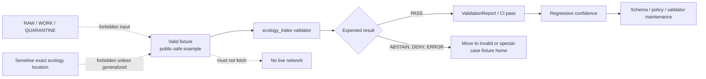

<!-- [KFM_META_BLOCK_V2]
doc_id: kfm://doc/NEEDS-VERIFICATION
title: Ecology Index Valid Fixtures
type: standard
version: v1
status: draft
owners: TODO-verify-ecology-index-validator-owner
created: 2026-04-28
updated: 2026-04-28
policy_label: TODO-policy-label
related: [TODO-verify-related-links]
tags: [kfm, ecology, validators, fixtures, valid]
notes: [Repo was not mounted in the authoring session; verify doc_id, owners, policy label, related links, validator command, and fixture filenames before commit.]
[/KFM_META_BLOCK_V2] -->

# Ecology Index Valid Fixtures

Purpose: document the passing fixture set for `tools/validators/ecology_index`, keeping valid examples no-network, evidence-bounded, public-safe, and easy to review.

<div align="center">


</div>

> [!IMPORTANT]
> **Verification boundary:** this README is repo-ready guidance for the target path, but the live repository tree was not available during drafting. Treat filenames, command entrypoints, owner fields, and related-link targets as **NEEDS VERIFICATION** until checked in the real checkout.

## Impact block

| Field | Value |
|---|---|
| **Status** | `experimental` until the real fixture inventory and validator command are verified |
| **Owners** | `TODO-verify-ecology-index-validator-owner` |
| **Path** | `tools/validators/ecology_index/fixtures/valid/README.md` |
| **Directory role** | Passing examples for the `ecology_index` validator |
| **Truth posture** | **CONFIRMED:** target path requested. **PROPOSED:** local directory conventions and command examples. **UNKNOWN:** actual fixture files and validator entrypoint. |
| **Policy posture** | Public-safe fixture candidates only; sensitive exact ecology locations do not belong here |
| **Quick jumps** | [Scope](#scope) · [Repo fit](#repo-fit) · [Inputs](#accepted-inputs) · [Exclusions](#exclusions) · [Tree](#directory-tree) · [Quickstart](#quickstart) · [Diagram](#diagram) · [Definition of done](#definition-of-done) · [Appendix](#appendix-verification-notes) |

## Scope

This directory is for **valid fixtures**: small, deterministic examples that should pass the `ecology_index` validator without live source access.

A valid fixture is not a published ecology claim by itself. It is a regression target that helps prove the validator can recognize well-formed, policy-safe, evidence-aware ecology index inputs.

Valid fixtures should demonstrate that the validator accepts examples with the required shape, stable identifiers or hashes where applicable, source/evidence references where applicable, lifecycle context where applicable, and public-safe sensitivity posture.

[Back to top](#ecology-index-valid-fixtures)

## Repo fit

| Relationship | Path | Status | Purpose |
|---|---:|---|---|
| Current directory | `tools/validators/ecology_index/fixtures/valid/` | **CONFIRMED from task target** | Holds passing fixtures for the ecology index validator |
| Validator home | [`../../README.md`](../../README.md) | **NEEDS VERIFICATION** | Expected local validator overview and command reference |
| Fixture home | [`../README.md`](../README.md) | **NEEDS VERIFICATION** | Expected fixture family README for valid/invalid split |
| Validators root | [`../../../README.md`](../../../README.md) | **NEEDS VERIFICATION** | Expected shared validator rules, CI expectations, and no-network policy |
| Schema home | `../../../../../schemas/contracts/v1/` | **NEEDS VERIFICATION** | Expected schema-contract surface if the repo follows the proposed KFM layout |
| Policy home | `../../../../../policy/` | **NEEDS VERIFICATION** | Expected fail-closed policy surface for rights, sensitivity, source roles, and publication checks |
| Test home | `../../../../../tests/` | **NEEDS VERIFICATION** | Expected repo-native test runner or fixture regression suite |

Downstream, these fixtures should feed schema checks, validator tests, CI smoke checks, and policy regression tests. They should not feed public APIs, MapLibre layers, Focus Mode, or release manifests directly.

[Back to top](#ecology-index-valid-fixtures)

## Accepted inputs

Only place fixtures here when they are expected to **pass** the ecology index validator.

| Accepted item | Requirements |
|---|---|
| Valid ecology index fixture files | Small, deterministic, no-network examples that match the validator’s accepted input format |
| Public-safe synthetic ecology examples | No exact sensitive species locations, no private records, no restricted steward data, and no live credentials |
| Release-safe candidate examples | May reference evidence, source descriptors, catalog objects, or lifecycle states, but only as local fixture-safe references |
| Positive regression cases | Examples that should pass consistently in CI and during local validator runs |
| Minimal edge-valid cases | Small examples that prove required-but-easy-to-break valid states, such as a reviewed public-safe record or a valid generalized ecology index row |

Expected formats are **NEEDS VERIFICATION**. Do not assume `.json`, `.jsonl`, `.geojson`, or any other extension until the validator contract is inspected.

## Exclusions

| Do not put here | Use instead | Why |
|---|---|---|
| Invalid, malformed, or deny/abstain fixtures | `../invalid/` or the repo-confirmed failing fixture home | Keeps this directory semantically clean: everything here should pass |
| Live source data | `data/raw/`, `data/work/`, or source-specific lifecycle homes after source admission | Valid fixtures are not ingestion stores |
| Quarantined records | `data/quarantine/` or repo-confirmed quarantine fixture home | Rights, sensitivity, validation failures, and uncertainty must remain visible |
| Sensitive exact ecology locations | Restricted test homes or generalized public-safe fixtures only | Exact sensitive locations must fail closed unless explicitly authorized and transformed |
| Generated validation reports | `data/receipts/`, `data/proofs/`, `tests/`, or repo-confirmed report output path | Reports are process memory, not valid input fixtures |
| Published artifacts, release bundles, PMTiles, COGs, or catalog outputs | `data/catalog/`, `data/proofs/`, `data/published/`, or `release/` after promotion | Fixture inputs do not replace catalog/proof/release closure |
| Secrets, API keys, tokens, credentials, or private URLs | Never commit; use secret management outside fixture directories | Fixture tests must be safe to run in CI and forks |

[Back to top](#ecology-index-valid-fixtures)

## Directory tree

Expected local shape, pending repo verification:

```text
tools/validators/ecology_index/
└── fixtures/
    ├── README.md                 # NEEDS VERIFICATION
    ├── valid/
    │   ├── README.md             # this file
    │   └── <valid-fixtures>      # fixture filenames/formats NEEDS VERIFICATION
    └── invalid/                  # expected sibling; NEEDS VERIFICATION
        └── <invalid-fixtures>
```

Use the real checkout to replace `<valid-fixtures>` with actual filenames once they are confirmed.

## Quickstart

Run these from the repository root after verifying the validator entrypoint.

```bash
# Inventory the fixture directory.
find tools/validators/ecology_index/fixtures/valid -maxdepth 1 -type f | sort
```

```bash
# NEEDS VERIFICATION:
# Replace this with the repo-native ecology_index validator command.
python -m tools.validators.ecology_index \
  --fixtures tools/validators/ecology_index/fixtures/valid \
  --expect pass \
  --no-network
```

```bash
# Optional review check: confirm no obvious secret-like strings are present.
grep -RInE '(api[_-]?key|token|secret|password|authorization|bearer)' \
  tools/validators/ecology_index/fixtures/valid || true
```

> [!WARNING]
> Do not add a live-fetch command to this README. Valid fixture tests should remain no-network unless a separate source-activation and policy review explicitly changes the validator contract.

[Back to top](#ecology-index-valid-fixtures)

## Diagram



## What “valid” means here

| Gate | Passing expectation |
|---|---|
| Schema shape | The fixture satisfies the ecology index validator’s accepted input schema |
| Source/evidence posture | Any source or evidence references are local, fixture-safe, and resolvable by the validator or intentionally stubbed according to the fixture contract |
| Sensitivity posture | No exact sensitive ecology locations, restricted species records, private steward data, or unreviewed public claims |
| Lifecycle posture | Fixture does not pretend to be RAW, WORK, QUARANTINE, PROCESSED, CATALOG, or PUBLISHED unless the validator contract explicitly models that state |
| Determinism | Running the validator repeatedly should produce the same PASS result |
| Network posture | No live fetch, credential lookup, or external service dependency |
| Review posture | Any policy/review fields are fixture-safe and do not imply real-world publication approval |

## Maintainer workflow

1. Add or revise a candidate fixture.
2. Run the ecology index validator locally with no network access.
3. Confirm the fixture passes for the intended reason.
4. Confirm the fixture does not contain secrets, sensitive exact locations, live-source records, or production-only IDs.
5. Add or update the paired invalid fixture only in the repo-confirmed invalid fixture home.
6. Update this README if the validator contract, entrypoint, accepted format, or fixture naming changes.

## Definition of done

A change to this directory is ready for review when:

- [ ] The owner and policy label in the KFM meta block are verified.
- [ ] The validator entrypoint is confirmed from repo evidence.
- [ ] Every file in this directory is expected to pass.
- [ ] Valid fixtures pass without network access.
- [ ] Any failing examples live outside this directory.
- [ ] No fixture contains secrets, live credentials, raw private records, or sensitive exact ecology locations.
- [ ] Any source/evidence references are fixture-safe and locally resolvable or explicitly stubbed.
- [ ] The validator emits a deterministic result.
- [ ] The change is reversible by removing the fixture and any corresponding test expectation.
- [ ] Adjacent README links are verified or corrected.

## FAQ

### Can a valid fixture include real public data?

Only after source terms, sensitivity, rights, and review posture are verified. Prefer synthetic or minimal release-safe examples for this directory.

### Can valid fixtures include generalized locations?

Yes, when the validator contract supports geometry and the example is clearly public-safe. Generalization must be explicit, not accidental.

### Can this directory contain expected `ABSTAIN` or `DENY` examples?

No. Keep this directory for expected `PASS` fixtures. Put negative or bounded-runtime examples in the repo-confirmed failing fixture home.

### Does a valid fixture prove an ecology claim is publishable?

No. A passing fixture only proves validator acceptance for a controlled example. Publication still requires evidence, policy, catalog/proof closure, review, release state, and rollback/correction support.

[Back to top](#ecology-index-valid-fixtures)

## Appendix: verification notes

Use these checks after mounting the real repository.

```bash
# Confirm this README location and neighboring fixture structure.
find tools/validators/ecology_index -maxdepth 4 -type f | sort

# Inspect adjacent documentation before changing fixture semantics.
sed -n '1,220p' tools/validators/README.md 2>/dev/null || true
sed -n '1,220p' tools/validators/ecology_index/README.md 2>/dev/null || true
sed -n '1,220p' tools/validators/ecology_index/fixtures/README.md 2>/dev/null || true

# Discover validator entrypoints.
find tools/validators/ecology_index -maxdepth 3 -type f \
  \( -name '*.py' -o -name '*.ts' -o -name '*.js' -o -name '*.sh' -o -name 'README.md' \) \
  | sort

# Discover schema and policy references.
find schemas contracts policy tests -maxdepth 5 -type f 2>/dev/null \
  | grep -Ei 'ecology|habitat|fauna|flora|biodiversity|source|evidence|policy|validator' \
  | sort || true
```

### Open verification items

| Item | Status |
|---|---|
| Actual fixture filenames | **UNKNOWN** |
| Accepted fixture format | **UNKNOWN** |
| Validator command | **NEEDS VERIFICATION** |
| Schema path | **NEEDS VERIFICATION** |
| Policy path | **NEEDS VERIFICATION** |
| Owners | **NEEDS VERIFICATION** |
| Public/restricted policy label | **NEEDS VERIFICATION** |
| Whether sibling `../invalid/` exists | **NEEDS VERIFICATION** |
| Whether fixture tests are wired into CI | **UNKNOWN** |

[Back to top](#ecology-index-valid-fixtures)
