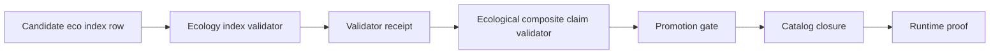

<!-- [KFM_META_BLOCK_V2]
doc_id: kfm://doc/<NEEDS_VERIFICATION_UUID>
title: KFM Eco Index Validator Test Contract
type: standard
version: v1
status: draft
owners: @bartytime4life
created: <NEEDS_VERIFICATION_CREATED_DATE>
updated: 2026-04-24
policy_label: TODO-NEEDS-VERIFICATION
related: [
  ../../../../schemas/ecology/kfm_eco_index.schema.json,
  ../README.md,
  ../fixtures/README.md,
  ../../../../data/receipts/README.md,
  ../../../../tools/validators/README.md,
  ../../../../tools/validators/promotion_gate/README.md
]
tags: [kfm, ecology, validator, tests, fixtures, receipts, promotion-gate, evidence-bundle]
notes: [
  "Proposed README-like test contract for the ecology index validator.",
  "Does not claim the validator, schema, fixtures, tests, CI check, or promotion-gate integration currently exist.",
  "Owner copied from source draft; active CODEOWNERS coverage needs verification.",
  "Suggested target path: tools/validators/ecology_index/tests/README.md."
]
[/KFM_META_BLOCK_V2] -->

<a id="top"></a>

# KFM Eco Index Validator Test Contract

Test contract for proving `kfm_eco_index` validation behavior before ecological composite claims can move toward promotion.


> [!IMPORTANT]
> **Status:** experimental / draft  
> **Owners:** `@bartytime4life` *(copied from the source draft; active branch ownership still needs verification)*  
> **Suggested path:** `tools/validators/ecology_index/tests/README.md`  
> **Truth posture:** `PROPOSED` test contract; implementation state is `UNKNOWN` until verified in the active branch.  
> **Quick jumps:** [Scope](#scope) · [Repo fit](#repo-fit) · [Accepted inputs](#accepted-inputs) · [Exclusions](#exclusions) · [Directory tree](#directory-tree) · [Validation matrix](#validation-matrix) · [Semantic rules](#semantic-rules) · [Fail-closed rules](#fail-closed-rules) · [Receipt contract](#receipt-contract) · [Promotion gate](#promotion-gate) · [Definition of done](#definition-of-done) · [Appendix](#appendix)

> [!NOTE]
> KFM’s public value is the inspectable claim, not the renderer, layer, model summary, or fixture by itself. This test contract therefore treats schema checks, evidence resolution, deterministic receipts, and fail-closed behavior as promotion prerequisites rather than optional QA polish.

---

## Scope

This README defines the expected test behavior for the proposed `kfm_eco_index` validator. It is intended for maintainers who need a compact contract for valid fixtures, invalid fixtures, semantic join rules, failure modes, validator receipts, and promotion-gate readiness.

The contract covers only the ecology index validator test surface. It does **not** assert that the validator is executable, that the schema exists, that CI is wired, or that a promotion gate currently consumes these results.

| Claim | Truth label | Evidence posture |
|---|---|---|
| This file is a proposed README-like test contract. | `CONFIRMED` from source draft / `PROPOSED` for repo placement | The source draft names the same document role and suggested target path. |
| `tools/validators/ecology_index/tests/README.md` is the intended path. | `PROPOSED` | The path is suggested, not verified in a mounted active branch. |
| The validator should fail closed on missing schema, malformed JSON, unresolved evidence, and renderer-only joins. | `PROPOSED` contract requirement | Aligns with KFM cite-or-abstain and trust-membrane doctrine. |
| CI and promotion integration exist. | `UNKNOWN` | Must not be claimed until active branch evidence is inspected. |

[Back to top](#top)

---

## Repo fit

This test contract sits at the validator-test boundary. Its job is to keep ecology index validation small, inspectable, and promotable without letting fixtures or rendered layers substitute for evidence.

| Relation | Path or surface | Role | Status |
|---|---|---|---|
| Target doc | `tools/validators/ecology_index/tests/README.md` | Test contract and contributor orientation | `PROPOSED` |
| Parent validator | `tools/validators/ecology_index/README.md` | Validator behavior, CLI, and scope | `NEEDS VERIFICATION` |
| Fixture guide | `tools/validators/ecology_index/fixtures/README.md` | Valid/invalid fixture rules | `NEEDS VERIFICATION` |
| Upstream schema | `schemas/ecology/kfm_eco_index.schema.json` | Machine contract for index rows | `NEEDS VERIFICATION` |
| Shared validator docs | `tools/validators/README.md` | Cross-validator conventions | `NEEDS VERIFICATION` |
| Receipts docs | `data/receipts/README.md` | Receipt storage and determinism conventions | `NEEDS VERIFICATION` |
| Downstream gate | `tools/validators/promotion_gate/README.md` | Promotion preflight consumer | `NEEDS VERIFICATION` |

> [!CAUTION]
> The paths above are intentionally kept as code-formatted path references rather than proof of existing files. Convert them to relative links only after the active branch confirms the target files exist.

[Back to top](#top)

---

## Accepted inputs

The tests may use only bounded, reviewable inputs.

| Input family | Accepted here | Required handling |
|---|---|---|
| Valid fixtures | `fixtures/valid/*.json` | Must pass schema and semantic checks. |
| Invalid fixtures | `fixtures/invalid/*.json` | Must fail for the expected reason and error code. |
| Candidate rows | One candidate `kfm_eco_index` row or small fixture bundle | Must include evidence references and stable `spec_hash`. |
| Schema reference | `schemas/ecology/kfm_eco_index.schema.json` | Missing schema fails closed. |
| Evidence references | `evidence_refs[]` values that resolve to admissible support | Unresolved refs fail closed. |
| Deterministic receipt examples | Fixed-clock or fixture-clock outputs | Must be stable enough for snapshot or structural assertions. |

[Back to top](#top)

---

## Exclusions

The validator test suite must not become a shortcut around KFM’s evidence path.

| Excluded item | Why it does not belong here | Safer destination |
|---|---|---|
| RAW, WORK, or QUARANTINE records | Tests must not normalize live unpublished data. | Domain ingest / quarantine validators. |
| Renderer-only layer IDs | A map layer is not evidence. | Layer metadata registry plus EvidenceBundle resolution. |
| Live source connectors | Source activation requires rights, cadence, and role verification. | Source registry and connector tests. |
| Public publication claims | Promotion is a governed transition, not a test assertion. | Promotion-gate proof pack. |
| CI check names | Check names are easy to invent and hard to prove. | Document only after workflow YAML is visible. |
| Sensitive exact-location fixtures | Ecology lanes may involve species or habitat sensitivity. | Public-safe synthetic or generalized fixtures only. |

[Back to top](#top)

---

## Directory tree

> [!CAUTION]
> This tree is `PROPOSED` until verified in the active branch.

```text
tools/validators/ecology_index/
├── README.md
├── fixtures/
│   ├── README.md
│   ├── valid/
│   │   ├── huc12_vegetation_soil_hydrology.json
│   │   ├── fauna_habitat_grid.json
│   │   └── air_station_vegetation.json
│   └── invalid/
│       ├── missing_spec_hash.json
│       ├── evidence_refs_empty.json
│       ├── unknown_domain.json
│       └── huc12_missing_watershed_id.json
└── tests/
    ├── README.md
    ├── test_schema_valid_fixtures.py
    ├── test_schema_invalid_fixtures.py
    ├── test_semantic_join_rules.py
    ├── test_fail_closed_behavior.py
    └── test_receipt_output.py
```

[Back to top](#top)

---

## Quickstart

> [!WARNING]
> The commands below are `PROPOSED` examples for the future test surface. Replace them with the repo-native runner once the active branch package manager and test conventions are verified.

```bash
# PROPOSED: run ecology index validator tests only.
pytest tools/validators/ecology_index/tests
```

```bash
# PROPOSED: run one fixture class while developing semantic rules.
pytest tools/validators/ecology_index/tests/test_semantic_join_rules.py
```

Do not document these commands as CI-backed until a workflow file and blocking check are visible.

[Back to top](#top)

---

## Validation matrix

Each test file should prove one narrow behavior class. When a fixture fails, the expected failure reason must be explicit enough for promotion-gate review.

| Test file | Required assertions | Expected outcome |
|---|---|---|
| `test_schema_valid_fixtures.py` | `valid/huc12_vegetation_soil_hydrology.json` | pass |
|  | `valid/fauna_habitat_grid.json` | pass |
|  | `valid/air_station_vegetation.json` | pass |
| `test_schema_invalid_fixtures.py` | `invalid/missing_spec_hash.json` | fail with `ECO_INDEX_SPEC_HASH_REQUIRED` |
|  | `invalid/evidence_refs_empty.json` | fail with `ECO_INDEX_EVIDENCE_REQUIRED` |
|  | `invalid/unknown_domain.json` | fail with `ECO_INDEX_UNKNOWN_DOMAIN` |
| `test_semantic_join_rules.py` | Geometry/domain-specific join keys are enforced. | pass/fail according to [Semantic rules](#semantic-rules) |
| `test_fail_closed_behavior.py` | Missing schema, malformed JSON, unresolved evidence, missing evidence, and renderer-only joins fail closed. | fail with explicit code |
| `test_receipt_output.py` | Validator emits deterministic receipt shape. | pass with stable fields |

[Back to top](#top)

---

## Semantic rules

Semantic checks prevent the ecology index from becoming a loose renderer join. Every row must carry enough domain identity to resolve support and explain why a composite relation is valid.

| Condition | Required key family | Expected error when missing |
|---|---|---|
| `geometry_type = huc12` | `join_keys.watershed_id` | `ECO_INDEX_HUC12_WATERSHED_REQUIRED` |
| `domain = fauna` | `taxon_id` or `obs_id` | `ECO_INDEX_TAXON_OR_OBS_REQUIRED` |
| `domain = flora` | `taxon_id` or `obs_id` | `ECO_INDEX_TAXON_OR_OBS_REQUIRED` |
| `domain = hydrology` | `watershed_id`, `reach_id`, or `station_id` | `ECO_INDEX_HYDROLOGY_KEY_REQUIRED` |
| `domain = soil` | `soil_id` or `station_id` | `ECO_INDEX_SOIL_KEY_REQUIRED` |
| `domain = vegetation` | `layer_id` or `landcover_class` | `ECO_INDEX_VEGETATION_KEY_REQUIRED` |

> [!IMPORTANT]
> `layer_id` is acceptable only as a vegetation-domain join key when backed by evidence. It is not a substitute for `evidence_refs[]`, source role, or EvidenceBundle resolution.

[Back to top](#top)

---

## Fail-closed rules

Unknowns must become explicit failures, not silent passes.

| Failure condition | Required behavior | Error code |
|---|---|---|
| Input path missing | Exit non-zero and emit missing-input receipt or diagnostic. | `ECO_INDEX_INPUT_MISSING` |
| Schema file missing | Fail before semantic validation. | `ECO_INDEX_SCHEMA_MISSING` |
| Malformed JSON | Fail before schema validation. | `ECO_INDEX_JSON_MALFORMED` |
| Schema-invalid JSON object | Fail with structured schema error. | `ECO_INDEX_SCHEMA_INVALID` |
| Missing or invalid `spec_hash` | Fail; do not infer hash silently. | `ECO_INDEX_SPEC_HASH_REQUIRED` |
| Missing or empty `evidence_refs` | Fail; cite-or-abstain posture. | `ECO_INDEX_EVIDENCE_REQUIRED` |
| Unresolved evidence reference | Fail; do not promote unsupported claim. | `ECO_INDEX_EVIDENCE_UNRESOLVED` |
| Unknown domain | Fail; no implicit domain mapping. | `ECO_INDEX_UNKNOWN_DOMAIN` |
| Renderer-only join | Fail; renderer artifacts are not evidence. | `ECO_INDEX_RENDERER_AS_EVIDENCE` |
| Internal validator exception | Fail visibly and preserve diagnostic context. | `ECO_INDEX_INTERNAL_ERROR` |

[Back to top](#top)

---

## Receipt contract

A validator result must be recordable as a deterministic receipt. Tests should assert shape, decision, expected error codes, `schema_ref`, `input_ref`, and a valid `spec_hash`.

```json
{
  "receipt_type": "validator_result",
  "validator": "tools/validators/ecology_index",
  "schema_ref": "schemas/ecology/kfm_eco_index.schema.json",
  "input_ref": "<fixture-or-candidate-ref>",
  "decision": "pass|fail",
  "errors": [],
  "warnings": [],
  "spec_hash": "<sha256>",
  "generated_at": "<timestamp>"
}
```

### Determinism requirements

| Field | Test expectation |
|---|---|
| `receipt_type` | Must equal `validator_result`. |
| `validator` | Must identify the ecology index validator path or registered validator ID. |
| `schema_ref` | Must point to the schema used for validation. |
| `input_ref` | Must identify the fixture or candidate input. |
| `decision` | Must be `pass` or `fail`; no implicit success on warning-only output. |
| `errors[]` | Must contain stable machine-readable `code` values when failing. |
| `warnings[]` | Must not hide required validation failures. |
| `spec_hash` | Must be a 64-character SHA-256 hex string or equivalent repo-standard hash field. |
| `generated_at` | Tests should use a fixed or injectable clock when snapshot stability matters. |

[Back to top](#top)

---

## Exit codes

| Condition | Exit |
|---|---:|
| Pass | `0` |
| Validation failure | `1` |
| Missing input | `2` |
| Missing schema | `3` |
| Unresolved evidence reference | `4` |
| Internal error | `5` |

> [!NOTE]
> Exit codes are part of the contract for shell-based promotion preflights. They do not replace the receipt; promotion should have both a process result and a reviewable receipt.

[Back to top](#top)

---

## Error-code registry

| Code | Meaning |
|---|---|
| `ECO_INDEX_INPUT_MISSING` | Input path or candidate reference is missing. |
| `ECO_INDEX_SCHEMA_MISSING` | Schema file could not be found or loaded. |
| `ECO_INDEX_JSON_MALFORMED` | Input JSON could not be parsed. |
| `ECO_INDEX_SCHEMA_INVALID` | JSON object failed schema validation. |
| `ECO_INDEX_SPEC_HASH_REQUIRED` | `spec_hash` missing or invalid. |
| `ECO_INDEX_HUC12_WATERSHED_REQUIRED` | HUC12 row lacks `join_keys.watershed_id`. |
| `ECO_INDEX_TAXON_OR_OBS_REQUIRED` | Flora/fauna row lacks `taxon_id` or `obs_id`. |
| `ECO_INDEX_HYDROLOGY_KEY_REQUIRED` | Hydrology row lacks watershed, reach, or station key. |
| `ECO_INDEX_SOIL_KEY_REQUIRED` | Soil row lacks soil or station key. |
| `ECO_INDEX_VEGETATION_KEY_REQUIRED` | Vegetation row lacks layer or land-cover key. |
| `ECO_INDEX_EVIDENCE_REQUIRED` | `evidence_refs` missing or empty. |
| `ECO_INDEX_UNKNOWN_DOMAIN` | Domain value is not allowed. |
| `ECO_INDEX_EVIDENCE_UNRESOLVED` | Evidence reference does not resolve. |
| `ECO_INDEX_RENDERER_AS_EVIDENCE` | Renderer or layer reference was used as an evidence substitute. |
| `ECO_INDEX_INTERNAL_ERROR` | Validator encountered an internal error. |

[Back to top](#top)

---

## Promotion gate

The ecology index validator should become a preflight check before ecological composite claims are promoted.



Do **not** mark promotion integration as implemented until all of the following are true:

- executable validator exists;
- tests pass locally;
- CI check is visible and blocking where required;
- receipt output is written to the repo-standard receipt location;
- promotion gate consumes the validator result;
- failure receipts are inspectable by reviewers;
- renderer-only joins fail before promotion;
- unresolved evidence references fail before promotion.

[Back to top](#top)

---

## Definition of done

- [ ] Active-branch path for this README is verified.
- [ ] `kfm_eco_index` schema path is verified.
- [ ] Validator executable or callable entry point is verified.
- [ ] Valid fixtures pass.
- [ ] Invalid fixtures fail with expected error codes.
- [ ] Missing schema fails closed.
- [ ] Missing evidence fails closed.
- [ ] Unresolved evidence references fail closed.
- [ ] Renderer-only joins fail closed.
- [ ] Receipt output is deterministic enough for tests.
- [ ] Promotion gate integration is proven with a fixture or dry-run candidate.
- [ ] CI check name is documented only after workflow verification.

[Back to top](#top)

---

## Verification backlog

| Item | Why it matters | Status |
|---|---|---|
| Confirm active branch has `tools/validators/ecology_index/`. | Prevents proposed tree from becoming a false repo claim. | `UNKNOWN` |
| Confirm schema home for `kfm_eco_index.schema.json`. | Schema-home ambiguity can create duplicate authority. | `NEEDS VERIFICATION` |
| Confirm package manager and test runner. | `pytest` command may not match repo convention. | `UNKNOWN` |
| Confirm EvidenceRef → EvidenceBundle resolver path. | Unresolved evidence must fail closed. | `NEEDS VERIFICATION` |
| Confirm receipt storage convention. | Validator results need durable review surface. | `NEEDS VERIFICATION` |
| Confirm promotion-gate consumer contract. | Preflight is not real until consumed. | `UNKNOWN` |
| Confirm owner and CODEOWNERS coverage. | Maintainer accountability should be explicit. | `NEEDS VERIFICATION` |
| Confirm policy label. | Public/restricted handling should not be guessed. | `NEEDS VERIFICATION` |

[Back to top](#top)

---

## Appendix

<details>
<summary>Passing receipt example</summary>

```json
{
  "receipt_type": "validator_result",
  "validator": "tools/validators/ecology_index",
  "schema_ref": "schemas/ecology/kfm_eco_index.schema.json",
  "input_ref": "tools/validators/ecology_index/fixtures/valid/huc12_vegetation_soil_hydrology.json",
  "decision": "pass",
  "errors": [],
  "warnings": [],
  "spec_hash": "aaaaaaaaaaaaaaaaaaaaaaaaaaaaaaaaaaaaaaaaaaaaaaaaaaaaaaaaaaaaaaaa",
  "generated_at": "2026-04-24T00:00:00Z"
}
```

</details>

<details>
<summary>Failing receipt example</summary>

```json
{
  "receipt_type": "validator_result",
  "validator": "tools/validators/ecology_index",
  "schema_ref": "schemas/ecology/kfm_eco_index.schema.json",
  "input_ref": "tools/validators/ecology_index/fixtures/invalid/huc12_missing_watershed_id.json",
  "decision": "fail",
  "errors": [
    {
      "code": "ECO_INDEX_HUC12_WATERSHED_REQUIRED",
      "message": "geometry_type huc12 requires join_keys.watershed_id"
    }
  ],
  "warnings": [],
  "spec_hash": "dddddddddddddddddddddddddddddddddddddddddddddddddddddddddddddddd",
  "generated_at": "2026-04-24T00:00:00Z"
}
```

</details>

<details>
<summary>Maintainer review checklist</summary>

- [ ] No implementation claim appears without active-branch evidence.
- [ ] Every required fixture has an expected pass/fail result.
- [ ] Every fail-closed behavior has an explicit error code.
- [ ] Receipt examples are clearly examples, not emitted artifacts.
- [ ] Downstream promotion language remains conditional until gate consumption is proven.
- [ ] Path references are converted to links only after target files exist.

</details>

[Back to top](#top)
