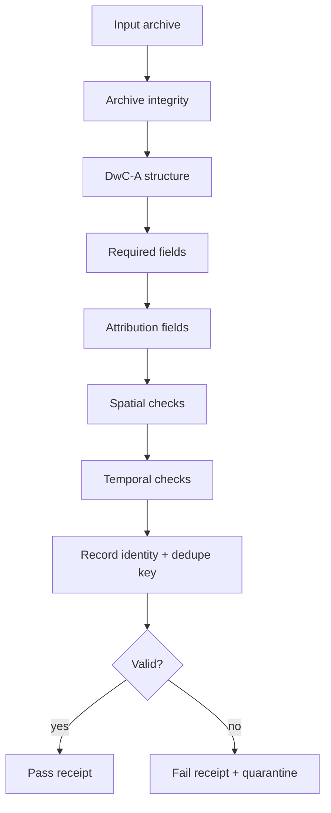

<!-- [KFM_META_BLOCK_V2]
doc_id: kfm://doc/<NEEDS_VERIFICATION_UUID>
title: Flora DwC-A Validator
type: standard
version: v1
status: draft
owners: @bartytime4life
created: <NEEDS_VERIFICATION_CREATED_DATE>
updated: 2026-04-25
policy_label: public
related: [
  ../../../schemas/flora/flora_evidencebundle.schema.json,
  ../../../pipelines/watchers/kansas_flora_watch/README.md,
  ../../../data/quarantine/README.md,
  ../../../data/receipts/README.md,
  ../../../data/catalog/README.md,
  ../README.md,
  ../promotion_gate/README.md
]
tags: [kfm, flora, validator, darwin-core, dwc-a, evidencebundle, fail-closed]
notes: [
  "Validator README for Kansas flora Darwin Core Archive ingestion.",
  "Documents intended validation behavior before bundling.",
  "Does not claim executable validator files exist until branch verification."
]
[/KFM_META_BLOCK_V2] -->

<a id="top"></a>

# Flora DwC-A Validator
Fail-closed validation for Kansas flora Darwin Core Archive inputs before EvidenceBundle assembly.

> **Path:** `tools/validators/flora_dwca_validator/`  
> **Role:** Validate source archives and normalized records before `flora_evidencebundle.schema.json` is emitted.

---

## 🚦 Impact Block

- **Status:** draft  
- **Owners:** @bartytime4life  
- **Badges:**  
    
    
    
  

**Quick links**
- [Scope](#scope) • [Repo fit](#repo-fit) • [Accepted inputs](#accepted-inputs) • [Exclusions](#exclusions)  
- [Validation gates](#validation-gates) • [Failure behavior](#failure-behavior) • [CLI contract](#cli-contract)  
- [Receipts](#receipt-contract) • [Directory tree](#directory-tree) • [Definition of done](#definition-of-done)

---

## Scope

This validator checks **Kansas flora Darwin Core Archive (DwC-A)** inputs before they are normalized into KFM EvidenceBundles.

It is responsible for answering one question:

> Can this flora source be trusted enough to enter the KFM evidence chain?

If the answer is not clearly yes, the validator must return a failing result and produce a receipt.

---

## Repo fit

| Layer | Relationship |
|---|---|
| `pipelines/watchers/kansas_flora_watch/` | Calls this validator before bundling |
| `schemas/flora/flora_evidencebundle.schema.json` | Downstream schema validated after normalization |
| `data/quarantine/` | Receives rejected archives or rejected record batches |
| `data/receipts/` | Stores validation receipts |
| `tools/validators/promotion_gate/` | Later checks promoted bundle/catalog readiness |

This validator sits **before** EvidenceBundle creation. It should reject bad source material early rather than allowing ambiguous records to become evidence.

---

## Accepted inputs

| Input | Required | Notes |
|---|---:|---|
| DwC-A `.zip` archive | yes | Primary validator target |
| `meta.xml` | yes | Describes core and extensions |
| occurrence core table | yes | Usually `occurrence.txt`, but read from `meta.xml` |
| source descriptor reference | yes | Needed for provenance and policy expectations |
| expected source id | yes | Prevents accidental source mixing |
| optional checksum | no | Required when source publishes one |

Accepted source classes:

- Institutional IPT Darwin Core Archives
- GBIF download exports shaped as Darwin Core Archive
- Curated fixture archives for tests

---

## Exclusions

This validator does **not**:

- perform runtime API serving
- render map layers
- decide promotion by itself
- repair source records silently
- generalize sensitive locations without an explicit redaction process
- merge restricted datasets into public outputs

Records that fail mandatory checks belong in quarantine, not in processed evidence.

---

## Validation gates



### Gate 1 — Archive integrity

Fail if:

- archive cannot be opened
- required files listed in `meta.xml` are missing
- core table cannot be decoded
- checksum mismatch occurs when checksum is provided

### Gate 2 — DwC-A structure

Fail if:

- `meta.xml` is missing
- occurrence core cannot be identified
- header mapping cannot be resolved
- row parsing is inconsistent

### Gate 3 — Required flora fields

Minimum required fields:

| Field | Reason |
|---|---|
| `scientificName` | taxonomic claim |
| `basisOfRecord` | evidence type |
| `decimalLatitude` | spatial claim |
| `decimalLongitude` | spatial claim |
| `eventDate` | temporal claim |
| `institutionCode` | specimen/source identity |
| `catalogNumber` | record identity |
| `license` | attribution |
| `rightsHolder` | attribution |
| `datasetID` | dataset identity |

### Gate 4 — Attribution

Fail if any record lacks:

```text
license
rightsHolder
datasetID
```

KFM cannot cite what it cannot attribute.

### Gate 5 — Spatial integrity

Fail if:

- latitude is outside `-90..90`
- longitude is outside `-180..180`
- coordinate fields are non-numeric
- Kansas-only ingest receives non-Kansas coordinates without an explicit source policy

> Kansas bounding enforcement may live in validator code or a policy layer. Final placement **NEEDS VERIFICATION**.

### Gate 6 — Temporal integrity

Fail if:

- `eventDate` is empty
- date cannot be parsed into a known temporal representation
- year is implausible under source policy

### Gate 7 — Record identity and dedupe key

Recommended dedupe key:

```text
institutionCode + catalogNumber + eventDate
```

The validator should emit warnings for duplicate keys inside one archive and hard failures when duplicates make provenance ambiguous.

---

## Failure behavior

This validator is **fail-closed**.

| Condition | Result | Destination |
|---|---|---|
| valid archive | `pass` | downstream normalization |
| recoverable issue | `warning` | receipt + reviewer attention |
| missing mandatory field | `fail` | quarantine |
| malformed archive | `fail` | quarantine |
| restricted/public mismatch | `fail` | quarantine or restricted lane |

Failures must preserve enough context for review without silently mutating evidence.

---

## CLI contract

> Illustrative until executable files are verified.

```bash
python tools/validators/flora_dwca_validator/validate.py \
  --archive data/raw/flora/kanu_ipt/<timestamp>/archive.zip \
  --source-descriptor contracts/source/kansas_flora/kanu_ipt.md \
  --receipt-out data/receipts/flora/<run_id>.validation.json \
  --quarantine-out data/quarantine/flora/<run_id>/
```

Expected exit codes:

| Code | Meaning |
|---:|---|
| `0` | validation passed |
| `1` | validation failed |
| `2` | validator/configuration error |

---

## Receipt contract

Validation receipts should include:

```json
{
  "receipt_type": "flora_dwca_validation",
  "validator_id": "flora_dwca_validator@v1",
  "validated_at": "2026-04-25T00:00:00Z",
  "source_id": "kanu_ipt",
  "archive_ref": "data/raw/flora/kanu_ipt/<timestamp>/archive.zip",
  "result": "pass",
  "reason_codes": [],
  "record_count": 0,
  "failed_record_count": 0,
  "warning_count": 0,
  "spec_hash": null
}
```

> `spec_hash` may be null at this stage if hashing occurs after normalization.

---

## Directory tree

```text
tools/
  validators/
    flora_dwca_validator/
      README.md
      validate.py                 # NEEDS VERIFICATION
      rules.py                    # NEEDS VERIFICATION
      receipts.py                 # NEEDS VERIFICATION
      fixtures/                   # NEEDS VERIFICATION
        valid_minimal_dwca.zip
        missing_license_dwca.zip
        malformed_meta_dwca.zip
      tests/                      # NEEDS VERIFICATION
        test_validate.py
        test_required_fields.py
        test_receipts.py
```

---

## Test matrix

| Fixture | Expected result | Purpose |
|---|---|---|
| valid minimal DwC-A | pass | proves happy path |
| missing `license` | fail | attribution gate |
| missing `datasetID` | fail | dataset identity |
| malformed `meta.xml` | fail | archive structure |
| invalid coordinates | fail | spatial integrity |
| duplicate dedupe key | warning/fail | identity ambiguity |

---

## Definition of Done

- [ ] Validator reads DwC-A using `meta.xml`, not hardcoded table names
- [ ] Required Darwin Core fields enforced
- [ ] Attribution fields enforced record-by-record
- [ ] Spatial and temporal checks implemented
- [ ] Receipts emitted for pass and fail paths
- [ ] Quarantine path receives failed archives/batches
- [ ] Tests cover valid, invalid, malformed, and attribution failure cases
- [ ] Watcher calls validator before EvidenceBundle assembly
- [ ] Promotion Gate can consume validator receipts

---

## Open verification items

| Item | Status |
|---|---|
| Exact executable filename | NEEDS VERIFICATION |
| Exact fixture format and location | NEEDS VERIFICATION |
| Whether Kansas bounds are validator-level or policy-level | NEEDS VERIFICATION |
| Final validator id/version | NEEDS VERIFICATION |
| CI workflow integration | NEEDS VERIFICATION |

---

[Back to top](#top)
