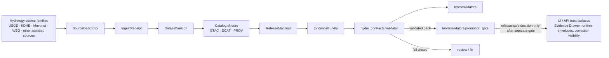

<!-- [KFM_META_BLOCK_V2]
doc_id: kfm://doc/NEEDS-VERIFICATION
title: Hydrology Contract Validation
type: standard
version: v1
status: draft
owners: @bartytime4life
created: YYYY-MM-DD
updated: YYYY-MM-DD
policy_label: TODO-NEEDS-VERIFICATION
related: [../README.md, ../../../docs/domains/hydrology/README.md, ../../../examples/thin_slice/hydrology/, ../../../contracts/README.md, ../../../schemas/README.md, ../../../schemas/contracts/v1/, ../../../policy/README.md, ../../../tests/README.md, ../../../data/catalog/stac/, ../../../data/catalog/dcat/, ../../../data/catalog/prov/, ../../../data/receipts/, ../../../data/proofs/, ../../attest/README.md, ../../catalog/README.md, ../../ci/README.md]
tags: [kfm, validators, hydrology, contracts, thin-slice, fail-closed]
notes: [Target path was provided by the task; direct mounted evidence for this exact subtree was not surfaced in the current session, so this README is doctrine-grounded and repo-fit while exact executable inventory remains NEEDS VERIFICATION.]
[/KFM_META_BLOCK_V2] -->

# Hydrology Contract Validation

Fail-closed, hydrology-first validation guidance for thin-slice KFM contract objects and release-adjacent evidence packs.


> [!IMPORTANT]
> **Status:** experimental  
> **Owners:** `@bartytime4life` *(current `/tools/` subtree owner in adjacent repo-visible docs; finer-grained lane ownership for `hydro_contracts/` still needs branch verification)*  
> **Path:** `tools/validators/hydro_contracts/README.md`  
> **Repo fit:** child surface under [`../README.md`](../README.md); hydrology context in [`../../../docs/domains/hydrology/README.md`](../../../docs/domains/hydrology/README.md); thin-slice example pack in [`../../../examples/thin_slice/hydrology/`](../../../examples/thin_slice/hydrology/); machine schema surface in [`../../../schemas/contracts/v1/`](../../../schemas/contracts/v1/)  
> **Quick jumps:** [Scope](#scope) · [Repo fit](#repo-fit) · [Accepted inputs](#accepted-inputs) · [Exclusions](#exclusions) · [Current evidence snapshot](#current-evidence-snapshot) · [Directory tree](#directory-tree) · [Quickstart](#quickstart) · [Usage](#usage) · [Hydrology contract matrix](#hydrology-contract-matrix) · [Diagram](#diagram) · [Task list](#task-list--definition-of-done) · [FAQ](#faq) · [Appendix](#appendix)

> [!TIP]
> **Current executable snapshot (thin-slice posture)**  
> Direct mounted evidence for `tools/validators/hydro_contracts/` was **not** surfaced in this session. This README therefore documents:
>
> - the lane contract
> - the hydrology-first proof pack this lane should validate
> - the boundary relative to `tools/validators/`, `tools/attest/`, `tools/catalog/`, and promotion gating
> - the smallest useful first slice that can land without pretending broader implementation depth

> [!WARNING]
> KFM’s repo-visible architecture explicitly keeps a live tension between `contracts/` as a lane and `schemas/contracts/` as a machine schema home.  
> This directory should validate the chosen authority surface; it must **not** create a parallel hydrology-only contract universe.

> [!NOTE]
> Passing a hydrology contract validator proves **contract closure and machine-readability**, not hydrologic correctness, publication approval, or live workflow enforcement.

---

## Scope

`tools/validators/hydro_contracts/` is the validator lane for **hydrology-first trust objects**.

Its job is narrow and consequential:

- validate hydrology thin-slice contract objects
- keep source/time/asset identity explicit
- fail closed on malformed or incomplete evidence
- emit stable, reviewer-readable results
- stay read-only and subordinate to upstream schema, policy, and release law

In practice, this lane is the place to validate the hydrology-first proof spine that KFM repeatedly treats as the cleanest first governed slice:

1. `SourceDescriptor`
2. `IngestReceipt`
3. `DatasetVersion`
4. catalog closure across STAC / DCAT / PROV
5. `ReleaseManifest`
6. `EvidenceBundle`

That makes this directory a **validator seam**, not a hydrology ETL surface, not a catalog publisher, and not a hidden promotion shortcut.

[Back to top](#hydrology-contract-validation)

---

## Repo fit

### Path and relationships

| Direction | Surface | Status | Why it matters |
| --- | --- | --- | --- |
| Target lane | `tools/validators/hydro_contracts/` | **Task-provided / NEEDS VERIFICATION** | The target path is explicit in the request, but subtree inventory beyond this README was not independently surfaced. |
| Parent lane | [`../README.md`](../README.md) | **CONFIRMED** | Parent validator doctrine already frames validator work as fail-closed, deterministic, inspectable, and conservative. |
| Domain context | [`../../../docs/domains/hydrology/README.md`](../../../docs/domains/hydrology/README.md) | **CONFIRMED** | Hydrology is the repo-visible public-safe first lane and supplies the domain boundary this validator should serve. |
| Thin-slice example | [`../../../examples/thin_slice/hydrology/`](../../../examples/thin_slice/hydrology/) | **CONFIRMED** | This is the clearest documented first pack to validate end to end. |
| Machine schema surface | [`../../../schemas/contracts/v1/`](../../../schemas/contracts/v1/) | **CONFIRMED** | Shared proof-object schemas belong upstream; this lane should consume them. |
| Authority surfaces | [`../../../contracts/README.md`](../../../contracts/README.md), [`../../../schemas/README.md`](../../../schemas/README.md) | **CONFIRMED tension** | README prose and machine schema authority must not drift apart silently. |
| Policy boundary | [`../../../policy/README.md`](../../../policy/README.md) | **CONFIRMED** | Policy logic remains upstream; this lane may validate inputs to policy, not own policy law. |
| Catalog evidence surfaces | [`../../../data/catalog/stac/`](../../../data/catalog/stac/), [`../../../data/catalog/dcat/`](../../../data/catalog/dcat/), [`../../../data/catalog/prov/`](../../../data/catalog/prov/) | **CONFIRMED** | Hydrology artifacts must stay discoverable and cross-linked, not just structurally valid in isolation. |
| Process-memory / proof boundary | [`../../../data/receipts/`](../../../data/receipts/), [`../../../data/proofs/`](../../../data/proofs/) | **CONFIRMED** | Receipts and proofs remain separate trust surfaces. |
| Neighbor lane | [`../../attest/README.md`](../../attest/README.md) | **CONFIRMED** | Signature generation and verification belong there, even when hydrology validators consume declared attestation state. |
| Neighbor lane | [`../../catalog/README.md`](../../catalog/README.md) | **CONFIRMED** | Cross-link checking is adjacent; this lane should not absorb general catalog helper ownership. |
| Neighbor lane | [`../../ci/README.md`](../../ci/README.md) | **CONFIRMED** | Reviewer rendering and workflow-facing summaries belong there, not here. |
| Downstream proof lane | [`../../../tests/README.md`](../../../tests/README.md) | **CONFIRMED** | Validators should land with narrow, deterministic tests rather than prose-only promises. |

### Working rule

Reach for this lane when the change needs to prove **hydrology contract integrity**.

Do **not** reach for it when the main burden is:

- hydrology ETL or analysis
- catalog rendering
- signature generation or key handling
- policy decision ownership
- workflow choreography
- UI evidence-drawer behavior
- publication itself

[Back to top](#hydrology-contract-validation)

---

## Accepted inputs

Content that belongs here should remain **contract-facing**, **repeatable**, and **safe to review publicly**.

### Typical accepted inputs

| Input family | Typical examples | Keep it here when |
| --- | --- | --- |
| Hydrology thin-slice packs | `examples/thin_slice/hydrology/source_descriptor.json`, `ingest_receipt.json`, `dataset_version.json`, `catalog_closure.json`, `release_manifest.json`, `evidence_bundle.json` | the goal is validating one governed pack rather than running the pipeline |
| Shared schema surfaces | `schemas/contracts/v1/*` | the validator needs machine shape, enum, or required-field pressure |
| Catalog closure docs | STAC / DCAT / PROV refs for one hydrology dataset version | the validator must prove closure rather than render catalogs |
| Safe hydrology fixtures | public-safe station, HUC, or watershed examples | the validator needs stable positive/negative cases |
| Receipt / proof references | `spec_hash`, digests, audit refs, declared bundle refs | the validator must ensure trust objects do not drift apart |
| Geospatial sanity inputs | CRS declarations, geometry refs, bounds, temporal extent metadata | the validator needs structural geospatial checks without becoming scientific QA |
| Domain descriptors | source family, cadence, unit, authority-vs-derived labeling | hydrology meaning depends on explicit source and time semantics |

### Accepted input profile

Use this lane when the validator must answer questions like:

- Is the hydrology pack complete?
- Are the declared objects structurally valid?
- Does the pack distinguish source edge, processed identity, and outward release?
- Is `spec_hash` present where required?
- Do STAC / DCAT / PROV refs line up with the same hydrology subject?
- Are receipts and proofs kept separate?
- Is missing evidence treated as blocking rather than guessed away?

[Back to top](#hydrology-contract-validation)

---

## Exclusions

The following do **not** belong here:

| Do not keep here | Better home | Why |
| --- | --- | --- |
| Raw hydrology payloads or live fetch logic | `data/raw/`, `data/work/`, `src/pipelines/hydrology/` | this lane validates declared objects after acquisition, not the acquisition loop itself |
| Scientific hydrology QA or modeling logic | `docs/analyses/hydrology/`, hydrology pipeline code | contract validation is not the same as runoff, impairment, or anomaly science |
| Signature generation / key material / Rekor handling | [`../../attest/README.md`](../../attest/README.md) | trust-helper ownership should stay explicit |
| General catalog cross-link helpers | [`../../catalog/README.md`](../../catalog/README.md) | this lane may consume catalog closure, but should not own catalog helper law |
| Promotion decisions or release eligibility | `tools/validators/promotion_gate/` | a passing hydro contract check is prerequisite evidence, not the final promote / deny decision |
| Reviewer-summary rendering | [`../../ci/README.md`](../../ci/README.md) | this lane should emit machine-readable output that CI can render elsewhere |
| Workflow ordering, permissions, or branch rules | `../../../.github/workflows/` and workflow docs | orchestration belongs at the gatehouse boundary |
| Canonical schema authority decisions | [`../../../contracts/README.md`](../../../contracts/README.md), [`../../../schemas/README.md`](../../../schemas/README.md) | this lane validates chosen authority; it must not redefine it |
| Sensitive location dumps or unrestricted internal samples | governed secure data surfaces | public tooling must remain safe to clone, inspect, and test |

> [!CAUTION]
> If deleting a helper from `hydro_contracts/` would erase the only understandable explanation of hydrology source authority, publication law, or policy meaning, the helper is carrying too much meaning and should graduate to a stronger governed surface.

[Back to top](#hydrology-contract-validation)

---

## Current evidence snapshot

| Evidence item | Status | How this README uses it |
| --- | --- | --- |
| Hydrology is KFM’s cleanest first governed proof lane | **CONFIRMED** | grounds this directory as hydrology-first rather than generic “domain validators” |
| `examples/thin_slice/hydrology/` exists as a repo-visible example surface | **CONFIRMED** | anchors the first target pack this validator should serve |
| `docs/domains/hydrology/README.md` exists and hydrology spans datasets, pipelines, analyses, Story Nodes, and governance pathways | **CONFIRMED** | keeps the lane tied to the hydrology domain rather than a floating tooling abstraction |
| `schemas/contracts/v1/` contains the first visible machine contract wave | **CONFIRMED** | justifies upstream schema consumption instead of hydrology-local schema reinvention |
| KFM repeatedly calls for a minimal common schema wave and one hydrology thin slice before widening scope | **CONFIRMED** | supports a deliberately small first landed validator slice |
| `tools/validators/` is documented as fail-closed, deterministic, inspectable, scoped, and conservative | **CONFIRMED via adjacent documentation** | sets the operating posture of this README |
| Exact subtree inventory under `tools/validators/hydro_contracts/` | **NEEDS VERIFICATION** | prevents invented helper names from being described as present fact |
| Exact CI callers, workflow wiring, and merge-blocking enforcement for this lane | **UNKNOWN / NEEDS VERIFICATION** | keeps orchestration claims bounded |
| Final schema-home authority choice between `contracts/` and `schemas/contracts/` | **CONFIRMED unresolved tension** | requires this README to stay explicit about upstream authority |
| A signed hydrology station or Mesonet-like promotion path is the recommended first ops proof | **PROPOSED / implementation-facing** | informs the growth path without overstating mounted implementation |

> [!TIP]
> The discipline here is the same one KFM asks of the rest of the system: document the **smallest real validator seam** clearly, then show the next buildable step without upgrading possibility into fact.

[Back to top](#hydrology-contract-validation)

---

## Directory tree

### Target lane and confirmed neighborhood

```text
tools/
└── validators/
    ├── README.md
    └── hydro_contracts/
        └── README.md   # target file; subtree contents beyond this doc remain NEEDS VERIFICATION

docs/
└── domains/
    └── hydrology/
        └── README.md

examples/
└── thin_slice/
    └── hydrology/

schemas/
└── contracts/
    └── v1/

data/
├── catalog/
│   ├── stac/
│   ├── dcat/
│   └── prov/
├── receipts/
└── proofs/
```

> [!NOTE]
> The neighborhood above is the **confirmed seam** this README is designed to fit.  
> It is not proof that additional `hydro_contracts/` executables already exist on the active branch.

### Recommended first landed executable shape

<details>
<summary><strong>PROPOSED thin-slice layout</strong></summary>

```text
tools/validators/hydro_contracts/
├── README.md
├── validate_pack.py
├── validate_source_descriptor.py
├── validate_ingest_receipt.py
├── validate_dataset_version.py
├── validate_catalog_closure.py
├── validate_release_manifest.py
├── validate_evidence_bundle.py
└── fixtures/
    ├── hydrology-pack.pass.json
    └── hydrology-pack.fail.json

tests/validators/
├── test_hydro_contract_pack.py
└── fixtures/
    └── hydrology/
```

Suggested order of implementation:

1. `validate_pack.py`
2. one pack-level positive fixture
3. one missing-object failure fixture
4. one malformed-object failure fixture
5. one narrow unit test proving deterministic failure shape

</details>

[Back to top](#hydrology-contract-validation)

---

## Quickstart

Start by rechecking what is actually mounted before adding helper names to this lane.

### Evidence-first recheck

```bash
# Recheck the parent validator contract
sed -n '1,260p' tools/validators/README.md

# Recheck hydrology domain context and thin-slice example presence
sed -n '1,260p' docs/domains/hydrology/README.md
find examples/thin_slice/hydrology -maxdepth 3 \( -type f -o -type d \) 2>/dev/null | sort

# Reconfirm the upstream schema surface
find schemas/contracts/v1 -maxdepth 3 -type f 2>/dev/null | sort

# Reconfirm adjacent trust surfaces before landing helpers here
find data/catalog/stac data/catalog/dcat data/catalog/prov -maxdepth 3 -type f 2>/dev/null | sort
find data/receipts data/proofs -maxdepth 3 -type f 2>/dev/null | sort

# Reconfirm documentary references before adding validator names
git grep -n "hydrology\|thin_slice/hydrology\|SourceDescriptor\|DatasetVersion\|EvidenceBundle\|ReleaseManifest" -- . || true
```

### Proposed first local run

```bash
# PROPOSED until the executable surface is actually landed
python tools/validators/hydro_contracts/validate_pack.py \
  --input examples/thin_slice/hydrology \
  --output out/hydro-contracts-report.json
```

### Proposed first test run

```bash
# PROPOSED until test paths are checked in
pytest -q tests/validators/test_hydro_contract_pack.py
```

> [!WARNING]
> If the active branch uses different helper names, packages, or test paths, update this README to the **real mounted command** rather than preserving a guessed convention.

[Back to top](#hydrology-contract-validation)

---

## Usage

### 1. Validate the hydrology thin-slice pack

Use this lane first on the **smallest complete pack**, not on a sprawling hydrology subtree.

A good first candidate is one pack containing:

- one `SourceDescriptor`
- one `IngestReceipt`
- one `DatasetVersion`
- one catalog-closure surface or ref set
- one `ReleaseManifest`
- one `EvidenceBundle`

That keeps the validator focused on **coherence** rather than quantity.

### 2. Prefer pack-level reporting over silent file-by-file drift

A pack-level validator should emit one stable report shape that tells reviewers:

- what was checked
- what passed
- what failed
- whether the result is blocking
- which object families or refs were missing or malformed

A small machine-readable shape is usually enough:

```json
{
  "tool": "hydro-contracts",
  "status": "fail",
  "blocking": true,
  "candidate_id": "kfm.hydro.usgs.streamflow.ks",
  "checks": [
    {
      "id": "pack.evidence_bundle_present",
      "result": "fail",
      "message": "EvidenceBundle is required for the reviewed pack."
    }
  ]
}
```

### 3. Keep validator outcomes local to the validator seam

Prefer validator-local outcomes such as:

- `pass`
- `fail`
- `error`

Leave promotion-wide finite outcomes such as `ANSWER`, `ABSTAIN`, `DENY`, and `ERROR` to the promotion gate and other release-facing decision surfaces.

### 4. Keep hydrology-specific checks narrow and explicit

This lane is strongest when hydrology pressure stays **structural** and **declared**:

- source authority family is named
- cadence is explicit
- geometry key is explicit
- units are explicit
- temporal extent exists
- digests / refs exist
- catalog refs align

This lane becomes blurry when it tries to decide whether a discharge value is scientifically credible, whether a drought interpretation is correct, or whether a release should go live.

[Back to top](#hydrology-contract-validation)

---

## Hydrology contract matrix

| Object family | Minimum validator pressure | Hydrology-specific note | Better home for anything broader |
| --- | --- | --- | --- |
| `SourceDescriptor` | source id, source URI, authority/derived posture, spatial scope, time basis, rights / sensitivity fields | distinguish families such as NWIS IV, NWIS DV, WBD HUC12, Mesonet, KDHE, or other source classes explicitly | source onboarding docs / domain docs |
| `IngestReceipt` | input refs, retrieval time, digests, run identity, stage transition evidence | preserve source-edge → RAW / WORK memory without pretending receipt = proof | pipeline run surfaces / receipts lane |
| `DatasetVersion` | dataset id, version identity, temporal extent, geometry key, units/cadence, provenance refs | `site_no`, `huc12`, `PT15M`, `P1D`, `discharge_cfs`, or similar fields should be declared when applicable | canonical schema surface / domain data docs |
| Catalog closure | STAC / DCAT / PROV refs align on one subject and version | hydrologic assets must stay discoverable without ref drift | catalog helper lane |
| `ReleaseManifest` | outward asset inventory, digests, policy state, correction / rollback refs where required | binds public-safe hydrology bytes, not just descriptive prose | release / publish lanes |
| `EvidenceBundle` | evidence refs, freshness basis, audit ref, correction lineage | keeps hydrology claims inspectable at the point of use | proofs lane |
| `RuntimeResponseEnvelope` | only when the hydrology pack also backs a public read surface | runtime accountability is adjacent, not primary here | governed API / runtime proof |
| `CorrectionNotice` | only when the candidate supersedes or narrows prior hydrology output | visible correction is part of trust, not an ops afterthought | correction / rollback surfaces |

### Boundary reminder

A hydrology contract validator should answer:

- “Is the declared object pack coherent?”

It should **not** silently answer:

- “Is this dataset scientifically correct?”
- “Should this release be promoted?”
- “Is this the canonical hydrology interpretation for Kansas?”

[Back to top](#hydrology-contract-validation)

---

## Diagram



> [!IMPORTANT]
> This diagram shows **dependency order**, not proof that every executable hop is already wired on the active branch.

[Back to top](#hydrology-contract-validation)

---

## Task list / Definition of done

A meaningful first landing for this lane is complete when all items below are true.

- [ ] The active branch confirms whether `tools/validators/hydro_contracts/` already exists or is being created now.
- [ ] The README is updated from placeholders to real mounted file names where those names are surfaced.
- [ ] One hydrology thin-slice pack validates deterministically.
- [ ] Missing required object families fail closed with stable machine-readable output.
- [ ] Malformed JSON or schema-invalid objects collapse to an explicit error path.
- [ ] Catalog refs are either validated here narrowly or delegated explicitly to the catalog helper lane.
- [ ] Receipt / proof separation is preserved in both code and fixtures.
- [ ] The validator remains read-only.
- [ ] One local test command and one CI-facing invocation are documented and real.
- [ ] The README still tells the truth if the implementation is smaller than hoped.

### Strong first non-goals

- full hydrology scientific QA
- live source polling
- workflow ownership
- direct publish / promote logic
- signature key handling
- UI rendering

[Back to top](#hydrology-contract-validation)

---

## FAQ

### Does this lane own hydrology science?

No. It owns **contract integrity**, not hydrologic interpretation.  
Scientific plausibility, modeling, and analytic judgment belong to hydrology analyses and pipelines.

### Does a passing hydrology contract validator mean the release can publish?

No. It means the hydrology contract pack is structurally coherent enough to become trustworthy input to downstream review and promotion surfaces.

### Should this lane verify signatures itself?

Prefer consuming declared verification results or delegating to [`../../attest/README.md`](../../attest/README.md).  
Do not quietly turn this lane into the repo’s signing authority.

### Should this lane duplicate catalog cross-link logic?

Only if the hydrology pack truly needs a hydrology-specific closure rule that cannot live cleanly in the general catalog helper surface.  
Default to reuse, not duplication.

[Back to top](#hydrology-contract-validation)

---

## Appendix

<details>
<summary><strong>Illustrative hydrology thin-slice pack</strong> (<code>INFERRED / NEEDS VERIFICATION</code>)</summary>

This is the smallest documented artifact family repeatedly associated with the hydrology-first thin slice.

```text
examples/thin_slice/hydrology/
├── source_descriptor.json
├── ingest_receipt.json
├── dataset_version.json
├── catalog_closure.json
├── release_manifest.json
└── evidence_bundle.json
```

Illustrative field shape for a hydrology dataset version or adjacent pack metadata:

```json
{
  "dataset_id": "kfm.hydro.usgs.streamflow.ks",
  "source": "usgs:nwis:iv",
  "geometry_key": "huc12",
  "time_resolution": "PT15M",
  "fields": [
    "site_no",
    "datetime",
    "discharge_cfs",
    "status"
  ],
  "provenance": {
    "source_uri": "...",
    "retrieved_at": "...",
    "version": "etag/hash"
  }
}
```

Use this as a reviewer-facing orientation aid only until the active branch re-confirms the canonical schema home and the exact checked-in hydrology contract objects.

</details>

<details>
<summary><strong>Open verification items</strong></summary>

Before merging this README as authoritative branch documentation, recheck:

- whether `hydro_contracts/` already contains helpers
- exact helper filenames and runtime language
- whether tests live under `tests/validators/` or another proof lane
- whether catalog closure is delegated to `tools/catalog/`
- whether schema authority is explicitly frozen for this lane
- whether hydrology-specific fixtures already exist under `examples/` or `tests/fixtures/`

</details>

[Back to top](#hydrology-contract-validation)
