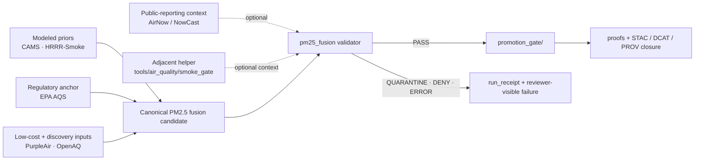

<a id="top"></a>

# `tools/validators/pm25_fusion/`

Fail-closed validation helpers for Kansas PM2.5 fusion candidate packages, source-role-preserving harmonization, and review-ready handoff into downstream KFM promotion lanes.

> [!NOTE]
> **Status:** `experimental`  
> **Document status:** `draft`  
> **Owners:** `@bartytime4life`  
> **Path:** `tools/validators/pm25_fusion/README.md`  
>        
> **Quick jumps:** [Scope](#scope) · [Repo fit](#repo-fit) · [Accepted inputs](#accepted-inputs) · [Exclusions](#exclusions) · [Current public snapshot](#current-public-snapshot) · [Directory tree](#directory-tree) · [Quickstart](#quickstart) · [Usage](#usage) · [Diagram](#diagram) · [Validation surface](#validation-surface) · [Output posture](#output-posture) · [Task list](#task-list--definition-of-done) · [FAQ](#faq) · [Appendix](#appendix)

> [!IMPORTANT]
> Current public branch evidence shows this leaf as a **README-only** directory, and the checked-in `README.md` has been an empty placeholder. This document replaces that placeholder with a narrow lane contract and a conservative starter shape.

> [!WARNING]
> Do **not** flatten **EPA AQS**, **AirNow**, **OpenAQ**, **PurpleAir**, **CAMS**, and **HRRR-Smoke** into one blurred PM2.5 truth surface. This lane should preserve whether a signal is **regulatory**, **public-reporting**, **aggregated/discovery**, **low-cost corrected**, or **modeled prior**.

> [!TIP]
> Keep the KFM trust split visible here:  
> **receipt ≠ proof ≠ catalog ≠ publication**  
> This leaf validates candidate readiness. It does not authorize release on its own.

---

## Scope

`tools/validators/pm25_fusion/` is the validator-facing proof surface for **candidate PM2.5 fusion outputs** that combine multiple air-quality inputs into a reviewable KFM-ready package.

Use this lane when the subject under test is already a **candidate fusion result** and the question is:

> Is this package explicit enough, source-role-safe enough, correction-aware enough, uncertainty-visible enough, and stable enough to advance into governed review without bluffing about air-quality truth?

This leaf is especially appropriate when a candidate package includes some combination of:

- **modeled priors** such as `CAMS` or `HRRR-Smoke`
- **regulatory anchors** from `EPA AQS`
- **public-reporting / NowCast comparison context** from `AirNow`
- **low-cost sensor inputs** from `PurpleAir`
- **aggregated discovery / routing inputs** from `OpenAQ`

### Truth labels used in this README

| Label | Meaning here |
|---|---|
| **CONFIRMED** | Directly supported by current public repo surfaces or controlling attached KFM corpus |
| **INFERRED** | Strongly implied by adjacent repo structure or corpus doctrine, but not directly surfaced as mounted implementation |
| **PROPOSED** | Recommended starter shape, helper layout, or emitted object that fits doctrine but is not directly proven on the public branch |
| **UNKNOWN** | Not verified strongly enough from visible repo or attached corpus |
| **NEEDS VERIFICATION** | Specific item that should be rechecked against the active branch before claiming it as mounted behavior |

This leaf is **not** the place to:

- pull raw source data
- define source-admission law from scratch
- publish signed proofs
- decide policy outcomes for release
- render public AQI
- act as an emergency smoke alert surface

[Back to top](#top)

---

## Repo fit

### Path and neighboring lanes

| Relation | Surface | Status | Why it matters |
|---|---|---|---|
| Parent lane | [`../README.md`](../README.md) | **CONFIRMED** | Establishes validator-wide posture: deterministic checks, fail-closed behavior, and the rule that validators consume receipts without owning receipt storage |
| Adjacent release gate | [`../promotion_gate/README.md`](../promotion_gate/README.md) | **CONFIRMED** | Natural downstream handoff once a PM2.5 candidate passes validator checks |
| Adjacent connector gate | [`../connector_gate/README.md`](../connector_gate/README.md) | **CONFIRMED** | Useful reference when source-admission or source-shape concerns need to stay separate from fusion-result validation |
| Adjacent environmental validator | [`../vegetation_change/README.md`](../vegetation_change/README.md) | **CONFIRMED** | Shows the current public “README-only leaf becomes narrow contract” pattern |
| Adjacent time-series validator | [`../soil_moisture/README.md`](../soil_moisture/README.md) | **CONFIRMED** | Good local precedent for a source- and semantics-heavy environmental validator |
| Adjacent air-quality helper | [`../../air_quality/smoke_gate/README.md`](../../air_quality/smoke_gate/README.md) | **CONFIRMED** | This is the currently surfaced public air-quality gate in `tools/`; PM2.5 fusion validation should stay distinct from smoke-confirmation logic |
| Receipts lane | [`../../../data/receipts/README.md`](../../../data/receipts/README.md) | **CONFIRMED** | `run_receipt` belongs there as process memory, not here as sovereign truth |
| Proof lane | [`../../../data/proofs/README.md`](../../../data/proofs/README.md) | **CONFIRMED** | Release-grade proofs live there, not in this validator leaf |
| Catalog triplet | [`../../../data/catalog/stac/README.md`](../../../data/catalog/stac/README.md) · [`../../../data/catalog/dcat/README.md`](../../../data/catalog/dcat/README.md) · [`../../../data/catalog/prov/README.md`](../../../data/catalog/prov/README.md) | **CONFIRMED** | Discoverability and outward linkage happen there after validation/promotion, not here |
| Policy lane | [`../../../policy/README.md`](../../../policy/README.md) | **CONFIRMED** | Policy decides; this validator should not silently become policy authority |
| Downstream proof lane | [`../../../tests/validators/README.md`](../../../tests/validators/README.md) | **CONFIRMED** | A future test surface can prove this validator’s fail-closed behavior once executable helpers exist |

### Upstream / downstream logic

| Direction | Surface | Status | Reading rule |
|---|---|---|---|
| Upstream | Candidate fusion package from an air-quality build surface | **INFERRED** | Treat candidate inputs as pre-existing and reviewable; do not assume this leaf owns the fusion ETL |
| Side input | Smoke / PM2.5 agreement result from `tools/air_quality/smoke_gate/` | **CONFIRMED** | Optional contextual input; useful, but not a substitute for full PM2.5 fusion validation |
| Downstream | Promotion and release review surfaces | **CONFIRMED** | `promotion_gate` / receipts / proofs / catalogs remain later steps |
| Mentioned in attached corpus | `src/pipelines/air_quality/fusion/` | **PROPOSED / NEEDS VERIFICATION** | Treat as a doctrinally plausible execution surface from the attached PM2.5 fusion packet, not as a confirmed public-main path |

### Why this leaf exists separately from `smoke_gate`

`tools/air_quality/smoke_gate/` answers a narrower question:

> do enough model / satellite / ground indicators agree that a smoke-related PM2.5 event is plausibly happening?

`tools/validators/pm25_fusion/` should answer a different one:

> is a **fusion candidate package** internally coherent, source-role-safe, method-aware, correction-aware, and review-ready?

That difference matters. A smoke gate can be correct while a fusion package is still unfit for promotion because:

- collocation is weak
- AQS methods were silently merged
- PurpleAir variant choice is undocumented
- uncertainty bands are missing
- NowCast drift is too high
- OpenAQ provenance was flattened into false regulatory truth

[Back to top](#top)

---

## Accepted inputs

This leaf should accept **candidate packages**, not vague “air data.”

### Candidate package minimums

| Input | What belongs here | Status |
|---|---|---|
| Candidate identity | `candidate_ref`, `schema_ver`, `spec_hash`, declared support window, and explicit Kansas/public-safe scope | **INFERRED** |
| Source-role declaration | Explicit split among `AQS`, `AirNow`, `OpenAQ`, `PurpleAir`, `CAMS`, `HRRR-Smoke`, plus any other declared source family | **CONFIRMED doctrine** |
| AQS method-aware identity | A series key that keeps `site`, `parameter`, `monitor`, `method`, and `poc` distinguishable | **CONFIRMED doctrine** |
| PurpleAir correction metadata | chosen variant (`CF=1`, `ATM`, or other explicitly named choice), correction family/version, and uncertainty handling | **CONFIRMED doctrine** |
| OpenAQ disposition | provider/source labeling plus a statement of whether OpenAQ is being used only for routing/discovery or as a validated observation input | **CONFIRMED doctrine** |
| Collocation summary | site match or bounded-radius rule, max-hours-apart rule, pair counts per reporting window | **PROPOSED but strongly grounded** |
| Metrics summary | `RMSE`, `MAE`, `R`, and similar point-metric checks against collocated AQS anchors | **PROPOSED but strongly grounded** |
| Uncertainty summary | empirical coverage for nominal `80/90/95%` intervals or equivalent uncertainty calibration surface | **PROPOSED but strongly grounded** |
| NowCast comparison | corrected-series-to-AQS NowCast comparison summary where that comparison is meaningful | **PROPOSED but strongly grounded** |
| Process memory | `run_receipt_ref` and `evidence_refs[]` | **CONFIRMED doctrine** |
| Optional smoke context | reference to `smoke_gate` output or another bounded smoke-context gate | **INFERRED** |

### Suitable first-wave package shapes

Good first-wave subjects for this validator include:

- one bounded Kansas station cohort
- one county or metro slice with explicit collocation rules
- one station-year or station-window summary
- one daily or hourly grid package with explicit review notes
- one review packet carrying metrics, uncertainty, and `run_receipt_ref`

### Minimum semantic visibility

A healthy candidate should keep these visible without hunting through side files:

- what is **observed**
- what is **modeled**
- what is **corrected**
- what is **aggregated**
- what is **compared**
- what is **released later**
- what remained **unknown** at validation time

---

## Exclusions

This leaf does **not** belong to:

- raw AQS / PurpleAir / OpenAQ / CAMS / HRRR-Smoke fetch logic
- source-descriptor authoring for upstream admission
- signature creation or attestation generation
- STAC / DCAT / PROV publication
- smoke-alert issuing
- public AQI rendering
- silent auto-repair of malformed candidate packages
- policy ownership
- final release proof storage

### Explicit anti-patterns

Do not let this leaf:

- treat **OpenAQ** measurements as automatically regulatory-grade
- silently merge distinct **AQS** methods into one “best” series without tagging
- hide the chosen **PurpleAir** variant or correction family
- use **AirNow** public AQI reporting as if it were the same thing as raw regulatory archive rows
- blur **CAMS** and **HRRR-Smoke** into observed ground truth
- collapse **receipt**, **proof**, **catalog**, and **publication** into one file
- imply live workflow, scheduler, or signing maturity that the current branch does not prove

---

## Current public snapshot

| Claim | Status | Notes |
|---|---|---|
| `tools/validators/pm25_fusion/` exists | **CONFIRMED** | Public branch shows the leaf directory |
| Current public inventory is `README.md` only | **CONFIRMED** | No helper files were surfaced in the inspected public tree |
| Checked-in `README.md` was an empty placeholder | **CONFIRMED** | This file replaces that placeholder with a real lane contract |
| `tools/validators/README.md` and multiple sibling validator leaves are already substantive | **CONFIRMED** | The strongest style match comes from `promotion_gate`, `soil_moisture`, and `vegetation_change` |
| `tools/air_quality/smoke_gate/README.md` is the currently surfaced public air-quality helper under `tools/air_quality/` | **CONFIRMED** | PM2.5 fusion validation should complement, not absorb, that helper |
| A dedicated execution surface such as `src/pipelines/air_quality/fusion/` is mounted on current public `main` | **NEEDS VERIFICATION** | Mentioned in the attached PM2.5 fusion packet, but not confirmed in the public branch review |
| A dedicated CI spec path such as `.github/tests/air-quality/README.md` is mounted on current public `main` | **NEEDS VERIFICATION** | Mentioned in the attached CI proposal, not confirmed in the public branch review |

---

## Directory tree

### Current public inventory

```text
tools/validators/pm25_fusion/
└── README.md
```

### Conservative starter shape

> [!NOTE]
> The tree below is a **starter recommendation**, not a claim about current mounted contents.

<details>
<summary>Proposed starter shape</summary>

```text
tools/validators/pm25_fusion/
├── README.md
├── validate_identity.py
├── validate_collocation.py
├── validate_corrections.py
├── validate_uncertainty.py
├── validate_nowcast.py
├── fixtures/
│   ├── pass/
│   ├── quarantine/
│   ├── deny/
│   └── error/
└── reports/
    └── README.md
```

</details>

The naming logic is intentional:

- `identity` checks `spec_hash`, schema, and declared support
- `collocation` checks site/hour pairing rules
- `corrections` checks PurpleAir/OpenAQ/AQS handling
- `uncertainty` checks interval calibration surfaces
- `nowcast` checks declared comparison logic without turning this leaf into a public alert engine

[Back to top](#top)

---

## Quickstart

### Safe inspection commands

These commands are safe because they inspect the currently surfaced branch shape without assuming hidden workflow wiring or unverified subtrees.

```bash
# inspect the exact leaf as the branch exposes it
find tools/validators/pm25_fusion -maxdepth 4 -type f 2>/dev/null | sort

# re-read the local authority surfaces before editing this leaf
sed -n '1,260p' tools/validators/README.md 2>/dev/null || true
sed -n '1,260p' tools/validators/promotion_gate/README.md 2>/dev/null || true
sed -n '1,260p' tools/validators/soil_moisture/README.md 2>/dev/null || true
sed -n '1,260p' tools/validators/vegetation_change/README.md 2>/dev/null || true
sed -n '1,260p' tools/air_quality/smoke_gate/README.md 2>/dev/null || true
sed -n '1,220p' data/receipts/README.md 2>/dev/null || true
sed -n '1,220p' data/proofs/README.md 2>/dev/null || true
sed -n '1,220p' policy/README.md 2>/dev/null || true
sed -n '1,220p' tests/validators/README.md 2>/dev/null || true
```

### Fast drift check

Use this before inventing new field families or renaming source roles casually.

```bash
git grep -n \
  -e 'PM2.5' \
  -e 'pm25' \
  -e 'AQS' \
  -e 'AirNow' \
  -e 'OpenAQ' \
  -e 'PurpleAir' \
  -e 'NowCast' \
  -e 'CAMS' \
  -e 'HRRR-Smoke' \
  -e 'smoke_gate' \
  -e 'spec_hash' \
  -- tools data docs policy tests .github 2>/dev/null || true
```

### Parent-path sanity check

If this branch already contains executable helpers or tests for this leaf, surface them before extending the proposed tree.

```bash
find tools/validators -maxdepth 2 -type f | sort
find tests -maxdepth 3 -type f | grep -E 'pm25|air|fusion' || true
```

---

## Usage

### 1. Preserve source roles before scoring anything

A candidate should make each source family legible before any metric or gate runs.

| Source family | Expected role in this leaf | Working rule |
|---|---|---|
| **EPA AQS** | Regulatory anchor / method-aware observation family | Keep method + monitor identity explicit; do not silently merge unlike series |
| **AirNow** | Public-reporting / NowCast comparison context | Useful for current-condition framing, but not a substitute for method-aware regulatory archive handling |
| **OpenAQ** | Aggregator / discovery / routing surface with mixed provenance | Do not let OpenAQ inherit regulatory trust automatically |
| **PurpleAir** | Low-cost dense sensor family | Store variant choice and correction lineage explicitly |
| **CAMS** | Modeled prior | Useful as prior/context, not observed ground truth |
| **HRRR-Smoke** | Modeled smoke prior | Useful as prior/context, not observed ground truth |

A validator should reject or quarantine candidates that collapse these roles into one unlabeled PM2.5 field.

### 2. Validate candidate identity and replayability

A minimum useful candidate package should expose:

- one deterministic `spec_hash`
- one explicit support window
- one declared schema version
- one bounded spatial support statement
- one stable reference for the candidate under review

A healthy validator leaf should not have to guess:

- what rows or grids were validated
- what window produced the metrics
- which source families were included
- whether the package is hourly, daily, station-based, or gridded

### 3. Validate collocation and temporal alignment

Where collocated AQS comparison is claimed, keep the rule simple and visible:

- exact site match **or**
- bounded nearest-neighbor rule
- explicit max-hours-apart rule
- explicit minimum pair count per reporting window

A package should be easy to quarantine when:

- pair counts are too small
- spatial match rules drift between runs
- the time basis is mixed or undocumented
- comparison windows are declared but not actually satisfied

### 4. Validate corrections and uncertainty

This leaf is a natural place to reject “magic correction” packages.

At minimum, keep visible:

- chosen **PurpleAir** variant
- correction family / version
- uncertainty surface or interval output
- whether uncertainty was empirical, modeled, or missing
- whether corrected output still preserves raw/corrected distinction

A correction path that cannot say **what changed**, **why**, and **with what uncertainty** should not pass cleanly here.

### 5. Validate NowCast consistency without becoming an alert engine

Where the candidate claims a NowCast-aware comparison:

- keep the comparison target explicit
- declare whether AQS-derived NowCast is the anchor
- keep the result as a validation metric, not a public alert decision
- quarantine candidates that exceed declared drift thresholds or fail to report their comparison basis

### 6. Emit a finite validator result

A useful output from this leaf should be finite, machine-readable, and reviewer-visible.

That means:

- no silent pass
- no free-form prose only
- no hidden downgrade from deny to pass
- no “warning but still publish” shortcut inside the validator itself

---

## Diagram



---

## Validation surface

| Check | Why it matters | Obvious fail signals |
|---|---|---|
| Identity & schema | Candidate must be reproducible and bounded | missing `spec_hash`, missing schema version, ambiguous support window |
| Source-role labels | Prevents false flattening of air-quality truth | one unlabeled `pm25` field hiding AQS + AirNow + OpenAQ + PurpleAir + model inputs |
| AQS method-aware identity | Regulatory anchors are not interchangeable by default | method / monitor / `poc` dropped or merged silently |
| PurpleAir variant and correction provenance | Low-cost sensor handling must stay explicit | missing `CF=1` / `ATM` choice, undocumented correction family, no correction uncertainty |
| OpenAQ disposition | Aggregator provenance must remain visible | OpenAQ measurement treated as automatically regulatory-grade |
| Collocation & alignment | Metrics must rest on a declared comparison rule | no match rule, no radius, no hours-apart rule, insufficient pairs |
| Point metrics | Gives a compact trust signal against collocated AQS | absent or weak `RMSE`, `MAE`, `R` summaries |
| Uncertainty calibration | Prevents decorative confidence intervals | nominal 80/90/95% coverage unreported or obviously off-threshold |
| NowCast consistency | Keeps short-term current-condition comparison grounded | AQS NowCast comparison missing despite candidate claiming it |
| Receipt linkage | Validation must preserve machine-readable process memory | no `run_receipt_ref`, no evidence links, no candidate lineage |
| Finite result surface | Reviewers need bounded machine outcomes | prose-only output, no status enum, no reason codes |

### Recommended first quarantine triggers

- missing source-role declaration
- missing AQS method identity
- missing PurpleAir variant
- undocumented OpenAQ disposition
- no collocation rule
- too few comparison pairs
- absent uncertainty bounds where uncertainty is claimed
- undocumented NowCast comparison basis
- missing `run_receipt_ref`
- candidate package that implies publication from validator success alone

[Back to top](#top)

---

## Output posture

This leaf should emit a **validator result**, not a release decision.

### Working finite outcomes

| Outcome | Meaning | Typical next move |
|---|---|---|
| `PASS` | Candidate is coherent enough for downstream governed review | hand off to [`../promotion_gate/README.md`](../promotion_gate/README.md) |
| `QUARANTINE` | Candidate is potentially useful but semantically unsafe or incomplete | hold for review, repair, or narrower scope |
| `DENY` | Candidate fails a non-negotiable validation rule | stop handoff |
| `ERROR` | Validator could not evaluate safely | stop and inspect runtime/problem surface |

### Illustrative result shape

> [!NOTE]
> The shape below is **illustrative only**.  
> It makes the contract concrete without pretending that current public `main` already ships this exact schema.

```json
{
  "validator_id": "pm25_fusion_v1",
  "status": "QUARANTINE",
  "candidate_ref": "NEEDS-VERIFICATION",
  "spec_hash": "sha256:NEEDS-VERIFICATION",
  "reason_codes": [
    "MISSING_PA_VARIANT",
    "NOWCAST_DRIFT_HIGH"
  ],
  "metrics": {
    "rmse": 8.4,
    "mae": 5.1,
    "r": 0.82,
    "coverage_p90": 0.71,
    "nowcast_median_abs_pct_diff": 0.27
  },
  "source_roles": {
    "aqs": "regulatory_anchor",
    "airnow": "public_reporting_context",
    "openaq": "aggregated_discovery",
    "purpleair": "lowcost_corrected",
    "cams": "modeled_prior",
    "hrrr_smoke": "modeled_prior"
  },
  "run_receipt_ref": "receipt://NEEDS-VERIFICATION",
  "evidence_refs": [
    "evidence://NEEDS-VERIFICATION"
  ]
}
```

### Output boundary

A validator result here is:

- machine-readable
- review-visible
- subordinate to later policy / proof / catalog steps

It is **not**:

- a signed proof bundle
- a catalog record
- a release manifest
- a public AQI statement

---

## Task list / definition of done

- [ ] The leaf stays truthful about current public branch shape
- [ ] Source roles are explicit and non-flattened
- [ ] `AQS`, `AirNow`, `OpenAQ`, `PurpleAir`, `CAMS`, and `HRRR-Smoke` each carry a visible role
- [ ] AQS method identity stays explicit
- [ ] PurpleAir variant and correction lineage stay explicit
- [ ] Metrics and uncertainty thresholds live outside prose-only description
- [ ] One valid fixture and one invalid fixture exist for a named failure reason
- [ ] Validator output is finite and machine-readable
- [ ] Success in this leaf does not imply automatic publication
- [ ] Downstream proof, policy, and catalog surfaces remain separate

---

## FAQ

### Why not just validate one blended PM2.5 field?

Because KFM doctrine treats source roles as load-bearing. A blended field without role visibility makes it too easy to confuse regulatory archive, public-reporting surface, low-cost correction, modeled prior, and aggregator discovery into one persuasive but weakly grounded output.

### Why keep `smoke_gate` separate from `pm25_fusion`?

Because they answer different questions. `smoke_gate` is a narrow event-confirmation helper. `pm25_fusion` should validate the integrity and review readiness of a fusion candidate package.

### Does `PASS` mean “publish”?

No. It means the package can move to a downstream governed handoff. Publication, signing, catalog closure, and public rendering remain later steps.

### Why treat OpenAQ cautiously?

Because it is an aggregator with mixed provenance. It can be extremely useful for discovery and breadth, but this leaf should not let an OpenAQ measurement inherit regulatory-grade authority automatically.

### Why does AQS need method-aware identity?

Because method, monitor, and `poc` differences matter. A validator that flattens them away can make later metrics look cleaner than the underlying evidence justifies.

---

## Appendix

### Open verification items

| Item | Current status | Why it remains open |
|---|---|---|
| Exact executable inventory under this leaf | **NEEDS VERIFICATION** | Public branch surfaced only `README.md` |
| Mounted path for PM2.5 fusion execution | **NEEDS VERIFICATION** | Attached corpus proposes an execution surface, but current public branch parity was not confirmed |
| Canonical schema filename for validator outputs | **UNKNOWN** | No checked-in schema file was surfaced for this leaf |
| Canonical metrics-config location | **UNKNOWN** | Attached CI proposal mentions one, but current public branch parity was not confirmed |
| Downstream tests that call this leaf | **NEEDS VERIFICATION** | No public-main PM2.5 validator test inventory was surfaced |
| Workflow caller / CI hook | **NEEDS VERIFICATION** | Current public branch inspection did not prove a mounted PM2.5 fusion validator workflow |

### Smallest credible next move

Add the smallest real pair first:

1. one **valid** candidate fixture
2. one **invalid** candidate fixture named by failure reason

That is a better first proof than inventing a large subtree with no executable pressure behind it.

[Back to top](#top)
