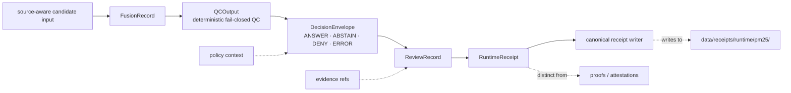

<!-- [KFM_META_BLOCK_V2]
doc_id: kfm://doc/tools-validators-pm25-fusion-readme
title: tools/validators/pm25_fusion
type: standard
version: v1
status: draft
owners: @bartytime4life
created: NEEDS_VERIFICATION__YYYY-MM-DD
updated: 2026-04-17
policy_label: public
related: [
  ../README.md,
  ../promotion_gate/README.md,
  ../connector_gate/README.md,
  ../soil_moisture/README.md,
  ../vegetation_change/README.md,
  ../../air_quality/smoke_gate/README.md,
  ../../../contracts/README.md,
  ../../../contracts/pm25/README.md,
  ../../../policy/README.md,
  ../../../schemas/README.md,
  ../../../schemas/pm25/fusion-record.schema.json,
  ../../../schemas/pm25/qc-output.schema.json,
  ../../../schemas/pm25/review-record.schema.json,
  ../../../schemas/pm25/runtime-receipt.schema.json,
  ../../../data/receipts/README.md,
  ../../../data/receipts/runtime/pm25/README.md,
  ../../../data/proofs/README.md,
  ../../../tests/validators/README.md,
  ../../../tests/e2e/runtime_proof/pm25/README.md,
  ../../../scripts/README.md,
  ../../../scripts/pm25_runtime_receipt.py
]
tags: [kfm, tools, validators, pm25, fusion, runtime-receipt, review-record, qc]
notes: [
  Updated to align this lane README with the concrete PM2.5 validator, schema, decision-envelope, review-record, runtime-receipt, and receipt-writer chain.
  created still requires git-history verification.
  Active branch inventory should be rechecked before upgrading any proposed implementation detail to confirmed branch truth.
]
-->

<a id="top"></a>

# `tools/validators/pm25_fusion/`

Fail-closed validation helpers for Kansas PM2.5 fusion records, deterministic QC, request-time decision mapping, review-ready runtime context, and canonical receipt writing.

> [!NOTE]
> **Status:** `draft`  
> **Lane posture:** `fail-closed`  
> **Owners:** `@bartytime4life`  
> **Path:** `tools/validators/pm25_fusion/README.md`  
>         
> **Quick jumps:** [Scope](#scope) · [Repo fit](#repo-fit) · [Accepted inputs](#accepted-inputs) · [Exclusions](#exclusions) · [Current public snapshot](#current-public-snapshot) · [Directory tree](#directory-tree) · [Quickstart](#quickstart) · [Usage](#usage) · [Artifact chain](#artifact-chain) · [Diagram](#diagram) · [Validation surface](#validation-surface) · [Output posture](#output-posture) · [CLI and receipt writing](#cli-and-receipt-writing) · [Task list](#task-list--definition-of-done) · [FAQ](#faq) · [Appendix](#appendix)

> [!IMPORTANT]
> This lane validates PM2.5 candidate records and request-time trust objects.  
> It does **not** authorize publication, own policy, replace contract authority, or silently repair malformed inputs.

> [!WARNING]
> Do **not** flatten **EPA AQS**, **AirNow**, **OpenAQ**, and **PurpleAir** into one blurred PM2.5 truth surface.  
> This lane should preserve whether a signal is **regulatory**, **public-reporting**, **aggregated/discovery**, **low-cost corrected**, or **request-time derived**.

> [!TIP]
> Keep the KFM trust split visible here:  
> **runtime response ≠ review record ≠ receipt ≠ proof ≠ publication**  
> This leaf validates and projects request-time trust objects. It does not make release law on its own.

---

## Scope

`tools/validators/pm25_fusion/` is the PM2.5 validator-facing lane for:

- deterministic PM2.5 record QC
- request-time decision mapping
- reviewer-facing review-record construction
- runtime receipt construction
- schema validation
- canonical receipt writing

Use this lane when the subject under test is already a **candidate PM2.5 fusion record or runtime receipt path** and the question is:

> Is this PM2.5 record or runtime artifact explicit enough, source-role-safe enough, correction-aware enough, and bounded enough to advance into governed runtime or review flow without bluffing?

This lane is especially appropriate when the path includes some combination of:

- **regulatory anchors** from `EPA AQS`
- **public-reporting / NowCast context** from `AirNow`
- **low-cost sensor inputs** from `PurpleAir`
- **aggregated discovery inputs** from `OpenAQ`
- **runtime audit context** such as `audit_ref`, `bundle_ref`, `release_ref`, or `freshness`

### Truth labels used in this README

| Label | Meaning here |
|---|---|
| **CONFIRMED** | Directly supported by current repo-adjacent docs or by the concrete PM2.5 validator/schema chain this leaf documents |
| **INFERRED** | Strongly implied by adjacent repo structure or doctrine, but not directly surfaced as mounted implementation on public `main` |
| **PROPOSED** | Recommended starter shape, helper layout, or emitted object that fits doctrine but is not directly proven on the public branch |
| **UNKNOWN** | Not verified strongly enough from visible repo or corpus |
| **NEEDS VERIFICATION** | Specific item that should be rechecked against the active branch before claiming it as mounted behavior |

This leaf is **not** the place to:

- pull raw source data
- define source-admission law from scratch
- publish signed proofs
- decide policy outcomes for release
- render public AQI
- act as an emergency smoke alert surface

[Back to top](#top)

---

## Repo fit

### Path and neighboring lanes

| Relation | Surface | Status | Why it matters |
|---|---|---|---|
| Parent lane | [`../README.md`](../README.md) | **CONFIRMED** | Establishes validator-wide posture: deterministic checks, fail-closed behavior, and the rule that validators consume receipts without owning receipt storage |
| Adjacent release gate | [`../promotion_gate/README.md`](../promotion_gate/README.md) | **CONFIRMED** | Natural downstream handoff once PM2.5 validation results are projected into reviewable runtime or promotion contexts |
| Adjacent connector gate | [`../connector_gate/README.md`](../connector_gate/README.md) | **CONFIRMED** | Useful when source-admission or source-shape concerns need to stay separate from PM2.5 record validation |
| Adjacent environmental validator | [`../vegetation_change/README.md`](../vegetation_change/README.md) | **CONFIRMED** | Local precedent for a source- and semantics-heavy environmental validator |
| Adjacent time-series validator | [`../soil_moisture/README.md`](../soil_moisture/README.md) | **CONFIRMED** | Good precedent for bounded environmental validation surfaces |
| Adjacent air-quality helper | [`../../air_quality/smoke_gate/README.md`](../../air_quality/smoke_gate/README.md) | **CONFIRMED** | PM2.5 fusion validation should stay distinct from smoke-confirmation logic |
| PM2.5 contracts | [`../../../contracts/pm25/README.md`](../../../contracts/pm25/README.md) | **CONFIRMED** | Contract note for PM2.5 record, QC, review-record, and runtime-receipt surfaces |
| PM2.5 schemas | [`../../../schemas/pm25/`](../../../schemas/pm25/) | **CONFIRMED** | Canonical machine-shape authority lives in schemas, not in validator prose |
| Receipts lane | [`../../../data/receipts/README.md`](../../../data/receipts/README.md) | **CONFIRMED** | Runtime receipts belong there as process memory, not here as sovereign truth |
| PM2.5 receipt subtree | [`../../../data/receipts/runtime/pm25/README.md`](../../../data/receipts/runtime/pm25/README.md) | **CONFIRMED** | Canonical storage pattern for PM2.5 runtime receipts |
| Proof lane | [`../../../data/proofs/README.md`](../../../data/proofs/README.md) | **CONFIRMED** | Release-grade proofs live there, not in this validator leaf |
| Policy lane | [`../../../policy/README.md`](../../../policy/README.md) | **CONFIRMED** | Policy decides; this validator should not silently become policy authority |
| Downstream proof lane | [`../../../tests/validators/README.md`](../../../tests/validators/README.md) | **CONFIRMED** | A future or active test surface can prove this validator’s fail-closed behavior |
| Runtime-proof lane | [`../../../tests/e2e/runtime_proof/pm25/README.md`](../../../tests/e2e/runtime_proof/pm25/README.md) | **CONFIRMED** | Request-time PM2.5 runtime proof is downstream of this validator surface |
| Thin orchestration | [`../../../scripts/pm25_runtime_receipt.py`](../../../scripts/pm25_runtime_receipt.py) | **CONFIRMED** | Keeps orchestration outside the validator lane |

### Upstream / downstream logic

| Direction | Surface | Status | Reading rule |
|---|---|---|---|
| Upstream | Candidate PM2.5 record or receipt-candidate payload | **CONFIRMED** | Treat candidate inputs as pre-existing and reviewable; do not assume this leaf owns ingestion ETL |
| Side input | Smoke / PM2.5 agreement result from `tools/air_quality/smoke_gate/` | **INFERRED** | Optional contextual input; useful, but not a substitute for PM2.5 QC or runtime receipt validation |
| Downstream | Runtime proof, promotion review, and receipt storage surfaces | **CONFIRMED** | Validation and request-time trust projection happen here; publication and proofs remain later steps |

### Why this leaf exists separately from `smoke_gate`

`tools/air_quality/smoke_gate/` answers a narrower question:

> do enough indicators agree that a smoke-related PM2.5 event is plausibly happening?

`tools/validators/pm25_fusion/` should answer a different one:

> is a PM2.5 record or request-time PM2.5 trust object internally coherent, source-role-safe, fail-closed, and review-ready?

That difference matters. A smoke gate can be correct while a PM2.5 record or runtime receipt is still unfit because:

- cluster consensus is weak
- AQS comparison is missing or poorly bounded
- PurpleAir correction posture is undocumented
- uncertainty or freshness is missing
- review record and outward runtime response are collapsed together
- receipt storage is treated as proof authority

[Back to top](#top)

---

## Accepted inputs

This leaf should accept **bounded PM2.5 machine objects**, not vague “air data.”

### Accepted machine objects

| Input | What belongs here | Status |
|---|---|---|
| Fusion record | hour-aligned PM2.5 candidate record with source identity, QC flag, and raw vs corrected values | **CONFIRMED** |
| QC context | RH, cadence, missingness, neighbor support, stale windows, z-score persistence, evidence refs | **CONFIRMED** |
| QC output | finite QC result with reasons and evidence refs | **CONFIRMED** |
| Runtime decision context | cluster consensus, policy-denied flag, obligations, scope, bundle/release/audit refs, freshness | **CONFIRMED** |
| Review record | reviewer-facing runtime explanation with reasons, obligations, and evidence refs | **CONFIRMED** |
| Runtime receipt | paired decision-envelope + review-record process-memory object | **CONFIRMED** |
| Schema target | PM2.5 schema file used for artifact validation | **CONFIRMED** |
| Optional smoke context | reference to `smoke_gate` output or similar bounded context | **INFERRED** |

### Candidate package minimums

| Input | What belongs here |
|---|---|
| Candidate identity | `sensor_id`, `network`, `local_time`, declared source URI |
| PM2.5 values | `pm25_raw`, `pm25_nowcast`, optional `zscore_vs_aqs` |
| QC state | `qc_flag`, deterministic reasons, evidence refs |
| Runtime trust cues | `outcome`, `reason`, `obligations`, `scope`, `bundle_ref`, `release_ref`, `audit_ref`, `freshness` |
| Review context | `review_status`, `decision_outcome`, `summary`, `policy_state`, `policy_reason` |
| Process memory | `kind = pm25_runtime_receipt` and canonical receipt path eligibility |

### Suitable first-wave subjects

Good first-wave subjects for this validator include:

- one clean `FusionRecord` that passes deterministic QC
- one low-confidence consensus failure
- one RH suppression case
- one stale case
- one `ANSWER` runtime receipt
- one `ABSTAIN` runtime receipt
- one fail-closed schema violation

### Minimum semantic visibility

A healthy candidate should keep these visible without hunting through side files:

- what is **regulatory**
- what is **public-reporting context**
- what is **low-cost corrected**
- what is **aggregated/discovery**
- what is **outward runtime response**
- what is **reviewer-facing runtime context**
- what is **process memory**
- what remains **higher-order proof outside this lane**

[Back to top](#top)

---

## Exclusions

This leaf does **not** belong to:

- raw AQS / PurpleAir / OpenAQ fetch logic
- source-descriptor authoring for upstream admission
- signature creation or attestation generation
- STAC / DCAT / PROV publication
- smoke-alert issuing
- public AQI rendering
- silent auto-repair of malformed candidate packages
- policy ownership
- final release proof storage

### Explicit anti-patterns

Do not let this leaf:

- treat **OpenAQ** measurements as automatically regulatory-grade
- silently merge distinct **AQS** semantics into one unlabeled truth field
- hide the chosen **PurpleAir** variant or correction family when such data are part of the candidate context
- use **AirNow** public AQI reporting as if it were the same thing as regulatory archive truth
- collapse **receipt**, **review record**, **proof**, **catalog**, and **publication** into one file
- imply live workflow, scheduler, or signing maturity that the current branch does not prove
- turn validator success into automatic publication

[Back to top](#top)

---

## Current public snapshot

| Claim | Status | Notes |
|---|---|---|
| `tools/validators/pm25_fusion/` exists | **CONFIRMED** | Public branch shows the leaf directory |
| Earlier public inventory was `README.md` only | **CONFIRMED** | This lane was previously represented as a placeholder-style leaf |
| This README now documents a fuller PM2.5 validator chain | **CONFIRMED** | The lane contract includes QC, runtime projection, review record, receipt, schema validation, and receipt writing |
| `tools/validators/README.md` and multiple sibling validator leaves are already substantive | **CONFIRMED** | Strong local style match comes from `promotion_gate`, `soil_moisture`, and `vegetation_change` |
| `tools/air_quality/smoke_gate/README.md` is the surfaced air-quality helper under `tools/air_quality/` | **CONFIRMED** | PM2.5 fusion validation should complement, not absorb, that helper |
| Exact mounted helper-file inventory for this leaf on the active branch | **NEEDS VERIFICATION** | Recheck the active branch before claiming all proposed files are already present |

[Back to top](#top)

---

## Directory tree

### Current visible lane contract

```text
tools/validators/pm25_fusion/
└── README.md
```

### Expected lane shape for the PM2.5 chain

> [!NOTE]
> The tree below reflects the concrete PM2.5 validator chain this README is written to support.  
> Recheck active branch contents before treating every path as already mounted truth.

```text
tools/validators/pm25_fusion/
├── README.md
├── __init__.py
├── types.py
├── validator.py
├── runtime_types.py
├── runtime_mapper.py
├── review_record.py
├── receipt_builder.py
├── schema_validate.py
├── receipt_writer.py
├── cli.py
└── cli_write_receipt.py
```

### Naming logic

- `types.py` defines bounded PM2.5 record and QC dataclasses
- `validator.py` performs deterministic QC
- `runtime_mapper.py` projects QC into finite runtime outcomes
- `review_record.py` builds reviewer-facing runtime context
- `receipt_builder.py` pairs decision + review into process memory
- `schema_validate.py` fail-closes on malformed artifacts
- `receipt_writer.py` persists canonical PM2.5 runtime receipts
- `cli.py` validates JSON artifacts against schemas
- `cli_write_receipt.py` validates and writes receipts into canonical storage

[Back to top](#top)

---

## Quickstart

### Safe inspection commands

These commands are safe because they inspect the currently surfaced branch shape without assuming hidden workflow wiring.

```bash
# inspect the exact leaf as the branch exposes it
find tools/validators/pm25_fusion -maxdepth 4 -type f 2>/dev/null | sort

# re-read local authority surfaces before editing this leaf
sed -n '1,260p' tools/validators/README.md 2>/dev/null || true
sed -n '1,260p' tools/validators/promotion_gate/README.md 2>/dev/null || true
sed -n '1,260p' tools/validators/soil_moisture/README.md 2>/dev/null || true
sed -n '1,260p' tools/validators/vegetation_change/README.md 2>/dev/null || true
sed -n '1,260p' tools/air_quality/smoke_gate/README.md 2>/dev/null || true
sed -n '1,220p' contracts/pm25/README.md 2>/dev/null || true
sed -n '1,220p' schemas/pm25/fusion-record.schema.json 2>/dev/null || true
sed -n '1,220p' schemas/pm25/qc-output.schema.json 2>/dev/null || true
sed -n '1,220p' schemas/pm25/review-record.schema.json 2>/dev/null || true
sed -n '1,220p' schemas/pm25/runtime-receipt.schema.json 2>/dev/null || true
sed -n '1,220p' data/receipts/runtime/pm25/README.md 2>/dev/null || true
sed -n '1,220p' tests/e2e/runtime_proof/pm25/README.md 2>/dev/null || true
```

### Fast drift check

Use this before inventing new field families or renaming source roles casually.

```bash
git grep -n \
  -e 'PM2.5' \
  -e 'pm25' \
  -e 'AQS' \
  -e 'AirNow' \
  -e 'OpenAQ' \
  -e 'PurpleAir' \
  -e 'ReviewRecord' \
  -e 'runtime_receipt' \
  -e 'audit_ref' \
  -e 'bundle_ref' \
  -e 'ABSTAIN' \
  -e 'DENY' \
  -e 'ERROR' \
  -- tools data docs policy tests schemas contracts scripts 2>/dev/null || true
```

### Parent-path sanity check

If this branch already contains executable helpers or tests for this leaf, surface them before extending the lane further.

```bash
find tools/validators -maxdepth 2 -type f | sort
find tests -maxdepth 5 -type f | grep -E 'pm25|air|fusion|runtime_receipt' || true
```

[Back to top](#top)

---

## Usage

### 1. Validate deterministic PM2.5 QC first

A candidate `FusionRecord` should be checked through deterministic QC before any runtime projection.

Core hard-suppression burdens include:

- RH suppression threshold
- cadence suppression
- missingness suppression
- abrupt uncorroborated jump suppression

Core later-stage burdens include:

- stale detection
- cluster consensus
- benchmark sanity

A validator should fail closed when record-level trust is weak.

### 2. Preserve source roles before projecting runtime outcomes

A candidate should make each source family legible before any decision envelope is emitted.

| Source family | Expected role in this leaf | Working rule |
|---|---|---|
| **EPA AQS** | regulatory anchor | do not silently flatten it into the same role as other inputs |
| **AirNow** | public-reporting / NowCast context | useful for runtime context, not a substitute for regulatory archival semantics |
| **OpenAQ** | aggregator / discovery surface | do not let OpenAQ inherit regulatory trust automatically |
| **PurpleAir** | low-cost corrected or low-cost contextual surface | keep correction posture explicit when present |

A validator or mapper should reject or abstain on candidates that collapse these roles into one unlabeled PM2.5 claim.

### 3. Project only finite runtime outcomes

Where request-time trust projection is needed, keep the split simple and finite:

- `ANSWER`
- `ABSTAIN`
- `DENY`
- `ERROR`

A useful runtime mapper should not invent a fifth outcome or hide abstention behind fluent prose.

### 4. Keep reviewer-facing context separate from outward runtime response

A `ReviewRecord` should preserve:

- review status
- decision outcome
- QC flag
- reasons
- obligations
- evidence refs
- policy state
- policy reason

A `ReviewRecord` is not the same thing as the outward runtime response.

### 5. Keep runtime receipts as process memory

A PM2.5 runtime receipt should pair:

- `decision_envelope`
- `review_record`

and store them as process memory under canonical receipt storage.

It should not be treated as:

- release proof
- catalog record
- publication manifest

### 6. Fail closed on malformed artifacts

Schema validation should stop malformed artifacts before they drift downstream.

This includes:

- invalid enum values
- missing required fields
- malformed top-level runtime receipt shape
- wrong receipt kind
- unexpected overwrite attempts for canonical receipt storage

[Back to top](#top)

---

## Artifact chain

This lane sits in the middle of a bounded PM2.5 request-time trust path.

| Stage | Artifact | Home | Role |
|---|---|---|---|
| normalized input | `FusionRecord` | `schemas/pm25/fusion-record.schema.json` | minimal hour-aligned PM2.5 record |
| deterministic QC | `QCOutput` | `schemas/pm25/qc-output.schema.json` | fail-closed validation result |
| runtime projection | decision envelope | runtime mapper output | outward finite runtime outcome |
| reviewer view | `ReviewRecord` | `schemas/pm25/review-record.schema.json` | reviewer-readable explanation |
| process memory | runtime receipt | `schemas/pm25/runtime-receipt.schema.json` | paired decision + review context |
| storage | canonical receipt path | `data/receipts/runtime/pm25/` | replay, audit, correction-ready process memory |

### Boundary rule

> **runtime response ≠ review record ≠ receipt ≠ proof**

This validator lane may help construct and validate those artifacts. It does not collapse them into one trust object.

[Back to top](#top)

---

## Diagram



[Back to top](#top)

---

## Validation surface

| Check | Why it matters | Obvious fail signals |
|---|---|---|
| Fusion record schema | Candidate must be reproducible and bounded | missing required fields, invalid `qc_flag`, malformed hour stamp |
| Deterministic QC | Record-level trust must fail closed | RH too high, cadence too slow, missingness too high, uncorroborated jump |
| Cluster consensus | Single-record success is not enough for triggering action | consensus absent, no colocated stronger evidence |
| Benchmark sanity | Prevents prolonged divergence from stronger anchors | sustained high `zscore_vs_aqs` without downgrade |
| Runtime projection | Keeps request-time outcomes finite | invalid QC state, malformed outcome, hidden abstention |
| Review-record shape | Reviewer-facing explanation must remain machine-readable | missing `review_status`, missing reasons, invalid `policy_state` |
| Runtime receipt shape | Process memory must remain bounded and paired | missing `kind`, malformed `decision_envelope`, malformed `review_record` |
| Receipt writing | Canonical storage must be deterministic and fail-closed | wrong kind, invalid schema, unsafe overwrite |

### Recommended first fail-closed cases

- invalid `qc_flag`
- missing `kind` in runtime receipt
- invalid `policy_state`
- low-confidence record with vegetation gate requested
- `OK` QC but missing cluster consensus
- wrong receipt kind
- overwrite attempt without explicit permission

[Back to top](#top)

---

## Output posture

This leaf should emit **validator and runtime trust objects**, not a release decision.

### Working finite outcomes

| Outcome | Meaning | Typical next move |
|---|---|---|
| `PASS` | Record or artifact is coherent enough for downstream use | continue to runtime proof or downstream review |
| `QUARANTINE` | Candidate is potentially useful but semantically unsafe or incomplete | hold for review, repair, or narrower scope |
| `DENY` | Candidate or request path fails a non-negotiable rule | stop handoff |
| `ERROR` | Validator could not evaluate safely | stop and inspect problem surface |

### Runtime-facing outcomes

| Runtime outcome | Meaning |
|---|---|
| `ANSWER` | sufficient PM2.5 evidence under deterministic rules |
| `ABSTAIN` | insufficient, stale, weak, or downgraded evidence |
| `DENY` | policy or explicit trust violation |
| `ERROR` | malformed runtime artifact or technical failure |

### Illustrative runtime receipt shape

```json
{
  "kind": "pm25_runtime_receipt",
  "decision_envelope": {
    "outcome": "ABSTAIN",
    "reason": "Insufficient PM2.5 evidence for triggering action: qc_flag=LOW_CONFIDENCE",
    "obligations": [
      "fallback-to-stronger-evidence-or-abstain"
    ],
    "scope": {
      "domain": "air-quality"
    },
    "bundle_ref": "bundle://pm25/example",
    "release_ref": null,
    "audit_ref": "audit://pm25/example",
    "freshness": "current"
  },
  "review_record": {
    "review_status": "WARN",
    "decision_outcome": "ABSTAIN",
    "qc_flag": "LOW_CONFIDENCE",
    "summary": "PM2.5 runtime decision=ABSTAIN; qc_flag=LOW_CONFIDENCE; cluster_consensus=False; vegetation_gate_requested=True",
    "reasons": [
      "Cluster consensus not satisfied",
      "Insufficient PM2.5 evidence for triggering action: qc_flag=LOW_CONFIDENCE"
    ],
    "obligations": [
      "fallback-to-stronger-evidence-or-abstain",
      "do-not-close-vegetation-gate-on-this-evidence-alone"
    ],
    "evidence_refs": [
      "receipt://pm25/run-example"
    ],
    "bundle_ref": "bundle://pm25/example",
    "release_ref": null,
    "audit_ref": "audit://pm25/example",
    "scope": {
      "domain": "air-quality"
    },
    "freshness": "current",
    "policy_state": "NOT_DENIED",
    "policy_reason": null
  }
}
```

### Output boundary

Artifacts from this leaf are:

- machine-readable
- review-visible
- subordinate to later policy / proof / catalog steps

They are **not**:

- signed proof bundles
- catalog records
- release manifests
- public AQI statements

[Back to top](#top)

---

## CLI and receipt writing

This lane may expose two bounded CLIs:

### 1. Schema validation CLI

Validates a JSON artifact against a canonical PM2.5 schema.

```bash
python -m tools.validators.pm25_fusion.cli \
  --artifact tests/e2e/runtime_proof/pm25/fixtures/runtime_receipt_answer.json \
  --schema schemas/pm25/runtime-receipt.schema.json
```

### 2. Receipt writing CLI

Validates and writes a PM2.5 runtime receipt into canonical receipt storage.

```bash
python -m tools.validators.pm25_fusion.cli_write_receipt \
  --receipt tests/e2e/runtime_proof/pm25/fixtures/runtime_receipt_answer.json \
  --base-dir data/receipts
```

### Canonical relative path

```text
runtime/pm25/YYYY/MM/DD/pm25-runtime-receipt-<outcome>-<audit-token>.json
```

### Behavioral rules

- validate by default
- fail closed on malformed receipt shape
- fail closed on unexpected `kind`
- fail closed on existing output path unless overwrite is explicitly enabled
- treat runtime receipts as process memory, not proof authority

[Back to top](#top)

---

## Task list / definition of done

- [ ] The leaf stays truthful about current active-branch shape
- [ ] `FusionRecord`, `QCOutput`, `ReviewRecord`, and runtime receipt shapes remain schema-backed
- [ ] Source roles are explicit and non-flattened
- [ ] `AQS`, `AirNow`, `OpenAQ`, and `PurpleAir` each carry a visible role where present
- [ ] Metrics and fail-closed thresholds live outside prose-only description
- [ ] One valid and one invalid fixture exist for each core schema family
- [ ] Validator output is finite and machine-readable
- [ ] Runtime projection stays within `ANSWER | ABSTAIN | DENY | ERROR`
- [ ] Review record remains distinct from outward runtime response
- [ ] Runtime receipt remains distinct from higher-order proof
- [ ] Success in this leaf does not imply automatic publication
- [ ] Downstream proof, policy, and catalog surfaces remain separate

[Back to top](#top)

---

## FAQ

### Why not just validate one blended PM2.5 field?

Because KFM doctrine treats source roles as load-bearing. A blended field without role visibility makes it too easy to confuse regulatory anchor, public-reporting context, low-cost correction, and aggregated discovery into one persuasive but weakly grounded output.

### Why keep `smoke_gate` separate from `pm25_fusion`?

Because they answer different questions. `smoke_gate` is a narrow event-confirmation helper. `pm25_fusion` validates the integrity and request-time trust posture of PM2.5 records and runtime artifacts.

### Does `PASS` mean “publish”?

No. It means the record or artifact can move to a downstream governed handoff. Publication, signing, catalog closure, and public rendering remain later steps.

### Why treat OpenAQ cautiously?

Because it is an aggregator with mixed provenance. It can be extremely useful for discovery and breadth, but this leaf should not let an OpenAQ measurement inherit regulatory-grade authority automatically.

### Why keep review records separate from runtime responses?

Because outward runtime claims and reviewer-facing audit context solve different problems. Collapsing them makes request-time trust less legible and weakens downstream review.

### Why keep runtime receipts separate from proofs?

Because runtime receipts are process memory. Proofs and attestations are higher-order trust objects and should stay distinct in storage and semantics.

---

## Appendix

### Open verification items

| Item | Current status | Why it remains open |
|---|---|---|
| Exact active-branch helper inventory under this leaf | **NEEDS VERIFICATION** | Recheck current branch contents before asserting every helper file is already mounted |
| Canonical metrics-config location | **UNKNOWN** | This README documents validation posture, not a separately verified metrics-config home |
| Workflow caller / CI hook | **NEEDS VERIFICATION** | Current public branch inspection did not prove a mounted PM2.5 fusion validator workflow |

### Smallest credible next move

Add the smallest real pair first:

1. one **valid** PM2.5 runtime receipt fixture
2. one **invalid** PM2.5 runtime receipt fixture

That is a better first proof than inventing a large subtree with no executable pressure behind it.

[Back to top](#top)
