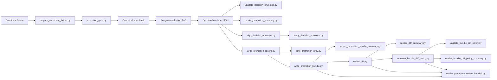
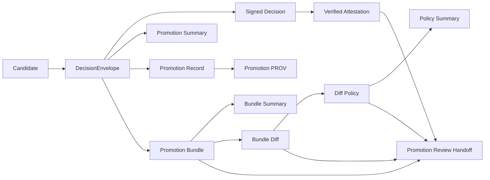

<!-- [KFM_META_BLOCK_V2]
doc_id: kfm://doc/NEEDS-VERIFICATION
title: Promotion Gate (A–G)
type: standard
version: v1
status: draft
owners: @bartytime4life
created: YYYY-MM-DD
updated: 2026-04-13
policy_label: public
related: [../../../contracts/README.md, ../../../schemas/promotion/decision-envelope.schema.json, ../../../schemas/promotion/promotion-record.schema.json, ../../../schemas/promotion/promotion-prov.schema.json, ../../../schemas/promotion/promotion-bundle.schema.json, ../../../schemas/promotion/promotion-bundle-diff-policy.schema.json, ../../../policy/README.md, ../../../policy/promotion_bundle_diff_policy.json, ../../../data/receipts/README.md, ../../../data/proofs/README.md, ../../../data/catalog/stac/README.md, ../../../data/catalog/dcat/README.md, ../../../data/catalog/prov/README.md, ../../../tests/README.md, ../../../tests/validators/test_promotion_gate_e2e.py, ../../../tests/validators/test_bundle_diff_policy.py, ../../../tests/validators/test_validate_bundle_diff_policy.py, ../../../tests/ci/test_render_promotion_review_handoff.py, ../../../tools/ci/render_promotion_summary.py, ../../../tools/ci/render_promotion_bundle_summary.py, ../../../tools/ci/render_diff_summary.py, ../../../tools/ci/render_bundle_diff_policy_summary.py, ../../../tools/ci/render_promotion_review_handoff.py, ../../../tools/diff/stable_diff.py, ../../../tools/catalog/catalog_crosslink.py, ../../../.github/workflows/README.md]
tags: [kfm, validators, promotion, governance, evidence, ci, diff-policy, review-handoff]
notes: [Updated to reflect the promotion bundle diff-policy thin slice plus the downstream composed promotion-review handoff artifact, including checked-in policy JSON, schema validation, prior/current bundle diff review, reviewer-facing policy summaries, and a single steward-facing handoff document. Active-branch inventory, exact workflow wiring, and merge-blocking enforcement still require direct verification where not proven by mounted files.]
[/KFM_META_BLOCK_V2] -->

# Promotion Gate (A–G)

Fail-closed, evidence-first promotion validation for KFM release candidates.

> **Status:** experimental  
> **Owners:** `@bartytime4life`  
>       
> **Quick jumps:** [Scope](#scope) • [Repo fit](#repo-fit) • [Inputs](#inputs) • [Exclusions](#exclusions) • [Directory tree](#directory-tree) • [Decision contract](#decision-contract) • [Gate matrix](#gate-matrix-ag) • [Execution flow](#execution-flow) • [Quickstart](#quickstart) • [Outputs](#outputs) • [Trust chain](#trust-chain) • [Policy evaluation](#policy-evaluation) • [CI integration](#ci-integration) • [Tests](#tests) • [FAQ](#faq)

> [!IMPORTANT]
> This document defines both a **validator contract** and the current **executable thin-slice surface** for promotion validation. It does **not** by itself prove that all mounted paths, workflows, schemas, or merge-blocking integrations are present on the active branch. Exact executable paths, schema locations, and enforcement posture remain **NEEDS VERIFICATION** where not directly confirmed.

> [!TIP]
> **Current executable snapshot (thin slice)**  
> The current documented thin slice for this lane includes the following executable and contract-bearing surfaces:
>
> **Core gate execution**
> - `tools/validators/promotion_gate/prepare_candidate_fixture.py`
> - `tools/validators/promotion_gate/promotion_gate.py`
> - `tools/validators/promotion_gate/validate_decision_envelope.py`
>
> **Derived trust objects**
> - `tools/validators/promotion_gate/write_promotion_record.py`
> - `tools/validators/promotion_gate/validate_promotion_record.py`
> - `tools/validators/promotion_gate/emit_promotion_prov.py`
> - `tools/validators/promotion_gate/validate_promotion_prov.py`
> - `tools/validators/promotion_gate/write_promotion_bundle.py`
> - `tools/validators/promotion_gate/validate_promotion_bundle.py`
>
> **Bundle diff-policy helpers**
> - `tools/validators/promotion_gate/evaluate_bundle_diff_policy.py`
> - `tools/validators/promotion_gate/validate_bundle_diff_policy.py`
>
> **Reviewer / auditor outputs**
> - `tools/ci/render_promotion_summary.py`
> - `tools/ci/render_promotion_bundle_summary.py`
> - `tools/ci/render_diff_summary.py`
> - `tools/ci/render_bundle_diff_policy_summary.py`
> - `tools/ci/render_promotion_review_handoff.py`
>
> **Attestation helpers**
> - `tools/attest/sign_decision_envelope.py`
> - `tools/attest/verify_decision_envelope.py`
>
> **Comparison and closure helpers consumed by this lane**
> - `tools/diff/stable_diff.py`
> - `tools/catalog/catalog_crosslink.py`
>
> **Policy and schema surfaces**
> - `tools/validators/promotion_gate/policies/*.rego`
> - `schemas/promotion/decision-envelope.schema.json`
> - `schemas/promotion/promotion-record.schema.json`
> - `schemas/promotion/promotion-prov.schema.json`
> - `schemas/promotion/promotion-bundle.schema.json`
> - `schemas/promotion/promotion-bundle-diff-policy.schema.json`
> - `policy/promotion_bundle_diff_policy.json`
>
> **Thin-slice tests**
> - `tests/validators/test_promotion_gate_e2e.py`
> - `tests/validators/test_bundle_diff_policy.py`
> - `tests/validators/test_validate_bundle_diff_policy.py`
> - `tests/ci/test_render_promotion_review_handoff.py`
>
> Keep this block synchronized with the mounted implementation as additional scripts, schemas, or trust objects land.

---

## Scope

This lane decides whether a release candidate is promotable under KFM governance. It validates the candidate, emits a machine-readable decision, and routes the result into governed review. It is **not** the act of publication.

This README serves two purposes at once:

1. a **normative lane contract** for promotion decisions; and  
2. an **implementation-facing directory README** for the executable thin slice scaffolded under this path.

| Posture | Meaning in this document |
|---|---|
| **CONFIRMED** | KFM requires typed contracts, evidence-bearing release objects, policy-visible decisions, catalog closure, and fail-closed behavior. |
| **PROPOSED** | Some exact field choices, helper names, and wider thin-slice growth below. |
| **UNKNOWN / NEEDS VERIFICATION** | Mounted validator code, workflow enforcement, exact branch inventory, and any deeper integration not directly confirmed. |

---

## Repo fit

**Path (INFERRED):** `tools/validators/promotion_gate/README.md`

**Lane:** `tools/validators/`  
**Role:** deterministic validation surface for governed promotion decisions

### Upstream inputs

- shared release contracts
- shared schemas
- policy bundles and reason / obligation vocabularies
- receipts from candidate-producing runs
- proofs and attestations
- catalog closure objects across STAC / DCAT / PROV
- candidate fixtures in `tests/fixtures/promotion/`
- geospatial candidate assets in `data/work/...`
- prior/current bundle diff results for governed review visibility
- checked-in diff-policy classification data

### Downstream consumers

- reviewer approval flows
- release and correction workflows
- CI summaries and annotations
- promotion records and rollback preparation
- release pipelines that require a machine-readable promotion decision
- reviewer-facing prior/current bundle change review
- diff-policy classification for release-significant drift
- composed steward-facing handoff documents derived from bundle, diff, and diff-policy artifacts

### Role in the system

- sits **after** candidate assembly
- sits **before** governed publication
- emits a **DecisionEnvelope**
- derives record / PROV / bundle trust objects
- supports prior/current bundle comparison and classification
- feeds reviewer-facing summaries and a composed review handoff
- must not become a hidden direct-publish shortcut

---

## Inputs

Accepted inputs are the minimum evidence-bearing objects required to judge one promotion candidate.

| Input | Required | Purpose |
|---|---:|---|
| `candidate_id` | Yes | Stable identifier for the promoted subject. |
| `spec_path` or equivalent canonical source | Yes | Source bytes used to compute the candidate `spec_hash`. |
| `declared_spec_hash` | Yes | Declared canonical hash for the candidate. |
| `release_manifest` or equivalent | Yes | Declares what outward release would contain. |
| `assets[]` with checksums | Yes | Binds reviewed asset inventory to exact bytes. |
| `catalog_refs` / `catalog_closure` | Yes | Links the candidate to STAC / DCAT / PROV closure. |
| `run_receipt` | Yes | Carries machine-checkable execution facts. |
| `attestation_refs` | Yes | Carries integrity and origin evidence. |
| `policy_label` / policy context | Yes | Supplies classification and governance context. |
| `review` | Yes | Carries approval state and steward identity. |
| `rollback` / prior release reference | Yes for promotable release | Preserves reversal and supersession visibility. |
| `ai_receipt` | Conditional | Required when model mediation affected the candidate. |
| `diff_artifact` | Conditional | Required when change visibility matters materially. |
| `correction_notice_ref` | Conditional | Required when the candidate supersedes or narrows a prior release. |
| `prior_bundle` | Conditional | Needed when governed prior/current bundle review is enabled. |
| `bundle_diff_policy` | Conditional | Needed when bundle diff policy classification is part of the review path. |

### Current thin-slice file inputs

| Input | Expected path family |
|---|---|
| candidate fixture | `tests/fixtures/promotion/*.json` |
| spec file | `data/work/.../stac-item.json` |
| asset files | `data/work/.../assets/*` |
| policy bundle | `tools/validators/promotion_gate/policies/*.rego` |
| decision schema | `schemas/promotion/decision-envelope.schema.json` |
| record schema | `schemas/promotion/promotion-record.schema.json` |
| PROV schema | `schemas/promotion/promotion-prov.schema.json` |
| bundle schema | `schemas/promotion/promotion-bundle.schema.json` |
| bundle diff-policy schema | `schemas/promotion/promotion-bundle-diff-policy.schema.json` |
| bundle diff-policy file | `policy/promotion_bundle_diff_policy.json` |
| prior/current diff report | `promotion-bundle-diff.json` or equivalent |
| diff-policy report | `promotion-bundle-diff-policy.json` or equivalent |
| composed review handoff inputs | `promotion-bundle.json` + `promotion-bundle-diff.json` + `promotion-bundle-diff-policy.json` |

---

## Exclusions

This lane does **not**:

- publish artifacts directly
- merge branches directly
- replace domain-specific validation in hydrology, hazards, soils, or other subject lanes
- stand in for runtime answer accountability such as `RuntimeResponseEnvelope`
- redefine schemas or policy owned elsewhere
- convert a prose README into proof that implementation already exists
- embed governance authority in helpers where policy should remain the source of truth
- compute general diff law inside policy renderers
- turn CI presentation helpers into policy authority
- replace underlying machine artifacts with one composed Markdown reviewer handoff

---

## Directory tree

```text
# Thin executable slice documented here — broader inventory still NEEDS VERIFICATION against active branch

tools/validators/promotion_gate/
├── README.md
├── promotion_gate.py
├── prepare_candidate_fixture.py
├── validate_decision_envelope.py
├── validate_promotion_record.py
├── validate_promotion_prov.py
├── validate_promotion_bundle.py
├── write_promotion_record.py
├── write_promotion_bundle.py
├── emit_promotion_prov.py
├── evaluate_bundle_diff_policy.py
├── validate_bundle_diff_policy.py
├── policies/
│   ├── a_identity.rego
│   ├── b_integrity.rego
│   ├── c_geometry.rego
│   ├── d_temporal.rego
│   ├── e_policy.rego
│   ├── f_proof.rego
│   ├── g_review.rego
│   └── promotion.rego
```

Related surfaces:

```text
tools/attest/sign_decision_envelope.py
tools/attest/verify_decision_envelope.py
tools/diff/stable_diff.py
tools/catalog/catalog_crosslink.py
tools/ci/render_promotion_summary.py
tools/ci/render_promotion_bundle_summary.py
tools/ci/render_diff_summary.py
tools/ci/render_bundle_diff_policy_summary.py
tools/ci/render_promotion_review_handoff.py
policy/promotion_bundle_diff_policy.json
schemas/promotion/
tests/fixtures/promotion/
tests/validators/test_promotion_gate_e2e.py
tests/validators/test_bundle_diff_policy.py
tests/validators/test_validate_bundle_diff_policy.py
tests/ci/test_render_promotion_review_handoff.py
```

> [!NOTE]
> Shared contracts, schemas, and policy surfaces should remain authoritative in their own repo homes. This lane validates and consumes them; it does not replace them.

---

## Decision contract

Every promotion attempt must end in one finite result:

| Result | Meaning |
|---|---|
| `PROMOTE` | Candidate satisfied all required gates and may proceed to governed release flow. |
| `ABSTAIN` | Evidence is insufficient to promote safely, but no direct contradiction has been proven. |
| `DENY` | Candidate failed one or more required gates. |
| `ERROR` | The gate could not safely evaluate due to parse, execution, or other fail-closed faults. |

> [!WARNING]
> A `PROMOTE` result does **not** publish directly. It means the candidate is valid for the governed review / release path.

### Gate status vocabulary

Each gate emits its own status:

| Status | Meaning |
|---|---|
| `PASS` | Required checks for that gate succeeded. |
| `FAIL` | The gate found a concrete promotability violation. |
| `SKIP` | The gate was not applicable or not yet implemented. |
| `ERROR` | The gate could not safely evaluate due to parse or execution failure. |

### Bundle diff-policy vocabulary

The current thin-slice bundle-diff policy layer classifies prior/current bundle key drift into:

| Classification | Meaning |
|---|---|
| `informational` | expected or non-blocking by current policy |
| `review` | trust-visible or otherwise review-significant |
| `blocking` | release-significant drift that must not pass silently |

These are **review classifications**, not a replacement for the main promotion decision grammar.

---

## Outputs

This lane emits a **DecisionEnvelope**, not a `RuntimeResponseEnvelope`.

### Minimum output shape

```yaml
decision: PROMOTE | ABSTAIN | DENY | ERROR
candidate_id: string
spec_hash: string
prior_spec_hash: string?
release_ref: string?
steward_id: string?
reason_codes: []
obligations: []
gates:
  - gate: A
    status: PASS | FAIL | SKIP | ERROR
    details: []
generated_at: RFC3339 timestamp
```

### Output intent

| Field | Purpose |
|---|---|
| `decision` | Finite machine-readable promotion result. |
| `candidate_id` | Stable subject the decision applies to. |
| `spec_hash` | Canonical identity anchor for the candidate spec. |
| `prior_spec_hash` | Rollback / supersession anchor for the prior release. |
| `reason_codes` | Explicit failure, abstention, or error reasons. |
| `obligations` | Required follow-up actions before promotion can continue. |
| `gates[]` | Per-gate results for reviewer and CI visibility. |
| `generated_at` | Time the decision was produced. |

### Secondary and derived outputs

The current thin slice may also emit:

| Object | Purpose |
|---|---|
| `promotion-summary.md` | reviewer-readable summary of the DecisionEnvelope |
| `promotion-record.json` | compact promotion ledger entry derived from the decision |
| `promotion-prov.json` | minimal PROV document derived from the promotion record |
| `promotion-bundle.json` | index of the full governed promotion artifact set |
| `promotion-bundle-summary.md` | reviewer / auditor summary of the full bundle |
| `decision-sign-result.json` | signing command result |
| `decision-verify-result.json` | attestation verification result |
| `promotion-bundle-diff.json` | prior/current bundle diff report |
| `promotion-bundle-diff-summary.md` | reviewer-facing diff summary |
| `promotion-bundle-diff-policy.json` | machine-readable policy classification of bundle drift |
| `promotion-bundle-diff-policy-summary.md` | reviewer-facing policy summary for bundle drift |
| `promotion-review-handoff.md` | composed steward-facing review document derived from bundle, diff, diff-policy, and attestation visibility |

---

## Gate matrix (A–G)

| Gate | Name | What it checks | Minimum evidence |
|---|---|---|---|
| **A** | Identity & closure | Stable identifier, canonical `spec_hash`, required STAC identity fields, immutable target intent. | `candidate_id`, spec bytes, declared hash, release subject identity. |
| **B** | Asset integrity | Every declared asset exists, is checksummed, and matches reviewed bytes. | `assets[]`, checksums, manifest / STAC asset linkage. |
| **C** | Geometry & CRS invariants | Geometry validity, CRS allowlist, bbox consistency, deterministic generalization, sane geometric summaries. | Geometry-bearing assets, CRS metadata, bbox, generalization parameters when applicable. |
| **D** | Temporal & coverage semantics | Valid intervals, coherent spatial / temporal coverage, freshness declarations where required. | Time fields, coverage metadata, source-aligned scope declarations. |
| **E** | Rights, sensitivity, and policy | License, rights, policy label, sensitivity handling, deny-by-default for unknown or missing classification. | Rights metadata, policy label, reviewable classification context. |
| **F** | Provenance, proofs, and receipts | Receipts present, attestations validate, proof hashes match, catalog / provenance closure is coherent. | `run_receipt`, `attestation_refs`, `catalog_refs`, proof objects. |
| **G** | Reviewer intent & rollback readiness | Approval present, steward recorded, rollback target exists, supersession is visible and reversible. | `review`, prior release reference, correction / rollback posture, immutable version / tag intent. |

### Gate-to-outcome collapse

| Condition | Final decision |
|---|---|
| all required gates `PASS` | `PROMOTE` |
| one or more required gates `FAIL` | `DENY` |
| insufficient evidence but no contradiction | `ABSTAIN` |
| evaluator or gate error | `ERROR` |

---

## Execution flow



### Execution steps

1. Load the candidate and canonical spec bytes.
2. Compute `spec_hash`.
3. Normalize fixture hashes where needed.
4. Validate gate inputs and shared contracts.
5. Evaluate Gates A–G in deterministic order.
6. Emit per-gate statuses.
7. Collapse the result to one finite `decision`.
8. Validate the decision against schema.
9. Render reviewer-readable output where needed.
10. Optionally sign and verify the decision.
11. Derive record, PROV, and bundle objects.
12. Optionally compare prior/current bundles.
13. Classify bundle drift using checked-in diff policy.
14. Render reviewer-facing diff and policy summaries.
15. Optionally compose one steward-facing review handoff document from bundle, diff, and diff-policy artifacts.
16. Route the result into governed review or rework.

---

## Trust chain

The current thin slice now supports a fuller governed promotion evidence chain.



### Trust object split

| Surface | Role |
|---|---|
| `decision.json` | finite machine-readable decision |
| `decision-sign-result.json` | receipt-like signing outcome |
| `decision-verify-result.json` | receipt-like verification outcome |
| `promotion-record.json` | compact governed ledger entry |
| `promotion-prov.json` | provenance activity for promotion |
| `promotion-bundle.json` | bundle manifest indexing the full promotion artifact set |
| `promotion-bundle-diff.json` | deterministic prior/current comparison report |
| `promotion-bundle-diff-policy.json` | reviewed interpretation layer for changed keys |
| `promotion-review-handoff.md` | composed reviewer-facing document derived from, but not replacing, the underlying machine artifacts |

> [!NOTE]
> This preserves KFM’s **receipts vs proofs** doctrine: receipts capture process memory; proofs and release-significant trust objects remain separately identifiable. The diff-policy layer interprets change visibility; it does not replace the release decision itself. The review handoff document is a derived steward convenience surface, not a new authoritative machine object.

---

## Catalog closure

Minimal closure expectations are not decorative metadata checks. They are release-scope identity checks.

| Surface | Minimum expectation |
|---|---|
| **STAC** | Release-bearing item or collection for the outward spatial or spatiotemporal assets. |
| **DCAT** | Dataset / distribution discovery for the same promoted subject. |
| **PROV** | Lineage linking entity, activity, and agent for the same outward release. |
| **Cross-surface rule** | STAC, DCAT, and PROV must agree on subject identity, scope, and correction posture. |

---

## Quickstart

### 1. Prepare fixture hashes

```bash
python tools/validators/promotion_gate/prepare_candidate_fixture.py \
  tests/fixtures/promotion/candidate.runtime.json
```

### 2. Run the promotion gate

```bash
python tools/validators/promotion_gate/promotion_gate.py \
  tests/fixtures/promotion/candidate.runtime.json \
  > decision.json
```

### 3. Validate the decision envelope

```bash
python tools/validators/promotion_gate/validate_decision_envelope.py \
  schemas/promotion/decision-envelope.schema.json \
  decision.json
```

### 4. Render reviewer summary

```bash
python tools/ci/render_promotion_summary.py \
  decision.json \
  --output promotion-summary.md
```

### 5. Write the promotion record

```bash
python tools/validators/promotion_gate/write_promotion_record.py \
  decision.json \
  --output promotion-record.json \
  --summary-ref "artifact://promotion-summary.md"
```

### 6. Emit promotion PROV

```bash
python tools/validators/promotion_gate/emit_promotion_prov.py \
  promotion-record.json \
  --output promotion-prov.json
```

### 7. Write the promotion bundle

```bash
python tools/validators/promotion_gate/write_promotion_bundle.py \
  --decision decision.json \
  --summary promotion-summary.md \
  --record promotion-record.json \
  --prov promotion-prov.json \
  --output promotion-bundle.json
```

### 8. Render bundle summary

```bash
python tools/ci/render_promotion_bundle_summary.py \
  promotion-bundle.json \
  --output promotion-bundle-summary.md
```

### 9. Diff prior/current promotion bundles

```bash
python tools/diff/stable_diff.py \
  --left promotion-bundle.previous.json \
  --right promotion-bundle.json \
  --output promotion-bundle-diff.json
```

### 10. Render diff summary

```bash
python tools/ci/render_diff_summary.py \
  promotion-bundle-diff.json \
  --output promotion-bundle-diff-summary.md
```

### 11. Validate checked-in diff policy

```bash
python tools/validators/promotion_gate/validate_bundle_diff_policy.py \
  schemas/promotion/promotion-bundle-diff-policy.schema.json \
  policy/promotion_bundle_diff_policy.json
```

### 12. Evaluate bundle diff policy

```bash
python tools/validators/promotion_gate/evaluate_bundle_diff_policy.py \
  promotion-bundle-diff.json \
  --policy policy/promotion_bundle_diff_policy.json \
  --output promotion-bundle-diff-policy.json
```

### 13. Render diff-policy summary

```bash
python tools/ci/render_bundle_diff_policy_summary.py \
  promotion-bundle-diff-policy.json \
  --output promotion-bundle-diff-policy-summary.md
```

### 14. Render composed promotion review handoff

```bash
python tools/ci/render_promotion_review_handoff.py \
  --bundle promotion-bundle.json \
  --diff promotion-bundle-diff.json \
  --diff-policy promotion-bundle-diff-policy.json \
  --output promotion-review-handoff.md
```

---

## Policy evaluation

Policy authority belongs in Rego or other checked-in governed surfaces. Python should orchestrate, collect, and render, but not silently redefine governance.

### Illustrative policy split

```text
policies/
├── a_identity.rego
├── b_integrity.rego
├── c_geometry.rego
├── d_temporal.rego
├── e_policy.rego
├── f_proof.rego
├── g_review.rego
└── promotion.rego
```

### Current checked-in diff-policy surface

```text
policy/
└── promotion_bundle_diff_policy.json

schemas/promotion/
└── promotion-bundle-diff-policy.schema.json
```

### Illustrative policy example

```rego
package promotion.e_policy

default allow = false

allowed_labels := {"public", "internal", "restricted"}

allow {
  input.policy_label
  allowed_labels[input.policy_label]
  input.rights.license != ""
}

deny contains "policy.label_missing" if {
  not input.policy_label
}

deny contains "policy.unknown_label" if {
  input.policy_label
  not allowed_labels[input.policy_label]
}

deny contains "policy.rights_missing" if {
  not input.rights.license
}
```

### Diff-policy rule shape

The current checked-in bundle-diff policy file classifies keys into:

- `informational`
- `review`
- `blocking`

Unknown keys default to `review` under the current thin slice, preserving reviewer attention rather than silently accepting unfamiliar drift.

---

## CI integration

Illustrative workflow wiring for the fuller thin slice:

```yaml
- name: Prepare candidate fixture
  run: |
    python tools/validators/promotion_gate/prepare_candidate_fixture.py \
      tests/fixtures/promotion/candidate.runtime.json

- name: Run promotion gate
  run: |
    python tools/validators/promotion_gate/promotion_gate.py \
      tests/fixtures/promotion/candidate.runtime.json \
      > decision.json

- name: Validate decision schema
  run: |
    python tools/validators/promotion_gate/validate_decision_envelope.py \
      schemas/promotion/decision-envelope.schema.json \
      decision.json

- name: Render summary
  run: |
    python tools/ci/render_promotion_summary.py \
      decision.json \
      --output promotion-summary.md

- name: Write promotion record
  run: |
    python tools/validators/promotion_gate/write_promotion_record.py \
      decision.json \
      --output promotion-record.json \
      --summary-ref "artifact://promotion-summary.md"

- name: Emit promotion PROV
  run: |
    python tools/validators/promotion_gate/emit_promotion_prov.py \
      promotion-record.json \
      --output promotion-prov.json

- name: Write promotion bundle
  run: |
    python tools/validators/promotion_gate/write_promotion_bundle.py \
      --decision decision.json \
      --summary promotion-summary.md \
      --record promotion-record.json \
      --prov promotion-prov.json \
      --output promotion-bundle.json

- name: Render promotion bundle summary
  run: |
    python tools/ci/render_promotion_bundle_summary.py \
      promotion-bundle.json \
      --output promotion-bundle-summary.md

- name: Diff prior/current promotion bundles
  run: |
    python tools/diff/stable_diff.py \
      --left promotion-bundle.previous.json \
      --right promotion-bundle.json \
      --output promotion-bundle-diff.json

- name: Render promotion bundle diff summary
  run: |
    python tools/ci/render_diff_summary.py \
      promotion-bundle-diff.json \
      --output promotion-bundle-diff-summary.md

- name: Validate promotion bundle diff policy schema
  run: |
    python tools/validators/promotion_gate/validate_bundle_diff_policy.py \
      schemas/promotion/promotion-bundle-diff-policy.schema.json \
      policy/promotion_bundle_diff_policy.json

- name: Evaluate promotion bundle diff policy
  run: |
    python tools/validators/promotion_gate/evaluate_bundle_diff_policy.py \
      promotion-bundle-diff.json \
      --policy policy/promotion_bundle_diff_policy.json \
      --output promotion-bundle-diff-policy.json

- name: Render promotion bundle diff policy summary
  run: |
    python tools/ci/render_bundle_diff_policy_summary.py \
      promotion-bundle-diff-policy.json \
      --output promotion-bundle-diff-policy-summary.md

- name: Render promotion review handoff
  run: |
    python tools/ci/render_promotion_review_handoff.py \
      --bundle promotion-bundle.json \
      --diff promotion-bundle-diff.json \
      --diff-policy promotion-bundle-diff-policy.json \
      --output promotion-review-handoff.md

- name: Publish summaries
  run: |
    cat promotion-bundle-summary.md >> "$GITHUB_STEP_SUMMARY"
    cat promotion-bundle-diff-summary.md >> "$GITHUB_STEP_SUMMARY"
    cat promotion-bundle-diff-policy-summary.md >> "$GITHUB_STEP_SUMMARY"
    cat promotion-review-handoff.md >> "$GITHUB_STEP_SUMMARY"
```

---

## Tests

Run the end-to-end thin slice:

```bash
pytest -q tests/validators/test_promotion_gate_e2e.py
```

### What the current e2e slice covers

| Step | Verified |
|---|---|
| fixture preparation | hashes computed correctly |
| gate runner | decision envelope emitted |
| decision schema validation | envelope conforms to schema |
| summary rendering | Markdown reviewer output generated |
| failure path | checksum mismatch collapses to `DENY` |
| promotion record | compact ledger entry emitted |
| promotion record schema | record validates |
| promotion PROV | provenance emitted |
| promotion PROV schema | PROV validates |
| promotion bundle | bundle manifest emitted |
| promotion bundle schema | bundle validates |
| bundle summary | reviewer / auditor summary generated |
| bundle diff | prior/current bundle comparison emitted |
| diff summary | reviewer-facing diff summary generated |
| bundle diff policy | changed keys classified by checked-in policy |
| bundle diff policy schema | checked-in policy file validates against schema |
| bundle diff policy summary | reviewer-facing policy summary generated |
| review handoff compatibility | bundle, diff, and diff-policy outputs are available for downstream composed handoff rendering |

### Additional focused validator tests

```bash
pytest -q tests/validators/test_bundle_diff_policy.py
pytest -q tests/validators/test_validate_bundle_diff_policy.py
```

### Minimal Python dependencies

```text
pytest
jsonschema
```

---

## Fail-closed behavior

| Condition | Result |
|---|---|
| missing required input | `ERROR` |
| invalid decision schema | `ERROR` |
| integrity failure | `DENY` |
| insufficient proof or closure | `ABSTAIN` |
| all required gates pass | `PROMOTE` |
| invalid bundle diff-policy file | fail before policy evaluation continues |
| release-significant bundle drift classified as blocking | non-zero diff-policy evaluation result |

---

## Design principles

- **Deterministic** — same inputs should produce the same decision
- **Hash-anchored** — `spec_hash` is the identity root
- **Fail-closed** — no silent success on ambiguity
- **Policy-separated** — Rego and checked-in policy surfaces own governance authority
- **Reviewer-visible** — human-readable summaries are first-class
- **Receipt-safe** — receipts and proofs remain distinct trust surfaces
- **Trust-chain aware** — derived objects should preserve attestation state, execution identity, rollback linkage, prior/current change visibility, and downstream reviewer handoff compatibility

---

## Task list

- [ ] Shared promotion inputs validate against surfaced schemas.
- [ ] Candidate `spec_hash` is computed from canonicalized spec bytes.
- [ ] Asset checksums are required and verified.
- [ ] Geometry and CRS invariants are checked deterministically where applicable.
- [ ] STAC / DCAT / PROV closure resolves to the same promoted subject.
- [ ] Policy emits machine-readable reason codes.
- [ ] Proof objects and receipts stay distinct.
- [ ] Reviewer approval and rollback readiness are visible before promotion proceeds.
- [ ] A passing gate still routes through governed review; no silent direct publish path exists.
- [x] E2E thin-slice tests cover bundle diff and diff-policy review surfaces.
- [x] Signed-decision verification state is preserved through record, PROV, and bundle outputs where implemented.
- [x] Bundle diff policy is checked in as data rather than only Python constants.
- [x] Bundle diff policy file validates against a schema.
- [x] Downstream composed review handoff is documented as a derived reviewer surface.
- [ ] Keep review handoff rendering separate from validator-proof ownership in `tests/ci`.
- [ ] Promote bundle-summary rendering so raw diff + classified policy attention can be linked as one reviewer chain if desired.

---

## FAQ

### Does this gate publish artifacts?

No. It validates promotability and emits a decision object. Publication remains part of the governed release flow.

### Why not use `RuntimeResponseEnvelope` here?

Because promotion is a release decision, not a request-time answer surface. Promotion decisions belong in `DecisionEnvelope`.

### Does this replace domain QA?

No. Domain-specific validation still belongs in subject lanes. This gate sits above those checks and asks whether the candidate is fit for governed promotion.

### Why split Python and Rego?

Python handles orchestration, file preparation, derivation, and rendering. Rego and checked-in policy data hold governance logic. This keeps governance visible, reviewable, and less likely to drift into helper code.

### What is new in the current thin slice beyond the original gate flow?

In addition to decision, record, PROV, bundle, and attestation flow, the current thin slice now supports:

- prior/current bundle diff
- reviewer-facing diff rendering
- checked-in bundle diff-policy classification
- schema validation for the checked-in policy file
- reviewer-facing diff-policy summary rendering
- a composed promotion review handoff document derived from bundle, diff, diff-policy, and attestation visibility

### Is the directory layout already implemented?

The thin-slice helper set named in the snapshot block is treated here as current documented lane shape. Wider inventory, callers, and workflow enforcement still remain subject to repo verification where not directly proven.

### Is `promotion-review-handoff.md` an authoritative promotion object?

No. It is a reviewer-facing derived document. The authoritative machine objects remain the decision, record, PROV, bundle, diff, and diff-policy artifacts.

---

## Appendix

<details>
<summary><strong>Minimal invocation chain</strong></summary>

```bash
prepare → gate → validate → render → record → prov → bundle → bundle-summary → bundle-diff → diff-policy → review-handoff
```

</details>

<details>
<summary><strong>Illustrative candidate input</strong></summary>

```json
{
  "candidate_id": "overlay:floodplain-kansas",
  "spec_path": "data/work/overlays/floodplain-kansas/stac-item.json",
  "declared_spec_hash": "abc123",
  "assets": [
    {
      "href": "data/work/overlays/floodplain-kansas/assets/floodplain.geojson",
      "checksum": "def456"
    }
  ],
  "catalog_refs": {
    "stac": "kfm://catalog/stac/overlay/floodplain-kansas/v1",
    "dcat": "kfm://catalog/dcat/overlay/floodplain-kansas/v1",
    "prov": "kfm://catalog/prov/overlay/floodplain-kansas/v1"
  },
  "run_receipt": {
    "run_id": "run-2026-04-13-01"
  },
  "attestation_refs": [
    {
      "type": "dsse",
      "uri": "kfm://proof/overlay/floodplain-kansas/v1/attestation"
    }
  ],
  "policy_label": "public",
  "rights": {
    "license": "public-domain"
  },
  "review": {
    "approved": true,
    "steward_id": "steward:bartytime4life"
  },
  "rollback": {
    "prior_spec_hash": "priorhash123"
  }
}
```

</details>

<details>
<summary><strong>Illustrative decision output</strong></summary>

```json
{
  "decision": "DENY",
  "candidate_id": "overlay:floodplain-kansas",
  "spec_hash": "abc123",
  "prior_spec_hash": "priorhash123",
  "steward_id": "steward:bartytime4life",
  "reason_codes": [
    "integrity.asset_checksum_mismatch"
  ],
  "obligations": [],
  "gates": [
    {
      "gate": "A",
      "status": "PASS",
      "details": []
    },
    {
      "gate": "B",
      "status": "FAIL",
      "details": [
        "integrity.asset_checksum_mismatch"
      ]
    }
  ],
  "generated_at": "2026-04-13T00:00:00Z"
}
```

</details>

<details>
<summary><strong>Illustrative diff-policy file</strong></summary>

```json
{
  "policy_type": "kfm.promotion.bundle_diff_policy",
  "version": "v1",
  "default_classification": "review",
  "classifications": {
    "informational": [
      "generated_at",
      "recorded_at"
    ],
    "review": [
      "attestation_ref",
      "attestation_verified",
      "audit_ref",
      "ci_run_id",
      "gate_runner",
      "repo_ref",
      "release_ref"
    ],
    "blocking": [
      "bundle_type",
      "candidate_id",
      "decision",
      "spec_hash",
      "artifacts"
    ]
  }
}
```

</details>

<details>
<summary><strong>Illustrative downstream review handoff role</strong></summary>

The composed review handoff should remain a **derived reviewer surface** built from:

- `promotion-bundle.json`
- `promotion-bundle-diff.json`
- `promotion-bundle-diff-policy.json`
- attestation visibility already preserved in upstream artifacts

It should help a steward review promotion state quickly without replacing the underlying machine artifacts.

</details>

[Back to top](#promotion-gate-ag)
